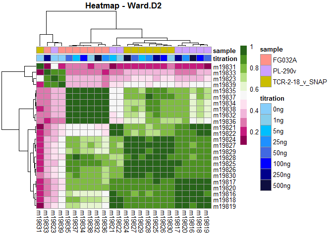

---
title: "GSC-1790 Data Type Conversion" 
author: Nikita Telkar 
date: "May 19, 2020"
output: 
  html_document: 
    keep_md: yes 
    toc: true 
    toc_depth: 4
    toc_float: 
      collapsed: false 
      smooth_scroll: false 
    theme: cosmo  #cosmo, paper, lumen, sandstone, simplex, yeti; cerulean, journal, flatly, darkly, readable, spacelab, united
    highlight: zenburn #tango, pygments, kate, monochrome, espresso, zenburn, haddock, textmate.
--- 


 ***

###  Introduction 

Here, I'll generate BAM and count matrix files from the raw FASTQ files for the GSC-1790 test samples run. I'll also generate some plots to visualise the data 

 ***

###  1.0 Loading Packages and Path/Package Corrections   


```r
library(tidyverse)
library(dplyr)
library(plyr)
library(here) 
library(rmarkdown)
library(knitr)
library(stringr)
library(DT)
library(kableExtra)
library(formatR)
library(Rsamtools)
library(Rsubread)
library(pheatmap)
library(RColorBrewer)
library(biomaRt)
library(extrafont)
loadfonts(device = "win")


if( Sys.info()['sysname'] == "Linux" ) {
  fas <- library(fastqcr)
} else {
    fas <- "library(fastqcr)"
} #load package fastqcr only if operating system is Unix

if( Sys.info()['sysname'] == "Linux" ) {
  path <- "/home/BCRICWH.LAN/nikita.telkar/RobinsonLab/Nikita/Projects/cell_sorted/Images/Phred_Scores.png"
} else {
    path <- "Z:\\Nikita\\Projects\\cell_sorted\\Images\\Phred_Scores.png"
} #filepath dependancy on operating system
```


```r
knitr::opts_chunk$set(tidy.opts=list(width.cutoff=50),tidy=TRUE)

colpal1 <- c("#148eff", "#ff61ad", "#ffae00")
colpal2 <- c("#801361", "#e44c4a", "#ffb708")
colour_pal <- brewer.pal(11, "PiYG")
```


 ***

###  2.0 Loading Data  

I'll be using the `Rsubread` package, since it is the only one that is compatible to be working in R.


```r
bam_files <- (here::here("data", "external", "Cell_Sorted_Test_Samples_08042020_GSC1790", 
    "All_BAM_files"))

bam.files <- list.files(path = "Z:/Nikita/Projects/cell_sorted/data/external/Cell_Sorted_Test_Samples_08042020_GSC1790/All_BAM_files", 
    full.names = TRUE)

fastq_files <- (here::here("data", "external", "Cell_Sorted_Test_Samples_08042020_GSC1790", 
    "All_fastq_files"))

# buildindex(basename='hg38_ref',
# reference=here('GRCh38_latest_genomic.fna.gz'))
```

 ***  

###  2.0 Generating Count Matrix   

I'll be using the `featureCounts` function fro the `Rsubread` package.   


```r
# props <- propmapped(files=bam_files)
fc <- featureCounts(bam.files, annot.inbuilt = "hg38")  #GSC control samples took longer to run/process
```


```r
names(fc)
```

```
## [1] "counts"     "annotation" "targets"    "stat"
```

```r
count_stats <- fc$stat
count_stats$Status
```

```
##  [1] "Assigned"                      "Unassigned_Unmapped"          
##  [3] "Unassigned_Read_Type"          "Unassigned_Singleton"         
##  [5] "Unassigned_MappingQuality"     "Unassigned_Chimera"           
##  [7] "Unassigned_FragmentLength"     "Unassigned_Duplicate"         
##  [9] "Unassigned_MultiMapping"       "Unassigned_Secondary"         
## [11] "Unassigned_NonSplit"           "Unassigned_NoFeatures"        
## [13] "Unassigned_Overlapping_Length" "Unassigned_Ambiguity"
```

```r
eDat <- fc$counts  #row names are Entrez gene IDs

eDat_extra <- fc$annotation
names(eDat_extra)
```

```
## [1] "GeneID" "Chr"    "Start"  "End"    "Strand" "Length"
```

```r
head(eDat_extra, n = 2)
```

```
##      GeneID                                                    Chr
## 1 100287102                                         chr1;chr1;chr1
## 2    653635 chr1;chr1;chr1;chr1;chr1;chr1;chr1;chr1;chr1;chr1;chr1
##                                                               Start
## 1                                                 11874;12613;13221
## 2 14362;14970;15796;16607;16858;17233;17606;17915;18268;24738;29321
##                                                                 End
## 1                                                 12227;12721;14409
## 2 14829;15038;15947;16765;17055;17368;17742;18061;18366;24891;29370
##                  Strand Length
## 1                 +;+;+   1652
## 2 -;-;-;-;-;-;-;-;-;-;-   1769
```

 ***  

###  3.0 Data Preprocessing    


```r
genes <- row.names(eDat)

#shortening sample names
samples <- as.data.frame(colnames(eDat))
samples$`colnames(eDat)` <- str_sub(samples$`colnames(eDat)`, 1, 6)
samples <- samples$`colnames(eDat)`

colnames(eDat) <- samples
row.names(eDat) <- genes


eDat_mat <- eDat #keeping in matrix form

eDat <- as.data.frame(eDat)
dim(eDat) #28395 24
```

```
## [1] 28395    24
```

```r
eDat2 <- eDat %>%  #removing sequences with less than 1 read count across all samples
  rownames_to_column(var = "entrezgene_id") %>% 
  mutate(Sum = rowSums(.[2:25])) %>%  
  filter(Sum >= 1) %>% 
  column_to_rownames(var = "entrezgene_id")

dim(eDat2) #22938  25
```

```
## [1] 22938    25
```

```r
eDat2_mat <- as.matrix(eDat2)

eDat_extra$GeneID <- as.character(eDat_extra$GeneID)

head(eDat, n=3)
```

```
##           m19816 m19817 m19818 m19819 m19820 m19821 m19822 m19823 m19824 m19825
## 100287102      0      0      0      1      0      1      0      0      0      0
## 653635         0      0      2      0      1      1      0      0      0      1
## 102466751      0      0      0      0      0      0      0      0      0      0
##           m19826 m19827 m19828 m19829 m19830 m19831 m19832 m19833 m19834 m19835
## 100287102      0      0      0      0      0      0      0      0      0      0
## 653635         1      1      1      1      0      0      0      4      0      1
## 102466751      0      0      0      0      0      0      0      0      0      0
##           m19836 m19837 m19838 m19839
## 100287102      0      0      1      0
## 653635         0      1      1      0
## 102466751      0      0      0      0
```

When sequences that have zero counts (i.e. no recorded expression) across all 24 samples were removed, the number of sequences reduced from 28,395 to 22,938 (5457 sequences had counts of less than 1).  


```r
pDat <- as.data.frame(samples)
colnames(pDat)[1] <- "GSC_ID"
pDat$titration <- c("500ng", "250ng", "100ng", "50ng", 
    "25ng", "5ng", "1ng", "0ng")
pDat <- pDat %>% dplyr::arrange(titration)
pDat$sample <- c("PL-290v", "TCR-2-18_v_SNAP", "FG032A")
pDat$trimester <- c("first", "term", "term")
pDat <- pDat %>% dplyr::arrange(GSC_ID) %>% column_to_rownames(var = "GSC_ID")

head(pDat, n = 10)
```

```
##        titration          sample trimester
## m19816     500ng         PL-290v     first
## m19817     250ng         PL-290v     first
## m19818     100ng         PL-290v     first
## m19819      50ng         PL-290v     first
## m19820      25ng         PL-290v     first
## m19821       5ng         PL-290v     first
## m19822       1ng         PL-290v     first
## m19823       0ng         PL-290v     first
## m19824     500ng TCR-2-18_v_SNAP      term
## m19825     250ng TCR-2-18_v_SNAP      term
```

####  3.1 Using BiomaRt to get IDs    

The `featureCounts` function gives Entrez IDs, and so using the `biomaRt` package, I'll add the gene symbols.  


```r
ensembl = useMart("ensembl",dataset="hsapiens_gene_ensembl")

#getting all id names
identifiers <- getBM(attributes=c("entrezgene_id", "hgnc_symbol", "ensembl_gene_id"), 
                     values = genes, mart = ensembl) 


#some gene symbols don't have gene ids?
entrez <- getBM(attributes=c("entrezgene_id", "hgnc_symbol"), 
                     values = genes, mart = ensembl)
entrez$entrezgene_id <- as.character(entrez$entrezgene_id)
entrez <- entrez %>% #removing zero expression
  na_if("") %>%
  na.omit

#getting ncRNA info
nc_ids <- getBM(attributes=c("ensembl_gene_id", "refseq_ncrna", "refseq_ncrna_predicted"), 
                values = genes, mart = ensembl)


#emsembl ids are the most exhaustive list
all_ids <- identifiers %>% 
  inner_join(nc_ids, by = "ensembl_gene_id")

str(all_ids)
```

```
## 'data.frame':	87748 obs. of  5 variables:
##  $ entrezgene_id         : int  NA NA NA NA NA 4535 NA NA NA 4536 ...
##  $ hgnc_symbol           : chr  "MT-TF" "MT-RNR1" "MT-TV" "MT-RNR2" ...
##  $ ensembl_gene_id       : chr  "ENSG00000210049" "ENSG00000211459" "ENSG00000210077" "ENSG00000210082" ...
##  $ refseq_ncrna          : chr  "" "" "" "" ...
##  $ refseq_ncrna_predicted: chr  "" "" "" "" ...
```

```r
all_ids$entrezgene_id <- as.character(all_ids$entrezgene_id)
```

####  3.2 Making mDat   


```r
mDat <- eDat %>% rownames_to_column(var = "entrezgene_id") %>% 
    inner_join(entrez, by = "entrezgene_id") %>% dplyr::select("entrezgene_id", 
    "hgnc_symbol", everything())

mDat <- mDat %>% inner_join(eDat_extra, by = c(entrezgene_id = "GeneID"))

mDat[1:5, ] %>% kable() %>% kable_styling(bootstrap_options = c("striped", 
    "hover", "condensed"), full_width = F, fixed_thead = T)
```

<table class="table table-striped table-hover table-condensed" style="width: auto !important; margin-left: auto; margin-right: auto;">
 <thead>
  <tr>
   <th style="text-align:left;position: sticky; top:0; background-color: #FFFFFF;"> entrezgene_id </th>
   <th style="text-align:left;position: sticky; top:0; background-color: #FFFFFF;"> hgnc_symbol </th>
   <th style="text-align:right;position: sticky; top:0; background-color: #FFFFFF;"> m19816 </th>
   <th style="text-align:right;position: sticky; top:0; background-color: #FFFFFF;"> m19817 </th>
   <th style="text-align:right;position: sticky; top:0; background-color: #FFFFFF;"> m19818 </th>
   <th style="text-align:right;position: sticky; top:0; background-color: #FFFFFF;"> m19819 </th>
   <th style="text-align:right;position: sticky; top:0; background-color: #FFFFFF;"> m19820 </th>
   <th style="text-align:right;position: sticky; top:0; background-color: #FFFFFF;"> m19821 </th>
   <th style="text-align:right;position: sticky; top:0; background-color: #FFFFFF;"> m19822 </th>
   <th style="text-align:right;position: sticky; top:0; background-color: #FFFFFF;"> m19823 </th>
   <th style="text-align:right;position: sticky; top:0; background-color: #FFFFFF;"> m19824 </th>
   <th style="text-align:right;position: sticky; top:0; background-color: #FFFFFF;"> m19825 </th>
   <th style="text-align:right;position: sticky; top:0; background-color: #FFFFFF;"> m19826 </th>
   <th style="text-align:right;position: sticky; top:0; background-color: #FFFFFF;"> m19827 </th>
   <th style="text-align:right;position: sticky; top:0; background-color: #FFFFFF;"> m19828 </th>
   <th style="text-align:right;position: sticky; top:0; background-color: #FFFFFF;"> m19829 </th>
   <th style="text-align:right;position: sticky; top:0; background-color: #FFFFFF;"> m19830 </th>
   <th style="text-align:right;position: sticky; top:0; background-color: #FFFFFF;"> m19831 </th>
   <th style="text-align:right;position: sticky; top:0; background-color: #FFFFFF;"> m19832 </th>
   <th style="text-align:right;position: sticky; top:0; background-color: #FFFFFF;"> m19833 </th>
   <th style="text-align:right;position: sticky; top:0; background-color: #FFFFFF;"> m19834 </th>
   <th style="text-align:right;position: sticky; top:0; background-color: #FFFFFF;"> m19835 </th>
   <th style="text-align:right;position: sticky; top:0; background-color: #FFFFFF;"> m19836 </th>
   <th style="text-align:right;position: sticky; top:0; background-color: #FFFFFF;"> m19837 </th>
   <th style="text-align:right;position: sticky; top:0; background-color: #FFFFFF;"> m19838 </th>
   <th style="text-align:right;position: sticky; top:0; background-color: #FFFFFF;"> m19839 </th>
   <th style="text-align:left;position: sticky; top:0; background-color: #FFFFFF;"> Chr </th>
   <th style="text-align:left;position: sticky; top:0; background-color: #FFFFFF;"> Start </th>
   <th style="text-align:left;position: sticky; top:0; background-color: #FFFFFF;"> End </th>
   <th style="text-align:left;position: sticky; top:0; background-color: #FFFFFF;"> Strand </th>
   <th style="text-align:right;position: sticky; top:0; background-color: #FFFFFF;"> Length </th>
  </tr>
 </thead>
<tbody>
  <tr>
   <td style="text-align:left;"> 79501 </td>
   <td style="text-align:left;"> OR4F5 </td>
   <td style="text-align:right;"> 0 </td>
   <td style="text-align:right;"> 0 </td>
   <td style="text-align:right;"> 0 </td>
   <td style="text-align:right;"> 0 </td>
   <td style="text-align:right;"> 0 </td>
   <td style="text-align:right;"> 1 </td>
   <td style="text-align:right;"> 0 </td>
   <td style="text-align:right;"> 0 </td>
   <td style="text-align:right;"> 0 </td>
   <td style="text-align:right;"> 0 </td>
   <td style="text-align:right;"> 0 </td>
   <td style="text-align:right;"> 0 </td>
   <td style="text-align:right;"> 0 </td>
   <td style="text-align:right;"> 0 </td>
   <td style="text-align:right;"> 0 </td>
   <td style="text-align:right;"> 0 </td>
   <td style="text-align:right;"> 0 </td>
   <td style="text-align:right;"> 2 </td>
   <td style="text-align:right;"> 0 </td>
   <td style="text-align:right;"> 0 </td>
   <td style="text-align:right;"> 0 </td>
   <td style="text-align:right;"> 0 </td>
   <td style="text-align:right;"> 0 </td>
   <td style="text-align:right;"> 1 </td>
   <td style="text-align:left;"> chr1 </td>
   <td style="text-align:left;"> 69091 </td>
   <td style="text-align:left;"> 70008 </td>
   <td style="text-align:left;"> + </td>
   <td style="text-align:right;"> 918 </td>
  </tr>
  <tr>
   <td style="text-align:left;"> 729759 </td>
   <td style="text-align:left;"> OR4F29 </td>
   <td style="text-align:right;"> 0 </td>
   <td style="text-align:right;"> 0 </td>
   <td style="text-align:right;"> 0 </td>
   <td style="text-align:right;"> 0 </td>
   <td style="text-align:right;"> 0 </td>
   <td style="text-align:right;"> 0 </td>
   <td style="text-align:right;"> 0 </td>
   <td style="text-align:right;"> 0 </td>
   <td style="text-align:right;"> 0 </td>
   <td style="text-align:right;"> 0 </td>
   <td style="text-align:right;"> 0 </td>
   <td style="text-align:right;"> 0 </td>
   <td style="text-align:right;"> 0 </td>
   <td style="text-align:right;"> 0 </td>
   <td style="text-align:right;"> 0 </td>
   <td style="text-align:right;"> 0 </td>
   <td style="text-align:right;"> 0 </td>
   <td style="text-align:right;"> 0 </td>
   <td style="text-align:right;"> 0 </td>
   <td style="text-align:right;"> 0 </td>
   <td style="text-align:right;"> 0 </td>
   <td style="text-align:right;"> 0 </td>
   <td style="text-align:right;"> 0 </td>
   <td style="text-align:right;"> 0 </td>
   <td style="text-align:left;"> chr1 </td>
   <td style="text-align:left;"> 450740 </td>
   <td style="text-align:left;"> 451678 </td>
   <td style="text-align:left;"> - </td>
   <td style="text-align:right;"> 939 </td>
  </tr>
  <tr>
   <td style="text-align:left;"> 81399 </td>
   <td style="text-align:left;"> OR4F16 </td>
   <td style="text-align:right;"> 0 </td>
   <td style="text-align:right;"> 0 </td>
   <td style="text-align:right;"> 0 </td>
   <td style="text-align:right;"> 0 </td>
   <td style="text-align:right;"> 0 </td>
   <td style="text-align:right;"> 0 </td>
   <td style="text-align:right;"> 0 </td>
   <td style="text-align:right;"> 0 </td>
   <td style="text-align:right;"> 0 </td>
   <td style="text-align:right;"> 0 </td>
   <td style="text-align:right;"> 1 </td>
   <td style="text-align:right;"> 0 </td>
   <td style="text-align:right;"> 0 </td>
   <td style="text-align:right;"> 0 </td>
   <td style="text-align:right;"> 0 </td>
   <td style="text-align:right;"> 0 </td>
   <td style="text-align:right;"> 0 </td>
   <td style="text-align:right;"> 0 </td>
   <td style="text-align:right;"> 0 </td>
   <td style="text-align:right;"> 0 </td>
   <td style="text-align:right;"> 0 </td>
   <td style="text-align:right;"> 0 </td>
   <td style="text-align:right;"> 0 </td>
   <td style="text-align:right;"> 0 </td>
   <td style="text-align:left;"> chr1 </td>
   <td style="text-align:left;"> 685716 </td>
   <td style="text-align:left;"> 686654 </td>
   <td style="text-align:left;"> - </td>
   <td style="text-align:right;"> 939 </td>
  </tr>
  <tr>
   <td style="text-align:left;"> 148398 </td>
   <td style="text-align:left;"> SAMD11 </td>
   <td style="text-align:right;"> 0 </td>
   <td style="text-align:right;"> 1 </td>
   <td style="text-align:right;"> 0 </td>
   <td style="text-align:right;"> 0 </td>
   <td style="text-align:right;"> 0 </td>
   <td style="text-align:right;"> 0 </td>
   <td style="text-align:right;"> 0 </td>
   <td style="text-align:right;"> 0 </td>
   <td style="text-align:right;"> 0 </td>
   <td style="text-align:right;"> 1 </td>
   <td style="text-align:right;"> 0 </td>
   <td style="text-align:right;"> 0 </td>
   <td style="text-align:right;"> 0 </td>
   <td style="text-align:right;"> 1 </td>
   <td style="text-align:right;"> 0 </td>
   <td style="text-align:right;"> 0 </td>
   <td style="text-align:right;"> 0 </td>
   <td style="text-align:right;"> 5 </td>
   <td style="text-align:right;"> 1 </td>
   <td style="text-align:right;"> 0 </td>
   <td style="text-align:right;"> 0 </td>
   <td style="text-align:right;"> 0 </td>
   <td style="text-align:right;"> 0 </td>
   <td style="text-align:right;"> 0 </td>
   <td style="text-align:left;"> chr1;chr1;chr1;chr1;chr1;chr1;chr1;chr1;chr1;chr1;chr1;chr1;chr1;chr1 </td>
   <td style="text-align:left;"> 925741;925922;930155;931039;935772;939040;939275;941144;942136;942410;942559;943253;943698;943908 </td>
   <td style="text-align:left;"> 925800;926013;930336;931089;935896;939129;939460;941306;942251;942488;943058;943377;943808;944581 </td>
   <td style="text-align:left;"> +;+;+;+;+;+;+;+;+;+;+;+;+;+ </td>
   <td style="text-align:right;"> 2554 </td>
  </tr>
  <tr>
   <td style="text-align:left;"> 26155 </td>
   <td style="text-align:left;"> NOC2L </td>
   <td style="text-align:right;"> 0 </td>
   <td style="text-align:right;"> 0 </td>
   <td style="text-align:right;"> 0 </td>
   <td style="text-align:right;"> 1 </td>
   <td style="text-align:right;"> 1 </td>
   <td style="text-align:right;"> 0 </td>
   <td style="text-align:right;"> 0 </td>
   <td style="text-align:right;"> 0 </td>
   <td style="text-align:right;"> 0 </td>
   <td style="text-align:right;"> 1 </td>
   <td style="text-align:right;"> 0 </td>
   <td style="text-align:right;"> 0 </td>
   <td style="text-align:right;"> 0 </td>
   <td style="text-align:right;"> 0 </td>
   <td style="text-align:right;"> 0 </td>
   <td style="text-align:right;"> 0 </td>
   <td style="text-align:right;"> 1 </td>
   <td style="text-align:right;"> 0 </td>
   <td style="text-align:right;"> 1 </td>
   <td style="text-align:right;"> 0 </td>
   <td style="text-align:right;"> 1 </td>
   <td style="text-align:right;"> 2 </td>
   <td style="text-align:right;"> 1 </td>
   <td style="text-align:right;"> 0 </td>
   <td style="text-align:left;"> chr1;chr1;chr1;chr1;chr1;chr1;chr1;chr1;chr1;chr1;chr1;chr1;chr1;chr1;chr1;chr1;chr1;chr1;chr1 </td>
   <td style="text-align:left;"> 944203;945057;945518;946173;946402;948131;948490;951127;952000;952412;953175;953782;954004;955923;956095;956894;957099;958929;959215 </td>
   <td style="text-align:left;"> 944800;945146;945653;946286;946545;948232;948603;951238;952139;952600;953288;953892;954082;956013;956215;957025;957273;959081;959299 </td>
   <td style="text-align:left;"> -;-;-;-;-;-;-;-;-;-;-;-;-;-;-;-;-;-;- </td>
   <td style="text-align:right;"> 2800 </td>
  </tr>
</tbody>
</table>

####  3.2 Exploratory Analysis  {.tabset}  

##### 3.2.1 Histograms


```r
log_dat <- log2(eDat_mat + 1)
hist(log_dat)
```

<!-- -->

```r
log_eDat2 <- log2(eDat2_mat + 1)
hist(log_eDat2)
```

<!-- -->

##### 3.2.2 Sample Correlation
 

```r
sample_cor <- eDat %>% cor()

my_colour = list(titration = c(`0ng` = "#87CEFA", `1ng` = "#87CEEB", 
    `5ng` = "#00BFFF", `25ng` = "#1E90FF", `50ng` = "#4169E1", 
    `100ng` = "#0000FF", `250ng` = "#00008B", `500ng` = "#0e0e3f"))

sample_cor %>% pheatmap(cluster_rows = TRUE, clustering_distance_cols = "euclidean", 
    clustering_method = "ward.D2", show_colnames = TRUE, 
    show_rownames = T, color = colour_pal, main = "Heatmap - Ward.D2", 
    annotation = pDat[c("titration", "sample")], annotation_colors = my_colour)
```

<!-- -->

```r
sample_cor %>% pheatmap(cluster_rows = TRUE, clustering_distance_cols = "euclidean", 
    clustering_method = "complete", show_colnames = TRUE, 
    show_rownames = T, color = colour_pal, main = "Heatmap - Complete", 
    annotation = pDat[c("titration", "sample")], annotation_colors = my_colour)
```

<!-- -->

##### 3.2.3 Sample-Gene Correaltion with all sequences


```r
hm1 <- pheatmap(eDat, cluster_rows = TRUE, clustering_distance_cols = "euclidean", 
    clustering_method = "ward.D2", show_colnames = TRUE, 
    show_rownames = F, color = colour_pal, main = "Heatmap - Ward.D2", 
    annotation = pDat[, c("trimester", "sample", "titration")])
```

<!-- -->

##### 3.2.4 Sample-Gene Correaltion with all sequences  


```r
hm2 <- pheatmap(eDat2, cluster_rows = TRUE, clustering_distance_cols = "euclidean", 
    clustering_method = "ward.D2", show_colnames = TRUE, 
    show_rownames = F, color = colour_pal, main = "Heatmap - Ward.D2", 
    annotation = pDat[, c("trimester", "sample", "titration")])
```

<!-- -->

 ***  

###  4.0 Evaluating by Titration   

I'll now further subset the data according to their titration values.  

####  4.1 Separating eDat by original samples 


```r
eDat <- as.data.frame(eDat) %>% rownames_to_column(var = "entrezgene_id")  #need column for join later

eDat2 <- as.data.frame(eDat2) %>% rownames_to_column(var = "entrezgene_id")

eDat_s1 <- eDat[c(1:9)]  #PL-290v

eDat_s2 <- eDat[c(1, 10:17)]  #TCR-2-18_v_SNAP

eDat_con <- eDat[c(1, 18:25)]  #GSC control sample FG032A


eDat_s1_del <- eDat2[c(1:9)]  #PL-290v

eDat_s2_del <- eDat2[c(1, 10:17)]  #TCR-2-18_v_SNAP

eDat_con_del <- eDat2[c(1, 18:25)]  #GSC control sample FG032A
```

####  4.2 Separating eDat by titration levels   


```r
# For eDat with all sequences
ng_500 <- list(eDat_con[c(1, 2)], eDat_s2[c(1, 2)], 
    eDat_s1[c(1, 2)])
ng_250 <- list(eDat_con[c(1, 3)], eDat_s2[c(1, 3)], 
    eDat_s1[c(1, 3)])
ng_100 <- list(eDat_con[c(1, 4)], eDat_s2[c(1, 4)], 
    eDat_s1[c(1, 4)])
ng_50 <- list(eDat_con[c(1, 5)], eDat_s2[c(1, 5)], 
    eDat_s1[c(1, 5)])
ng_25 <- list(eDat_con[c(1, 6)], eDat_s2[c(1, 6)], 
    eDat_s1[c(1, 6)])
ng_5 <- list(eDat_con[c(1, 7)], eDat_s2[c(1, 7)], eDat_s1[c(1, 
    7)])
ng_1 <- list(eDat_con[c(1, 8)], eDat_s2[c(1, 8)], eDat_s1[c(1, 
    8)])
ng_0 <- list(eDat_con[c(1, 9)], eDat_s2[c(1, 9)], eDat_s1[c(1, 
    9)])

ng_500 <- join_all(ng_500, by = "entrezgene_id", type = "left")
ng_250 <- join_all(ng_250, by = "entrezgene_id", type = "left")
ng_100 <- join_all(ng_100, by = "entrezgene_id", type = "left")
ng_50 <- join_all(ng_50, by = "entrezgene_id", type = "left")
ng_25 <- join_all(ng_25, by = "entrezgene_id", type = "left")
ng_5 <- join_all(ng_5, by = "entrezgene_id", type = "left")
ng_1 <- join_all(ng_1, by = "entrezgene_id", type = "left")
ng_0 <- join_all(ng_0, by = "entrezgene_id", type = "left")


# For eDat with all non-zero seq
ng_500_del <- list(eDat_con_del[c(1, 2)], eDat_s2_del[c(1, 
    2)], eDat_s1_del[c(1, 2)])
ng_250_del <- list(eDat_con_del[c(1, 3)], eDat_s2_del[c(1, 
    3)], eDat_s1_del[c(1, 3)])
ng_100_del <- list(eDat_con_del[c(1, 4)], eDat_s2_del[c(1, 
    4)], eDat_s1_del[c(1, 4)])
ng_50_del <- list(eDat_con_del[c(1, 5)], eDat_s2_del[c(1, 
    5)], eDat_s1_del[c(1, 5)])
ng_25_del <- list(eDat_con_del[c(1, 6)], eDat_s2_del[c(1, 
    6)], eDat_s1_del[c(1, 6)])
ng_5_del <- list(eDat_con_del[c(1, 7)], eDat_s2_del[c(1, 
    7)], eDat_s1_del[c(1, 7)])
ng_1_del <- list(eDat_con_del[c(1, 8)], eDat_s2_del[c(1, 
    8)], eDat_s1_del[c(1, 8)])
ng_0_del <- list(eDat_con_del[c(1, 9)], eDat_s2_del[c(1, 
    9)], eDat_s1_del[c(1, 9)])

ng_500_del <- join_all(ng_500_del, by = "entrezgene_id", 
    type = "left")
ng_250_del <- join_all(ng_250_del, by = "entrezgene_id", 
    type = "left")
ng_100_del <- join_all(ng_100_del, by = "entrezgene_id", 
    type = "left")
ng_50_del <- join_all(ng_50_del, by = "entrezgene_id", 
    type = "left")
ng_25_del <- join_all(ng_25_del, by = "entrezgene_id", 
    type = "left")
ng_5_del <- join_all(ng_5_del, by = "entrezgene_id", 
    type = "left")
ng_1_del <- join_all(ng_1_del, by = "entrezgene_id", 
    type = "left")
ng_0_del <- join_all(ng_0_del, by = "entrezgene_id", 
    type = "left")

eDat <- as.data.frame(eDat) %>% column_to_rownames(var = "entrezgene_id")

eDat2 <- as.data.frame(eDat2) %>% column_to_rownames(var = "entrezgene_id")
```

####  4.3 Making pDat for titrations   


```r
pDat_0 <- pDat %>% rownames_to_column(var = "GSC_ID") %>% 
    filter(GSC_ID %in% colnames(ng_0))

pDat_1 <- pDat %>% rownames_to_column(var = "GSC_ID") %>% 
    filter(GSC_ID %in% colnames(ng_1))

pDat_5 <- pDat %>% rownames_to_column(var = "GSC_ID") %>% 
    filter(GSC_ID %in% colnames(ng_5))

pDat_25 <- pDat %>% rownames_to_column(var = "GSC_ID") %>% 
    filter(GSC_ID %in% colnames(ng_25))

pDat_50 <- pDat %>% rownames_to_column(var = "GSC_ID") %>% 
    filter(GSC_ID %in% colnames(ng_50))

pDat_100 <- pDat %>% rownames_to_column(var = "GSC_ID") %>% 
    filter(GSC_ID %in% colnames(ng_100))

pDat_250 <- pDat %>% rownames_to_column(var = "GSC_ID") %>% 
    filter(GSC_ID %in% colnames(ng_250))

pDat_500 <- pDat %>% rownames_to_column(var = "GSC_ID") %>% 
    filter(GSC_ID %in% colnames(ng_500))
```

####  4.4 EA   

Graphing the data now

#####  4.4.1 Non-Filtered eDat Plots 

Frequency plots by titration for all sequences:  


```r
pl500 <- ng_500 %>% pivot_longer(cols = 2:4, names_to = "Sample", 
    values_to = "Count") %>% ggplot(aes(x = Count, 
    fill = Sample)) + geom_density(alpha = 0.2, colour = "#606060") + 
    scale_fill_manual(values = colpal2, name = "", 
        labels = c("FG032A", "PL-290v", "TCR-2-18_v_SNAP")) + 
    theme_minimal() + theme(legend.position = "none") + 
    labs(title = "500ng Conc ", x = "Raw Counts", y = "Frequency", 
        caption = "Non-Filtered data")
# coord_cartesian(x = c(0, 5)) #zooming in

egg::ggarrange(pl0, pl1, pl5, pl25, pl50, pl100, pl250, 
    pl500, nrow = 2)
```

<!-- -->

These plots show that the majority of the sncRNAs have counts equal to zero. To get a better view, I'm going to zoom in the plots having the same x and y axes.  


```
## `stat_bin()` using `bins = 30`. Pick better value with `binwidth`.
```

<!-- -->


#####  4.4.2 Filtered eDat Plots 

Frequency plots for filtered count df `eDat2` by titration (counts >= 1 in atleast 1 sample): 


Again, as above, when plotted by default the data dies not provide good visualisation.   

<!-- -->

So, zooming in  

<!-- -->

#####  4.4.3 Gene Specific Expression   {.tabset}  

[This paper](https://www.nature.com/articles/s41598-017-16916-y/tables/1 ) (as with others) mentiones a few housekeeping/ control placental genes for qPCR mRNA experiments. I decided to plot the expression of the sncRNAs annotated to these genes.

But first I had to select which of those showed expression, if any, across all samples to be comparable.  Six genes showed some levels of expression of the 25-30 I searched for:  

+ MRPS18B 
+ IPO8
+ PUM1
+ HSP90AB1
+ LDHA
+ SDHA  

I used the GSC control sample as the one to first test the levels of expression across all of its different tirations.  


```r
ids_of_int <- c("MRPS18B", "IPO8", "PUM1", "HSP90AB1", 
    "LDHA", "SDHA")
ref_genes_2 <- c("MRPS18B", "IPO8", "PUM1", "LDHA", 
    "SDHA")
ref_genes_3 <- c("MRPS18B", "IPO8", "PUM1", "SDHA")
ref_genes <- c("MRPS18B", "IPO8", "PUM1")

ids_of_int <- entrez %>% filter(hgnc_symbol %in% ids_of_int)

ref_genes_1 <- ids_of_int$entrezgene_id

ref_genes_2 <- entrez %>% filter(hgnc_symbol %in% ref_genes_2)
ref_genes_2 <- ref_genes_2$entrezgene_id

ref_genes_3 <- entrez %>% filter(hgnc_symbol %in% ref_genes_3)
ref_genes_3 <- ref_genes_3$entrezgene_id

ref_genes <- entrez %>% filter(hgnc_symbol %in% ref_genes)
ref_genes <- ref_genes$entrezgene_id

sample_names <- pDat$sample
```

###### All genes  


```r
# testing all genes of interest
eDat_con %>% filter(entrezgene_id %in% ref_genes_1) %>% 
    right_join(ids_of_int, by = "entrezgene_id") %>% 
    pivot_longer(cols = 2:9, names_to = "Sample", values_to = "Count") %>% 
    ggplot(aes(x = Sample, y = Count, fill = hgnc_symbol)) + 
    geom_bar(stat = "identity", position = position_dodge()) + 
    theme_minimal() + # scale_fill_manual(values = colpal2, name = '',
# labels = c('FG032A', 'PL-290v',
# 'TCR-2-18_v_SNAP')) +
labs(title = "Counts for FG032A", subtitle = "GSC Control Sample", 
    x = "Titration", y = "Count") + scale_x_discrete(labels = c(m19832 = "0ng", 
    m19833 = "1ng", m19834 = "5ng", m19835 = "25ng", 
    m19836 = "50ng", m19837 = "100ng", m19838 = "250ng", 
    m19839 = "500ng")) + scale_fill_brewer(palette = "Accent", 
    name = "HGNC Symbol") + theme(plot.title = element_text(family = "Palatino Linotype"), 
    plot.subtitle = element_text(family = "Palatino Linotype"), 
    legend.text = element_text(family = "Palatino Linotype"), 
    axis.title = element_text(family = "Palatino Linotype"))
```

<!-- -->

###### 5 Genes

<!-- -->

###### 4 genes

<!-- -->

###### 3 genes

<!-- --><!-- -->

#####  Comparing for 3 genes   

These threee genes, *MRPS18B, IPO8", PUM1*, seemed to be comparable. So then I plotted them for the two Rob Lab test samples.


```r
egg::ggarrange(goi_s1, goi_s2, goi_con, nrow = 1)
```

<!-- -->


#####  Comparing the 3 genes by titratrion   {.tabset}

Visualising the same data in a different way, this time for each tiration by sample  

###### 0ng

<!-- -->

###### 1ng

<!-- -->

###### 5ng

<!-- -->

###### 25ng

<!-- -->

###### 50ng

<!-- -->

###### 100ng

<!-- -->

###### 250ng

<!-- -->

###### 500ng

<!-- -->


 ***

####  5.0 Saving Data 


```r
saveRDS(fc, file = here::here("data", "processed", 
    "featurecounts_object_GSC_1790.rds"))
saveRDS(eDat, file = here::here("data", "processed", 
    "eDat_GSC_1790.rds"))
saveRDS(pDat, file = here::here("data", "processed", 
    "pDat_GSC_1790.rds"))
saveRDS(mDat, file = here::here("data", "processed", 
    "mDat_GSC_1790.rds"))
saveRDS(all_ids, file = here::here("data", "processed", 
    "sequence_identifiers.rds"))
```

 ***


