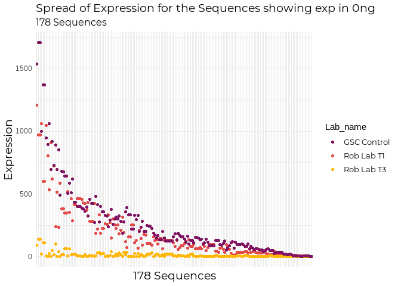

---
title: "GSC-1790 Filtering - MirMaster Raw Data" 
author: Nikita Telkar 
date: "October 8, 2020"
output: 
  html_document: 
    keep_md: yes 
    toc: true 
    toc_depth: 4
    toc_float: 
      collapsed: false 
      smooth_scroll: false 
    theme: cosmo  #cosmo, paper, lumen, sandstone, simplex, yeti; cerulean, journal, flatly, darkly, readable, spacelab, united
    highlight: zenburn #tango, pygments, kate, monochrome, espresso, zenburn, haddock, textmate.
--- 


***

## ** Introduction **

1_3_filtering with only miRMaster data.     

***

##  **1.0 Loadings**  

### **1.1 Loading Packages and Options**  


```r
library(tidyverse)
library(dplyr)
library(plyr)
library(here) 
library(readxl)
library(rmarkdown)
library(knitr)
library(stringr)
library(DT)
library(kableExtra)
library(formatR)
library(factoextra)
library(forcats)
library(janitor)
library(scales)
library(Rsamtools)
library(Rsubread)
library(pheatmap)
library(RColorBrewer)
library(ggsci)
library(biomaRt)
library(extrafont)
library(factoextra)
#library(NetBID2)
library(DESeq2)
library(edgeR)
library(showtext)
library(egg)
library(reshape2)
loadfonts(device = "win")
```


```r
#knitr::opts_chunk$set(tidy.opts=list(width.cutoff=50),tidy=TRUE)

font_add_google("Montserrat", "Mont")
showtext_auto()

my_theme <- theme_minimal() +
    theme(plot.title = element_text(family = "Mont", size = 14),
          plot.subtitle = element_text(family = "Mont", size = 12),
          legend.text = element_text(family = "Mont", size = 10),
          axis.title = element_text(family = "Mont", size = 14))

my_theme_2 <- theme (plot.title = element_text(family = "Mont", size = 14),
          plot.subtitle = element_text(family = "Mont", size = 12),
          legend.text = element_text(family = "Mont", size = 10),
          axis.title = element_text(family = "Mont", size = 14),
          strip.text.x = element_text("Mont", size = 10))

knitr::opts_chunk$set(fig.showtext = TRUE, fig_retina = 1) #needed to render show_text
knitr::opts_chunk$set(warning = FALSE, error = FALSE, message = FALSE)
```


```r
col_samp <- c("#801361", "#e44c4a", "#ffb708")

col_tirations <-  c("#87CEFA", "#87CEEB", "#00BFFF", "#1E90FF", "#4169E1", "#0000FF", "#00008B", "#0e0e3f")

col_filters <- c("#3c8012", "#7a9600", "#baa900", "#ffb708")

col_compare <- c("#ed9ca0", "#9cbd8c")
```

***

### **1.2 Loading Data**  

Loading:  

1. `eDat` - Count matrix: quantification_raw  (rpm_normalised has decimal counts and is not recommended to be used for DE analysis)   
2. `pDat` - Phenotype file  
3. `mDat` - Metadata file  
4. `eDat_s1` - Count Matrix of sample *PL-290* having sequences with 0 counts across all 8 samples removed  
5. `eDat_s2` - Count Matrix of sample *TCR-2-18* having sequences with 0 counts across all 8 samples removed  
4. `eDat_con` - Count Matrix of sample *FG0232A* having sequences with 0 counts across all 8 samples removed


```r
eDat <- read_excel(here::here("data", "external", "overview_run_sn1zmgd0_cs_test_all_500-0ng_test_1", "quantification_raw.xlsx"))
pDat <- readRDS(file = here::here('data', 'processed', "pDat_GSC_1790.rds"))
mDat <- readRDS(file = here::here('data', 'processed', "mDat_GSC_1790.rds"))


#cleaning up eDat
samples <- as.data.frame(colnames(eDat))
samples <- as.data.frame(samples[3:26,])
colnames (samples) [1] <- "samps"
samples$samps <- str_sub(samples$samps, 1, 6)

colnames(eDat)[3:26] <- samples$samps

eDat <- eDat %>% 
  unite(miRNA, c("precursor", "miRNA")) %>% 
  column_to_rownames(var = "miRNA")

eDat <- eDat %>%  #removing seqs which have 0 counts across all samples
  rownames_to_column(var = "miRNA") %>% 
  mutate(Sum = rowSums(.[2:13])) %>%  
  filter(Sum >= 1) %>% 
  column_to_rownames(var = "miRNA") %>% 
  dplyr::select(-Sum)

nrow(eDat) #1950
```

```
## [1] 1950
```

```r
#adding alt samp names to pDat

pDat <- pDat %>% 
  mutate(Lab_name =
           case_when(
             sample == "PL-290v" ~ "Rob Lab T1",
             sample == "TCR-2-18_v_SNAP" ~ "Rob Lab T3",
             sample == "FG032A" ~ "GSC Control"
           )
         )


#Separating by sample

eDat_s1 <- eDat[c(1:8)]
eDat_s1 <- eDat_s1 %>%  #removing seqs which have 0 counts across all samples
  rownames_to_column(var = "miRNA") %>% 
  mutate(Sum = rowSums(eDat_s1)) %>%  
  filter(Sum >= 1) %>% 
  column_to_rownames(var = "miRNA") %>% 
  dplyr::select(-Sum)
nrow(eDat_s1) #1765
```

```
## [1] 1765
```

```r
eDat_s2 <- eDat[c(9:16)]
eDat_s2 <- eDat_s2 %>%  #removing seqs which have 0 counts across all samples
  rownames_to_column(var = "miRNA") %>% 
  mutate(Sum = rowSums(eDat_s2)) %>%  
  filter(Sum >= 1) %>% 
  column_to_rownames(var = "miRNA") %>% 
  dplyr::select(-Sum)
nrow(eDat_s2) #1720
```

```
## [1] 1720
```

```r
eDat_con <- eDat[c(17:24)]
eDat_con <- eDat_con %>%  #removing seqs which have 0 counts across all samples
  rownames_to_column(var = "miRNA") %>% 
  mutate(Sum = rowSums(eDat_con)) %>%  
  filter(Sum >= 1) %>% 
  column_to_rownames(var = "miRNA") %>% 
  dplyr::select(-Sum)
nrow(eDat_con) #1728
```

```
## [1] 1728
```

***  

## **2.0 Filtering by Sample Counts**    

Now, I'm going to take out the 0ng and 500ng samples (6 in total), since the previous [1_2_sample_correlations](Z:\Nikita\Projects\cell_sorted\R\1_preprocessing\1_2_sample_correlations.html)(path: "Z:\Nikita\Projects\cell_sorted\R\1_preprocessing\1_2_sample_correlations.html")  

I'm going to be applying **5** filterieng criteria:  

1. At least 1 count in 1 sample 
2. At least 1 count in all samples  
3. At least 2 counts across samples  
4. At least 3 counts across samples  
5. At least 4 counts across samples  


```r
eDat_fil <- eDat [-c(1,8,9,16,17,24)] #removing 0 and 500ng samples

eDat2 <- eDat_fil %>% #removing sequences with less than 1 read count across all samples
  rownames_to_column(var = "miRNA") %>% 
  mutate(Sum = rowSums(.[2:19])) %>%  
  filter(Sum >= 1) %>% 
  column_to_rownames(var = "miRNA") %>% 
  dplyr::select(-Sum)

nrow(eDat2) #1911
```

```
## [1] 1911
```

```r
eDat3 <- eDat_fil %>% #keeping sequences with counts of atleast 1 in all of the samples
  rownames_to_column(var = "miRNA") %>% 
  filter_all(all_vars(. >= 1))  %>% 
  column_to_rownames(var = "miRNA")

nrow(eDat3) #445 --> too stringent
```

```
## [1] 445
```

```r
eDat4 <- eDat_fil %>% #removing sequences with less than 2 read count across all samples
  rownames_to_column(var = "miRNA") %>% 
  mutate(Sum = rowSums(.[2:19])) %>%  
  filter(Sum >= 2) %>% 
  column_to_rownames(var = "miRNA") %>% 
  dplyr::select(-Sum)

nrow(eDat4) #1775
```

```
## [1] 1775
```

```r
eDat5 <- eDat_fil %>% #removing sequences with less than 3 read count across all samples
  rownames_to_column(var = "miRNA") %>% 
  mutate(Sum = rowSums(.[2:19])) %>%  
  filter(Sum >= 3) %>% 
  column_to_rownames(var = "miRNA") %>% 
  dplyr::select(-Sum)

nrow(eDat5) #1671
```

```
## [1] 1671
```

```r
eDat6 <- eDat_fil %>% #removing sequences with less than 4 read count across all samples
  rownames_to_column(var = "miRNA") %>% 
  mutate(Sum = rowSums(.[2:19])) %>%  
  filter(Sum >= 4) %>% 
  dplyr::arrange(Sum) %>% 
  column_to_rownames(var = "miRNA") %>% 
  dplyr::select(-Sum)

nrow(eDat6) #1585
```

```
## [1] 1585
```

We can see that if I apply the filter of keeping only sequences having at least 1 count in all samples, then only 1160 sequences remain. That's too stringent, so I won't be using that filetring criteria going further. I'll focus on the filtering based on total reads across all of the samples, and filtereing by counts of more than 1, 2, and 3.   

I'll now do some exploratory filtering on the 3 (PL290, TCR-2-18, FG032A) samples separately.  

### **2.1 Filtering for PL290** 

**PL290**


```r
s1_fil1 <- eDat2 [c(1:6)]

s1_fil1 <- s1_fil1 %>% #removing sequences with less than 1 read count across all samples
  rownames_to_column(var = "miRNA") %>% 
  mutate(Sum = rowSums(.[2:7])) %>%  
  filter(Sum >= 1) %>% 
  column_to_rownames(var = "miRNA") %>% 
  dplyr::select(-Sum)

nrow(s1_fil1) #1622
```

```
## [1] 1622
```

```r
s1_fil2 <- s1_fil1 %>% #keeping sequences with counts of atleast 1 in all of the samples
  rownames_to_column(var = "miRNA") %>% 
  filter_all(all_vars(. >= 1))  %>% 
  column_to_rownames(var = "miRNA")

nrow(s1_fil2) #576
```

```
## [1] 576
```

```r
s1_fil3 <- s1_fil1 %>% #keeping sequences with counts of atleast 2 in all of the samples
  rownames_to_column(var = "miRNA") %>% 
  filter_all(all_vars(. >= 2))  %>% 
  column_to_rownames(var = "miRNA")

nrow(s1_fil3) #495
```

```
## [1] 495
```

```r
s1_fil4 <- s1_fil1 %>% #keeping sequences with counts of atleast 3 in all of the samples
  rownames_to_column(var = "miRNA") %>% 
  filter_all(all_vars(. >= 3))  %>% 
  column_to_rownames(var = "miRNA")

nrow(s1_fil4) #450
```

```
## [1] 450
```

### **2.2 Filtering for TCR-5-18** 

**TCR-2-18**


```r
s2_fil1 <- eDat2 [c(7:12)]

s2_fil1 <- s2_fil1 %>% #removing sequences with less than 1 read count across all samples
  rownames_to_column(var = "miRNA") %>% 
  mutate(Sum = rowSums(.[2:7])) %>%  
  filter(Sum >= 1) %>% 
  column_to_rownames(var = "miRNA") %>% 
  dplyr::select(-Sum)

nrow(s2_fil1) #1667
```

```
## [1] 1667
```

```r
s2_fil2 <- s2_fil1 %>% #keeping sequences with counts of atleast 1 in all of the samples
  rownames_to_column(var = "miRNA") %>% 
  filter_all(all_vars(. >= 1))  %>% 
  column_to_rownames(var = "miRNA")

nrow(s2_fil2) #523 
```

```
## [1] 523
```

```r
s2_fil3 <- s2_fil1 %>% #keeping sequences with counts of atleast 2 in all of the samples
  rownames_to_column(var = "miRNA") %>% 
  filter_all(all_vars(. >= 2))  %>% 
  column_to_rownames(var = "miRNA")

nrow(s2_fil3) #451
```

```
## [1] 451
```

```r
s2_fil4 <- s2_fil1 %>% #keeping sequences with counts of atleast 3 in all of the samples
  rownames_to_column(var = "miRNA") %>% 
  filter_all(all_vars(. >= 3))  %>% 
  column_to_rownames(var = "miRNA")

nrow(s2_fil4) #416
```

```
## [1] 416
```
### **2.3 Filtering for FG032A**   

**FG032A**


```r
con_fil1 <- eDat2 [c(13:18)]

con_fil1 <- con_fil1 %>% #removing sequences with less than 1 read count across all samples
  rownames_to_column(var = "miRNA") %>% 
  mutate(Sum = rowSums(.[2:7])) %>%  
  filter(Sum >= 1) %>% 
  column_to_rownames(var = "miRNA") %>% 
  dplyr::select(-Sum)

nrow(con_fil1) #1682
```

```
## [1] 1682
```

```r
con_fil2 <- con_fil1 %>% #keeping sequences with counts of atleast 1 in all of the samples
  rownames_to_column(var = "miRNA") %>% 
  filter_all(all_vars(. >= 1))  %>% 
  column_to_rownames(var = "miRNA")

nrow(con_fil2) #791
```

```
## [1] 791
```

```r
con_fil3 <- con_fil1 %>% #keeping sequences with counts of atleast 2 in all of the samples
  rownames_to_column(var = "miRNA") %>% 
  filter_all(all_vars(. >= 2))  %>% 
  column_to_rownames(var = "miRNA")

nrow(con_fil3) #723
```

```
## [1] 723
```

```r
con_fil4 <- con_fil1 %>% #keeping sequences with counts of atleast 3 in all of the samples
  rownames_to_column(var = "miRNA") %>% 
  filter_all(all_vars(. >= 3))  %>% 
  column_to_rownames(var = "miRNA")

nrow(con_fil4) #662
```

```
## [1] 662
```


### **2.4 Sanity Check**  


```r
table(rownames(s1_fil1) %in% rownames(con_fil1))
```

```
## 
## FALSE  TRUE 
##   153  1469
```

```r
table(rownames(con_fil1) %in% rownames(s1_fil1))
```

```
## 
## FALSE  TRUE 
##   213  1469
```

```r
#The number of sequences that overlape i.e. the TRUE parameter are both the same.
```

### **2.5 Overlapping Sequences** 

How many sequnces are then common after all of these filtering steps if considered only by sample alone?  


```r
ovp_s1_con <- as.data.frame(table(rownames(s1_fil1) %in% rownames(con_fil1)))
ovp_s1_con$v3 <- as.data.frame(table(rownames(s1_fil2) %in% rownames(con_fil2)))
ovp_s1_con$v4 <- as.data.frame(table(rownames(s1_fil3) %in% rownames(con_fil3)))
ovp_s1_con$v5 <- as.data.frame(table(rownames(s1_fil4) %in% rownames(con_fil4)))
ovp_s1_con
```

```
##    Var1 Freq v3.Var1 v3.Freq v4.Var1 v4.Freq v5.Var1 v5.Freq
## 1 FALSE  153   FALSE      45   FALSE      33   FALSE      27
## 2  TRUE 1469    TRUE     531    TRUE     462    TRUE     423
```

```r
overlap <- factor(c("at least\n1 count in\n1 sample", "at least\n1 count\nin all\nsamples", "at least\n2 counts", "at least\n3 counts"), levels = c("at least\n1 count in\n1 sample", "at least\n1 count\nin all\nsamples", "at least\n2 counts", "at least\n3 counts"))
overlap <- as.data.frame(overlap)
colnames(overlap)[1] <- "Filter"
overlap <- overlap %>%
  mutate(count = 2) %>% #multiply the rows 2 times
  uncount(count)
overlap$Freq = c("153", "1469", "45", "531", "33", "462", "27", "423")
overlap$Freq <- as.character(overlap$Freq)
overlap$total <- c("1622", "1622", "576", "576", "495", "495", "450", "450")
overlap$total <- as.numeric(as.character(overlap$total))
overlap$ovp <- c("FALSE", "TRUE")
overlap$which <- c("PL290_FG032A / 1st Trimester vs GSC Control")


ovp_s2_con <- as.data.frame(table(rownames(s2_fil1) %in% rownames(con_fil1)))
ovp_s2_con$v3 <- as.data.frame(table(rownames(s2_fil2) %in% rownames(con_fil2)))
ovp_s2_con$v4 <- as.data.frame(table(rownames(s2_fil3) %in% rownames(con_fil3)))
ovp_s2_con$v5 <- as.data.frame(table(rownames(s2_fil4) %in% rownames(con_fil4)))
ovp_s2_con
```

```
##    Var1 Freq v3.Var1 v3.Freq v4.Var1 v4.Freq v5.Var1 v5.Freq
## 1 FALSE  141   FALSE      29   FALSE      21   FALSE      14
## 2  TRUE 1526    TRUE     494    TRUE     430    TRUE     402
```

```r
overlap2 <- factor(c("at least\n1 count in\n1 sample", "at least\n1 count\nin all\nsamples", "at least\n2 counts", "at least\n3 counts"), levels = c("at least\n1 count in\n1 sample", "at least\n1 count\nin all\nsamples", "at least\n2 counts", "at least\n3 counts"))
overlap2 <- as.data.frame(overlap2)
colnames(overlap2)[1] <- "Filter"
overlap2 <- overlap2 %>%
  mutate(count = 2) %>%
  uncount(count)
overlap2$Freq = c("141", "1526", "29", "494", "21", "430", "14", "402")
overlap2$Freq <- as.character(overlap2$Freq)
overlap2$total <- c("1667", "1667", "523", "523", "451", "451", "416", "416")
overlap2$total <- as.numeric(as.character(overlap2$total))
overlap2$ovp <- c("FALSE", "TRUE")
overlap2$which <- c("TCR-2-18_FG032A / 3rd Trimester vs GSC Control")


ovp_s1_s2 <- as.data.frame(table(rownames(s1_fil1) %in% rownames(s2_fil1)))
ovp_s1_s2$v3 <- as.data.frame(table(rownames(s1_fil2) %in% rownames(s2_fil2)))
ovp_s1_s2$v4 <- as.data.frame(table(rownames(s1_fil3) %in% rownames(s2_fil3)))
ovp_s1_s2$v5 <- as.data.frame(table(rownames(s1_fil4) %in% rownames(s2_fil4)))
ovp_s1_s2
```

```
##    Var1 Freq v3.Var1 v3.Freq v4.Var1 v4.Freq v5.Var1 v5.Freq
## 1 FALSE  198   FALSE     116   FALSE      99   FALSE      79
## 2  TRUE 1424    TRUE     460    TRUE     396    TRUE     371
```

```r
overlap3 <- factor(c("at least\n1 count in\n1 sample", "at least\n1 count\nin all\nsamples", "at least\n2 counts", "at least\n3 counts"), levels = c("at least\n1 count in\n1 sample", "at least\n1 count\nin all\nsamples", "at least\n2 counts", "at least\n3 counts"))
overlap3 <- as.data.frame(overlap3)
colnames(overlap3)[1] <- "Filter"
overlap3 <- overlap3 %>%
  mutate(count = 2) %>%
  uncount(count)
overlap3$Freq = c("198", "1424", "116", "460", "99", "396", "79", "371")
overlap3$Freq <- as.character(overlap3$Freq)
overlap3$total <- c("1622", "1622", "576", "576", "495", "495", "450", "450")
overlap3$total <- as.numeric(as.character(overlap3$total))
overlap3$ovp <- c("FALSE", "TRUE")
overlap3$which <- c("PL290_TCR-2-18 / 1st Trimester vs 3rd Trimester")

ovp <- rbind(overlap, overlap2, overlap3)

ovp$Freq <- as.numeric(ovp$Freq)

str(ovp)
```

```
## 'data.frame':	24 obs. of  5 variables:
##  $ Filter: Factor w/ 4 levels "at least\n1 count in\n1 sample",..: 1 1 2 2 3 3 4 4 1 1 ...
##  $ Freq  : num  153 1469 45 531 33 ...
##  $ total : num  1622 1622 576 576 495 ...
##  $ ovp   : chr  "FALSE" "TRUE" "FALSE" "TRUE" ...
##  $ which : chr  "PL290_FG032A / 1st Trimester vs GSC Control" "PL290_FG032A / 1st Trimester vs GSC Control" "PL290_FG032A / 1st Trimester vs GSC Control" "PL290_FG032A / 1st Trimester vs GSC Control" ...
```

```r
ovp <- ovp %>% 
  mutate(perc = (Freq/total)*100)

ovp %>%
  ggplot(aes(x = Filter, y = perc, fill = ovp)) +
  geom_bar(stat = "identity", position = position_dodge(), width = 0.6) +
  geom_text(aes(label = Freq), vjust = -0.8, colour = "#333333", position = position_dodge(0.80)) +
  #scale_y_discrete(expand = c(0,100)) +
  scale_fill_manual(values = col_compare, name = "Overlap") +
  coord_cartesian(y = c(0,110)) +
  scale_y_continuous(labels = comma, expand = c(0, 0)) +
  labs(title = "No. of sncRNAs that overlap between the 3 samples", subtitle = "Floating numbers are total number of sequences\n ", x = "Filtering Criteria", y = "Percentage of Overlap") +
  my_theme_2 +
  facet_grid(~which)
```

<!-- -->

Now, if I were to exclude the GSC Control sample from the initial `eDat2` itself, the following sequences seleected won't be an overrepresentation of the 'healthy, normative control'.  

### **2.6 Redoing 2.1 - 2.5 without FG032A**  


```r
eDat2 <- eDat_fil [c(1:12)] #removing GSC control sample

eDat2 <- eDat2 %>% #removing sequences with less than 1 read count across all samples
  rownames_to_column(var = "miRNA") %>% 
  mutate(Sum = rowSums(.[2:13])) %>%  
  filter(Sum >= 1) %>% 
  column_to_rownames(var = "miRNA") %>% 
  dplyr::select(-Sum)

nrow(eDat2) #1865
```

```
## [1] 1865
```

So, removing the control sample removed 88 [1950-1862] sequences. (eDat seqs = 1950)   


```r
s1_fil1 <- eDat2 [c(1:6)]

s1_fil1 <- s1_fil1 %>% #removing sequences with less than 1 read count across all samples
  rownames_to_column(var = "miRNA") %>% 
  mutate(Sum = rowSums(.[2:7])) %>%  
  filter(Sum >= 1) %>% 
  column_to_rownames(var = "miRNA") %>% 
  dplyr::select(-Sum)

nrow(s1_fil1) #1162 
```

```
## [1] 1622
```

```r
s1_fil2 <- s1_fil1 %>% #keeping sequences with counts of atleast 1 in all of the samples
  rownames_to_column(var = "miRNA") %>% 
  filter_all(all_vars(. >= 1))  %>% 
  column_to_rownames(var = "miRNA")

nrow(s1_fil2) #576
```

```
## [1] 576
```

```r
s1_fil3 <- s1_fil1 %>% #keeping sequences with counts of atleast 2 in all of the samples
  rownames_to_column(var = "miRNA") %>% 
  filter_all(all_vars(. >= 2))  %>% 
  column_to_rownames(var = "miRNA")

nrow(s1_fil3) #495
```

```
## [1] 495
```

```r
s1_fil4 <- s1_fil1 %>% #keeping sequences with counts of atleast 3 in all of the samples
  rownames_to_column(var = "miRNA") %>% 
  filter_all(all_vars(. >= 3))  %>% 
  column_to_rownames(var = "miRNA")

nrow(s1_fil4) #450
```

```
## [1] 450
```

```r
s2_fil1 <- eDat2 [c(7:12)]

s2_fil1 <- s2_fil1 %>% #removing sequences with less than 1 read count across all samples
  rownames_to_column(var = "miRNA") %>% 
  mutate(Sum = rowSums(.[2:7])) %>%  
  filter(Sum >= 1) %>% 
  column_to_rownames(var = "miRNA") %>% 
  dplyr::select(-Sum)

nrow(s2_fil1) #1667
```

```
## [1] 1667
```

```r
s2_fil2 <- s2_fil1 %>% #keeping sequences with counts of atleast 1 in all of the samples
  rownames_to_column(var = "miRNA") %>% 
  filter_all(all_vars(. >= 1))  %>% 
  column_to_rownames(var = "miRNA")

nrow(s2_fil2) #523
```

```
## [1] 523
```

```r
s2_fil3 <- s2_fil1 %>% #keeping sequences with counts of atleast 2 in all of the samples
  rownames_to_column(var = "miRNA") %>% 
  filter_all(all_vars(. >= 2))  %>% 
  column_to_rownames(var = "miRNA")

nrow(s2_fil3) #451
```

```
## [1] 451
```

```r
s2_fil4 <- s2_fil1 %>% #keeping sequences with counts of atleast 3 in all of the samples
  rownames_to_column(var = "miRNA") %>% 
  filter_all(all_vars(. >= 3))  %>% 
  column_to_rownames(var = "miRNA")

nrow(s2_fil4) #416
```

```
## [1] 416
```

After subsetting into T1 and T3, the filtering however removed none - which is good, meaning that the GSC sample isn't overestimating the majority of the sequences.  

***  


## **3.0 Filtering by Titration Counts**  

Subsetting from eDat2 which has been collectively filtered to remove 0 and 500ng and kept only sequences with counts of at least 1 across all samples -- *1120 sequences*.


```r
eDat_fil <- eDat [-c(1,8,9,16,17,24)] #removing 0 and 500ng samples

eDat2 <- eDat_fil %>% #removing sequences with less than 1 read count across all samples
  rownames_to_column(var = "miRNA") %>% 
  mutate(Sum = rowSums(.[2:19])) %>%  
  filter(Sum >= 1) %>% 
  column_to_rownames(var = "miRNA") %>% 
  dplyr::select(-Sum)


list_250 <- eDat2 [c(1, 7, 13)] 
list_100 <- eDat2 [c(2, 8, 14)] 
list_50 <- eDat2 [c(3, 9, 15)] 
list_25 <- eDat2 [c(4, 10, 16)]
list_5 <- eDat2 [c(5, 11, 17)] 
list_1 <- eDat2 [c(6, 12, 18)] 

titra_list <- list (list_250, list_100, list_50, list_25, list_5, list_1) #put all dfs in a list

#sample_names <- c("PL290", "TCR-5-18", "FG032A")
#titrations <- c("250ng", "100ng", "50ng", "25ng", "10ng", "5ng")

#titra_list <- lapply(titra_list, setNames, sample_names) #change colnames of all dfs
```

I'm going to tweak the 4 filtering criteria, given now that we have only 3 samples per group of tirations.  

1. at least 1 count in 1 sample 
2. At least 1 count in all samples  
3. At least 2 counts in all samples  
4. At least 3 counts in all samples  

I'm then going to compare the total RPM to observe how much of a difference there is depending upon the filters for each of the samples.  


```r
fil_250_1 <- titra_list[[1]] %>% #subset from the list that stores all the titrations
  rownames_to_column(var = "miRNA") %>% 
  mutate(Sum = rowSums(.[2:4])) %>%  #removing sequences with less than 1 read count across all samples
  filter(Sum >= 1) %>% 
  column_to_rownames(var = "miRNA") %>% 
  dplyr::select(-Sum)  %>% 
  mutate(filter = "at least\n1 count in\n1 sample")

nrow(fil_250_1) # 1585
```

```
## [1] 1585
```

```r
fil_250_2 <- titra_list[[1]] %>% #keeping sequences with counts of atleast 1 in all of the samples
  rownames_to_column(var = "miRNA") %>% 
  filter_all(all_vars(. >= 1))  %>% 
  column_to_rownames(var = "miRNA") %>% 
  mutate(filter = "at least\n1 count\nin all\nsamples")

nrow(fil_250_2) #782
```

```
## [1] 782
```

```r
fil_250_3 <- titra_list[[1]] %>% #keeping sequences with counts of atleast 2 in all of the samples
  rownames_to_column(var = "miRNA") %>% 
  filter_all(all_vars(. >= 2))  %>% 
  column_to_rownames(var = "miRNA") %>% 
  mutate(filter = "at least\n2 counts")

nrow(fil_250_3) #678
```

```
## [1] 678
```

```r
fil_250_4 <- titra_list[[1]] %>% #keeping sequences with counts of atleast 3 in all of the samples
  rownames_to_column(var = "miRNA") %>% 
  filter_all(all_vars(. >= 3))  %>% 
  column_to_rownames(var = "miRNA") %>% 
  mutate(filter = "at least\n3 counts")

nrow(fil_250_4) #625
```

```
## [1] 625
```

```r
fil_250 <- list(fil_250_1, fil_250_2, fil_250_3, fil_250_4)


#fil_250_1 <- fil_250_1 %>% 
#  rownames_to_column(var = "miRNA") %>% 
#  adorn_totals("row") %>% 
#  untabyl() %>% 
#  `row.names<-`(., NULL) %>% 
#  column_to_rownames(var = "miRNA") %>%  
#  dplyr::arrange(desc(.[3]))
  

#MY FIRST FUCNTION! --> Copying what I do do for a single df to a separate function to apply to the list
f1 <- function (x) {x %>% 
    rownames_to_column(var = "miRNA") %>% 
    adorn_totals("row") %>% 
    untabyl () %>% 
    `row.names<-`(., NULL) %>% 
    column_to_rownames(var = "miRNA") %>%  
    dplyr::arrange(desc(.[3]))
}

fil_250 <- lapply(fil_250, f1)#lapply = apply for list, f = function describing the dplyr steps
fil_250 <- lapply(fil_250, function(x) mutate(x, titration = "250ng"))

#attributes(list_250) <- NULL #adorn_totals transformed df into different data type
#f2 <- function (x) {
#  attributes(x) <- NULL
#}


#1 count across all 3 samples
test <- titra_list[[1]] %>%
 rownames_to_column(var = "miRNA") %>% 
  filter_all(all_vars(. >= 1))  %>% 
  column_to_rownames(var = "miRNA") #467

#2 counts across all 3 samples
test2 <- titra_list[[1]] %>%
 rownames_to_column(var = "miRNA") %>% 
  filter_all(all_vars(. >= 2))  %>% 
  column_to_rownames(var = "miRNA") #429
```


I'm now going to make a plot depicting the total number of sequences based on the filtering criteria for all the tirations  


```r
fil_seq <- factor(c("250ng", "100ng", "50ng", "25ng", "5ng", "1ng"), levels = c("250ng", "100ng", "50ng", "25ng", "5ng", "1ng"))

fil_seq <- as.data.frame(fil_seq)
colnames(fil_seq) [1] <- "Titrations"

fil_seq <- fil_seq %>%
  mutate(count = 4) %>% #multiply the rows 4 times
  uncount(count)

fil_seq$Filter <- factor(c("at least 1 count in 1 sample", "at least 1 count in all samples", "at least 2 counts", "at least 3 counts"), levels = c("at least 1 count in 1 sample", "at least 1 count in all samples", "at least 2 counts", "at least 3 counts"))

fil_totals <- as.data.frame(nrow(fil_250_1))
fil_totals$a <- nrow(fil_250_2)
fil_totals$b <- nrow(fil_250_3)
fil_totals$c <- nrow(fil_250_4)
fil_totals$d <- nrow(fil_100_1)
fil_totals$e <- nrow(fil_100_2)
fil_totals$f <- nrow(fil_100_3)
fil_totals$g <- nrow(fil_100_4)
fil_totals$h <- nrow(fil_50_1)
fil_totals$i <- nrow(fil_50_2)
fil_totals$j <- nrow(fil_50_3)
fil_totals$k <- nrow(fil_50_4)
fil_totals$l <- nrow(fil_25_1)
fil_totals$m <- nrow(fil_25_2)
fil_totals$n <- nrow(fil_25_3)
fil_totals$o <- nrow(fil_25_4)
fil_totals$p <- nrow(fil_5_1)
fil_totals$q <- nrow(fil_5_2)
fil_totals$r <- nrow(fil_5_3)
fil_totals$s <- nrow(fil_5_4)
fil_totals$t <- nrow(fil_1_1)
fil_totals$u <- nrow(fil_1_2)
fil_totals$v <- nrow(fil_1_3)
fil_totals$w <- nrow(fil_1_4)

fil_totals <- as.data.frame(t(fil_totals))

colnames(fil_totals) [1] <- "Total_Sequences"

fil_seq <- cbind(fil_seq, fil_totals)

#fil_seq$Total_Sequences <- as.numeric(c("18689", "4877", "1988", "1088", "13723", "3901", "1632", "929", "14667", "4717", "2006", "1122", "13468", "3900", "1683", "975", "15313", "4989" , "2268", "1346", "12575", "1706", "705", "396")) --> WRONG. NOT REPRODUCIBLE

str(fil_seq)
```

```
## 'data.frame':	24 obs. of  3 variables:
##  $ Titrations     : Factor w/ 6 levels "250ng","100ng",..: 1 1 1 1 2 2 2 2 3 3 ...
##  $ Filter         : Factor w/ 4 levels "at least 1 count in 1 sample",..: 1 2 3 4 1 2 3 4 1 2 ...
##  $ Total_Sequences: int  1585 782 678 625 1628 934 790 726 1666 965 ...
```

```r
head(fil_seq)
```

```
##                 Titrations                          Filter Total_Sequences
## nrow(fil_250_1)      250ng    at least 1 count in 1 sample            1585
## a                    250ng at least 1 count in all samples             782
## b                    250ng               at least 2 counts             678
## c                    250ng               at least 3 counts             625
## d                    100ng    at least 1 count in 1 sample            1628
## e                    100ng at least 1 count in all samples             934
```

```r
g1 <- fil_seq %>% 
  ggplot(aes(x = Titrations, y = Total_Sequences, fill = Filter)) +
  geom_bar(stat = "identity", position = position_dodge(), width = 0.68) +
  geom_text(aes(label = Total_Sequences), vjust = -0.8, colour = "#333333", position = position_dodge(0.65)) +
  scale_fill_manual(values = col_filters) +
  labs(title = "Comparison of Total No of Sequences - Rob Lab + GSC Samples", subtitle = "by 4 Filtering Criteria") +
  scale_y_continuous(labels = comma, expand = c(0, 0)) + #to make yaxis units as whole numbers rather than in exponential form
  my_theme +
  coord_cartesian(y = c(0,2000)) +
  theme(legend.position = "bottom")
  
#g1
```


Now, I'm going to bind the first rows that contain the total RPM based on the different filtering steps together to make a single df that I can use to plot the difference between the RPMs for the differing titrations.  


```r
#figure out how to extract Total RPM row

#test <- rbind(fil_250_1[1,], fil_100_1[1,])
#dfnew <- (fil_250[[c(1)]]) ---> Nope
#dfnew <- Map(head, fil_250[1], 1) #by purrr
#dfnew <- lapply(fil_250[1], head, 1) #by lapply
#dfnew <- lapply(fil_250[1], function(x) x[1,]) #first row of first df
#dfnew <- lapply(fil_250, function(x) x[1,]) #first rows of all dfs


dfnew <- lapply(fil_250, function(x) x[,1]) # --> WORKS!
#dfnew <- as.data.frame(dfnew)
```


```r
f2 <- function (x){
  lapply(x) 
  function(y){y[1,]
  }
} #Nope

#dfnew <- as.data.frame(rbind(lapply(fil_250, function(x) x[1,]))) --> Nope
df_250 <- do.call(rbind, (lapply(fil_250, function(x) x[1,])))
df_250$filter <- factor(c("at least 1 count in 1 sample", "at least 1 count in all samples", "at least 2 counts", "at least 3 counts"), levels = c("at least 1 count in 1 sample", "at least 1 count in all samples", "at least 2 counts", "at least 3 counts"))

df_100 <- do.call(rbind, (lapply(fil_100, function(x) x[1,])))
df_100$filter <- factor(c("at least 1 count in 1 sample", "at least 1 count in all samples", "at least 2 counts", "at least 3 counts"), levels = c("at least 1 count in 1 sample", "at least 1 count in all samples", "at least 2 counts", "at least 3 counts"))

df_50 <- do.call(rbind, (lapply(fil_50, function(x) x[1,])))
df_50$filter <- factor(c("at least 1 count in 1 sample", "at least 1 count in all samples", "at least 2 counts", "at least 3 counts"), levels = c("at least 1 count in 1 sample", "at least 1 count in all samples", "at least 2 counts", "at least 3 counts"))

df_25 <- do.call(rbind, (lapply(fil_25, function(x) x[1,])))
df_25$filter <- factor(c("at least 1 count in 1 sample", "at least 1 count in all samples", "at least 2 counts", "at least 3 counts"), levels = c("at least 1 count in 1 sample", "at least 1 count in all samples", "at least 2 counts", "at least 3 counts"))

df_5 <- do.call(rbind, (lapply(fil_5, function(x) x[1,])))
df_5$filter <- factor(c("at least 1 count in 1 sample", "at least 1 count in all samples", "at least 2 counts", "at least 3 counts"), levels = c("at least 1 count in 1 sample", "at least 1 count in all samples", "at least 2 counts", "at least 3 counts"))

df_1 <- do.call(rbind, (lapply(fil_1, function(x) x[1,])))
df_1$filter <- factor(c("at least 1 count in 1 sample", "at least 1 count in all samples", "at least 2 counts", "at least 3 counts"), levels = c("at least 1 count in 1 sample", "at least 1 count in all samples", "at least 2 counts", "at least 3 counts"))

list_fil <- list (df_250, df_100, df_50, df_25, df_5, df_1)

list_names <- c("PL290", "TCR-5-18", "FG032A", "Filter", "Titration")

list_fil <- lapply(list_fil, setNames, list_names)

#list_fil <- lapply(listrbind(list_fil[1], list_fil[2], list_fil[3], list_fil[4], list_fil[5], list_fil[6]))

list_fil <- list_fil %>% 
  bind_rows() %>% #rbind all rows within a list
  rowid_to_column(var = "ID") %>% 
  column_to_rownames(var = "ID")  %>% 
  mutate(Titration = fct_relevel(Titration, c("250ng", "100ng", "50ng", "25ng", "5ng", "1ng")))

list_fil <- list_fil %>% 
  mutate_if(is.numeric, round)

list_fil %>% 
  kable(caption = "Total RPM by Filetring Criteria") %>% 
  kable_styling(bootstrap_options = c("striped", "hover", "condensed", full_width = F, position = "right", fixed_thead = T))
```

<table class="table table-striped table-hover table-condensed" style="margin-left: auto; margin-right: auto;">
<caption>Total RPM by Filetring Criteria</caption>
 <thead>
  <tr>
   <th style="text-align:right;"> PL290 </th>
   <th style="text-align:right;"> TCR-5-18 </th>
   <th style="text-align:right;"> FG032A </th>
   <th style="text-align:left;"> Filter </th>
   <th style="text-align:left;"> Titration </th>
  </tr>
 </thead>
<tbody>
  <tr>
   <td style="text-align:right;"> 1675858 </td>
   <td style="text-align:right;"> 2430780 </td>
   <td style="text-align:right;"> 3331933 </td>
   <td style="text-align:left;"> at least 1 count in 1 sample </td>
   <td style="text-align:left;"> 250ng </td>
  </tr>
  <tr>
   <td style="text-align:right;"> 1673689 </td>
   <td style="text-align:right;"> 2429207 </td>
   <td style="text-align:right;"> 2744627 </td>
   <td style="text-align:left;"> at least 1 count in all samples </td>
   <td style="text-align:left;"> 250ng </td>
  </tr>
  <tr>
   <td style="text-align:right;"> 1672339 </td>
   <td style="text-align:right;"> 2428020 </td>
   <td style="text-align:right;"> 2666546 </td>
   <td style="text-align:left;"> at least 2 counts </td>
   <td style="text-align:left;"> 250ng </td>
  </tr>
  <tr>
   <td style="text-align:right;"> 1671136 </td>
   <td style="text-align:right;"> 2427073 </td>
   <td style="text-align:right;"> 2618222 </td>
   <td style="text-align:left;"> at least 3 counts </td>
   <td style="text-align:left;"> 250ng </td>
  </tr>
  <tr>
   <td style="text-align:right;"> 1034504 </td>
   <td style="text-align:right;"> 2300216 </td>
   <td style="text-align:right;"> 3060355 </td>
   <td style="text-align:left;"> at least 1 count in 1 sample </td>
   <td style="text-align:left;"> 100ng </td>
  </tr>
  <tr>
   <td style="text-align:right;"> 1034177 </td>
   <td style="text-align:right;"> 2299391 </td>
   <td style="text-align:right;"> 3049468 </td>
   <td style="text-align:left;"> at least 1 count in all samples </td>
   <td style="text-align:left;"> 100ng </td>
  </tr>
  <tr>
   <td style="text-align:right;"> 1033881 </td>
   <td style="text-align:right;"> 2298886 </td>
   <td style="text-align:right;"> 3047235 </td>
   <td style="text-align:left;"> at least 2 counts </td>
   <td style="text-align:left;"> 100ng </td>
  </tr>
  <tr>
   <td style="text-align:right;"> 1033664 </td>
   <td style="text-align:right;"> 2298254 </td>
   <td style="text-align:right;"> 3045443 </td>
   <td style="text-align:left;"> at least 3 counts </td>
   <td style="text-align:left;"> 100ng </td>
  </tr>
  <tr>
   <td style="text-align:right;"> 1165558 </td>
   <td style="text-align:right;"> 2389038 </td>
   <td style="text-align:right;"> 3078477 </td>
   <td style="text-align:left;"> at least 1 count in 1 sample </td>
   <td style="text-align:left;"> 50ng </td>
  </tr>
  <tr>
   <td style="text-align:right;"> 1165219 </td>
   <td style="text-align:right;"> 2388359 </td>
   <td style="text-align:right;"> 3076425 </td>
   <td style="text-align:left;"> at least 1 count in all samples </td>
   <td style="text-align:left;"> 50ng </td>
  </tr>
  <tr>
   <td style="text-align:right;"> 1164844 </td>
   <td style="text-align:right;"> 2387726 </td>
   <td style="text-align:right;"> 3075375 </td>
   <td style="text-align:left;"> at least 2 counts </td>
   <td style="text-align:left;"> 50ng </td>
  </tr>
  <tr>
   <td style="text-align:right;"> 1164473 </td>
   <td style="text-align:right;"> 2387222 </td>
   <td style="text-align:right;"> 3074342 </td>
   <td style="text-align:left;"> at least 3 counts </td>
   <td style="text-align:left;"> 50ng </td>
  </tr>
  <tr>
   <td style="text-align:right;"> 1129421 </td>
   <td style="text-align:right;"> 1820656 </td>
   <td style="text-align:right;"> 2116901 </td>
   <td style="text-align:left;"> at least 1 count in 1 sample </td>
   <td style="text-align:left;"> 25ng </td>
  </tr>
  <tr>
   <td style="text-align:right;"> 1128984 </td>
   <td style="text-align:right;"> 1819906 </td>
   <td style="text-align:right;"> 2115873 </td>
   <td style="text-align:left;"> at least 1 count in all samples </td>
   <td style="text-align:left;"> 25ng </td>
  </tr>
  <tr>
   <td style="text-align:right;"> 1128603 </td>
   <td style="text-align:right;"> 1819501 </td>
   <td style="text-align:right;"> 2115196 </td>
   <td style="text-align:left;"> at least 2 counts </td>
   <td style="text-align:left;"> 25ng </td>
  </tr>
  <tr>
   <td style="text-align:right;"> 1128401 </td>
   <td style="text-align:right;"> 1819024 </td>
   <td style="text-align:right;"> 2114514 </td>
   <td style="text-align:left;"> at least 3 counts </td>
   <td style="text-align:left;"> 25ng </td>
  </tr>
  <tr>
   <td style="text-align:right;"> 768446 </td>
   <td style="text-align:right;"> 1049658 </td>
   <td style="text-align:right;"> 1924206 </td>
   <td style="text-align:left;"> at least 1 count in 1 sample </td>
   <td style="text-align:left;"> 5ng </td>
  </tr>
  <tr>
   <td style="text-align:right;"> 767538 </td>
   <td style="text-align:right;"> 1049218 </td>
   <td style="text-align:right;"> 1921134 </td>
   <td style="text-align:left;"> at least 1 count in all samples </td>
   <td style="text-align:left;"> 5ng </td>
  </tr>
  <tr>
   <td style="text-align:right;"> 767097 </td>
   <td style="text-align:right;"> 1048938 </td>
   <td style="text-align:right;"> 1918933 </td>
   <td style="text-align:left;"> at least 2 counts </td>
   <td style="text-align:left;"> 5ng </td>
  </tr>
  <tr>
   <td style="text-align:right;"> 766741 </td>
   <td style="text-align:right;"> 1048785 </td>
   <td style="text-align:right;"> 1918017 </td>
   <td style="text-align:left;"> at least 3 counts </td>
   <td style="text-align:left;"> 5ng </td>
  </tr>
  <tr>
   <td style="text-align:right;"> 131579 </td>
   <td style="text-align:right;"> 184513 </td>
   <td style="text-align:right;"> 918426 </td>
   <td style="text-align:left;"> at least 1 count in 1 sample </td>
   <td style="text-align:left;"> 1ng </td>
  </tr>
  <tr>
   <td style="text-align:right;"> 131028 </td>
   <td style="text-align:right;"> 184246 </td>
   <td style="text-align:right;"> 907293 </td>
   <td style="text-align:left;"> at least 1 count in all samples </td>
   <td style="text-align:left;"> 1ng </td>
  </tr>
  <tr>
   <td style="text-align:right;"> 130834 </td>
   <td style="text-align:right;"> 184038 </td>
   <td style="text-align:right;"> 899700 </td>
   <td style="text-align:left;"> at least 2 counts </td>
   <td style="text-align:left;"> 1ng </td>
  </tr>
  <tr>
   <td style="text-align:right;"> 130671 </td>
   <td style="text-align:right;"> 183920 </td>
   <td style="text-align:right;"> 896687 </td>
   <td style="text-align:left;"> at least 3 counts </td>
   <td style="text-align:left;"> 1ng </td>
  </tr>
</tbody>
</table>

```r
#list_fil <- list_fil %>% 
 #mutate_all(funs(str_replace(., "less than 1 count across all samples", "less than 1 count/nacross all samples"))) #reformat the Filter names 

list_fil %>% 
  pivot_longer(cols = 1:3, names_to = "Sample", values_to = "Total_RPM") %>% 
  ggplot(aes(x = Titration, y = Total_RPM, color = Sample, shape = Sample)) +
  geom_point(size = 2) +
  scale_color_manual(values = col_samp) +
  my_theme_2 +
  labs(title = "Comparison of Total RPM", subtitle = "by 6 titrations and 4 filtering criteria\n") +
  coord_cartesian(y = c(0, 3500000)) +
  scale_y_continuous(labels = comma, expand = c(0, 0)) + #to make yaxis units as whole numbers rather than in exponential form
  facet_grid(~Filter)
```

<!-- -->

<!-- -->

***  
  
## **4.0 Filtering by Percentage of Samples**  

Now, instead of using counts to filter by, I'm going filter using the percentage of samples a sequence might be expressed in. I'm going to use `eDat_fil` which has been filtered to remove the 0ng and 500ng titrations. There's now a total of   

Let's go with retaining / filtering for sequences present in at least:  

1. 10% of samples (10% of 18 is 1.8 --> I'll round off to the next whole number: 2)  
2. 20% of samples (3.6 --> 4)   
3. 30% of samples (5.4 --> 6)  
4. 40% of samples (7.2 --> 8)  
5. 50% of samples (9.0 --> 9)  
6. 60% of samples (10.8 --> 11)  
7. 70% of samples (12.6 --> 13)  
8. 80% of samples (14.4 --> 15)  


In this case, I'm converting the zero's to NAs and then counting the total number of NAs. So, the above numbers in reverse when considering NAs/0 as the baseline:  

1. 10% of samples (16 NAs)  
2. 20% of samples (14 NAs)   
3. 30% of samples (12 NAs)  
4. 40% of samples (10 NAs)  
5. 50% of samples (9 NAs)  
6. 60% of samples (7 NAs)  
7. 70% of samples (5 NAs)  
8. 80% of samples (3 NAs) 


```r
head(eDat_fil)
```

```
##                            m19817 m19818 m19819 m19820 m19821 m19822 m19825
## hsa-let-7a-1_hsa-let-7a-3p     37     11     12      7      4      0     50
## hsa-let-7a-1_hsa-let-7a-5p   6474   5507   6877   4629   3403    645  14779
## hsa-let-7a-2_hsa-let-7a-5p   6424   5491   6850   4609   3398    644  14657
## hsa-let-7a-3_hsa-let-7a-3p     38     11     12      7      5      0     50
## hsa-let-7a-3_hsa-let-7a-5p   6448   5507   6861   4621   3418    642  14524
## hsa-let-7b_hsa-let-7b-3p        6      1      0      5      0      0     13
##                            m19826 m19827 m19828 m19829 m19830 m19833 m19834
## hsa-let-7a-1_hsa-let-7a-3p     45     24     13      1      0      1    110
## hsa-let-7a-1_hsa-let-7a-5p  15888  17171  13488   9730   1021   4692  24736
## hsa-let-7a-2_hsa-let-7a-5p  15768  17021  13386   9733   1021   4645  24423
## hsa-let-7a-3_hsa-let-7a-3p     45     24     13      1      0      1    110
## hsa-let-7a-3_hsa-let-7a-5p  15661  16875  13306   9693   1025   4646  24259
## hsa-let-7b_hsa-let-7b-3p        6     13      4      0      0      1     34
##                            m19835 m19836 m19837 m19838
## hsa-let-7a-1_hsa-let-7a-3p    108     45     14      0
## hsa-let-7a-1_hsa-let-7a-5p  25710  18768  18069   7837
## hsa-let-7a-2_hsa-let-7a-5p  25407  18593  17985   7861
## hsa-let-7a-3_hsa-let-7a-3p    108     45     14      0
## hsa-let-7a-3_hsa-let-7a-5p  25301  18475  17932   7863
## hsa-let-7b_hsa-let-7b-3p       49     14     12      2
```

```r
eDat_fil <- eDat_fil %>% 
  replace(.==0, NA)

t_eDat_fil <- as.data.frame(t(eDat_fil))

clsums <- colSums(is.na(t_eDat_fil))

t_eDat_fil <- rbind(t_eDat_fil, clsums)

eDat_fil <- as.data.frame(t(t_eDat_fil))

colnames(eDat_fil)[19] <- "Zero_Counts"

head(eDat_fil)
```

```
##                            m19817 m19818 m19819 m19820 m19821 m19822 m19825
## hsa-let-7a-1_hsa-let-7a-3p     37     11     12      7      4     NA     50
## hsa-let-7a-1_hsa-let-7a-5p   6474   5507   6877   4629   3403    645  14779
## hsa-let-7a-2_hsa-let-7a-5p   6424   5491   6850   4609   3398    644  14657
## hsa-let-7a-3_hsa-let-7a-3p     38     11     12      7      5     NA     50
## hsa-let-7a-3_hsa-let-7a-5p   6448   5507   6861   4621   3418    642  14524
## hsa-let-7b_hsa-let-7b-3p        6      1     NA      5     NA     NA     13
##                            m19826 m19827 m19828 m19829 m19830 m19833 m19834
## hsa-let-7a-1_hsa-let-7a-3p     45     24     13      1     NA      1    110
## hsa-let-7a-1_hsa-let-7a-5p  15888  17171  13488   9730   1021   4692  24736
## hsa-let-7a-2_hsa-let-7a-5p  15768  17021  13386   9733   1021   4645  24423
## hsa-let-7a-3_hsa-let-7a-3p     45     24     13      1     NA      1    110
## hsa-let-7a-3_hsa-let-7a-5p  15661  16875  13306   9693   1025   4646  24259
## hsa-let-7b_hsa-let-7b-3p        6     13      4     NA     NA      1     34
##                            m19835 m19836 m19837 m19838 Zero_Counts
## hsa-let-7a-1_hsa-let-7a-3p    108     45     14     NA           3
## hsa-let-7a-1_hsa-let-7a-5p  25710  18768  18069   7837           0
## hsa-let-7a-2_hsa-let-7a-5p  25407  18593  17985   7861           0
## hsa-let-7a-3_hsa-let-7a-3p    108     45     14     NA           3
## hsa-let-7a-3_hsa-let-7a-5p  25301  18475  17932   7863           0
## hsa-let-7b_hsa-let-7b-3p       49     14     12      2           5
```

Now I'll filter according the number of NA's present. First removing sequences that have 0 counts in all samples i.e. 18 zeros/NAs.  


```r
eFil <- eDat_fil %>% 
  filter(!Zero_Counts == 18)

nrow(eFil) #1911
```

**Sanity Check - The number of sequences we get when filtered to remove all sequences with zero to obtain eDat2 is the same as the number of sequences returned for eFil --> 1911 (differenct code, same result - GOOD)**  


I'm now going to also check how many samples have counts of 2 or more in them, or more than counts of 3 in them.  


```r
eDat_counts <- eDat2

eDat_counts <- eDat_counts %>% #freq of sequences having counts of 2 or more in each sample for seach seq
  rowwise() %>%
  do((.) %>% 
  as.data.frame %>% 
  mutate(more_than_2 = sum(. >= 2)))

eDat_min_2 <- eDat_counts %>% #df with seqs having atleast 2 counts in at least 1 samples
  filter(more_than_2 >= 2)
nrow(eDat_min_2) #1392

eDat_counts <- eDat_counts %>% #freq of sequences having counts of 3 or more in each sample for seach seq
  rowwise() %>%
  do((.) %>% 
  as.data.frame %>% 
  mutate(more_than_3 = sum(.[1:18] >= 3)))

eDat_min_3 <- eDat_counts %>% 
  filter(more_than_2 >= 3) %>%  #df with seqs having atleast 2 counts in at least 1 samples
  dplyr::select(-more_than_2)
nrow(eDat_min_3) #1293
```


```r
perc_10 <- eDat_fil %>% 
  filter(!Zero_Counts >= 16)

nrow(perc_10) #1629
```


```r
perc_20 <- eDat_fil %>% 
  filter(!Zero_Counts >= 14)

nrow(perc_20) #1413
```


```r
perc_30 <- eDat_fil %>% 
  filter(!Zero_Counts >= 12)

nrow(perc_30) #1257
```


```r
perc_40 <- eDat_fil %>% 
  filter(!Zero_Counts >= 10)

nrow(perc_40) #1101
```


```r
perc_50 <- eDat_fil %>% 
  filter(!Zero_Counts >= 9)

nrow(perc_50) #1027
```


```r
perc_60 <- eDat_fil %>% 
  filter(!Zero_Counts >= 7)

nrow(perc_60) #904
```


```r
perc_70 <- eDat_fil %>% 
  filter(!Zero_Counts >= 5)

nrow(perc_70) #782
```


```r
perc_80 <- eDat_fil %>% 
  filter(!Zero_Counts >= 3)

nrow(perc_80) #664
```

Plottting the results:  


```r
fil_perc <- as.data.frame(nrow(eFil))

fil_perc$perc_10 <- nrow(perc_10)
fil_perc$perc_20 <- nrow(perc_20)
fil_perc$perc_30 <- nrow(perc_30)
fil_perc$perc_40 <- nrow(perc_40)
fil_perc$perc_50 <- nrow(perc_50)
fil_perc$perc_60 <- nrow(perc_60)
fil_perc$perc_70 <- nrow(perc_70)
fil_perc$perc_80 <- nrow(perc_80)

colnames(fil_perc)[1] <- "At least\n1 count in\n1 sample"

fil_perc <- as.data.frame(t(fil_perc))

colnames(fil_perc)[1] <- "Total_Sequences"

fil_perc <- fil_perc %>% 
  rownames_to_column(var = "Percent_of_samples")

green_palette <- brewer.pal(name="Greens", n = 10)[2:10]

per_names <- c("At least\n1 count in\n1 sample", "10% \n2 samples", "20% \n4 samples", "30% \n6 samples", "40% \n8 samples", "50% \n9 samples", "60% \n11 samples", "70% \n13 samples", "80% \n15 samples")

fil_perc %>%
  ggplot(aes(x = Percent_of_samples, y = Total_Sequences, fill = Percent_of_samples)) +
  geom_bar(stat = "identity", width = 0.6) +
  geom_text(aes(label = Total_Sequences), vjust = -0.8, colour = "#333333") +
 # scale_fill_manual(values = green_palette) +
  scale_fill_brewer(palette = "Paired") +
  scale_x_discrete(labels = per_names) +
  labs(title = "No. of Sequences when filtered by 'Present in x Percentage of Samples' ", subtitle = "Ranging from in 10 to 80 percent of samples", x = "Percentage", y = "Total Sequences") +
  my_theme
```

<!-- -->

Now, for the samples, we have a total of 6 samples, which means that the number of samples per percentage group will differ.  

I can't divide 6 samples up into 10 percentage groups, so I'll divide it accordingly into 3:

1. 33.3% of samples
2. 66.6% of samples  
3. 99.9% of samples  

I can also just see how many sequences are present in 1, 2, 3, 4, 5, or all of the samples. Corresponding to the percentage of samples:  

1. 1 sample = Present in 16.6% of the samples (100:6; ?:1)
2. 2 samples = 33.3%   
3. 3 samples = 50%  
4. 4 samples = 66.6%  
5. 5 samples = 83.3%  
6. 6 samples = 100%

### **4.1 Filtering for PL290 (by %)**


```r
head (s1_fil1)

s1_fil <- s1_fil1 %>% 
  replace(.==0, NA)
t_s1_fil <- as.data.frame(t(s1_fil))
clsums <- colSums(is.na(t_s1_fil))
t_s1_fil <- rbind(t_s1_fil, clsums)
s1_fil <- as.data.frame(t(t_s1_fil))
colnames(s1_fil)[7] <- "Zero_Counts"
nrow(s1_fil) #1662

s1_fil <- s1_fil %>% 
  filter(!Zero_Counts == 6) #SANITY CHECK PASSED

s1_perc_1 <- s1_fil %>% 
  filter(Zero_Counts == 6)
nrow(s1_perc_1) #0 -->makes sense since we already removed sequences having 0 counts across all samples


s1_perc_2 <- s1_fil %>% 
  filter(Zero_Counts == 5)
nrow(s1_perc_2) #358


s1_perc_3 <- s1_fil %>% 
  filter(Zero_Counts == 4)
nrow(s1_perc_3) #199


s1_perc_4 <- s1_fil %>% 
  filter(Zero_Counts == 3)
nrow(s1_perc_4) #139


s1_perc_5 <- s1_fil %>% 
  filter(Zero_Counts == 2)
nrow(s1_perc_5) #152

s1_perc_6 <- s1_fil %>% 
  filter(Zero_Counts == 1)
nrow(s1_perc_6) #198

s1_perc_all <- s1_fil %>% 
  filter(Zero_Counts == 0)
nrow(s1_perc_all) #576


s1_fil_perc <- as.data.frame(nrow(s1_fil))

s1_fil_perc$perc_2 <- nrow(s1_perc_2)
s1_fil_perc$perc_3 <- nrow(s1_perc_3)
s1_fil_perc$perc_4 <- nrow(s1_perc_4)
s1_fil_perc$perc_5 <- nrow(s1_perc_5)
s1_fil_perc$perc_6 <- nrow(s1_perc_6)
s1_fil_perc$perc_all <- nrow(s1_perc_all)

colnames(s1_fil_perc)[1] <- "At least\n1 count in\n1 sample"

s1_fil_perc <- as.data.frame(t(s1_fil_perc))

colnames(s1_fil_perc)[1] <- "Total_Sequences"

s1_fil_perc <- s1_fil_perc %>% 
  rownames_to_column(var = "Percent_of_samples")

s1_fil_perc$Sample <- "Rob Lab T1"


#In more than x% of samples

s1_perc_2 <- s1_fil %>% 
  filter(Zero_Counts >= 5)
nrow(s1_perc_2) #358

s1_perc_3 <- s1_fil %>% 
  filter(Zero_Counts >= 4)
nrow(s1_perc_3) #557

s1_perc_4 <- s1_fil %>% 
  filter(Zero_Counts >= 3)
nrow(s1_perc_4) #696

s1_perc_5 <- s1_fil %>% 
  filter(Zero_Counts >= 2)
nrow(s1_perc_5) #848

s1_perc_6 <- s1_fil %>% 
  filter(Zero_Counts >= 1)
nrow(s1_perc_6) #1046

s1_perc_all <- s1_fil %>% 
  filter(Zero_Counts == 0)
nrow(s1_perc_all) #576

s1_fil_add <- as.data.frame(nrow(s1_perc_all))

s1_fil_add$perc_2 <- nrow(s1_perc_2)
s1_fil_add$perc_3 <- nrow(s1_perc_3)
s1_fil_add$perc_4 <- nrow(s1_perc_4)
s1_fil_add$perc_5 <- nrow(s1_perc_5)
s1_fil_add$perc_6 <- nrow(s1_perc_6)
s1_fil_add$atleast <- nrow(s1_fil)

s1_fil_add <- as.data.frame(t(s1_fil_add))

s1_fil_add <- s1_fil_add %>% 
  rownames_to_column(var = "Percent_of_samples")

colnames(s1_fil_add)[2] <- "Total_Sequences"

s1_fil_add$Sample <- "Rob Lab T1"
```

### **4.2 Filtering for TCR-5-18 (by %)**


```r
head (s2_fil1)

s2_fil <- s2_fil1 %>% 
  replace(.==0, NA)
t_s2_fil <- as.data.frame(t(s2_fil))
clsums <- colSums(is.na(t_s2_fil))
t_s2_fil <- rbind(t_s2_fil, clsums)
s2_fil <- as.data.frame(t(t_s2_fil))
colnames(s2_fil)[7] <- "Zero_Counts"
nrow(s2_fil) #1667

s2_fil <- s2_fil %>% 
  filter(!Zero_Counts == 6) #SANITY CHECK PASSED

s2_perc_2 <- s2_fil %>% 
  filter(Zero_Counts == 5)
nrow(s2_perc_2) 


s2_perc_3 <- s2_fil %>% 
  filter(Zero_Counts == 4)
nrow(s2_perc_3) 


s2_perc_4 <- s2_fil %>% 
  filter(Zero_Counts == 3)
nrow(s2_perc_4) 


s2_perc_5 <- s2_fil %>% 
  filter(Zero_Counts == 2)
nrow(s2_perc_5) 

s2_perc_6 <- s2_fil %>% 
  filter(Zero_Counts == 1)
nrow(s2_perc_6) 

s2_perc_all <- s2_fil %>% 
  filter(Zero_Counts == 0)
nrow(s2_perc_all) 


s2_fil_perc <- as.data.frame(nrow(s2_fil))

s2_fil_perc$perc_2 <- nrow(s2_perc_2)
s2_fil_perc$perc_3 <- nrow(s2_perc_3)
s2_fil_perc$perc_4 <- nrow(s2_perc_4)
s2_fil_perc$perc_5 <- nrow(s2_perc_5)
s2_fil_perc$perc_6 <- nrow(s2_perc_6)
s2_fil_perc$perc_all <- nrow(s2_perc_all)

colnames(s2_fil_perc)[1] <- "At least\n1 count in\n1 sample"

s2_fil_perc <- as.data.frame(t(s2_fil_perc))

colnames(s2_fil_perc)[1] <- "Total_Sequences"

s2_fil_perc <- s2_fil_perc %>% 
  rownames_to_column(var = "Percent_of_samples")

s2_fil_perc$Sample <- "Rob Lab Term"


#In more than x% of samples

s2_perc_2 <- s2_fil %>% 
  filter(Zero_Counts >= 5)
nrow(s2_perc_2) 

s2_perc_3 <- s2_fil %>% 
  filter(Zero_Counts >= 4)
nrow(s2_perc_3) 

s2_perc_4 <- s2_fil %>% 
  filter(Zero_Counts >= 3)
nrow(s2_perc_4) 

s2_perc_5 <- s2_fil %>% 
  filter(Zero_Counts >= 2)
nrow(s2_perc_5) 

s2_perc_6 <- s2_fil %>% 
  filter(Zero_Counts >= 1)
nrow(s2_perc_6) 

s2_perc_all <- s2_fil %>% 
  filter(Zero_Counts == 0)
nrow(s2_perc_all) 

s2_fil_add <- as.data.frame(nrow(s2_perc_all))

s2_fil_add$perc_2 <- nrow(s2_perc_2)
s2_fil_add$perc_3 <- nrow(s2_perc_3)
s2_fil_add$perc_4 <- nrow(s2_perc_4)
s2_fil_add$perc_5 <- nrow(s2_perc_5)
s2_fil_add$perc_6 <- nrow(s2_perc_6)
s2_fil_add$atleast <- nrow(s2_fil)

s2_fil_add <- as.data.frame(t(s2_fil_add))

s2_fil_add <- s2_fil_add %>% 
  rownames_to_column(var = "Percent_of_samples")

colnames(s2_fil_add)[2] <- "Total_Sequences"

s2_fil_add$Sample <- "Rob Lab Term"
```

### **4.2 Filtering for FG032A (by %)**


```r
head (con_fil1)

con_fil <- con_fil1 %>% 
  replace(.==0, NA)
t_con_fil <- as.data.frame(t(con_fil))
clsums <- colSums(is.na(t_con_fil))
t_con_fil <- rbind(t_con_fil, clsums)
con_fil <- as.data.frame(t(t_con_fil))
colnames(con_fil)[7] <- "Zero_Counts"
nrow(con_fil) #1682

con_fil <- con_fil %>% 
  filter(!Zero_Counts == 6) #SANITY CHECK PASSED

#in X% of samples

con_perc_2 <- con_fil %>% 
  filter(Zero_Counts == 5)
nrow(con_perc_2) 


con_perc_3 <- con_fil %>% 
  filter(Zero_Counts == 4)
nrow(con_perc_3) 


con_perc_4 <- con_fil %>% 
  filter(Zero_Counts == 3)
nrow(con_perc_4) 


con_perc_5 <- con_fil %>% 
  filter(Zero_Counts == 2)
nrow(con_perc_5) 

con_perc_6 <- con_fil %>% 
  filter(Zero_Counts == 1)
nrow(con_perc_6) 

con_perc_all <- con_fil %>% 
  filter(Zero_Counts == 0)
nrow(con_perc_all) 


con_fil_perc <- as.data.frame(nrow(con_fil))

con_fil_perc$perc_2 <- nrow(con_perc_2)
con_fil_perc$perc_3 <- nrow(con_perc_3)
con_fil_perc$perc_4 <- nrow(con_perc_4)
con_fil_perc$perc_5 <- nrow(con_perc_5)
con_fil_perc$perc_6 <- nrow(con_perc_6)
con_fil_perc$perc_all <- nrow(con_perc_all)


colnames(con_fil_perc)[1] <- "At least\n1 count in\n1 sample"

con_fil_perc <- as.data.frame(t(con_fil_perc))

colnames(con_fil_perc)[1] <- "Total_Sequences"

con_fil_perc <- con_fil_perc %>% 
  rownames_to_column(var = "Percent_of_samples")

con_fil_perc$Sample <- "GSC Control"


#In more than x% of samples

con_perc_2 <- con_fil %>% 
  filter(Zero_Counts >= 5)
nrow(con_perc_2) 

con_perc_3 <- con_fil %>% 
  filter(Zero_Counts >= 4)
nrow(con_perc_3) 

con_perc_4 <- con_fil %>% 
  filter(Zero_Counts >= 3)
nrow(con_perc_4) 

con_perc_5 <- con_fil %>% 
  filter(Zero_Counts >= 2)
nrow(con_perc_5) 

con_perc_6 <- con_fil %>% 
  filter(Zero_Counts >= 1)
nrow(con_perc_6) 

con_perc_all <- con_fil %>% 
  filter(Zero_Counts == 0)
nrow(con_perc_all) 

con_fil_add <- as.data.frame(nrow(con_perc_all))

con_fil_add$perc_2 <- nrow(con_perc_2)
con_fil_add$perc_3 <- nrow(con_perc_3)
con_fil_add$perc_4 <- nrow(con_perc_4)
con_fil_add$perc_5 <- nrow(con_perc_5)
con_fil_add$perc_6 <- nrow(con_perc_6)
con_fil_add$atleast <- nrow(con_fil)

con_fil_add <- as.data.frame(t(con_fil_add))

con_fil_add <- con_fil_add %>% 
  rownames_to_column(var = "Percent_of_samples")

colnames(con_fil_add)[2] <- "Total_Sequences"

con_fil_add$Sample <- "GSC Control"
```

I'll now do the same for the `eDat_min_2` and `eDat_min_3`, using sequences having counts of atleast 2 and above in  x% of samples.  


```
## # A tibble: 6 x 19
## # Rowwise: 
##   m19817 m19818 m19819 m19820 m19821 m19822 m19825 m19826 m19827 m19828 m19829
##    <dbl>  <dbl>  <dbl>  <dbl>  <dbl>  <dbl>  <dbl>  <dbl>  <dbl>  <dbl>  <dbl>
## 1     37     11     12      7      4      0     50     45     24     13      1
## 2   6474   5507   6877   4629   3403    645  14779  15888  17171  13488   9730
## 3   6424   5491   6850   4609   3398    644  14657  15768  17021  13386   9733
## 4     38     11     12      7      5      0     50     45     24     13      1
## 5   6448   5507   6861   4621   3418    642  14524  15661  16875  13306   9693
## 6      6      1      0      5      0      0     13      6     13      4      0
## # ... with 8 more variables: m19830 <dbl>, m19833 <dbl>, m19834 <dbl>,
## #   m19835 <dbl>, m19836 <dbl>, m19837 <dbl>, m19838 <dbl>, more_than_2 <int>
```

```
## [1] 165
```

```
## [1] 94
```

```
## [1] 74
```

```
## [1] 115
```

```
## [1] 195
```

```
## [1] 495
```

```
## [1] 495
```

```
## [1] 690
```

```
## [1] 805
```

```
## [1] 879
```

```
## [1] 973
```

```
## [1] 1138
```

```
## [1] 117
```

```
## [1] 68
```

```
## [1] 63
```

```
## [1] 97
```

```
## [1] 190
```

```
## [1] 450
```

```
## [1] 117
```

```
## [1] 640
```

```
## [1] 737
```

```
## [1] 800
```

```
## [1] 868
```

```
## [1] 985
```


```
## # A tibble: 6 x 19
## # Rowwise: 
##   m19817 m19818 m19819 m19820 m19821 m19822 m19825 m19826 m19827 m19828 m19829
##    <dbl>  <dbl>  <dbl>  <dbl>  <dbl>  <dbl>  <dbl>  <dbl>  <dbl>  <dbl>  <dbl>
## 1     37     11     12      7      4      0     50     45     24     13      1
## 2   6474   5507   6877   4629   3403    645  14779  15888  17171  13488   9730
## 3   6424   5491   6850   4609   3398    644  14657  15768  17021  13386   9733
## 4     38     11     12      7      5      0     50     45     24     13      1
## 5   6448   5507   6861   4621   3418    642  14524  15661  16875  13306   9693
## 6      6      1      0      5      0      0     13      6     13      4      0
## # ... with 8 more variables: m19830 <dbl>, m19833 <dbl>, m19834 <dbl>,
## #   m19835 <dbl>, m19836 <dbl>, m19837 <dbl>, m19838 <dbl>, more_than_2 <int>
```

```
## [1] 159
```

```
## [1] 110
```

```
## [1] 100
```

```
## [1] 174
```

```
## [1] 224
```

```
## [1] 451
```

```
## [1] 675
```

```
## [1] 849
```

```
## [1] 949
```

```
## [1] 1059
```

```
## [1] 1218
```

```
## [1] 138
```

```
## [1] 77
```

```
## [1] 81
```

```
## [1] 161
```

```
## [1] 204
```

```
## [1] 416
```

```
## [1] 620
```

```
## [1] 781
```

```
## [1] 862
```

```
## [1] 939
```

```
## [1] 1077
```


```
## # A tibble: 6 x 19
## # Rowwise: 
##   m19817 m19818 m19819 m19820 m19821 m19822 m19825 m19826 m19827 m19828 m19829
##    <dbl>  <dbl>  <dbl>  <dbl>  <dbl>  <dbl>  <dbl>  <dbl>  <dbl>  <dbl>  <dbl>
## 1     37     11     12      7      4      0     50     45     24     13      1
## 2   6474   5507   6877   4629   3403    645  14779  15888  17171  13488   9730
## 3   6424   5491   6850   4609   3398    644  14657  15768  17021  13386   9733
## 4     38     11     12      7      5      0     50     45     24     13      1
## 5   6448   5507   6861   4621   3418    642  14524  15661  16875  13306   9693
## 6      6      1      0      5      0      0     13      6     13      4      0
## # ... with 8 more variables: m19830 <dbl>, m19833 <dbl>, m19834 <dbl>,
## #   m19835 <dbl>, m19836 <dbl>, m19837 <dbl>, m19838 <dbl>, more_than_2 <int>
```

```
## [1] 112
```

```
## [1] 102
```

```
## [1] 120
```

```
## [1] 143
```

```
## [1] 152
```

```
## [1] 723
```

```
## [1] 875
```

```
## [1] 1018
```

```
## [1] 1138
```

```
## [1] 1240
```

```
## [1] 1352
```

```
## [1] 69
```

```
## [1] 99
```

```
## [1] 98
```

```
## [1] 129
```

```
## [1] 153
```

```
## [1] 662
```

```
## [1] 815
```

```
## [1] 944
```

```
## [1] 1042
```

```
## [1] 1141
```

```
## [1] 1210
```


### **4.3 Plotting absolute sequences by %**  

For sequences with minimum count of 1:  


```r
per_names_2 <- c("At least\n1 count in\n1 sample", "16.6% \n1 samples", "33.3% \n2 samples", "50% \n3 samples", "66.6% \n4 samples", "83.3% \n5 samples", "100% \n6 samples")

perc <- rbind(s1_fil_perc, s2_fil_perc, con_fil_perc)

perc %>%
  ggplot(aes(x = Percent_of_samples, y = Total_Sequences, fill = Percent_of_samples)) +
  geom_bar(stat = "identity", width = 0.6) +
  geom_text(aes(label = Total_Sequences), vjust = -0.8, colour = "#333333") +
  scale_fill_brewer(palette = "Paired", labels = per_names_2) +
  scale_x_discrete(labels = per_names_2) +
  coord_cartesian (y =c(0, 1100)) +
  labs(title = "No. of Sequences when filtered by 'Present in x Percentage of Samples' ", subtitle = "Ranging from in 16.6% (1 sample) to 100% (6 samples) of samples", x = "Percentage", y = "Total Sequences") +
  my_theme +
  facet_grid(~Sample)
```

<!-- -->

```r
per_names_3 <- factor(c("100% \n6 samples", ">= 83.3% \n>= 5 samples", ">= 66.6% \n>= 4 samples", ">= 50% \n>= 3 samples",">= 33.3% \n>= 2 samples", ">= 16.6% \n>= 1 sample", "At least\n1 count in\n1 sample"), levels = c("100% \n6 samples", ">= 83.3% \n>= 5 samples", ">= 66.6% \n>= 4 samples", ">= 50% \n>= 3 samples",">= 33.3% \n>= 2 samples",  ">= 16.6% \n>= 1 sample", "At least\n1 count in\n1 sample"))

perc_add <- rbind(s1_fil_add, s2_fil_add, con_fil_add)

perc_add$Percent_of_samples <- per_names_3

str(perc_add)
```

```
## 'data.frame':	21 obs. of  3 variables:
##  $ Percent_of_samples: Factor w/ 7 levels "100% \n6 samples",..: 1 2 3 4 5 6 7 1 2 3 ...
##  $ Total_Sequences   : int  576 358 557 696 848 1046 1622 523 328 527 ...
##  $ Sample            : chr  "Rob Lab T1" "Rob Lab T1" "Rob Lab T1" "Rob Lab T1" ...
```

```r
perc_add %>%
  ggplot(aes(x = Percent_of_samples, y = Total_Sequences, fill = Percent_of_samples)) +
  geom_bar(stat = "identity", width = 0.6) +
  geom_text(aes(label = Total_Sequences), vjust = -0.8, colour = "#333333") +
  scale_fill_brewer(palette = "Paired", labels = per_names_3) +
  scale_x_discrete(labels = per_names_3) +
  coord_cartesian (y =c(0, 2000)) +
  labs(title = "No. of Sequences when filtered by 'Present in more than x Percentage of Samples' ", subtitle = "Ranging from in 16.6% to 100% of samples", x = "Percentage", y = "Total Sequences") +
  my_theme +
  facet_grid(~Sample)
```

<!-- -->

For sequences with minimum count of 2: 


```r
all_min2_perc <- rbind(s1_min2_perc, s2_min2_perc, con_min2_perc)

per_names_2 <- factor(c("At least\n1 count in\n1 sample", "16.6% \n1 samples", "33.3% \n2 samples", "50% \n3 samples", "66.6% \n4 samples", "83.3% \n5 samples", "100% \n6 samples"), levels = c("At least\n1 count in\n1 sample", "16.6% \n1 samples", "33.3% \n2 samples", "50% \n3 samples", "66.6% \n4 samples", "83.3% \n5 samples", "100% \n6 samples"))

all_min2_perc %>%
  ggplot(aes(x = Percent_of_samples, y = Total_Sequences, fill = Percent_of_samples)) +
  geom_bar(stat = "identity", width = 0.6) +
  geom_text(aes(label = Total_Sequences), vjust = -0.8, colour = "#333333") +
  scale_fill_brewer(palette = "Paired", labels = per_names_2) +
  scale_x_discrete(labels = per_names_2) +
  coord_cartesian (y =c(0, 1300)) +
  labs(title = "No. of Sequences when filtered by 'Present in x Percentage of Samples' ", subtitle = "Ranging from in 16.6% (1 sample) to 100% (6 samples) of samples", x = "Percentage", y = "Total Sequences", caption = "Minimumn Read Count for each sequence = 2") +
  my_theme +
  facet_grid(~Sample)
```

<!-- -->

```r
all_min2_all <- rbind(s1_min2_all, s2_min2_all, con_min2_all)

per_names_3 <- factor(c("100% \n6 samples", ">= 83.3% \n>= 5 samples", ">= 66.6% \n>= 4 samples", ">= 50% \n>= 3 samples",">= 33.3% \n>= 2 samples", ">= 16.6% \n>= 1 sample"), levels = c("100% \n6 samples", ">= 83.3% \n>= 5 samples", ">= 66.6% \n>= 4 samples", ">= 50% \n>= 3 samples",">= 33.3% \n>= 2 samples",  ">= 16.6% \n>= 1 sample"))

all_min2_all$Percent_of_samples <- per_names_3

all_min2_all %>%
  ggplot(aes(x = Percent_of_samples, y = Total_Sequences, fill = Percent_of_samples)) +
  geom_bar(stat = "identity", width = 0.6) +
  geom_text(aes(label = Total_Sequences), vjust = -0.8, colour = "#333333") +
  scale_fill_brewer(palette = "Paired", labels = per_names_3) +
  scale_x_discrete(labels = per_names_3) +
  coord_cartesian (y =c(0, 1500)) +
  labs(title = "No. of Sequences when filtered by 'Present in more than x Percentage of Samples' ", subtitle = "Ranging from in 16.6% to 100% of samples", x = "Percentage", y = "Total Sequences", caption = "Minimumn Read Count for each sequence = 2") +
  my_theme +
  facet_grid(~Sample)
```

<!-- -->

For sequences with minimum count of 3: 


```r
all_min3_perc <- rbind(s1_min3_perc, s2_min3_perc, con_min3_perc)

per_names_2 <- factor(c("At least\n1 count in\n1 sample", "16.6% \n1 samples", "33.3% \n2 samples", "50% \n3 samples", "66.6% \n4 samples", "83.3% \n5 samples", "100% \n6 samples"), levels = c("At least\n1 count in\n1 sample", "16.6% \n1 samples", "33.3% \n2 samples", "50% \n3 samples", "66.6% \n4 samples", "83.3% \n5 samples", "100% \n6 samples"))

all_min3_perc %>%
  ggplot(aes(x = Percent_of_samples, y = Total_Sequences, fill = Percent_of_samples)) +
  geom_bar(stat = "identity", width = 0.6) +
  geom_text(aes(label = Total_Sequences), vjust = -0.8, colour = "#333333") +
  scale_fill_brewer(palette = "Paired", labels = per_names_2) +
  scale_x_discrete(labels = per_names_2) +
  coord_cartesian (y =c(0, 1300)) +
  labs(title = "No. of Sequences when filtered by 'Present in x Percentage of Samples' ", subtitle = "Ranging from in 16.6% (1 sample) to 100% (6 samples) of samples", x = "Percentage", y = "Total Sequences", caption = "Minimumn Read Count for each sequence = 3") +
  my_theme +
  facet_grid(~Sample)
```

<!-- -->

```r
all_min3_all <- rbind(s1_min3_all, s2_min3_all, con_min3_all)

per_names_3 <- factor(c("100% \n6 samples", ">= 83.3% \n>= 5 samples", ">= 66.6% \n>= 4 samples", ">= 50% \n>= 3 samples",">= 33.3% \n>= 2 samples", ">= 16.6% \n>= 1 sample"), levels = c("100% \n6 samples", ">= 83.3% \n>= 5 samples", ">= 66.6% \n>= 4 samples", ">= 50% \n>= 3 samples",">= 33.3% \n>= 2 samples",  ">= 16.6% \n>= 1 sample"))

all_min3_all$Percent_of_samples <- per_names_3

all_min3_all %>%
  ggplot(aes(x = Percent_of_samples, y = Total_Sequences, fill = Percent_of_samples)) +
  geom_bar(stat = "identity", width = 0.6) +
  geom_text(aes(label = Total_Sequences), vjust = -0.8, colour = "#333333") +
  scale_fill_brewer(palette = "Paired", labels = per_names_3) +
  scale_x_discrete(labels = per_names_3) +
  coord_cartesian (y =c(0, 1300)) +
  labs(title = "No. of Sequences when filtered by 'Present in more than x Percentage of Samples' ", subtitle = "Ranging from in 16.6% to 100% of samples", x = "Percentage", y = "Total Sequences", caption = "Minimumn Read Count for each sequence = 3") +
  my_theme +
  facet_grid(~Sample)
```

<!-- -->

***  

## **5.0 Heatmaps** 

The same heatmaps from [1_3_filtering](./R/1_preprocessing/1_3_filtering.html)  

*All datasets in the heatmaps have seqs which have 0 expression across all samples removed.*  


```r
my_colour = list(sample = c(`PL-290v` = "#e44c4a", 
    `TCR-2-18_v_SNAP` = "#ffb708", FG032A = "#801361"), 
    titration = c(`0ng` = "#b6e1fc", `1ng` = "#87CEEB", 
        `5ng` = "#00BFFF", `25ng` = "#1E90FF", `50ng` = "#4169E1", 
        `100ng` = "#0000FF", `250ng` = "#00008B", `500ng` = "#0e0e3f"))

hmcol = colorRampPalette(c("#e6ffe6", "#008000"))(n = 10)

pDat_s1 <- pDat[1:8,1:2]
pDat_s1 <- pDat_s1[c(1)]

pDat_s2 <- pDat[9:16,1:2]
pDat_s2 <- pDat_s2[c(1)]

pDat_con <- pDat[17:24,1:2]
pDat_con <- pDat_con[c(1)]
```

### All 24 Samples / 18 Samples  {.tabset}  

Here, I'm going to plot the datasets containing all of the filtering criteria for the 24 samples, and then when I remove the 0ng and 500ng samples.  

Rewriting the filtering criteria here:  
  
- Filter 1: At least 1 count across samples  
- Filter 2: At least 2 count across samples  
- Filter 3: At least 3 count across samples  
- Filter 4: At least 4 count across samples  
- Filter 5: At least 1 count in all samples  --> Too stringent  


#### All 24 samples: eDat


```r
eDat %>% 
  pheatmap(main = "All 24 Samples - 1263 seqs", cluster_cols = FALSE, show_colnames = TRUE, show_rownames = FALSE, annotation_col = pDat[c("titration", "sample")], annotation_colors = my_colour, color = hmcol)
```

<!-- -->

#### 18 samples: eDat2


```r
eDat2 %>% 
  pheatmap(main = "18 Samples + Filter 1- 1247 seqs", cluster_cols = FALSE, show_colnames = TRUE, show_rownames = FALSE, annotation_col = pDat[c("titration", "sample")], annotation_colors = my_colour, color = hmcol)
```

<!-- -->
  
#### 18 samples + count of at least 2: eDat4


```r
eDat4 %>% 
  pheatmap(main = "18 Samples + Filter 2 - 1263 seqs", cluster_cols = FALSE, show_colnames = TRUE, show_rownames = FALSE, annotation_col = pDat[c("titration", "sample")], annotation_colors = my_colour, color = hmcol)
```

<!-- -->

#### 18 samples + count of at least 3: eDat5


```r
eDat5 %>% 
  pheatmap(main = "18 Samples + Filter 3 - 1134 seqs", cluster_cols = FALSE, show_colnames = TRUE, show_rownames = FALSE, annotation_col = pDat[c("titration", "sample")], annotation_colors = my_colour, color = hmcol)
```

<!-- -->

#### 18 samples + count of at least 4: eDat6


```r
eDat6 %>% 
  pheatmap(main = "18 Samples + Filter 4 - 1064 seqs", cluster_cols = FALSE, show_colnames = TRUE, show_rownames = FALSE, annotation_col = pDat[c("titration", "sample")], annotation_colors = my_colour, color = hmcol)
```

<!-- -->

#### 18 samples + count of at least 1 in all: eDat3


```r
eDat3 %>% 
  pheatmap(main = "18 Samples + Filter 5 - 348 seqs", cluster_cols = FALSE, show_colnames = TRUE, show_rownames = FALSE, annotation_col = pDat[c("titration", "sample")], annotation_colors = my_colour, color = hmcol)
```

<!-- -->


I think I'll recode `eDat3` wherein if expression is equal to:  

|Expression | Category |  
|--|--|  
| 1 | 1 |  
| 1 - 10 | 2 |  
| 10 - 100 | 3 |  
| 100 - 1000 | 4 |  
| > 1000 | 5 |  


```r
eDat3_cat <- eDat3 %>% 
  mutate_all(funs(
    case_when(
    . == 1 ~ "1",
    between(., 1, 10)  ~ "2",
    between(., 10, 100)  ~ "3",
    between(., 10, 1000)  ~ "4",
    . > 1000  ~ "5"))
  )

eDat3_cat <- eDat3_cat %>% 
  mutate_if(is.character, as.numeric)  

eDat3_cat %>% 
  pheatmap(main = "eDat3 Seqs Recoded - Clustered", show_colnames = TRUE, show_rownames = FALSE, annotation_col = pDat[c("titration", "sample")], annotation_colors = my_colour, color = brewer.pal(4, "Greens"))  
```

<!-- -->

```r
eDat3_cat %>% 
  pheatmap(main = "eDat3 Seqs Recoded - Not Clustered", show_colnames = TRUE, show_rownames = FALSE, annotation_col = pDat[c("titration", "sample")], cluster_cols = FALSE, annotation_colors = my_colour, color = brewer.pal(5, "Greens"))
```

<!-- -->

#### Recoding eDat  

I think I'll do the same recoding for eDat, however I'll have to introduce another category:    

|Expression | Category |  
|--|--|  
| 0 | 0 |
| 1 | 1 |  
| 1 - 10 | 2 |  
| 10 - 100 | 3 |  
| 100 - 1000 | 4 |  
| > 1000 | 5 |  


```r
eDat_cat <- eDat %>% 
  mutate_all(funs(
    case_when(
    . == 0 ~ "0",
    . == 1 ~ "1",
    between(., 1, 10)  ~ "2",
    between(., 10, 100)  ~ "3",
    between(., 10, 1000)  ~ "4",
    . > 1000  ~ "5"))
  )

eDat_cat <- eDat_cat %>% 
  mutate_if(is.character, as.numeric)  

eDat_cat %>% 
  pheatmap(main = "eDat Seqs Recoded - Clustered", show_colnames = TRUE, show_rownames = FALSE, annotation_col = pDat[c("titration", "sample")], annotation_colors = my_colour, color = brewer.pal(6, "Greens"))  
```

<!-- -->

```r
eDat_cat %>% 
  pheatmap(main = "eDat Seqs Recoded - Not Clustered", show_colnames = TRUE, show_rownames = FALSE, annotation_col = pDat[c("titration", "sample")], cluster_cols = FALSE, annotation_colors = my_colour, color = brewer.pal(6, "Greens"))
```

<!-- -->


#### Rob Lab T1


```r
eDat_s1 %>% 
  pheatmap(main = "mm PL290 - 1765 seqs", clustering_distance_cols = "euclidean", clustering_method = "complete", show_colnames = TRUE, show_rownames = FALSE, annotation_col = pDat_s1, annotation_colors = my_colour, color = hmcol, cluster_cols = FALSE)
```

<!-- -->

#### Rob Lab Term


```r
eDat_s2 %>%
  pheatmap(main = "mm TCR-5-18 - 1720 seqs", clustering_distance_cols = "euclidean", clustering_method = "complete", show_colnames = TRUE, show_rownames = FALSE, annotation_col = pDat_s2, annotation_colors = my_colour, color = hmcol, cluster_cols = FALSE)
```

<!-- -->

#### GSC Control


```r
eDat_con %>% 
  pheatmap(main = "mm GSC Control - 1728 seqs", clustering_distance_cols = "euclidean", clustering_method = "complete", show_colnames = TRUE, show_rownames = FALSE, annotation_col = pDat_con, annotation_colors = my_colour, color = hmcol, cluster_cols = FALSE)
```

<!-- -->

***  


## **6.0 0ng**  

### All 3 Samples


```r
mm_zero <- eDat[c(8,16,24)]

#seqs with at leat 1 count in 1 of the 3 samples
mm_zero_all <- mm_zero %>% 
  rownames_to_column(var = "miRNA") %>% 
  mutate(Sum = rowSums(.[2:4])) %>%  
  filter(Sum >= 1) %>% 
  column_to_rownames(var = "miRNA") %>% 
  dplyr::select(-Sum)

#seqs with at least 1 count in all 3 samples
mm_zero <- mm_zero %>% 
  rownames_to_column(var = "miRNA") %>% #keeping only seqs which have a count of 1 or more 
  filter_all(all_vars(. >= 1))  %>% 
  column_to_rownames(var = "miRNA")

nrow(mm_zero) #178
```

```
## [1] 178
```

```r
#str(mm_zero)

pDat_zero <- pDat %>% 
  filter(titration == "0ng")
pDat_zero <- pDat_zero[c(2)]

mm_zero %>% 
  pheatmap(main = "mm 0ng - 178 seqs", clustering_distance_cols = "euclidean", clustering_method = "complete", show_colnames = TRUE, show_rownames = FALSE, annotation_col = pDat_zero, annotation_colors = my_colour, cluster_rows = TRUE, color = hmcol)  
```

<!-- -->

```r
#Recoding 0ng 

mm_map <- as.data.frame(rownames(mm_zero))
colnames(mm_map) [1] <- "miRNA"

eDat <- eDat %>% 
  rownames_to_column(var = "miRNA")

mm_map <- mm_map %>% 
  inner_join(eDat, by = "miRNA")

eDat <- eDat %>% 
  column_to_rownames(var = "miRNA")

mm_map <- mm_map %>% 
  column_to_rownames(var = "miRNA") %>% 
  mutate_if(is.character, as.numeric)

#str(mm_map)

mm_map <- mm_map %>% 
  mutate_all(funs(
    case_when(
    . == 0 ~ "0",  
    . == 1 ~ "1",
    between(., 1, 10)  ~ "2",
    between(., 10, 100)  ~ "3",
    . > 100  ~ "4"))
  )

mm_map <- mm_map %>% 
  mutate_if(is.character, as.numeric)

mm_map %>% 
  pheatmap(main = "miRMaster 0ng seqs recoded - clustered", show_colnames = TRUE, show_rownames = FALSE, annotation_col = pDat[c("titration", "sample")], annotation_colors = my_colour, color = brewer.pal(5, "Greens"))
```

<!-- -->

```r
mm_map %>% 
  pheatmap(main = "miRMaster 0ng seqs recoded - not clustered", show_colnames = TRUE, show_rownames = FALSE, annotation_col = pDat[c("titration", "sample")], cluster_cols = FALSE, annotation_colors = my_colour, color = brewer.pal(5, "Greens"))
```

<!-- -->

### By Sample Basis  


```r
s1_zero <- eDat[c(8)]

s1_zero_1  <- s1_zero  %>% 
  rownames_to_column(var = "miRNA") %>% 
  filter(s1_zero[,1] >= 1) %>% 
  column_to_rownames(var = "miRNA")
nrow(s1_zero_1) #689
```

```
## [1] 689
```

```r
#seqs with at atleast 10 counts - as per GSC's table
s1_zero_10  <- s1_zero  %>% 
  rownames_to_column(var = "miRNA") %>% 
  filter(s1_zero[,1] >= 10) %>% 
  column_to_rownames(var = "miRNA")

nrow(s1_zero_10) #576
```

```
## [1] 576
```

```r
colSums(s1_zero_10) #85823
```

```
## m19823 
##  85823
```

```r
s2_zero <- eDat[c(16)]

s2_zero_1  <- s2_zero  %>% 
  rownames_to_column(var = "miRNA") %>% 
  filter(s2_zero[,1] >= 1) %>% 
  column_to_rownames(var = "miRNA")
nrow(s2_zero_1) #182
```

```
## [1] 182
```

```r
#seqs with at atleast 10 counts - as per GSC's table
s2_zero_10  <- s2_zero  %>% 
  rownames_to_column(var = "miRNA") %>% 
  filter(s2_zero[,1] >= 10) %>% 
  column_to_rownames(var = "miRNA")
nrow(s2_zero_10) #59
```

```
## [1] 59
```

```r
colSums(s2_zero_10) #1934
```

```
## m19831 
##   1934
```

```r
con_zero <- eDat[c(24)]

con_zero_1  <- con_zero  %>% 
  rownames_to_column(var = "miRNA") %>% 
  filter(con_zero[,1] >= 1) %>% 
  column_to_rownames(var = "miRNA")
nrow(con_zero_1) #721
```

```
## [1] 721
```

```r
#seqs with at atleast 10 counts - as per GSC's table
con_zero_10  <- con_zero  %>% 
  rownames_to_column(var = "miRNA") %>% 
  filter(con_zero[,1] >= 10) %>% 
  column_to_rownames(var = "miRNA")
nrow(con_zero_10) #592
```

```
## [1] 592
```

```r
colSums(con_zero_10) #103886
```

```
## m19839 
## 103886
```

### Comparing with GSC Numbers

Now, comparing with the GSC and the numbers they got:  


```r
gsc_compare <- as.data.frame(c("miRNA species at\n >= 10 counts", "Reads aligned"))

gsc_compare <- gsc_compare %>%
  mutate(count = 6) %>%
  uncount(count)

gsc_compare$Sample <- factor(c("s1_mine", "s2_mine", "con_mine", "s1_gsc", "s2_gsc", "con_gsc"), levels = c("s1_mine", "s1_gsc", "s2_mine", "s2_gsc", "con_mine", "con_gsc"))

gsc_compare$Count <- c(nrow(s1_zero_10), nrow(s2_zero_10), nrow(con_zero_10), as.numeric(424), as.numeric(78), as.numeric(478), colSums(s1_zero_10), colSums(s2_zero_10), colSums(con_zero_10), as.numeric(73263),as.numeric(5236), as.numeric(310958))

colnames(gsc_compare) [1] <- "Value"

gsc_compare <- gsc_compare %>% 
  mutate(Lab_name = 
           case_when(
             str_detect(Sample, "s1") ~ "Rob Lab T1", 
             str_detect(Sample, "s2") ~ "Rob Lab Term",
             str_detect(Sample, "con") ~ "GSC Control"
           ))

compare_species <- gsc_compare[1:6, ]
compare_reads <- gsc_compare[7:12, ]

g3 <- compare_species %>% 
  ggplot(aes(x = Sample, y = Count, fill = Lab_name)) +
  geom_bar(stat = "identity", width = 0.6) +
  geom_text(aes(label = Count), vjust = -0.8, colour = "#333333") +
  scale_fill_manual(values = col_samp) +
  coord_cartesian(y = c(0, 650)) +
  my_theme_2 +
  labs(title = "Comparison of no. of miRNA Species with GSC Numbers ", subtitle = "For sequences exp in 0ng at counts >= 10")

g4 <- compare_reads %>% 
  ggplot(aes(x = Sample, y = Count, fill = Lab_name)) +
  geom_bar(stat = "identity",  width = 0.6) +
  geom_text(aes(label = Count), vjust = -0.8, colour = "#333333") +
  scale_fill_manual(values = col_samp) +
  coord_cartesian(y = c(0, 320000)) +
  my_theme +
  labs(title = "Comparison of no. of miRNA Reads with GSC Numbers ", subtitle = "For sequences exp in 0ng at counts >= 10")

ggarrange(g3, g4)
```

<!-- -->

For the 576 seqs that show up in Rob Lab T1, let's check their expression.  


```r
eDat <- eDat %>% 
  rownames_to_column(var = "miRNA")

pDat <- pDat %>% 
  rownames_to_column(var = "ID")

s1_10_seqs <- as.data.frame(rownames(s1_zero_10))

colnames (s1_10_seqs) [1] <- "miRNA"

s1_10_seqs <- s1_10_seqs %>% 
  inner_join(eDat, by = "miRNA") %>% 
  column_to_rownames(var = "miRNA")

s1_10_zero_seqs <- melt(as.matrix(s1_10_seqs))

s1_10_zero_seqs <- s1_10_zero_seqs %>% 
  inner_join(pDat, by = c ("Var2" = "ID")) 

s1_10_zero_seqs$titration <- factor(s1_10_zero_seqs$titration, levels = c("500ng", "250ng", "100ng", "50ng", "25ng", "5ng", "1ng", "0ng"))  

col_titra <- c(`0ng` = "#b6e1fc", `1ng` = "#87CEEB", 
        `5ng` = "#00BFFF", `25ng` = "#1E90FF", `50ng` = "#4169E1", 
        `100ng` = "#0000FF", `250ng` = "#00008B", `500ng` = "#0e0e3f")

s1_10_zero_seqs %>% 
  ggplot(aes(x = reorder(Var1, -value), y = value, colour = titration)) +
  geom_point(size = 0.8) +
  my_theme +
  scale_color_manual(values = col_titra) +
  theme(axis.text.x = element_blank()) +
  labs(title = "Spread of Expression for seqs showing exp in 0ng", subtitle = "For seqs in PL290v (Rob Lab T1) w/exp >= 10", x = "576 Sequences", y = "Expression (Counts)") +
  facet_grid(titration ~ Lab_name) +
  my_theme +
  theme(axis.text.x = element_blank())
```

<!-- -->


I'm now going to subtract the avg exp of the 0ng from all 3 samples


```r
mm_zero_melt <-  melt(as.matrix(mm_zero)) #in order to keep rownames

hist(mm_zero_melt$value)
```

<!-- -->

```r
mm_zero_melt <- mm_zero_melt %>% 
  mutate(Lab_name =
           case_when(
             Var2 == "m19823" ~ "Rob Lab T1",
             Var2 == "m19831" ~ "Rob Lab T3",
             Var2 == "m19839" ~ "GSC Control"
           )
         )

mm_zero_melt %>% 
  ggplot(aes(x = reorder(Var1, -value), y = value, colour = Lab_name)) +
  geom_point() +
  scale_color_manual(values = col_samp) +
  my_theme +
  theme(axis.text.x = element_blank()) +
  labs(title = "Spread of Expression for the Sequences showing exp in 0ng", subtitle = "178 Sequences", x = "178 Sequences", y = "Expression")
```

<!-- -->

```r
#Get means on 0ng exp across all 3 samples
mm_zero <- mm_zero %>% 
  mutate(avg = apply(mm_zero, 1, mean))


mm_zero <- mm_zero %>% 
  mutate(s1_sub = m19823 - avg) %>% 
  mutate(s2_sub = m19831 - avg) %>% 
  mutate(con_sub = m19839 - avg)

zero_2 <- mm_zero [c(5:7)]

zero_2_melt <-  melt(as.matrix(zero_2)) #in order to keep rownames

hist(zero_2_melt$value)
```

<!-- -->

```r
zero_2_melt <- zero_2_melt %>% 
  mutate(Lab_name =
           case_when(
             Var2 == "s1_sub" ~ "Rob Lab T1",
             Var2 == "s2_sub" ~ "Rob Lab T3",
             Var2 == "con_sub" ~ "GSC Control"
           )
         )

zero_2_melt %>% 
  ggplot(aes(x = reorder(Var1, -value), y = value, colour = Lab_name)) +
  geom_point() +
  my_theme +
  scale_color_manual(values = col_samp) +
  theme(axis.text.x = element_blank()) +
  labs(title = "Spread of Expression for 0ng seqs after subtraction", subtitle = "178 Sequences", x = "178 Sequences", y = "Expression") 
```

<!-- -->

***  

## **7.0 Seqs with true expression**  {.tabset}

Okay, since we can't really rely on the expression values in the 0, 500, and 1ng (as shown in the heatmaps where the exp of 1ng very closely corresponds to that of 0ng), I'm going to figure out which sequences show true expression - i.e. seqs that are actually properly expresssed in the samples whould show up as relatively consistently expressed in the 25,50, 100, and 250ng titrations.  

And since a count of 1 doesn't really mean anything, I'm going to now consider a count of 2 as a minimum count to be expressed:  


```r
eDat_exp <- eDat_fil[-c(6,12,18,19)]

eDat_exp <- eDat_exp %>% 
  rowwise() %>%
  do((.) %>% 
  as.data.frame() %>% 
  mutate(more_than_2 = sum(. >= 2)) 
  )

eDat_exp <- eDat_exp %>% 
  rowwise() %>%
  do((.) %>% 
  as.data.frame() %>% 
  mutate(more_than_3 = sum(.[1:15] >= 3)) 
  )

rownames(eDat_exp) <- rownames(eDat_fil)
```

I need to set a threshold: How many samples do I consider? i.e. how many samples should contain exp of 2 counts as a minimum to be considered a valid sequence? Let's go with 4 samples, i.e. if present in at least 4 samples.  


```r
#joining eDat to df containing 2 as min exp and filtered for present in 4 samples
exp_2_25 <- eDat_exp %>% 
  rownames_to_column(var = "miRNA") %>% 
  filter(more_than_2 >= 4) %>% 
  dplyr::select(-more_than_3, -more_than_2) %>% 
  column_to_rownames(var = "miRNA")

nrow(exp_2_25) #1190 
```

```
## [1] 633
```

```r
exp_2 <- as.data.frame(rownames(exp_2_25)) # any _join is gicing duplicates
colnames (exp_2) [1] <- "miRNA"

exp_2_25 <- exp_2 %>% 
  inner_join(eDat, by = "miRNA") %>% 
  column_to_rownames(var = "miRNA")

exp_2 <- melt(as.matrix(exp_2_25))

exp_2 <- exp_2 %>% 
  inner_join(pDat, by = c ("Var2" = "ID")) #adding additional variables from pDat

exp_2$titration <- factor(exp_2$titration, levels = c("500ng", "250ng", "100ng", "50ng", "25ng", "5ng", "1ng", "0ng"))

exp_2 %>% 
  ggplot(aes(x = reorder(Var1, -value), y = value, colour = titration)) +
  geom_point(size = 0.8) +
  my_theme +
  scale_color_manual(values = col_titra) +
  theme(axis.text.x = element_blank()) +
  labs(title = "Spread of Expression for all 3 Samples", subtitle = "For sequences with a minimum count of 2 in at least 4 (25%) of samples", caption = "Sequences selected by filtering on only 25ng-250ng", x = "1190 Sequences", y = "Expression (Counts)") +
  facet_grid(~Lab_name)
```

<!-- -->

```r
#joining eDat to df containing 3 as min exp and filtered for present in 4 samples
exp_3_25 <- eDat_exp %>% 
  rownames_to_column(var = "miRNA") %>%
  filter(more_than_3 >= 4) %>% 
  dplyr::select(-more_than_2, -more_than_3) %>% 
  column_to_rownames(var = "miRNA")

nrow(exp_3_25) #1075
```

```
## [1] 633
```

```r
exp_3 <- as.data.frame(rownames(exp_3_25)) 
colnames (exp_3) [1] <- "miRNA"

exp_3_25 <- exp_3 %>% 
  inner_join(eDat, by = "miRNA") %>% 
  column_to_rownames(var = "miRNA")

exp_3 <- melt(as.matrix(exp_3_25))

exp_3 <- exp_3 %>% 
  inner_join(pDat, by = c ("Var2" = "ID")) 

exp_3$titration <- factor(exp_3$titration, levels = c("500ng", "250ng", "100ng", "50ng", "25ng", "5ng", "1ng", "0ng"))

exp_3 %>% 
  ggplot(aes(x = reorder(Var1, -value), y = value, colour = titration)) +
  geom_point(size = 0.8) +
  my_theme +
  scale_color_manual(values = col_titra) +
  theme(axis.text.x = element_blank()) +
  labs(title = "Spread of Expression for all 3 Samples", subtitle = "For sequences with a minimum count of 3 in at least 4 (33.3%) of samples", caption = "Sequences selected by filtering on only 25ng-250ng", x = "1095 Sequences", y = "Expression (Counts)") +
  facet_grid(~Lab_name)
```

<!-- -->

I'm going to sample 10 random miRNAs to see how well their expression translates across the titrations, since the above plots give the whole distribution of the tiration exp levels, and don't really tell us much about individual sequences.  


```r
#pulling 10 random sequences - differs each time

random_min2 <- sample_n(exp_2_25, 10)

random_min2 <- melt(as.matrix(random_min2))

random_min2 <- random_min2 %>% 
  inner_join(pDat, by = c ("Var2" = "ID")) 

random_min2$titration <- factor(random_min2$titration, levels = c("500ng", "250ng", "100ng", "50ng", "25ng", "5ng", "1ng", "0ng"))

random_min2 %>% 
  ggplot(aes(x = reorder(Var1, -value), y = value, colour = titration)) +
  geom_point(size = 0.9) +
  scale_color_manual(values = col_titra) +
  my_theme +
  theme(axis.text.x = element_blank()) +
  labs(title = "Spread of Expression for all 10 Random Sequences", subtitle = "For sequences with a minimum count of 2 in at least 4 (33.3%) of samples", caption = "Sequences selected by filtering on only 25ng-250ng", x = "10 Randomly Sampled Sequences", y = "Expression (Counts)") +
  facet_grid(~Lab_name)
```

<!-- -->


```r
random_min2 %>% 
  ggplot(aes(x = titration, y = value, fill = Lab_name)) +
  geom_bar(stat = "identity", width = 0.6, position = position_dodge(0.65)) +
  scale_fill_manual(values = col_samp) +
  my_theme +
  theme(axis.text.x = element_text(angle = 90)) +
  labs(title = "Spread of Expression for all 10 Random Sequences", subtitle = "For sequences with a minimum count of 2 in at least 4 (33.3%) of samples", caption = "Sequences selected by filtering on only 25ng-250ng", x = "10 Randomly Sampled Sequences", y = "Expression (Counts)") +
  facet_wrap(~Var1, nrow = 2, scales = "free")
```

<!-- -->


```r
random_min3 <- sample_n(exp_3_25, 10)

random_min3 <- melt(as.matrix(random_min3))

random_min3 <- random_min3 %>% 
  inner_join(pDat, by = c ("Var2" = "ID")) 

random_min3$titration <- factor(random_min3$titration, levels = c("500ng", "250ng", "100ng", "50ng", "25ng", "5ng", "1ng", "0ng"))

random_min3 %>% 
  ggplot(aes(x = reorder(Var1, -value), y = value, colour = titration)) +
  geom_point(size = 0.9) +
  scale_color_manual(values = col_titra) +
  my_theme +
  theme(axis.text.x = element_blank()) +
  labs(title = "Spread of Expression for all 10 Random Sequences", subtitle = "For sequences with a minimum count of 3 in at least 4 (25%) of samples", caption = "Sequences selected by filtering on only 25ng-250ng", x = "10 Randomly Sampled Sequences", y = "Expression (Counts)") +
  facet_grid(~Lab_name)
```

<!-- -->


```r
nrow(mm_zero)
```

```
## [1] 178
```

```r
zero_seqs <- as.data.frame(rownames(mm_zero))

colnames (zero_seqs) [1] <- "miRNA"

zero_seqs <- zero_seqs %>% 
  inner_join(eDat, by = "miRNA") %>% 
  column_to_rownames(var = "miRNA")

exp_zero <- melt(as.matrix(zero_seqs))

exp_zero <- exp_zero %>% 
  inner_join(pDat, by = c ("Var2" = "ID")) 

exp_zero$titration <- factor(exp_zero$titration, levels = c("500ng", "250ng", "100ng", "50ng", "25ng", "5ng", "1ng", "0ng"))  
```

I'm going to depict the same data (the exp values of the seqs present in 0ng) in different ways:  

### Spread #1


```r
exp_zero %>% 
  ggplot(aes(x = reorder(Var1, -value), y = value, colour = titration)) +
  geom_point(size = 0.8) +
  my_theme +
  scale_color_manual(values = col_titra) +
  theme(axis.text.x = element_blank()) +
  labs(title = "Spread of Expression for seqs showing exp in 0ng", subtitle = "178 sequences", x = "178 Sequences", y = "Expression (Counts)") +
  facet_grid(~Lab_name)
```

<!-- -->

### Spread #2  


```r
exp_zero %>% 
  ggplot(aes(x = reorder(Var1, -value), y = value, colour = titration)) +
  geom_point(size = 0.8) +
  my_theme +
  scale_color_manual(values = col_titra) +
  theme(axis.text.x = element_blank()) +
  labs(title = "Spread of Expression for seqs showing exp in 0ng", subtitle = "178 sequences", x = "178 Sequences", y = "Expression (Counts)") +
  facet_grid(titration ~ Lab_name) +
  my_theme
```

<!-- -->

### Spread #3


```r
exp_zero %>% 
  ggplot(aes(x = value, y = Var1, colour = Lab_name)) +
  geom_point(size = 0.9) +
  scale_color_manual(values = col_samp) +
  #theme(axis.text.y = element_blank()) +
  labs(title = "Comparison of Expression for seqs showing exp in 0ng", subtitle = "178 sequences; max exp count = 87082", x = "Expression", y = "178 Sequences") +
  facet_grid(~titration) +
  my_theme
```

<!-- -->


```r
eDat <- eDat %>% 
  column_to_rownames(var = "miRNA")

pDat <- pDat %>% 
  column_to_rownames(var = "ID")
```


