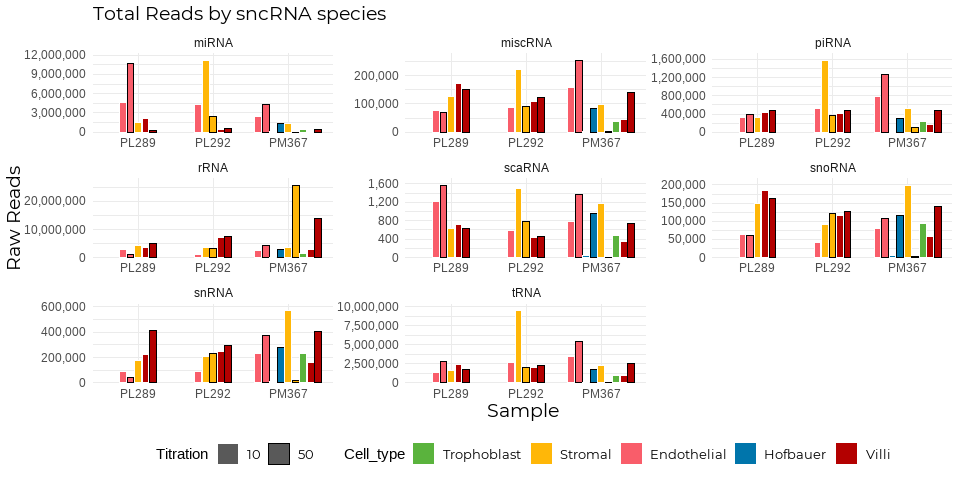
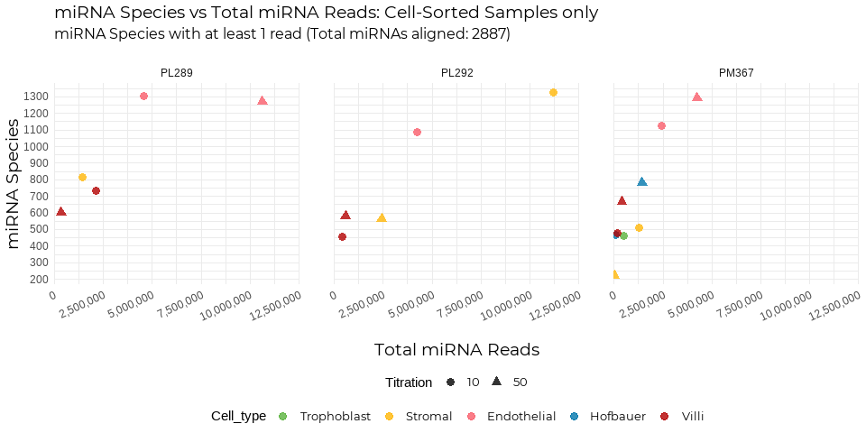
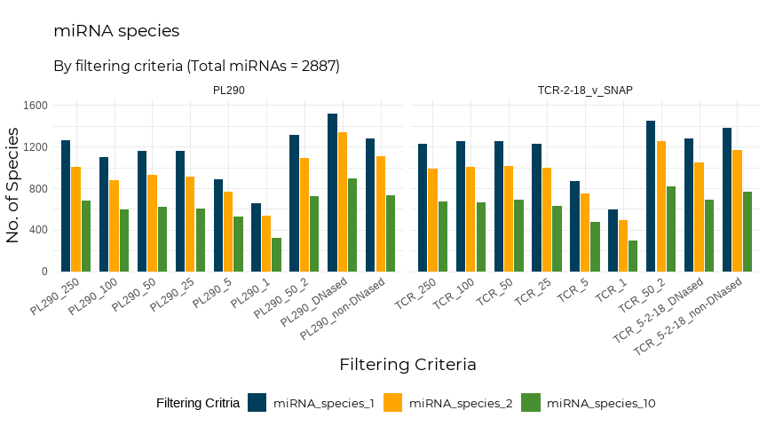

### 0.0 Introduction  

Here, I'm going to perform standard EDA on the Batch 3 data (both cell-sorted and whole villi). I'm only going to use miRNAs for all statistics, uness specified.  
  

***  

### 1.0 Loading files and packages  


```r
library(tidyverse)
library(here)
library(readxl)
library(openxlsx)
library(arsenal)
library(pheatmap)
library(knitr)
library(rmarkdown)
library(data.table)
library(gridExtra)
library(scales)
```


```r
library(showtext)
library(extrafont)

font_paths("C:/Users/nikita.telkar/AppData/Local/Microsoft/Windows/Fonts")
```

```
## [1] "C:\\Users\\nikita.telkar\\AppData\\Local\\Microsoft\\Windows\\Fonts"
## [2] "C:\\Windows\\Fonts"
```

```r
font_add("Montserrat", regular = "Montserrat-Regular.ttf")

showtext_auto()

my_theme <- theme_minimal() + theme(plot.title = element_text(family = "Montserrat", size = 14),
    plot.subtitle = element_text(family = "Montserrat", size = 12), legend.text = element_text(family = "Montserrat",
        size = 10), axis.title = element_text(family = "Montserrat", size = 14))

colpal <- list(Titration = c(`250` = "#003f5c", `100` = "#444e86", `50` = "#955196", `25` = "#dd5182",
    `5` = "#ff6e54", `1` = "#ffa600"), Conc = c(`10` = "#00cfe3", `50` = "#003f5c"), Trimester = c(First = "#8bab48",
    Term = "#488f31"), Extraction = c(TRIzol = "#de425b", miRVana = "#009900"), Cell_type = c(Trophoblast = "#5ab33d",
    Stromal = "#ffb708", Endothelial = "#f95d6a", Hofbauer = "#0075ab", Villi = "#b30000"),
    PM = c(PM384 = "#f2c080", PM385 = "#496076"), DNased = c(Yes = "#67c392", No = "#969695"))
```


```r
eDat <- readRDS(file = here::here("Batch_3", "data", "processed", "eDat.RDS"))
pDat <- readRDS(file = here::here("Batch_3", "data", "processed", "pDat.RDS"))
mDat <- readRDS(file = here::here("Batch_3", "data", "processed", "mDat.RDS"))
all <- readRDS(file = here::here("Batch_3", "data", "processed", "all_sncRNA.RDS"))

eDat_Batch2 <- read_excel("Z:/Nikita/Projects/titration/data/external/overview_run_n_w_hrtp-cs_test_all_250-1_test_1/quantification_raw.xlsx")
pDat_Batch2 <- read_excel(here::here("Batch_3", "data", "processed", "pDat_Batch2.xlsx"))
mDat_Batch2 <- readRDS("Z:/Nikita/Projects/titration/data/processed/mDat_GSC_1790.rds")

# pDat containing only PL290 and TCR Samples
pDat_Batch3 <- read_excel(here::here("Batch_3", "data", "processed", "pDat_Batch3.xlsx"))
```

Making separate dfs for `PL290v and TCR-5-18` and `PM384 and PM385` samples


```r
#splitting all Batch 3 by sncRNA
all_list <- all %>%
 split(f = as.factor(.$sncRNA))
sncRNA_order <- names(all_list)

#making Sample Column
pDat_Batch2 <- pDat_Batch2 %>% 
  mutate(v = case_when(
    Case_ID == "PL290" ~ "PL290",
    Case_ID == "TCR-2-18_v_SNAP" ~ "TCR"
  ))

pDat_Batch2 <- pDat_Batch2 %>%
 unite("Sample", c("v", "Titration"), sep = "_", remove = FALSE)
pDat_Batch2 <- pDat_Batch2[-c(12)]


#keeping only PL290 and TCR 250 - 5 ng samples
eDat_Batch2 <- eDat_Batch2 %>%
 unite("Reference", 1:2, sep = "_", remove = TRUE)
eDat_Batch2 <- eDat_Batch2[c(1:13)]
names(eDat_Batch2)
```

```
##  [1] "Reference"                                         
##  [2] "m19817_1_CGATGT_75bp_4_lanes.merge_chastity_passed"
##  [3] "m19818_1_TTAGGC_75bp_4_lanes.merge_chastity_passed"
##  [4] "m19819_1_TGACCA_75bp_4_lanes.merge_chastity_passed"
##  [5] "m19820_1_ACAGTG_75bp_4_lanes.merge_chastity_passed"
##  [6] "m19821_1_GCCAAT_75bp_4_lanes.merge_chastity_passed"
##  [7] "m19822_1_CAGATC_75bp_4_lanes.merge_chastity_passed"
##  [8] "m19825_1_TAGCTT_75bp_4_lanes.merge_chastity_passed"
##  [9] "m19826_1_GGCTAC_75bp_4_lanes.merge_chastity_passed"
## [10] "m19827_1_CTTGTA_75bp_4_lanes.merge_chastity_passed"
## [11] "m19828_1_AAACAT_75bp_4_lanes.merge_chastity_passed"
## [12] "m19829_1_AAAGCA_75bp_4_lanes.merge_chastity_passed"
## [13] "m19830_1_AAATGC_75bp_4_lanes.merge_chastity_passed"
```

```r
colnames(eDat_Batch2) [2:13] <- pDat_Batch2$Sample


#subsetting only PL290 and TCR expression columns from Batch 3
eDat_Batch3 <- all[c(1,2,23:28)]
eDat_Batch3 <- eDat_Batch3 %>% 
  filter(sncRNA == "miRNA") %>% 
  dplyr::select(-sncRNA)


#funnily enough, the total number of miRNAs mapped for Batch 2 and Batch 3 were the same 


#making PL290 and TCR Batch 2 and 3 samples eDat
eDat_conc <- eDat_Batch2 %>% 
  inner_join(eDat_Batch3, by = "Reference")

#matching column order of pDat2 to pDat3
pDat_Batch2 <- pDat_Batch2[names(pDat_Batch3)]

#making PL290 and TCR Batch 2 and 3 samples pDat
pDat_conc <- rbind(pDat_Batch2, pDat_Batch3)
glimpse(pDat_conc)
```

```
## Rows: 18
## Columns: 11
## $ RobLab_ID  <chr> "PL290_v_RNAlater", "PL290_v_RNAlater", "PL290_v_RNAlater",~
## $ Sample     <chr> "PL290_250", "PL290_100", "PL290_50", "PL290_25", "PL290_5"~
## $ GSC_ID     <chr> "m19817", "m19818", "m19819", "m19820", "m19821", "m19822",~
## $ Case_ID    <chr> "PL290", "PL290", "PL290", "PL290", "PL290", "PL290", "TCR-~
## $ GSC_Batch  <dbl> 2, 2, 2, 2, 2, 2, 2, 2, 2, 2, 2, 2, 3, 3, 3, 3, 3, 3
## $ Titration  <dbl> 250, 100, 50, 25, 5, 1, 250, 100, 50, 25, 5, 1, 50, 50, 50,~
## $ Trimester  <chr> "First", "First", "First", "First", "First", "First", "Term~
## $ Sex        <chr> "Female", "Female", "Female", "Female", "Female", "Female",~
## $ DNased     <chr> NA, NA, NA, NA, NA, NA, NA, NA, NA, NA, NA, NA, "Yes", "Yes~
## $ Extraction <chr> "TRIzol", "TRIzol", "TRIzol", "TRIzol", "TRIzol", "TRIzol",~
## $ Beads      <chr> "Steel", "Steel", "Steel", "Steel", "Steel", "Steel", "Stee~
```

```r
pDat_conc$Titration <- as.factor(pDat_conc$Titration)
pDat_conc$Extraction <- as.factor(pDat_conc$Extraction)
pDat_conc$Beads <- as.factor(pDat_conc$Beads)
pDat_conc$GSC_Batch <- as.factor(pDat_conc$GSC_Batch)

eDat_conc <- eDat_conc %>%
  column_to_rownames(var = "Reference")

#for easier reference later on
colnames(eDat_conc)[13:14] <- c("PL290_50_2", "TCR_50_2")

all(colnames(eDat_conc) == pDat_conc$Sample)
```

```
## [1] TRUE
```

```r
#Making pDat and eDat for PM384 and PM385

pDat_PMs <- mDat[27:30,]
pDat_PMs <- rbind(pDat_PMs, mDat[20,])
pDat_PMs <- pDat_PMs %>%#chnaging order of rows
  slice(3,1,4,2,5)
eDat_PMs <- all[c(1,2,31,29,32,30,22)]
# eDat_PMs <- eDat %>% 
#   dplyr::select(which(names(eDat) %in% pDat_PMs$Sample))
eDat_PMs <- eDat_PMs %>%
 split(f = as.factor(.$sncRNA))
```

### 2.0 Cell-Sorted Samples  

#### 2.1 Summary on Sequences / Reads QC

<!-- --><!-- --><!-- -->

> The GSC has already advised that 30-50% of the reads covered are true miRNAs, so the higher percentage figure seen for unmapped reads make sense.  

***  

#### 2.2 Read Filtering {.tabset}

##### Total Reads for all sncRNAs for all cell-sorted samples   


```
## # A tibble: 6 x 10
##   Sample        RobLab_ID Case_ID GSC_RNAconc_ng_~ Titration Titrated Sample_type
##   <chr>         <chr>     <chr>              <dbl> <fct>     <chr>    <chr>      
## 1 PL289_endo_10 PL289_en~ PL289                  5 10        yes      Cells      
## 2 PL289_endo_10 PL289_en~ PL289                  5 10        yes      Cells      
## 3 PL289_endo_10 PL289_en~ PL289                  5 10        yes      Cells      
## 4 PL289_endo_10 PL289_en~ PL289                  5 10        yes      Cells      
## 5 PL289_endo_10 PL289_en~ PL289                  5 10        yes      Cells      
## 6 PL289_endo_10 PL289_en~ PL289                  5 10        yes      Cells      
## # ... with 3 more variables: Cell_type <chr>, sncRNA <chr>, reads <dbl>
```

<!-- -->

##### Total miRNA Reads for all cell-sorted samples   

<!-- -->

***  

#### 2.3 Species Filtering   

I'm going to now count the number of miRNA species for each sample which have:  

- At least 1 read count for a species  
- At at least 10 read counts for a species  


```r
miRNA_species <- all_list$miRNA
miRNA_species <- miRNA_species[-c(1, 2)]

# all miRNA species with at least 1 count
miRNA_species_1 <- colSums(miRNA_species != 0)

miRNA_species_1 <- as.data.frame(miRNA_species_1)
miRNA_species_1$miRNA_species_2 <- colSums(miRNA_species >= 2)
miRNA_species_1$miRNA_species_10 <- colSums(miRNA_species >= 10)  #all miRNA species with at least 10 counts

colnames(miRNA_species_1)[1] <- "miRNA_species_1"

miRNA_species <- miRNA_species_1
rm(miRNA_species_1)

miRNA_species <- miRNA_species %>%
    rownames_to_column(var = "Sample")

mDat <- mDat %>%
    inner_join(miRNA_species, by = "Sample")

miRNA_species %>%
    kable()
```


```r
# function to get dimensions of a list
f1 <- function(x) {
    list(dim = dim(x))
}


cs_list <- all[c(1:21)]

cs_list <- cs_list %>%
    split(f = as.factor(.$sncRNA))

dim_all <- lapply(cs_list, f1)
dim_all <- as.data.frame(unlist(dim_all))


# only keeping seqs with read count of >= 2
total_species <- map(cs_list, function(x) x %>%
    dplyr::select(-sncRNA) %>%
    filter_all(all_vars(. >= 2)))

# Hmm, looks like none of the scaRNAs passed that minimum 2 filter

total_species <- within(total_species, rm(scaRNA))

total_species <- map(total_species, function(x) x %>%
    column_to_rownames(var = "Reference"))

total_species %>%
    map(function(x) x %>%
        min(x))
```

```
## $miRNA
## [1] 2
## 
## $miscRNA
## [1] 2
## 
## $piRNA
## [1] 2
## 
## $rRNA
## [1] 3
## 
## $snoRNA
## [1] 2
## 
## $snRNA
## [1] 2
## 
## $tRNA
## [1] 2
```


Perfect, the lowest read count value for all sncRNA species is 2.  

***  

#### 2.4 miRNAs Statistics  

<!-- -->

***  

Total miRNAs filtered by minimum read count  


```r
order <- pDat_cs$Sample
pDat_cs$Sample <- fct_relevel(pDat_cs$Sample, order)

pDat_cs %>%
    pivot_longer(cols = c(miRNA_species_1, miRNA_species_2, miRNA_species_10), names_to = "filtering_criteria",
        values_to = "no_of_species") %>%
    mutate(filtering_criteria = fct_relevel(filtering_criteria, c("miRNA_species_1", "miRNA_species_2",
        "miRNA_species_10"))) %>%
    ggplot(aes(x = Titration, y = no_of_species, fill = filtering_criteria, group = Sample)) +
    geom_bar(stat = "identity", position = position_dodge2(preserve = "single"), width = 0.8) +
    # geom_text(aes(label = no_of_species), colour = '#333333', vjust = -0.8, position =
    # position_dodge(0.8)) +
scale_fill_manual(values = c("#003f5c", "#ffa600", "#488f31")) + scale_y_continuous(expand = expansion(mult = c(0,
    0.09))) + facet_grid(rows = vars(Case_ID), scales = "free_x", space = "free", cols = vars(Cell_type)) +
    my_theme + theme(legend.position = "bottom") + #theme(axis.text.x = element_text(angle = 35, hjust = 1)) + my_theme
    my_theme + theme(legend.position = "bottom") + #theme(axis.text.x = element_text(angle = 35, hjust = 1)) + +
    my_theme + theme(legend.position = "bottom") + #theme(axis.text.x = element_text(angle = 35, hjust = 1)) + theme(legend.position
    my_theme + theme(legend.position = "bottom") + #theme(axis.text.x = element_text(angle = 35, hjust = 1)) + =
    my_theme + theme(legend.position = "bottom") + #theme(axis.text.x = element_text(angle = 35, hjust = 1)) + "bottom")
    my_theme + theme(legend.position = "bottom") + #theme(axis.text.x = element_text(angle = 35, hjust = 1)) + +
    my_theme + theme(legend.position = "bottom") + #theme(axis.text.x = element_text(angle = 35, hjust = 1)) + #theme(axis.text.x
    my_theme + theme(legend.position = "bottom") + #theme(axis.text.x = element_text(angle = 35, hjust = 1)) + =
    my_theme + theme(legend.position = "bottom") + #theme(axis.text.x = element_text(angle = 35, hjust = 1)) + element_text(angle
    my_theme + theme(legend.position = "bottom") + #theme(axis.text.x = element_text(angle = 35, hjust = 1)) + =
    my_theme + theme(legend.position = "bottom") + #theme(axis.text.x = element_text(angle = 35, hjust = 1)) + 35,
    my_theme + theme(legend.position = "bottom") + #theme(axis.text.x = element_text(angle = 35, hjust = 1)) + hjust
    my_theme + theme(legend.position = "bottom") + #theme(axis.text.x = element_text(angle = 35, hjust = 1)) + =
    my_theme + theme(legend.position = "bottom") + #theme(axis.text.x = element_text(angle = 35, hjust = 1)) + 1))
    my_theme + theme(legend.position = "bottom") + #theme(axis.text.x = element_text(angle = 35, hjust = 1)) + +
labs(title = "miRNA species", subtitle = "By filtering criteria (Total miRNAs = 2887)", x = "Filtering Criteria",
    y = "No. of Species", fill = "Filtering Critria")
```

<!-- -->


***  


##### miRNA species vs. Total miRNA Reads  {.tabset}  

1. Total miRNA Reads vs Percentage of Reads Mapped  

<!-- -->

***  

###### 2. Total miRNA species with >=1 read  

<!-- -->

***  

###### 3. Total miRNA species with >=2 read  

<!-- -->


###### 4. Total miRNA species with >=10 reads  

<!-- -->

***  

#### 2.5 Comparing Manual vs. miRMaster Aligned Counts  

For sample PL289_50 (GSC ID: M20072), I manually aligned the reads using STAR to the reference hg38 genome. I'll compare a few statistics here:  


```r
manual <- read_excel(here::here("Batch_3", "data", "processed", "M20072_counts_manual.xlsx"))
manual_mDat <- read_excel(here::here("Batch_3", "data", "processed", "M20072_counts_manual_mDat.xlsx"))

# manual sequences have already filtered for minimum read count of 2
head(manual)
```

```
## # A tibble: 6 x 2
##   entrezgene_id manual_counts
##   <chr>                 <dbl>
## 1 653635                    2
## 2 102723897                 2
## 3 79854                     2
## 4 148398                    6
## 5 26155                     4
## 6 339451                   11
```

```r
manual_list <- manual_mDat %>%
    split(f = as.factor(.$gene_biotype))

manual_list <- lapply(manual_list, f1)
manual_list <- as.data.frame(unlist(manual_list))


# selecting PL289_50 miRMaster data
M20072_miRMaster <- all %>%
    dplyr::select(Reference, sncRNA, PL289_50)
dim(M20072_miRMaster)
```

```
## [1] 9098    3
```

```r
# filtering to keep min count of 2
M20072_miRMaster <- M20072_miRMaster %>%
    filter(PL289_50 >= 2)
dim(M20072_miRMaster)
```

```
## [1] 3142    3
```

```r
M20072_miRMaster <- M20072_miRMaster %>%
    split(f = as.factor(.$sncRNA))

M20072_miRMaster <- lapply(M20072_miRMaster, f1)
M20072_miRMaster <- as.data.frame(unlist(M20072_miRMaster))

# there's no piRNA and tRNA mapped at all in manual, and it has lncRNA. Will have to
# remove lncRNA and add tRNA and piRNA
sncrownames <- row.names(M20072_miRMaster)
sncrownames
```

```
##  [1] "miRNA.dim1"   "miRNA.dim2"   "miscRNA.dim1" "miscRNA.dim2" "piRNA.dim1"  
##  [6] "piRNA.dim2"   "rRNA.dim1"    "rRNA.dim2"    "scaRNA.dim1"  "scaRNA.dim2" 
## [11] "snoRNA.dim1"  "snoRNA.dim2"  "snRNA.dim1"   "snRNA.dim2"   "tRNA.dim1"   
## [16] "tRNA.dim2"
```

```r
sncrownames <- sncrownames[c(5, 6, 15, 16)]
sncrownames <- as.data.frame(sncrownames)
sncrownames$M20072_manual <- 0
sncrownames <- sncrownames %>%
    column_to_rownames(var = "sncrownames")

# now removing lncRNA and binding sncrownames rows to manual
manual_list <- tail(manual_list, -2)
colnames(manual_list)[1] <- "M20072_manual"
manual_list <- rbind(manual_list, sncrownames)

# let's check that the sncRNAs are in the right order
row.names(manual_list)
```

```
##  [1] "miRNA.dim1"    "miRNA.dim2"    "misc_RNA.dim1" "misc_RNA.dim2"
##  [5] "rRNA.dim1"     "rRNA.dim2"     "scaRNA.dim1"   "scaRNA.dim2"  
##  [9] "snoRNA.dim1"   "snoRNA.dim2"   "snRNA.dim1"    "snRNA.dim2"   
## [13] "piRNA.dim1"    "piRNA.dim2"    "tRNA.dim1"     "tRNA.dim2"
```

```r
row.names(M20072_miRMaster)
```

```
##  [1] "miRNA.dim1"   "miRNA.dim2"   "miscRNA.dim1" "miscRNA.dim2" "piRNA.dim1"  
##  [6] "piRNA.dim2"   "rRNA.dim1"    "rRNA.dim2"    "scaRNA.dim1"  "scaRNA.dim2" 
## [11] "snoRNA.dim1"  "snoRNA.dim2"  "snRNA.dim1"   "snRNA.dim2"   "tRNA.dim1"   
## [16] "tRNA.dim2"
```

```r
# they're not. Also, manual has miscRNA listed as misc_RNA. Removing that underscrore:
manual_list <- as.data.frame(t(manual_list))
names(manual_list)
```

```
##  [1] "miRNA.dim1"    "miRNA.dim2"    "misc_RNA.dim1" "misc_RNA.dim2"
##  [5] "rRNA.dim1"     "rRNA.dim2"     "scaRNA.dim1"   "scaRNA.dim2"  
##  [9] "snoRNA.dim1"   "snoRNA.dim2"   "snRNA.dim1"    "snRNA.dim2"   
## [13] "piRNA.dim1"    "piRNA.dim2"    "tRNA.dim1"     "tRNA.dim2"
```

```r
colnames(manual_list)[3:4] <- c("miscRNA.dim1", "miscRNA.dim2")
manual_list <- as.data.frame(t(manual_list))

manual_list <- manual_list %>%
    rownames_to_column(var = "sncRNA")
M20072_miRMaster <- M20072_miRMaster %>%
    rownames_to_column(var = "sncRNA")

M20072 <- manual_list %>%
    inner_join(M20072_miRMaster, by = "sncRNA")
M20072 <- M20072 %>%
    column_to_rownames(var = "sncRNA")
M20072$v <- c("rows", "columns")
M20072 <- M20072 %>%
    filter(v == "rows")
colnames(M20072)[1:2] <- c("M20072_manual", "M20072_miRMaster")
row.names(M20072)
```

```
## [1] "miRNA.dim1"   "miscRNA.dim1" "rRNA.dim1"    "scaRNA.dim1"  "snoRNA.dim1" 
## [6] "snRNA.dim1"   "piRNA.dim1"   "tRNA.dim1"
```

```r
row.names(M20072) <- c("miRNA", "miscRNA", "rRNA", "scaRNA", "snoRNA", "snRNA", "piRNA", "tRNA")
M20072 <- M20072[c(1, 2)]
M20072 %>%
    kable()
```


|        | M20072_manual| M20072_miRMaster|
|:-------|-------------:|----------------:|
|miRNA   |           596|              578|
|miscRNA |             8|              773|
|rRNA    |             1|               54|
|scaRNA  |            12|               18|
|snoRNA  |           207|              441|
|snRNA   |            25|              477|
|piRNA   |             0|              390|
|tRNA    |             0|              411|

```r
M20072 %>%
    rownames_to_column(var = "sncRNA") %>%
    pivot_longer(cols = 2:3, names_to = "Mapping", values_to = "Species") %>%
    ggplot(aes(x = sncRNA, y = Species, fill = Mapping)) + geom_bar(stat = "identity", position = position_dodge2(preserve = "single"),
    width = 0.6) + geom_text(aes(label = Species), vjust = -0.8, colour = "#333333", position = position_dodge(0.65)) +
    scale_y_continuous(expand = expansion(mult = c(0, 0.09))) + scale_fill_manual(values = c("#ec7e74",
    "#b44a56")) + my_theme + theme(legend.position = "bottom") + labs(title = "M20072 sncRNA Species by Alignment Method",
    subtitle = "Manual Alignment vs. miRMaster: minimum count of 2 reads", x = "sncRNA", y = "No. of Species",
    fill = "Alignment
       Method")
```

<!-- -->

The actual expression counts cannot be compared because manual mapping only gives the miRNA in it's precursor form i.e., mir-21 and miRMaster align it using mir-21-3p and mir-21-5p  

***  


### 2.0 PL290v and TCR-5-18  

#### 2.1 Total Reads  

<!-- --><!-- --><!-- -->

***  

#### 2.2 Species Filtering   

I'm going to now count the number of miRNA species for each sample which have:  

- At least 1 read count for a species  
- At least 2 read counts for a species  
- At at least 10 read counts for a species 


<!-- -->

<!-- -->

<!-- -->


***  

#### 2.2 miRNA species vs. Total miRNA Reads  {.tabset}  


##### 1. Total miRNA species with >=1 read  


<!-- -->


<!-- -->


***  

##### 2. Total miRNA species with >=2 reads  

<!-- -->


<!-- -->

***  

##### 3. Total miRNA species with >=10 reads  

<!-- -->

<!-- -->

***  


### 3.0 PM384 and PM385  

#### 3.1 Total Reads 

<!-- --><!-- --><!-- --><!-- -->
  
***

#### 3.2 Species Filtering   

I'm going to now count the number of miRNA species for each sample which have:  

- At least 1 read count for a species  
- At least 2 read counts for a species  
- At at least 10 read counts for a species 

<!-- -->

***  

#### miRNA species vs. Total miRNA Reads  {.tabset}  

1. Total miRNA Reads vs Percentage of Reads Mapped  

<!-- -->

```
## List of 3
##  $ legend.margin  : 'margin' num [1:4] 0points 0points 0points 0points
##   ..- attr(*, "unit")= int 8
##  $ legend.position: chr "bottom"
##  $ legend.box     : chr "vertical"
##  - attr(*, "class")= chr [1:2] "theme" "gg"
##  - attr(*, "complete")= logi FALSE
##  - attr(*, "validate")= logi TRUE
```

***  

##### 2. Total miRNA species with >=1 read  

<!-- -->

***  

##### 3. Total miRNA species with >=2 reads  

<!-- -->

***  

##### 4. Total miRNA species with >=10 reads  

<!-- -->

***  

### 4.0 Saving Data  


```r
write_rds(eDat, file = here::here("Batch_3", "data", "processed", "eDat.RDS"))
write_rds(pDat, file = here::here("Batch_3", "data", "processed", "pDat.RDS"))
write_rds(mDat, file = here::here("Batch_3", "data", "processed", "mDat.RDS"))
write_rds(all, file = here::here("Batch_3", "data", "processed", "all_sncRNA.RDS"))

write_rds(eDat_conc, file = here::here("Batch_3", "data", "processed", "eDat_titrations.RDS"))
write_rds(pDat_conc, file = here::here("Batch_3", "data", "processed", "pDat_titrations.RDS"))

write_rds(eDat_PMs, file = here::here("Batch_3", "data", "processed", "eDat_PMs.RDS"))
write_rds(pDat_PMs, file = here::here("Batch_3", "data", "processed", "pDat_PMs.RDS"))
```


