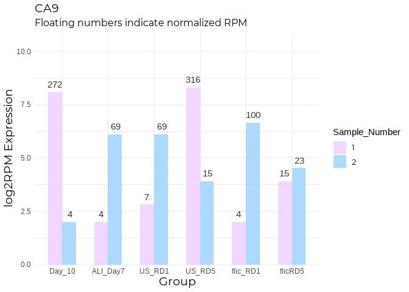
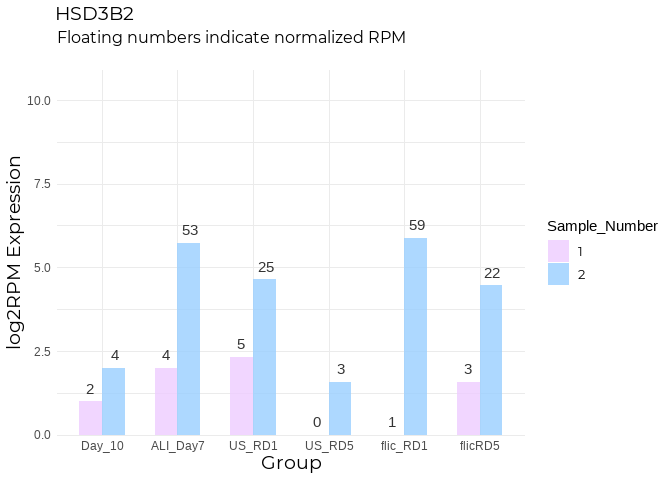
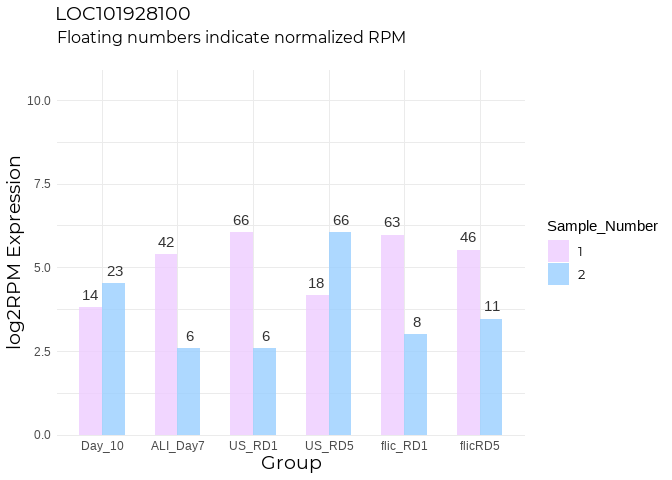
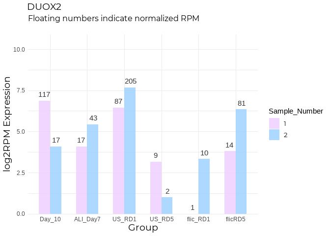
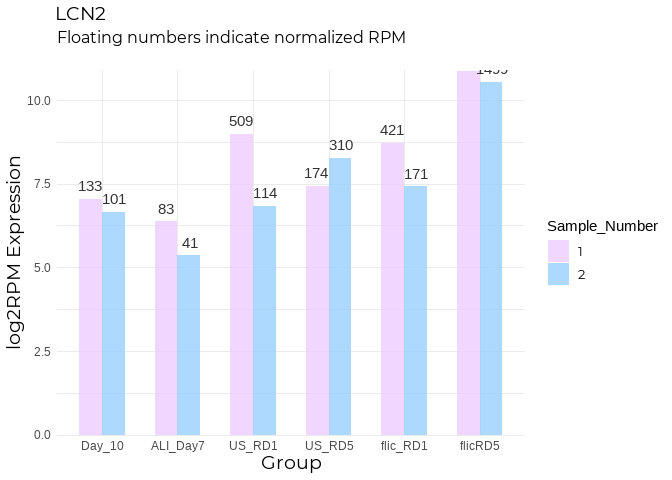

---
title: "Exploring Steiner IBD Model Data" 
author: Nikita Telkar 
date: "February 11, 2021"
output: 
  html_document: 
    keep_md: yes 
    toc: true 
    toc_depth: 4
    toc_float: 
      collapsed: false 
      smooth_scroll: false 
    theme: paper  #cosmo, paper, lumen, sandstone, simplex, yeti; cerulean, journal, flatly, darkly, readable, spacelab, united
    highlight: espresso #tango, pygments, kate, monochrome, espresso, zenburn, haddock, textmate.
---  

### 0.0  Introduction  

Here, I'm going to explore the preliminary data files obtained from the Steiner Lab for their IBD disease model project.  

***

### 1.0 Loading Libraries  


```r
#data handling packages
library(tibble)
```

```
## Warning: package 'tibble' was built under R version 4.0.5
```

```r
library(here) 
library(tidyverse)
library(openxlsx)
library(data.table)
library(rlist)
library(readxl)
library(DT)
library(rmarkdown)
```

```
## Warning: package 'rmarkdown' was built under R version 4.0.5
```

```r
library(knitr)
```

```
## Warning: package 'knitr' was built under R version 4.0.5
```

```r
library(factoextra)
library(reshape2)

#analysis packages
library(pheatmap)
library(limma)
library(edgeR)
library(irlba)

#extra packages
library(kableExtra)
library(formatR)
library(janitor)
library(scales)
library(ggpubr)
library(RColorBrewer)
library(showtext)
library(gridExtra)

knitr::opts_chunk$set(fig.showtext = TRUE, fig_retina = 1) #needed to render show_text
knitr::opts_chunk$set(warning = FALSE, error = FALSE, message = FALSE)


font_add_google("Montserrat", "Mont")
showtext_auto()

my_theme <- theme_minimal() +
  theme(plot.title = element_text(family = "Mont", size = 14),
        plot.subtitle = element_text(family = "Mont", size = 12),
        legend.text = element_text(family = "Mont", size = 10),
        axis.title = element_text(family = "Mont", size = 14))

cbPalette <- c("#56B4E9", "#E69F00", "#009E73", "#0072B2", "#D55E00", "#999999")
cbPalette2 <- c("#CC79A7", "#999999", "#E69F00", "#0072B2" , "#009E73", "#D55E00")
#pie(rep(1, 6), col = cbPalette2)
```

### 2.0 Abbreviations and Background  

| Abbreviation | Full Form |  
| -- | -- |
| US | Untreated |  
| RD | Rounds of Damage |  
| FliC | Flagellin - bacteria to introduce inflammation |  
| ALI | Air liquid interface |   

Samples:  
2 sites from 2 donors  

1. 59C  
2. 75C  

- Cells harvested from colon biopsies were grown in a monolayer for 10 days.  
- ALI for 7 days (to allow cells to differentiate)  
- Add media for 4 hours 
- +/- Flic for 3 hours  
- Re- ALI for 3 days  
- Repeat 5 times  

### 3.0 Comparisons  

1. Day 10 (undifferentiated baseline) vs Day 7 ALI (differentiated baseline)  
    + Day 7 ALI should show genes enriched in cell patterning markers  
    + Day 10 would have a more homogeneous profile with upregulated cell growth genes  
2. US RD1 vs US RD5  
    + Are damage response genes heavily over expressed at RD5?  
    + Which genes are downregulated?  
3. US RD1 vs FliC RD1
    + Expression profiles should be drastically different with FliC RD1 showing exponentially increased immune/infection response and cell-cycle damage genes  
4. FliC RD1 vs Flic RD5  
    + Do infection response genes consistently rise or reach a plateau?  Or do they stop responding after a while?  
5. 


Let's take a look at all of the files that we have, taking Day 10 vs ALI Day 7 as an example:  


```r
setwd("Z:/Nikita/Projects/ibd_steiner")

sample <- read.table(here::here("data", "DESeq2", "Day-10_vs_ALI_Day7", "samples.txt"))
sample
```

```
##           V1
## 1       name
## 2 59C-Day-10
## 3 75C-Day-10
## 4 59C-ALI-D7
## 5 75C-ALI-D7
##                                                                                                   V2
## 1                                                                                               file
## 2 /data/scratch/workspace/RunFolder/Analysis/samples/Day10/replicates/59C-Day-10/counts/counts.genes
## 3 /data/scratch/workspace/RunFolder/Analysis/samples/Day10/replicates/75C-Day-10/counts/counts.genes
## 4 /data/scratch/workspace/RunFolder/Analysis/samples/ALID7/replicates/59C-ALI-D7/counts/counts.genes
## 5 /data/scratch/workspace/RunFolder/Analysis/samples/ALID7/replicates/75C-ALI-D7/counts/counts.genes
##      V3             V4
## 1 group Sample_Pair_ID
## 2 Day10          Pair1
## 3 Day10          Pair2
## 4 ALID7          Pair1
## 5 ALID7          Pair2
```

```r
counts <- utils::read.csv(here::here("data", "DESeq2", "Day-10_vs_ALI_Day7", "Day10_vs_ALID7.deseq.counts.csv"))
head(counts)
```

```
##           X X59C.Day.10 X75C.Day.10 X59C.ALI.D7 X75C.ALI.D7
## 1   DDX11L1           0           0           0           0
## 2    WASH7P          16           6          20           4
## 3 MIR6859-3           0           0           0           0
## 4 MIR6859-2           0           0           0           0
## 5 MIR6859-4           0           0           0           0
## 6 MIR6859-1           0           0           0           0
```

```r
res <- utils::read.csv(here::here("data", "DESeq2", "Day-10_vs_ALI_Day7", "Day10_vs_ALID7.deseq.res.csv"))
head(res)
```

```
##           X  GeneName baseMean log2FoldChange    lfcSE         stat    pvalue
## 1   DDX11L1   DDX11L1  0.00000            NaN      NaN          NaN       NaN
## 2    WASH7P    WASH7P 11.20226   0.0001113504 0.225757 0.0004932314 0.9996065
## 3 MIR6859-3 MIR6859-3  0.00000            NaN      NaN          NaN       NaN
## 4 MIR6859-2 MIR6859-2  0.00000            NaN      NaN          NaN       NaN
## 5 MIR6859-4 MIR6859-4  0.00000            NaN      NaN          NaN       NaN
## 6 MIR6859-1 MIR6859-1  0.00000            NaN      NaN          NaN       NaN
##        padj status
## 1       NaN    Low
## 2 0.9998297     OK
## 3       NaN    Low
## 4       NaN    Low
## 5       NaN    Low
## 6       NaN    Low
```

```r
#padj = BH

rlog <- utils::read.csv(here::here("data", "DESeq2", "Day-10_vs_ALI_Day7", "Day10_vs_ALID7.deseq.rlog.csv"))
head(rlog)
```

```
##           X X59C.Day.10 X75C.Day.10 X59C.ALI.D7 X75C.ALI.D7
## 1   DDX11L1    0.000000    0.000000    0.000000    0.000000
## 2    WASH7P    3.499796    3.424629    3.529491    3.398756
## 3 MIR6859-3    0.000000    0.000000    0.000000    0.000000
## 4 MIR6859-2    0.000000    0.000000    0.000000    0.000000
## 5 MIR6859-4    0.000000    0.000000    0.000000    0.000000
## 6 MIR6859-1    0.000000    0.000000    0.000000    0.000000
```

```r
metrics <- utils::read.csv(here::here("data", "DESeq2", "Day-10_vs_ALI_Day7", "deseq.metrics.csv"))
metrics
```

```
##          genes X26364
## 1       tested  13438
## 2 differential    580
```

```r
#differential = res$padj < 0.05

dendogram <- utils::read.csv(here::here("data", "DESeq2", "Day-10_vs_ALI_Day7", "GeneDendrogram.csv"))
head(dendogram)
```

```
##   X419 X420 X1.77461386508e.06 X2.0
## 1  263  264       2.676353e-06    2
## 2  193  194       3.151264e-06    2
## 3  130  131       5.385397e-06    2
## 4  104  105       6.572008e-06    2
## 5  397  398       8.894582e-06    2
## 6  258  259       1.018265e-05    2
```

```r
#doesn't have gene labels?

dim(res)
```

```
## [1] 26364     9
```

```r
res <- na.omit(res)

#volcano plot
res <- res %>% 
  mutate(Significant = case_when(
    log2FoldChange > 1 & padj < 0.05 ~ "Yes",
    log2FoldChange > 1 & padj > 0.05 ~ "No",
    log2FoldChange < -1 & padj < 0.05 ~ "Yes",
    log2FoldChange < -1 & padj > 0.05 ~ "No",
    between(log2FoldChange, -1, 1) & padj < 0.05 ~ "No",
    between(log2FoldChange, -1, 1) & padj > 0.05 ~ "No"
  )
  ) 

#log2FC = 1 --> 2x more, 2 --> 4x more

res %>% 
  ggplot(aes(x = log2FoldChange, y = -log10(padj), colour = Significant)) +
  geom_point() + 
  coord_cartesian(x=c(-3.5,3.5)) +
  geom_vline(xintercept = c(-1, 1), color = "#999999") +
  geom_hline(yintercept = c(-log10(0.05)), color = "#999999") +
  scale_colour_manual(values = c("#333333", "#0099ff"), guide=F) 
```

<!-- -->

Loading all res files from all comparisons:


```r
#res_all <- list.files(pattern = "res.csv$", recursive = TRUE) --> doesn't work, but works in console. 

#list.files() --> directory is the R folder for some reason, even tho here(), and getwd() is ibd_steiner. Will have to put in absolute path itself

res_all <- list.files(path = "Z:/Nikita/Projects/ibd_steiner", pattern = "res.csv$", recursive = TRUE)

res_all
```

```
## [1] "data/DESeq2/Day-10_vs_ALI_Day7/Day10_vs_ALID7.deseq.res.csv"           
## [2] "data/DESeq2/Day-10_vs_FliC-RD1/Day10_vs_FliCRD1D3.deseq.res.csv"       
## [3] "data/DESeq2/Day-10_vs_FliC-RD5/Day10_vs_FliCRD5D3.deseq.res.csv"       
## [4] "data/DESeq2/Day-10_vs_US-RD1/Day10_vs_USRD1D3.deseq.res.csv"           
## [5] "data/DESeq2/Day-10_vs_US-RD5/Day10_vs_USRD5D3.deseq.res.csv"           
## [6] "data/DESeq2/US-RD1_vs_FliC-RD1/USRD1D3_vs_FliCRD1D3.deseq.res.csv"     
## [7] "data/DESeq2/US-RD5_vs_FliC-RD5/USRD5D3_vs_FliCRD5D3.deseq.res.csv"     
## [8] "data/DESeq2/US-RD5_vs_US-RD1/USRD5D3_vs_USRD1D3.deseq.res.csv"         
## [9] "data/DESeq2/zFliC-RD5_vs_FliC-RD1/FliCRD5D3_vs_FliCRD1D3.deseq.res.csv"
```

```r
res_all <- lapply(res_all, utils::read.csv)

#need to setwd to ibd_steiner + also check Knit directory and change to working directory

df_names <- c("d10_alid7", "d10_flicRD1", "d10_flicRD5", "d10_RD1", "d10_RD5", "RD1_flicRD1", "RD5_flicRD5", "RD5_RD1", "flicRD5_flicRD1") 
  
names(res_all) <- df_names
```

### 4.0 Making the expression and phenotype dataframes  

#### 4.1 Making pDat  


```r
pDat <- data.frame("Sample_ID" = c("59C", "75C"), "Sample_Number" = c("1", "2"), "Sex" = c("Female", "Male"), "Age" = c(49, 58), "Biopsy_Region" = c("Transverse", "Ascending"))

pDat <- pDat %>% 
  slice(rep(1:n(), each = 6)) #since we have 6 conditions, and 2 samples for each condition

pDat <- as.data.frame(t(pDat))

df_names_all <- c("59C_Day10", "59C_ALI_Day7", "59C_US_RD1", "59C_US_RD5", "59C_flic_RD1", "59C_flicRD5", "75C_Day10", "75C_ALI_Day7", "75C_US_RD1", "75C_US_RD5", "75C_flic_RD1", "75C_flicRD5")
colnames (pDat) <- df_names_all
pDat <- pDat [-1,]

pDat <- as.data.frame(t(pDat))

pDat$Condition <- as.factor(c("Day_10", "ALI_Day7", "US_RD1", "US_RD5", "flic_RD1", "flicRD5"))
pDat$Condition <- fct_relevel(c("Day_10", "ALI_Day7", "US_RD1", "US_RD5", "flic_RD1", "flicRD5"))

condition_level <- c("Day_10", "ALI_Day7", "US_RD1", "US_RD5", "flic_RD1", "flic_RD5")

pDat <- pDat %>% 
  dplyr::arrange(factor(Condition, levels = condition_level))

pDat <- pDat %>% 
  rownames_to_column(var = "group")

pDat$ID <- pDat$group
pDat$ID <- str_sub(pDat$ID, 1, 3)
pDat$ID <- as.factor(pDat$ID)

str(pDat)
```

```
## 'data.frame':	12 obs. of  7 variables:
##  $ group        : chr  "59C_Day10" "75C_Day10" "59C_ALI_Day7" "75C_ALI_Day7" ...
##  $ Sample_Number: chr  "1" "2" "1" "2" ...
##  $ Sex          : chr  "Female" "Male" "Female" "Male" ...
##  $ Age          : chr  "49" "58" "49" "58" ...
##  $ Biopsy_Region: chr  "Transverse" "Ascending" "Transverse" "Ascending" ...
##  $ Condition    : Factor w/ 6 levels "ALI_Day7","Day_10",..: 2 2 1 1 5 5 6 6 3 3 ...
##  $ ID           : Factor w/ 2 levels "59C","75C": 1 2 1 2 1 2 1 2 1 2 ...
```

```r
pDat <- pDat %>% 
  column_to_rownames(var = "group")

#write.xlsx(pDat, file = here::here("data", "Processed", "ibd_pDat.xlsx"), col.names = TRUE, row.names = TRUE)
```

#### 4.2 Making eDat  


```r
#reading in raw counts
raw <- list.files(pattern = ".counts.csv$", recursive = TRUE)
raw <- map(raw, read.csv)
names(raw) <- df_names
raw <- map(raw, function(x) {colnames(x)[1] <- "gene"; x} )

#binding all raw counts to create one df
eDat <- raw[[1]] #using d10_ali7 as base df

eDat <- eDat %>% 
  inner_join(raw[[8]]) %>%  # joining RD1 and RD5 counts 
  inner_join(raw[[9]]) #joining flicRD1 and flicRD5 counts

eDat <- eDat %>% 
  as.tibble() %>% 
  tibble::column_to_rownames(var = "gene") 

eDat <- eDat %>% 
  dplyr::select(1,3,5,7,9,11, everything())

#order is all messed up
#RD1 vs RD5 is 59C, 75C, 75C, 59C
eDat <- eDat %>% 
  dplyr::select(1,2,4,3,6,5,7,8,10,9,12,11)

eDat <- eDat %>% 
  dplyr::select(1,2,9,4:8,3,10:12)
names(eDat)
```

```
##  [1] "X59C.Day.10"      "X59C.ALI.D7"      "X59C.US.RD1.D3"   "X59C.US.RD5.D3"  
##  [5] "X59C.FliC.RD1.D3" "X59C.FliC.RD5.D3" "X75C.Day.10"      "X75C.ALI.D7"     
##  [9] "X75C.US.RD1.D3"   "X75C.US.RD5.D3"   "X75C.FliC.RD1.D3" "X75C.FliC.RD5.D3"
```

```r
colnames(eDat) <- row.names(pDat)

dim(eDat) #26,364 genes
```

```
## [1] 26364    12
```

```r
eDat <- eDat %>% 
  rownames_to_column(var = "gene")
#write.xlsx(eDat, file = here::here("data", "Processed", "ibd_eDat_raw.xlsx"), col.names = TRUE, row.names = TRUE)

eDat <- eDat %>% 
  column_to_rownames(var = "gene")

#RLE norm
genes <- as.data.frame(row.names(eDat))
norm <- DGEList(counts = eDat, samples = pDat, genes = genes)
eDat_norm <- calcNormFactors(norm, method = "RLE") 
eDat_norm <- cpm(eDat_norm)
eDat_norm <- as.data.frame(eDat_norm)

eDat_norm <- eDat_norm %>% 
  rownames_to_column(var = "gene")

#filtering by at least 0.01 count in all samples
eNorm <- eDat_norm %>% 
  filter_if(is.numeric, all_vars(. > 0.01)) %>% 
  #otherwise we loose genes that in one condition might have very low, but quite high in the others (eg  REN)
  column_to_rownames(var = "gene")

dim(eNorm) #14,173 genes
```

```
## [1] 14173    12
```

```r
#write.xlsx(eNorm, file = here::here("data", "Processed", "ibd_eDat_norm.xlsx"), col.names = TRUE, row.names = TRUE)

eDat_norm <- eDat_norm %>% 
  column_to_rownames(var = "gene")

#log2 transform counts for vizualization
eNorm_log2 <- log2(eNorm)
```


### 5.0 Exploratory Analysis 

#### 5.1 Volcano Plots  


```r
#removing all NAs
res_all <- lapply(res_all, na.omit)

#function to make the significance column for each df in the list
sign_column <- function(x) {
  x %>% 
    dplyr::mutate(Significant = case_when(
      log2FoldChange > 1 & padj < 0.05 ~ "Yes",
      log2FoldChange > 1 & padj > 0.05 ~ "No",
      log2FoldChange < -1 & padj < 0.05 ~ "Yes",
      log2FoldChange < -1 & padj > 0.05 ~ "No",
      between(log2FoldChange, -1, 1) & padj < 0.05 ~ "No",
      between(log2FoldChange, -1, 1) & padj > 0.05 ~ "No"
    )
    ) 
}

res_all <- lapply(res_all, sign_column)

vplots <- list() #creating an empty list to store all the plots.

#for loop to make plots for each miRNA. Cannot figure out how to wr loop in a function
for (i in seq_along(res_all)){
  x <- ggplot(res_all[[i]], aes(x = log2FoldChange, y = -log10(padj), colour = Significant)) +
    geom_point() +
    coord_cartesian(x=c(-5,5), y=c(0,80)) +
    geom_vline(xintercept = c(-1, 1), color = "#999999") +
    geom_hline(yintercept = c(-log10(0.05)), color = "#999999") +
    scale_colour_manual(values = c("#999999", "#0099ff"), guide = F) +
    labs(x = "log2FC", y = "-log10Pvalue", subtitle = "Significant genes (in blue) = BH corrected FDR < 0.05 and log2FC > 1") +
    ggtitle(names(res_all[i])) +
    my_theme
  vplots[[i]] <- x
}

names(vplots) <- df_names

#vplots
#Hmm, the y-axis is too small for all but d10_RD1 and d10_flicRD1. Let's take those two out and plot them separately.  

d10_RD1 <- res_all[[4]]

d10_flicRD1 <- res_all[[2]]

vplots[c("d10_RD1", "d10_flicRD1")] <- NULL

gd10_RD1 <- d10_RD1 %>% 
  ggplot(aes(x = log2FoldChange, y = -log10(padj), colour = Significant)) +
  geom_point() +
  coord_cartesian(x=c(-5,5), y=c(0,175)) +
  geom_vline(xintercept = c(-1, 1), color = "#999999") +
  geom_hline(yintercept = c(-log10(0.05)), color = "#999999") +
  scale_colour_manual(values = c("#999999", "#0099ff"), guide = F) +
  labs(x = "log2FC", y = "-log10Pvalue", title = "d10_RD1", subtitle = "Significant genes (in blue) = BH corrected FDR < 0.05 and log2FC > 1") +
  my_theme

gd10_flicRD1 <- d10_flicRD1 %>% 
  ggplot(aes(x = log2FoldChange, y = -log10(padj), colour = Significant)) +
  geom_point() +
  coord_cartesian(x=c(-5,5), y=c(0,100)) +
  geom_vline(xintercept = c(-1, 1), color = "#999999") +
  geom_hline(yintercept = c(-log10(0.05)), color = "#999999") +
  scale_colour_manual(values = c("#999999", "#0099ff"), guide = F) +
  labs(x = "log2FC", y = "-log10Pvalue", title = "d10_flicRD1", subtitle = "Significant genes (in blue) = BH corrected FDR < 0.05 and log2FC > 1") +
  my_theme
  
vplots
```

```
## $d10_alid7
```

<!-- -->

```
## 
## $d10_flicRD5
```

<!-- -->

```
## 
## $d10_RD5
```

<!-- -->

```
## 
## $RD1_flicRD1
```

<!-- -->

```
## 
## $RD5_flicRD5
```

<!-- -->

```
## 
## $RD5_RD1
```

<!-- -->

```
## 
## $flicRD5_flicRD1
```

<!-- -->

```r
gd10_RD1
```

<!-- -->

```r
gd10_flicRD1
```

<!-- -->

```r
#making table of how many significant genes at BH corrected FDR < 0.05 and log2FC > 1
significant_metrics <- lapply(res_all, function(x) x %>%  dplyr::count(Significant) %>% 
                                pivot_wider(names_from = Significant, values_from = n))

significant_metrics <- do.call(rbind, significant_metrics)
datatable(significant_metrics)
```

```{=html}
<div id="htmlwidget-0321100c77b213692dba" style="width:100%;height:auto;" class="datatables html-widget"></div>
<script type="application/json" data-for="htmlwidget-0321100c77b213692dba">{"x":{"filter":"none","data":[["d10_alid7","d10_flicRD1","d10_flicRD5","d10_RD1","d10_RD5","RD1_flicRD1","RD5_flicRD5","RD5_RD1","flicRD5_flicRD1"],[13213,13169,12975,13219,12893,13512,13361,13183,13263],[225,330,464,252,531,2,2,295,221]],"container":"<table class=\"display\">\n  <thead>\n    <tr>\n      <th> <\/th>\n      <th>No<\/th>\n      <th>Yes<\/th>\n    <\/tr>\n  <\/thead>\n<\/table>","options":{"columnDefs":[{"className":"dt-right","targets":[1,2]},{"orderable":false,"targets":0}],"order":[],"autoWidth":false,"orderClasses":false}},"evals":[],"jsHooks":[]}</script>
```

```r
#write.xlsx(significant_metrics, file = here::here("data", "Processed", "significant_metrics.xlsx"), colNames = TRUE, row.names = TRUE)
```


```r
#checking to see if the significant 'yes' I get matches the significant number in the metrics file for d10_ali7 and 
res_all[[1]] %>% 
  dplyr::count(Significant)
```

```
##   Significant     n
## 1          No 13213
## 2         Yes   225
```

```r
res_all[[8]] %>% 
  dplyr::count(Significant)
```

```
##   Significant     n
## 1          No 13183
## 2         Yes   295
```

```r
#Yes, they do. Perfect


#saveRDS(res_all, file = here::here("data", "Processed", "res_all.RDS"))
```

#### 5.2 Clustering  


```r
sample_cor <- eNorm %>% 
  cor()

nb_cols <- 8
colour_pal <- colorRampPalette(brewer.pal(9, "Greens"))(nb_cols)
sample_number <- c(`1` = "D55E00", `2` ="#E69F00")
sex_col <- c("#eeccff", "#99ceff")

annot_cols <- list(Sample_Number = c(`1` = "#eeccff", `2` = "#99ceff"))

h1 <- sample_cor %>% 
  pheatmap(clustering_distance_cols = "euclidean", clustering_method = "complete", cluster_rows = TRUE,
    show_colnames = TRUE, show_rownames = TRUE, color = colour_pal, 
    main = "Sample Correlations", annotation_row = pDat[c("Sample_Number")], 
    annotation_col = pDat[c("Sample_Number")], 
    annotation_colors = annot_cols)
```

<!-- -->

#### 5.3 Heatmap  

**For heatmaps, as we want to compare the relative expression between conditions, it's better to use Z-scores of our log2 transformed RPM counts which have been normalized.


```r
#as we want the z-score per gene, and not per sample, we need to transpose the df so that genes are in columns, and samples in rows, as the scale function performs the function on columns

#z-score of log2RPM-RLE for heatmaps
t_eNorm <- as.data.frame(t(eNorm_log2))
eNorm_scale <- scale(t_eNorm, center = TRUE, scale = TRUE)
eNorm_scale <- as.data.frame(t(eNorm_scale))
#write.xlsx(eNorm_scale, file = here::here("data", "Processed", "ibd_eNorm_z-scores.xlsx"), col.names = TRUE, row.names = TRUE)


#finding out the max value of our eNorm_scale
range <- max(abs(eNorm_scale))
#setting colour white in our heatmaps to 0
breaks <- seq(-range, range, length.out = 100)

heatmap_cols = colorRampPalette(c("blue", "white", "red"))(99)

h2 <- eNorm_scale %>% 
  pheatmap(clustering_distance_cols = "euclidean", clustering_method = "complete", cluster_rows = TRUE, show_colnames = TRUE, show_rownames = FALSE, color = heatmap_cols, breaks = breaks,
    main = "Sample-Gene Heatmap", annotation_row = pDat[c("Sample_Number")], 
    annotation_col = pDat[c("Sample_Number")], 
    annotation_colors = annot_cols)
```

<!-- -->

```r
eNorm_scale[c(1,3,5,7,9,11)] %>% 
   pheatmap(clustering_distance_cols = "euclidean", clustering_method = "complete", cluster_rows = TRUE, show_colnames = TRUE, show_rownames = FALSE, color = heatmap_cols, breaks = breaks,
    main = "Sample-Gene Heatmap: Sample 1", annotation_row = pDat[c("Sample_Number")], 
    annotation_col = pDat[c("Sample_Number")], 
    annotation_colors = annot_cols)
```

<!-- -->

```r
eNorm_scale[c(2,4,6,8,10,12)] %>%
   pheatmap(clustering_distance_cols = "euclidean", clustering_method = "complete", cluster_rows = TRUE, show_colnames = TRUE, show_rownames = FALSE, color = heatmap_cols, breaks = breaks,
    main = "Sample-Gene Heatmap: Sample 2", annotation_row = pDat[c("Sample_Number")], 
    annotation_col = pDat[c("Sample_Number")], 
    annotation_colors = annot_cols)
```

<!-- -->

#### 5.3 Sample Distribution    


```r
e_melt <- melt(eNorm_log2)
colnames (e_melt) <- c("sample", "expression")
raw_melt <- melt(eDat)
colnames (raw_melt) <- c("sample", "expression")

samp_cols = c("#56B4E9", "#0072B2", "#47d147", "#009E73", "#ff3333" ,"#b30000", "#ffad33", "#e68a00", "#c266ff", "#7a00cc", "#bfbfbf" ,"#666666")

#density plots

raw_melt %>%
  ggplot(aes(log2(expression), color = sample, fill = sample)) +
  geom_density(alpha = 0.1) + 
  # theme(legend.position = "bottom", legend.text = element_text(size = 17)) +
  theme(legend.position = c(.95, .95),legend.justification = c("right", "top")) +
  scale_fill_manual(values = samp_cols) +
  scale_colour_manual(values = samp_cols) +
  my_theme +
  #guides(color = guide_legend(nrow = 2)) +
  labs(x = "log2RPM", y = "Density", title = "Sample Distribution - Density Plot", subtitle = "Non-normalized data\n")
```

<!-- -->

```r
e_melt %>%
  ggplot(aes(expression, color = sample, fill = sample)) +
  geom_density(alpha = 0.1) + 
  # theme(legend.position = "bottom", legend.text = element_text(size = 17)) +
  theme(legend.position = c(.95, .95),legend.justification = c("right", "top")) +
  scale_fill_manual(values = samp_cols) +
  scale_colour_manual(values = samp_cols) +
  my_theme +
  #guides(color = guide_legend(nrow = 2)) +
  labs(x = "log2RPM", y = "Density", title = "Sample Distribution - Density Plot", subtitle = "RLE Normalized data\n")
```

<!-- -->

```r
#boxplot of normalized
e_melt %>%
  ggplot(aes(x = sample, y = expression, fill=sample)) +
  geom_boxplot() +
  scale_fill_manual(values = samp_cols) +
  my_theme +
  theme(axis.text.x = element_text(angle = 90)) +
  labs(x = "Samples", y = "log2RPM of Normalized Counts", title = "Sample Distributions - Box Plot\n")
```

<!-- -->


### 6.0 PCA


```r
#on eNorm
t_eLog <- as.data.frame(t(eNorm_log2))

pca <- prcomp(t_eLog, scale=FALSE, center=TRUE) #n has to be less than number of samples

scores <- pca$x

pca_scores <- pca$x %>% 
  as_tibble() %>% 
  mutate(Sample_Name = row.names(pDat)) 

mDat <- cbind(pDat, pca_scores)

#on raw
# raw_log <- log2(raw)
# t_raw <- as.data.frame(t(log2(eDat)))
# pca_raw <- prcomp(t_raw, scale=FALSE, center=TRUE) #n has to be less than number of samples
# scores_raw <- pca_raw$x
# pca_scores_raw <- pca_raw$x %>% 
#   as_tibble() %>% 
#   mutate(Sample_Name = row.names(pDat)) 
# metaraw <- cbind(pDat, pca_scores_raw)
```

#### PC1 versus PC2 {.tabset}  

##### Samples  

Using the RLE normalized read counts, and not the raw data (however both look similar)  


```r
mDat %>% 
  ggplot(aes(x = PC1, y = PC2, colour = Sample_Name)) +
  geom_point(size = 3) +
  coord_cartesian(ylim = c(-70, 70), xlim = c(-70, 70)) +
  labs( x = "Principle Component 1", y = "Principle Component 2", title = "Samples: PC1 vs PC2") +
  scale_colour_manual(values = samp_cols) +
  theme_minimal() 
```

<!-- -->

##### Condition  


```r
mDat %>% 
  ggplot(aes(x = PC1, y = PC2, colour = Condition)) +
  geom_point(size = 3) +
  coord_cartesian(ylim = c(-70, 70), xlim = c(-70, 70)) +
  labs( x = "Principle Component 1", y = "Principle Component 2", title = "Condition: PC1 vs PC2") +
  scale_colour_manual(values = cbPalette) +
  theme_minimal() 
```

<!-- -->

##### Sample Number / Sex  


```r
mDat %>%
  ggplot(aes(x = PC1, y = PC2, colour = ID)) +
  geom_point(size = 3) +
  coord_cartesian(ylim = c(-70, 70), xlim = c(-70, 70)) +
  labs( x = "Principle Component 1", y = "Principle Component 2", title = "Sample ID: PC1 vs PC2") +
  scale_colour_manual(values = sex_col) +
  theme_minimal() 
```

<!-- -->

### 7.0 DEGs  


```r
res_all2 <- map(res_all, function(x) x %>% dplyr::arrange(padj))

res_all2 <- map(res_all2, head, 10)

res_all3 <- Reduce(intersect, list(res_all2, "GeneName")) 
#no common de genes

res_all3 <- map(res_all2, function (x) x %>% dplyr::select(GeneName))
res_all3 <- rbindlist(res_all3, idcol = TRUE)

res_all3 %>% 
  dplyr::count(GeneName) %>% 
  arrange(desc(n))
```

```
##         GeneName n
##  1:          REN 5
##  2:         TFF2 5
##  3:        FCGBP 4
##  4:          CA9 3
##  5:          CKB 3
##  6:        EGLN3 3
##  7:      SLC11A2 3
##  8:     C15orf48 2
##  9:        CCL20 2
## 10:        CDHR1 2
## 11:      CEACAM6 2
## 12:        FABP6 2
## 13:         GPX3 2
## 14:       HSD3B2 2
## 15:       IGFBP3 2
## 16:         MMP7 2
## 17:       RNF186 2
## 18:        SEPP1 2
## 19:       ADGRF1 1
## 20:      ALDH1A3 1
## 21:        ALDOB 1
## 22:       ANKRD1 1
## 23:         AQP5 1
## 24:      BHLHE40 1
## 25:          CA1 1
## 26:          CA4 1
## 27:         CD74 1
## 28:        CDH11 1
## 29:        CDHR2 1
## 30:         CDX1 1
## 31:        CLCA4 1
## 32:        CXCL1 1
## 33:       CYP3A4 1
## 34:         DKK1 1
## 35:        DUOX2 1
## 36:       DUOXA2 1
## 37:        GSTA1 1
## 38:       GUCA2A 1
## 39:     HLA-DRB1 1
## 40:       HMGCS1 1
## 41:         IFI6 1
## 42:         LCN2 1
## 43: LOC101928100 1
## 44:        LOXL4 1
## 45:       MGAT4A 1
## 46:         MTTP 1
## 47:        MUC17 1
## 48:         MUC2 1
## 49:        MUC5B 1
## 50:        NDRG1 1
## 51:        OLFM4 1
## 52:        PTPRH 1
## 53:       RNASE1 1
## 54:      SLC26A2 1
## 55:       SLC4A4 1
## 56:         TFF3 1
## 57:      TMEM171 1
## 58:      TNFAIP2 1
## 59:          UBD 1
## 60:        ZG16B 1
##         GeneName n
```

```r
res_all3 %>% 
  filter(GeneName == "REN" | GeneName == "TFF2")
```

```
##             .id GeneName
##  1:   d10_alid7     TFF2
##  2:   d10_alid7      REN
##  3: d10_flicRD1     TFF2
##  4: d10_flicRD1      REN
##  5: d10_flicRD5      REN
##  6: d10_flicRD5     TFF2
##  7:     d10_RD1      REN
##  8:     d10_RD1     TFF2
##  9:     d10_RD5      REN
## 10:     d10_RD5     TFF2
```

The REN and TFF2 genes are the 2 showing DE in 5 of the 9 conditions. Let's look at the raw counts, and plot the change in expression.  


```r
#eNorm <- eNorm %>% 
 # rownames_to_column(var = "gene")

#Plotting counts for REN
REN <- map(raw, function(x) x %>% filter(gene == "REN"))
REN <- rbindlist(REN, fill = TRUE) #otherwise NAs values get deleted
REN <- as.data.frame(t(REN))
REN <- REN[-1,]
REN <- REN %>% 
  rownames_to_column(var = "group")
REN <- melt(REN, id.vars = "group")
REN <- na.omit(REN)
REN <- REN %>% 
  distinct(group, .keep_all = TRUE) #cause same reading multiple times as each individual csv contains counts of the comparisons.
REN$sample <- c("1", "2")
REN$original <- REN$group
REN$original <- str_sub(REN$original, 6)
REN$original <- as.factor(REN$original)
REN$original <- fct_relevel(REN$original, c("Day.10", "ALI.D7", "US.RD1.D3", "US.RD5.D3", "FliC.RD1.D3", "FliC.RD5.D3")) #from undamaged --> most undamaged
REN$value <- as.numeric(REN$value)

REN %>% 
  ggplot(aes(x = original, y = log2(value), fill = sample)) +
  geom_bar(stat = "identity", position = position_dodge(), alpha = 0.8, width = 0.6) +
  geom_text(aes(label = value), vjust = -0.8, colour = "#333333", position = position_dodge(0.65)) +
  scale_fill_manual(values = sex_col) +
 # coord_cartesian(y = c(0,15)) +
  scale_y_continuous(expand = expansion(mult = c(0, .09))) +
  labs(x = "Group", y = "log2RPM Expression", title = "Raw Counts of REN", subtitle = "Floating numbers indicate RPM") +
  my_theme
```

<!-- -->

However, we should really compare the normalized counts.  


```r
eNorm <- eNorm %>% 
  rownames_to_column(var = "gene")

pDat <- pDat %>% 
  rownames_to_column(var = "group")

REN_norm <- eNorm %>% 
  filter(gene == "REN")
REN_norm <- as.data.frame(t(REN_norm))
REN_norm <- REN_norm %>% 
  rownames_to_column(var = "group")
colnames(REN_norm) <- REN_norm[1,]
REN_norm <- REN_norm[-1,]
REN_norm <- REN_norm %>% 
  inner_join(pDat, by = c("gene" = "group"))
REN_norm$REN <- as.numeric(REN_norm$REN)
REN_norm$REN <- round(REN_norm$REN, digits = 0)
REN_norm$Condition <- as.factor(REN_norm$Condition)
REN_norm$Condition <- fct_relevel(REN_norm$Condition, c("Day_10", "ALI_Day7", "US_RD1", "US_RD5", "flic_RD1", "flicRD5"))
str(REN_norm)
```

```
## 'data.frame':	12 obs. of  8 variables:
##  $ gene         : chr  "59C_Day10" "75C_Day10" "59C_ALI_Day7" "75C_ALI_Day7" ...
##  $ REN          : num  51 5 3 2 1 1 229 26 14 12 ...
##  $ Sample_Number: chr  "1" "2" "1" "2" ...
##  $ Sex          : chr  "Female" "Male" "Female" "Male" ...
##  $ Age          : chr  "49" "58" "49" "58" ...
##  $ Biopsy_Region: chr  "Transverse" "Ascending" "Transverse" "Ascending" ...
##  $ Condition    : Factor w/ 6 levels "Day_10","ALI_Day7",..: 1 1 2 2 3 3 4 4 5 5 ...
##  $ ID           : Factor w/ 2 levels "59C","75C": 1 2 1 2 1 2 1 2 1 2 ...
```

```r
REN_norm %>% 
  ggplot(aes(x = Condition, y = log2(REN), fill = Sample_Number)) +
  geom_bar(stat = "identity", position = position_dodge(), alpha = 0.8, width = 0.6) +
  geom_text(aes(label = REN), vjust = -0.8, colour = "#333333", position = position_dodge(0.65)) +
  scale_fill_manual(values = sex_col) +
  #coord_cartesian(y = c(0,250)) +
  scale_y_continuous(expand = expansion(mult = c(0, .09))) +
  labs(x = "Group", y = "log2RPM Expression", title = "Normalized Expression of REN", subtitle = "Floating numbers indicate RPM") +
  my_theme
```

<!-- -->


```r
TFF2_norm <- eNorm %>% 
  filter(gene == "TFF2")
TFF2_norm <- as.data.frame(t(TFF2_norm))
TFF2_norm <- TFF2_norm %>% 
  rownames_to_column(var = "group")
colnames(TFF2_norm) <- c("group", "count")
TFF2_norm <- TFF2_norm[-1,]
TFF2_norm <- TFF2_norm %>% 
  inner_join(pDat, by = "group")
TFF2_norm$count <- as.numeric(TFF2_norm$count)
TFF2_norm$count <- round(TFF2_norm$count, digits = 0)
TFF2_norm$Condition <- as.factor(TFF2_norm$Condition)
TFF2_norm$Condition <- fct_relevel(TFF2_norm$Condition, c("Day_10", "ALI_Day7", "US_RD1", "US_RD5", "flic_RD1", "flicRD5"))
str(TFF2_norm)
```

```
## 'data.frame':	12 obs. of  8 variables:
##  $ group        : chr  "59C_Day10" "75C_Day10" "59C_ALI_Day7" "75C_ALI_Day7" ...
##  $ count        : num  545 49 52 49 19 35 442 31 21 25 ...
##  $ Sample_Number: chr  "1" "2" "1" "2" ...
##  $ Sex          : chr  "Female" "Male" "Female" "Male" ...
##  $ Age          : chr  "49" "58" "49" "58" ...
##  $ Biopsy_Region: chr  "Transverse" "Ascending" "Transverse" "Ascending" ...
##  $ Condition    : Factor w/ 6 levels "Day_10","ALI_Day7",..: 1 1 2 2 3 3 4 4 5 5 ...
##  $ ID           : Factor w/ 2 levels "59C","75C": 1 2 1 2 1 2 1 2 1 2 ...
```

```r
TFF2_norm %>% 
  ggplot(aes(x = Condition, y = log2(count), fill = Sample_Number)) +
  geom_bar(stat = "identity", position = position_dodge(), alpha = 0.8, width = 0.6) +
  geom_text(aes(label = count), vjust = -0.8, colour = "#333333", position = position_dodge(0.65)) +
  scale_fill_manual(values = sex_col) +
  #coord_cartesian(y = c(0,600)) +
  scale_y_continuous(expand = expansion(mult = c(0, .09))) +
  labs(x = "Group", y = "log2RPM Expression", title = "Normalized Expression of TFF2", subtitle = "Floating numbers indicate RPM") +
  my_theme
```

<!-- -->


```r
FCGBP	<- eNorm %>% filter(gene == "FCGBP")
CA9	<- eNorm %>% filter(gene == "CA9")
CKB <- eNorm %>% filter(gene == "CKB")
EGLN3 <- eNorm %>% filter(gene == "EGLN3")

deg_names <- c("FCGBP", "CA9", 'CKB', "EGLN3")

degs <- list(FCGBP, CA9, CKB, EGLN3)
names(degs) <- deg_names

deg_formatting <- function (x) {
  x <- as.data.frame(t(x))
  x <- x %>% 
    rownames_to_column(var = "group")
  colnames(x) <- c("group", "count")
  x <- x[-1,]
  x <- x %>% 
    inner_join(pDat, by = "group")
  x$count <- as.numeric(x$count)
  x$count <- round(x$count, digits = 0)
  x$Condition <- as.factor(x$Condition)
  x$Condition <- fct_relevel(x$Condition, c("Day_10", "ALI_Day7", "US_RD1", "US_RD5", "flic_RD1", "flicRD5"))
  return(x)
}

degs <- map(degs, function(x) x %>% deg_formatting())
deg_plots <- list()

for (i in seq_along(degs)) {
  x <- ggplot(degs[[i]], (aes(x = Condition, y = log2(count), fill = Sample_Number))) +
    geom_bar(stat = "identity", position = position_dodge(), alpha = 0.8, width = 0.6) +
    geom_text(aes(label = count), vjust = -0.8, colour = "#333333", position = position_dodge(0.65)) +
    scale_fill_manual(values = sex_col) +
    coord_cartesian(y = c(0,10)) +
    scale_y_continuous(expand = expansion(mult = c(0, .09))) +
    labs(x = "Group", y = "log2RPM Expression", subtitle = "Floating numbers indicate normalized RPM") +
    ggtitle(names(degs[i])) +
    my_theme
  deg_plots[[i]] <- x
}

deg_plots
```

```
## [[1]]
```

<!-- -->

```
## 
## [[2]]
```

<!-- -->

```
## 
## [[3]]
```

<!-- -->

```
## 
## [[4]]
```

<!-- -->


```r
deg2 <- c("TFF", "DKK1", "LOXL4", "GPX3", "GSTA1", "OTC", "LCN2", "UBD", "DUOX2", "CCL20", "HSD3B2", "LOC101928100", "ANKRD1")
#12

deg2 <- eNorm %>% 
  filter(gene %in% deg2)

deg2
```

```
##            gene   59C_Day10  75C_Day10 59C_ALI_Day7 75C_ALI_Day7 59C_US_RD1
## 1        HSD3B2   1.6325924   3.767055     3.676230   52.7351280   4.568690
## 2          DKK1  87.1804361  30.028813    12.446663    3.6144301   8.785942
## 3        ANKRD1   8.2718017   9.417638     2.730913    1.3628179   1.907805
## 4         LOXL4  41.9576256  12.754173     3.623712    0.6517825   1.054313
## 5  LOC101928100  13.8770357  23.032853    42.066570    6.1030541  66.120489
## 6         DUOX2 117.2201369  17.489900    17.435832   43.4324144  87.206750
## 7         CCL20  27.5363924  18.996722    16.753103   15.6427795  89.516198
## 8          GPX3 717.3611163 142.017986   127.932790   21.2125571  45.285255
## 9           UBD  16.4891836   9.901974    16.648068    3.5551772  63.359193
## 10        GSTA1   0.8162962  11.516426    11.921487   41.3585611  16.818803
## 11         LCN2 132.7297650 100.903268    83.397894   41.4178140 509.283404
## 12          OTC   2.0679504  26.692278    17.645902   71.7553259  39.963485
##      75C_US_RD1   59C_US_RD5 75C_US_RD5 59C_flic_RD1 75C_flic_RD1 59C_flicRD5
## 1   25.41335791   0.12777978   2.544466    1.3831741   58.8282570    3.073184
## 2    1.87812345  75.39007198 150.123488   57.4549245    0.5467310   44.012390
## 3    0.05869136  11.62796025  36.018328   39.7396561    1.6948661   64.921020
## 4    0.41083950   9.07236459   2.883728    3.5111343    0.4373848    5.597586
## 5    5.86913578  18.20861908  66.438832   63.3068149    8.0916190   46.097765
## 6  204.71545589   9.13625449   1.809398    0.9575821    9.8411582   13.500060
## 7   80.70061693  12.77797830   6.615611    4.6815124    5.9593680   12.512251
## 8   13.14686414 106.82389861  30.533591   28.7806612   11.4266782   22.225708
## 9    9.50799996  10.41405232  15.097164    8.4054427    2.1869241   30.073304
## 10  20.30720979   0.06388989   2.035573    4.0963233   10.5519086    4.115872
## 11 114.09599950 173.90828469 309.576685  420.7509236  170.7987685 1855.819207
## 12  81.87444408   0.06388989   0.904699    0.0531990    3.4990785    4.500020
##     75C_flicRD5
## 1    21.5755692
## 2     1.5634470
## 3     1.4592172
## 4     0.1042298
## 5    11.3089336
## 6    81.2992463
## 7    47.2682156
## 8     8.5468438
## 9    28.3505064
## 10    3.7001580
## 11 1499.0330262
## 12    2.7620898
```

```r
#10, not present - GSTA1,TFF
#GSTA2, GSTA4, 3 TFF genes

deg2_names <- deg2$gene
deg2 <- split(deg2, seq(nrow(deg2))) #make each row i.e. gene a separate element in a list
names(deg2) <- deg2_names

deg2 <- map(deg2, function(x) x %>% deg_formatting())
deg2_plots <- list()

for (i in seq_along(deg2)) {
  x <- ggplot(deg2[[i]], (aes(x = Condition, y = log2(count), fill = Sample_Number))) +
    geom_bar(stat = "identity", position = position_dodge(), alpha = 0.8, width = 0.6) +
    geom_text(aes(label = count), vjust = -0.8, colour = "#333333", position = position_dodge(0.65)) +
    scale_fill_manual(values = sex_col) +
    coord_cartesian(y = c(0,10)) +
    scale_y_continuous(expand = expansion(mult = c(0, .09)))+
    labs(x = "Group", y = "log2RPM Expression", subtitle = "Floating numbers indicate normalized RPM\n") +
    ggtitle(names(deg2[i])) +
    my_theme
  deg2_plots[[i]] <- x
}

deg2_plots
```

```
## [[1]]
```

<!-- -->

```
## 
## [[2]]
```

<!-- -->

```
## 
## [[3]]
```

<!-- -->

```
## 
## [[4]]
```

<!-- -->

```
## 
## [[5]]
```

<!-- -->

```
## 
## [[6]]
```

<!-- -->

```
## 
## [[7]]
```

<!-- -->

```
## 
## [[8]]
```

<!-- -->

```
## 
## [[9]]
```

<!-- -->

```
## 
## [[10]]
```

<!-- -->

```
## 
## [[11]]
```

<!-- -->

```
## 
## [[12]]
```

<!-- -->


```r
all_deg_names <- c("REN", "FCGBP", "CA9", 'CKB', "EGLN3", "TFF2", "DKK1", "LOXL4", "GPX3", "GSTA1", "OTC", "LCN2", "UBD", "DUOX2", "CCL20", "HSD3B2", "LOC101928100", "ANKRD1")

pDat <- pDat %>% 
  column_to_rownames(var = "group")

eNorm_scale <- eNorm_scale %>% 
  rownames_to_column(var = "gene")

all_degs <- eNorm_scale %>% 
  filter(gene %in% all_deg_names) %>% 
  column_to_rownames(var = "gene")

all_degs %>% 
  pheatmap(clustering_distance_cols = "euclidean", clustering_method = "complete", cluster_rows = TRUE, color = heatmap_cols, breaks = breaks,
    show_colnames = TRUE, show_rownames = TRUE,
    annotation_col = pDat[c("Sample_Number")], annotation_colors = annot_cols,
    main = "Top DEGs Heatmap: Z-Scores of log2RPM-RLE Normalized Counts")
```

<!-- -->

```r
# h3 <- all_degs %>% 
#   dplyr::slice(1:16, 18) #cause LCN2 has expression in the 1000s
# 
# h3 %>% 
#   pheatmap(clustering_distance_cols = "euclidean", clustering_method = "complete", cluster_rows = TRUE,
#     show_colnames = TRUE, show_rownames = TRUE,
#     main = "Top DEGs Heatmap without LCN", 
#     annotation_col = pDat[c("Sample_Number")], 
#     annotation_colors = annot_cols)

all_degs[c(1,3,5,7,9,11)]%>% 
  pheatmap(clustering_distance_cols = "euclidean", clustering_method = "complete", cluster_rows = TRUE, color = heatmap_cols, breaks = breaks,
    show_colnames = TRUE, show_rownames = TRUE,
    annotation_col = pDat[c("Sample_Number")], annotation_colors = annot_cols,
    main = "Top DEGs Heatmap: Sample 1")
```

<!-- -->

```r
all_degs[c(2,4,6,8,10,12)]%>% 
  pheatmap(clustering_distance_cols = "euclidean", clustering_method = "complete", cluster_rows = TRUE, color = heatmap_cols, breaks = breaks,
    show_colnames = TRUE, show_rownames = TRUE,
    annotation_col = pDat[c("Sample_Number")], annotation_colors = annot_cols,
    main = "Top DEGs Heatmap: Sample 2")
```

<!-- -->


```r
#zscore <- function(x){
#    z <- (x - mean(x)) / sd(x)
#    return(z)
#}

z_degs <- eNorm_scale %>% 
  filter(gene %in% all_deg_names) 

z_degs <- z_degs %>% 
  column_to_rownames(var = "gene")

z_degs %>% 
  pheatmap(clustering_distance_cols = "euclidean", clustering_method = "complete", cluster_rows = TRUE, color = heatmap_cols, breaks = breaks,
    show_colnames = TRUE, show_rownames = TRUE,
    main = "Top DEGs Heatmap", 
    annotation_col = pDat[c("Sample_Number")], 
    annotation_colors = annot_cols)
```

<!-- -->

### 8.0 Tuft Cell Markers  


```r
pDat <- pDat %>% 
 rownames_to_column(var = "group")

tuft <- c("DCLK1" , "INPP5D", "COX1")

tuft <- eNorm %>% 
  filter(gene %in% tuft)

tuft
```

```
##     gene 59C_Day10 75C_Day10 59C_ALI_Day7 75C_ALI_Day7 59C_US_RD1 75C_US_RD1
## 1 INPP5D  47.88938  34.01113     35.55439     12.26536   31.07713   13.85116
##   59C_US_RD5 75C_US_RD5 59C_flic_RD1 75C_flic_RD1 59C_flicRD5 75C_flicRD5
## 1   29.77269   29.06346     27.76988     7.599561    29.41476    10.31875
```

```r
#only INPP5D

tuft <- as.data.frame(t(tuft))
tuft <- tuft %>% 
  rownames_to_column(var = "group")
colnames(tuft) <- tuft[1,]
tuft <- tuft[-1,]
tuft <- tuft %>% 
  inner_join(pDat, by = c("gene" = "group"))
tuft$INPP5D <- as.numeric(tuft$INPP5D)
tuft$INPP5D <- round(tuft$INPP5D, digits = 0)
tuft$Condition <- as.factor(tuft$Condition)
tuft$Condition <- fct_relevel(tuft$Condition, c("Day_10", "ALI_Day7", "US_RD1", "US_RD5", "flic_RD1", "flicRD5"))
str(tuft)
```

```
## 'data.frame':	12 obs. of  8 variables:
##  $ gene         : chr  "59C_Day10" "75C_Day10" "59C_ALI_Day7" "75C_ALI_Day7" ...
##  $ INPP5D       : num  48 34 36 12 31 14 30 29 28 8 ...
##  $ Sample_Number: chr  "1" "2" "1" "2" ...
##  $ Sex          : chr  "Female" "Male" "Female" "Male" ...
##  $ Age          : chr  "49" "58" "49" "58" ...
##  $ Biopsy_Region: chr  "Transverse" "Ascending" "Transverse" "Ascending" ...
##  $ Condition    : Factor w/ 6 levels "Day_10","ALI_Day7",..: 1 1 2 2 3 3 4 4 5 5 ...
##  $ ID           : Factor w/ 2 levels "59C","75C": 1 2 1 2 1 2 1 2 1 2 ...
```

```r
tuft %>% 
  ggplot(aes(x = Condition, y = log2(INPP5D), fill = Sample_Number)) +
  geom_bar(stat = "identity", position = position_dodge(), alpha = 0.8, width = 0.6) +
  geom_text(aes(label = INPP5D), vjust = -0.8, colour = "#333333", position = position_dodge(0.65)) +
  scale_fill_manual(values = sex_col) +
  coord_cartesian(y = c(0, 10)) +
  scale_y_continuous(expand = expansion(mult = c(0, .09))) +
  labs(x = "Group", y = "log2RPM Expression", title = "INPP5D", subtitle = "Floating numbers indicate RPM\n") +
  my_theme
```

<!-- -->

### 9.0 Top DMRs  


```r
dname <- utils::read.csv(here::here("data", "Processed", "Steiner_DMR_Hits.csv"))
as_tibble(head(dname))
```

```
## # A tibble: 6 x 25
##   coord     no.cpgs    minfdr  Stouffer maxbetafc meanbetafc chr    start    end
##   <chr>       <int>     <dbl>     <dbl>     <dbl>      <dbl> <chr>  <int>  <int>
## 1 chr1:238~       3 5.98e-217   6.84e-3   -0.0536   -0.0200  chr1  2.39e7 2.39e7
## 2 chr4:778~       2 8.47e-147   1.15e-2   -0.0424   -0.0209  chr4  7.78e7 7.78e7
## 3 chr3:141~       6 6.22e-132   2.64e-1   -0.0442   -0.00966 chr3  1.41e8 1.41e8
## 4 chr16:28~       8 1.03e-116   1.66e-3   -0.0372   -0.0107  chr16 2.85e7 2.86e7
## 5 chr1:404~       2 1.54e-109   8.62e-4   -0.0468   -0.0237  chr1  4.04e7 4.04e7
## 6 chr3:586~       7 7.11e-105   8.71e-8   -0.0456   -0.0248  chr3  5.87e7 5.87e7
## # ... with 16 more variables: width <int>, mean_DB <dbl>, max_DB <dbl>,
## #   min_DB <dbl>, cpg <chr>, FC <dbl>, FDR <dbl>, Gene <chr>, Context <chr>,
## #   Context2 <chr>, Transcript <chr>, pvalue <dbl>, pos <int>, DB1_0 <dbl>,
## #   DB5_1 <dbl>, DB5_0 <dbl>
```

```r
dmrs <- as.data.frame(dname$Gene)
colnames(dmrs)[1] <- "gene"
#converting blanks to NA
dmrs[dmrs==""] <- NA
dmrs <- na.omit(dmrs)
as_tibble(head(dmrs))
```

```
## # A tibble: 6 x 1
##   gene       
##   <chr>      
## 1 ZBTB38     
## 2 NUPR1;NUPR1
## 3 FAM3D      
## 4 FAM3D      
## 5 FNBP4      
## 6 SLC51B
```

```r
dmrs_list <- as.data.frame(str_split_fixed(dmrs$gene, ";", 2)) #need to separate each in to a differnet column but don't know how many genes have been recorder per row.

#install.packages("splitstackshape")
library(splitstackshape)
dmrs_list <- cSplit(dmrs, "gene", sep=";") 
as_tibble(head(dmrs_list)) #perfect
```

```
## # A tibble: 6 x 11
##   gene_01 gene_02 gene_03 gene_04 gene_05 gene_06 gene_07 gene_08 gene_09
##   <fct>   <fct>   <fct>   <fct>   <fct>   <fct>   <fct>   <fct>   <fct>  
## 1 ZBTB38  <NA>    <NA>    <NA>    <NA>    <NA>    <NA>    <NA>    <NA>   
## 2 NUPR1   NUPR1   <NA>    <NA>    <NA>    <NA>    <NA>    <NA>    <NA>   
## 3 FAM3D   <NA>    <NA>    <NA>    <NA>    <NA>    <NA>    <NA>    <NA>   
## 4 FAM3D   <NA>    <NA>    <NA>    <NA>    <NA>    <NA>    <NA>    <NA>   
## 5 FNBP4   <NA>    <NA>    <NA>    <NA>    <NA>    <NA>    <NA>    <NA>   
## 6 SLC51B  <NA>    <NA>    <NA>    <NA>    <NA>    <NA>    <NA>    <NA>   
## # ... with 2 more variables: gene_10 <fct>, gene_11 <fct>
```

```r
dmrs_list <- dmrs_list %>% 
  pivot_longer(cols = 1:11, names_to = "value", values_to = "gene")
dmrs_list <- na.omit(dmrs_list)
dmrs_list <- dmrs_list %>% 
  distinct(gene)

dmrs_list$gene[duplicated(dmrs_list$gene)] #perfect, all are unique
```

```
## factor(0)
## 145 Levels: ACSL1 ACSS2 ADAMTSL1 ADAP1 ADARB1 ADTRP AKAP6 ANKRD17 ... MIR1238
```

```r
dmrs_list <- as.character(dmrs_list$gene) #145

dmrs_list <- eNorm %>% 
  filter(gene %in% dmrs_list)
nrow(dmrs_list) #123 = 22 not present
```

```
## [1] 123
```

```r
dmrs_names <- dmrs_list$gene
dmrs_list <- split(dmrs_list, seq(nrow(dmrs_list))) #make each row i.e. gene a separate element in a list
names(dmrs_list) <- dmrs_names

dmrs_list <- map(dmrs_list, function(x) x %>% deg_formatting())
dmrs_plots <- list()

for (i in seq_along(dmrs_list)) {
  x <- ggplot(dmrs_list[[i]], (aes(x = Condition, y = log2(count), fill = Sample_Number))) +
    geom_bar(stat = "identity", position = position_dodge(), alpha = 0.8, width = 0.6) +
    geom_text(aes(label = count), vjust = -0.8, colour = "#333333", position = position_dodge(0.65)) +
    scale_fill_manual(values = sex_col) +
    coord_cartesian(y = c(0,10)) +
    scale_y_continuous(expand = expansion(mult = c(0, .09)))+
    labs(x = "Group", y = "log2RPM Expression", subtitle = "Floating numbers indicate normalized RPM\n") +
    ggtitle(names(dmrs_list[i])) +
    my_theme
  dmrs_plots[[i]] <- x
}

names(dmrs_plots) <- dmrs_names

#ggsave(
#   filename = "DMR_genes.pdf", 
#   plot = marrangeGrob(dmrs_plots, nrow=1, ncol=1)
#)
```


  


