## 0.0 Introduction

Here I'll be running GSEA on a list of custom genes.

------------------------------------------------------------------------

## 1.0 Loading Packages and Data


```r
#tidyverse packages
#library(dplyr)
#library(stringr)
#library(readr)
#library(tidyr)
#library(tibble)
#library(forcats)
#library(purrr)
#library(ggplot2)

library(here) 
library(readxl)
library(openxlsx)
library(readr)
library(rmarkdown)
library(knitr)
```

```
## Warning: package 'knitr' was built under R version 4.0.5
```

```r
library(stringr)
library(DT)
library(kableExtra)
library(formatR)
library(janitor)
library(scales)
library(ggpubr)
library(gridExtra)
library(RColorBrewer)
library(reshape2)
library(showtext)
library(extrafont)
library(biomaRt)
library(pheatmap)
library(tidyverse)
```

```
## Warning: package 'tibble' was built under R version 4.0.5
```

```r
#GSEA packages
library(fgsea)
library(msigdbr)
```


```r
knitr::opts_chunk$set(fig.showtext = TRUE, fig_retina = 1) #needed to render show_text
knitr::opts_chunk$set(warning = FALSE, error = FALSE, message = FALSE)

#font_add_google("Montserrat", "Mont")

font_paths("C:/Users/nikita.telkar/AppData/Local/Microsoft/Windows/Fonts")
```

```
## [1] "C:\\Users\\nikita.telkar\\AppData\\Local\\Microsoft\\Windows\\Fonts"
## [2] "C:\\Windows\\Fonts"
```

```r
font_add("Montserrat", regular = "Montserrat-Regular.ttf")

showtext_auto()

my_theme <- theme_minimal() +
  theme(plot.title = element_text(family = "Montserrat", size = 14),
        plot.subtitle = element_text(family = "Montserrat", size = 12),
        legend.text = element_text(family = "Montserrat", size = 10),
        axis.title = element_text(family = "Montserrat", size = 14))
```


```r
#ranked logFC with entrez list for all comparison
all_gl <- readRDS(here::here("data", "Processed", "all_ranked_genelists.RDS"))

gl_d10_alid7 <- readRDS(here::here("data", "Processed", "genelists", "gl_d10_alid7.RDS"))
gl_d10_flicRD1 <- readRDS(here::here("data", "Processed", "genelists", "gl_d10_flicRD1.RDS"))
gl_d10_flicRD5 <- readRDS(here::here("data", "Processed", "genelists", "gl_d10_flicRD5.RDS"))
gl_d10_RD1 <- readRDS(here::here("data", "Processed", "genelists", "gl_d10_RD1.RDS"))
gl_d10_RD5 <- readRDS(here::here("data", "Processed", "genelists", "gl_d10_RD5.RDS"))
gl_RD1_flicRD1 <- readRDS(here::here("data", "Processed", "genelists", "gl_RD1_flicRD1.RDS"))
gl_RD5_flicRD5 <- readRDS(here::here("data", "Processed", "genelists", "gl_RD5_flicRD5.RDS"))
gl_RD5_RD1 <- readRDS(here::here("data", "Processed", "genelists", "gl_RD5_RD1.RDS"))
gl_flicRD5_flicRD1 <- readRDS(here::here("data", "Processed", "genelists", "gl_flicRD5_flicRD1.RDS"))

#all DE analysis metrics + parameters from earlier scripts in ibd project
all_metrics <- readRDS(here::here("data", "Processed", "all_gene_metrics.RDS"))

eNorm <- read.xlsx(here::here("data", "Processed", "ibd_eDat_norm.xlsx"), colNames = TRUE, rowNames = TRUE)

pDat <- read.xlsx(here::here("data", "Processed", "ibd_pDat.xlsx"), colNames = TRUE, rowNames = TRUE)

#z-scores
eNorm_scale <- read.xlsx(here::here("data", "Processed", "ibd_eNorm_z-scores.xlsx"), colNames = TRUE, rowNames = TRUE)
```

## 2.0 Stappenbeck Markers  

[This Wang Y et al., paper](https://www.sciencedirect.com/science/article/pii/S0092867419311651) is the mouse study that this current project is based on. Referencing their **Figure 2D**, I'm going to pull those markers from our data and check how well the expression aligns with theirs.

### 2.1 Converting mouse genes to their human homologues  

Now, the genes which we want to look at are mouse genes. We need to first convert them to their human equivalents. 


```r
#stappenbeck markers
stappenbeck_genes <- read_excel(here::here("data", "Processed", "Stappenbeck_Fig2D_markers.xlsx"), col_names = TRUE)
stappenbeck_genes
```

```
## # A tibble: 22 x 2
##    mouse_genes marker      
##    <chr>       <chr>       
##  1 Atoh1       Secretory_TF
##  2 Gfi1        Secretory_TF
##  3 Spdef       Secretory_TF
##  4 Nkx2-2      Secretory_TF
##  5 Neurog3     Secretory_TF
##  6 Neurod1     Secretory_TF
##  7 Muc2        Goblet      
##  8 Tff3        Goblet      
##  9 Fcgbp       Goblet      
## 10 Agr2        Goblet      
## # ... with 12 more rows
```

```r
dim(stappenbeck_genes) #22 genes
```

```
## [1] 22  2
```

```r
mm_genes <- stappenbeck_genes$mouse_genes

# Basic function to convert mouse to human gene names
convertMouseGeneList <- function(x){
require("biomaRt")
human = useMart("ensembl", dataset = "hsapiens_gene_ensembl")
mouse = useMart("ensembl", dataset = "mmusculus_gene_ensembl")
 
genesV2 = getLDS(attributes = c("mgi_symbol"), filters = "mgi_symbol", values = x , mart = mouse, attributesL = c("hgnc_symbol"), martL = human, uniqueRows=T)
humanx <- unique(genesV2[, 2])
 
return(humanx)
}

mm_genes <- convertMouseGeneList(mm_genes)
mm_genes <- as.data.frame(mm_genes)
dim (mm_genes)
```

```
## [1] 18  1
```

Hmm, not all genes are returned (18 /22). Let's try converting all mouse genes to upper case and joining to see which genes aren't matching.


```r
stappenbeck_genes <- stappenbeck_genes %>% 
  mutate(upper = toupper(mouse_genes))

which(stappenbeck_genes$upper %in% mm_genes$mm_genes)
```

```
##  [1]  1  2  3  4  5  6 10 11 12 13 14 16 18 19 20 21 22
```

```r
not_in_human <- stappenbeck_genes %>% 
  anti_join(mm_genes, by = c("upper" = "mm_genes"))

not_in_human
```

```
## # A tibble: 5 x 3
##   mouse_genes marker           upper
##   <chr>       <chr>            <chr>
## 1 Muc2        Goblet           MUC2 
## 2 Tff3        Goblet           TFF3 
## 3 Fcgbp       Goblet           FCGBP
## 4 Fcgbp       Entero-endocrine FCGBP
## 5 Car4        Colonocyte       CAR4
```

By manually checking, all 5 genes not matching between biomaRt for *whatever reason* are present in  [Genecards](genecards.org). It's only Car4 which is present as CA4 in humans. 

I'm also going to find a mouse-to-human homologue file to get the human gene ids of the respective mouse one, just in case. The [HOM_MouseHumanSequence.rpt file](on the MGI Mouse Genome Informatics website) is the one - let's take a look at that text file.  


```r
mouse_to_human <- read.delim(here::here("data", "Processed", "HOM_MouseHumanSequence.rpt.txt"), sep = "\t", header = TRUE)

head(mouse_to_human)
```

```
##   HomoloGene.ID Common.Organism.Name NCBI.Taxon.ID Symbol EntrezGene.ID
## 1             3    mouse, laboratory         10090  Acadm         11364
## 2             3                human          9606  ACADM            34
## 3             5    mouse, laboratory         10090 Acadvl         11370
## 4             5                human          9606 ACADVL            37
## 5             6    mouse, laboratory         10090  Acat1        110446
## 6             6                human          9606  ACAT1            38
##   Mouse.MGI.ID HGNC.ID OMIM.Gene.ID Genetic.Location
## 1    MGI:87867                         Chr3 78.77 cM
## 2              HGNC:89  OMIM:607008       Chr1 p31.1
## 3   MGI:895149                        Chr11 42.96 cM
## 4              HGNC:92  OMIM:609575      Chr17 p13.1
## 5    MGI:87870                         Chr9 29.12 cM
## 6              HGNC:93  OMIM:607809      Chr11 q22.3
##   Genomic.Coordinates..mouse....human...
## 1            Chr3:153922357-153944632(-)
## 2              Chr1:75724347-75763679(+)
## 3             Chr11:70010183-70015411(-)
## 4               Chr17:7217125-7225267(+)
## 5              Chr9:53580522-53610350(-)
## 6           Chr11:108121531-108148168(+)
##                                                                                                                                                   Nucleotide.RefSeq.IDs
## 1                                                                                                                                                             NM_007382
## 2                                                                                                         NM_001286044,NM_001286042,NM_001127328,NM_000016,NM_001286043
## 3                                                                                                                                                             NM_017366
## 4                                                                                                                      NM_000018,NM_001270448,NM_001033859,NM_001270447
## 5                                                                                                                                                             NM_144784
## 6 NM_001386688,NM_001386685,NM_001386682,NM_000019,NM_001386681,NM_001386679,NM_001386690,NM_001386691,NM_001386686,NM_001386689,NM_001386687,NM_001386677,NM_001386678
##                                                                                                                                                                                Protein.RefSeq.IDs
## 1                                                                                                                                                                                       NP_031408
## 2                                                                                                                                   NP_001272971,NP_001272973,NP_000007,NP_001120800,NP_001272972
## 3                                                                                                                                                                                       NP_059062
## 4                                                                                            NP_000009,NP_001029031,NP_001257376,NP_001257377,XP_006721579,XP_011522131,XP_011522132,XP_024306509
## 5                                                                                                                                                                                       NP_659033
## 6 NP_001373614,NP_001373610,NP_001373608,NP_001373607,NP_001373606,NP_000010,NP_001373619,NP_001373618,NP_001373617,NP_001373616,NP_001373615,NP_001373611,XP_024304282,XP_016873171,NP_001373620
##   SWISS_PROT.IDs
## 1         P45952
## 2         P11310
## 3         P50544
## 4         P49748
## 5         Q8QZT1
## 6         P24752
```

I'll separate the mouse and human rows, and then match them by homologue so that we have all the data is a workable format. I'll then join that dataframe to the `stappenbeck file`, and add the entrez IDs. 


```r
# mouse <- mouse_to_human %>% 
#   filter(Common.Organism.Name == "mouse, laboratory") %>% 
#   dplyr::select(HomoloGene.ID, Symbol)
# 
# human <- mouse_to_human %>% 
#   filter(Common.Organism.Name == "human") %>% 
#   dplyr::select(HomoloGene.ID, Symbol)
# 
# mm_to_HGNC <- mouse %>% 
#   full_join(human, by = "HomoloGene.ID")
# 
# colnames(mm_to_HGNC) <- c("Homologue_number", "mouse", "human")
#write.xlsx(mm_to_HGNC, file = here::here("data", "Processed", "mouse_human_homologues.xlsx"), colnames = TRUE)

mm_to_HGNC <- read.xlsx(here::here("data", "Processed", "mouse_human_homologues.xlsx"), colNames = TRUE, rowNames = FALSE)

stappenbeck_genes <- stappenbeck_genes %>% 
  left_join(mm_to_HGNC, by = c("mouse_genes" = "mouse"))

custom_genes <- stappenbeck_genes %>% 
  dplyr::select(human)

custom_genes
```

```
## # A tibble: 22 x 1
##    human  
##    <chr>  
##  1 ATOH1  
##  2 GFI1   
##  3 SPDEF  
##  4 NKX2-2 
##  5 NEUROG3
##  6 NEUROD1
##  7 MUC2   
##  8 TFF3   
##  9 FCGBP  
## 10 AGR2   
## # ... with 12 more rows
```

```r
#making a dataframe of ALL Entrez to HGNC via MSigDb
# HGNC_to_Entrez <- msigdbr(species = "Homo sapiens")
# 
# HGNC_to_Entrez <- HGNC_to_Entrez %>% 
#   dplyr::select(human_gene_symbol, human_entrez_gene) %>% 
#   distinct(human_gene_symbol, .keep_all = TRUE)
#write.xlsx(HGNC_to_Entrez, file = here::here("data", "Processed", "HGNC_to_Entrez.xlsx"), colnames = TRUE)

HGNC_to_Entrez <- read.xlsx(here::here("data", "Processed", "HGNC_to_Entrez.xlsx"), colNames = TRUE, rowNames = FALSE)

custom_genes <- custom_genes %>% 
  inner_join(HGNC_to_Entrez, by = c("human" = "human_gene_symbol")) %>% 
  dplyr::select(human_entrez_gene)
```

We now have the mouse to human equivalent genes.  

### 2.2 GSEA  

Let's now make our custom genes list/set into a `fgsea` useable object and compute the GSEA.    


```r
custom_genes$term <- "STAPPENBECK_MARKERS"

colnames (custom_genes) [1] <- "gene"

custom_genes <- custom_genes[c(2,1)]


custom_genes <- split(x = custom_genes$gene, f = custom_genes$term)

fgsea_custom <- list()

for (i in 1:length(all_gl)){
fgsea_custom[[i]] <- fgsea(custom_genes, all_gl[[i]])
}

#using map instead of for loop
test <- list()
test <- map(all_gl, function(x) fgsea(custom_genes, x) )

names(fgsea_custom) <- names(all_gl)
dfnames <- names(all_gl)
 
fgsea_custom <- do.call(rbind, fgsea_custom)
fgsea_custom <- as.data.frame(fgsea_custom)
#write.xlsx(fgsea_custom, file = here::here("data", "Processed", "ibd_fgsea_stappenbeck_FIG2D_results.xlsx"), colnames = TRUE)
  
row.names(fgsea_custom) <- dfnames

fgsea_custom <- fgsea_custom %>% 
  rownames_to_column(var = "comparison")

fgsea_custom %>% 
  ggplot(aes(x = reorder(comparison, NES), y = NES)) +
  geom_col(aes(fill = padj < 0.05)) +
  scale_fill_manual(values = c("#ffad33", "#47d147")) +
  coord_flip() +
  labs(x = "Comparison", y = "Normalized Enrichment Score", title = "Geneset Enrichment of Stappenbeck markers for all Comparisons") + 
  theme_minimal()
```

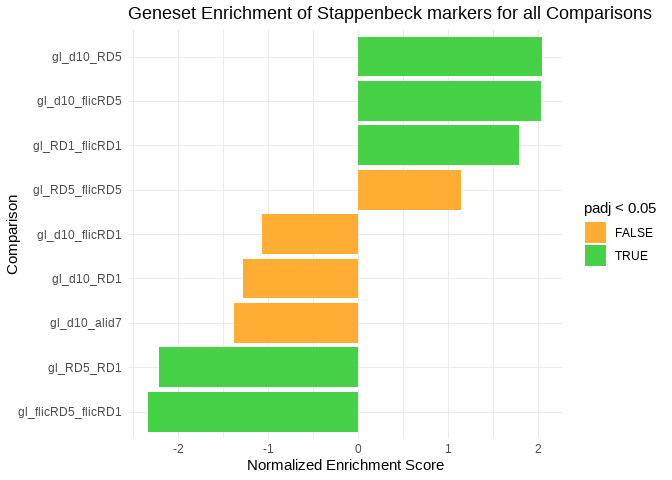<!-- -->

```r
custom_enrichplots <- list

custom_enrichplots <- list(
plotEnrichment(custom_genes[[1]], gl_d10_alid7),
plotEnrichment(custom_genes[[1]], gl_d10_flicRD1),
plotEnrichment(custom_genes[[1]], gl_d10_flicRD5),
plotEnrichment(custom_genes[[1]], gl_d10_RD1),
plotEnrichment(custom_genes[[1]], gl_d10_RD5),
plotEnrichment(custom_genes[[1]], gl_flicRD5_flicRD1),
plotEnrichment(custom_genes[[1]], gl_RD1_flicRD1),
plotEnrichment(custom_genes[[1]], gl_RD5_flicRD5),
plotEnrichment(custom_genes[[1]], gl_RD5_RD1)
)


# for (i in 1:length(all_gl)) {
# custom_enrichplots[[i]] <- plotEnrichment(custom_genes$STAPPENBECK_MARKERS, all_gl[[i]])
# }

names(custom_enrichplots) <- names(all_gl)
custom_enrichplots 
```

```
## $gl_d10_alid7
```

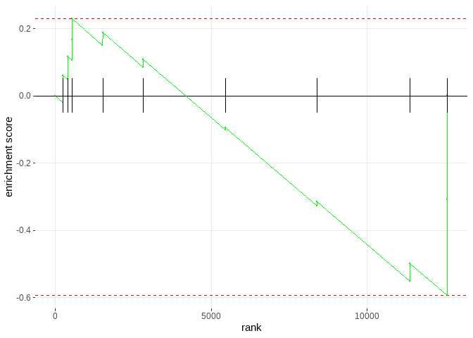<!-- -->

```
## 
## $gl_d10_flicRD1
```

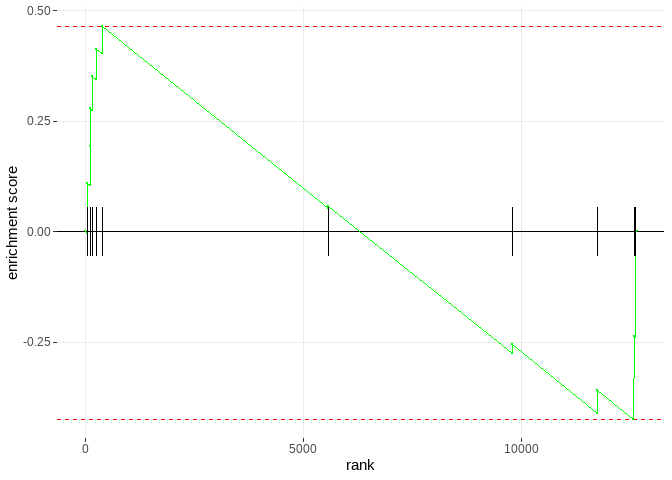<!-- -->

```
## 
## $gl_d10_flicRD5
```

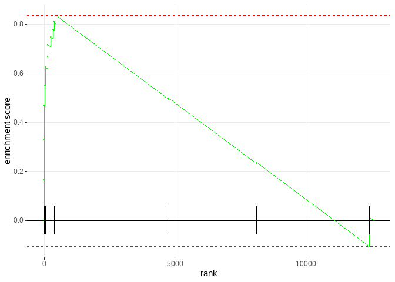<!-- -->

```
## 
## $gl_d10_RD1
```

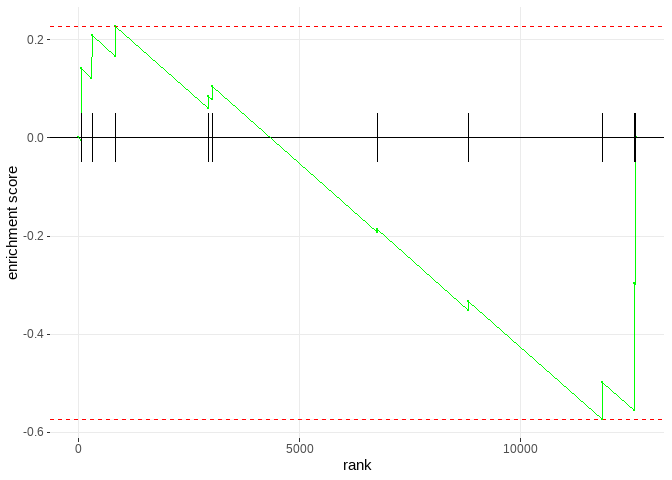<!-- -->

```
## 
## $gl_d10_RD5
```

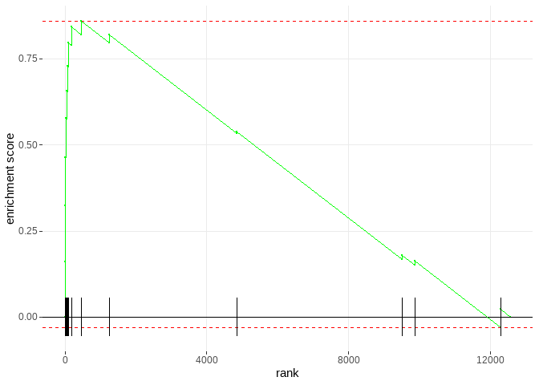<!-- -->

```
## 
## $gl_flicRD5_flicRD1
```

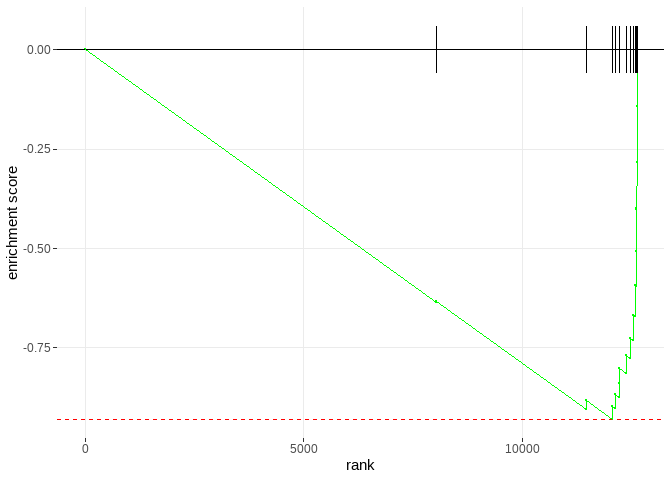<!-- -->

```
## 
## $gl_RD1_flicRD1
```

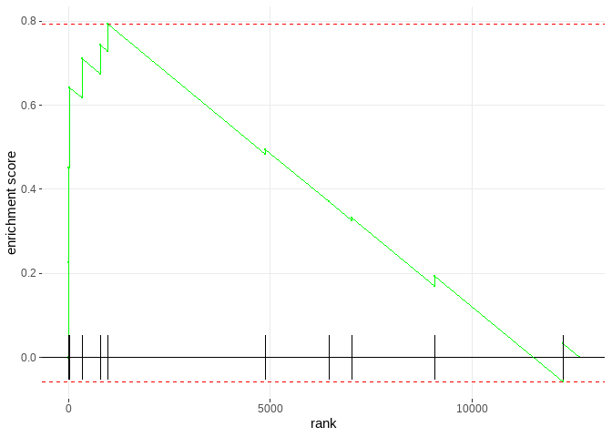<!-- -->

```
## 
## $gl_RD5_flicRD5
```

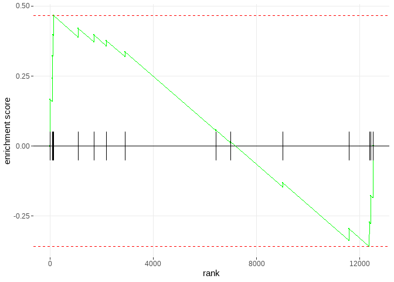<!-- -->

```
## 
## $gl_RD5_RD1
```

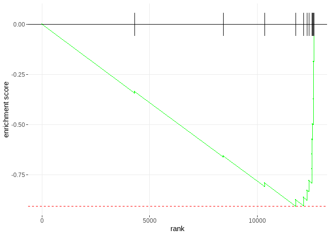<!-- -->

```r
#ggsave(here::here("info_results", "gsea_plots", "STAPPENBECK_CUSTOM_MARKERS.png"), arrangeGrob(grobs = custom_enrichplots))
```

Let's also look at the z-score heatmap of the log2normalized gene counts for the `custom_genes` list.  


```r
eNorm_scale <- eNorm_scale %>% 
  rownames_to_column(var = "gene")

custom_zscore <- eNorm_scale %>% 
  filter(gene %in% stappenbeck_genes$human) 

custom_zscore <- custom_zscore %>% 
  rownames_to_column(var = "ID") %>% 
  column_to_rownames(var = "gene") %>% 
  dplyr::select(-ID)

nrow(custom_zscore)
```

```
## [1] 11
```

```r
#Hmm, only 11 of the 23 genes overlap

heatmap_cols = colorRampPalette(c("blue", "white", "red"))(99)
annot_cols <- list(Sample_Number = c(`1` = "#eeccff", `2` = "#99ceff"))

#finding out the max value of our eNorm_scale
eNorm_scale <- eNorm_scale %>% 
  column_to_rownames(var = "gene")
range <- max(abs(eNorm_scale))
#setting colour white in our heatmaps to 0
breaks <- seq(-range, range, length.out = 100)

custom_zscore %>%
  pheatmap(clustering_distance_cols = "euclidean", clustering_method = "complete", cluster_rows = FALSE, cluster_cols = FALSE, color = heatmap_cols, breaks = breaks,
    show_colnames = TRUE, show_rownames = TRUE,
    main = "Custom Markers Heatmap", 
    annotation_col = pDat[c("Sample_Number")],  annotation_colors = annot_cols)
```

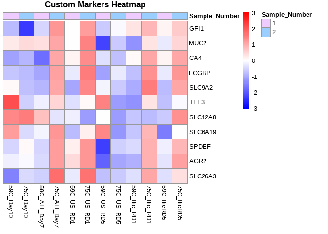<!-- -->

```r
custom_zscore [c(1,3,5,7,9,11)] %>% 
  pheatmap(clustering_distance_cols = "euclidean", clustering_method = "complete", cluster_rows = FALSE, cluster_cols = FALSE, color = heatmap_cols, breaks = breaks,
    show_colnames = TRUE, show_rownames = TRUE,
    main = "Custom Markers Heatmap - Sample 1", 
    annotation_col = pDat[c("Sample_Number")],  annotation_colors = annot_cols)
```

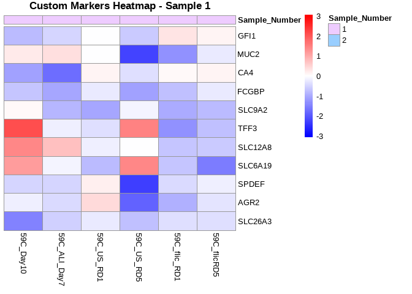<!-- -->

```r
custom_zscore[c(2,4,6,8,10,12)] %>% 
  pheatmap(clustering_distance_cols = "euclidean", clustering_method = "complete", cluster_rows = FALSE, cluster_cols = FALSE, color = heatmap_cols, breaks = breaks,
    show_colnames = TRUE, show_rownames = TRUE,
    main = "Custom Markers Heatmap - Sample 2", 
    annotation_col = pDat[c("Sample_Number")],  annotation_colors = annot_cols)
```

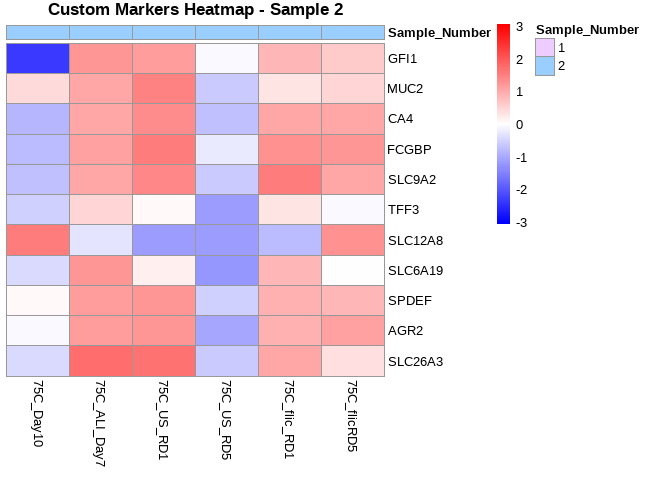<!-- -->

It looks like only 11 of the 23 markers from the paper overlap with our dataset.  

### 2.3 EDIT: Stappenbeck GSEA via Software  

I'm conducting further GSEA using the markers found in the Supplementary Tables 1-4 of the paper. I've already formatted the files in excel to only keep the gene marker names.


```r
goblet <- read_excel(here::here("GSEA_software_files", "Stappenbeck_files", "Stappenbeck_markers", "Table_S1_Goblet_Cell.xlsx"), col_names = TRUE)
entero <- read_excel(here::here("GSEA_software_files", "Stappenbeck_files", "Stappenbeck_markers", "Table_S2_Enteroendocrine_Cell.xlsx"), col_names = TRUE)
DSS <- read_excel(here::here("GSEA_software_files", "Stappenbeck_files", "Stappenbeck_markers", "Table_S3_DSS-Associated_Regenerative.xlsx"), col_names = TRUE)
fetal <- read_excel(here::here("GSEA_software_files", "Stappenbeck_files", "Stappenbeck_markers", "Table_S4_Fetal_Epithelial.xlsx"), col_names = TRUE)

stappenbeck_stables_markers <- list(goblet, entero, DSS, fetal)
names(stappenbeck_stables_markers) <- c("goblet", "entero", "DSS", "fetal")

stappenbeck_stables_markers <- map(stappenbeck_stables_markers, ~ .x %>%
                                     left_join(mm_to_HGNC, by = c("PROBE" = "mouse")))

not_in_stap <- map(stappenbeck_stables_markers, ~ .x %>% 
                     filter(is.na(human)))

head(not_in_stap)
```

```
## $goblet
## # A tibble: 36 x 3
##    PROBE   Homologue_number human
##    <chr>              <dbl> <chr>
##  1 Ces1c             117484 <NA> 
##  2 Ang4              135633 <NA> 
##  3 Ccl6               22507 <NA> 
##  4 Ces1e             115660 <NA> 
##  5 Cyp2c68            74936 <NA> 
##  6 Gstm3              37356 <NA> 
##  7 Igtp               23118 <NA> 
##  8 Adh6a              66291 <NA> 
##  9 Cyp2d26           130660 <NA> 
## 10 Gm15564               NA <NA> 
## # ... with 26 more rows
## 
## $entero
## # A tibble: 32 x 3
##    PROBE         Homologue_number human
##    <chr>                    <dbl> <chr>
##  1 Ces1c                   117484 <NA> 
##  2 1700086L19Rik               NA <NA> 
##  3 Ang4                    135633 <NA> 
##  4 Ccl6                     22507 <NA> 
##  5 Ccl9                     86734 <NA> 
##  6 Fam183b                  28543 <NA> 
##  7 Rap1gapos                   NA <NA> 
##  8 Gm11963                     NA <NA> 
##  9 Nefm                    137211 <NA> 
## 10 1810041L15Rik               NA <NA> 
## # ... with 22 more rows
## 
## $DSS
## # A tibble: 43 x 3
##    PROBE    Homologue_number human
##    <chr>               <dbl> <chr>
##  1 Ctgf                   NA <NA> 
##  2 Tnfsf9             137221 <NA> 
##  3 Abi3bp             134172 <NA> 
##  4 mt-Tc                  NA <NA> 
##  5 mt-Tp                  NA <NA> 
##  6 Scarna17               NA <NA> 
##  7 Gm24494                NA <NA> 
##  8 Gm23119                NA <NA> 
##  9 Hspa1b             133785 <NA> 
## 10 Gm24616                NA <NA> 
## # ... with 33 more rows
## 
## $fetal
## # A tibble: 30 x 3
##    PROBE         Homologue_number human
##    <chr>                    <dbl> <chr>
##  1 Ctgf                        NA <NA> 
##  2 Prl2c3                   40763 <NA> 
##  3 Serpinb9b               137240 <NA> 
##  4 Fam198b                     NA <NA> 
##  5 Ggta1                     7730 <NA> 
##  6 Crip2                   133917 <NA> 
##  7 Serpinb6b                22633 <NA> 
##  8 Prkcdbp                     NA <NA> 
##  9 1110028F11Rik               NA <NA> 
## 10 Oas1f                    86720 <NA> 
## # ... with 20 more rows
```

Okay, looking at a few of the mouse genes, they don't seem to have a human homologue. I'm just going to take those ones out.  


```r
stappenbeck_stables_markers <- map(stappenbeck_stables_markers, ~ .x %>%
                                     na.omit(x))

stappenbeck_stables_markers <- map(stappenbeck_stables_markers, ~ .x %>%
                                     dplyr::select(human))

#write.xlsx(stappenbeck_stables_markers, file = here::here("GSEA_software_files", "Stappenbeck_files", "Stappenbeck_markers", "stappenbeck_markers_tables_s1_s4.xlsx"), col.names = FALSE)
```

**EDIT:** I'm going to load the detailed GSEA results tables output from the GSEA software to make the NES plots.  


```r
#when using this function, check which your working directory is and your Knitr directory.
Stappenbeck_GSEA_results <- list.files(pattern = "_GSEA_results.xlsx$", recursive = TRUE, full.names = TRUE) %>%
  set_names(nm = (basename(.) %>% 
                    tools::file_path_sans_ext())) %>%
  map(read_excel)

names(Stappenbeck_GSEA_results) <- names(all_gl)
#write.xlsx(Stappenbeck_GSEA_results, file = here::here("data", "Processed", "ibd_fgsea_stappenbeck_TableS1-S4_results.xlsx"), colnames = TRUE)

#renaming to padj cause original is named FDR q val
Stappenbeck_GSEA_results <- lapply(Stappenbeck_GSEA_results, function (x) {colnames(x)[6] <- "padj"; x}) 

stappenbeck_NES_plots <- list()

for (i in seq_along(Stappenbeck_GSEA_results)){
  x <- ggplot(Stappenbeck_GSEA_results[[i]], aes(x = reorder(NAME, NES), y = NES)) +
    geom_col(aes(fill = padj < 0.05, width = 0.6)) +
    scale_fill_manual(values = c("#ffad33", "#47d147")) +
    coord_flip() +
    labs(x = "Gene Set", y = "Normalized Enrichment Score") +
    ggtitle(names(Stappenbeck_GSEA_results[i])) +
    my_theme
  stappenbeck_NES_plots[[i]] <- x
}

names(stappenbeck_NES_plots) <- names(all_gl)

stappenbeck_NES_plots
```

```
## $gl_d10_alid7
```

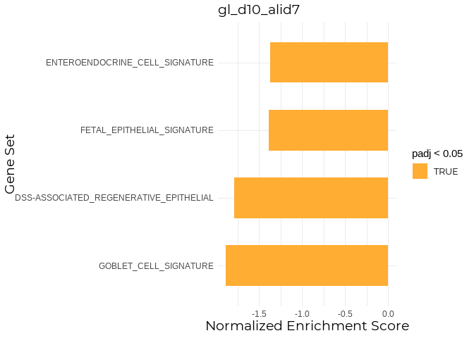<!-- -->

```
## 
## $gl_d10_flicRD1
```

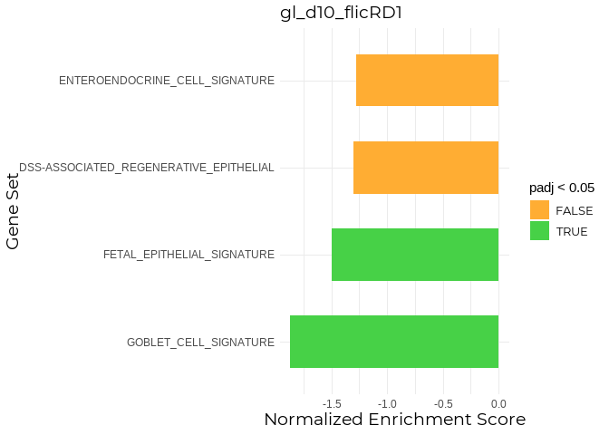<!-- -->

```
## 
## $gl_d10_flicRD5
```

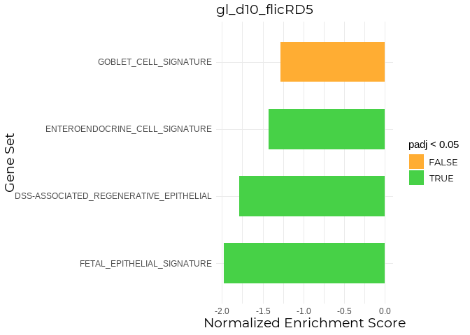<!-- -->

```
## 
## $gl_d10_RD1
```

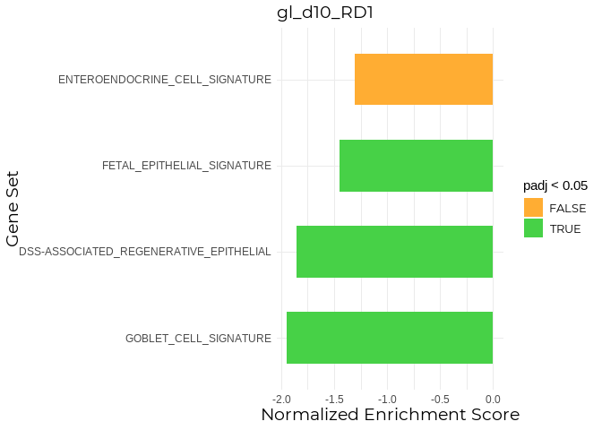<!-- -->

```
## 
## $gl_d10_RD5
```

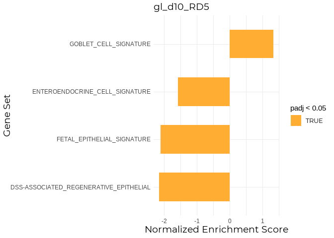<!-- -->

```
## 
## $gl_flicRD5_flicRD1
```

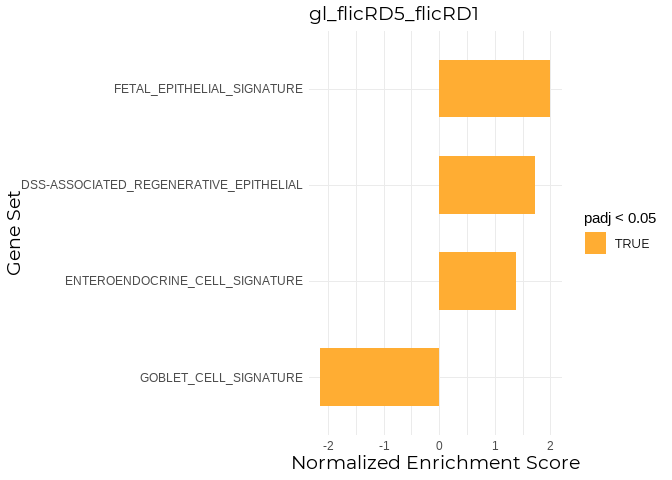<!-- -->

```
## 
## $gl_RD1_flicRD1
```

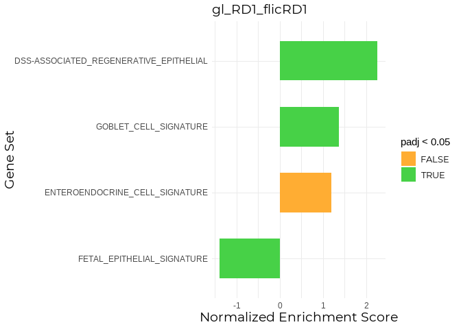<!-- -->

```
## 
## $gl_RD5_flicRD5
```

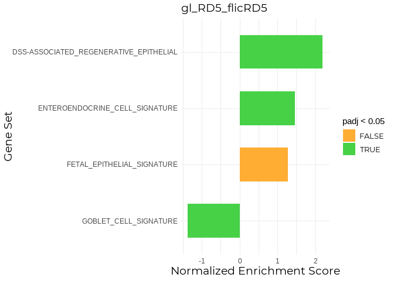<!-- -->

```
## 
## $gl_RD5_RD1
```

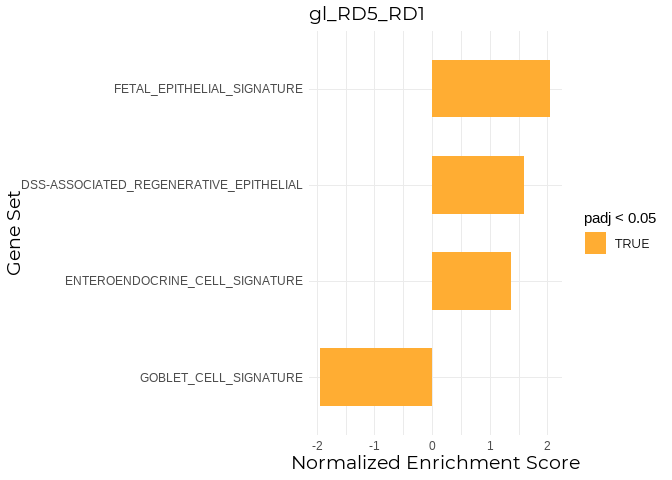<!-- -->

```r
#Rearranging to include readings for each geneset in one list, rather than dividing by genelist
sb_goblet <- map(Stappenbeck_GSEA_results, function(x) x %>% 
                   filter(NAME == "GOBLET_CELL_SIGNATURE"))
sb_goblet <- do.call(rbind, sb_goblet)

sb_EE <- map(Stappenbeck_GSEA_results, function(x) x %>% 
                   filter(NAME == "ENTEROENDOCRINE_CELL_SIGNATURE"))
sb_EE <- do.call(rbind, sb_EE)

sb_DSS <- map(Stappenbeck_GSEA_results, function(x) x %>% 
                   filter(NAME == "DSS-ASSOCIATED_REGENERATIVE_EPITHELIAL"))
sb_DSS <- do.call(rbind, sb_DSS)

sb_fetal <- map(Stappenbeck_GSEA_results, function(x) x %>% 
                   filter(NAME == "FETAL_EPITHELIAL_SIGNATURE"))
sb_fetal <- do.call(rbind, sb_fetal)

sb_list <- list(sb_goblet, sb_EE, sb_DSS, sb_fetal)
names(sb_list) <- c("sb_goblet", "sb_EE", "sb_DSS", "sb_fetal")

sb_list <- map(sb_list, function(x) x %>% 
                 rownames_to_column(var = "comparison"))

stappenbeck_NES_plots_2 <- list()

for (i in seq_along(sb_list)){
  x <- ggplot(sb_list[[i]], aes(x = reorder(comparison, NES), y = NES)) +
    geom_col(aes(fill = padj < 0.05)) +
    scale_fill_manual(values = c("#ffad33", "#47d147")) +
    coord_flip() +
    labs(x = "Condition", y = "Normalized Enrichment Score") +
    ggtitle(names(sb_list[i])) +
    my_theme
  stappenbeck_NES_plots_2[[i]] <- x
}

names(stappenbeck_NES_plots_2) <- names(sb_list)

stappenbeck_NES_plots_2
```

```
## $sb_goblet
```

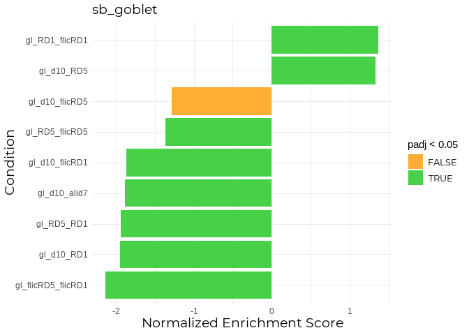<!-- -->

```
## 
## $sb_EE
```

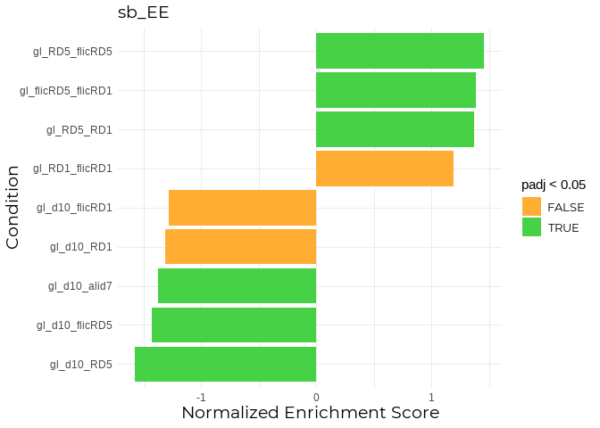<!-- -->

```
## 
## $sb_DSS
```

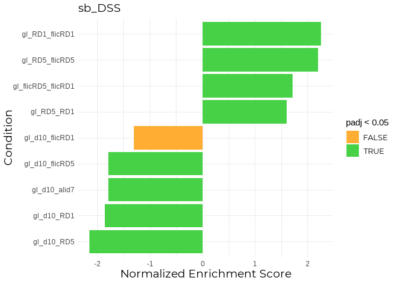<!-- -->

```
## 
## $sb_fetal
```

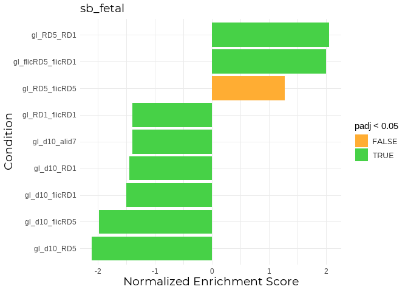<!-- -->


***  

## 3.0 Smillie et. al., Markers  

Let's now take a look at the markers from [this paper by Smillie, C et al.,](https://www.sciencedirect.com/science/article/pii/S0092867419307329?via%3Dihub).  

I already appended the Excel file to put each gene into a separate cell. I'll now make it into a df so that all genes are in one column.  


```r
#Smillie markers
smillie <- read_excel(here::here("data", "Processed", "Smillie_genes.xlsx"), col_names = TRUE)

smillie
```

```
## # A tibble: 71 x 16
##    `UC GSEA Genes` Overlap ...3  ...4  ...5  ...6  ...7  ...8  ...9  ...10 ...11
##    <chr>           <chr>   <chr> <chr> <chr> <chr> <chr> <chr> <chr> <chr> <chr>
##  1 E_epithelial    TNFRSF~ IFNG~ TNFS~ SMPD1 SPAT~ HIST~ PARP4 CHMP~ TICA~ <NA> 
##  2 E_epithelial    EZR     CGN   TJP3  ARHG~ MYH14 MARV~ SLC9~ SYNPO ARHG~ SRC  
##  3 E_epithelial    PIP5K1B PDGFA SLC9~ SCIN  BDKR~ MAPK3 GNG12 <NA>  <NA>  <NA> 
##  4 E_epithelial    GBA     CTSD  IDS   LITAF ARSA  CTSA  <NA>  <NA>  <NA>  <NA> 
##  5 E_epithelial    EHD1    VPS3~ IL2RG SMAD3 PDCD~ DNM2  <NA>  <NA>  <NA>  <NA> 
##  6 E_epithelial    CASP7   CASP~ <NA>  <NA>  <NA>  <NA>  <NA>  <NA>  <NA>  <NA> 
##  7 E_epithelial    PTK2B   DGKA  PPAP~ <NA>  <NA>  <NA>  <NA>  <NA>  <NA>  <NA> 
##  8 E_epithelial    CDKN1A  JUND  GNA11 AKAP~ <NA>  <NA>  <NA>  <NA>  <NA>  <NA> 
##  9 E_epithelial    IL22RA1 IFNL~ PIM1  <NA>  <NA>  <NA>  <NA>  <NA>  <NA>  <NA> 
## 10 E_epithelial    WIPF2   PSD4  RAB1~ WASL  ITCH  ACAP2 CDC42 EPN1  CHMP~ CHMP~
## # ... with 61 more rows, and 5 more variables: ...12 <chr>, ...13 <chr>,
## #   ...14 <chr>, ...15 <chr>, Condition <chr>
```

```r
smillie <- smillie %>% 
  pivot_longer(names_to = "x", values_to = "gene", cols = 2:15)

smillie
```

```
## # A tibble: 994 x 4
##    `UC GSEA Genes` Condition x       gene     
##    <chr>           <chr>     <chr>   <chr>    
##  1 E_epithelial    UC        Overlap TNFRSF1A 
##  2 E_epithelial    UC        ...3    IFNGR2   
##  3 E_epithelial    UC        ...4    TNFSF10  
##  4 E_epithelial    UC        ...5    SMPD1    
##  5 E_epithelial    UC        ...6    SPATA2L  
##  6 E_epithelial    UC        ...7    HIST1H2AC
##  7 E_epithelial    UC        ...8    PARP4    
##  8 E_epithelial    UC        ...9    CHMP1A   
##  9 E_epithelial    UC        ...10   TICAM1   
## 10 E_epithelial    UC        ...11   <NA>     
## # ... with 984 more rows
```

```r
smillie <- smillie [-c(3)]

smillie <- na.omit(smillie)

dim(smillie)
```

```
## [1] 292   3
```

Adding matching entrez genes:


```r
colnames(smillie) [1] <- "cell_type"

#adding entrez 
smillie <- smillie %>% 
  left_join(HGNC_to_Entrez, by = c("gene" = "human_gene_symbol"))

smillie_na <- smillie %>% 
  filter(is.na(human_entrez_gene))

smillie_na
```

```
## # A tibble: 6 x 4
##   cell_type    Condition gene      human_entrez_gene
##   <chr>        <chr>     <chr>                 <dbl>
## 1 E_epithelial UC        HIST1H2AC                NA
## 2 E_epithelial UC        PPAP2A                   NA
## 3 E_epithelial UC        C1orf106                 NA
## 4 E_epithelial UC        C9orf41                  NA
## 5 E_epithelial Control   PPAP2A                   NA
## 6 E_epithelial Control   ERBB2IP                  NA
```

There's a few NAs. [Genecards](https://www.genecards.org) shows that these genes actually do exist, but that they're known by their more popular names. I'm going to manually add the names of these genes.  


```r
gene_name_aliases <- as.data.frame(smillie_na$gene)

gene_name_aliases$alternative_name <- c("H2AC6", "PLPP1", "INAVA", "CARNMT1", "PLPP1", "ERBIN")

gene_name_aliases
```

```
##   smillie_na$gene alternative_name
## 1       HIST1H2AC            H2AC6
## 2          PPAP2A            PLPP1
## 3        C1orf106            INAVA
## 4         C9orf41          CARNMT1
## 5          PPAP2A            PLPP1
## 6         ERBB2IP            ERBIN
```

```r
#joining to smillie_na
smillie_na <- smillie_na %>% 
  right_join(gene_name_aliases, by = c("gene" = "smillie_na$gene"))

smillie_na
```

```
## # A tibble: 8 x 5
##   cell_type    Condition gene      human_entrez_gene alternative_name
##   <chr>        <chr>     <chr>                 <dbl> <chr>           
## 1 E_epithelial UC        HIST1H2AC                NA H2AC6           
## 2 E_epithelial UC        PPAP2A                   NA PLPP1           
## 3 E_epithelial UC        PPAP2A                   NA PLPP1           
## 4 E_epithelial UC        C1orf106                 NA INAVA           
## 5 E_epithelial UC        C9orf41                  NA CARNMT1         
## 6 E_epithelial Control   PPAP2A                   NA PLPP1           
## 7 E_epithelial Control   PPAP2A                   NA PLPP1           
## 8 E_epithelial Control   ERBB2IP                  NA ERBIN
```

```r
#removing duplicaate rows
smillie_na <- smillie_na %>% 
  distinct()

#removing original gene names
smillie_na <- smillie_na %>% 
  select(cell_type, Condition, alternative_name)

colnames(smillie_na)[3] <- "gene"

#adding entrez genes
smillie_na <- smillie_na %>% 
  left_join(HGNC_to_Entrez, by = c("gene" = "human_gene_symbol"))

smillie_na
```

```
## # A tibble: 6 x 4
##   cell_type    Condition gene    human_entrez_gene
##   <chr>        <chr>     <chr>               <dbl>
## 1 E_epithelial UC        H2AC6                8334
## 2 E_epithelial UC        PLPP1                8611
## 3 E_epithelial UC        INAVA               55765
## 4 E_epithelial UC        CARNMT1            138199
## 5 E_epithelial Control   PLPP1                8611
## 6 E_epithelial Control   ERBIN               55914
```

```r
smillie_na <- smillie_na %>% 
  distinct()

smillie_na
```

```
## # A tibble: 6 x 4
##   cell_type    Condition gene    human_entrez_gene
##   <chr>        <chr>     <chr>               <dbl>
## 1 E_epithelial UC        H2AC6                8334
## 2 E_epithelial UC        PLPP1                8611
## 3 E_epithelial UC        INAVA               55765
## 4 E_epithelial UC        CARNMT1            138199
## 5 E_epithelial Control   PLPP1                8611
## 6 E_epithelial Control   ERBIN               55914
```

I'll now delete the rows that contain the NAs in `smillie` and bind the `smillie_na` df which does contain the original gene names and the respective entrez IDs.  


```r
nrow(smillie) #292
```

```
## [1] 292
```

```r
nrow(smillie_na) #6
```

```
## [1] 6
```

```r
292 - 6
```

```
## [1] 286
```

```r
smillie <- na.omit(smillie)

nrow(smillie) #286 = deleted 6 entries 
```

```
## [1] 286
```

```r
smillie <- rbind(smillie, smillie_na)

which(is.na(smillie)) #perfect, done
```

```
## integer(0)
```

```r
#renaming entrez column to gene 

colnames(smillie) [3:4] <- c("gene_symbol", "gene")
```

I'll now separate the dataframe by the cell-type and by condition, so 2 dfs per cell type: ulcerative colities and control


```r
smillie %>% 
  count(cell_type, Condition)
```

```
## # A tibble: 4 x 3
##   cell_type       Condition     n
##   <chr>           <chr>     <int>
## 1 E_epithelial    Control      95
## 2 E_epithelial    UC          129
## 3 immature_goblet Control      34
## 4 immature_goblet UC           34
```

```r
epithelial_control <- smillie %>% 
  dplyr::filter (cell_type == "E_epithelial" & Condition == "Control") %>% 
  mutate(term = "SMILLIE_EPITHELIAL_Control") %>% 
  dplyr::select(term, gene)
dim(epithelial_control) #95
```

```
## [1] 95  2
```

```r
epithelial_uc <- smillie %>% 
  dplyr::filter (cell_type == "E_epithelial" & Condition == "UC") %>% 
  mutate(term = "SMILLIE_EPITHELIAL_UC") %>% 
  dplyr::select(term, gene)
dim(epithelial_uc) #129
```

```
## [1] 129   2
```

```r
goblet_control <- smillie %>% 
  dplyr::filter (cell_type == "immature_goblet" & Condition == "Control")  %>% 
  mutate(term = "SMILLIE_IMMATURE_GOBLET_Control") %>% 
  dplyr::select(term, gene)
dim(goblet_control) #34
```

```
## [1] 34  2
```

```r
goblet_uc <- smillie %>% 
  dplyr::filter (cell_type == "immature_goblet" & Condition == "UC") %>% 
  mutate(term = "SMILLIE_IMMATURE_GOBLET_UC") %>% 
  dplyr::select(term, gene)
dim(goblet_uc) #34
```

```
## [1] 34  2
```

```r
smillie_markers <- as.data.frame(rbind(epithelial_uc, epithelial_control, goblet_uc, goblet_control))
smillie_markers <- split(x = smillie_markers$gene, f = smillie_markers$term)

fgsea_smillie <- list()

for (i in 1:length(all_gl)){
fgsea_smillie[[i]] <- fgsea(smillie_markers, all_gl[[i]])
}

names(fgsea_smillie) <- names(all_gl)
#write.xlsx(fgsea_smillie, file = here::here("data", "Processed", "ibd_fgsea_smillie_results.xlsx"), colnames = TRUE)

smillie_NES_plots <- list()

for (i in seq_along(fgsea_smillie)){
  x <- ggplot(fgsea_smillie[[i]], aes(x = reorder(pathway, NES), y = NES)) +
    geom_col(aes(fill = padj < 0.05, width = 0.6)) +
    scale_fill_manual(values = c("#ffad33", "#47d147")) +
    coord_flip() +
    labs(x = "Pathway", y = "Normalized Enrichment Score") +
    ggtitle(names(fgsea_smillie[i])) +
    my_theme
  smillie_NES_plots[[i]] <- x
}

names(smillie_NES_plots) <- names(all_gl)

smillie_NES_plots
```

```
## $gl_d10_alid7
```

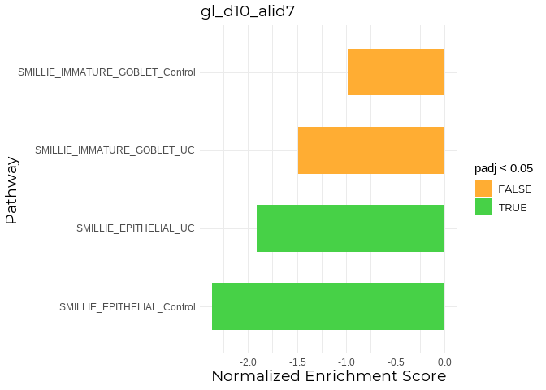<!-- -->

```
## 
## $gl_d10_flicRD1
```

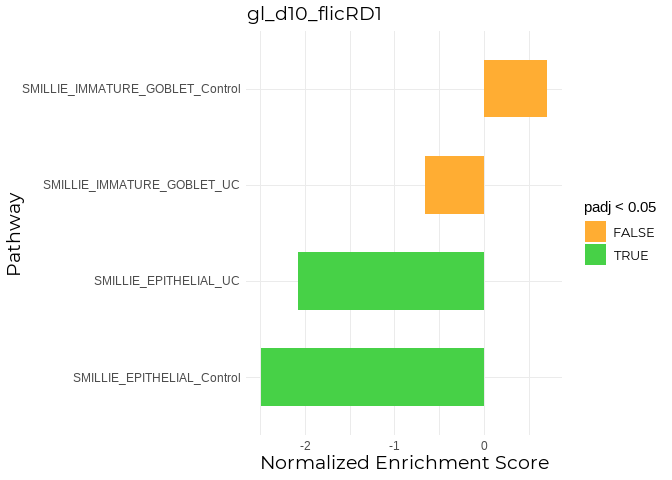<!-- -->

```
## 
## $gl_d10_flicRD5
```

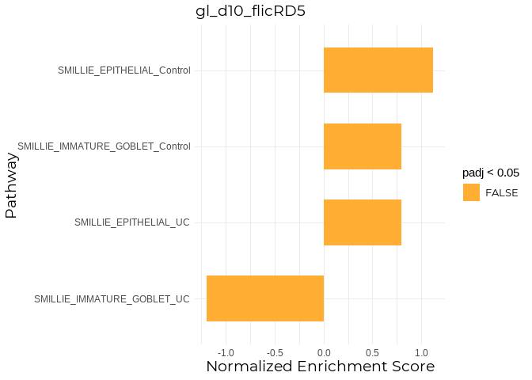<!-- -->

```
## 
## $gl_d10_RD1
```

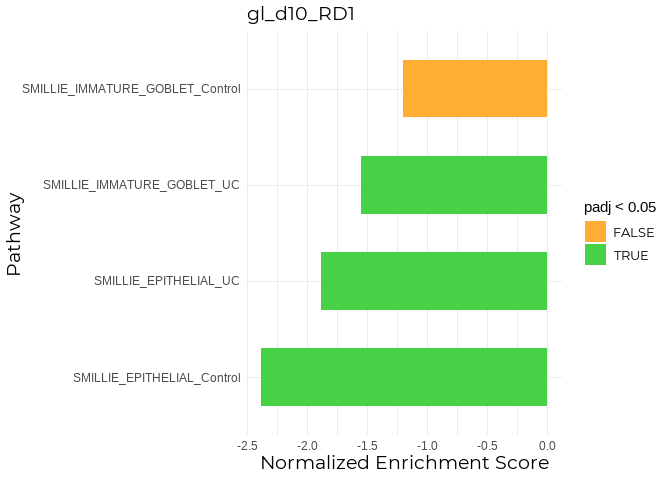<!-- -->

```
## 
## $gl_d10_RD5
```

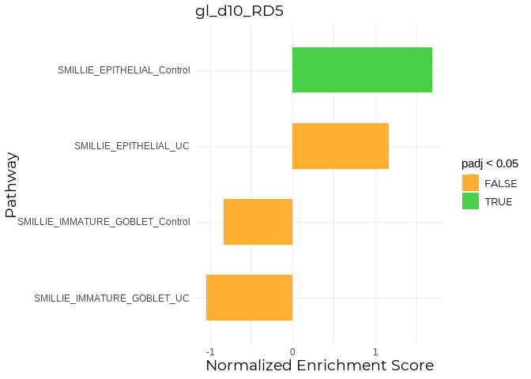<!-- -->

```
## 
## $gl_flicRD5_flicRD1
```

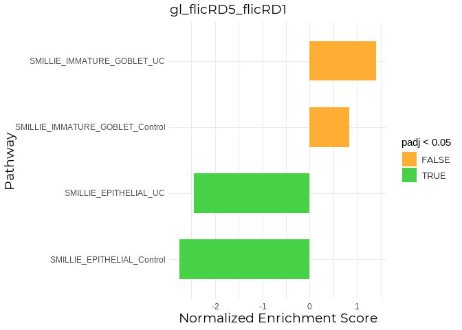<!-- -->

```
## 
## $gl_RD1_flicRD1
```

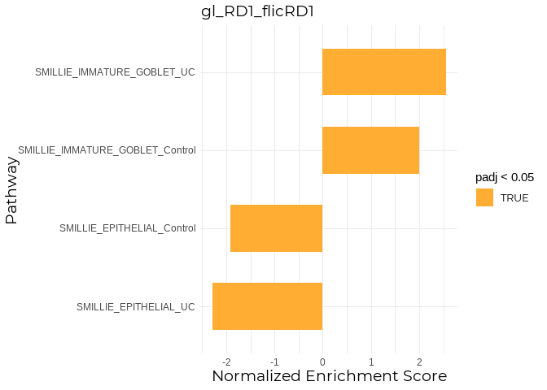<!-- -->

```
## 
## $gl_RD5_flicRD5
```

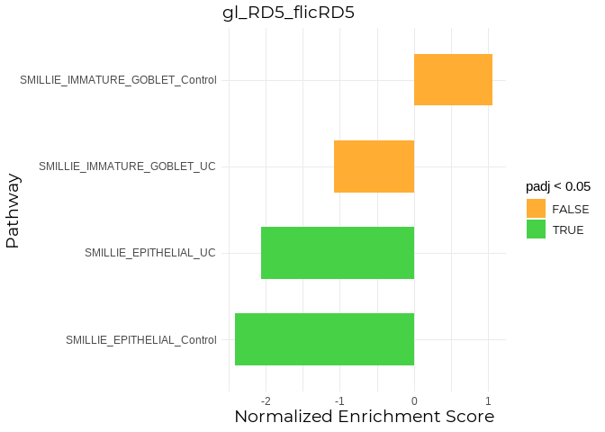<!-- -->

```
## 
## $gl_RD5_RD1
```

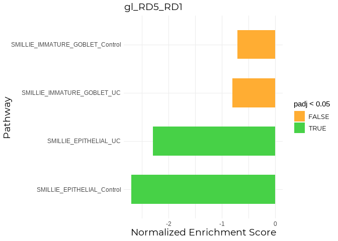<!-- -->

I'm actually going totry to run this GSEA via the software. Using `d10_alid7` as an example, I'll prepare the `.rnk` file required by the software, consisting of the gene identifier in the first column and the ranking metric in the second(the log2FC). I'll manually add the `.rnk` extension to saved excel file.

The geneset file requires each row (`.gmt`) or each column (`.gmx`) to be one geneset, with the name of the geneset in the first column/header, and the gene identifiers in subsequent columns after that. I'll manually add the extension to saved excel file.  

The [guide to making the files](https://software.broadinstitute.org/cancer/software/gsea/wiki/index.php/Data_formats#RNK:_Ranked_list_file_format_.28.2A.rnk.29) details the formatting required to run the [preranked GSEA](https://www.gsea-msigdb.org/gsea/doc/GSEAUserGuideFrame.html?_GSEAPreranked_Page)


```r
ali_d7_rnk <- all_metrics[[1]]

head(ali_d7_rnk)
```

```
##    GeneName   baseMean log2FoldChange     lfcSE          stat     pvalue
## 1    WASH7P   11.20226   0.0001113504 0.2257570  0.0004932314 0.99960646
## 2 LINC01128  108.47368   0.0786379542 0.2804633  0.2803859343 0.77918143
## 3     NOC2L 2557.14285   0.0445676651 0.1699291  0.2622720440 0.79311171
## 4    KLHL17   95.31694  -0.0081250770 0.2847301 -0.0285360664 0.97723460
## 5   PLEKHN1  102.91997  -0.4653728423 0.2820543 -1.6499408170 0.09895504
## 6      HES4  101.73257   0.0173193398 0.2824137  0.0613261314 0.95109948
##        padj status Significant entrezgene_id
## 1 0.9998297     OK          No        653635
## 2 0.9989866     OK          No        643837
## 3 0.9989866     OK          No         26155
## 4 0.9989866     OK          No        339451
## 5 0.6496130     OK          No         84069
## 6 0.9989866     OK          No         57801
```

```r
ali_d7_rnk <- ali_d7_rnk %>% 
  select(GeneName, log2FoldChange)
  
#write.xlsx(ali_d7_rnk, file = here::here("data", "Processed", "d10_alid7_rnk.xlsx"), colnames = TRUE)

smillie_gmt <- smillie %>% 
  unite("term", cell_type:Condition)

smillie_gmt
```

```
## # A tibble: 292 x 3
##    term            gene_symbol   gene
##    <chr>           <chr>        <dbl>
##  1 E_epithelial_UC TNFRSF1A      7132
##  2 E_epithelial_UC IFNGR2        3460
##  3 E_epithelial_UC TNFSF10       8743
##  4 E_epithelial_UC SMPD1         6609
##  5 E_epithelial_UC SPATA2L     124044
##  6 E_epithelial_UC PARP4          143
##  7 E_epithelial_UC CHMP1A        5119
##  8 E_epithelial_UC TICAM1      148022
##  9 E_epithelial_UC EZR           7430
## 10 E_epithelial_UC CGN          57530
## # ... with 282 more rows
```

```r
smillie_gmt <- smillie_gmt %>% 
  select(term, gene_symbol)

smillie_gmt <- split(x = smillie_gmt$gene_symbol, f = smillie_gmt$term)

#write.xlsx(smillie_gmt, file = here::here("data", "Processed", "smillie_gmt.xlsx"), colnames = TRUE)
```

Okay, so the enrichment results table outputs a similar NES as is in our `fgsea_smillie` object, with a minor decimal number difference (i.e. 0.71 instead of 0.72.). Let's compare:


```r
as_tibble(fgsea_smillie[[1]])
```

```
## # A tibble: 4 x 8
##   pathway                 pval      padj log2err     ES    NES  size leadingEdge
##   <chr>                  <dbl>     <dbl>   <dbl>  <dbl>  <dbl> <int> <list>     
## 1 SMILLIE_EPITHELI~   1   e-10  4   e-10 NA      -0.697 -2.36     93 <chr [51]> 
## 2 SMILLIE_EPITHELI~   4.68e- 6  9.35e- 6  0.611  -0.544 -1.91    125 <chr [56]> 
## 3 SMILLIE_IMMATURE~   4.60e- 1  4.60e- 1  0.0675 -0.356 -0.988    32 <chr [11]> 
## 4 SMILLIE_IMMATURE~   5.55e- 2  7.40e- 2  0.231  -0.542 -1.49     30 <chr [17]>
```

```r
enrich_results_alid7_smillie <- read.delim(here::here("data", "Processed", "gsea_report_alid7_smillie.tsv"), sep = "\t", header = TRUE)

as_tibble(enrich_results_alid7_smillie)
```

```
## # A tibble: 4 x 12
##   NAME     GS.br..follow.lin~ GS.DETAILS  SIZE     ES    NES NOM.p.val FDR.q.val
##   <chr>    <chr>              <chr>      <int>  <dbl>  <dbl>     <dbl>     <dbl>
## 1 E_EPITH~ E_EPITHELIAL_CONT~ Details .~    93 -0.697 -2.37     0         0     
## 2 E_EPITH~ E_EPITHELIAL_UC    Details .~   125 -0.544 -1.91     0         0     
## 3 IMMATUR~ IMMATURE_GOBLET_UC Details .~    30 -0.542 -1.53     0.0337    0.0238
## 4 IMMATUR~ IMMATURE_GOBLET_C~ Details .~    32 -0.356 -0.987    0.498     0.483 
## # ... with 4 more variables: FWER.p.val <dbl>, RANK.AT.MAX <int>,
## #   LEADING.EDGE <chr>, X <lgl>
```

I'll make all `.rnk` files for all the conditions that we have.  


```r
all_rnk_files <- map(all_metrics, function (x) x %>% 
  select(GeneName, log2FoldChange))

#write.xlsx(all_rnk_files, file = here::here("data", "Processed", "all_rnk_files.xlsx"), colnames = FALSE)
```

I'm going to do the smillie gene markers GSEA with the software itself, stored in Projects/ibd_steiner/GSEA_software_files.  

## 4.0 GSEA Software files  

This is how the GSEA files look like: 

1. Our ranked log2FC `.rnk` files:


```r
knitr::include_graphics(here::here("images", "rnk_file.png"), error = FALSE)
```

<!-- -->

2. Our genesets `.gmx` files:


```r
knitr::include_graphics(here::here("images", "gmx_file.png"), error = FALSE)
```

<!-- -->

3. GSEAPreranked parameters to choose in the GSEA Software:


```r
knitr::include_graphics(here::here("images", "GSEA_pre_ranked_parameters.png"), error = FALSE)
```

<!-- -->


