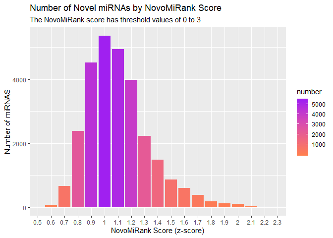
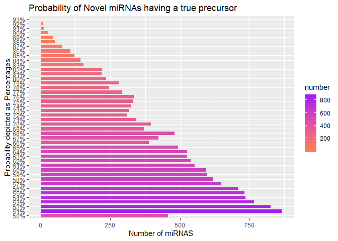

Novel miRNAs
================
Nikita Telkar
December 16, 2019

## Data Loading and Visualisation:

``` r
library(rmarkdown)
# library(installr)
library(dplyr) 
library(tidyr) 
library(readxl) 
library(DT) 
library(knitr) 
library(kableExtra) 
library(ggplot2)
library(tidyverse)
library(devtools)
```

    ## Warning: package 'devtools' was built under R version 3.6.2

    ## Warning: package 'usethis' was built under R version 3.6.2

``` r
library(magrittr)
library(arsenal)
```

    ## Warning: package 'arsenal' was built under R version 3.6.2

``` r
library(xlsx)
library(tinytex)
```

-----

Reading in the `novel` and the `predicted` miRNA files:

``` r
raw <- read_excel("Z:/Nikita/Projects/snc_placenta/data/raw/quantification_novel_mirnas_rpm_norm.xlsx", col_names =FALSE)

pred <- read_excel("Z:/Nikita/Projects/snc_placenta/data/raw/predictions.xlsx", col_names = TRUE)

pData <- read_excel("Z:/Nikita/Projects/mirna_fetal_tissues/data/processed/miRNA_fetal_tissues_pDat.xlsx", col_names = TRUE)
```

``` r
print(pred, n = 15)
```

    ## # A tibble: 14,449 x 22
    ##    precursor_name probability `predicted in #~ `mean_count_3p ~ `mean_count_5p ~
    ##    <chr>                <dbl>            <dbl>            <dbl>            <dbl>
    ##  1 pred-nov-mir-1       0.660                2         0               0.00200  
    ##  2 pred-nov-mir-2       0.541                3         0.00102         0        
    ##  3 pred-nov-mir-3       0.764                2         0.00113         0.00196  
    ##  4 pred-nov-mir-4       0.681                1         0.000547        0.00139  
    ##  5 pred-nov-mir-5       0.619                1         0.000128        0        
    ##  6 pred-nov-mir-6       0.648              142         0.0594          0.00339  
    ##  7 pred-nov-mir-7       0.504                1         0.000123        0.000559 
    ##  8 pred-nov-mir-8       0.534                1         0.000287        0        
    ##  9 pred-nov-mir-9       0.617                1         0.000128        0        
    ## 10 pred-nov-mir-~       0.643                7         0               0.00435  
    ## 11 pred-kno-mir-~       0.896              308         0.0862          0.149    
    ## 12 pred-nov-mir-~       0.654                1         0.000246        0.000344 
    ## 13 pred-nov-mir-~       0.519                1         0.0183          0.0000999
    ## 14 pred-nov-mir-~       0.505                7         0               0.00688  
    ## 15 pred-nov-mir-~       0.585                1         0               0.00228  
    ## # ... with 1.443e+04 more rows, and 17 more variables: novomirank_score <dbl>,
    ## #   precursor_sequence <chr>, precursor_structure <chr>,
    ## #   mirna_5p_sequence <chr>, mirna_3p_sequence <chr>, chromosome <chr>,
    ## #   strand <chr>, start <dbl>, end <dbl>, motifs <chr>, Category <chr>,
    ## #   blacklist_5p <chr>, blacklist_3p <chr>, blacklist_5p_novel <chr>,
    ## #   blacklist_3p_novel <chr>, mirbase_5p <chr>, mirbase_3p <chr>

-----

### Selecting Rob Lab Samples:

Only want to analyze Rob lab samples, so:

``` r
rob <- raw [1:32] #dropping all TCGA samples and keeping only Roblab samples
colnames(rob) = rob[1, ]
rob <- rob [-1,]
```

-----

Joining `rob` and `pred`:

``` r
#fullJoinDf <- full_join(tableA,tableB,by=”Customer.ID”)
#band_members %>% full_join(band_instruments2, by = c("name" = "artist"))")

same <- pred %>% 
              inner_join(rob, by = c ("precursor_name" = "precursor")) #joining and keeping only common columns from pred and rob

#Doesn't work because rob has teo predicted miRNAs with the same precursor name

#same <- na.omit(same)

#same <- same %>%
 #        drop_na()
  
#same <- unique(same)

#same <- same %>% 
         # distinct(precursor_name, .keep_all = TRUE) #makes no sense as two of each with the same precursor name
```

-----

### Subsetting Data:

According to the
[paper](https://academic.oup.com/nar/article/44/6/e53/2499429)
describing how scoring of novel miRNAs takes place, the
`novomirank_score` variable calculated takes into consideration 24
different factors such as precursor length, percentage of the 4
differnet bases in the precursor, overlapping precursors. It returns a
z-score (maximum threshold score of 3) after comparing with all the
entries present in the latest version of the [novoMiRank
database](https://ccb-compute2.cs.uni-saarland.de/novomirank/); higher
the score, higher the chance of it being novel.

And so, selecting for only `Novel` entries, and then segregating based
on the score:

``` r
pred_nov <- same %>% 
            filter(Category =="Novel") %>% 
        #   distinct(precursor_name, .keep_all = TRUE) %>% 
        #   arrange(desc('novomirank_score')) %>% 
        #   filter(novomirank_score > 1.5 )
            mutate_at(vars(novomirank_score), round, digits = 1)

nov_rank <-pred_nov %>%
  group_by(novomirank_score) %>% 
  summarise(number = sum(novomirank_score))

#maybe make a new object and then plot? 
nov_rank %>%   
  ggplot(aes(x=factor(novomirank_score), y=number, fill=number)) + #using x=factor()to display all x-axis values
  geom_bar(stat = "identity") +
  scale_fill_continuous(low="coral", high="purple") +
  labs(title ="Number of Novel miRNAs by NovoMiRank Score", subtitle ="The NovoMiRank score has threshold values of 0 to 3",x = "NovoMiRank Score (z-score)", y = "Number of miRNAS") 
```

<!-- -->

Now further plotting the `Novel` miRNAs by their predicted probablity of
having a **true precursor**:

``` r
pred_score <-pred_nov %>%
  mutate_at(vars(probability), round, digits = 2) %>% 
  mutate(prob_percent = probability * 100)

pred_score <- pred_score %>%
  group_by(probability) %>% 
  summarise(number = sum(probability))

pred_score <-pred_score %>%
  mutate_at(vars(number), round)

pred_score <- pred_score %>% 
  mutate_at(vars(probability), funs(probability * 100)) %>% 
  mutate_at(vars(probability), funs(paste(probability, "%", sep ="")))
```

    ## Warning: funs() is soft deprecated as of dplyr 0.8.0
    ## Please use a list of either functions or lambdas: 
    ## 
    ##   # Simple named list: 
    ##   list(mean = mean, median = median)
    ## 
    ##   # Auto named with `tibble::lst()`: 
    ##   tibble::lst(mean, median)
    ## 
    ##   # Using lambdas
    ##   list(~ mean(., trim = .2), ~ median(., na.rm = TRUE))
    ## This warning is displayed once per session.

``` r
table(pred_score)
```

    ##            number
    ## probability 2 7 13 27 43 51 78 107 122 143 154 219 221 235 245 281 293 310 317
    ##         50% 0 0  0  0  0  0  0   0   0   0   0   0   0   0   0   0   0   0   0
    ##         51% 0 0  0  0  0  0  0   0   0   0   0   0   0   0   0   0   0   0   0
    ##         52% 0 0  0  0  0  0  0   0   0   0   0   0   0   0   0   0   0   0   0
    ##         53% 0 0  0  0  0  0  0   0   0   0   0   0   0   0   0   0   0   0   0
    ##         54% 0 0  0  0  0  0  0   0   0   0   0   0   0   0   0   0   0   0   0
    ##         55% 0 0  0  0  0  0  0   0   0   0   0   0   0   0   0   0   0   0   0
    ##         56% 0 0  0  0  0  0  0   0   0   0   0   0   0   0   0   0   0   0   0
    ##         57% 0 0  0  0  0  0  0   0   0   0   0   0   0   0   0   0   0   0   0
    ##         58% 0 0  0  0  0  0  0   0   0   0   0   0   0   0   0   0   0   0   0
    ##         59% 0 0  0  0  0  0  0   0   0   0   0   0   0   0   0   0   0   0   0
    ##         60% 0 0  0  0  0  0  0   0   0   0   0   0   0   0   0   0   0   0   0
    ##         61% 0 0  0  0  0  0  0   0   0   0   0   0   0   0   0   0   0   0   0
    ##         62% 0 0  0  0  0  0  0   0   0   0   0   0   0   0   0   0   0   0   0
    ##         63% 0 0  0  0  0  0  0   0   0   0   0   0   0   0   0   0   0   0   0
    ##         64% 0 0  0  0  0  0  0   0   0   0   0   0   0   0   0   0   0   0   0
    ##         65% 0 0  0  0  0  0  0   0   0   0   0   0   0   0   0   0   0   0   0
    ##         66% 0 0  0  0  0  0  0   0   0   0   0   0   0   0   0   0   0   0   0
    ##         67% 0 0  0  0  0  0  0   0   0   0   0   0   0   0   0   0   0   0   0
    ##         68% 0 0  0  0  0  0  0   0   0   0   0   0   0   0   0   0   0   0   0
    ##         69% 0 0  0  0  0  0  0   0   0   0   0   0   0   0   0   0   0   0   0
    ##         70% 0 0  0  0  0  0  0   0   0   0   0   0   0   0   0   0   0   0   0
    ##         71% 0 0  0  0  0  0  0   0   0   0   0   0   0   0   0   0   0   0   0
    ##         72% 0 0  0  0  0  0  0   0   0   0   0   0   0   0   0   0   0   1   0
    ##         73% 0 0  0  0  0  0  0   0   0   0   0   0   0   0   0   0   0   0   1
    ##         74% 0 0  0  0  0  0  0   0   0   0   0   0   0   0   0   0   0   0   0
    ##         75% 0 0  0  0  0  0  0   0   0   0   0   0   0   0   0   0   0   0   0
    ##         76% 0 0  0  0  0  0  0   0   0   0   0   0   0   0   0   0   0   0   0
    ##         77% 0 0  0  0  0  0  0   0   0   0   0   0   0   0   0   0   1   0   0
    ##         78% 0 0  0  0  0  0  0   0   0   0   0   0   0   0   1   0   0   0   0
    ##         79% 0 0  0  0  0  0  0   0   0   0   0   0   0   0   0   1   0   0   0
    ##         80% 0 0  0  0  0  0  0   0   0   0   0   0   0   1   0   0   0   0   0
    ##         81% 0 0  0  0  0  0  0   0   0   0   0   1   0   0   0   0   0   0   0
    ##         82% 0 0  0  0  0  0  0   0   0   0   0   0   1   0   0   0   0   0   0
    ##         83% 0 0  0  0  0  0  0   0   0   0   1   0   0   0   0   0   0   0   0
    ##         84% 0 0  0  0  0  0  0   0   0   1   0   0   0   0   0   0   0   0   0
    ##         85% 0 0  0  0  0  0  0   0   1   0   0   0   0   0   0   0   0   0   0
    ##         86% 0 0  0  0  0  0  0   1   0   0   0   0   0   0   0   0   0   0   0
    ##         87% 0 0  0  0  0  0  1   0   0   0   0   0   0   0   0   0   0   0   0
    ##         88% 0 0  0  0  0  1  0   0   0   0   0   0   0   0   0   0   0   0   0
    ##         89% 0 0  0  0  1  0  0   0   0   0   0   0   0   0   0   0   0   0   0
    ##         90% 0 0  0  1  0  0  0   0   0   0   0   0   0   0   0   0   0   0   0
    ##         91% 0 0  1  0  0  0  0   0   0   0   0   0   0   0   0   0   0   0   0
    ##         92% 0 1  0  0  0  0  0   0   0   0   0   0   0   0   0   0   0   0   0
    ##         93% 1 0  0  0  0  0  0   0   0   0   0   0   0   0   0   0   0   0   0
    ##            number
    ## probability 323 332 334 344 373 388 395 423 458 481 493 525 526 538 553 595 597
    ##         50%   0   0   0   0   0   0   0   0   1   0   0   0   0   0   0   0   0
    ##         51%   0   0   0   0   0   0   0   0   0   0   0   0   0   0   0   0   0
    ##         52%   0   0   0   0   0   0   0   0   0   0   0   0   0   0   0   0   0
    ##         53%   0   0   0   0   0   0   0   0   0   0   0   0   0   0   0   0   0
    ##         54%   0   0   0   0   0   0   0   0   0   0   0   0   0   0   0   0   0
    ##         55%   0   0   0   0   0   0   0   0   0   0   0   0   0   0   0   0   0
    ##         56%   0   0   0   0   0   0   0   0   0   0   0   0   0   0   0   0   0
    ##         57%   0   0   0   0   0   0   0   0   0   0   0   0   0   0   0   0   0
    ##         58%   0   0   0   0   0   0   0   0   0   0   0   0   0   0   0   0   0
    ##         59%   0   0   0   0   0   0   0   0   0   0   0   0   0   0   0   0   1
    ##         60%   0   0   0   0   0   0   0   0   0   0   0   0   0   0   0   1   0
    ##         61%   0   0   0   0   0   0   0   0   0   0   0   0   0   0   1   0   0
    ##         62%   0   0   0   0   0   0   0   0   0   0   0   0   0   1   0   0   0
    ##         63%   0   0   0   0   0   0   0   0   0   0   0   1   0   0   0   0   0
    ##         64%   0   0   0   0   0   0   0   0   0   0   0   0   1   0   0   0   0
    ##         65%   0   0   0   0   0   0   0   0   0   0   1   0   0   0   0   0   0
    ##         66%   0   0   0   0   0   1   0   0   0   0   0   0   0   0   0   0   0
    ##         67%   0   0   0   0   0   0   0   1   0   0   0   0   0   0   0   0   0
    ##         68%   0   0   0   0   0   0   0   0   0   1   0   0   0   0   0   0   0
    ##         69%   0   0   0   0   1   0   0   0   0   0   0   0   0   0   0   0   0
    ##         70%   0   0   0   0   0   0   1   0   0   0   0   0   0   0   0   0   0
    ##         71%   0   0   0   1   0   0   0   0   0   0   0   0   0   0   0   0   0
    ##         72%   0   0   0   0   0   0   0   0   0   0   0   0   0   0   0   0   0
    ##         73%   0   0   0   0   0   0   0   0   0   0   0   0   0   0   0   0   0
    ##         74%   1   0   0   0   0   0   0   0   0   0   0   0   0   0   0   0   0
    ##         75%   0   1   0   0   0   0   0   0   0   0   0   0   0   0   0   0   0
    ##         76%   0   0   1   0   0   0   0   0   0   0   0   0   0   0   0   0   0
    ##         77%   0   0   0   0   0   0   0   0   0   0   0   0   0   0   0   0   0
    ##         78%   0   0   0   0   0   0   0   0   0   0   0   0   0   0   0   0   0
    ##         79%   0   0   0   0   0   0   0   0   0   0   0   0   0   0   0   0   0
    ##         80%   0   0   0   0   0   0   0   0   0   0   0   0   0   0   0   0   0
    ##         81%   0   0   0   0   0   0   0   0   0   0   0   0   0   0   0   0   0
    ##         82%   0   0   0   0   0   0   0   0   0   0   0   0   0   0   0   0   0
    ##         83%   0   0   0   0   0   0   0   0   0   0   0   0   0   0   0   0   0
    ##         84%   0   0   0   0   0   0   0   0   0   0   0   0   0   0   0   0   0
    ##         85%   0   0   0   0   0   0   0   0   0   0   0   0   0   0   0   0   0
    ##         86%   0   0   0   0   0   0   0   0   0   0   0   0   0   0   0   0   0
    ##         87%   0   0   0   0   0   0   0   0   0   0   0   0   0   0   0   0   0
    ##         88%   0   0   0   0   0   0   0   0   0   0   0   0   0   0   0   0   0
    ##         89%   0   0   0   0   0   0   0   0   0   0   0   0   0   0   0   0   0
    ##         90%   0   0   0   0   0   0   0   0   0   0   0   0   0   0   0   0   0
    ##         91%   0   0   0   0   0   0   0   0   0   0   0   0   0   0   0   0   0
    ##         92%   0   0   0   0   0   0   0   0   0   0   0   0   0   0   0   0   0
    ##         93%   0   0   0   0   0   0   0   0   0   0   0   0   0   0   0   0   0
    ##            number
    ## probability 618 649 708 732 735 767 826 865
    ##         50%   0   0   0   0   0   0   0   0
    ##         51%   0   0   0   0   0   0   0   1
    ##         52%   0   0   0   0   0   0   1   0
    ##         53%   0   0   0   0   0   1   0   0
    ##         54%   0   0   0   0   1   0   0   0
    ##         55%   0   0   0   1   0   0   0   0
    ##         56%   0   0   1   0   0   0   0   0
    ##         57%   0   1   0   0   0   0   0   0
    ##         58%   1   0   0   0   0   0   0   0
    ##         59%   0   0   0   0   0   0   0   0
    ##         60%   0   0   0   0   0   0   0   0
    ##         61%   0   0   0   0   0   0   0   0
    ##         62%   0   0   0   0   0   0   0   0
    ##         63%   0   0   0   0   0   0   0   0
    ##         64%   0   0   0   0   0   0   0   0
    ##         65%   0   0   0   0   0   0   0   0
    ##         66%   0   0   0   0   0   0   0   0
    ##         67%   0   0   0   0   0   0   0   0
    ##         68%   0   0   0   0   0   0   0   0
    ##         69%   0   0   0   0   0   0   0   0
    ##         70%   0   0   0   0   0   0   0   0
    ##         71%   0   0   0   0   0   0   0   0
    ##         72%   0   0   0   0   0   0   0   0
    ##         73%   0   0   0   0   0   0   0   0
    ##         74%   0   0   0   0   0   0   0   0
    ##         75%   0   0   0   0   0   0   0   0
    ##         76%   0   0   0   0   0   0   0   0
    ##         77%   0   0   0   0   0   0   0   0
    ##         78%   0   0   0   0   0   0   0   0
    ##         79%   0   0   0   0   0   0   0   0
    ##         80%   0   0   0   0   0   0   0   0
    ##         81%   0   0   0   0   0   0   0   0
    ##         82%   0   0   0   0   0   0   0   0
    ##         83%   0   0   0   0   0   0   0   0
    ##         84%   0   0   0   0   0   0   0   0
    ##         85%   0   0   0   0   0   0   0   0
    ##         86%   0   0   0   0   0   0   0   0
    ##         87%   0   0   0   0   0   0   0   0
    ##         88%   0   0   0   0   0   0   0   0
    ##         89%   0   0   0   0   0   0   0   0
    ##         90%   0   0   0   0   0   0   0   0
    ##         91%   0   0   0   0   0   0   0   0
    ##         92%   0   0   0   0   0   0   0   0
    ##         93%   0   0   0   0   0   0   0   0

Depicting the above table as a plot:

``` r
pred_score %>%   
  ggplot(aes(x=probability, y=number, fill=number)) +
  geom_bar(stat = "identity", width = 0.7) +
  scale_fill_continuous(low="coral", high="purple") +
#  scale_x_continuous(breaks = c(50, 60, 70, 80, 90, 100))
#  scale_y_discrete(limits=c(50, 100))
  coord_flip() +
  labs(title ="Probability of Novel miRNAs having a true precursor", x = "Probability depicted as Percentages", y = "Number of miRNAS") 
```

<!-- -->
\*\*\*

### Matching Sample Names and miRNAs:

``` r
pDat <- pData %>% 
  mutate_at(vars(gscID), funs(str_replace_all(gscID, "_" , "-")))

t_rob <- t(rob)
t_rob <- as.data.frame(t_rob)
t_rob <- t_rob %>% 
  rownames_to_column("VALUE") #convert rownames to first column

match <- t_rob %>% 
  inner_join(pDat, by = c("VALUE" = "gscID"))

pDat <- match[c(1,28901:28927)] #updated pDat for the Rob lab samples only
colnames (pDat) [1] <- "sample"

match <- match[-c(28900:28927)]

colnames(match) = t_rob[2, ] #doesn't work for some ungodly reason. Unlisting it, as.character doesn't work either

mi <- t_rob[2, ] #So converting to separate object as rows

mi <- t(mi) #converting the row to a column

is.character(mi)
```

    ## [1] TRUE

``` r
colnames(match) = mi[, 1] #adding the column as column names

eDat <- match #Roblab samples miRNA expression data

eDat <- eDat %>% 
  mutate_at(vars(-miRNA), funs(as.character)) %>% 
  mutate_at(vars(-miRNA), funs(as.numeric))

t_edat <- data.frame(t(eDat))
colnames(t_edat) <- t_edat[1,] #again the idiotic reason as above
cn <- t_edat[1,]
cn <-t(cn)
colnames(t_edat) <- cn[,1]
t_edat <- t_edat [-1, ]

colnames (eDat) [1] <- "sample"

rm(match)

#str(eDat)
```

-----

### Generating `meta_dat`:

``` r
meta_dat <- pDat %>% 
  inner_join(eDat, by = "sample")

meta_dat %>% 
  count(sex)
```

    ## # A tibble: 2 x 2
    ##   sex        n
    ##   <chr>  <int>
    ## 1 FEMALE    17
    ## 2 MALE      13

``` r
cn <- colnames(meta_dat)

t_meta <- rbind(cn, meta_dat)
t_meta <- t(t_meta)
colnames(t_meta) = t_meta[1, ]
     
meta_dat <- meta_dat %>%
  mutate(sex2 = recode(sex,"MALE" = 1, "FEMALE" = 2)) %>% #recoding sex to numeric values
  select(c(1:10), "sex2", everything())
  
meta_dat %>% 
  count(sex2)
```

    ## # A tibble: 2 x 2
    ##    sex2     n
    ##   <dbl> <int>
    ## 1     1    13
    ## 2     2    17

-----

### Saving Data:

``` r
options(java.parameters = "-Xmx1000m")

write.xlsx2(t_edat, file ="Z:/Nikita/Projects/snc_placenta/data/processed/snc_placenta_rob_eDat.xlsx", col.names = TRUE, row.names = TRUE, append = FALSE) #

write.xlsx2(pDat, file ="Z:/Nikita/Projects/snc_placenta/data/processed/snc_placenta_rob_pDat.xlsx", col.names = TRUE, row.names = TRUE, append = FALSE)  
```
