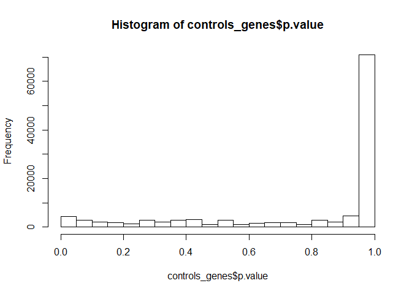
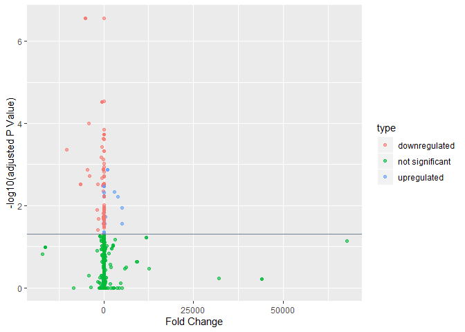
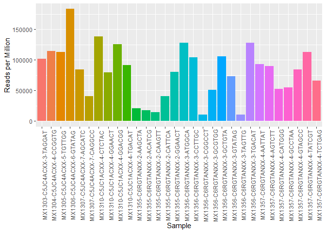

Aka BIGX_Analysis

### 1.0 Data  

#### 1.1 Loading Libraries  


```r
eDat_norows <- read_excel ("Z:/Nikita/Projects/snc_placenta/data/processed/snc_placenta_rob_eDat.xlsx", col_names = TRUE)
```

```
## New names:
## * `` -> ...1
```

```r
colnames (eDat_norows)[1] <- "sample"
eDat <- eDat_norows %>% 
  column_to_rownames(var = "sample")
t_e_norows <- as.data.frame(t(eDat_norows))
miRNA <- row.names(eDat)
colnames (t_e_norows) <- miRNA
t_e_norows <- t_e_norows [-1,]
t_e_norows <- rownames_to_column(t_e_norows, var ="sample")

pDat <- read_excel ("Z:/Nikita/Projects/snc_placenta/data/processed/snc_placenta_rob_pDat.xlsx", col_names = TRUE)
```

```
## New names:
## * `` -> ...1
```

```r
pDat <- pDat [, -1]
```


#### 1.2 Phenotype Info:  


```r
sum_stats <- pDat[c(6,9,10,28)]
tab1 <- tableby(trimester~., data = sum_stats, test =FALSE) #package: arsenal --> cannot use with %>% 
summary (tab1, title ="Breakdown of Samples by Trimester")
```


Table: Breakdown of Samples by Trimester

|                           |  1 (N=5)   |  2 (N=16)  |  3 (N=9)   | Total (N=30) |
|:--------------------------|:----------:|:----------:|:----------:|:------------:|
|**condition**              |            |            |            |              |
|&nbsp;&nbsp;&nbsp;con      | 5 (100.0%) | 10 (62.5%) | 9 (100.0%) |  24 (80.0%)  |
|&nbsp;&nbsp;&nbsp;NTD      |  0 (0.0%)  | 6 (37.5%)  |  0 (0.0%)  |  6 (20.0%)   |
|**sex**                    |            |            |            |              |
|&nbsp;&nbsp;&nbsp;FEMALE   | 3 (60.0%)  | 10 (62.5%) | 4 (44.4%)  |  17 (56.7%)  |
|&nbsp;&nbsp;&nbsp;MALE     | 2 (40.0%)  | 6 (37.5%)  | 5 (55.6%)  |  13 (43.3%)  |
|**450k.array**             |            |            |            |              |
|&nbsp;&nbsp;&nbsp;Match    |  0 (0.0%)  | 15 (93.8%) | 9 (100.0%) |  24 (80.0%)  |
|&nbsp;&nbsp;&nbsp;No Match | 5 (100.0%) |  1 (6.2%)  |  0 (0.0%)  |  6 (20.0%)   |

#### 1.3 Genotype Info:  


### 2.0 Analysis  

#### 2.1 Controls vs NTDs in Trimester 2 samples  
(Univariate Analysis)  

Considering only Trimester 2 Samples:  


```r
tri2p <- pDat %>% #trimester 2 phenotype
  filter (trimester == "2")

tri2 <- as.character(tri2p$sample) #select sample names of trimester 2 --> make value

#tri2g <- eDat %>%   #this dropped the trimester 2 samples and kept the trimester 1 and 3 --> we want the opposite
 # modify_at(tri2,~NULL)

tri2g <- eDat %>% 
  select(which(names(eDat) %in% tri2))

(tri2p$sample == names(tri2g)) %>% all()
```

```
## [1] TRUE
```

```r
tri2_mat <- model.matrix(~condition + sex, tri2p) #desmat for trimester 2 samples modelling for condition controllinf for sex

tri2_mat_sex <- lmFit(tri2g, tri2_mat)

tri2_mat_eb <- eBayes(tri2_mat_sex)
```

```
## Warning in fitFDist(var, df1 = df, covariate = covariate): More than half of
## residual variances are exactly zero: eBayes unreliable
```

```r
diff_tri_sex <- topTable(tri2_mat_eb, n = Inf, adjust.method = "fdr", p.value = 0.05) 
```

```
## Removing intercept from test coefficients
```

```r
paged_table(diff_tri_sex) #control is the reference --> logFC value means it is downregulated in NTDs
```

<div data-pagedtable="false">
  <script data-pagedtable-source type="application/json">
{"columns":[{"label":[""],"name":["_rn_"],"type":[""],"align":["left"]},{"label":["conditionNTD"],"name":[1],"type":["dbl"],"align":["right"]},{"label":["sexMALE"],"name":[2],"type":["dbl"],"align":["right"]},{"label":["AveExpr"],"name":[3],"type":["dbl"],"align":["right"]},{"label":["F"],"name":[4],"type":["dbl"],"align":["right"]},{"label":["P.Value"],"name":[5],"type":["dbl"],"align":["right"]},{"label":["adj.P.Val"],"name":[6],"type":["dbl"],"align":["right"]}],"data":[{"1":"0.01592278","2":"0.3056028","3":"0.1157953","4":"88.234","5":"1.626893e-08","6":"0.0004701396","_rn_":"pred-nov-miR-14722-3p"}],"options":{"columns":{"min":{},"max":[10]},"rows":{"min":[10],"max":[10]},"pages":{}}}
  </script>
</div>

Now here, we need to specify that we want to consider **condition** as our variable or `coefficient` of interest. Otherwise, the function relies on the default intercept which would give us different results:  


```r
diff_tri_sex <- topTable(tri2_mat_eb, n = Inf, adjust.method = "fdr", coef = 2, p.value = 0.05) #specifying variable of interest as control/NTD from tri2_mat column 2
paged_table(diff_tri_sex)
```

<div data-pagedtable="false">
  <script data-pagedtable-source type="application/json">
{"columns":[{"label":[""],"name":["_rn_"],"type":[""],"align":["left"]},{"label":["logFC"],"name":[1],"type":["dbl"],"align":["right"]},{"label":["AveExpr"],"name":[2],"type":["dbl"],"align":["right"]},{"label":["t"],"name":[3],"type":["dbl"],"align":["right"]},{"label":["P.Value"],"name":[4],"type":["dbl"],"align":["right"]},{"label":["adj.P.Val"],"name":[5],"type":["dbl"],"align":["right"]},{"label":["B"],"name":[6],"type":["dbl"],"align":["right"]}],"data":[{"1":"0.4145212","2":"0.3713799","3":"8.41912","4":"9.249312e-07","5":"0.02672866","6":"4.475999","_rn_":"pred-disov-miR-7826-3p"}],"options":{"columns":{"min":{},"max":[10]},"rows":{"min":[10],"max":[10]},"pages":{}}}
  </script>
</div>

***

#### 2.2 Sex-Differential Genes for the 2nd and 3rd trimester  
(Multivariate Analysis):  


```r
tri23p <- pDat %>% 
  filter (!trimester == "1")

tri23 <- as.character(tri23p$sample) 

tri23g <- eDat %>% 
  select(which(names(eDat) %in% tri23))

(tri23p$sample == names(tri23g)) %>% all()
```

```
## [1] TRUE
```

```r
tri23_mat <- model.matrix(~sex + trimester, tri23p) #desmat for trimester 2 and 3 samples modelling for sex controlling by trimester --> GA doesn't work since matrix larger than no of samples, and no residual degress of freedom

tri23genes_sex <- lmFit(tri23g, tri23_mat) %>% 
  eBayes()
```

```
## Warning in fitFDist(var, df1 = df, covariate = covariate): More than half of
## residual variances are exactly zero: eBayes unreliable
```

```r
tri23_list <- topTable(tri23genes_sex, n = Inf, adjust.method = "fdr", coef = 2, p.value = 0.05) #differentially expressed by sex in trimester 2 and 3 in controls and NTDs
paged_table(tri23_list)
```

<div data-pagedtable="false">
  <script data-pagedtable-source type="application/json">
{"columns":[{"label":[""],"name":["_rn_"],"type":[""],"align":["left"]},{"label":["logFC"],"name":[1],"type":["dbl"],"align":["right"]},{"label":["AveExpr"],"name":[2],"type":["dbl"],"align":["right"]},{"label":["t"],"name":[3],"type":["dbl"],"align":["right"]},{"label":["P.Value"],"name":[4],"type":["dbl"],"align":["right"]},{"label":["adj.P.Val"],"name":[5],"type":["dbl"],"align":["right"]},{"label":["B"],"name":[6],"type":["dbl"],"align":["right"]}],"data":[{"1":"0.4067844","2":"0.1885398","3":"9.385148","4":"2.936129e-09","5":"8.484827e-05","6":"9.646097","_rn_":"pred-nov-miR-14722-3p"}],"options":{"columns":{"min":{},"max":[10]},"rows":{"min":[10],"max":[10]},"pages":{}}}
  </script>
</div>

```r
tri23_list_tri3 <- topTable(tri23genes_sex, n = Inf, adjust.method = "fdr", coef = 3, p.value = 0.05) #differentially expressed in trimester 3 in controls and NTDs
nrow(tri23_list_tri3)
```

```
## [1] 80
```

```r
paged_table(tri23_list_tri3)
```

<div data-pagedtable="false">
  <script data-pagedtable-source type="application/json">
{"columns":[{"label":[""],"name":["_rn_"],"type":[""],"align":["left"]},{"label":["logFC"],"name":[1],"type":["dbl"],"align":["right"]},{"label":["AveExpr"],"name":[2],"type":["dbl"],"align":["right"]},{"label":["t"],"name":[3],"type":["dbl"],"align":["right"]},{"label":["P.Value"],"name":[4],"type":["dbl"],"align":["right"]},{"label":["adj.P.Val"],"name":[5],"type":["dbl"],"align":["right"]},{"label":["B"],"name":[6],"type":["dbl"],"align":["right"]}],"data":[{"1":"-6.0582100","2":"5.7439308","3":"-7.493192","4":"1.445444e-07","5":"0.003086937","6":"5.66411959","_rn_":"pred-kno-miR-2566-5p"},{"1":"233.1013326","2":"343.6084000","3":"7.159337","4":"3.020117e-07","5":"0.003086937","6":"4.90757362","_rn_":"pred-kno-miR-5713-3p"},{"1":"-407.8706281","2":"334.5098040","3":"-7.065593","4":"3.724166e-07","5":"0.003086937","6":"4.69263565","_rn_":"pred-disov-miR-14279-5p"},{"1":"-108.5955786","2":"102.2016200","3":"-7.004383","4":"4.272872e-07","5":"0.003086937","6":"4.55170839","_rn_":"pred-1anot-miR-2598-3p"},{"1":"-9.6377309","2":"8.5338244","3":"-6.834456","4":"6.273807e-07","5":"0.003306838","6":"4.15809934","_rn_":"pred-1anot-miR-3665-3p"},{"1":"-9.9014573","2":"8.3246952","3":"-6.794795","4":"6.865883e-07","5":"0.003306838","6":"4.06573437","_rn_":"pred-kno-miR-2600-3p"},{"1":"-45.8715098","2":"57.0674160","3":"-6.548343","4":"1.207803e-06","5":"0.004986156","6":"3.48768681","_rn_":"pred-kno-miR-2555-3p"},{"1":"0.6606805","2":"0.4035748","3":"6.472193","4":"1.440293e-06","5":"0.005202699","6":"3.30768864","_rn_":"pred-nov-miR-965-3p"},{"1":"-88.6083770","2":"137.1726520","3":"-6.186091","4":"2.807970e-06","5":"0.009016080","6":"2.62585680","_rn_":"pred-nov-miR-3385-5p"},{"1":"-375.4848819","2":"397.0190000","3":"-6.006605","4":"4.289211e-06","5":"0.009210827","6":"2.19388304","_rn_":"pred-disov-miR-10630-3p"},{"1":"-375.5001702","2":"397.0284000","3":"-6.006397","4":"4.291323e-06","5":"0.009210827","6":"2.19338142","_rn_":"pred-disov-miR-10972-3p"},{"1":"-435.1452153","2":"508.9747280","3":"-5.981908","4":"4.547934e-06","5":"0.009210827","6":"2.13420566","_rn_":"pred-disov-miR-13631-3p"},{"1":"0.7760282","2":"0.5728788","3":"5.968867","4":"4.690904e-06","5":"0.009210827","6":"2.10267274","_rn_":"pred-kno-miR-1512-5p"},{"1":"-2660.1402326","2":"3881.6488000","3":"-5.945908","4":"4.953853e-06","5":"0.009210827","6":"2.04711733","_rn_":"pred-disov-miR-14285-5p"},{"1":"-86.3023433","2":"117.8949400","3":"-5.897942","4":"5.552736e-06","5":"0.009210827","6":"1.93089990","_rn_":"pred-kno-miR-2552-3p"},{"1":"21.2010581","2":"37.2569800","3":"5.894958","4":"5.592341e-06","5":"0.009210827","6":"1.92366387","_rn_":"pred-kno-miR-12670-5p"},{"1":"-3.8284919","2":"4.1052345","3":"-5.884222","4":"5.737244e-06","5":"0.009210827","6":"1.89762062","_rn_":"pred-nov-miR-8902-3p"},{"1":"-3.8284919","2":"4.1052345","3":"-5.884222","4":"5.737244e-06","5":"0.009210827","6":"1.89762062","_rn_":"pred-nov-miR-8903-5p"},{"1":"-209.2451688","2":"201.9062360","3":"-5.849463","4":"6.233151e-06","5":"0.009480295","6":"1.81323481","_rn_":"pred-kno-miR-2568-3p"},{"1":"-210.5539412","2":"232.5374800","3":"-5.813746","4":"6.788290e-06","5":"0.009538776","6":"1.72641681","_rn_":"pred-kno-miR-2569-3p"},{"1":"-58.5016756","2":"69.4039280","3":"-5.804998","4":"6.931770e-06","5":"0.009538776","6":"1.70513658","_rn_":"pred-kno-miR-14492-3p"},{"1":"-0.5235907","2":"0.5218469","3":"-5.772033","4":"7.500747e-06","5":"0.009852572","6":"1.62489006","_rn_":"pred-disov-miR-3222-3p"},{"1":"-42.9870556","2":"46.2674480","3":"-5.734624","4":"8.204276e-06","5":"0.010308138","6":"1.53371966","_rn_":"pred-kno-miR-2569-5p"},{"1":"-19.2225942","2":"32.5784480","3":"-5.692577","4":"9.075599e-06","5":"0.010927777","6":"1.43111259","_rn_":"pred-nov-miR-12317-3p"},{"1":"-6.2713802","2":"6.5728764","3":"-5.535782","4":"1.324271e-05","5":"0.014320781","6":"1.04733345","_rn_":"pred-kno-miR-2566-3p"},{"1":"-1.2253830","2":"1.5167397","3":"-5.531602","4":"1.337720e-05","5":"0.014320781","6":"1.03707788","_rn_":"pred-kno-miR-2568-5p"},{"1":"-2.5009185","2":"2.5522894","3":"-5.511003","4":"1.406047e-05","5":"0.014320781","6":"0.98652536","_rn_":"pred-kno-miR-1942-3p"},{"1":"1756.2520349","2":"2266.7212400","3":"5.496009","4":"1.458003e-05","5":"0.014320781","6":"0.94970953","_rn_":"pred-kno-miR-5577-5p"},{"1":"1756.2520349","2":"2266.7212400","3":"5.496009","4":"1.458003e-05","5":"0.014320781","6":"0.94970953","_rn_":"pred-kno-miR-5580-5p"},{"1":"-474.4005814","2":"510.8165600","3":"-5.487961","4":"1.486689e-05","5":"0.014320781","6":"0.92994321","_rn_":"pred-disov-miR-4396-5p"},{"1":"-4.5761245","2":"6.6389776","3":"-5.470519","4":"1.550838e-05","5":"0.014456816","6":"0.88709164","_rn_":"pred-1anot-miR-2574-5p"},{"1":"-391.3901107","2":"377.5302080","3":"-5.430213","4":"1.710041e-05","5":"0.015442743","6":"0.78799283","_rn_":"pred-kno-miR-2604-3p"},{"1":"-0.7802506","2":"0.9530476","3":"-5.409013","4":"1.800334e-05","5":"0.015601905","6":"0.73582955","_rn_":"pred-nov-miR-9396-5p"},{"1":"-2.5589061","2":"3.2323750","3":"-5.398504","4":"1.846867e-05","5":"0.015601905","6":"0.70996330","_rn_":"pred-kno-miR-10309-3p"},{"1":"-2.5302826","2":"2.6514792","3":"-5.389080","4":"1.889635e-05","5":"0.015601905","6":"0.68676111","_rn_":"pred-kno-miR-2557-3p"},{"1":"0.2963007","2":"0.1521410","3":"5.342864","4":"2.114368e-05","5":"0.016931865","6":"0.57290321","_rn_":"pred-nov-miR-8488-3p"},{"1":"-4428.9631860","2":"6623.8392000","3":"-5.332591","4":"2.167897e-05","5":"0.016931865","6":"0.54757818","_rn_":"pred-kno-miR-2563-5p"},{"1":"-1.9429577","2":"2.3022373","3":"-5.307404","4":"2.305017e-05","5":"0.017529049","6":"0.48546696","_rn_":"pred-skno-miR-6816-5p"},{"1":"-1.7937886","2":"1.3156936","3":"-5.294361","4":"2.379450e-05","5":"0.017584518","6":"0.45328763","_rn_":"pred-1anot-miR-2567-5p"},{"1":"-39.2672803","2":"39.8647044","3":"-5.262547","4":"2.571370e-05","5":"0.017584518","6":"0.37476569","_rn_":"pred-disov-miR-14344-3p"},{"1":"20.5219325","2":"26.6920444","3":"5.259330","4":"2.591626e-05","5":"0.017584518","6":"0.36682435","_rn_":"pred-kno-miR-12805-3p"},{"1":"-1.0366537","2":"1.0813484","3":"-5.249008","4":"2.657728e-05","5":"0.017584518","6":"0.34133540","_rn_":"pred-nov-miR-7257-3p"},{"1":"-39.7899036","2":"40.5814312","3":"-5.247069","4":"2.670336e-05","5":"0.017584518","6":"0.33654643","_rn_":"pred-disov-miR-14346-3p"},{"1":"0.5708348","2":"0.7524112","3":"5.245985","4":"2.677413e-05","5":"0.017584518","6":"0.33386809","_rn_":"pred-hnov-miR-3235-3p"},{"1":"-16.8518735","2":"28.7197020","3":"-5.157667","4":"3.322365e-05","5":"0.020871675","6":"0.11557797","_rn_":"pred-kno-miR-2570-3p"},{"1":"-16.8518735","2":"28.7197020","3":"-5.157667","4":"3.322365e-05","5":"0.020871675","6":"0.11557797","_rn_":"pred-kno-miR-2571-3p"},{"1":"-272.5029023","2":"369.0046000","3":"-5.144189","4":"3.433777e-05","5":"0.021112616","6":"0.08223676","_rn_":"pred-kno-miR-2557-5p"},{"1":"13.4271549","2":"20.3999964","3":"5.114886","4":"3.689211e-05","5":"0.022210586","6":"0.00972627","_rn_":"pred-disov-miR-6789-3p"},{"1":"-20.9356286","2":"34.7040040","3":"-5.100641","4":"3.820249e-05","5":"0.022530112","6":"-0.02553678","_rn_":"pred-disov-miR-14285-3p"},{"1":"-244.8466605","2":"377.8704800","3":"-5.017302","4":"4.686795e-05","5":"0.026065026","6":"-0.23195717","_rn_":"pred-nov-miR-10218-5p"},{"1":"-241.3698930","2":"372.0182000","3":"-5.015373","4":"4.709049e-05","5":"0.026065026","6":"-0.23673765","_rn_":"pred-nov-miR-9102-5p"},{"1":"30.6248040","2":"30.5604280","3":"5.011950","4":"4.748802e-05","5":"0.026065026","6":"-0.24522093","_rn_":"pred-disov-miR-5523-3p"},{"1":"-0.6214125","2":"0.5391110","3":"-5.008447","4":"4.789838e-05","5":"0.026065026","6":"-0.25390352","_rn_":"pred-kno-miR-3634-3p"},{"1":"-0.9684252","2":"0.8267133","3":"-5.001638","4":"4.870619e-05","5":"0.026065026","6":"-0.27077930","_rn_":"pred-kno-miR-624-5p"},{"1":"-0.2528098","2":"0.2146730","3":"-4.988006","4":"5.036499e-05","5":"0.026068618","6":"-0.30456810","_rn_":"pred-disov-miR-14279-3p"},{"1":"-10.5428401","2":"10.6015576","3":"-4.986779","4":"5.051708e-05","5":"0.026068618","6":"-0.30760990","_rn_":"pred-kno-miR-4799-3p"},{"1":"-170.9333930","2":"275.1647600","3":"-4.950514","4":"5.522731e-05","5":"0.027909582","6":"-0.39752067","_rn_":"pred-kno-miR-2603-3p"},{"1":"-186.4684160","2":"217.4277920","3":"-4.944747","4":"5.601619e-05","5":"0.027909582","6":"-0.41182160","_rn_":"pred-kno-miR-2588-3p"},{"1":"-9.4708044","2":"12.9055612","3":"-4.931598","4":"5.785760e-05","5":"0.028291186","6":"-0.44443022","_rn_":"pred-kno-miR-1485-3p"},{"1":"-2.9420759","2":"3.5158460","3":"-4.925118","4":"5.878739e-05","5":"0.028291186","6":"-0.46050127","_rn_":"pred-disov-miR-3232-3p"},{"1":"-0.5267420","2":"0.4732840","3":"-4.917533","4":"5.989489e-05","5":"0.028291186","6":"-0.47931348","_rn_":"pred-skno-miR-7308-3p"},{"1":"-0.3509685","2":"0.3239843","3":"-4.912120","4":"6.069809e-05","5":"0.028291186","6":"-0.49273948","_rn_":"pred-nov-miR-11842-3p"},{"1":"-47.6298995","2":"36.4444194","3":"-4.886327","4":"6.467721e-05","5":"0.029667333","6":"-0.55672255","_rn_":"pred-disov-miR-4929-5p"},{"1":"0.4709062","2":"0.3222658","3":"4.875422","4":"6.643756e-05","5":"0.029998636","6":"-0.58377537","_rn_":"pred-disov-miR-11824-5p"},{"1":"-7.0794454","2":"7.1845236","3":"-4.821838","4":"7.581513e-05","5":"0.033287997","6":"-0.71673094","_rn_":"pred-kno-miR-2594-3p"},{"1":"1775.3066512","2":"1688.7188800","3":"4.812975","4":"7.749006e-05","5":"0.033287997","6":"-0.73872551","_rn_":"pred-kno-miR-5553-5p"},{"1":"-63.6062695","2":"99.3871760","3":"-4.812383","4":"7.760324e-05","5":"0.033287997","6":"-0.74019454","_rn_":"pred-kno-miR-5977-3p"},{"1":"-12.0372225","2":"16.4298936","3":"-4.808602","4":"7.833012e-05","5":"0.033287997","6":"-0.74957754","_rn_":"pred-kno-miR-5477-5p"},{"1":"-136.4997153","2":"207.3477480","3":"-4.773301","4":"8.545595e-05","5":"0.035789943","6":"-0.83718272","_rn_":"pred-kno-miR-2592-5p"},{"1":"-0.9141428","2":"1.0856740","3":"-4.737114","4":"9.343840e-05","5":"0.038574041","6":"-0.92698805","_rn_":"pred-nov-miR-2578-5p"},{"1":"13.9956086","2":"17.4784284","3":"4.729645","4":"9.517709e-05","5":"0.038681540","6":"-0.94552306","_rn_":"pred-disov-miR-4549-3p"},{"1":"-0.1663896","2":"0.1398771","3":"-4.719475","4":"9.759726e-05","5":"0.038681540","6":"-0.97076371","_rn_":"pred-kno-miR-14546-5p"},{"1":"2.0233239","2":"1.6619954","3":"4.718989","4":"9.771446e-05","5":"0.038681540","6":"-0.97196991","_rn_":"pred-kno-miR-4784-3p"},{"1":"-3254.8425814","2":"4191.9124000","3":"-4.645026","4":"1.173020e-04","5":"0.045808018","6":"-1.15550410","_rn_":"pred-disov-miR-13631-5p"},{"1":"-20.9861410","2":"25.1675604","3":"-4.622139","4":"1.241283e-04","5":"0.046689688","6":"-1.21228364","_rn_":"pred-kno-miR-2561-5p"},{"1":"-0.4982146","2":"0.4078931","3":"-4.620065","4":"1.247664e-04","5":"0.046689688","6":"-1.21742919","_rn_":"pred-kno-miR-4271-5p"},{"1":"155.9741200","2":"138.6165880","3":"4.616418","4":"1.258961e-04","5":"0.046689688","6":"-1.22647553","_rn_":"pred-kno-miR-4271-3p"},{"1":"156.0058505","2":"138.6305360","3":"4.616013","4":"1.260224e-04","5":"0.046689688","6":"-1.22748171","_rn_":"pred-kno-miR-3606-3p"},{"1":"-47.4848435","2":"57.0062256","3":"-4.596057","4":"1.323956e-04","5":"0.048429986","6":"-1.27698313","_rn_":"pred-kno-miR-2564-3p"},{"1":"-2.2117493","2":"2.4268981","3":"-4.584062","4":"1.363809e-04","5":"0.049264176","6":"-1.30673248","_rn_":"pred-disov-miR-14469-3p"}],"options":{"columns":{"min":{},"max":[10]},"rows":{"min":[10],"max":[10]},"pages":{}}}
  </script>
</div>

```r
decideTests(tri23genes_sex, adjust.method = "fdr", p.value = 0.05) %>% 
  summary()
```

```
##        (Intercept) sexMALE trimester3
## Down             0       0         63
## NotSig       27115   28897      28818
## Up            1783       1         17
```

##### 2.2.1 Applying Contrasts  

Making **contrasts** manually as opposed to implicit determinimation using `lmFit`:  


However, since there is only variable we're considering above (**sex**), we don't really need to use a contrast matrix. (Specifying `coef = 2`  in `tri23genes_sex` doesn't make a difference since there is only one variable and we aren't controlling for confoudnders or covariates)   


```r
tri23_list <- topTable(tri23genes_sex, n = Inf, adjust.method = "fdr", p.value = 0.05)
```

```
## Removing intercept from test coefficients
```

```r
paged_table(tri23_list)
```

<div data-pagedtable="false">
  <script data-pagedtable-source type="application/json">
{"columns":[{"label":[""],"name":["_rn_"],"type":[""],"align":["left"]},{"label":["sexMALE"],"name":[1],"type":["dbl"],"align":["right"]},{"label":["trimester3"],"name":[2],"type":["dbl"],"align":["right"]},{"label":["AveExpr"],"name":[3],"type":["dbl"],"align":["right"]},{"label":["F"],"name":[4],"type":["dbl"],"align":["right"]},{"label":["P.Value"],"name":[5],"type":["dbl"],"align":["right"]},{"label":["adj.P.Val"],"name":[6],"type":["dbl"],"align":["right"]}],"data":[{"1":"0.40678438","2":"0.1286211","3":"0.1885398","4":"54.52159","5":"2.245092e-09","6":"6.487867e-05","_rn_":"pred-nov-miR-14722-3p"},{"1":"0.07191551","2":"-6.0582100","3":"5.7439308","4":"28.83690","5":"6.013948e-07","6":"8.689554e-03","_rn_":"pred-kno-miR-2566-5p"},{"1":"-9.11084186","2":"233.1013326","3":"343.6084000","4":"26.10394","5":"1.334418e-06","6":"1.199693e-02","_rn_":"pred-kno-miR-5713-3p"},{"1":"119.58604047","2":"-407.8706281","3":"334.5098040","4":"25.38716","5":"1.660590e-06","6":"1.199693e-02","_rn_":"pred-disov-miR-14279-5p"},{"1":"15.54668535","2":"-108.5955786","3":"102.2016200","4":"24.54852","5":"2.156571e-06","6":"1.211484e-02","_rn_":"pred-1anot-miR-2598-3p"},{"1":"3.22574053","2":"-9.6377309","3":"8.5338244","4":"24.06367","5":"2.515366e-06","6":"1.211484e-02","_rn_":"pred-1anot-miR-3665-3p"},{"1":"2.21481467","2":"-9.9014573","3":"8.3246952","4":"23.16124","5":"3.368819e-06","6":"1.390745e-02","_rn_":"pred-kno-miR-2600-3p"},{"1":"4.05149256","2":"-45.8715098","3":"57.0674160","4":"21.59369","5":"5.701348e-06","6":"1.949679e-02","_rn_":"pred-kno-miR-2555-3p"},{"1":"-0.01769272","2":"0.6606805","3":"0.4035748","4":"21.41084","5":"6.072086e-06","6":"1.949679e-02","_rn_":"pred-nov-miR-965-3p"},{"1":"1.90450326","2":"-88.6083770","3":"137.1726520","4":"19.59204","5":"1.159115e-05","6":"3.349609e-02","_rn_":"pred-nov-miR-3385-5p"},{"1":"0.50209725","2":"-0.7802506","3":"0.9530476","4":"18.26455","5":"1.904175e-05","6":"3.793718e-02","_rn_":"pred-nov-miR-9396-5p"},{"1":"55.73549953","2":"-375.4848819","3":"397.0190000","4":"18.04793","5":"2.069198e-05","6":"3.793718e-02","_rn_":"pred-disov-miR-10630-3p"},{"1":"55.73882744","2":"-375.5001702","3":"397.0284000","4":"18.04668","5":"2.070194e-05","6":"3.793718e-02","_rn_":"pred-disov-miR-10972-3p"},{"1":"39.77893116","2":"-435.1452153","3":"508.9747280","4":"18.00989","5":"2.099749e-05","6":"3.793718e-02","_rn_":"pred-disov-miR-13631-3p"},{"1":"-0.08288221","2":"0.7760282","3":"0.5728788","4":"17.88929","5":"2.199907e-05","6":"3.793718e-02","_rn_":"pred-kno-miR-1512-5p"},{"1":"281.90244186","2":"-2660.1402326","3":"3881.6488000","4":"17.75395","5":"2.318537e-05","6":"3.793718e-02","_rn_":"pred-disov-miR-14285-5p"},{"1":"-1.69011047","2":"21.2010581","3":"37.2569800","4":"17.52747","5":"2.532941e-05","6":"3.793718e-02","_rn_":"pred-kno-miR-12670-5p"},{"1":"18.09407419","2":"-86.3023433","3":"117.8949400","4":"17.42484","5":"2.637117e-05","6":"3.793718e-02","_rn_":"pred-kno-miR-2552-3p"},{"1":"12.98264279","2":"-209.2451688","3":"201.9062360","4":"17.32330","5":"2.744794e-05","6":"3.793718e-02","_rn_":"pred-kno-miR-2568-3p"},{"1":"0.63563050","2":"-3.8284919","3":"4.1052345","4":"17.31219","5":"2.756872e-05","6":"3.793718e-02","_rn_":"pred-nov-miR-8902-3p"},{"1":"0.63563050","2":"-3.8284919","3":"4.1052345","4":"17.31219","5":"2.756872e-05","6":"3.793718e-02","_rn_":"pred-nov-miR-8903-5p"},{"1":"14.89459721","2":"-210.5539412","3":"232.5374800","4":"17.07919","5":"3.023771e-05","6":"3.884630e-02","_rn_":"pred-kno-miR-2569-3p"},{"1":"0.01458363","2":"-0.5235907","3":"0.5218469","4":"17.02338","5":"3.091788e-05","6":"3.884630e-02","_rn_":"pred-disov-miR-3222-3p"},{"1":"11.74576860","2":"-58.5016756","3":"69.4039280","4":"16.86797","5":"3.290153e-05","6":"3.961619e-02","_rn_":"pred-kno-miR-14492-3p"},{"1":"6.65241395","2":"-19.2225942","3":"32.5784480","4":"16.76418","5":"3.430318e-05","6":"3.965173e-02","_rn_":"pred-nov-miR-12317-3p"},{"1":"4.59798860","2":"-42.9870556","3":"46.2674480","4":"16.51238","5":"3.798128e-05","6":"4.221473e-02","_rn_":"pred-kno-miR-2569-5p"}],"options":{"columns":{"min":{},"max":[10]},"rows":{"min":[10],"max":[10]},"pages":{}}}
  </script>
</div>


##### 2.2.2 Comparing `lmFit` and `contrasta.fit`  

Now, if we actually applied the same `coef` fucntion to consider *sex* as the variable of interest in the **Controls vs NTDs in Trimester 2 samples** analysis above, we get the same significantly differentially expressed miRNA by sex as when looking at **Sex-Differential Genes in Trimester 2 and 3**:  


```r
diff_tri_sex <- topTable(tri2_mat_eb, n = Inf, adjust.method = "fdr", coef = 3, p.value = 0.05)
paged_table(diff_tri_sex)
```

<div data-pagedtable="false">
  <script data-pagedtable-source type="application/json">
{"columns":[{"label":[""],"name":["_rn_"],"type":[""],"align":["left"]},{"label":["logFC"],"name":[1],"type":["dbl"],"align":["right"]},{"label":["AveExpr"],"name":[2],"type":["dbl"],"align":["right"]},{"label":["t"],"name":[3],"type":["dbl"],"align":["right"]},{"label":["P.Value"],"name":[4],"type":["dbl"],"align":["right"]},{"label":["adj.P.Val"],"name":[5],"type":["dbl"],"align":["right"]},{"label":["B"],"name":[6],"type":["dbl"],"align":["right"]}],"data":[{"1":"0.3056028","2":"0.1157953","3":"12.86509","4":"5.355449e-09","5":"0.0001547618","6":"9.951615","_rn_":"pred-nov-miR-14722-3p"}],"options":{"columns":{"min":{},"max":[10]},"rows":{"min":[10],"max":[10]},"pages":{}}}
  </script>
</div>

***  


#### 2.3 Differential miRNA by Trimester in Controls  


```r
controls_p <- pDat %>% 
  filter (condition == "con")

control_samp <- as.character(controls_p$sample) 

control_g <- eDat %>% 
  select(which(names(eDat) %in% control_samp))

(controls_p$sample == names(control_g)) %>% all()
```

```
## [1] TRUE
```

```r
controls_mat <- model.matrix(~trimester + sex, controls_p) #desmat for all controls modelling for trimester controlling by sex 

controls_genes <- lmFit(control_g, controls_mat) %>% 
  eBayes()
```

```
## Warning in fitFDist(var, df1 = df, covariate = covariate): More than half of
## residual variances are exactly zero: eBayes unreliable
```

```r
decideTests(controls_genes, adjust.method = "fdr", p.value = 0.05) %>% #total number of differentially expressed genes at fdr 0f 0.05 and a pvalue of 0.05
  summary() 
```

```
##        (Intercept) trimester2 trimester3 sexMALE
## Down             0         78        119       0
## NotSig       28054      28801      28745   28898
## Up             844         19         34       0
```

```r
decideTests(controls_genes, adjust.method = "fdr", p.value = 0.01) %>% #total number of differentially expressed genes at fdr 0f 0.05 and a pvalue of 0.05
  summary() 
```

```
##        (Intercept) trimester2 trimester3 sexMALE
## Down             0         48         77       0
## NotSig       28288      28841      28805   28898
## Up             610          9         16       0
```

```r
hist(controls_genes$p.value)
```

<!-- -->

```r
controls_tri2_list <- topTable(controls_genes, n = Inf, adjust.method = "fdr", coef = 2, p.value = 0.05, sort.by = "logFC") #pulling out genes differentially expressed in controls at trimester 2
nrow(controls_tri2_list)
```

```
## [1] 97
```

```r
paged_table(controls_tri2_list)
```

<div data-pagedtable="false">
  <script data-pagedtable-source type="application/json">
{"columns":[{"label":[""],"name":["_rn_"],"type":[""],"align":["left"]},{"label":["logFC"],"name":[1],"type":["dbl"],"align":["right"]},{"label":["AveExpr"],"name":[2],"type":["dbl"],"align":["right"]},{"label":["t"],"name":[3],"type":["dbl"],"align":["right"]},{"label":["P.Value"],"name":[4],"type":["dbl"],"align":["right"]},{"label":["adj.P.Val"],"name":[5],"type":["dbl"],"align":["right"]},{"label":["B"],"name":[6],"type":["dbl"],"align":["right"]}],"data":[{"1":"-1.022642e+04","2":"6.702174e+03","3":"-7.482853","4":"2.675598e-07","5":"4.295523e-04","6":"5.340679281","_rn_":"pred-kno-miR-5584-5p"},{"1":"-6.548292e+03","2":"5.300323e+03","3":"-6.197955","4":"4.127406e-06","5":"3.013707e-03","6":"2.527333573","_rn_":"pred-kno-miR-5572-3p"},{"1":"-6.548292e+03","2":"5.300323e+03","3":"-6.197955","4":"4.127406e-06","5":"3.013707e-03","6":"2.527333573","_rn_":"pred-kno-miR-5573-3p"},{"1":"5.052909e+03","2":"5.073520e+03","3":"5.420446","4":"2.387910e-05","5":"1.131777e-02","6":"0.734326763","_rn_":"pred-kno-miR-2563-5p"},{"1":"5.046395e+03","2":"4.834084e+03","3":"4.885155","4":"8.281858e-05","5":"2.782897e-02","6":"-0.527952923","_rn_":"pred-disov-miR-10020-3p"},{"1":"-5.039454e+03","2":"1.419337e+03","3":"-12.605792","4":"3.813165e-11","5":"2.760202e-07","6":"14.525785280","_rn_":"pred-disov-miR-11278-3p"},{"1":"-5.039454e+03","2":"1.419337e+03","3":"-12.605792","4":"3.813165e-11","5":"2.760202e-07","6":"14.525785280","_rn_":"pred-disov-miR-5987-3p"},{"1":"-5.038276e+03","2":"1.419033e+03","3":"-12.604451","4":"3.820613e-11","5":"2.760202e-07","6":"14.523754560","_rn_":"pred-disov-miR-3559-3p"},{"1":"-4.547250e+03","2":"2.762109e+03","3":"-6.720149","4":"1.322518e-06","5":"1.339552e-03","6":"3.695296072","_rn_":"pred-kno-miR-2461-3p"},{"1":"-4.057766e+03","2":"2.681849e+03","3":"-8.582647","4":"3.063630e-08","5":"9.836974e-05","6":"7.580040417","_rn_":"pred-kno-miR-5593-5p"},{"1":"-3.928205e+03","2":"2.443125e+03","3":"-6.487851","4":"2.184791e-06","5":"1.913215e-03","6":"3.179693623","_rn_":"pred-kno-miR-14626-3p"},{"1":"3.846793e+03","2":"4.700848e+03","3":"5.723645","4":"1.194674e-05","5":"6.164947e-03","6":"1.440337633","_rn_":"pred-kno-miR-14043-3p"},{"1":"2.985112e+03","2":"2.947917e+03","3":"5.891698","4":"8.173468e-06","5":"4.723938e-03","6":"1.828084532","_rn_":"pred-disov-miR-14285-5p"},{"1":"-1.832229e+03","2":"1.824314e+03","3":"-5.338270","4":"2.885554e-05","5":"1.263436e-02","6":"0.541704501","_rn_":"pred-kno-miR-5596-3p"},{"1":"-1.590612e+03","2":"1.594808e+03","3":"-6.191739","4":"4.184569e-06","5":"3.013707e-03","6":"2.513241563","_rn_":"pred-kno-miR-5600-3p"},{"1":"-1.587719e+03","2":"1.818535e+03","3":"-4.711141","4":"1.246533e-04","5":"3.873367e-02","6":"-0.941125707","_rn_":"pred-kno-miR-5588-5p"},{"1":"-1.531621e+03","2":"1.189943e+03","3":"-5.022714","4":"6.002985e-05","5":"2.141657e-02","6":"-0.202085082","_rn_":"pred-kno-miR-5583-3p"},{"1":"1.067479e+03","2":"1.365798e+03","3":"6.703987","4":"1.369211e-06","5":"1.339552e-03","6":"3.659635703","_rn_":"pred-kno-miR-2200-5p"},{"1":"1.066838e+03","2":"1.366139e+03","3":"6.696761","4":"1.390635e-06","5":"1.339552e-03","6":"3.643680491","_rn_":"pred-kno-miR-9678-5p"},{"1":"-6.656876e+02","2":"4.962310e+02","3":"-7.186944","4":"4.927822e-07","5":"6.781153e-04","6":"4.711153465","_rn_":"pred-kno-miR-2456-5p"},{"1":"-5.683123e+02","2":"4.628167e+02","3":"-7.572851","4":"2.227243e-07","5":"3.786050e-04","6":"5.529881114","_rn_":"pred-kno-miR-5581-3p"},{"1":"-5.430065e+02","2":"5.588040e+02","3":"-6.402589","4":"2.631387e-06","5":"2.172623e-03","6":"2.988833445","_rn_":"pred-disov-miR-12260-3p"},{"1":"5.026501e+02","2":"4.988199e+02","3":"5.097239","4":"5.045512e-05","5":"1.893574e-02","6":"-0.025903206","_rn_":"pred-kno-miR-2552-5p"},{"1":"-4.888964e+02","2":"1.307073e+02","3":"-9.288566","4":"8.283149e-09","5":"3.005287e-05","6":"8.934922737","_rn_":"pred-kno-miR-11406-5p"},{"1":"-4.888152e+02","2":"1.306970e+02","3":"-9.287471","4":"8.299562e-09","5":"3.005287e-05","6":"8.932870658","_rn_":"pred-kno-miR-3439-5p"},{"1":"-4.888045e+02","2":"1.306809e+02","3":"-9.286131","4":"8.319708e-09","5":"3.005287e-05","6":"8.930357271","_rn_":"pred-kno-miR-6994-5p"},{"1":"-3.662155e+02","2":"3.166107e+02","3":"-6.104465","4":"5.078555e-06","5":"3.255930e-03","6":"2.314933498","_rn_":"pred-kno-miR-2459-5p"},{"1":"2.782124e+02","2":"2.465417e+02","3":"4.868227","4":"8.617210e-05","5":"2.797979e-02","6":"-0.568106970","_rn_":"pred-kno-miR-2604-3p"},{"1":"1.705022e+02","2":"2.140252e+02","3":"4.597841","4":"1.628214e-04","5":"4.856252e-02","6":"-1.210480545","_rn_":"pred-kno-miR-2603-3p"},{"1":"-1.703335e+02","2":"1.549146e+02","3":"-6.095330","4":"5.182807e-06","5":"3.255930e-03","6":"2.294128896","_rn_":"pred-1anot-miR-5589-3p"},{"1":"-1.703335e+02","2":"1.549146e+02","3":"-6.095330","4":"5.182807e-06","5":"3.255930e-03","6":"2.294128896","_rn_":"pred-kno-miR-5592-3p"},{"1":"1.657879e+02","2":"1.489982e+02","3":"4.987246","4":"6.521478e-05","5":"2.270574e-02","6":"-0.286028481","_rn_":"pred-kno-miR-2588-3p"},{"1":"-1.618379e+02","2":"7.376715e+01","3":"-7.880769","4":"1.198989e-07","5":"2.309892e-04","6":"6.169193454","_rn_":"pred-1anot-miR-5576-3p"},{"1":"-1.352436e+02","2":"1.540160e+02","3":"-5.024990","4":"5.971173e-05","5":"2.141657e-02","6":"-0.196699980","_rn_":"pred-kno-miR-2456-3p"},{"1":"1.315943e+02","2":"1.158526e+02","3":"4.633382","4":"1.497244e-04","5":"4.554458e-02","6":"-1.125970456","_rn_":"pred-kno-miR-2564-5p"},{"1":"-9.646735e+01","2":"7.053623e+01","3":"-6.797701","4":"1.120215e-06","5":"1.294879e-03","6":"3.865962965","_rn_":"pred-1anot-miR-14298-5p"},{"1":"-9.318020e+01","2":"4.802181e+01","3":"-5.099741","4":"5.016195e-05","5":"1.893574e-02","6":"-0.019991760","_rn_":"pred-kno-miR-5600-5p"},{"1":"-9.318020e+01","2":"4.802181e+01","3":"-5.099741","4":"5.016195e-05","5":"1.893574e-02","6":"-0.019991760","_rn_":"pred-1anot-miR-5609-5p"},{"1":"8.066347e+01","2":"1.002162e+02","3":"5.262605","4":"3.436926e-05","5":"1.460593e-02","6":"0.363919840","_rn_":"pred-disov-miR-6204-5p"},{"1":"-7.666139e+01","2":"3.774455e+01","3":"-4.597360","4":"1.630066e-04","5":"4.856252e-02","6":"-1.211625617","_rn_":"pred-kno-miR-5579-5p"},{"1":"-7.361397e+01","2":"5.557350e+01","3":"-6.772525","4":"1.182143e-06","5":"1.313907e-03","6":"3.810639920","_rn_":"pred-kno-miR-10876-5p"},{"1":"-5.252552e+01","2":"3.584753e+01","3":"-6.176338","4":"4.329725e-06","5":"3.013707e-03","6":"2.478307517","_rn_":"pred-kno-miR-9460-3p"},{"1":"-4.390614e+01","2":"4.043949e+01","3":"-6.171118","4":"4.380085e-06","5":"3.013707e-03","6":"2.466461288","_rn_":"pred-1anot-miR-5575-3p"},{"1":"-3.841438e+01","2":"4.271850e+01","3":"-5.228654","4":"3.718076e-05","5":"1.534928e-02","6":"0.284023291","_rn_":"pred-1anot-miR-5613-3p"},{"1":"3.665034e+01","2":"3.158211e+01","3":"5.766630","4":"1.083813e-05","5":"5.909439e-03","6":"1.539773734","_rn_":"pred-kno-miR-14495-3p"},{"1":"-3.595349e+01","2":"2.613327e+01","3":"-7.110538","4":"5.780560e-07","5":"7.593029e-04","6":"4.546767405","_rn_":"pred-1anot-miR-5576-5p"},{"1":"2.845053e+01","2":"2.619453e+01","3":"6.057532","4":"5.638020e-06","5":"3.428636e-03","6":"2.207949561","_rn_":"pred-disov-miR-14285-3p"},{"1":"-1.659862e+01","2":"4.574015e+00","3":"-6.735796","4":"1.278873e-06","5":"1.339552e-03","6":"3.729788389","_rn_":"pred-nov-miR-7425-3p"},{"1":"-1.606491e+01","2":"8.387678e+00","3":"-4.889829","4":"8.191616e-05","5":"2.782897e-02","6":"-0.516868253","_rn_":"pred-kno-miR-624-3p"},{"1":"-1.503007e+01","2":"1.130323e+01","3":"-5.926329","4":"7.561551e-06","5":"4.459464e-03","6":"1.907643798","_rn_":"pred-1anot-miR-1427-5p"},{"1":"-1.366215e+01","2":"1.492353e+01","3":"-4.873367","4":"8.513961e-05","5":"2.795869e-02","6":"-0.555914174","_rn_":"pred-kno-miR-9461-3p"},{"1":"-1.241930e+01","2":"8.705784e+00","3":"-5.177952","4":"4.182130e-05","5":"1.702186e-02","6":"0.164568712","_rn_":"pred-disov-miR-1411-5p"},{"1":"-1.110427e+01","2":"4.068450e+00","3":"-7.827509","4":"1.333336e-07","5":"2.408172e-04","6":"6.059504160","_rn_":"pred-nov-miR-4191-3p"},{"1":"-1.085008e+01","2":"9.945374e+00","3":"-5.512421","4":"1.933499e-05","5":"9.802500e-03","6":"0.949306915","_rn_":"pred-kno-miR-4141-3p"},{"1":"-1.039350e+01","2":"8.964797e+00","3":"-5.768665","4":"1.078834e-05","5":"5.909439e-03","6":"1.544475740","_rn_":"pred-disov-miR-5740-5p"},{"1":"9.962908e+00","2":"1.104210e+01","3":"5.873625","4":"8.512702e-06","5":"4.823531e-03","6":"1.786516530","_rn_":"pred-kno-miR-14491-3p"},{"1":"-9.955879e+00","2":"4.370523e+00","3":"-6.619075","4":"1.643933e-06","5":"1.532464e-03","6":"3.471756152","_rn_":"pred-kno-miR-2460-5p"},{"1":"-9.790054e+00","2":"1.130371e+01","3":"-4.876683","4":"8.448013e-05","5":"2.795869e-02","6":"-0.548048146","_rn_":"pred-disov-miR-13973-5p"},{"1":"-8.744260e+00","2":"8.249156e+00","3":"-5.147883","4":"4.484719e-05","5":"1.799992e-02","6":"0.093653082","_rn_":"pred-kno-miR-10370-5p"},{"1":"-8.071152e+00","2":"4.311710e+00","3":"-5.126680","4":"4.711370e-05","5":"1.865057e-02","6":"0.043616345","_rn_":"pred-kno-miR-1497-3p"},{"1":"-6.272860e+00","2":"4.442255e+00","3":"-9.581864","4":"4.899234e-09","5":"2.831561e-05","6":"9.479477090","_rn_":"pred-skno-miR-1100-5p"},{"1":"-5.760704e+00","2":"1.585454e+00","3":"-5.339052","4":"2.880350e-05","5":"1.263436e-02","6":"0.543540607","_rn_":"pred-kno-miR-11406-3p"},{"1":"-5.760704e+00","2":"1.585454e+00","3":"-5.339052","4":"2.880350e-05","5":"1.263436e-02","6":"0.543540607","_rn_":"pred-kno-miR-6994-3p"},{"1":"-5.479664e+00","2":"2.346914e+00","3":"-5.106171","4":"4.941673e-05","5":"1.893574e-02","6":"-0.004807342","_rn_":"pred-kno-miR-13601-3p"},{"1":"-4.796728e+00","2":"1.478632e+00","3":"-13.281677","4":"1.455772e-11","5":"2.760202e-07","6":"15.528143838","_rn_":"pred-kno-miR-2461-5p"},{"1":"-4.114221e+00","2":"1.862594e+00","3":"-6.147418","4":"4.616407e-06","5":"3.102440e-03","6":"2.412637152","_rn_":"pred-kno-miR-3439-3p"},{"1":"4.104295e+00","2":"4.889342e+00","3":"5.745160","4":"1.137808e-05","5":"5.978250e-03","6":"1.490128761","_rn_":"pred-kno-miR-4821-3p"},{"1":"-3.772199e+00","2":"1.441309e+00","3":"-5.413171","4":"2.428201e-05","5":"1.131777e-02","6":"0.717294197","_rn_":"pred-kno-miR-14661-5p"},{"1":"-3.546093e+00","2":"2.642684e+00","3":"-6.868973","4":"9.623734e-07","5":"1.158778e-03","6":"4.022151148","_rn_":"pred-kno-miR-2457-3p"},{"1":"3.169059e+00","2":"3.661724e+00","3":"5.419723","4":"2.391884e-05","5":"1.131777e-02","6":"0.732634065","_rn_":"pred-disov-miR-6352-3p"},{"1":"-2.586054e+00","2":"1.621462e+00","3":"-8.064999","4":"8.327875e-08","5":"1.875277e-04","6":"6.545749758","_rn_":"pred-hnov-miR-7646-5p"},{"1":"-2.580409e+00","2":"1.640103e+00","3":"-8.020803","4":"9.085017e-08","5":"1.875277e-04","6":"6.455822042","_rn_":"pred-hnov-miR-7642-5p"},{"1":"-2.580409e+00","2":"1.640103e+00","3":"-8.020803","4":"9.085017e-08","5":"1.875277e-04","6":"6.455822042","_rn_":"pred-hnov-miR-7644-5p"},{"1":"-2.580409e+00","2":"1.640103e+00","3":"-8.020803","4":"9.085017e-08","5":"1.875277e-04","6":"6.455822042","_rn_":"pred-hnov-miR-7645-5p"},{"1":"-2.262983e+00","2":"1.725973e+00","3":"-6.229044","4":"3.853281e-06","5":"3.009517e-03","6":"2.597752120","_rn_":"pred-kno-miR-1522-3p"},{"1":"-2.118616e+00","2":"8.990080e-01","3":"-6.491302","4":"2.168447e-06","5":"1.913215e-03","6":"3.187401462","_rn_":"pred-nov-miR-4125-3p"},{"1":"-2.084132e+00","2":"1.981576e+00","3":"-4.756946","4":"1.119141e-04","5":"3.515320e-02","6":"-0.832288930","_rn_":"pred-1anot-miR-4525-3p"},{"1":"-1.651810e+00","2":"6.941753e-01","3":"-6.255770","4":"3.632572e-06","5":"2.915946e-03","6":"2.658202434","_rn_":"pred-kno-miR-6304-3p"},{"1":"-1.633696e+00","2":"1.410360e+00","3":"-5.423739","4":"2.369897e-05","5":"1.131777e-02","6":"0.742035160","_rn_":"pred-kno-miR-13786-3p"},{"1":"-1.602302e+00","2":"8.573260e-01","3":"-6.991390","4":"7.425697e-07","5":"9.329905e-04","6":"4.288932271","_rn_":"pred-1anot-miR-440-5p"},{"1":"-1.494063e+00","2":"1.086367e+00","3":"-7.414464","4":"3.077985e-07","5":"4.627701e-04","6":"5.196195979","_rn_":"pred-kno-miR-8187-5p"},{"1":"-1.377155e+00","2":"6.026688e-01","3":"-5.316473","4":"3.034463e-05","5":"1.308805e-02","6":"0.490530833","_rn_":"pred-1anot-miR-9577-5p"},{"1":"-1.334516e+00","2":"3.432710e-01","3":"-5.465982","4":"2.150726e-05","5":"1.071581e-02","6":"0.840844991","_rn_":"pred-kno-miR-1037-3p"},{"1":"-7.720183e-01","2":"2.970941e-01","3":"-5.065865","4":"5.428134e-05","5":"2.011054e-02","6":"-0.100038735","_rn_":"pred-kno-miR-5254-3p"},{"1":"7.375711e-01","2":"3.618282e-01","3":"6.053021","4":"5.695014e-06","5":"3.428636e-03","6":"2.197654846","_rn_":"pred-kno-miR-3634-3p"},{"1":"7.230673e-01","2":"7.053389e-01","3":"4.658812","4":"1.410097e-04","5":"4.334999e-02","6":"-1.065508477","_rn_":"pred-kno-miR-1375-5p"},{"1":"-7.196097e-01","2":"6.217456e-01","3":"-5.253499","4":"3.510147e-05","5":"1.470090e-02","6":"0.342496694","_rn_":"pred-disov-miR-3222-3p"},{"1":"-7.071932e-01","2":"2.192545e-01","3":"-4.793905","4":"1.026000e-04","5":"3.258169e-02","6":"-0.744510550","_rn_":"pred-kno-miR-14634-3p"},{"1":"-6.370606e-01","2":"2.949919e-01","3":"-7.395118","4":"3.202783e-07","5":"4.627701e-04","6":"5.155215378","_rn_":"pred-kno-miR-12067-5p"},{"1":"-6.090518e-01","2":"2.357626e-01","3":"-8.348583","4":"4.794217e-08","5":"1.385433e-04","6":"7.116691968","_rn_":"pred-nov-miR-1828-5p"},{"1":"-5.480279e-01","2":"2.628071e-01","3":"-4.818676","4":"9.679959e-05","5":"3.108127e-02","6":"-0.685697942","_rn_":"pred-nov-miR-629-5p"},{"1":"-5.223295e-01","2":"2.291416e-01","3":"-5.037622","4":"5.797707e-05","5":"2.120787e-02","6":"-0.166818170","_rn_":"pred-kno-miR-13147-3p"},{"1":"-4.073647e-01","2":"1.633413e-01","3":"-6.464606","4":"2.298222e-06","5":"1.953353e-03","6":"3.127743231","_rn_":"pred-kno-miR-3664-5p"},{"1":"-3.789145e-01","2":"1.851058e-01","3":"-5.368612","4":"2.690550e-05","5":"1.234151e-02","6":"0.612885389","_rn_":"pred-1anot-miR-7452-5p"},{"1":"-3.359486e-01","2":"1.301009e-01","3":"-4.942013","4":"7.249187e-05","5":"2.493893e-02","6":"-0.393165801","_rn_":"pred-nov-miR-12163-3p"},{"1":"-3.143111e-01","2":"8.299799e-02","3":"-5.747510","4":"1.131766e-05","5":"5.978250e-03","6":"1.495565164","_rn_":"pred-nov-miR-13235-5p"},{"1":"-1.560988e-01","2":"4.800660e-02","3":"-5.001152","4":"6.312980e-05","5":"2.224786e-02","6":"-0.253108539","_rn_":"pred-nov-miR-8783-3p"}],"options":{"columns":{"min":{},"max":[10]},"rows":{"min":[10],"max":[10]},"pages":{}}}
  </script>
</div>

```r
controls_tri3_list <- topTable(controls_genes, n = Inf, adjust.method = "fdr", coef = 3, p.value = 0.05, sort.by = "logFC") # pulling out genes differentially expressed in controls at trimester 3
nrow(controls_tri3_list)
```

```
## [1] 153
```

```r
paged_table(controls_tri3_list) #logFC value too high 
```

<div data-pagedtable="false">
  <script data-pagedtable-source type="application/json">
{"columns":[{"label":[""],"name":["_rn_"],"type":[""],"align":["left"]},{"label":["logFC"],"name":[1],"type":["dbl"],"align":["right"]},{"label":["AveExpr"],"name":[2],"type":["dbl"],"align":["right"]},{"label":["t"],"name":[3],"type":["dbl"],"align":["right"]},{"label":["P.Value"],"name":[4],"type":["dbl"],"align":["right"]},{"label":["adj.P.Val"],"name":[5],"type":["dbl"],"align":["right"]},{"label":["B"],"name":[6],"type":["dbl"],"align":["right"]}],"data":[{"1":"79077.9943662","2":"7.285589e+04","3":"4.923152","4":"7.576435e-05","5":"1.903859e-02","6":"-0.41582044","_rn_":"pred-kno-miR-10871-3p"},{"1":"10215.0796620","2":"1.020196e+04","3":"5.659730","4":"1.381344e-05","5":"5.600928e-03","6":"1.31417453","_rn_":"pred-kno-miR-13738-3p"},{"1":"-9428.1259127","2":"6.702174e+03","3":"-6.747479","4":"1.247251e-06","5":"8.191606e-04","6":"3.77746304","_rn_":"pred-kno-miR-5584-5p"},{"1":"-8355.7363380","2":"8.164166e+03","3":"-5.778268","4":"1.055647e-05","5":"4.486191e-03","6":"1.58866316","_rn_":"pred-disov-miR-12455-5p"},{"1":"-6986.9204507","2":"5.300323e+03","3":"-6.468131","4":"2.280640e-06","5":"1.292273e-03","6":"3.15758148","_rn_":"pred-kno-miR-5572-3p"},{"1":"-6986.9204507","2":"5.300323e+03","3":"-6.468131","4":"2.280640e-06","5":"1.292273e-03","6":"3.15758148","_rn_":"pred-kno-miR-5573-3p"},{"1":"5705.9207324","2":"5.803047e+03","3":"7.805641","4":"1.392920e-07","5":"2.012630e-04","6":"6.03622064","_rn_":"pred-disov-miR-5191-5p"},{"1":"-5307.3864549","2":"1.419337e+03","3":"-12.984940","4":"2.210897e-11","5":"1.600030e-07","6":"15.11445394","_rn_":"pred-disov-miR-11278-3p"},{"1":"-5307.3864549","2":"1.419337e+03","3":"-12.984940","4":"2.210897e-11","5":"1.600030e-07","6":"15.11445394","_rn_":"pred-disov-miR-5987-3p"},{"1":"-5306.2121366","2":"1.419033e+03","3":"-12.983722","4":"2.214727e-11","5":"1.600030e-07","6":"15.11265243","_rn_":"pred-disov-miR-3559-3p"},{"1":"-4298.3047493","2":"2.762109e+03","3":"-6.212979","4":"3.992522e-06","5":"1.989240e-03","6":"2.58334953","_rn_":"pred-kno-miR-2461-3p"},{"1":"-3702.8775408","2":"2.443125e+03","3":"-5.981618","4":"6.680076e-06","5":"3.164604e-03","6":"2.05639649","_rn_":"pred-kno-miR-14626-3p"},{"1":"3570.2907324","2":"4.700848e+03","3":"5.195772","4":"4.012672e-05","5":"1.207898e-02","6":"0.22860137","_rn_":"pred-kno-miR-14043-3p"},{"1":"-3524.6286028","2":"2.681849e+03","3":"-7.291555","4":"3.965554e-07","5":"3.696664e-04","6":"4.95690491","_rn_":"pred-kno-miR-5593-5p"},{"1":"3014.3796817","2":"3.174449e+03","3":"4.686820","4":"1.320024e-04","5":"2.911913e-02","6":"-0.97687364","_rn_":"pred-disov-miR-6789-5p"},{"1":"2937.6682282","2":"3.416355e+03","3":"4.515952","4":"1.975671e-04","5":"4.020629e-02","6":"-1.38316412","_rn_":"pred-kno-miR-7913-5p"},{"1":"2927.4442958","2":"3.394907e+03","3":"4.524743","4":"1.935046e-04","5":"3.993449e-02","6":"-1.36225805","_rn_":"pred-kno-miR-14029-5p"},{"1":"2919.2830282","2":"3.384304e+03","3":"4.521812","4":"1.948496e-04","5":"3.993449e-02","6":"-1.36922817","_rn_":"pred-kno-miR-1470-5p"},{"1":"2633.9022310","2":"3.062408e+03","3":"4.472161","4":"2.191196e-04","5":"4.337067e-02","6":"-1.48730195","_rn_":"pred-disov-miR-14148-3p"},{"1":"2633.8159493","2":"3.061871e+03","3":"4.472428","4":"2.189815e-04","5":"4.337067e-02","6":"-1.48666828","_rn_":"pred-disov-miR-8007-3p"},{"1":"-1613.5706113","2":"1.818535e+03","3":"-4.682879","4":"1.332340e-04","5":"2.916815e-02","6":"-0.98624220","_rn_":"pred-kno-miR-5588-5p"},{"1":"1207.2225859","2":"1.365798e+03","3":"7.415388","4":"3.072148e-07","5":"3.107167e-04","6":"5.22004486","_rn_":"pred-kno-miR-2200-5p"},{"1":"1206.7485521","2":"1.366139e+03","3":"7.408933","4":"3.113144e-07","5":"3.107167e-04","6":"5.20637676","_rn_":"pred-kno-miR-9678-5p"},{"1":"-1196.8069521","2":"1.594808e+03","3":"-4.556644","4":"1.794557e-04","5":"3.730871e-02","6":"-1.28639121","_rn_":"pred-kno-miR-5600-3p"},{"1":"-1025.4895099","2":"1.181276e+03","3":"-6.060053","4":"5.606422e-06","5":"2.700240e-03","6":"2.23568401","_rn_":"pred-disov-miR-12258-3p"},{"1":"-877.9446704","2":"1.132324e+03","3":"-5.059964","4":"5.503319e-05","5":"1.500329e-02","6":"-0.09195040","_rn_":"pred-kno-miR-5572-5p"},{"1":"-877.9446704","2":"1.132324e+03","3":"-5.059964","4":"5.503319e-05","5":"1.500329e-02","6":"-0.09195040","_rn_":"pred-kno-miR-5573-5p"},{"1":"-724.3142423","2":"5.588040e+02","3":"-8.353150","4":"4.752184e-08","5":"9.155240e-05","6":"7.14761967","_rn_":"pred-disov-miR-12260-3p"},{"1":"-683.6475183","2":"4.962310e+02","3":"-7.219026","4":"4.609475e-07","5":"4.036503e-04","6":"4.80186028","_rn_":"pred-kno-miR-2456-5p"},{"1":"-592.8401268","2":"4.628167e+02","3":"-7.726495","4":"1.632583e-07","5":"2.144472e-04","6":"5.87230769","_rn_":"pred-kno-miR-5581-3p"},{"1":"-490.8880240","2":"1.307073e+02","3":"-9.121932","4":"1.121552e-08","5":"3.616551e-05","6":"8.64253874","_rn_":"pred-kno-miR-11406-5p"},{"1":"-490.8318363","2":"1.306970e+02","3":"-9.121329","4":"1.122790e-08","5":"3.616551e-05","6":"8.64139582","_rn_":"pred-kno-miR-3439-5p"},{"1":"-490.7991262","2":"1.306809e+02","3":"-9.119604","4":"1.126340e-08","5":"3.616551e-05","6":"8.63812496","_rn_":"pred-kno-miR-6994-5p"},{"1":"458.2976141","2":"4.381187e+02","3":"4.888971","4":"8.208108e-05","5":"2.001252e-02","6":"-0.49685802","_rn_":"pred-disov-miR-2386-3p"},{"1":"457.4834338","2":"4.351320e+02","3":"4.874298","4":"8.495402e-05","5":"2.001252e-02","6":"-0.53166093","_rn_":"pred-disov-miR-10002-3p"},{"1":"-379.3639887","2":"3.166107e+02","3":"-6.184998","4":"4.247477e-06","5":"2.080400e-03","6":"2.51992900","_rn_":"pred-kno-miR-2459-5p"},{"1":"362.3077701","2":"3.251582e+02","3":"8.530307","4":"3.384195e-08","5":"6.985463e-05","6":"7.49885062","_rn_":"pred-kno-miR-5713-3p"},{"1":"-340.4872028","2":"4.001931e+02","3":"-5.627791","4":"1.485532e-05","5":"5.650259e-03","6":"1.23999665","_rn_":"pred-nov-miR-10218-5p"},{"1":"-328.8631634","2":"3.923510e+02","3":"-5.562727","4":"1.723296e-05","5":"6.303773e-03","6":"1.08861230","_rn_":"pred-nov-miR-9102-5p"},{"1":"321.6242535","2":"2.895352e+02","3":"7.003953","4":"7.231514e-07","5":"5.804897e-04","6":"4.33812643","_rn_":"pred-kno-miR-13738-5p"},{"1":"-306.0058127","2":"3.032286e+02","3":"-5.768711","4":"1.078721e-05","5":"4.517810e-03","6":"1.56658158","_rn_":"pred-disov-miR-11361-5p"},{"1":"-190.3218501","2":"1.692021e+02","3":"-4.494545","4":"2.078226e-04","5":"4.192723e-02","6":"-1.43407265","_rn_":"pred-1anot-miR-5590-5p"},{"1":"-171.3416789","2":"1.401408e+02","3":"-4.943066","4":"7.231336e-05","5":"1.882623e-02","6":"-0.36862696","_rn_":"pred-kno-miR-5595-5p"},{"1":"-171.3416789","2":"1.401408e+02","3":"-4.943066","4":"7.231336e-05","5":"1.882623e-02","6":"-0.36862696","_rn_":"pred-kno-miR-5599-5p"},{"1":"-171.3416789","2":"1.401408e+02","3":"-4.943066","4":"7.231336e-05","5":"1.882623e-02","6":"-0.36862696","_rn_":"pred-kno-miR-5608-5p"},{"1":"-169.4340679","2":"7.376715e+01","3":"-8.069779","4":"8.249984e-08","5":"1.254779e-04","6":"6.57730350","_rn_":"pred-1anot-miR-5576-3p"},{"1":"-156.8501986","2":"8.796316e+01","3":"-4.407782","4":"2.551744e-04","5":"4.819627e-02","6":"-1.64037029","_rn_":"pred-kno-miR-12826-3p"},{"1":"-155.8738592","2":"2.256762e+02","3":"-5.076554","4":"5.294576e-05","5":"1.485463e-02","6":"-0.05273919","_rn_":"pred-kno-miR-4463-3p"},{"1":"-154.6650115","2":"1.540160e+02","3":"-5.620607","4":"1.510052e-05","5":"5.667206e-03","6":"1.22329919","_rn_":"pred-kno-miR-2456-3p"},{"1":"-140.8262668","2":"1.549146e+02","3":"-4.928939","4":"7.474465e-05","5":"1.894711e-02","6":"-0.40210452","_rn_":"pred-1anot-miR-5589-3p"},{"1":"-140.8262668","2":"1.549146e+02","3":"-4.928939","4":"7.474465e-05","5":"1.894711e-02","6":"-0.40210452","_rn_":"pred-kno-miR-5592-3p"},{"1":"138.7993127","2":"3.807376e+02","3":"4.462591","4":"2.241363e-04","5":"4.406184e-02","6":"-1.51005897","_rn_":"pred-disov-miR-13032-3p"},{"1":"-112.1203296","2":"7.053623e+01","3":"-7.727495","4":"1.629304e-07","5":"2.144472e-04","6":"5.87438279","_rn_":"pred-1anot-miR-14298-5p"},{"1":"-94.5375524","2":"8.405606e+01","3":"-4.872362","4":"8.534046e-05","5":"2.001252e-02","6":"-0.53625170","_rn_":"pred-nov-miR-13991-3p"},{"1":"-94.5344989","2":"8.412261e+01","3":"-4.869710","4":"8.587283e-05","5":"2.001252e-02","6":"-0.54254192","_rn_":"pred-nov-miR-4185-3p"},{"1":"-94.5344989","2":"8.412261e+01","3":"-4.869710","4":"8.587283e-05","5":"2.001252e-02","6":"-0.54254192","_rn_":"pred-nov-miR-4187-3p"},{"1":"-94.5344989","2":"8.412261e+01","3":"-4.869710","4":"8.587283e-05","5":"2.001252e-02","6":"-0.54254192","_rn_":"pred-nov-miR-4773-3p"},{"1":"-94.5344989","2":"8.412261e+01","3":"-4.869710","4":"8.587283e-05","5":"2.001252e-02","6":"-0.54254192","_rn_":"pred-nov-miR-4775-3p"},{"1":"-94.1102766","2":"4.802181e+01","3":"-5.037722","4":"5.796361e-05","5":"1.550956e-02","6":"-0.14454499","_rn_":"pred-kno-miR-5600-5p"},{"1":"-94.1102766","2":"4.802181e+01","3":"-5.037722","4":"5.796361e-05","5":"1.550956e-02","6":"-0.14454499","_rn_":"pred-1anot-miR-5609-5p"},{"1":"-84.8715654","2":"5.557350e+01","3":"-7.637042","4":"1.955432e-07","5":"2.456873e-04","6":"5.68606000","_rn_":"pred-kno-miR-10876-5p"},{"1":"78.4463214","2":"8.607909e+01","3":"5.647616","4":"1.419954e-05","5":"5.621072e-03","6":"1.28605046","_rn_":"pred-disov-miR-5190-3p"},{"1":"-75.8425755","2":"4.482169e+01","3":"-6.750397","4":"1.239479e-06","5":"8.191606e-04","6":"3.78388862","_rn_":"pred-disov-miR-14346-3p"},{"1":"-75.3249485","2":"5.234723e+01","3":"-5.365622","4":"2.709157e-05","5":"8.896502e-03","6":"0.62789456","_rn_":"pred-disov-miR-14345-3p"},{"1":"-74.3985886","2":"4.392678e+01","3":"-6.804092","4":"1.105033e-06","5":"7.983310e-04","6":"3.90192857","_rn_":"pred-disov-miR-14344-3p"},{"1":"55.6929707","2":"8.315143e+01","3":"5.228878","4":"3.716149e-05","5":"1.130413e-02","6":"0.30657817","_rn_":"pred-kno-miR-9562-5p"},{"1":"-46.7166363","2":"3.584753e+01","3":"-5.372852","4":"2.664393e-05","5":"8.850072e-03","6":"0.64484624","_rn_":"pred-kno-miR-9460-3p"},{"1":"39.3488789","2":"2.678507e+01","3":"5.480155","4":"2.081912e-05","5":"7.248564e-03","6":"0.89598072","_rn_":"pred-disov-miR-5523-3p"},{"1":"-36.3350230","2":"2.613327e+01","3":"-7.028447","4":"6.867840e-07","5":"5.670481e-04","6":"4.39123718","_rn_":"pred-1anot-miR-5576-5p"},{"1":"-35.3773806","2":"3.573681e+01","3":"-4.896285","4":"8.068604e-05","5":"1.992876e-02","6":"-0.47951403","_rn_":"pred-nov-miR-10017-3p"},{"1":"-34.9842811","2":"4.271850e+01","3":"-4.657380","4":"1.414867e-04","5":"3.051255e-02","6":"-1.04685765","_rn_":"pred-1anot-miR-5613-3p"},{"1":"-32.9393415","2":"3.235532e+01","3":"-4.595857","4":"1.635859e-04","5":"3.475959e-02","6":"-1.19314050","_rn_":"pred-kno-miR-12965-5p"},{"1":"31.0595999","2":"2.572071e+01","3":"6.912171","4":"8.780291e-07","5":"6.857645e-04","6":"4.13843429","_rn_":"pred-kno-miR-12805-3p"},{"1":"27.3892643","2":"2.062108e+01","3":"4.660593","4":"1.404190e-04","5":"3.050999e-02","6":"-1.03921922","_rn_":"pred-1anot-miR-3364-3p"},{"1":"26.6578808","2":"3.610000e+01","3":"5.174119","4":"4.219512e-05","5":"1.257067e-02","6":"0.17756446","_rn_":"pred-kno-miR-12670-5p"},{"1":"24.8841108","2":"1.505058e+01","3":"5.919873","4":"7.671955e-06","5":"3.464128e-03","6":"1.91481260","_rn_":"pred-disov-miR-4548-3p"},{"1":"24.8739158","2":"1.840728e+01","3":"7.531821","4":"2.421156e-07","5":"2.915273e-04","6":"5.46563859","_rn_":"pred-disov-miR-6789-3p"},{"1":"-24.4579641","2":"1.460663e+01","3":"-5.549955","4":"1.774350e-05","5":"6.409396e-03","6":"1.05885362","_rn_":"pred-kno-miR-14630-5p"},{"1":"23.1009255","2":"1.841943e+01","3":"6.768984","4":"1.191132e-06","5":"8.191606e-04","6":"3.82478896","_rn_":"pred-kno-miR-5192-5p"},{"1":"21.9805834","2":"1.549933e+01","3":"5.963188","4":"6.961573e-06","5":"3.205524e-03","6":"2.01417668","_rn_":"pred-disov-miR-4549-3p"},{"1":"-18.9960833","2":"8.387678e+00","3":"-5.655254","4":"1.395483e-05","5":"5.600928e-03","6":"1.30378458","_rn_":"pred-kno-miR-624-3p"},{"1":"-17.2406654","2":"4.574015e+00","3":"-6.842951","4":"1.017166e-06","5":"7.536940e-04","6":"3.98713013","_rn_":"pred-nov-miR-7425-3p"},{"1":"-15.9450455","2":"8.705784e+00","3":"-6.502186","4":"2.117723e-06","5":"1.248938e-03","6":"3.23365279","_rn_":"pred-disov-miR-1411-5p"},{"1":"-15.4581152","2":"1.130323e+01","3":"-5.961478","4":"6.988304e-06","5":"3.205524e-03","6":"2.01025698","_rn_":"pred-1anot-miR-1427-5p"},{"1":"12.0160582","2":"1.439076e+01","3":"5.460407","4":"2.178423e-05","5":"7.494293e-03","6":"0.84982959","_rn_":"pred-kno-miR-5192-3p"},{"1":"-11.9658842","2":"8.249156e+00","3":"-6.890059","4":"9.202075e-07","5":"6.997936e-04","6":"4.09016688","_rn_":"pred-kno-miR-10370-5p"},{"1":"-11.7675942","2":"9.945374e+00","3":"-5.847493","4":"9.028858e-06","5":"3.953272e-03","6":"1.74834944","_rn_":"pred-kno-miR-4141-3p"},{"1":"-11.6306702","2":"6.771678e+00","3":"-4.841605","4":"9.172628e-05","5":"2.103735e-02","6":"-0.60922732","_rn_":"pred-kno-miR-1484-3p"},{"1":"-10.9422360","2":"4.370523e+00","3":"-7.115352","4":"5.722589e-07","5":"4.863864e-04","6":"4.57906027","_rn_":"pred-kno-miR-2460-5p"},{"1":"-10.6309345","2":"4.068450e+00","3":"-7.329557","4":"3.665961e-07","5":"3.531298e-04","6":"5.03786781","_rn_":"pred-nov-miR-4191-3p"},{"1":"-10.3919733","2":"1.130371e+01","3":"-5.063025","4":"5.464190e-05","5":"1.500329e-02","6":"-0.08471521","_rn_":"pred-disov-miR-13973-5p"},{"1":"-9.7987666","2":"8.964797e+00","3":"-5.319339","4":"3.014449e-05","5":"9.787815e-03","6":"0.51928357","_rn_":"pred-disov-miR-5740-5p"},{"1":"-8.8900141","2":"4.363612e+00","3":"-5.153661","4":"4.424889e-05","5":"1.291621e-02","6":"0.12931766","_rn_":"pred-kno-miR-12802-5p"},{"1":"-8.6786162","2":"4.311710e+00","3":"-5.391675","4":"2.551343e-05","5":"8.573105e-03","6":"0.68896440","_rn_":"pred-kno-miR-1497-3p"},{"1":"-7.2711343","2":"4.442255e+00","3":"-10.863235","4":"5.561027e-10","5":"3.214051e-06","6":"11.76019680","_rn_":"pred-skno-miR-1100-5p"},{"1":"-6.4767415","2":"3.372865e+00","3":"-7.465700","4":"2.771124e-07","5":"3.079998e-04","6":"5.32638648","_rn_":"pred-disov-miR-11278-5p"},{"1":"-6.4767415","2":"3.372865e+00","3":"-7.465700","4":"2.771124e-07","5":"3.079998e-04","6":"5.32638648","_rn_":"pred-disov-miR-5987-5p"},{"1":"-6.1784397","2":"2.346914e+00","3":"-5.631095","4":"1.474394e-05","5":"5.650259e-03","6":"1.24767285","_rn_":"pred-kno-miR-13601-3p"},{"1":"-5.8517844","2":"1.585454e+00","3":"-5.304562","4":"3.119116e-05","5":"9.905078e-03","6":"0.48457684","_rn_":"pred-kno-miR-11406-3p"},{"1":"-5.8517844","2":"1.585454e+00","3":"-5.304562","4":"3.119116e-05","5":"9.905078e-03","6":"0.48457684","_rn_":"pred-kno-miR-6994-3p"},{"1":"-5.6359828","2":"3.123095e+00","3":"-6.610472","4":"1.674759e-06","5":"1.052113e-03","6":"3.47462025","_rn_":"pred-disov-miR-3559-5p"},{"1":"-5.5453147","2":"5.336950e+00","3":"-6.684010","4":"1.429279e-06","5":"9.178512e-04","6":"3.63745575","_rn_":"pred-disov-miR-12455-3p"},{"1":"-5.4061069","2":"3.664556e+00","3":"-5.127175","4":"4.705946e-05","5":"1.346460e-02","6":"0.06681864","_rn_":"pred-nov-miR-2198-3p"},{"1":"-4.9708267","2":"1.478632e+00","3":"-13.461984","4":"1.133449e-11","5":"1.600030e-07","6":"15.80999308","_rn_":"pred-kno-miR-2461-5p"},{"1":"-4.9649148","2":"1.862594e+00","3":"-7.255871","4":"4.269889e-07","5":"3.855977e-04","6":"4.88070780","_rn_":"pred-kno-miR-3439-3p"},{"1":"-3.3137508","2":"2.642684e+00","3":"-6.278185","4":"3.457484e-06","5":"1.850266e-03","6":"2.73080688","_rn_":"pred-kno-miR-2457-3p"},{"1":"-3.1494844","2":"1.441309e+00","3":"-4.420478","4":"2.476206e-04","5":"4.770494e-02","6":"-1.61018868","_rn_":"pred-kno-miR-14661-5p"},{"1":"-2.9246205","2":"1.640103e+00","3":"-8.891425","4":"1.715491e-08","5":"3.867042e-05","6":"8.20224979","_rn_":"pred-hnov-miR-7642-5p"},{"1":"-2.9246205","2":"1.640103e+00","3":"-8.891425","4":"1.715491e-08","5":"3.867042e-05","6":"8.20224979","_rn_":"pred-hnov-miR-7644-5p"},{"1":"-2.9246205","2":"1.640103e+00","3":"-8.891425","4":"1.715491e-08","5":"3.867042e-05","6":"8.20224979","_rn_":"pred-hnov-miR-7645-5p"},{"1":"-2.9124923","2":"1.621462e+00","3":"-8.883910","4":"1.739620e-08","5":"3.867042e-05","6":"8.18778304","_rn_":"pred-hnov-miR-7646-5p"},{"1":"-2.7516761","2":"1.725973e+00","3":"-7.408153","4":"3.118134e-07","5":"3.107167e-04","6":"5.20472545","_rn_":"pred-kno-miR-1522-3p"},{"1":"-2.2249814","2":"1.395424e+00","3":"-5.785910","4":"1.037559e-05","5":"4.475133e-03","6":"1.60631460","_rn_":"pred-1anot-miR-8379-5p"},{"1":"-2.1889768","2":"8.990080e-01","3":"-6.559841","4":"1.868633e-06","5":"1.124995e-03","6":"3.36212525","_rn_":"pred-nov-miR-4125-3p"},{"1":"2.1603330","2":"1.108864e+00","3":"4.819275","4":"9.666349e-05","5":"2.199513e-02","6":"-0.66222730","_rn_":"pred-kno-miR-9721-3p"},{"1":"-1.9285102","2":"8.573260e-01","3":"-8.230263","4":"6.028577e-08","5":"1.088836e-04","6":"6.90158562","_rn_":"pred-1anot-miR-440-5p"},{"1":"-1.9281317","2":"1.086367e+00","3":"-9.358802","4":"7.297329e-09","5":"3.514637e-05","6":"9.08802413","_rn_":"pred-kno-miR-8187-5p"},{"1":"-1.9223820","2":"1.899480e+00","3":"-5.134827","4":"4.622936e-05","5":"1.335936e-02","6":"0.08487872","_rn_":"pred-kno-miR-14567-5p"},{"1":"-1.9148712","2":"1.410360e+00","3":"-6.217841","4":"3.949842e-06","5":"1.989240e-03","6":"2.59436184","_rn_":"pred-kno-miR-13786-3p"},{"1":"-1.7742057","2":"6.941753e-01","3":"-6.571994","4":"1.820086e-06","5":"1.119082e-03","6":"3.38915657","_rn_":"pred-kno-miR-6304-3p"},{"1":"-1.4538847","2":"6.026688e-01","3":"-5.489634","4":"2.037146e-05","5":"7.179201e-03","6":"0.91812176","_rn_":"pred-1anot-miR-9577-5p"},{"1":"-1.4047872","2":"3.432710e-01","3":"-5.627658","4":"1.485984e-05","5":"5.650259e-03","6":"1.23968631","_rn_":"pred-kno-miR-1037-3p"},{"1":"-1.3239570","2":"9.654092e-01","3":"-5.163902","4":"4.320842e-05","5":"1.274119e-02","6":"0.15347208","_rn_":"pred-kno-miR-9678-3p"},{"1":"-1.2193641","2":"5.180415e-01","3":"-4.804642","4":"1.000438e-04","5":"2.258645e-02","6":"-0.69696645","_rn_":"pred-kno-miR-4271-5p"},{"1":"-1.1369153","2":"6.217456e-01","3":"-8.118062","4":"7.504278e-08","5":"1.204770e-04","6":"6.67522061","_rn_":"pred-disov-miR-3222-3p"},{"1":"-1.0543508","2":"4.431951e-01","3":"-4.897490","4":"8.045863e-05","5":"1.992876e-02","6":"-0.47665817","_rn_":"pred-kno-miR-14665-5p"},{"1":"-0.9792982","2":"6.439672e-01","3":"-5.293096","4":"3.202876e-05","5":"9.985617e-03","6":"0.45763512","_rn_":"pred-nov-miR-3797-5p"},{"1":"0.8774680","2":"7.029292e-01","3":"6.236444","4":"3.790827e-06","5":"1.989240e-03","6":"2.63646908","_rn_":"pred-hnov-miR-3235-3p"},{"1":"-0.8221764","2":"2.970941e-01","3":"-5.276714","4":"3.326537e-05","5":"1.022662e-02","6":"0.41912626","_rn_":"pred-kno-miR-5254-3p"},{"1":"0.8178048","2":"6.079406e-01","3":"4.422007","4":"2.467258e-04","5":"4.770494e-02","6":"-1.60655222","_rn_":"pred-kno-miR-1512-5p"},{"1":"-0.8016672","2":"3.131971e-01","3":"-5.291652","4":"3.213587e-05","5":"9.985617e-03","6":"0.45424110","_rn_":"pred-nov-miR-14193-3p"},{"1":"-0.7861023","2":"3.935188e-01","3":"-5.859536","4":"8.787127e-06","5":"3.906621e-03","6":"1.77608227","_rn_":"pred-kno-miR-7706-5p"},{"1":"-0.7440518","2":"2.192545e-01","3":"-4.933182","4":"7.400584e-05","5":"1.894711e-02","6":"-0.39204870","_rn_":"pred-kno-miR-14634-3p"},{"1":"-0.7210448","2":"2.949919e-01","3":"-8.186518","4":"6.564543e-08","5":"1.115895e-04","6":"6.81352520","_rn_":"pred-kno-miR-12067-5p"},{"1":"-0.6792816","2":"5.196442e-01","3":"-4.415490","4":"2.505613e-04","5":"4.795179e-02","6":"-1.62204718","_rn_":"pred-nov-miR-10351-5p"},{"1":"-0.6669335","2":"5.641111e-01","3":"-4.565803","4":"1.756157e-04","5":"3.677494e-02","6":"-1.26461163","_rn_":"pred-nov-miR-7643-3p"},{"1":"-0.6669335","2":"5.641111e-01","3":"-4.565803","4":"1.756157e-04","5":"3.677494e-02","6":"-1.26461163","_rn_":"pred-nov-miR-7647-3p"},{"1":"-0.6593861","2":"2.291416e-01","3":"-6.220043","4":"3.930669e-06","5":"1.989240e-03","6":"2.59934794","_rn_":"pred-kno-miR-13147-3p"},{"1":"-0.6445571","2":"4.487197e-01","3":"-5.525544","4":"1.876263e-05","5":"6.693859e-03","6":"1.00193810","_rn_":"pred-nov-miR-3853-5p"},{"1":"0.5468102","2":"3.021408e-01","3":"4.410509","4":"2.535327e-04","5":"4.819627e-02","6":"-1.63388812","_rn_":"pred-disov-miR-11824-5p"},{"1":"-0.5036507","2":"2.357626e-01","3":"-6.752438","4":"1.234074e-06","5":"8.191606e-04","6":"3.78838120","_rn_":"pred-nov-miR-1828-5p"},{"1":"-0.4063977","2":"1.633413e-01","3":"-6.307866","4":"3.238867e-06","5":"1.765977e-03","6":"2.79776845","_rn_":"pred-kno-miR-3664-5p"},{"1":"-0.4033712","2":"1.851058e-01","3":"-5.589826","4":"1.619874e-05","5":"6.001424e-03","6":"1.15170869","_rn_":"pred-1anot-miR-7452-5p"},{"1":"-0.3998873","2":"1.770579e-01","3":"-5.112942","4":"4.864392e-05","5":"1.378149e-02","6":"0.03321840","_rn_":"pred-disov-miR-202-5p"},{"1":"0.3946124","2":"2.645796e-01","3":"4.731297","4":"1.188764e-04","5":"2.663017e-02","6":"-0.87117594","_rn_":"pred-disov-miR-10787-3p"},{"1":"-0.3928797","2":"1.717362e-01","3":"-4.427067","4":"2.437893e-04","5":"4.760150e-02","6":"-1.59452389","_rn_":"pred-nov-miR-14203-3p"},{"1":"-0.3527624","2":"8.299799e-02","3":"-6.309210","4":"3.229313e-06","5":"1.765977e-03","6":"2.80079742","_rn_":"pred-nov-miR-13235-5p"},{"1":"-0.2874028","2":"7.351473e-02","3":"-4.492307","4":"2.089252e-04","5":"4.192723e-02","6":"-1.43939496","_rn_":"pred-nov-miR-6674-5p"},{"1":"0.2664012","2":"1.731038e-01","3":"5.445600","4":"2.253770e-05","5":"7.662286e-03","6":"0.81520477","_rn_":"pred-1anot-miR-1257-5p"},{"1":"-0.2518749","2":"1.899213e-01","3":"-4.864929","4":"8.684128e-05","5":"2.007631e-02","6":"-0.55388489","_rn_":"pred-nov-miR-12813-5p"},{"1":"-0.1759408","2":"7.771213e-02","3":"-5.731066","4":"1.174741e-05","5":"4.849667e-03","6":"1.47951566","_rn_":"pred-kno-miR-1906-5p"},{"1":"-0.1507724","2":"4.800660e-02","3":"-4.724600","4":"1.207651e-04","5":"2.684515e-02","6":"-0.88708759","_rn_":"pred-nov-miR-8783-3p"},{"1":"-0.1453327","2":"4.191535e-02","3":"-4.636011","4":"1.487986e-04","5":"3.185172e-02","6":"-1.09766093","_rn_":"pred-nov-miR-127-5p"}],"options":{"columns":{"min":{},"max":[10]},"rows":{"min":[10],"max":[10]},"pages":{}}}
  </script>
</div>

```r
controls_sex_list <- topTable(controls_genes, n = Inf, adjust.method = "fdr", coef = 4, p.value = 0.05) #genes differentially expressed in controls by sex --> none?
controls_sex_list
```

```
## data frame with 0 columns and 0 rows
```

##### 2.3.3 Volcano Plot  


```r
dtp <- topTable(controls_genes, n = Inf, adjust.method = "fdr", coef = 2, sort.by = "logFC")#all genes df exps in con at t2
#dtp <- tail(dtp, -23) 

#dtp$log <- 2^dtp$logFC
dtp$type <-  as.character("not significant") # create a new "type" column and fill it with repeating "not significant" entry

# set those values which qualify as "up" or "down" in the "type" column of dtp based on p Value and +/- value of fold change
dtp$type[which(dtp$adj.P.Val < 0.05 & dtp$logFC > 0.1)] = "upregulated"
dtp$type[which(dtp$adj.P.Val < 0.05 & dtp$logFC < (-0.1) )] = "downregulated"
dtp$type = as.factor(dtp$type)
levels(dtp$type)
```

```
## [1] "downregulated"   "not significant" "upregulated"
```

```r
sum(dtp$type == "upregulated") #19
```

```
## [1] 19
```

```r
sum(dtp$type == "downregulated") #78
```

```
## [1] 78
```

```r
sum(dtp$type == "not significant") #28801
```

```
## [1] 28801
```

```r
ggplot(data = dtp, aes(x = logFC, y=-log10(adj.P.Val), color = type)) + 
  geom_point(shape=19, alpha=0.6, size=1.5) + # change size, shape, and intensity of scatterplot points
  #theme_classic() + # personal preference!
  #geom_vline(xintercept=c(-2,2), color = "slategray") + # add logFC 2 intercept  
  geom_hline(yintercept=c(-log10(0.05)), color = "slategray") + # add FDR 0.05 visual threshold 
  xlab("Fold Change") +
  ylab("-log10(adjusted P Value)") 
```

<!-- -->

```r
  #scale_colour_manual(values=c("#16d902", "#cc2a02", "black"), guide=F)  # change colour values to correspond with data
  #coord_cartesian(xlim = c(-0.25, 0.25), ylim = c(-1,50)) # change limits of x and y axis
```

Plotting `pred-kno-miR-10871-3p`:


```r
top_hit <- t_e_norows %>% 
  select("sample", "pred-kno-miR-10871-3p") %>% 
  as.data.frame()

colnames (top_hit) [2] <- "miRNA"

str(top_hit)
```

```
## 'data.frame':	30 obs. of  2 variables:
##  $ sample: chr  "MX1303-C5JC4ACXX-3-TAGGAT" "MX1304-C5JC4ACXX-4-CCGGTG" "MX1305-C5JC4ACXX-5-TGTTGG" "MX1306-C5JC4ACXX-6-GTATAG" ...
##  $ miRNA : Factor w/ 31 levels "1.02196e+05",..: 1 8 7 15 27 18 12 24 9 29 ...
##   ..- attr(*, "names")= chr  "MX1303-C5JC4ACXX-3-TAGGAT" "MX1304-C5JC4ACXX-4-CCGGTG" "MX1305-C5JC4ACXX-5-TGTTGG" "MX1306-C5JC4ACXX-6-GTATAG" ...
```

```r
top_hit$miRNA <- as.character(top_hit$miRNA)
top_hit$miRNA <- as.numeric(top_hit$miRNA)

top_hit <- top_hit %>% 
  mutate(log = log10(miRNA))

ggplot (data = top_hit, aes (x = sample, y = miRNA, fill =sample)) +
  geom_bar( stat = "identity") +
  theme(axis.text.x = element_text(angle = 90)) +
  theme(legend.position = "none") +
  labs (x ="Sample", y = "Reads per Million")
```

<!-- -->

```r
  #coord_cartesian(ylim= c(0,6))
```


