---
title: "BIGX Analysis Edits after Rob Lab Presentation" 
author: Nikita Telkar 
date: "July 23, 2020"
output: 
  html_document: 
    keep_md: yes 
    toc: true 
    toc_depth: 4
    toc_float: 
      collapsed: false 
      smooth_scroll: false 
    theme: cosmo  #cosmo, paper, lumen, sandstone, simplex, yeti; cerulean, journal, flatly, darkly, readable, spacelab, united
    highlight: zenburn #tango, pygments, kate, monochrome, espresso, zenburn, haddock, textmate.
--- 

***

### Introduction  

Edits of BIGX Analysis Redone. **Edits are in bold.** 

### 1.0 Data  

#### 1.1 Loading Libraries + Data  


```r
font_add_google("Montserrat", "Mont")
showtext_auto()

my_theme <- theme_minimal() +
    theme(plot.title = element_text(family = "Mont"),
          plot.subtitle = element_text(family = "Mont"),
          legend.text = element_text(family = "Mont"),
          axis.title = element_text(family = "Mont"))

knitr::opts_chunk$set(fig.showtext = TRUE, fig_retina = 1) #needed to render show_text

#colour blind friendly palette
cbPaletteOG <- c("#999999", "#E69F00", "#56B4E9", "#009E73", "#F0E442", "#0072B2", "#D55E00", "#CC79A7", "#000000")
cbPalette <- c("#56B4E9", "#999999", "#E69F00", "#009E73", "#0072B2", "#D55E00")
#pie(rep(1, 9), col = cbPaletteOG)
```


```r
eDat_norows <- read_excel (here::here("data", "processed", "snc_placenta_rob_eDat.xlsx"), col_names = TRUE)
colnames (eDat_norows)[1] <- "gene"
eDat <- eDat_norows %>% 
  column_to_rownames(var = "gene")
#t_e_norows <- as.data.frame(t(eDat_norows))
miRNA <- row.names(eDat)
#colnames (t_e_norows) <- miRNA
#t_e_norows <- t_e_norows [-1,]
#t_e_norows <- rownames_to_column(t_e_norows, var ="sample")

pDat <- read_excel(here::here("data", "processed", "snc_placenta_rob_pDat.xlsx"), col_names = TRUE)
pDat <- pDat [, -1]

(pDat$sample == names(eDat)) %>% all() #order of samples in pDat matches order of columns in eDat
```

```
## [1] TRUE
```

```r
pred <- read_excel (here::here("data", "raw", "predictions.xlsx"), col_names = TRUE)

etest <- read_excel(here::here("data", "raw", "quantification_novel_mirnas_rpm_norm.xlsx"), col_names = TRUE, range = cell_cols("A:B"))
```


#### 1.2 Phenotype Info


```r
pDat [1:5,] %>% 
  kable() %>% 
  kable_styling(bootstrap_options = c("striped", "hover", "condensed"), full_width = F, fixed_thead = T)
```

<table class="table table-striped table-hover table-condensed" style="width: auto !important; margin-left: auto; margin-right: auto;">
 <thead>
  <tr>
   <th style="text-align:left;position: sticky; top:0; background-color: #FFFFFF;"> sample </th>
   <th style="text-align:left;position: sticky; top:0; background-color: #FFFFFF;"> ID </th>
   <th style="text-align:left;position: sticky; top:0; background-color: #FFFFFF;"> lamID </th>
   <th style="text-align:left;position: sticky; top:0; background-color: #FFFFFF;"> caseID </th>
   <th style="text-align:left;position: sticky; top:0; background-color: #FFFFFF;"> tissue </th>
   <th style="text-align:left;position: sticky; top:0; background-color: #FFFFFF;"> condition </th>
   <th style="text-align:left;position: sticky; top:0; background-color: #FFFFFF;"> conditionEx </th>
   <th style="text-align:left;position: sticky; top:0; background-color: #FFFFFF;"> GA </th>
   <th style="text-align:left;position: sticky; top:0; background-color: #FFFFFF;"> trimester </th>
   <th style="text-align:left;position: sticky; top:0; background-color: #FFFFFF;"> sex </th>
   <th style="text-align:left;position: sticky; top:0; background-color: #FFFFFF;"> processingTime </th>
   <th style="text-align:left;position: sticky; top:0; background-color: #FFFFFF;"> libraryID </th>
   <th style="text-align:left;position: sticky; top:0; background-color: #FFFFFF;"> flowCell </th>
   <th style="text-align:left;position: sticky; top:0; background-color: #FFFFFF;"> Lane </th>
   <th style="text-align:left;position: sticky; top:0; background-color: #FFFFFF;"> indexAdapter </th>
   <th style="text-align:left;position: sticky; top:0; background-color: #FFFFFF;"> MLPA </th>
   <th style="text-align:left;position: sticky; top:0; background-color: #FFFFFF;"> misoprostol </th>
   <th style="text-align:left;position: sticky; top:0; background-color: #FFFFFF;"> modeLabour </th>
   <th style="text-align:left;position: sticky; top:0; background-color: #FFFFFF;"> medicalTA </th>
   <th style="text-align:left;position: sticky; top:0; background-color: #FFFFFF;"> totalReadsAligned_miRNA </th>
   <th style="text-align:left;position: sticky; top:0; background-color: #FFFFFF;"> propFullyIn_miRNA </th>
   <th style="text-align:left;position: sticky; top:0; background-color: #FFFFFF;"> propPartiallyIn_miRNA </th>
   <th style="text-align:left;position: sticky; top:0; background-color: #FFFFFF;"> totalReadsAligned_piRNA </th>
   <th style="text-align:left;position: sticky; top:0; background-color: #FFFFFF;"> propFullyIn_piRNA </th>
   <th style="text-align:left;position: sticky; top:0; background-color: #FFFFFF;"> propPartiallyIn_piRNA </th>
   <th style="text-align:left;position: sticky; top:0; background-color: #FFFFFF;"> RQS </th>
   <th style="text-align:left;position: sticky; top:0; background-color: #FFFFFF;"> Degraded </th>
   <th style="text-align:left;position: sticky; top:0; background-color: #FFFFFF;"> 450k.array </th>
  </tr>
 </thead>
<tbody>
  <tr>
   <td style="text-align:left;"> MX1303-C5JC4ACXX-3-TAGGAT </td>
   <td style="text-align:left;"> FT42_cv </td>
   <td style="text-align:left;"> Rob42_cv </td>
   <td style="text-align:left;"> FT42 </td>
   <td style="text-align:left;"> chorionic villi </td>
   <td style="text-align:left;"> con </td>
   <td style="text-align:left;"> pPROM </td>
   <td style="text-align:left;"> 17 </td>
   <td style="text-align:left;"> 2 </td>
   <td style="text-align:left;"> MALE </td>
   <td style="text-align:left;"> 72 </td>
   <td style="text-align:left;"> MX1303 </td>
   <td style="text-align:left;"> C5JC4ACXX </td>
   <td style="text-align:left;"> 3 </td>
   <td style="text-align:left;"> TAGGAT </td>
   <td style="text-align:left;"> 46,XY </td>
   <td style="text-align:left;"> UNK </td>
   <td style="text-align:left;"> D+C </td>
   <td style="text-align:left;"> UNK </td>
   <td style="text-align:left;"> 7136633 </td>
   <td style="text-align:left;"> 0.73099999999999998 </td>
   <td style="text-align:left;"> 0.20399999999999999 </td>
   <td style="text-align:left;"> 2466768 </td>
   <td style="text-align:left;"> 3.1E-2 </td>
   <td style="text-align:left;"> 1.7000000000000001E-2 </td>
   <td style="text-align:left;"> 3.3 </td>
   <td style="text-align:left;"> NA </td>
   <td style="text-align:left;"> Match </td>
  </tr>
  <tr>
   <td style="text-align:left;"> MX1304-C5JC4ACXX-4-CCGGTG </td>
   <td style="text-align:left;"> FT52_cv </td>
   <td style="text-align:left;"> Rob52_cv </td>
   <td style="text-align:left;"> FT52 </td>
   <td style="text-align:left;"> chorionic villi </td>
   <td style="text-align:left;"> NTD </td>
   <td style="text-align:left;"> anencephaly </td>
   <td style="text-align:left;"> 21.8 </td>
   <td style="text-align:left;"> 2 </td>
   <td style="text-align:left;"> FEMALE </td>
   <td style="text-align:left;"> 24 </td>
   <td style="text-align:left;"> MX1304 </td>
   <td style="text-align:left;"> C5JC4ACXX </td>
   <td style="text-align:left;"> 4 </td>
   <td style="text-align:left;"> CCGGTG </td>
   <td style="text-align:left;"> 46,XX </td>
   <td style="text-align:left;"> UNK </td>
   <td style="text-align:left;"> D+E </td>
   <td style="text-align:left;"> UNK </td>
   <td style="text-align:left;"> 10118247 </td>
   <td style="text-align:left;"> 0.72 </td>
   <td style="text-align:left;"> 0.215 </td>
   <td style="text-align:left;"> 3029312 </td>
   <td style="text-align:left;"> 2.8000000000000001E-2 </td>
   <td style="text-align:left;"> 1.2999999999999999E-2 </td>
   <td style="text-align:left;"> 4 </td>
   <td style="text-align:left;"> NA </td>
   <td style="text-align:left;"> Match </td>
  </tr>
  <tr>
   <td style="text-align:left;"> MX1305-C5JC4ACXX-5-TGTTGG </td>
   <td style="text-align:left;"> FT54_cv </td>
   <td style="text-align:left;"> Rob54_cv </td>
   <td style="text-align:left;"> FT54 </td>
   <td style="text-align:left;"> chorionic villi </td>
   <td style="text-align:left;"> NTD </td>
   <td style="text-align:left;"> spina bifida </td>
   <td style="text-align:left;"> 20.399999999999999 </td>
   <td style="text-align:left;"> 2 </td>
   <td style="text-align:left;"> MALE </td>
   <td style="text-align:left;"> 48 </td>
   <td style="text-align:left;"> MX1305 </td>
   <td style="text-align:left;"> C5JC4ACXX </td>
   <td style="text-align:left;"> 5 </td>
   <td style="text-align:left;"> TGTTGG </td>
   <td style="text-align:left;"> 46,XY </td>
   <td style="text-align:left;"> UNK </td>
   <td style="text-align:left;"> IOL </td>
   <td style="text-align:left;"> UNK </td>
   <td style="text-align:left;"> 19024542 </td>
   <td style="text-align:left;"> 0.77800000000000002 </td>
   <td style="text-align:left;"> 0.182 </td>
   <td style="text-align:left;"> 4479966 </td>
   <td style="text-align:left;"> 2.8000000000000001E-2 </td>
   <td style="text-align:left;"> 1.4E-2 </td>
   <td style="text-align:left;"> 3.6 </td>
   <td style="text-align:left;"> NA </td>
   <td style="text-align:left;"> Match </td>
  </tr>
  <tr>
   <td style="text-align:left;"> MX1306-C5JC4ACXX-6-GTATAG </td>
   <td style="text-align:left;"> FT60_cv </td>
   <td style="text-align:left;"> Rob60_cv </td>
   <td style="text-align:left;"> FT60 </td>
   <td style="text-align:left;"> chorionic villi </td>
   <td style="text-align:left;"> NTD </td>
   <td style="text-align:left;"> spina bifida </td>
   <td style="text-align:left;"> 23.4 </td>
   <td style="text-align:left;"> 2 </td>
   <td style="text-align:left;"> FEMALE </td>
   <td style="text-align:left;"> 48 </td>
   <td style="text-align:left;"> MX1306 </td>
   <td style="text-align:left;"> C5JC4ACXX </td>
   <td style="text-align:left;"> 6 </td>
   <td style="text-align:left;"> GTATAG </td>
   <td style="text-align:left;"> 46,XX </td>
   <td style="text-align:left;"> Y </td>
   <td style="text-align:left;"> IOL </td>
   <td style="text-align:left;"> KCL </td>
   <td style="text-align:left;"> 13461776 </td>
   <td style="text-align:left;"> 0.73899999999999999 </td>
   <td style="text-align:left;"> 0.214 </td>
   <td style="text-align:left;"> 3130219 </td>
   <td style="text-align:left;"> 2.5999999999999999E-2 </td>
   <td style="text-align:left;"> 8.9999999999999993E-3 </td>
   <td style="text-align:left;"> 3.4 </td>
   <td style="text-align:left;"> NA </td>
   <td style="text-align:left;"> Match </td>
  </tr>
  <tr>
   <td style="text-align:left;"> MX1307-C5JC4ACXX-7-AGCATC </td>
   <td style="text-align:left;"> FT67_cv </td>
   <td style="text-align:left;"> Rob67_cv </td>
   <td style="text-align:left;"> FT67 </td>
   <td style="text-align:left;"> chorionic villi </td>
   <td style="text-align:left;"> NTD </td>
   <td style="text-align:left;"> spina bifida </td>
   <td style="text-align:left;"> 22.4 </td>
   <td style="text-align:left;"> 2 </td>
   <td style="text-align:left;"> MALE </td>
   <td style="text-align:left;"> 24 </td>
   <td style="text-align:left;"> MX1307 </td>
   <td style="text-align:left;"> C5JC4ACXX </td>
   <td style="text-align:left;"> 7 </td>
   <td style="text-align:left;"> AGCATC </td>
   <td style="text-align:left;"> 46,XY </td>
   <td style="text-align:left;"> Y </td>
   <td style="text-align:left;"> IOL </td>
   <td style="text-align:left;"> UNK </td>
   <td style="text-align:left;"> 15587802 </td>
   <td style="text-align:left;"> 0.74199999999999999 </td>
   <td style="text-align:left;"> 0.215 </td>
   <td style="text-align:left;"> 4681370 </td>
   <td style="text-align:left;"> 2.7E-2 </td>
   <td style="text-align:left;"> 1.0999999999999999E-2 </td>
   <td style="text-align:left;"> 4 </td>
   <td style="text-align:left;"> NA </td>
   <td style="text-align:left;"> Match </td>
  </tr>
</tbody>
</table>

There are 3 different variables we can consider for causing confounding batch effects, *library*, *flow cell*, and *lane*. I'll combine them all into one variable for convinience's sake, because while libraries and flow cells have unique identifiers, lanes are numbered from 1 to 8. And hence, when I'll control for amy possible differential effects exerted due to different lanes - all lanes with the value 2 will be reagrded as the same variable, even though they might be part of a different flow cell.  


```r
pDat <- pDat %>% 
  unite("lib_flow_lane", 12:14, sep = "_", remove = FALSE) %>% 
  unite("flow_lane", 14:15, sep = "_", remove = FALSE)
  #merging different library, flow cell, and lane condtions into one variable to correct for later on
names(pDat)
```

```
##  [1] "sample"                  "ID"                     
##  [3] "lamID"                   "caseID"                 
##  [5] "tissue"                  "condition"              
##  [7] "conditionEx"             "GA"                     
##  [9] "trimester"               "sex"                    
## [11] "processingTime"          "lib_flow_lane"          
## [13] "libraryID"               "flow_lane"              
## [15] "flowCell"                "Lane"                   
## [17] "indexAdapter"            "MLPA"                   
## [19] "misoprostol"             "modeLabour"             
## [21] "medicalTA"               "totalReadsAligned_miRNA"
## [23] "propFullyIn_miRNA"       "propPartiallyIn_miRNA"  
## [25] "totalReadsAligned_piRNA" "propFullyIn_piRNA"      
## [27] "propPartiallyIn_piRNA"   "RQS"                    
## [29] "Degraded"                "450k.array"
```

```r
pDat$lib_flow_lane <- as.factor(pDat$lib_flow_lane)
str(pDat$lib_flow_lane) #9 different combinations
```

```
##  Factor w/ 9 levels "MX1303_C5JC4ACXX_3",..: 1 2 3 4 5 5 6 6 6 6 ...
```

```r
pDat$flow_lane <- as.factor(pDat$flow_lane)
str(pDat$flow_lane) 
```

```
##  Factor w/ 9 levels "C5JC1ACXX_4",..: 2 3 4 5 6 6 1 1 1 1 ...
```

Now, taking a look at the variables again, I'm going to select the following as the ones of interest:  

1. condition  
2. trimester  
3. sex  
4. libraryID  
5. flow_lane  
6. flowCell  
7. lib_flow_lane


```r
sum_stats <- pDat[c(6,9,10,12,13,14,15)]
names(sum_stats)
```

[1] "condition"     "trimester"     "sex"           "lib_flow_lane"
[5] "libraryID"     "flow_lane"     "flowCell"     

```r
tab1 <- tableby(trimester~., data = sum_stats, test =FALSE) #package: arsenal --> cannot use with %>% 
summary (tab1, title ="Breakdown of Samples by Trimester")
```


Table: Breakdown of Samples by Trimester

|                                     |  1 (N=5)   |  2 (N=16)  |  3 (N=9)   | Total (N=30) |
|:------------------------------------|:----------:|:----------:|:----------:|:------------:|
|**condition**                        |            |            |            |              |
|&nbsp;&nbsp;&nbsp;con                | 5 (100.0%) | 10 (62.5%) | 9 (100.0%) |  24 (80.0%)  |
|&nbsp;&nbsp;&nbsp;NTD                |  0 (0.0%)  | 6 (37.5%)  |  0 (0.0%)  |  6 (20.0%)   |
|**sex**                              |            |            |            |              |
|&nbsp;&nbsp;&nbsp;FEMALE             | 3 (60.0%)  | 10 (62.5%) | 4 (44.4%)  |  17 (56.7%)  |
|&nbsp;&nbsp;&nbsp;MALE               | 2 (40.0%)  | 6 (37.5%)  | 5 (55.6%)  |  13 (43.3%)  |
|**lib_flow_lane**                    |            |            |            |              |
|&nbsp;&nbsp;&nbsp;MX1303_C5JC4ACXX_3 |  0 (0.0%)  |  1 (6.2%)  |  0 (0.0%)  |   1 (3.3%)   |
|&nbsp;&nbsp;&nbsp;MX1304_C5JC4ACXX_4 |  0 (0.0%)  |  1 (6.2%)  |  0 (0.0%)  |   1 (3.3%)   |
|&nbsp;&nbsp;&nbsp;MX1305_C5JC4ACXX_5 |  0 (0.0%)  |  1 (6.2%)  |  0 (0.0%)  |   1 (3.3%)   |
|&nbsp;&nbsp;&nbsp;MX1306_C5JC4ACXX_6 |  0 (0.0%)  |  1 (6.2%)  |  0 (0.0%)  |   1 (3.3%)   |
|&nbsp;&nbsp;&nbsp;MX1307_C5JC4ACXX_7 |  0 (0.0%)  | 2 (12.5%)  |  0 (0.0%)  |   2 (6.7%)   |
|&nbsp;&nbsp;&nbsp;MX1310_C5JC1ACXX_4 |  0 (0.0%)  | 4 (25.0%)  |  0 (0.0%)  |  4 (13.3%)   |
|&nbsp;&nbsp;&nbsp;MX1355_C6RGTANXX_2 | 3 (60.0%)  | 2 (12.5%)  |  0 (0.0%)  |  5 (16.7%)   |
|&nbsp;&nbsp;&nbsp;MX1356_C6RGTANXX_3 | 2 (40.0%)  | 3 (18.8%)  | 3 (33.3%)  |  8 (26.7%)   |
|&nbsp;&nbsp;&nbsp;MX1357_C6RGTANXX_4 |  0 (0.0%)  |  1 (6.2%)  | 6 (66.7%)  |  7 (23.3%)   |
|**libraryID**                        |            |            |            |              |
|&nbsp;&nbsp;&nbsp;MX1303             |  0 (0.0%)  |  1 (6.2%)  |  0 (0.0%)  |   1 (3.3%)   |
|&nbsp;&nbsp;&nbsp;MX1304             |  0 (0.0%)  |  1 (6.2%)  |  0 (0.0%)  |   1 (3.3%)   |
|&nbsp;&nbsp;&nbsp;MX1305             |  0 (0.0%)  |  1 (6.2%)  |  0 (0.0%)  |   1 (3.3%)   |
|&nbsp;&nbsp;&nbsp;MX1306             |  0 (0.0%)  |  1 (6.2%)  |  0 (0.0%)  |   1 (3.3%)   |
|&nbsp;&nbsp;&nbsp;MX1307             |  0 (0.0%)  | 2 (12.5%)  |  0 (0.0%)  |   2 (6.7%)   |
|&nbsp;&nbsp;&nbsp;MX1310             |  0 (0.0%)  | 4 (25.0%)  |  0 (0.0%)  |  4 (13.3%)   |
|&nbsp;&nbsp;&nbsp;MX1355             | 3 (60.0%)  | 2 (12.5%)  |  0 (0.0%)  |  5 (16.7%)   |
|&nbsp;&nbsp;&nbsp;MX1356             | 2 (40.0%)  | 3 (18.8%)  | 3 (33.3%)  |  8 (26.7%)   |
|&nbsp;&nbsp;&nbsp;MX1357             |  0 (0.0%)  |  1 (6.2%)  | 6 (66.7%)  |  7 (23.3%)   |
|**flow_lane**                        |            |            |            |              |
|&nbsp;&nbsp;&nbsp;C5JC1ACXX_4        |  0 (0.0%)  | 4 (25.0%)  |  0 (0.0%)  |  4 (13.3%)   |
|&nbsp;&nbsp;&nbsp;C5JC4ACXX_3        |  0 (0.0%)  |  1 (6.2%)  |  0 (0.0%)  |   1 (3.3%)   |
|&nbsp;&nbsp;&nbsp;C5JC4ACXX_4        |  0 (0.0%)  |  1 (6.2%)  |  0 (0.0%)  |   1 (3.3%)   |
|&nbsp;&nbsp;&nbsp;C5JC4ACXX_5        |  0 (0.0%)  |  1 (6.2%)  |  0 (0.0%)  |   1 (3.3%)   |
|&nbsp;&nbsp;&nbsp;C5JC4ACXX_6        |  0 (0.0%)  |  1 (6.2%)  |  0 (0.0%)  |   1 (3.3%)   |
|&nbsp;&nbsp;&nbsp;C5JC4ACXX_7        |  0 (0.0%)  | 2 (12.5%)  |  0 (0.0%)  |   2 (6.7%)   |
|&nbsp;&nbsp;&nbsp;C6RGTANXX_2        | 3 (60.0%)  | 2 (12.5%)  |  0 (0.0%)  |  5 (16.7%)   |
|&nbsp;&nbsp;&nbsp;C6RGTANXX_3        | 2 (40.0%)  | 3 (18.8%)  | 3 (33.3%)  |  8 (26.7%)   |
|&nbsp;&nbsp;&nbsp;C6RGTANXX_4        |  0 (0.0%)  |  1 (6.2%)  | 6 (66.7%)  |  7 (23.3%)   |
|**flowCell**                         |            |            |            |              |
|&nbsp;&nbsp;&nbsp;C5JC1ACXX          |  0 (0.0%)  | 4 (25.0%)  |  0 (0.0%)  |  4 (13.3%)   |
|&nbsp;&nbsp;&nbsp;C5JC4ACXX          |  0 (0.0%)  | 6 (37.5%)  |  0 (0.0%)  |  6 (20.0%)   |
|&nbsp;&nbsp;&nbsp;C6RGTANXX          | 5 (100.0%) | 6 (37.5%)  | 9 (100.0%) |  20 (66.7%)  |

**However, after combingin lib_flow_lane, we can see that there are 4 of them which only have 1 sample corresponding to that variable (MX1303_C5JC4ACXX_3,  MX1303_C5JC4ACXX_4,  MX1303_C5JC4ACXX_5), and MX1307_C5JC4ACXX_7 having only 2 samples belonging to it. This will overestimate / underestimate the effect that this variable might when accounting for differential expression. So, I'll be going forward with using Flow Cell as a variable of interest instead of lib_flow_lane.**

*** 

#### 1.3 Expression Data  


```r
dim (eDat) #28898 30
```

```
## [1] 28898    30
```

```r
eDat [1:10,] %>% 
  kable() %>% 
  kable_styling(bootstrap_options = c("striped", "hover", "condensed"), full_width = F, fixed_thead = T)
```

<table class="table table-striped table-hover table-condensed" style="width: auto !important; margin-left: auto; margin-right: auto;">
 <thead>
  <tr>
   <th style="text-align:left;position: sticky; top:0; background-color: #FFFFFF;">   </th>
   <th style="text-align:right;position: sticky; top:0; background-color: #FFFFFF;"> MX1303-C5JC4ACXX-3-TAGGAT </th>
   <th style="text-align:right;position: sticky; top:0; background-color: #FFFFFF;"> MX1304-C5JC4ACXX-4-CCGGTG </th>
   <th style="text-align:right;position: sticky; top:0; background-color: #FFFFFF;"> MX1305-C5JC4ACXX-5-TGTTGG </th>
   <th style="text-align:right;position: sticky; top:0; background-color: #FFFFFF;"> MX1306-C5JC4ACXX-6-GTATAG </th>
   <th style="text-align:right;position: sticky; top:0; background-color: #FFFFFF;"> MX1307-C5JC4ACXX-7-AGCATC </th>
   <th style="text-align:right;position: sticky; top:0; background-color: #FFFFFF;"> MX1307-C5JC4ACXX-7-CAGGCC </th>
   <th style="text-align:right;position: sticky; top:0; background-color: #FFFFFF;"> MX1310-C5JC1ACXX-4-CTCTAC </th>
   <th style="text-align:right;position: sticky; top:0; background-color: #FFFFFF;"> MX1310-C5JC1ACXX-4-GGAACT </th>
   <th style="text-align:right;position: sticky; top:0; background-color: #FFFFFF;"> MX1310-C5JC1ACXX-4-GGACGG </th>
   <th style="text-align:right;position: sticky; top:0; background-color: #FFFFFF;"> MX1310-C5JC1ACXX-4-TGACAT </th>
   <th style="text-align:right;position: sticky; top:0; background-color: #FFFFFF;"> MX1355-C6RGTANXX-2-AAGCTA </th>
   <th style="text-align:right;position: sticky; top:0; background-color: #FFFFFF;"> MX1355-C6RGTANXX-2-ACATCG </th>
   <th style="text-align:right;position: sticky; top:0; background-color: #FFFFFF;"> MX1355-C6RGTANXX-2-CAAGTT </th>
   <th style="text-align:right;position: sticky; top:0; background-color: #FFFFFF;"> MX1355-C6RGTANXX-2-CATTCA </th>
   <th style="text-align:right;position: sticky; top:0; background-color: #FFFFFF;"> MX1355-C6RGTANXX-2-GGAACT </th>
   <th style="text-align:right;position: sticky; top:0; background-color: #FFFFFF;"> MX1356-C6RGTANXX-3-ATGGCA </th>
   <th style="text-align:right;position: sticky; top:0; background-color: #FFFFFF;"> MX1356-C6RGTANXX-3-CCTTGC </th>
   <th style="text-align:right;position: sticky; top:0; background-color: #FFFFFF;"> MX1356-C6RGTANXX-3-CGGCCT </th>
   <th style="text-align:right;position: sticky; top:0; background-color: #FFFFFF;"> MX1356-C6RGTANXX-3-GCGTGG </th>
   <th style="text-align:right;position: sticky; top:0; background-color: #FFFFFF;"> MX1356-C6RGTANXX-3-GCTGTA </th>
   <th style="text-align:right;position: sticky; top:0; background-color: #FFFFFF;"> MX1356-C6RGTANXX-3-GTATAG </th>
   <th style="text-align:right;position: sticky; top:0; background-color: #FFFFFF;"> MX1356-C6RGTANXX-3-TAGTTG </th>
   <th style="text-align:right;position: sticky; top:0; background-color: #FFFFFF;"> MX1356-C6RGTANXX-3-TGACAT </th>
   <th style="text-align:right;position: sticky; top:0; background-color: #FFFFFF;"> MX1357-C6RGTANXX-4-AATTAT </th>
   <th style="text-align:right;position: sticky; top:0; background-color: #FFFFFF;"> MX1357-C6RGTANXX-4-AGTCTT </th>
   <th style="text-align:right;position: sticky; top:0; background-color: #FFFFFF;"> MX1357-C6RGTANXX-4-CATGGG </th>
   <th style="text-align:right;position: sticky; top:0; background-color: #FFFFFF;"> MX1357-C6RGTANXX-4-GCCTAA </th>
   <th style="text-align:right;position: sticky; top:0; background-color: #FFFFFF;"> MX1357-C6RGTANXX-4-GTAGCC </th>
   <th style="text-align:right;position: sticky; top:0; background-color: #FFFFFF;"> MX1357-C6RGTANXX-4-TATCGT </th>
   <th style="text-align:right;position: sticky; top:0; background-color: #FFFFFF;"> MX1357-C6RGTANXX-4-TCTGAG </th>
  </tr>
 </thead>
<tbody>
  <tr>
   <td style="text-align:left;"> pred-nov-miR-1-3p </td>
   <td style="text-align:right;"> 0.000 </td>
   <td style="text-align:right;"> 0.0000 </td>
   <td style="text-align:right;"> 0.0000000 </td>
   <td style="text-align:right;"> 0.00000 </td>
   <td style="text-align:right;"> 0.00000 </td>
   <td style="text-align:right;"> 0.00000 </td>
   <td style="text-align:right;"> 0.0000000 </td>
   <td style="text-align:right;"> 0.0000000 </td>
   <td style="text-align:right;"> 0.0000000 </td>
   <td style="text-align:right;"> 0.0000000 </td>
   <td style="text-align:right;"> 0.0000 </td>
   <td style="text-align:right;"> 0.0000000 </td>
   <td style="text-align:right;"> 0.0000 </td>
   <td style="text-align:right;"> 0.00000 </td>
   <td style="text-align:right;"> 0.000000 </td>
   <td style="text-align:right;"> 0.00000 </td>
   <td style="text-align:right;"> 0.00000 </td>
   <td style="text-align:right;"> 0.00000 </td>
   <td style="text-align:right;"> 0.00000 </td>
   <td style="text-align:right;"> 0.00000 </td>
   <td style="text-align:right;"> 0.00000 </td>
   <td style="text-align:right;"> 0.00000 </td>
   <td style="text-align:right;"> 0.00000 </td>
   <td style="text-align:right;"> 0.000000 </td>
   <td style="text-align:right;"> 0.000000 </td>
   <td style="text-align:right;"> 0.00000 </td>
   <td style="text-align:right;"> 0.000000 </td>
   <td style="text-align:right;"> 0.00000 </td>
   <td style="text-align:right;"> 0.000000 </td>
   <td style="text-align:right;"> 0.0000000 </td>
  </tr>
  <tr>
   <td style="text-align:left;"> pred-nov-miR-1-5p </td>
   <td style="text-align:right;"> 0.000 </td>
   <td style="text-align:right;"> 0.0000 </td>
   <td style="text-align:right;"> 0.0000000 </td>
   <td style="text-align:right;"> 0.00000 </td>
   <td style="text-align:right;"> 0.00000 </td>
   <td style="text-align:right;"> 0.00000 </td>
   <td style="text-align:right;"> 0.0446818 </td>
   <td style="text-align:right;"> 0.0000000 </td>
   <td style="text-align:right;"> 0.0000000 </td>
   <td style="text-align:right;"> 0.0000000 </td>
   <td style="text-align:right;"> 0.0000 </td>
   <td style="text-align:right;"> 0.0000000 </td>
   <td style="text-align:right;"> 0.0000 </td>
   <td style="text-align:right;"> 0.00000 </td>
   <td style="text-align:right;"> 0.000000 </td>
   <td style="text-align:right;"> 0.00000 </td>
   <td style="text-align:right;"> 0.00000 </td>
   <td style="text-align:right;"> 0.00000 </td>
   <td style="text-align:right;"> 0.00000 </td>
   <td style="text-align:right;"> 0.00000 </td>
   <td style="text-align:right;"> 0.00000 </td>
   <td style="text-align:right;"> 0.00000 </td>
   <td style="text-align:right;"> 0.00000 </td>
   <td style="text-align:right;"> 0.000000 </td>
   <td style="text-align:right;"> 0.000000 </td>
   <td style="text-align:right;"> 0.00000 </td>
   <td style="text-align:right;"> 0.000000 </td>
   <td style="text-align:right;"> 0.00000 </td>
   <td style="text-align:right;"> 0.000000 </td>
   <td style="text-align:right;"> 0.0000000 </td>
  </tr>
  <tr>
   <td style="text-align:left;"> pred-nov-miR-10-3p </td>
   <td style="text-align:right;"> 0.000 </td>
   <td style="text-align:right;"> 0.0000 </td>
   <td style="text-align:right;"> 0.0000000 </td>
   <td style="text-align:right;"> 0.00000 </td>
   <td style="text-align:right;"> 0.00000 </td>
   <td style="text-align:right;"> 0.00000 </td>
   <td style="text-align:right;"> 0.0000000 </td>
   <td style="text-align:right;"> 0.0000000 </td>
   <td style="text-align:right;"> 0.0000000 </td>
   <td style="text-align:right;"> 0.0000000 </td>
   <td style="text-align:right;"> 0.0000 </td>
   <td style="text-align:right;"> 0.0000000 </td>
   <td style="text-align:right;"> 0.0000 </td>
   <td style="text-align:right;"> 0.00000 </td>
   <td style="text-align:right;"> 0.000000 </td>
   <td style="text-align:right;"> 0.00000 </td>
   <td style="text-align:right;"> 0.00000 </td>
   <td style="text-align:right;"> 0.00000 </td>
   <td style="text-align:right;"> 0.00000 </td>
   <td style="text-align:right;"> 0.00000 </td>
   <td style="text-align:right;"> 0.00000 </td>
   <td style="text-align:right;"> 0.00000 </td>
   <td style="text-align:right;"> 0.00000 </td>
   <td style="text-align:right;"> 0.000000 </td>
   <td style="text-align:right;"> 0.000000 </td>
   <td style="text-align:right;"> 0.00000 </td>
   <td style="text-align:right;"> 0.000000 </td>
   <td style="text-align:right;"> 0.00000 </td>
   <td style="text-align:right;"> 0.000000 </td>
   <td style="text-align:right;"> 0.0000000 </td>
  </tr>
  <tr>
   <td style="text-align:left;"> pred-nov-miR-10-5p </td>
   <td style="text-align:right;"> 0.000 </td>
   <td style="text-align:right;"> 0.0000 </td>
   <td style="text-align:right;"> 0.0000000 </td>
   <td style="text-align:right;"> 0.00000 </td>
   <td style="text-align:right;"> 0.00000 </td>
   <td style="text-align:right;"> 0.00000 </td>
   <td style="text-align:right;"> 0.0000000 </td>
   <td style="text-align:right;"> 0.0000000 </td>
   <td style="text-align:right;"> 0.0000000 </td>
   <td style="text-align:right;"> 0.0278464 </td>
   <td style="text-align:right;"> 0.0000 </td>
   <td style="text-align:right;"> 0.0351363 </td>
   <td style="text-align:right;"> 0.0000 </td>
   <td style="text-align:right;"> 0.00000 </td>
   <td style="text-align:right;"> 0.358626 </td>
   <td style="text-align:right;"> 0.00000 </td>
   <td style="text-align:right;"> 0.00000 </td>
   <td style="text-align:right;"> 0.00000 </td>
   <td style="text-align:right;"> 0.00000 </td>
   <td style="text-align:right;"> 0.00000 </td>
   <td style="text-align:right;"> 0.00000 </td>
   <td style="text-align:right;"> 0.00000 </td>
   <td style="text-align:right;"> 0.00000 </td>
   <td style="text-align:right;"> 0.000000 </td>
   <td style="text-align:right;"> 0.000000 </td>
   <td style="text-align:right;"> 0.00000 </td>
   <td style="text-align:right;"> 0.000000 </td>
   <td style="text-align:right;"> 0.00000 </td>
   <td style="text-align:right;"> 0.000000 </td>
   <td style="text-align:right;"> 0.0000000 </td>
  </tr>
  <tr>
   <td style="text-align:left;"> pred-nov-miR-100-3p </td>
   <td style="text-align:right;"> 13.326 </td>
   <td style="text-align:right;"> 11.0743 </td>
   <td style="text-align:right;"> 11.1696000 </td>
   <td style="text-align:right;"> 2.17491 </td>
   <td style="text-align:right;"> 9.75422 </td>
   <td style="text-align:right;"> 9.69444 </td>
   <td style="text-align:right;"> 2.1000400 </td>
   <td style="text-align:right;"> 1.1841100 </td>
   <td style="text-align:right;"> 1.9690600 </td>
   <td style="text-align:right;"> 2.5897100 </td>
   <td style="text-align:right;"> 14.7591 </td>
   <td style="text-align:right;"> 17.7087000 </td>
   <td style="text-align:right;"> 16.0586 </td>
   <td style="text-align:right;"> 9.87625 </td>
   <td style="text-align:right;"> 12.820900 </td>
   <td style="text-align:right;"> 1.16608 </td>
   <td style="text-align:right;"> 3.23503 </td>
   <td style="text-align:right;"> 2.18514 </td>
   <td style="text-align:right;"> 1.76956 </td>
   <td style="text-align:right;"> 1.02064 </td>
   <td style="text-align:right;"> 2.78638 </td>
   <td style="text-align:right;"> 1.47701 </td>
   <td style="text-align:right;"> 1.35319 </td>
   <td style="text-align:right;"> 0.784297 </td>
   <td style="text-align:right;"> 0.920331 </td>
   <td style="text-align:right;"> 1.05517 </td>
   <td style="text-align:right;"> 0.890919 </td>
   <td style="text-align:right;"> 2.23989 </td>
   <td style="text-align:right;"> 0.719346 </td>
   <td style="text-align:right;"> 1.9978400 </td>
  </tr>
  <tr>
   <td style="text-align:left;"> pred-nov-miR-100-5p </td>
   <td style="text-align:right;"> 0.000 </td>
   <td style="text-align:right;"> 0.0000 </td>
   <td style="text-align:right;"> 0.0000000 </td>
   <td style="text-align:right;"> 0.00000 </td>
   <td style="text-align:right;"> 0.00000 </td>
   <td style="text-align:right;"> 0.00000 </td>
   <td style="text-align:right;"> 0.0000000 </td>
   <td style="text-align:right;"> 0.0000000 </td>
   <td style="text-align:right;"> 0.0246132 </td>
   <td style="text-align:right;"> 0.0000000 </td>
   <td style="text-align:right;"> 0.0000 </td>
   <td style="text-align:right;"> 0.0000000 </td>
   <td style="text-align:right;"> 0.0000 </td>
   <td style="text-align:right;"> 0.00000 </td>
   <td style="text-align:right;"> 0.000000 </td>
   <td style="text-align:right;"> 0.00000 </td>
   <td style="text-align:right;"> 0.00000 </td>
   <td style="text-align:right;"> 0.00000 </td>
   <td style="text-align:right;"> 0.00000 </td>
   <td style="text-align:right;"> 0.00000 </td>
   <td style="text-align:right;"> 0.00000 </td>
   <td style="text-align:right;"> 0.00000 </td>
   <td style="text-align:right;"> 0.00000 </td>
   <td style="text-align:right;"> 0.000000 </td>
   <td style="text-align:right;"> 0.000000 </td>
   <td style="text-align:right;"> 0.00000 </td>
   <td style="text-align:right;"> 0.000000 </td>
   <td style="text-align:right;"> 0.00000 </td>
   <td style="text-align:right;"> 0.000000 </td>
   <td style="text-align:right;"> 0.0000000 </td>
  </tr>
  <tr>
   <td style="text-align:left;"> pred-nov-miR-1000-3p </td>
   <td style="text-align:right;"> 0.000 </td>
   <td style="text-align:right;"> 0.0000 </td>
   <td style="text-align:right;"> 0.0000000 </td>
   <td style="text-align:right;"> 0.00000 </td>
   <td style="text-align:right;"> 0.00000 </td>
   <td style="text-align:right;"> 0.00000 </td>
   <td style="text-align:right;"> 0.0000000 </td>
   <td style="text-align:right;"> 0.0000000 </td>
   <td style="text-align:right;"> 0.0000000 </td>
   <td style="text-align:right;"> 0.0000000 </td>
   <td style="text-align:right;"> 0.0000 </td>
   <td style="text-align:right;"> 0.0000000 </td>
   <td style="text-align:right;"> 0.0000 </td>
   <td style="text-align:right;"> 0.00000 </td>
   <td style="text-align:right;"> 0.000000 </td>
   <td style="text-align:right;"> 0.00000 </td>
   <td style="text-align:right;"> 0.00000 </td>
   <td style="text-align:right;"> 0.00000 </td>
   <td style="text-align:right;"> 0.00000 </td>
   <td style="text-align:right;"> 0.00000 </td>
   <td style="text-align:right;"> 0.00000 </td>
   <td style="text-align:right;"> 0.00000 </td>
   <td style="text-align:right;"> 0.00000 </td>
   <td style="text-align:right;"> 0.000000 </td>
   <td style="text-align:right;"> 0.000000 </td>
   <td style="text-align:right;"> 0.00000 </td>
   <td style="text-align:right;"> 0.000000 </td>
   <td style="text-align:right;"> 0.00000 </td>
   <td style="text-align:right;"> 0.000000 </td>
   <td style="text-align:right;"> 0.0000000 </td>
  </tr>
  <tr>
   <td style="text-align:left;"> pred-nov-miR-1000-5p </td>
   <td style="text-align:right;"> 0.000 </td>
   <td style="text-align:right;"> 0.0000 </td>
   <td style="text-align:right;"> 0.0000000 </td>
   <td style="text-align:right;"> 0.00000 </td>
   <td style="text-align:right;"> 0.00000 </td>
   <td style="text-align:right;"> 0.00000 </td>
   <td style="text-align:right;"> 0.0000000 </td>
   <td style="text-align:right;"> 0.0236821 </td>
   <td style="text-align:right;"> 0.0000000 </td>
   <td style="text-align:right;"> 0.0278464 </td>
   <td style="text-align:right;"> 0.0000 </td>
   <td style="text-align:right;"> 0.0000000 </td>
   <td style="text-align:right;"> 0.0000 </td>
   <td style="text-align:right;"> 0.00000 </td>
   <td style="text-align:right;"> 0.000000 </td>
   <td style="text-align:right;"> 0.00000 </td>
   <td style="text-align:right;"> 0.00000 </td>
   <td style="text-align:right;"> 0.00000 </td>
   <td style="text-align:right;"> 0.00000 </td>
   <td style="text-align:right;"> 0.00000 </td>
   <td style="text-align:right;"> 0.00000 </td>
   <td style="text-align:right;"> 0.00000 </td>
   <td style="text-align:right;"> 0.00000 </td>
   <td style="text-align:right;"> 0.000000 </td>
   <td style="text-align:right;"> 0.000000 </td>
   <td style="text-align:right;"> 0.00000 </td>
   <td style="text-align:right;"> 0.000000 </td>
   <td style="text-align:right;"> 0.00000 </td>
   <td style="text-align:right;"> 0.000000 </td>
   <td style="text-align:right;"> 0.0298185 </td>
  </tr>
  <tr>
   <td style="text-align:left;"> pred-nov-miR-10000-3p </td>
   <td style="text-align:right;"> 0.000 </td>
   <td style="text-align:right;"> 0.0000 </td>
   <td style="text-align:right;"> 0.0000000 </td>
   <td style="text-align:right;"> 0.00000 </td>
   <td style="text-align:right;"> 0.00000 </td>
   <td style="text-align:right;"> 0.00000 </td>
   <td style="text-align:right;"> 0.0000000 </td>
   <td style="text-align:right;"> 0.0000000 </td>
   <td style="text-align:right;"> 0.0000000 </td>
   <td style="text-align:right;"> 0.0000000 </td>
   <td style="text-align:right;"> 0.0000 </td>
   <td style="text-align:right;"> 0.0000000 </td>
   <td style="text-align:right;"> 0.0000 </td>
   <td style="text-align:right;"> 0.00000 </td>
   <td style="text-align:right;"> 0.000000 </td>
   <td style="text-align:right;"> 0.00000 </td>
   <td style="text-align:right;"> 0.00000 </td>
   <td style="text-align:right;"> 0.00000 </td>
   <td style="text-align:right;"> 0.00000 </td>
   <td style="text-align:right;"> 0.00000 </td>
   <td style="text-align:right;"> 0.00000 </td>
   <td style="text-align:right;"> 0.00000 </td>
   <td style="text-align:right;"> 0.00000 </td>
   <td style="text-align:right;"> 0.000000 </td>
   <td style="text-align:right;"> 0.000000 </td>
   <td style="text-align:right;"> 0.00000 </td>
   <td style="text-align:right;"> 0.000000 </td>
   <td style="text-align:right;"> 0.00000 </td>
   <td style="text-align:right;"> 0.000000 </td>
   <td style="text-align:right;"> 0.0000000 </td>
  </tr>
  <tr>
   <td style="text-align:left;"> pred-nov-miR-10000-5p </td>
   <td style="text-align:right;"> 0.000 </td>
   <td style="text-align:right;"> 0.0000 </td>
   <td style="text-align:right;"> 0.0342626 </td>
   <td style="text-align:right;"> 0.00000 </td>
   <td style="text-align:right;"> 0.00000 </td>
   <td style="text-align:right;"> 0.00000 </td>
   <td style="text-align:right;"> 0.0000000 </td>
   <td style="text-align:right;"> 0.0000000 </td>
   <td style="text-align:right;"> 0.0000000 </td>
   <td style="text-align:right;"> 0.0000000 </td>
   <td style="text-align:right;"> 0.0000 </td>
   <td style="text-align:right;"> 0.0000000 </td>
   <td style="text-align:right;"> 0.0000 </td>
   <td style="text-align:right;"> 0.00000 </td>
   <td style="text-align:right;"> 0.000000 </td>
   <td style="text-align:right;"> 0.00000 </td>
   <td style="text-align:right;"> 0.00000 </td>
   <td style="text-align:right;"> 0.00000 </td>
   <td style="text-align:right;"> 0.00000 </td>
   <td style="text-align:right;"> 0.00000 </td>
   <td style="text-align:right;"> 0.00000 </td>
   <td style="text-align:right;"> 0.00000 </td>
   <td style="text-align:right;"> 0.00000 </td>
   <td style="text-align:right;"> 0.000000 </td>
   <td style="text-align:right;"> 0.000000 </td>
   <td style="text-align:right;"> 0.00000 </td>
   <td style="text-align:right;"> 0.000000 </td>
   <td style="text-align:right;"> 0.00000 </td>
   <td style="text-align:right;"> 0.000000 </td>
   <td style="text-align:right;"> 0.0000000 </td>
  </tr>
</tbody>
</table>

There are a total of 28,898 miRNAs and 30 samples.  


```r
eInfo <- etest %>% 
  inner_join(pred, by = c("precursor" = "precursor_name"))

rm(etest, pred)

names(eInfo)
```

```
##  [1] "precursor"             "miRNA"                 "probability"          
##  [4] "predicted in #samples" "mean_count_3p (RPM)"   "mean_count_5p (RPM)"  
##  [7] "novomirank_score"      "precursor_sequence"    "precursor_structure"  
## [10] "mirna_5p_sequence"     "mirna_3p_sequence"     "chromosome"           
## [13] "strand"                "start"                 "end"                  
## [16] "motifs"                "Category"              "blacklist_5p"         
## [19] "blacklist_3p"          "blacklist_5p_novel"    "blacklist_3p_novel"   
## [22] "mirbase_5p"            "mirbase_3p"
```

***

### 2.0 Quality Control  

#### 2.1 Exploratory Plots  


```r
e_melt <- melt(eDat)
colnames (e_melt) <- c("sample", "expression")

log_dat <- log2(eDat)
names <- as.character(1:30)
colnames(log_dat) <- names
rm(names)
log_melt <- melt(log_dat)
colnames (log_melt) <- c("sample", "expression")

hist(log_melt$expression)
```

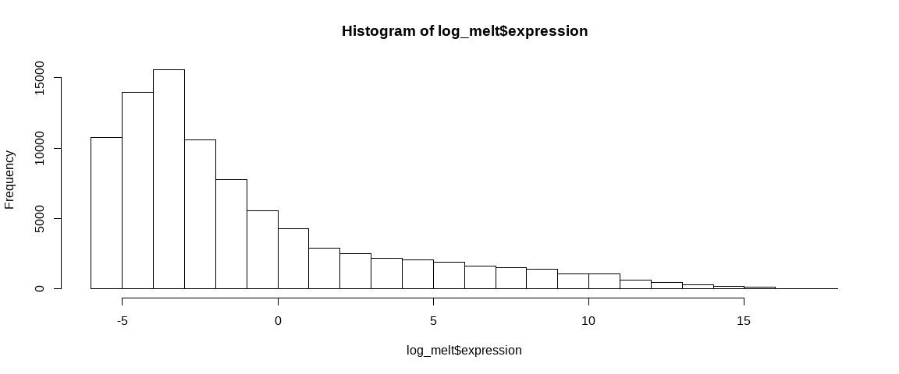<!-- -->

```r
log_melt %>% 
  ggplot(aes(expression, color = sample, fill = sample)) +
  geom_density(alpha = 0.1) + 
 # theme(legend.position = "bottom", legend.text = element_text(size = 17)) +
  theme(legend.position = c(.95, .95),legend.justification = c("right", "top")) +
  #guides(color = guide_legend(nrow = 2)) +
  labs(x = "Sample")
```

```
## Warning: Removed 778520 rows containing non-finite values (stat_density).
```

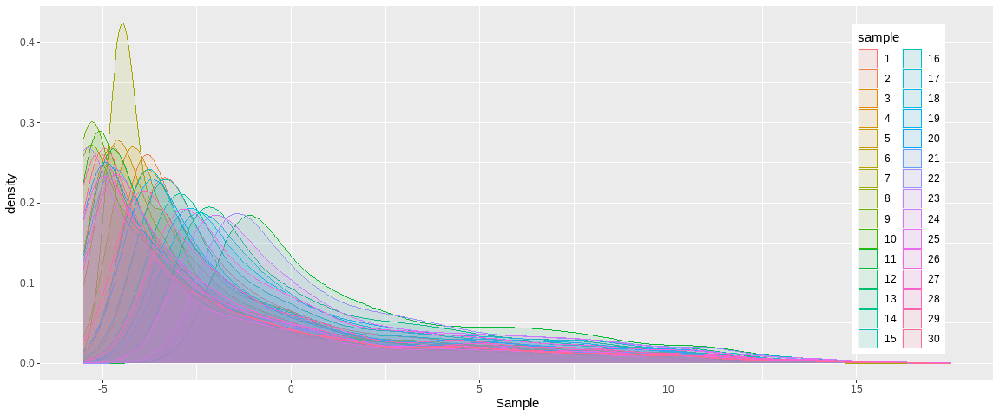<!-- -->

```r
log_melt %>%
  ggplot(aes(x = sample, y = expression, fill=sample)) +
  geom_boxplot() +
  theme(axis.text.x = element_text(angle = 90))
```

```
## Warning: Removed 778520 rows containing non-finite values (stat_boxplot).
```

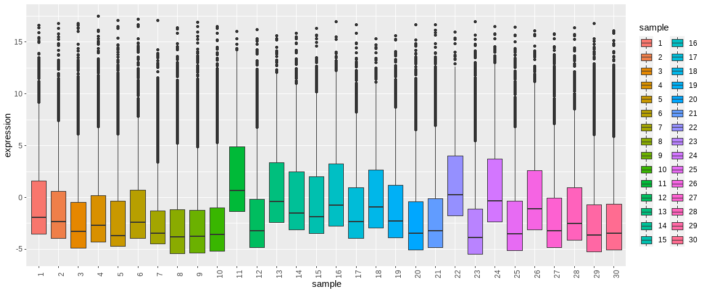<!-- -->

Now, when using the dataset containing all miRNA - the zeros get transformed to infinity and are hence not ploted. And it flags up **sample 11**. The boxplot shows that the majority of the expresion values hover around zero.  

***  

#### 2.2 Filtering  

Let's take a look at the original data again.  


```r
eDat [1:10,] %>% 
  kable() %>% 
  kable_styling(bootstrap_options = c("striped", "hover", "condensed"), full_width = F, fixed_thead = T)
```

<table class="table table-striped table-hover table-condensed" style="width: auto !important; margin-left: auto; margin-right: auto;">
 <thead>
  <tr>
   <th style="text-align:left;position: sticky; top:0; background-color: #FFFFFF;">   </th>
   <th style="text-align:right;position: sticky; top:0; background-color: #FFFFFF;"> MX1303-C5JC4ACXX-3-TAGGAT </th>
   <th style="text-align:right;position: sticky; top:0; background-color: #FFFFFF;"> MX1304-C5JC4ACXX-4-CCGGTG </th>
   <th style="text-align:right;position: sticky; top:0; background-color: #FFFFFF;"> MX1305-C5JC4ACXX-5-TGTTGG </th>
   <th style="text-align:right;position: sticky; top:0; background-color: #FFFFFF;"> MX1306-C5JC4ACXX-6-GTATAG </th>
   <th style="text-align:right;position: sticky; top:0; background-color: #FFFFFF;"> MX1307-C5JC4ACXX-7-AGCATC </th>
   <th style="text-align:right;position: sticky; top:0; background-color: #FFFFFF;"> MX1307-C5JC4ACXX-7-CAGGCC </th>
   <th style="text-align:right;position: sticky; top:0; background-color: #FFFFFF;"> MX1310-C5JC1ACXX-4-CTCTAC </th>
   <th style="text-align:right;position: sticky; top:0; background-color: #FFFFFF;"> MX1310-C5JC1ACXX-4-GGAACT </th>
   <th style="text-align:right;position: sticky; top:0; background-color: #FFFFFF;"> MX1310-C5JC1ACXX-4-GGACGG </th>
   <th style="text-align:right;position: sticky; top:0; background-color: #FFFFFF;"> MX1310-C5JC1ACXX-4-TGACAT </th>
   <th style="text-align:right;position: sticky; top:0; background-color: #FFFFFF;"> MX1355-C6RGTANXX-2-AAGCTA </th>
   <th style="text-align:right;position: sticky; top:0; background-color: #FFFFFF;"> MX1355-C6RGTANXX-2-ACATCG </th>
   <th style="text-align:right;position: sticky; top:0; background-color: #FFFFFF;"> MX1355-C6RGTANXX-2-CAAGTT </th>
   <th style="text-align:right;position: sticky; top:0; background-color: #FFFFFF;"> MX1355-C6RGTANXX-2-CATTCA </th>
   <th style="text-align:right;position: sticky; top:0; background-color: #FFFFFF;"> MX1355-C6RGTANXX-2-GGAACT </th>
   <th style="text-align:right;position: sticky; top:0; background-color: #FFFFFF;"> MX1356-C6RGTANXX-3-ATGGCA </th>
   <th style="text-align:right;position: sticky; top:0; background-color: #FFFFFF;"> MX1356-C6RGTANXX-3-CCTTGC </th>
   <th style="text-align:right;position: sticky; top:0; background-color: #FFFFFF;"> MX1356-C6RGTANXX-3-CGGCCT </th>
   <th style="text-align:right;position: sticky; top:0; background-color: #FFFFFF;"> MX1356-C6RGTANXX-3-GCGTGG </th>
   <th style="text-align:right;position: sticky; top:0; background-color: #FFFFFF;"> MX1356-C6RGTANXX-3-GCTGTA </th>
   <th style="text-align:right;position: sticky; top:0; background-color: #FFFFFF;"> MX1356-C6RGTANXX-3-GTATAG </th>
   <th style="text-align:right;position: sticky; top:0; background-color: #FFFFFF;"> MX1356-C6RGTANXX-3-TAGTTG </th>
   <th style="text-align:right;position: sticky; top:0; background-color: #FFFFFF;"> MX1356-C6RGTANXX-3-TGACAT </th>
   <th style="text-align:right;position: sticky; top:0; background-color: #FFFFFF;"> MX1357-C6RGTANXX-4-AATTAT </th>
   <th style="text-align:right;position: sticky; top:0; background-color: #FFFFFF;"> MX1357-C6RGTANXX-4-AGTCTT </th>
   <th style="text-align:right;position: sticky; top:0; background-color: #FFFFFF;"> MX1357-C6RGTANXX-4-CATGGG </th>
   <th style="text-align:right;position: sticky; top:0; background-color: #FFFFFF;"> MX1357-C6RGTANXX-4-GCCTAA </th>
   <th style="text-align:right;position: sticky; top:0; background-color: #FFFFFF;"> MX1357-C6RGTANXX-4-GTAGCC </th>
   <th style="text-align:right;position: sticky; top:0; background-color: #FFFFFF;"> MX1357-C6RGTANXX-4-TATCGT </th>
   <th style="text-align:right;position: sticky; top:0; background-color: #FFFFFF;"> MX1357-C6RGTANXX-4-TCTGAG </th>
  </tr>
 </thead>
<tbody>
  <tr>
   <td style="text-align:left;"> pred-nov-miR-1-3p </td>
   <td style="text-align:right;"> 0.000 </td>
   <td style="text-align:right;"> 0.0000 </td>
   <td style="text-align:right;"> 0.0000000 </td>
   <td style="text-align:right;"> 0.00000 </td>
   <td style="text-align:right;"> 0.00000 </td>
   <td style="text-align:right;"> 0.00000 </td>
   <td style="text-align:right;"> 0.0000000 </td>
   <td style="text-align:right;"> 0.0000000 </td>
   <td style="text-align:right;"> 0.0000000 </td>
   <td style="text-align:right;"> 0.0000000 </td>
   <td style="text-align:right;"> 0.0000 </td>
   <td style="text-align:right;"> 0.0000000 </td>
   <td style="text-align:right;"> 0.0000 </td>
   <td style="text-align:right;"> 0.00000 </td>
   <td style="text-align:right;"> 0.000000 </td>
   <td style="text-align:right;"> 0.00000 </td>
   <td style="text-align:right;"> 0.00000 </td>
   <td style="text-align:right;"> 0.00000 </td>
   <td style="text-align:right;"> 0.00000 </td>
   <td style="text-align:right;"> 0.00000 </td>
   <td style="text-align:right;"> 0.00000 </td>
   <td style="text-align:right;"> 0.00000 </td>
   <td style="text-align:right;"> 0.00000 </td>
   <td style="text-align:right;"> 0.000000 </td>
   <td style="text-align:right;"> 0.000000 </td>
   <td style="text-align:right;"> 0.00000 </td>
   <td style="text-align:right;"> 0.000000 </td>
   <td style="text-align:right;"> 0.00000 </td>
   <td style="text-align:right;"> 0.000000 </td>
   <td style="text-align:right;"> 0.0000000 </td>
  </tr>
  <tr>
   <td style="text-align:left;"> pred-nov-miR-1-5p </td>
   <td style="text-align:right;"> 0.000 </td>
   <td style="text-align:right;"> 0.0000 </td>
   <td style="text-align:right;"> 0.0000000 </td>
   <td style="text-align:right;"> 0.00000 </td>
   <td style="text-align:right;"> 0.00000 </td>
   <td style="text-align:right;"> 0.00000 </td>
   <td style="text-align:right;"> 0.0446818 </td>
   <td style="text-align:right;"> 0.0000000 </td>
   <td style="text-align:right;"> 0.0000000 </td>
   <td style="text-align:right;"> 0.0000000 </td>
   <td style="text-align:right;"> 0.0000 </td>
   <td style="text-align:right;"> 0.0000000 </td>
   <td style="text-align:right;"> 0.0000 </td>
   <td style="text-align:right;"> 0.00000 </td>
   <td style="text-align:right;"> 0.000000 </td>
   <td style="text-align:right;"> 0.00000 </td>
   <td style="text-align:right;"> 0.00000 </td>
   <td style="text-align:right;"> 0.00000 </td>
   <td style="text-align:right;"> 0.00000 </td>
   <td style="text-align:right;"> 0.00000 </td>
   <td style="text-align:right;"> 0.00000 </td>
   <td style="text-align:right;"> 0.00000 </td>
   <td style="text-align:right;"> 0.00000 </td>
   <td style="text-align:right;"> 0.000000 </td>
   <td style="text-align:right;"> 0.000000 </td>
   <td style="text-align:right;"> 0.00000 </td>
   <td style="text-align:right;"> 0.000000 </td>
   <td style="text-align:right;"> 0.00000 </td>
   <td style="text-align:right;"> 0.000000 </td>
   <td style="text-align:right;"> 0.0000000 </td>
  </tr>
  <tr>
   <td style="text-align:left;"> pred-nov-miR-10-3p </td>
   <td style="text-align:right;"> 0.000 </td>
   <td style="text-align:right;"> 0.0000 </td>
   <td style="text-align:right;"> 0.0000000 </td>
   <td style="text-align:right;"> 0.00000 </td>
   <td style="text-align:right;"> 0.00000 </td>
   <td style="text-align:right;"> 0.00000 </td>
   <td style="text-align:right;"> 0.0000000 </td>
   <td style="text-align:right;"> 0.0000000 </td>
   <td style="text-align:right;"> 0.0000000 </td>
   <td style="text-align:right;"> 0.0000000 </td>
   <td style="text-align:right;"> 0.0000 </td>
   <td style="text-align:right;"> 0.0000000 </td>
   <td style="text-align:right;"> 0.0000 </td>
   <td style="text-align:right;"> 0.00000 </td>
   <td style="text-align:right;"> 0.000000 </td>
   <td style="text-align:right;"> 0.00000 </td>
   <td style="text-align:right;"> 0.00000 </td>
   <td style="text-align:right;"> 0.00000 </td>
   <td style="text-align:right;"> 0.00000 </td>
   <td style="text-align:right;"> 0.00000 </td>
   <td style="text-align:right;"> 0.00000 </td>
   <td style="text-align:right;"> 0.00000 </td>
   <td style="text-align:right;"> 0.00000 </td>
   <td style="text-align:right;"> 0.000000 </td>
   <td style="text-align:right;"> 0.000000 </td>
   <td style="text-align:right;"> 0.00000 </td>
   <td style="text-align:right;"> 0.000000 </td>
   <td style="text-align:right;"> 0.00000 </td>
   <td style="text-align:right;"> 0.000000 </td>
   <td style="text-align:right;"> 0.0000000 </td>
  </tr>
  <tr>
   <td style="text-align:left;"> pred-nov-miR-10-5p </td>
   <td style="text-align:right;"> 0.000 </td>
   <td style="text-align:right;"> 0.0000 </td>
   <td style="text-align:right;"> 0.0000000 </td>
   <td style="text-align:right;"> 0.00000 </td>
   <td style="text-align:right;"> 0.00000 </td>
   <td style="text-align:right;"> 0.00000 </td>
   <td style="text-align:right;"> 0.0000000 </td>
   <td style="text-align:right;"> 0.0000000 </td>
   <td style="text-align:right;"> 0.0000000 </td>
   <td style="text-align:right;"> 0.0278464 </td>
   <td style="text-align:right;"> 0.0000 </td>
   <td style="text-align:right;"> 0.0351363 </td>
   <td style="text-align:right;"> 0.0000 </td>
   <td style="text-align:right;"> 0.00000 </td>
   <td style="text-align:right;"> 0.358626 </td>
   <td style="text-align:right;"> 0.00000 </td>
   <td style="text-align:right;"> 0.00000 </td>
   <td style="text-align:right;"> 0.00000 </td>
   <td style="text-align:right;"> 0.00000 </td>
   <td style="text-align:right;"> 0.00000 </td>
   <td style="text-align:right;"> 0.00000 </td>
   <td style="text-align:right;"> 0.00000 </td>
   <td style="text-align:right;"> 0.00000 </td>
   <td style="text-align:right;"> 0.000000 </td>
   <td style="text-align:right;"> 0.000000 </td>
   <td style="text-align:right;"> 0.00000 </td>
   <td style="text-align:right;"> 0.000000 </td>
   <td style="text-align:right;"> 0.00000 </td>
   <td style="text-align:right;"> 0.000000 </td>
   <td style="text-align:right;"> 0.0000000 </td>
  </tr>
  <tr>
   <td style="text-align:left;"> pred-nov-miR-100-3p </td>
   <td style="text-align:right;"> 13.326 </td>
   <td style="text-align:right;"> 11.0743 </td>
   <td style="text-align:right;"> 11.1696000 </td>
   <td style="text-align:right;"> 2.17491 </td>
   <td style="text-align:right;"> 9.75422 </td>
   <td style="text-align:right;"> 9.69444 </td>
   <td style="text-align:right;"> 2.1000400 </td>
   <td style="text-align:right;"> 1.1841100 </td>
   <td style="text-align:right;"> 1.9690600 </td>
   <td style="text-align:right;"> 2.5897100 </td>
   <td style="text-align:right;"> 14.7591 </td>
   <td style="text-align:right;"> 17.7087000 </td>
   <td style="text-align:right;"> 16.0586 </td>
   <td style="text-align:right;"> 9.87625 </td>
   <td style="text-align:right;"> 12.820900 </td>
   <td style="text-align:right;"> 1.16608 </td>
   <td style="text-align:right;"> 3.23503 </td>
   <td style="text-align:right;"> 2.18514 </td>
   <td style="text-align:right;"> 1.76956 </td>
   <td style="text-align:right;"> 1.02064 </td>
   <td style="text-align:right;"> 2.78638 </td>
   <td style="text-align:right;"> 1.47701 </td>
   <td style="text-align:right;"> 1.35319 </td>
   <td style="text-align:right;"> 0.784297 </td>
   <td style="text-align:right;"> 0.920331 </td>
   <td style="text-align:right;"> 1.05517 </td>
   <td style="text-align:right;"> 0.890919 </td>
   <td style="text-align:right;"> 2.23989 </td>
   <td style="text-align:right;"> 0.719346 </td>
   <td style="text-align:right;"> 1.9978400 </td>
  </tr>
  <tr>
   <td style="text-align:left;"> pred-nov-miR-100-5p </td>
   <td style="text-align:right;"> 0.000 </td>
   <td style="text-align:right;"> 0.0000 </td>
   <td style="text-align:right;"> 0.0000000 </td>
   <td style="text-align:right;"> 0.00000 </td>
   <td style="text-align:right;"> 0.00000 </td>
   <td style="text-align:right;"> 0.00000 </td>
   <td style="text-align:right;"> 0.0000000 </td>
   <td style="text-align:right;"> 0.0000000 </td>
   <td style="text-align:right;"> 0.0246132 </td>
   <td style="text-align:right;"> 0.0000000 </td>
   <td style="text-align:right;"> 0.0000 </td>
   <td style="text-align:right;"> 0.0000000 </td>
   <td style="text-align:right;"> 0.0000 </td>
   <td style="text-align:right;"> 0.00000 </td>
   <td style="text-align:right;"> 0.000000 </td>
   <td style="text-align:right;"> 0.00000 </td>
   <td style="text-align:right;"> 0.00000 </td>
   <td style="text-align:right;"> 0.00000 </td>
   <td style="text-align:right;"> 0.00000 </td>
   <td style="text-align:right;"> 0.00000 </td>
   <td style="text-align:right;"> 0.00000 </td>
   <td style="text-align:right;"> 0.00000 </td>
   <td style="text-align:right;"> 0.00000 </td>
   <td style="text-align:right;"> 0.000000 </td>
   <td style="text-align:right;"> 0.000000 </td>
   <td style="text-align:right;"> 0.00000 </td>
   <td style="text-align:right;"> 0.000000 </td>
   <td style="text-align:right;"> 0.00000 </td>
   <td style="text-align:right;"> 0.000000 </td>
   <td style="text-align:right;"> 0.0000000 </td>
  </tr>
  <tr>
   <td style="text-align:left;"> pred-nov-miR-1000-3p </td>
   <td style="text-align:right;"> 0.000 </td>
   <td style="text-align:right;"> 0.0000 </td>
   <td style="text-align:right;"> 0.0000000 </td>
   <td style="text-align:right;"> 0.00000 </td>
   <td style="text-align:right;"> 0.00000 </td>
   <td style="text-align:right;"> 0.00000 </td>
   <td style="text-align:right;"> 0.0000000 </td>
   <td style="text-align:right;"> 0.0000000 </td>
   <td style="text-align:right;"> 0.0000000 </td>
   <td style="text-align:right;"> 0.0000000 </td>
   <td style="text-align:right;"> 0.0000 </td>
   <td style="text-align:right;"> 0.0000000 </td>
   <td style="text-align:right;"> 0.0000 </td>
   <td style="text-align:right;"> 0.00000 </td>
   <td style="text-align:right;"> 0.000000 </td>
   <td style="text-align:right;"> 0.00000 </td>
   <td style="text-align:right;"> 0.00000 </td>
   <td style="text-align:right;"> 0.00000 </td>
   <td style="text-align:right;"> 0.00000 </td>
   <td style="text-align:right;"> 0.00000 </td>
   <td style="text-align:right;"> 0.00000 </td>
   <td style="text-align:right;"> 0.00000 </td>
   <td style="text-align:right;"> 0.00000 </td>
   <td style="text-align:right;"> 0.000000 </td>
   <td style="text-align:right;"> 0.000000 </td>
   <td style="text-align:right;"> 0.00000 </td>
   <td style="text-align:right;"> 0.000000 </td>
   <td style="text-align:right;"> 0.00000 </td>
   <td style="text-align:right;"> 0.000000 </td>
   <td style="text-align:right;"> 0.0000000 </td>
  </tr>
  <tr>
   <td style="text-align:left;"> pred-nov-miR-1000-5p </td>
   <td style="text-align:right;"> 0.000 </td>
   <td style="text-align:right;"> 0.0000 </td>
   <td style="text-align:right;"> 0.0000000 </td>
   <td style="text-align:right;"> 0.00000 </td>
   <td style="text-align:right;"> 0.00000 </td>
   <td style="text-align:right;"> 0.00000 </td>
   <td style="text-align:right;"> 0.0000000 </td>
   <td style="text-align:right;"> 0.0236821 </td>
   <td style="text-align:right;"> 0.0000000 </td>
   <td style="text-align:right;"> 0.0278464 </td>
   <td style="text-align:right;"> 0.0000 </td>
   <td style="text-align:right;"> 0.0000000 </td>
   <td style="text-align:right;"> 0.0000 </td>
   <td style="text-align:right;"> 0.00000 </td>
   <td style="text-align:right;"> 0.000000 </td>
   <td style="text-align:right;"> 0.00000 </td>
   <td style="text-align:right;"> 0.00000 </td>
   <td style="text-align:right;"> 0.00000 </td>
   <td style="text-align:right;"> 0.00000 </td>
   <td style="text-align:right;"> 0.00000 </td>
   <td style="text-align:right;"> 0.00000 </td>
   <td style="text-align:right;"> 0.00000 </td>
   <td style="text-align:right;"> 0.00000 </td>
   <td style="text-align:right;"> 0.000000 </td>
   <td style="text-align:right;"> 0.000000 </td>
   <td style="text-align:right;"> 0.00000 </td>
   <td style="text-align:right;"> 0.000000 </td>
   <td style="text-align:right;"> 0.00000 </td>
   <td style="text-align:right;"> 0.000000 </td>
   <td style="text-align:right;"> 0.0298185 </td>
  </tr>
  <tr>
   <td style="text-align:left;"> pred-nov-miR-10000-3p </td>
   <td style="text-align:right;"> 0.000 </td>
   <td style="text-align:right;"> 0.0000 </td>
   <td style="text-align:right;"> 0.0000000 </td>
   <td style="text-align:right;"> 0.00000 </td>
   <td style="text-align:right;"> 0.00000 </td>
   <td style="text-align:right;"> 0.00000 </td>
   <td style="text-align:right;"> 0.0000000 </td>
   <td style="text-align:right;"> 0.0000000 </td>
   <td style="text-align:right;"> 0.0000000 </td>
   <td style="text-align:right;"> 0.0000000 </td>
   <td style="text-align:right;"> 0.0000 </td>
   <td style="text-align:right;"> 0.0000000 </td>
   <td style="text-align:right;"> 0.0000 </td>
   <td style="text-align:right;"> 0.00000 </td>
   <td style="text-align:right;"> 0.000000 </td>
   <td style="text-align:right;"> 0.00000 </td>
   <td style="text-align:right;"> 0.00000 </td>
   <td style="text-align:right;"> 0.00000 </td>
   <td style="text-align:right;"> 0.00000 </td>
   <td style="text-align:right;"> 0.00000 </td>
   <td style="text-align:right;"> 0.00000 </td>
   <td style="text-align:right;"> 0.00000 </td>
   <td style="text-align:right;"> 0.00000 </td>
   <td style="text-align:right;"> 0.000000 </td>
   <td style="text-align:right;"> 0.000000 </td>
   <td style="text-align:right;"> 0.00000 </td>
   <td style="text-align:right;"> 0.000000 </td>
   <td style="text-align:right;"> 0.00000 </td>
   <td style="text-align:right;"> 0.000000 </td>
   <td style="text-align:right;"> 0.0000000 </td>
  </tr>
  <tr>
   <td style="text-align:left;"> pred-nov-miR-10000-5p </td>
   <td style="text-align:right;"> 0.000 </td>
   <td style="text-align:right;"> 0.0000 </td>
   <td style="text-align:right;"> 0.0342626 </td>
   <td style="text-align:right;"> 0.00000 </td>
   <td style="text-align:right;"> 0.00000 </td>
   <td style="text-align:right;"> 0.00000 </td>
   <td style="text-align:right;"> 0.0000000 </td>
   <td style="text-align:right;"> 0.0000000 </td>
   <td style="text-align:right;"> 0.0000000 </td>
   <td style="text-align:right;"> 0.0000000 </td>
   <td style="text-align:right;"> 0.0000 </td>
   <td style="text-align:right;"> 0.0000000 </td>
   <td style="text-align:right;"> 0.0000 </td>
   <td style="text-align:right;"> 0.00000 </td>
   <td style="text-align:right;"> 0.000000 </td>
   <td style="text-align:right;"> 0.00000 </td>
   <td style="text-align:right;"> 0.00000 </td>
   <td style="text-align:right;"> 0.00000 </td>
   <td style="text-align:right;"> 0.00000 </td>
   <td style="text-align:right;"> 0.00000 </td>
   <td style="text-align:right;"> 0.00000 </td>
   <td style="text-align:right;"> 0.00000 </td>
   <td style="text-align:right;"> 0.00000 </td>
   <td style="text-align:right;"> 0.000000 </td>
   <td style="text-align:right;"> 0.000000 </td>
   <td style="text-align:right;"> 0.00000 </td>
   <td style="text-align:right;"> 0.000000 </td>
   <td style="text-align:right;"> 0.00000 </td>
   <td style="text-align:right;"> 0.000000 </td>
   <td style="text-align:right;"> 0.0000000 </td>
  </tr>
</tbody>
</table>

Right away we can see that even for the 10 miRNAs displayed, there are some which have 0 expression across all samples. Further analysis results would be more significant if these miRNAs were removed.  


```r
eDat_exp <- eDat %>% 
  rownames_to_column(var = "mirna") %>% 
  filter_at(vars(-mirna), any_vars(. != 0)) %>% 
  column_to_rownames(var = "mirna")

dim (eDat_exp) #13038
```

```
## [1] 13038    30
```

That removed 15860 miRNAs.  

We can also further filter by:  

1. By number of counts in the samples  
2. By expression in a percentage of samples 
  

1. Applying the concept of keeping miRNAs present in at least as many samples as the smallest group size. Grouping by the variables we want to further analyse by:


```r
table <- sum_stats[1:3] 
ftable(table)
```

```
##                     sex FEMALE MALE
## condition trimester                
## con       1                  3    2
##           2                  7    3
##           3                  4    5
## NTD       1                  0    0
##           2                  3    3
##           3                  0    0
```

Here, the group containing the least number of samples is **2** - there are 2 male control samples in trimester 1.  

a. By summing the counts across the rows and filtering by counts of 2 or more:  


```r
fil_1 <- eDat_exp %>% 
  mutate(sum = rowSums(.)) %>% 
  filter(sum >=2) %>% 
  dplyr::arrange(sum) %>% 
  dplyr::select(-sum)

dim(fil_1) #1976
```

```
## [1] 1976   30
```

In this case however for example, there can be miRNAs with a count of 0.02 in 1 sample, and a count of 4 in another sample, which would give us a sum of more than 2 at the end. To address this, we can further filter out any miRNAs which have reads of less than 1 in any of the samples, and then apply the same step as above.  


```r
fil_2 <- eDat_exp %>% 
  rownames_to_column("miRNA") %>% 
  filter_if(is.numeric, all_vars(. > 1)) %>% 
  mutate(sum = rowSums(.[2:31])) %>% 
  filter(sum >= 2) %>% 
  dplyr::arrange(sum) %>% 
  dplyr::select(-sum) %>% 
  column_to_rownames("miRNA")

dim(fil_2) #557
```

```
## [1] 557  30
```

b. Keeping miRNAS having reads > 0 in at least 2 samples.  


```r
fil_3 <- eDat_exp[rowSums(eDat_exp > 0) >= 2, ]

dim(fil_3)
```

```
## [1] 8025   30
```

2. Keeping only miRNAS having reads in atleast 30% of the samples i.e. in atleast 9 samples.  


```r
fil_4 <- eDat_exp[rowSums(eDat_exp > 0) >= 9, ] #counts of more than zero in 3 or more samples

dim(fil_4)
```

```
## [1] 3121   30
```


**Performing the same graphing for the filtered datasets**:


```r
log_fil1 <- log2(fil_1)
names <- as.character(1:30)
colnames(log_fil1) <- names
rm(names)
log_fil1_melt <- melt(log_fil1)
```

```
## No id variables; using all as measure variables
```

```r
colnames (log_fil1_melt) <- c("sample", "expression") 

d2 <- log_fil1_melt %>% 
    ggplot(aes(expression, color = sample)) +
    geom_density() + 
  theme_light() +
    #theme(legend.position = "bottom", legend.text = element_text(size = 17)) +
    theme(legend.position = c(.95, .95),legend.justification = c("right", "top"), 
          plot.title = element_text(face = "plain", hjust = 0.5, colour = "#333333"), 
          plot.subtitle =element_text("plain", hjust = 0.5, colour = "#333333")) +
    #guides(color = guide_legend(nrow = 2)) +
    scale_x_continuous(expand = c(0, 0)) + 
    scale_y_continuous(expand = c(0, 0)) +
    coord_cartesian(y = c(0, 0.45)) +
    labs(x = "Log2 Expression", title = "miRNAs with Expression >= 2 across all samples", subtitle = "1976 miRNAs")  

b2 <- log_fil1_melt %>% 
  ggplot(aes(x = sample, y = expression, fill=sample)) +
  geom_boxplot() +
  theme_minimal() +
  theme(legend.position = "none", axis.text.x = element_text(angle = 90))
```


```r
log_fil_2 <- log2(fil_2)
names <- as.character(1:30)
colnames(log_fil_2) <- names
rm(names)
log_fil_2_melt <- melt(log_fil_2)
```

```
## No id variables; using all as measure variables
```

```r
colnames (log_fil_2_melt) <- c("sample", "expression") 

d3 <- log_fil_2_melt %>% 
    ggplot(aes(expression, color = sample)) +
    geom_density() + 
  theme_light() +
    #theme(legend.position = "bottom", legend.text = element_text(size = 17)) +
    theme(legend.position = c(.95, .95),legend.justification = c("right", "top"), 
          plot.title = element_text(face = "plain", hjust = 0.5, colour = "#333333"), 
          plot.subtitle = element_text("plain", hjust = 0.5, colour = "#333333")) +
    #guides(color = guide_legend(nrow = 2)) +
    scale_x_continuous(expand = c(0, 0)) + 
    scale_y_continuous(expand = c(0, 0)) +
    coord_cartesian(y = c(0, 0.45)) +
    labs(x = "Log2 Expression", title = "miRNAs with Expression > 1 in >= 2 samples", subtitle = "557 miRNAs")  

b3 <- log_fil_2_melt %>%
  ggplot(aes(x = sample, y = expression, fill=sample)) +
  geom_boxplot() +
  theme_minimal() +
  theme(legend.position = "none", axis.text.x = element_text(angle = 90))
```


```r
log_fil_3 <- log2(fil_3)
names <- as.character(1:30)
colnames(log_fil_3) <- names
rm(names)
log_fil_3_melt <- melt(log_fil_3)
```

```
## No id variables; using all as measure variables
```

```r
colnames (log_fil_3_melt) <- c("sample", "expression") 

d4 <- log_fil_3_melt %>% 
    ggplot(aes(expression, color = sample)) +
    geom_density() + 
  theme_light() +
    #theme(legend.position = "bottom", legend.text = element_text(size = 17)) +
    theme(legend.position = c(.95, .95),legend.justification = c("right", "top"), 
          plot.title = element_text(face = "plain", hjust = 0.5, colour = "#333333"), 
          plot.subtitle = element_text("plain", hjust = 0.5, colour = "#333333")) +
    #guides(color = guide_legend(nrow = 2)) +
    scale_x_continuous(expand = c(0, 0)) + 
    scale_y_continuous(expand = c(0, 0)) +
    coord_cartesian(y = c(0, 0.45)) +
    labs(x = "Log2 Expression", title = "miRNAs with Expression > 0 in >= 2 samples", subtitle = "8025 miRNAs")  

b4 <- log_fil_3_melt %>%
  ggplot(aes(x = sample, y = expression, fill=sample)) +
  geom_boxplot() +
  theme_minimal() +
  theme(legend.position = "none", axis.text.x = element_text(angle = 90))
```


```r
log_fil_4 <- log2(fil_4)
names <- as.character(1:30)
colnames(log_fil_4) <- names
rm(names)
log_fil_4_melt <- melt(log_fil_4)
```

```
## No id variables; using all as measure variables
```

```r
colnames (log_fil_4_melt) <- c("sample", "expression") 

d5 <- log_fil_4_melt %>% 
    ggplot(aes(expression, color = sample)) +
    geom_density() + 
  theme_light() +
    #theme(legend.position = "bottom", legend.text = element_text(size = 17)) +
    theme(legend.position = c(.95, .95),legend.justification = c("right", "top"), 
          plot.title = element_text(face = "plain", hjust = 0.5, colour = "#333333"), 
          plot.subtitle = element_text("plain", hjust = 0.5, colour = "#333333")) +
    #guides(color = guide_legend(nrow = 2)) +
    scale_x_continuous(expand = c(0, 0)) + 
    scale_y_continuous(expand = c(0, 0)) +
    coord_cartesian(y = c(0, 0.45)) +
    labs(x = "Log2 Expression", title = "miRNAs with Expression > 0 in atleast 30% (9) samples", subtitle = "3121 miRNAs")  

b5 <- log_fil_4_melt %>%
  ggplot(aes(x = sample, y = expression, fill=sample)) +
  geom_boxplot() +
  theme_minimal() +
  theme(legend.position = "none", axis.text.x = element_text(angle = 90))
```


```r
egg::ggarrange(d1, b1, d2, b2, d3, b3, d4, b4, d5, b5, nrow = 5, widths = c(0.75,1))
```

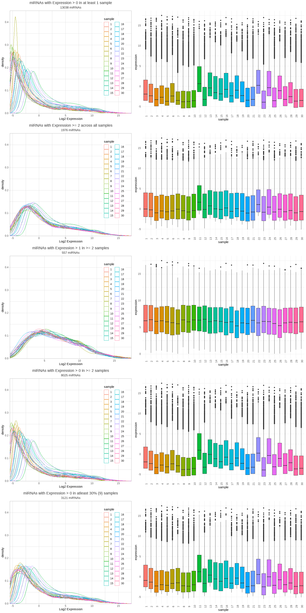<!-- -->

From the above, it's clear that the last plot shows the best spread of the data after filtering (RPM > 1 for all miRNA, with RPM >=2 in all samples). This is the data I'll be proceeding with.  

***  

#### 2.3 Normalisation  

**The data has already been scaled by Reads Per Million (RPM)**  

But since the miRNA sequences have been further filtered, I'm going to model how different normalisations behave, and see see which performs best.  

A little about the different methods:  
  
+ Quantile, Logx, Upper Quartile are *purely mathematical non-biological* approaches.    
+ TPM and RPKM are *biological transformations based on transcript size*.  
+ TMM and RLE (and MRN which is built on combining TMM and RLE) use a *combination of both biologically and mathematically* based approaches.  


Biological Normalisation Methods  

| Within-sample | Between-sample |  
|-|-|  
| RPM/CPM | TMM |  
| RPKM/FPKM | RLE |  
| TPM | MRN |  

**Quantile**


```r
eFil <- fil_2

#summary(eFil)

q_norm <- eFil %>% 
  as.matrix() %>% 
  normalize.quantiles #library(preprocessCore)

#summary(q_norm)

q_norm <- cpm(q_norm) #scaling by CPM

#q_norm %>% 
#  as.data.frame() %>% 
#  dplyr::filter(q_norm > quantile(q_norm, 0.25), 
#                q_norm < quantile(q_norm, 0.75))

qnorm_melt <-  melt(q_norm)

n1 <- qnorm_melt %>% 
  ggplot(aes(x = log10(value), colour = factor(Var2))) +
  geom_density() +
  theme(legend.position = "none") +
  labs(title = "Quantile Normalisation", x = "", y = "") +
  coord_cartesian(x = c(0,5), y = c(0, 0.5))
```

Making an `edgeR` package compatible object to carry out the further analyses -  


```r
fil_miRNA <- as.data.frame(row.names(eFil))

norm3 <- DGEList(counts = eFil, samples = pDat, genes = fil_miRNA)
```

**TMM**  


```r
dge <- calcNormFactors(norm3, method = "TMM") 

tmm <- cpm(dge)

tmm_melt <- melt(tmm)
n2 <- tmm_melt %>% 
  ggplot(aes(x = log10(value), colour = factor(Var2))) +
  geom_density() +
  theme(legend.position = "none") +
  labs(title = "TMM Normalisation", x = "", y = "") +
  coord_cartesian(x = c(0,5), y = c(0, 0.5))
```

**RLE** 


```r
dge2 <- calcNormFactors(norm3, method = "RLE") 

rle <- cpm(dge2)

rle_melt <- melt(rle)
n3 <- rle_melt %>% 
  ggplot(aes(x = log10(value), colour = factor(Var2))) +
  geom_density() +
  theme(legend.position = "none") +
  labs(title = "RLE Normalisation", x = "", y = "") +
  coord_cartesian(x = c(0,5), y = c(0, 0.5))
```

**Upper Quartile**  


```r
dge3 <- calcNormFactors(norm3, method="upperquartile", p = 0.5)  

upq <- cpm(dge3)

upq_melt <- melt(upq)
n4 <- upq_melt %>% 
  ggplot(aes(x = log10(value), colour = factor(Var2))) +
  geom_density() +
  theme(legend.position = "none") +
  labs(title = "Upper Quartile Normalisation", x = "", y = "") +
  coord_cartesian(x = c(0,5), y = c(0, 0.5))
```

***  

##### 2.3.1 Comparison of Different Normalisation Methods  
  

```r
#reposition_legend(n4 + theme(legend.position='bottom'), 'bottom left')

ggarrange(n1, n2, n3, n4, 
          labels = c("A", "B", "C", "D"), 
          common.legend = TRUE, legend = "none") %>% 
  annotate_figure(bottom = text_grob("log10 Values", size = 15, vjust = -1, color = "#4d4d4d"),
                  left = text_grob("Density", size = 15, rot = 90, color = "#4d4d4d"),
                  top = text_grob("CPM Transformed", size = 15, face = "bold", color = "#4d4d4d"))
```

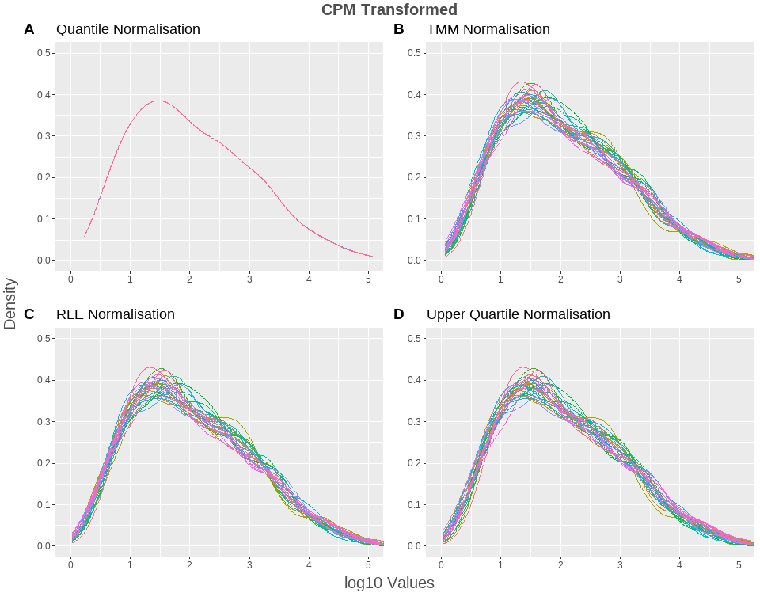<!-- -->

Observing the difference in the normalised counts for a random miRNA *pred-nov-miR-13819-3p* now (**Adding in the original expression value of the miRNA**):    


```r
norm_counts <- tmm[1, ]
norm_counts <- as.data.frame(norm_counts)
colnames (norm_counts) [1] <- "TMM"
norm_counts$RLE <- rle[1,]
norm_counts$UPQ <- upq[1,]
norm_counts$Quant <- q_norm[1,]
norm_counts$Trimester <- pDat$trimester

org_mirna <- eFil %>% 
  rownames_to_column("seq") %>% 
  filter(seq == "pred-nov-miR-13819-3p")
org_mirna <- t(org_mirna)
org_mirna <- as.data.frame(org_mirna[-1, ])
colnames(org_mirna) [1] <- "Original_Expression"
org_mirna <- org_mirna %>% 
  rownames_to_column("sam")
org_mirna$Original_Expression <- as.numeric(as.character(org_mirna$Original_Expression))

norm_counts_1 <-  norm_counts %>% 
  rownames_to_column("Sample") %>% 
  rowid_to_column("ID") %>%
  dplyr::arrange(Trimester) %>% 
  pivot_longer(cols = 3:6, names_to = "Method", values_to = "CPM")

norm_counts_2 <-  norm_counts %>% 
  rownames_to_column("Sample") %>% 
  inner_join(org_mirna, by = c("Sample" = "sam")) %>% 
  rowid_to_column("ID") %>%
  dplyr::arrange(Trimester) %>% 
  dplyr::select(ID, Sample,Trimester, everything()) %>% 
  pivot_longer(cols = 4:8, names_to = "Method", values_to = "CPM") %>% 
  mutate(Method = fct_relevel(Method, c("TMM", "RLE", "UPQ", "Quant", "Original_Expression"))) 
  #mutate(Original = ifelse(Method = "Original_Expression", )) ---> ????

#norm_counts <-  norm_counts

colpal1 <- c("#801361", "#c92f56", "#f76d39", "#ffb708")
colpal2 <- c("#0e00a6" , "#d50061", "#c6d42f", "#f2690a", "#8c8c8c")
cbPalette2 <- c("#000000", "#E69F00", "#56B4E9")


n5 <- norm_counts_1 %>% 
  ggplot(aes(x = factor(ID), y = CPM, colour = factor(Method))) + 
  geom_point(size = 2) +
 # scale_x_discrete(expand = c(3,3)) +
  theme_minimal() +
  scale_colour_manual(values = cbPalette, name = "Method") +
  theme(legend.position = "bottom") +
  labs(title = "Estimated CPM of pred-nov-miR-13819-3p by different normalisation methods", subtitle = "Including Quantile Normalisation") +
  labs(x = "Sample", y = "CPM")  

n6 <- norm_counts_1 %>% 
  ggplot(aes(x = factor(ID), y = CPM, colour = factor(Trimester))) + 
  geom_boxplot() +
 # scale_x_discrete(expand = c(3,3)) +
  theme_minimal() +
  scale_colour_manual(values = cbPalette2, name = "Trimester") +
  theme(legend.position = "bottom") +
 # labs(title = "Estimated CPM of pred-nov-miR-13819-3p by different normalisation methods", subtitle = "Box Plot") +
  labs(x = "Sample", y = "CPM")  

#taking out Quant

n7 <- norm_counts_1 %>% 
  filter(!Method == "Quant") %>% 
  ggplot(aes(x = factor(ID), y = CPM, colour = factor(Method))) + 
  geom_point(size = 2) +
 # scale_x_discrete(expand = c(3,3)) +
  theme_minimal() +
  scale_colour_manual(values = cbPalette, name = "Method") +
  theme(legend.position = "bottom") +
 labs(title = "Estimated CPM of pred-nov-miR-13819-3p by different normalisation methods", subtitle = "Not including Quantile Normalisation") +
  labs(x = "Sample", y = "CPM") 

n8 <- norm_counts_1 %>% 
  filter(!Method == "Quant") %>% 
  ggplot(aes(x = factor(ID), y = CPM, colour = factor(Trimester))) + 
  geom_boxplot() +
 # scale_x_discrete(expand = c(3,3)) +
  theme_minimal() +
  scale_colour_manual(values = cbPalette2, name = "Trimester") +
  theme(legend.position = "bottom") +
#  labs(title = "Estimated CPM of pred-nov-miR-13819-3p by different normalisation methods", subtitle = "Box Plot") +
  labs(x = "Sample", y = "CPM")  

n9 <- norm_counts_2 %>% 
  ggplot(aes(x = factor(ID), y = CPM, colour = factor(Method))) + 
  geom_point(size = 2) +
 # scale_x_discrete(expand = c(3,3)) +
  theme_minimal() +
  scale_colour_manual(values = cbPalette, name = "Method") +
  theme(legend.position = "bottom") +
  labs(title = "CPM of pred-nov-miR-13819-3p", subtitle = "") +
  labs(x = "Sample", y = "CPM")  

n9
```

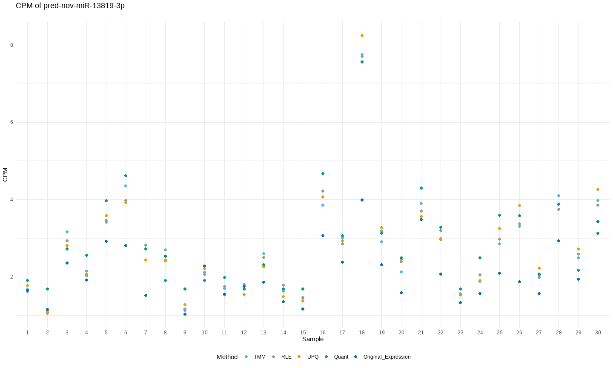<!-- -->

```r
egg::ggarrange(n5, n7, n6, n8, labels = c("a1", "b1", "a2", "b2"))
```

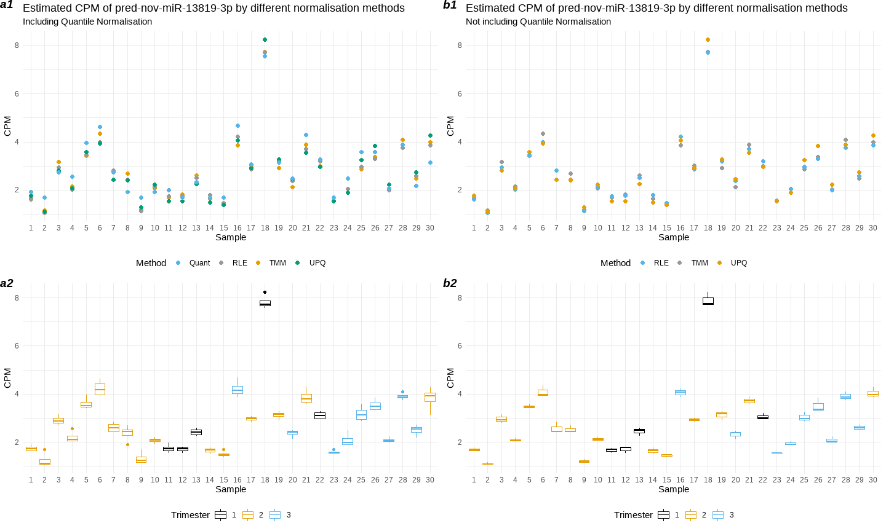<!-- -->


[Deciding on which normalisation method to use](https://www.ncbi.nlm.nih.gov/pmc/articles/PMC6171491/) is an important step which influences downstream analysis and results.  

**I'm going to go forward with the RLE method.**  

***  

#### 2.4 PCA 

Applying PCA to view which variables are driving variance:  

> WHICH DATASET TO USE FOR PCA? eDat or eDat_exp? Both


```r
eNorm <- fil_2

pDat <- pDat %>% 
  column_to_rownames(var = "sample")

t_eNorm <- as.data.frame(t(eNorm))

pca <- prcomp_irlba(t_eNorm, n = 20)
```

```
## Warning in (function (A, nv = 5, nu = nv, maxit = 1000, work = nv + 7, reorth =
## TRUE, : You're computing too large a percentage of total singular values, use a
## standard svd instead.
```

```r
plot(pca)
```

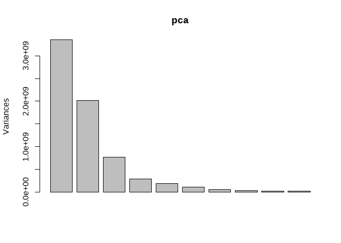<!-- -->

```r
summary(pca)
```

```
## Importance of components:
##                              PC1       PC2       PC3       PC4       PC5
## Standard deviation     5.792e+04 4.497e+04 2.775e+04 1.689e+04 1.369e+04
## Proportion of Variance 4.869e-01 2.935e-01 1.118e-01 4.140e-02 2.719e-02
## Cumulative Proportion  4.869e-01 7.804e-01 8.923e-01 9.337e-01 9.608e-01
##                              PC6       PC7       PC8       PC9      PC10
## Standard deviation     1.047e+04 6.881e+03 5.468e+03 4.749e+03 3.671e+03
## Proportion of Variance 1.592e-02 6.870e-03 4.340e-03 3.270e-03 1.960e-03
## Cumulative Proportion  9.768e-01 9.837e-01 9.880e-01 9.913e-01 9.932e-01
##                             PC11      PC12      PC13      PC14      PC15
## Standard deviation     3.339e+03 2.926e+03 2.507e+03 2.170e+03 1.759e+03
## Proportion of Variance 1.620e-03 1.240e-03 9.100e-04 6.800e-04 4.500e-04
## Cumulative Proportion  9.948e-01 9.961e-01 9.970e-01 9.977e-01 9.981e-01
##                             PC16      PC17      PC18      PC19      PC20
## Standard deviation     1.614e+03 1.457e+03 1.335e+03 1173.6136 1.118e+03
## Proportion of Variance 3.800e-04 3.100e-04 2.600e-04    0.0002 1.800e-04
## Cumulative Proportion  9.985e-01 9.988e-01 9.991e-01    0.9993 9.994e-01
```

```r
pca2 <- prcomp(t_eNorm)

scores <- pca$x #dependant variables for lmmatrix func
```


```r
#From: http://www.sthda.com/english/articles/31-principal-component-methods-in-r-practical-guide/112-pca-principal-component-analysis-essentials/ 

library("factoextra")
```

```
## Welcome! Want to learn more? See two factoextra-related books at https://goo.gl/ve3WBa
```

```r
eig_val <- get_eigenvalue(pca)
eig_val
```

```
##        eigenvalue variance.percent cumulative.variance.percent
## Dim.1  3354396584      48.71893279                    48.71893
## Dim.2  2022097115      29.36874367                    78.08768
## Dim.3   770331001      11.18821323                    89.27589
## Dim.4   285178288       4.14190198                    93.41779
## Dim.5   187294135       2.72024197                    96.13803
## Dim.6   109692108       1.59315761                    97.73119
## Dim.7    47350990       0.68772122                    98.41891
## Dim.8    29902969       0.43430784                    98.85322
## Dim.9    22552195       0.32754591                    99.18077
## Dim.10   13472708       0.19567631                    99.37644
## Dim.11   11147479       0.16190490                    99.53835
## Dim.12    8560908       0.12433781                    99.66269
## Dim.13    6284063       0.09126913                    99.75395
## Dim.14    4709617       0.06840202                    99.82236
## Dim.15    3095832       0.04496356                    99.86732
## Dim.16    2604157       0.03782253                    99.90514
## Dim.17    2123255       0.03083796                    99.93598
## Dim.18    1781285       0.02587121                    99.96185
## Dim.19    1377369       0.02000477                    99.98186
## Dim.20    1249220       0.01814356                   100.00000
```

```r
fviz_eig(pca, addlabels = TRUE)
```

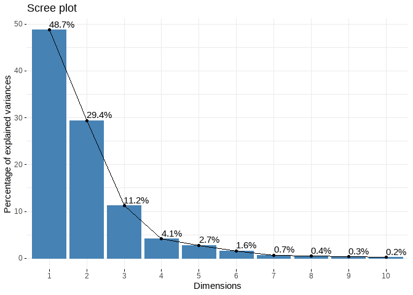<!-- -->

```r
var <- get_pca_var(pca)
var
```

```
## Principal Component Analysis Results for variables
##  ===================================================
##   Name       Description                                    
## 1 "$coord"   "Coordinates for the variables"                
## 2 "$cor"     "Correlations between variables and dimensions"
## 3 "$cos2"    "Cos2 for the variables"                       
## 4 "$contrib" "contributions of the variables"
```

```r
fviz_pca_var(pca, col.var = "black")
```

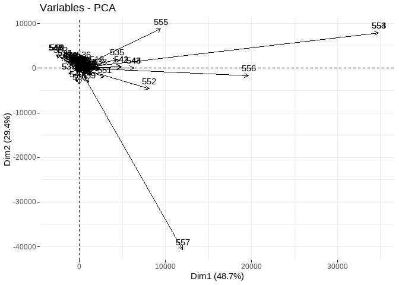<!-- -->


Using the `lmmatrix` function to find any association between the miRNA expression levels and the phenotypic variables:  

**PCs with metric P value and flow_cell:**


```r
pDat_2 <- sum_stats[c(1,2,3,7)]

pc_cor_pval <- lmmatrix(dep = scores, ind = pDat_2, metric = 'Pvalue') #correaltion matrix

t_pc_cor_pval <- t(pc_cor_pval) #only for visual purposes! Not being used for any calculations!

t_pc_cor_pval %>% 
  as.data.frame() %>% 
    mutate(condition = round(condition, digits = 3), 
           trimester = round(trimester, digits = 3),
           sex = round(sex, digits = 3),
           flowCell = round(flowCell, digits = 3)) %>% 
    mutate(
    condition = cell_spec(condition, "html", color = ifelse(condition <= 0.05, "green", "")), 
    trimester = cell_spec(trimester, "html", color = ifelse(trimester <= 0.05, "green", "")),
    sex = cell_spec(sex, "html", color = ifelse(sex <= 0.05, "green", "")), 
    flowCell = cell_spec(flowCell, "html", color = ifelse(flowCell <= 0.05, "green", ""))) %>%
  kable(format = "html", escape = F) %>% 
  kable_styling(bootstrap_options = c("striped", "hover", "condensed", full_width = F, fixed_thead = T))
```

<table class="table table-striped table-hover table-condensed" style="margin-left: auto; margin-right: auto;">
 <thead>
  <tr>
   <th style="text-align:left;">   </th>
   <th style="text-align:left;"> condition </th>
   <th style="text-align:left;"> trimester </th>
   <th style="text-align:left;"> sex </th>
   <th style="text-align:left;"> flowCell </th>
  </tr>
 </thead>
<tbody>
  <tr>
   <td style="text-align:left;"> PC1 </td>
   <td style="text-align:left;"> <span style="     color: green !important;">0.006</span> </td>
   <td style="text-align:left;"> <span style="     color: green !important;">0</span> </td>
   <td style="text-align:left;"> <span style="     color:  !important;">0.665</span> </td>
   <td style="text-align:left;"> <span style="     color: green !important;">0</span> </td>
  </tr>
  <tr>
   <td style="text-align:left;"> PC2 </td>
   <td style="text-align:left;"> <span style="     color:  !important;">0.296</span> </td>
   <td style="text-align:left;"> <span style="     color: green !important;">0.001</span> </td>
   <td style="text-align:left;"> <span style="     color:  !important;">0.906</span> </td>
   <td style="text-align:left;"> <span style="     color:  !important;">0.339</span> </td>
  </tr>
  <tr>
   <td style="text-align:left;"> PC3 </td>
   <td style="text-align:left;"> <span style="     color: green !important;">0.017</span> </td>
   <td style="text-align:left;"> <span style="     color:  !important;">0.301</span> </td>
   <td style="text-align:left;"> <span style="     color:  !important;">0.44</span> </td>
   <td style="text-align:left;"> <span style="     color: green !important;">0.018</span> </td>
  </tr>
  <tr>
   <td style="text-align:left;"> PC4 </td>
   <td style="text-align:left;"> <span style="     color:  !important;">0.306</span> </td>
   <td style="text-align:left;"> <span style="     color:  !important;">0.912</span> </td>
   <td style="text-align:left;"> <span style="     color:  !important;">0.966</span> </td>
   <td style="text-align:left;"> <span style="     color:  !important;">0.446</span> </td>
  </tr>
  <tr>
   <td style="text-align:left;"> PC5 </td>
   <td style="text-align:left;"> <span style="     color:  !important;">0.881</span> </td>
   <td style="text-align:left;"> <span style="     color:  !important;">0.757</span> </td>
   <td style="text-align:left;"> <span style="     color:  !important;">0.704</span> </td>
   <td style="text-align:left;"> <span style="     color:  !important;">0.359</span> </td>
  </tr>
  <tr>
   <td style="text-align:left;"> PC6 </td>
   <td style="text-align:left;"> <span style="     color:  !important;">0.105</span> </td>
   <td style="text-align:left;"> <span style="     color: green !important;">0.002</span> </td>
   <td style="text-align:left;"> <span style="     color:  !important;">0.964</span> </td>
   <td style="text-align:left;"> <span style="     color:  !important;">0.339</span> </td>
  </tr>
  <tr>
   <td style="text-align:left;"> PC7 </td>
   <td style="text-align:left;"> <span style="     color:  !important;">0.794</span> </td>
   <td style="text-align:left;"> <span style="     color:  !important;">0.854</span> </td>
   <td style="text-align:left;"> <span style="     color:  !important;">0.626</span> </td>
   <td style="text-align:left;"> <span style="     color:  !important;">0.807</span> </td>
  </tr>
  <tr>
   <td style="text-align:left;"> PC8 </td>
   <td style="text-align:left;"> <span style="     color:  !important;">0.244</span> </td>
   <td style="text-align:left;"> <span style="     color: green !important;">0.035</span> </td>
   <td style="text-align:left;"> <span style="     color:  !important;">0.084</span> </td>
   <td style="text-align:left;"> <span style="     color:  !important;">0.903</span> </td>
  </tr>
  <tr>
   <td style="text-align:left;"> PC9 </td>
   <td style="text-align:left;"> <span style="     color:  !important;">0.813</span> </td>
   <td style="text-align:left;"> <span style="     color:  !important;">0.264</span> </td>
   <td style="text-align:left;"> <span style="     color:  !important;">0.931</span> </td>
   <td style="text-align:left;"> <span style="     color:  !important;">0.794</span> </td>
  </tr>
  <tr>
   <td style="text-align:left;"> PC10 </td>
   <td style="text-align:left;"> <span style="     color:  !important;">0.377</span> </td>
   <td style="text-align:left;"> <span style="     color:  !important;">0.21</span> </td>
   <td style="text-align:left;"> <span style="     color:  !important;">0.978</span> </td>
   <td style="text-align:left;"> <span style="     color:  !important;">0.06</span> </td>
  </tr>
  <tr>
   <td style="text-align:left;"> PC11 </td>
   <td style="text-align:left;"> <span style="     color:  !important;">0.995</span> </td>
   <td style="text-align:left;"> <span style="     color:  !important;">0.856</span> </td>
   <td style="text-align:left;"> <span style="     color:  !important;">0.093</span> </td>
   <td style="text-align:left;"> <span style="     color:  !important;">0.919</span> </td>
  </tr>
  <tr>
   <td style="text-align:left;"> PC12 </td>
   <td style="text-align:left;"> <span style="     color:  !important;">0.753</span> </td>
   <td style="text-align:left;"> <span style="     color:  !important;">0.887</span> </td>
   <td style="text-align:left;"> <span style="     color:  !important;">0.706</span> </td>
   <td style="text-align:left;"> <span style="     color:  !important;">0.659</span> </td>
  </tr>
  <tr>
   <td style="text-align:left;"> PC13 </td>
   <td style="text-align:left;"> <span style="     color:  !important;">0.726</span> </td>
   <td style="text-align:left;"> <span style="     color:  !important;">0.989</span> </td>
   <td style="text-align:left;"> <span style="     color:  !important;">0.192</span> </td>
   <td style="text-align:left;"> <span style="     color:  !important;">0.744</span> </td>
  </tr>
  <tr>
   <td style="text-align:left;"> PC14 </td>
   <td style="text-align:left;"> <span style="     color:  !important;">0.903</span> </td>
   <td style="text-align:left;"> <span style="     color:  !important;">0.955</span> </td>
   <td style="text-align:left;"> <span style="     color:  !important;">0.893</span> </td>
   <td style="text-align:left;"> <span style="     color:  !important;">0.299</span> </td>
  </tr>
  <tr>
   <td style="text-align:left;"> PC15 </td>
   <td style="text-align:left;"> <span style="     color:  !important;">0.232</span> </td>
   <td style="text-align:left;"> <span style="     color:  !important;">0.504</span> </td>
   <td style="text-align:left;"> <span style="     color:  !important;">0.446</span> </td>
   <td style="text-align:left;"> <span style="     color:  !important;">0.773</span> </td>
  </tr>
  <tr>
   <td style="text-align:left;"> PC16 </td>
   <td style="text-align:left;"> <span style="     color:  !important;">0.525</span> </td>
   <td style="text-align:left;"> <span style="     color:  !important;">0.822</span> </td>
   <td style="text-align:left;"> <span style="     color: green !important;">0.014</span> </td>
   <td style="text-align:left;"> <span style="     color:  !important;">0.628</span> </td>
  </tr>
  <tr>
   <td style="text-align:left;"> PC17 </td>
   <td style="text-align:left;"> <span style="     color:  !important;">0.944</span> </td>
   <td style="text-align:left;"> <span style="     color:  !important;">0.592</span> </td>
   <td style="text-align:left;"> <span style="     color:  !important;">0.488</span> </td>
   <td style="text-align:left;"> <span style="     color: green !important;">0.006</span> </td>
  </tr>
  <tr>
   <td style="text-align:left;"> PC18 </td>
   <td style="text-align:left;"> <span style="     color:  !important;">0.557</span> </td>
   <td style="text-align:left;"> <span style="     color:  !important;">0.486</span> </td>
   <td style="text-align:left;"> <span style="     color:  !important;">0.419</span> </td>
   <td style="text-align:left;"> <span style="     color:  !important;">0.618</span> </td>
  </tr>
  <tr>
   <td style="text-align:left;"> PC19 </td>
   <td style="text-align:left;"> <span style="     color:  !important;">0.221</span> </td>
   <td style="text-align:left;"> <span style="     color:  !important;">0.781</span> </td>
   <td style="text-align:left;"> <span style="     color:  !important;">0.5</span> </td>
   <td style="text-align:left;"> <span style="     color:  !important;">0.952</span> </td>
  </tr>
  <tr>
   <td style="text-align:left;"> PC20 </td>
   <td style="text-align:left;"> <span style="     color:  !important;">0.32</span> </td>
   <td style="text-align:left;"> <span style="     color:  !important;">0.944</span> </td>
   <td style="text-align:left;"> <span style="     color:  !important;">0.566</span> </td>
   <td style="text-align:left;"> <span style="     color:  !important;">0.781</span> </td>
  </tr>
</tbody>
</table>

*Trimester* and *flowCell* (batch effects) variable seem to be driving the most variance, followed by *condition*, but sex does not seem be a confounder.  

Plotting the covariance matrix for the above:  


```r
#for co-variance matrix
pca_scores <- pca$x[,1:20] %>% 
  as.data.frame()

pc_info <- summary(pca)$importance %>% 
  as.data.frame() %>% 
  tibble::rownames_to_column(var = 'variable') %>%
  gather(key = 'PC', value = 'value', -variable) %>%
  as_tibble() %>%
  mutate(PC = factor(as.character(PC), levels = paste0('PC', 1:20)),
         Label = ifelse(variable == 'Proportion of Variance',
                        paste0(PC, ' (', prettyNum(value*100, digits = 2), '%)'),
                        as.character(PC))) %>%
  arrange(variable, PC)

pc_plot <- pc_cor_pval %>% 
  as.data.frame %>% 
  mutate(dep = rownames(pc_cor_pval)) %>% 
  gather(PC, pval, -dep) %>%
  mutate(pval_cat = factor(case_when(
    pval > 0.05  ~ '> 0.05',
    pval < 0.05 & pval > 0.01 ~ '< 0.05',
    pval < 0.01 & pval > 0.001 ~ '< 0.01',
    pval < 0.001 ~ '< 0.001'
  ), levels = c('> 0.05', '< 0.05','< 0.01', '< 0.001')),
  PC = factor(PC, levels = paste0('PC', 1:20))) %>% as_tibble()

pc_info <- na.omit(pc_info) #NAs signify PCs 21-30
pc_plot <- na.omit(pc_plot) 


# create color palette 
#colpal <- c('white', '#df9fdf', '#ac39ac', '#732673') #original purple
#names(colpal) <- levels(pc_plot$pval_cat)

#recolouring to a colour blind palette
#cbPink = carto_pal(7, "Burg")
#cbPink
#pie(rep(1, 7), col = cbPink)
#cbPink <- c("white", "#ffc6c4", "#e38191", "#ad466c")
#colpal <- cbPink
#names(colpal) <- levels(pc_plot$pval_cat)

cbPeach = carto_pal(7, "Peach")
cbPeach
```

```
## [1] "#fde0c5" "#facba6" "#f8b58b" "#f59e72" "#f2855d" "#ef6a4c" "#eb4a40"
```

```r
#pie(rep(1, 7), col = cbPeach)
cbPeach <- c("white", "#fde0c5", "#f59e72", "#ef6a4c")
colpal <- cbPeach
names(colpal) <- levels(pc_plot$pval_cat)


p1 <- ggplot(pc_plot, aes(x = PC, y = factor(dep), fill = pval_cat)) +
  geom_tile( col = 'lightgrey') +
  theme_bw() +
  scale_x_discrete(expand = c(0, 0), labels = 1:20) + #expand function fits the plot to its assigned dimesions 
  scale_y_discrete(expand = c(0, 0)) +
  scale_fill_manual(values = colpal)  + 
  coord_fixed() + # very important otherwise height of each tile is elongated!
  labs(y = '', fill = 'P value')

p2 <- ggplot(pc_info %>% 
               filter(variable == 'Proportion of Variance') %>%
               mutate(value = value*100), 
             aes(x = PC, y = value)) +
  geom_bar(stat = 'identity') +
  theme_bw() + 
  coord_cartesian(ylim = c(0,50)) +
  scale_x_discrete(expand = c(0, 0), labels = 1:20) + 
  scale_y_continuous(expand = c(0, 0)) +
  labs(y = '% variance explained')

#have to change the height of the second object in accordance with the first for different plots
egg::ggarrange(p1, p2, heights = c(3,0.2)) 
```

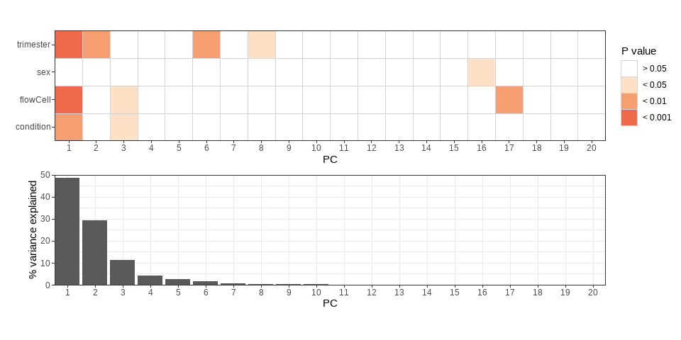<!-- -->

Now, let's use R-squared as the metric instead of the P value.  

**PCs with metric R-sqaured and flow_cell:**


```r
pca_scores <-pca$x %>% 
  as_tibble() %>% 
  mutate(Sample_Name = row.names(pDat)) 

pc_cor_rs <- lmmatrix(dep = pca_scores[,1:20], ind = pDat_2, metric = 'Rsquared')

t_pc_cor_rs <- t(pc_cor_rs) %>% 
  as.data.frame()

t_pc_cor_rs %>% 
  as.data.frame() %>% 
    mutate(condition = round(condition, digits = 3), 
           trimester = round(trimester, digits = 3),
           sex = round(sex, digits = 3),
           flowCell = round(flowCell, digits = 3)) %>% 
    mutate(
    condition = cell_spec(condition, "html", color = ifelse(condition <= 0.05, "green", "")), 
    trimester = cell_spec(trimester, "html", color = ifelse(trimester <= 0.05, "green", "")),
    sex = cell_spec(sex, "html", color = ifelse(sex <= 0.05, "green", "")), 
    flowCell = cell_spec(flowCell, "html", color = ifelse(flowCell <= 0.05, "green", ""))) %>%
  kable(format = "html", escape = F) %>% 
  kable_styling(bootstrap_options = c("striped", "hover", "condensed", full_width = F, fixed_thead = T))
```

<table class="table table-striped table-hover table-condensed" style="margin-left: auto; margin-right: auto;">
 <thead>
  <tr>
   <th style="text-align:left;">   </th>
   <th style="text-align:left;"> condition </th>
   <th style="text-align:left;"> trimester </th>
   <th style="text-align:left;"> sex </th>
   <th style="text-align:left;"> flowCell </th>
  </tr>
 </thead>
<tbody>
  <tr>
   <td style="text-align:left;"> PC1 </td>
   <td style="text-align:left;"> <span style="     color:  !important;">0.239</span> </td>
   <td style="text-align:left;"> <span style="     color:  !important;">0.464</span> </td>
   <td style="text-align:left;"> <span style="     color: green !important;">0.007</span> </td>
   <td style="text-align:left;"> <span style="     color:  !important;">0.473</span> </td>
  </tr>
  <tr>
   <td style="text-align:left;"> PC2 </td>
   <td style="text-align:left;"> <span style="     color: green !important;">0.039</span> </td>
   <td style="text-align:left;"> <span style="     color:  !important;">0.39</span> </td>
   <td style="text-align:left;"> <span style="     color: green !important;">0.001</span> </td>
   <td style="text-align:left;"> <span style="     color:  !important;">0.077</span> </td>
  </tr>
  <tr>
   <td style="text-align:left;"> PC3 </td>
   <td style="text-align:left;"> <span style="     color:  !important;">0.188</span> </td>
   <td style="text-align:left;"> <span style="     color:  !important;">0.085</span> </td>
   <td style="text-align:left;"> <span style="     color: green !important;">0.021</span> </td>
   <td style="text-align:left;"> <span style="     color:  !important;">0.258</span> </td>
  </tr>
  <tr>
   <td style="text-align:left;"> PC4 </td>
   <td style="text-align:left;"> <span style="     color: green !important;">0.037</span> </td>
   <td style="text-align:left;"> <span style="     color: green !important;">0.007</span> </td>
   <td style="text-align:left;"> <span style="     color: green !important;">0</span> </td>
   <td style="text-align:left;"> <span style="     color:  !important;">0.058</span> </td>
  </tr>
  <tr>
   <td style="text-align:left;"> PC5 </td>
   <td style="text-align:left;"> <span style="     color: green !important;">0.001</span> </td>
   <td style="text-align:left;"> <span style="     color: green !important;">0.02</span> </td>
   <td style="text-align:left;"> <span style="     color: green !important;">0.005</span> </td>
   <td style="text-align:left;"> <span style="     color:  !important;">0.073</span> </td>
  </tr>
  <tr>
   <td style="text-align:left;"> PC6 </td>
   <td style="text-align:left;"> <span style="     color:  !important;">0.091</span> </td>
   <td style="text-align:left;"> <span style="     color:  !important;">0.359</span> </td>
   <td style="text-align:left;"> <span style="     color: green !important;">0</span> </td>
   <td style="text-align:left;"> <span style="     color:  !important;">0.077</span> </td>
  </tr>
  <tr>
   <td style="text-align:left;"> PC7 </td>
   <td style="text-align:left;"> <span style="     color: green !important;">0.002</span> </td>
   <td style="text-align:left;"> <span style="     color: green !important;">0.012</span> </td>
   <td style="text-align:left;"> <span style="     color: green !important;">0.009</span> </td>
   <td style="text-align:left;"> <span style="     color: green !important;">0.016</span> </td>
  </tr>
  <tr>
   <td style="text-align:left;"> PC8 </td>
   <td style="text-align:left;"> <span style="     color: green !important;">0.048</span> </td>
   <td style="text-align:left;"> <span style="     color:  !important;">0.22</span> </td>
   <td style="text-align:left;"> <span style="     color:  !important;">0.103</span> </td>
   <td style="text-align:left;"> <span style="     color: green !important;">0.008</span> </td>
  </tr>
  <tr>
   <td style="text-align:left;"> PC9 </td>
   <td style="text-align:left;"> <span style="     color: green !important;">0.002</span> </td>
   <td style="text-align:left;"> <span style="     color:  !important;">0.094</span> </td>
   <td style="text-align:left;"> <span style="     color: green !important;">0</span> </td>
   <td style="text-align:left;"> <span style="     color: green !important;">0.017</span> </td>
  </tr>
  <tr>
   <td style="text-align:left;"> PC10 </td>
   <td style="text-align:left;"> <span style="     color: green !important;">0.028</span> </td>
   <td style="text-align:left;"> <span style="     color:  !important;">0.109</span> </td>
   <td style="text-align:left;"> <span style="     color: green !important;">0</span> </td>
   <td style="text-align:left;"> <span style="     color:  !important;">0.188</span> </td>
  </tr>
  <tr>
   <td style="text-align:left;"> PC11 </td>
   <td style="text-align:left;"> <span style="     color: green !important;">0</span> </td>
   <td style="text-align:left;"> <span style="     color: green !important;">0.011</span> </td>
   <td style="text-align:left;"> <span style="     color:  !important;">0.097</span> </td>
   <td style="text-align:left;"> <span style="     color: green !important;">0.006</span> </td>
  </tr>
  <tr>
   <td style="text-align:left;"> PC12 </td>
   <td style="text-align:left;"> <span style="     color: green !important;">0.004</span> </td>
   <td style="text-align:left;"> <span style="     color: green !important;">0.009</span> </td>
   <td style="text-align:left;"> <span style="     color: green !important;">0.005</span> </td>
   <td style="text-align:left;"> <span style="     color: green !important;">0.03</span> </td>
  </tr>
  <tr>
   <td style="text-align:left;"> PC13 </td>
   <td style="text-align:left;"> <span style="     color: green !important;">0.004</span> </td>
   <td style="text-align:left;"> <span style="     color: green !important;">0.001</span> </td>
   <td style="text-align:left;"> <span style="     color:  !important;">0.06</span> </td>
   <td style="text-align:left;"> <span style="     color: green !important;">0.022</span> </td>
  </tr>
  <tr>
   <td style="text-align:left;"> PC14 </td>
   <td style="text-align:left;"> <span style="     color: green !important;">0.001</span> </td>
   <td style="text-align:left;"> <span style="     color: green !important;">0.003</span> </td>
   <td style="text-align:left;"> <span style="     color: green !important;">0.001</span> </td>
   <td style="text-align:left;"> <span style="     color:  !important;">0.086</span> </td>
  </tr>
  <tr>
   <td style="text-align:left;"> PC15 </td>
   <td style="text-align:left;"> <span style="     color:  !important;">0.051</span> </td>
   <td style="text-align:left;"> <span style="     color: green !important;">0.05</span> </td>
   <td style="text-align:left;"> <span style="     color: green !important;">0.021</span> </td>
   <td style="text-align:left;"> <span style="     color: green !important;">0.019</span> </td>
  </tr>
  <tr>
   <td style="text-align:left;"> PC16 </td>
   <td style="text-align:left;"> <span style="     color: green !important;">0.015</span> </td>
   <td style="text-align:left;"> <span style="     color: green !important;">0.014</span> </td>
   <td style="text-align:left;"> <span style="     color:  !important;">0.196</span> </td>
   <td style="text-align:left;"> <span style="     color: green !important;">0.034</span> </td>
  </tr>
  <tr>
   <td style="text-align:left;"> PC17 </td>
   <td style="text-align:left;"> <span style="     color: green !important;">0</span> </td>
   <td style="text-align:left;"> <span style="     color: green !important;">0.038</span> </td>
   <td style="text-align:left;"> <span style="     color: green !important;">0.017</span> </td>
   <td style="text-align:left;"> <span style="     color:  !important;">0.312</span> </td>
  </tr>
  <tr>
   <td style="text-align:left;"> PC18 </td>
   <td style="text-align:left;"> <span style="     color: green !important;">0.012</span> </td>
   <td style="text-align:left;"> <span style="     color:  !important;">0.052</span> </td>
   <td style="text-align:left;"> <span style="     color: green !important;">0.023</span> </td>
   <td style="text-align:left;"> <span style="     color: green !important;">0.035</span> </td>
  </tr>
  <tr>
   <td style="text-align:left;"> PC19 </td>
   <td style="text-align:left;"> <span style="     color:  !important;">0.053</span> </td>
   <td style="text-align:left;"> <span style="     color: green !important;">0.018</span> </td>
   <td style="text-align:left;"> <span style="     color: green !important;">0.016</span> </td>
   <td style="text-align:left;"> <span style="     color: green !important;">0.004</span> </td>
  </tr>
  <tr>
   <td style="text-align:left;"> PC20 </td>
   <td style="text-align:left;"> <span style="     color: green !important;">0.035</span> </td>
   <td style="text-align:left;"> <span style="     color: green !important;">0.004</span> </td>
   <td style="text-align:left;"> <span style="     color: green !important;">0.012</span> </td>
   <td style="text-align:left;"> <span style="     color: green !important;">0.018</span> </td>
  </tr>
</tbody>
</table>

```r
pc_plot_rs <- pc_cor_rs %>% 
  as.data.frame() %>% 
  mutate(indep = rownames(pc_cor_rs)) %>%
  pivot_longer(c(-indep), names_to = "PC", values_to = "rsqr" ) %>%
  mutate(PC = factor(PC, levels = colnames(pc_cor_rs))) %>% 
  as_tibble()

head(pc_plot_rs)
```

```
## # A tibble: 6 x 3
##   indep     PC        rsqr
##   <chr>     <fct>    <dbl>
## 1 condition PC1   0.239   
## 2 condition PC2   0.0389  
## 3 condition PC3   0.188   
## 4 condition PC4   0.0373  
## 5 condition PC5   0.000812
## 6 condition PC6   0.0913
```

Now, it looks like *sex* is driving the first 3 PCs, follwed by *condition* and then *trimester*. 

The same for RSquared:  


```r
#ACC TO ALMAS'S SCRIPT

# calculate proportion variance
prop_var_rs <- tibble(Prop_var_norm = pca$sdev^2 *100 / pca$totalvar,
                      PC = 1:20)

p1_r <- ggplot(pc_plot_rs, aes(x = PC, y = indep, fill = rsqr)) +
  geom_tile(col = 'lightgrey') + 
  theme_bw() +
  scale_fill_gradient(low = "white", high = "#ef6a4c") + # continuous purple colour scale
  scale_x_discrete(expand = c(0, 0), labels = 1:20) +
  scale_y_discrete(expand = c(0, 0)) +
  coord_fixed() +
  labs(y = '', fill = 'R Squared', caption = "Note: R-squared values range from 0 - 0.47")

p1b_r <- ggplot(prop_var_rs, aes(x = PC, y = Prop_var_norm)) +
  geom_bar(stat = 'identity') + 
  theme_bw() + 
  labs(y = '% variance') +
  coord_cartesian(ylim = c(0,50)) +
  scale_x_continuous(breaks = 1:20) +
  scale_y_continuous(expand = c(0, 0))

egg::ggarrange(p1_r, p1b_r, heights = c(3,0.2))
```

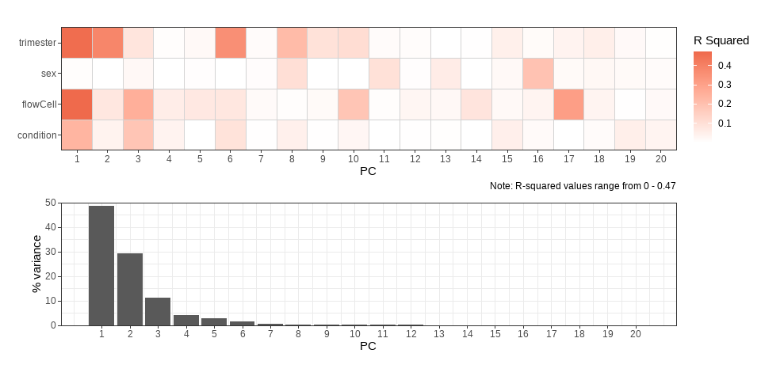<!-- -->

Comparing both P Value and R Squared Plots:  

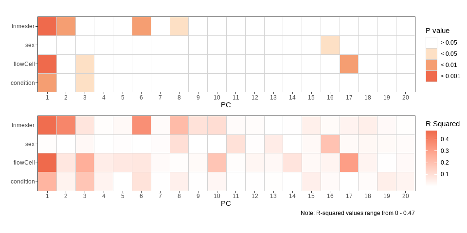<!-- -->

Matching PC scores to `pDat`:  


```r
meta_dat <- cbind(pDat, pca_scores) #matching phenotype data to it's first 10 PCs
```

##### PC1 versus PC2 {.tabset}  

###### Trimester

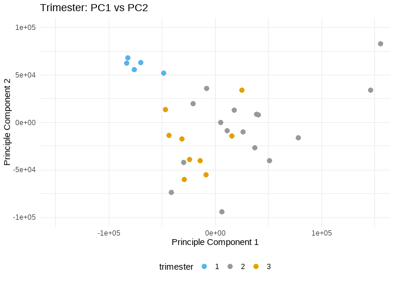<!-- -->

###### flowCell

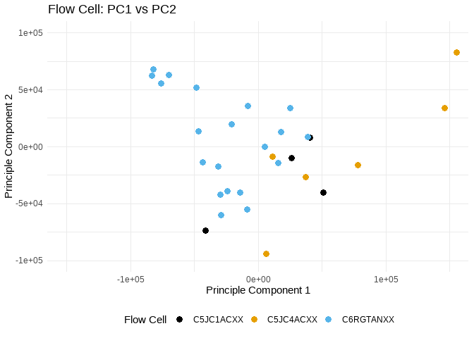<!-- -->

###### Condition

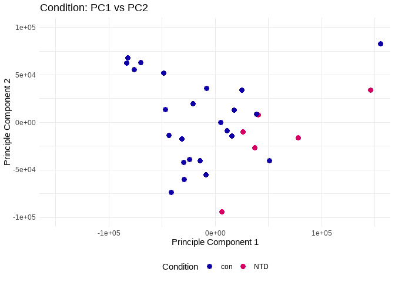<!-- -->

###### Sex

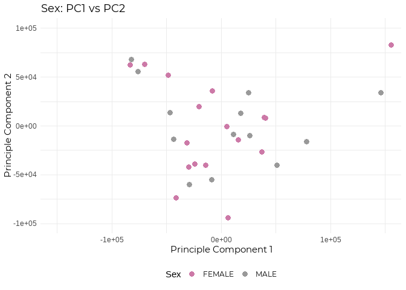<!-- -->

##### PC2 versus PC3 {.tabset}

###### Trimester

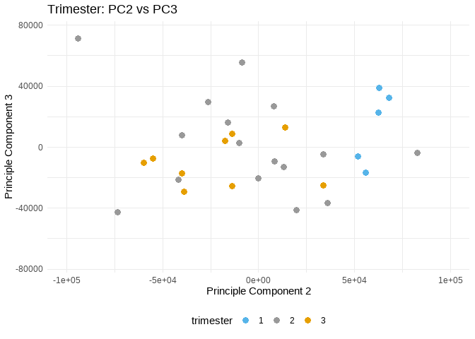<!-- -->

###### flowCell

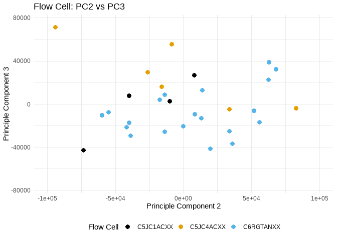<!-- -->

###### Condition

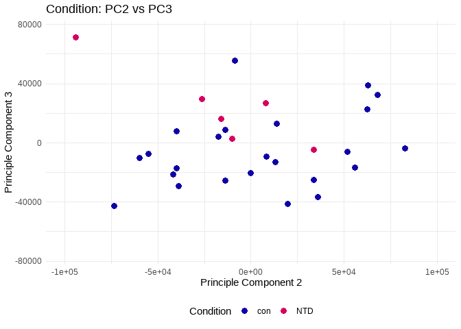<!-- -->

###### Sex

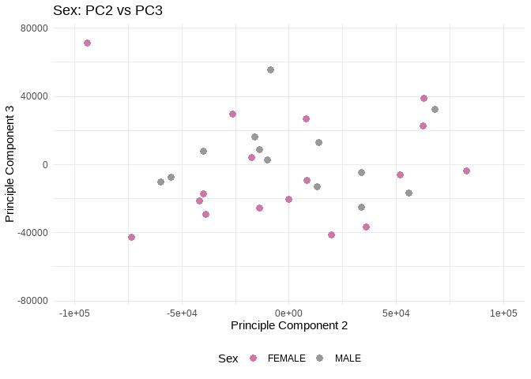<!-- -->

***

### 3.0 Analysis  

Raw counts, and not normalised counts, are required by the `limma` package` by which I will be carrying out the differential analysis (DE).  


```r
fil_miRNA <- fil_miRNA$`row.names(eFil)`

eFil <- eDat %>% 
  subset(rownames(eDat) %in% fil_miRNA)

eNorm <- eFil 
```


#### 3.1 Controls vs NTDs in Trimester 2 samples  

(Univariate Analysis)  

Considering only Trimester 2 Samples, (since T1 and T3 don't have any NTD samples):  


```r
tri2p <- pDat %>% #trimester 2 phenotype
  rownames_to_column(var = "sample") %>% 
  filter (trimester == "2")

tri2 <- as.character(tri2p$sample) 

tri2g <- eNorm %>% 
  dplyr::select(which(names(eNorm) %in% tri2p$sample))

all(colnames(tri2g) == tri2p$sample)
```

```
## [1] TRUE
```

```r
desmat_ntd <- model.matrix(~condition + sex, tri2p) #controlling only for sex!

efit_ntd <- lmFit(tri2g, desmat_ntd) %>% 
  eBayes()
```
  
Now here, we need to specify that we want to consider **condition** as our variable or `coefficient` of interest. Otherwise, the function relies on the default intercept which would give us the DE:  


```r
deg_ntd <- topTable(efit_ntd, n = Inf, adjust.method = "fdr", coef = "conditionNTD", p.value = 0.05) #specifying variable of interest as control/NTD 
paged_table(deg_ntd)
```

<div data-pagedtable="false">
  <script data-pagedtable-source type="application/json">
{"columns":[],"data":[],"options":{"columns":{"min":{},"max":[10]},"rows":{"min":[10],"max":[10]},"pages":{}}}
  </script>
</div>

This gives 0 DEmiRNA.  

***  

#### 2.3 Differential miRNA by Trimester in Controls  

Are there any miRNA that are DE by trimester in the control samples?  


```r
controls_p <- pDat %>% 
  rownames_to_column(var = "sample") %>% 
  filter (condition == "con")

control_samp <- as.character(controls_p$sample) 

control_g <- eNorm %>% 
  dplyr::select(which(names(eNorm) %in% control_samp))

(controls_p$sample == names(control_g)) %>% all()
```

```
## [1] TRUE
```

```r
controls_mat <- model.matrix(~trimester + sex, controls_p)

controls_genes <- lmFit(control_g, controls_mat) 

#Making contrast matrix
conMat <- makeContrasts(
  t2_vs_t1 = trimester2 - Intercept,
  t3_vs_t1 = trimester3 - Intercept,
  t3_vs_t2 = trimester3 - trimester2,
  levels = controls_mat
)
```

```
## Warning in makeContrasts(t2_vs_t1 = trimester2 - Intercept, t3_vs_t1 =
## trimester3 - : Renaming (Intercept) to Intercept
```

```r
controls_genes_cont <- contrasts.fit(controls_genes, conMat) %>% 
  eBayes()
```

```
## Warning in contrasts.fit(controls_genes, conMat): row names of contrasts don't
## match col names of coefficients
```

```r
#at FDR 0.05
decideTests(controls_genes_cont, adjust.method = "fdr", p.value = 0.05) %>%
  summary() 
```

```
##        t2_vs_t1 t3_vs_t1 t3_vs_t2
## Down        241      276       82
## NotSig      316      274      437
## Up            0        7       38
```

```r
DE_wo_fc <- decideTests(controls_genes_cont, adjust.method = "fdr", p.value = 0.05) %>%
  summary() %>% 
  as.data.frame()


#at FDR 0.01
decideTests(controls_genes_cont, adjust.method = "fdr", p.value = 0.01) %>%
  summary() 
```

```
##        t2_vs_t1 t3_vs_t1 t3_vs_t2
## Down        198      219       53
## NotSig      359      337      484
## Up            0        1       20
```

```r
#topTable(controls_genes_cont, n = Inf, adjust.method = "fdr", p.value = 0.05)

#t2 versus t1
controls_tri2v1_list <- topTable(controls_genes_cont, n = Inf, adjust.method = "fdr", coef = 1, p.value = 0.05, sort.by = "logFC")
nrow(controls_tri2v1_list) #241
```

```
## [1] 241
```

```r
paged_table(controls_tri2v1_list)
```

<div data-pagedtable="false">
  <script data-pagedtable-source type="application/json">
{"columns":[{"label":[""],"name":["_rn_"],"type":[""],"align":["left"]},{"label":["logFC"],"name":[1],"type":["dbl"],"align":["right"]},{"label":["AveExpr"],"name":[2],"type":["dbl"],"align":["right"]},{"label":["t"],"name":[3],"type":["dbl"],"align":["right"]},{"label":["P.Value"],"name":[4],"type":["dbl"],"align":["right"]},{"label":["adj.P.Val"],"name":[5],"type":["dbl"],"align":["right"]},{"label":["B"],"name":[6],"type":["dbl"],"align":["right"]}],"data":[{"1":"-65604.608773","2":"50090.408333","3":"-3.677369","4":"1.448046e-03","5":"4.383488e-03","6":"-4.024667","_rn_":"pred-disov-miR-4168-5p"},{"1":"-47769.376865","2":"19646.328750","3":"-5.913344","4":"7.963845e-06","5":"4.378753e-05","6":"-3.624600","_rn_":"pred-kno-miR-5612-5p"},{"1":"-44629.592527","2":"17876.552917","3":"-6.250811","4":"3.766948e-06","5":"2.469305e-05","6":"-3.579957","_rn_":"pred-kno-miR-5581-5p"},{"1":"-44629.592527","2":"17876.552917","3":"-6.250811","4":"3.766948e-06","5":"2.469305e-05","6":"-3.579957","_rn_":"pred-kno-miR-5585-5p"},{"1":"-44629.592527","2":"17876.552917","3":"-6.250811","4":"3.766948e-06","5":"2.469305e-05","6":"-3.579957","_rn_":"pred-kno-miR-5587-5p"},{"1":"-44629.592527","2":"17876.552917","3":"-6.250811","4":"3.766948e-06","5":"2.469305e-05","6":"-3.579957","_rn_":"pred-kno-miR-5611-5p"},{"1":"-44627.233304","2":"17876.014167","3":"-6.250655","4":"3.768240e-06","5":"2.469305e-05","6":"-3.579976","_rn_":"pred-kno-miR-5603-5p"},{"1":"-24279.911438","2":"6702.173625","3":"-10.010655","4":"2.450791e-09","5":"1.055485e-07","6":"-3.269405","_rn_":"pred-kno-miR-5584-5p"},{"1":"-17487.780551","2":"5300.323333","3":"-9.326676","4":"8.136169e-09","5":"2.517692e-07","6":"-3.307110","_rn_":"pred-kno-miR-5572-3p"},{"1":"-17487.780551","2":"5300.323333","3":"-9.326676","4":"8.136169e-09","5":"2.517692e-07","6":"-3.307110","_rn_":"pred-kno-miR-5573-3p"},{"1":"-17189.360342","2":"8164.165833","3":"-6.848129","4":"1.036955e-06","5":"9.468590e-06","6":"-3.509555","_rn_":"pred-disov-miR-12455-5p"},{"1":"-10883.686649","2":"2762.109083","3":"-9.063119","4":"1.311637e-08","5":"3.320827e-07","6":"-3.323319","_rn_":"pred-kno-miR-2461-3p"},{"1":"-10514.739545","2":"1419.337262","3":"-14.820271","4":"2.048119e-12","5":"3.810700e-10","6":"-3.115670","_rn_":"pred-disov-miR-11278-3p"},{"1":"-10514.739545","2":"1419.337262","3":"-14.820271","4":"2.048119e-12","5":"3.810700e-10","6":"-3.115670","_rn_":"pred-disov-miR-5987-3p"},{"1":"-10512.220897","2":"1419.032888","3":"-14.818610","4":"2.052442e-12","5":"3.810700e-10","6":"-3.115702","_rn_":"pred-disov-miR-3559-3p"},{"1":"-9742.914148","2":"2681.849250","3":"-11.611661","4":"1.816336e-10","5":"2.508777e-08","6":"-3.200781","_rn_":"pred-kno-miR-5593-5p"},{"1":"-9470.943090","2":"2443.125458","3":"-8.813967","4":"2.076595e-08","5":"4.819430e-07","6":"-3.339602","_rn_":"pred-kno-miR-14626-3p"},{"1":"-9046.906479","2":"3971.178750","3":"-3.529303","4":"2.049070e-03","5":"5.975561e-03","6":"-4.057514","_rn_":"pred-kno-miR-2013-3p"},{"1":"-6171.639598","2":"2784.003333","3":"-7.158250","4":"5.406602e-07","5":"6.094628e-06","6":"-3.476947","_rn_":"pred-disov-miR-12135-3p"},{"1":"-5246.237895","2":"3151.275833","3":"-5.698368","4":"1.292036e-05","5":"6.789286e-05","6":"-3.655025","_rn_":"pred-kno-miR-6641-5p"},{"1":"-4847.928882","2":"1824.314500","3":"-7.958803","4":"1.068373e-07","5":"1.859637e-06","6":"-3.403558","_rn_":"pred-kno-miR-5596-3p"},{"1":"-4537.207938","2":"887.944437","3":"-4.032226","4":"6.271324e-04","5":"2.079243e-03","6":"-3.948786","_rn_":"pred-kno-miR-4769-3p"},{"1":"-4509.240507","2":"1818.535458","3":"-7.539219","4":"2.472528e-07","5":"3.498522e-06","6":"-3.440199","_rn_":"pred-kno-miR-5588-5p"},{"1":"-4286.034779","2":"2350.601625","3":"-6.175129","4":"4.450227e-06","5":"2.785142e-05","6":"-3.589648","_rn_":"pred-kno-miR-6304-5p"},{"1":"-4259.730825","2":"1594.808333","3":"-9.343299","4":"7.897035e-09","5":"2.517692e-07","6":"-3.306121","_rn_":"pred-kno-miR-5600-3p"},{"1":"-4053.983385","2":"2318.182833","3":"-4.365898","4":"2.850010e-04","5":"1.058304e-03","6":"-3.881502","_rn_":"pred-kno-miR-6641-3p"},{"1":"-3832.531196","2":"2091.405375","3":"-5.608285","4":"1.584892e-05","5":"7.812256e-05","6":"-3.668253","_rn_":"pred-kno-miR-5606-5p"},{"1":"-3741.733475","2":"1189.943083","3":"-6.914014","4":"9.019988e-07","5":"9.007810e-06","6":"-3.502414","_rn_":"pred-kno-miR-5583-3p"},{"1":"-3599.130169","2":"2194.875833","3":"-7.732554","4":"1.674753e-07","5":"2.591215e-06","6":"-3.422842","_rn_":"pred-kno-miR-5586-5p"},{"1":"-3370.889947","2":"1555.546000","3":"-4.044892","4":"6.086368e-04","5":"2.053712e-03","6":"-3.946158","_rn_":"pred-kno-miR-2014-3p"},{"1":"-3363.485368","2":"1421.332917","3":"-7.358334","4":"3.576132e-07","5":"4.339053e-06","6":"-3.457212","_rn_":"pred-1anot-miR-5591-5p"},{"1":"-3363.316584","2":"1421.356667","3":"-7.357342","4":"3.583419e-07","5":"4.339053e-06","6":"-3.457307","_rn_":"pred-1anot-miR-5602-5p"},{"1":"-3363.153453","2":"1421.310417","3":"-7.358093","4":"3.577902e-07","5":"4.339053e-06","6":"-3.457235","_rn_":"pred-kno-miR-5605-5p"},{"1":"-3363.150381","2":"1421.316417","3":"-7.359735","4":"3.565867e-07","5":"4.339053e-06","6":"-3.457077","_rn_":"pred-kno-miR-5592-5p"},{"1":"-3236.031871","2":"2589.879583","3":"-4.224468","4":"3.980939e-04","5":"1.403407e-03","6":"-3.909517","_rn_":"pred-kno-miR-5577-5p"},{"1":"-3236.031871","2":"2589.879583","3":"-4.224468","4":"3.980939e-04","5":"1.403407e-03","6":"-3.909517","_rn_":"pred-kno-miR-5580-5p"},{"1":"-2844.736483","2":"2442.652500","3":"-5.062145","4":"5.564661e-05","5":"2.459933e-04","6":"-3.754770","_rn_":"pred-kno-miR-5593-3p"},{"1":"-2678.725833","2":"1278.651042","3":"-4.926998","4":"7.623480e-05","5":"3.168864e-04","6":"-3.777909","_rn_":"pred-disov-miR-9779-3p"},{"1":"-2586.575081","2":"1274.078542","3":"-7.381252","4":"3.411939e-07","5":"4.339053e-06","6":"-3.455013","_rn_":"pred-kno-miR-5577-3p"},{"1":"-2586.575081","2":"1274.078542","3":"-7.381252","4":"3.411939e-07","5":"4.339053e-06","6":"-3.455013","_rn_":"pred-kno-miR-5580-3p"},{"1":"-2552.645775","2":"1181.275917","3":"-8.690197","4":"2.616686e-08","5":"5.829976e-07","6":"-3.348059","_rn_":"pred-disov-miR-12258-3p"},{"1":"-2439.994159","2":"1132.323917","3":"-8.101459","4":"8.075162e-08","5":"1.450924e-06","6":"-3.391941","_rn_":"pred-kno-miR-5572-5p"},{"1":"-2439.994159","2":"1132.323917","3":"-8.101459","4":"8.075162e-08","5":"1.450924e-06","6":"-3.391941","_rn_":"pred-kno-miR-5573-5p"},{"1":"-2367.984056","2":"1232.141792","3":"-6.486486","4":"2.251956e-06","5":"1.638855e-05","6":"-3.550920","_rn_":"pred-kno-miR-5598-3p"},{"1":"-1860.296237","2":"836.380833","3":"-6.151745","4":"4.686103e-06","5":"2.900000e-05","6":"-3.592679","_rn_":"pred-kno-miR-13600-3p"},{"1":"-1817.637582","2":"1776.278250","3":"-3.877133","4":"9.045728e-04","5":"2.846593e-03","6":"-3.981429","_rn_":"pred-disov-miR-4404-3p"},{"1":"-1759.157236","2":"893.444583","3":"-6.895505","4":"9.379766e-07","5":"9.007810e-06","6":"-3.504409","_rn_":"pred-kno-miR-5583-5p"},{"1":"-1731.075592","2":"1616.314750","3":"-4.388647","4":"2.700950e-04","5":"1.016506e-03","6":"-3.877067","_rn_":"pred-kno-miR-5612-3p"},{"1":"-1731.075592","2":"1616.314750","3":"-4.388647","4":"2.700950e-04","5":"1.016506e-03","6":"-3.877067","_rn_":"pred-1anot-miR-5617-3p"},{"1":"-1713.748848","2":"496.231042","3":"-10.424987","4":"1.216734e-09","5":"6.777209e-08","6":"-3.249267","_rn_":"pred-kno-miR-2456-5p"},{"1":"-1707.349968","2":"898.274625","3":"-6.984452","4":"7.775780e-07","5":"8.329057e-06","6":"-3.494909","_rn_":"pred-1anot-miR-5609-3p"},{"1":"-1671.679608","2":"1389.289417","3":"-3.091336","4":"5.646037e-03","5":"1.497544e-02","6":"-4.157934","_rn_":"pred-kno-miR-2556-5p"},{"1":"-1647.131127","2":"2343.622125","3":"-2.619077","4":"1.623569e-02","5":"3.931860e-02","6":"-4.269345","_rn_":"pred-kno-miR-2556-3p"},{"1":"-1633.818456","2":"734.826000","3":"-4.952174","4":"7.188533e-05","5":"3.010536e-04","6":"-3.773545","_rn_":"pred-kno-miR-2636-3p"},{"1":"-1594.673372","2":"1176.560917","3":"-4.269196","4":"3.581547e-04","5":"1.278796e-03","6":"-3.900576","_rn_":"pred-kno-miR-5601-5p"},{"1":"-1593.387564","2":"558.804000","3":"-10.585791","4":"9.320328e-10","5":"5.768247e-08","6":"-3.241940","_rn_":"pred-disov-miR-12260-3p"},{"1":"-1501.482378","2":"462.816708","3":"-11.272963","4":"3.079092e-10","5":"2.508777e-08","6":"-3.213381","_rn_":"pred-kno-miR-5581-3p"},{"1":"-1443.088691","2":"616.764708","3":"-6.898447","4":"9.321590e-07","5":"9.007810e-06","6":"-3.504091","_rn_":"pred-1anot-miR-5589-5p"},{"1":"-1443.088691","2":"616.764708","3":"-6.898447","4":"9.321590e-07","5":"9.007810e-06","6":"-3.504091","_rn_":"pred-1anot-miR-5617-5p"},{"1":"-1418.664740","2":"1319.034625","3":"-3.101799","4":"5.512670e-03","5":"1.469166e-02","6":"-4.155490","_rn_":"pred-disov-miR-933-5p"},{"1":"-1406.277973","2":"1618.629500","3":"-2.857773","4":"9.577130e-03","5":"2.458277e-02","6":"-4.212862","_rn_":"pred-kno-miR-5604-3p"},{"1":"-1406.277973","2":"1618.629500","3":"-2.857773","4":"9.577130e-03","5":"2.458277e-02","6":"-4.212862","_rn_":"pred-kno-miR-5607-3p"},{"1":"-1154.796591","2":"287.830000","3":"-6.227934","4":"3.961313e-06","5":"2.544108e-05","6":"-3.582867","_rn_":"pred-kno-miR-5579-3p"},{"1":"-1147.440626","2":"869.712792","3":"-2.585166","4":"1.747943e-02","5":"4.160703e-02","6":"-4.277362","_rn_":"pred-kno-miR-5587-3p"},{"1":"-1136.029082","2":"694.624292","3":"-5.568045","4":"1.736820e-05","5":"8.486044e-05","6":"-3.674255","_rn_":"pred-kno-miR-5588-3p"},{"1":"-1091.893350","2":"762.760458","3":"-2.787922","4":"1.119255e-02","5":"2.839353e-02","6":"-4.229381","_rn_":"pred-kno-miR-7248-3p"},{"1":"-1089.654483","2":"757.658375","3":"-2.785072","4":"1.126369e-02","5":"2.839353e-02","6":"-4.230055","_rn_":"pred-1anot-miR-11367-3p"},{"1":"-1061.541908","2":"823.912750","3":"-3.187202","4":"4.532515e-03","5":"1.231517e-02","6":"-4.135607","_rn_":"pred-kno-miR-13552-3p"},{"1":"-1044.139701","2":"130.707295","3":"-11.176572","4":"3.585823e-10","5":"2.508777e-08","6":"-3.217136","_rn_":"pred-kno-miR-11406-5p"},{"1":"-1043.974828","2":"130.696955","3":"-11.175348","4":"3.592792e-10","5":"2.508777e-08","6":"-3.217184","_rn_":"pred-kno-miR-3439-5p"},{"1":"-1043.931137","2":"130.680872","3":"-11.173511","4":"3.603271e-10","5":"2.508777e-08","6":"-3.217256","_rn_":"pred-kno-miR-6994-5p"},{"1":"-979.006665","2":"316.610750","3":"-9.194479","4":"1.032709e-08","5":"2.739137e-07","6":"-3.315114","_rn_":"pred-kno-miR-2459-5p"},{"1":"-794.393368","2":"154.377439","3":"-3.153644","4":"4.895604e-03","5":"1.323714e-02","6":"-4.143404","_rn_":"pred-kno-miR-5619-3p"},{"1":"-782.205456","2":"962.422625","3":"-2.836889","4":"1.003514e-02","5":"2.564025e-02","6":"-4.217798","_rn_":"pred-kno-miR-5608-3p"},{"1":"-761.921561","2":"381.370167","3":"-6.837845","4":"1.059824e-06","5":"9.521323e-06","6":"-3.510681","_rn_":"pred-kno-miR-5611-3p"},{"1":"-669.062158","2":"351.011333","3":"-6.570002","4":"1.879850e-06","5":"1.445931e-05","6":"-3.541033","_rn_":"pred-kno-miR-5585-3p"},{"1":"-662.879891","2":"400.193125","3":"-6.311446","4":"3.297718e-06","5":"2.296036e-05","6":"-3.572323","_rn_":"pred-nov-miR-10218-5p"},{"1":"-658.021726","2":"731.887708","3":"-4.284547","4":"3.453936e-04","5":"1.249248e-03","6":"-3.897525","_rn_":"pred-1anot-miR-5574-5p"},{"1":"-639.024361","2":"392.350958","3":"-6.226511","4":"3.973741e-06","5":"2.544108e-05","6":"-3.583048","_rn_":"pred-nov-miR-9102-5p"},{"1":"-638.425819","2":"356.318167","3":"-6.483707","4":"2.265563e-06","5":"1.638855e-05","6":"-3.551253","_rn_":"pred-disov-miR-14570-5p"},{"1":"-624.671155","2":"524.563417","3":"-2.627304","4":"1.594675e-02","5":"3.878751e-02","6":"-4.267399","_rn_":"pred-kno-miR-12268-3p"},{"1":"-535.504581","2":"303.228596","3":"-5.815089","4":"9.928649e-06","5":"5.317556e-05","6":"-3.638309","_rn_":"pred-disov-miR-11361-5p"},{"1":"-501.136109","2":"521.356250","3":"-2.999632","4":"6.956388e-03","5":"1.827693e-02","6":"-4.179426","_rn_":"pred-kno-miR-2580-3p"},{"1":"-498.700639","2":"252.856167","3":"-7.917305","4":"1.159599e-07","5":"1.957263e-06","6":"-3.407015","_rn_":"pred-1anot-miR-5575-5p"},{"1":"-475.153327","2":"169.202058","3":"-6.463138","4":"2.368956e-06","5":"1.691678e-05","6":"-3.553721","_rn_":"pred-1anot-miR-5590-5p"},{"1":"-457.482090","2":"154.914588","3":"-9.220463","4":"9.852547e-09","5":"2.739137e-07","6":"-3.313521","_rn_":"pred-1anot-miR-5589-3p"},{"1":"-457.482090","2":"154.914588","3":"-9.220463","4":"9.852547e-09","5":"2.739137e-07","6":"-3.313521","_rn_":"pred-kno-miR-5592-3p"},{"1":"-435.839947","2":"276.950296","3":"-3.473927","4":"2.332088e-03","5":"6.730429e-03","6":"-4.069959","_rn_":"pred-kno-miR-13450-5p"},{"1":"-412.161628","2":"194.149721","3":"-6.393841","4":"2.754394e-06","5":"1.942022e-05","6":"-3.562132","_rn_":"pred-kno-miR-2014-5p"},{"1":"-397.868829","2":"307.293708","3":"-4.366798","4":"2.843962e-04","5":"1.058304e-03","6":"-3.881326","_rn_":"pred-disov-miR-6203-3p"},{"1":"-395.691632","2":"140.140800","3":"-6.574461","4":"1.861854e-06","5":"1.445931e-05","6":"-3.540511","_rn_":"pred-kno-miR-5595-5p"},{"1":"-395.691632","2":"140.140800","3":"-6.574461","4":"1.861854e-06","5":"1.445931e-05","6":"-3.540511","_rn_":"pred-kno-miR-5599-5p"},{"1":"-395.691632","2":"140.140800","3":"-6.574461","4":"1.861854e-06","5":"1.445931e-05","6":"-3.540511","_rn_":"pred-kno-miR-5608-5p"},{"1":"-391.874804","2":"154.015954","3":"-8.200352","4":"6.661370e-08","5":"1.279442e-06","6":"-3.384123","_rn_":"pred-kno-miR-2456-3p"},{"1":"-391.079303","2":"324.923750","3":"-4.320472","4":"3.172839e-04","5":"1.155079e-03","6":"-3.890418","_rn_":"pred-disov-miR-13032-5p"},{"1":"-383.060800","2":"226.987571","3":"-5.639992","4":"1.474779e-05","5":"7.407746e-05","6":"-3.663564","_rn_":"pred-kno-miR-10876-3p"},{"1":"-365.705680","2":"73.767146","3":"-10.026270","4":"2.386110e-09","5":"1.055485e-07","6":"-3.268611","_rn_":"pred-1anot-miR-5576-3p"},{"1":"-359.156596","2":"225.676167","3":"-6.736184","4":"1.315888e-06","5":"1.145234e-05","6":"-3.521962","_rn_":"pred-kno-miR-4463-3p"},{"1":"-351.099033","2":"365.138500","3":"-2.595471","4":"1.709227e-02","5":"4.116311e-02","6":"-4.274927","_rn_":"pred-kno-miR-12119-5p"},{"1":"-342.278743","2":"159.258367","3":"-3.754251","4":"1.208485e-03","5":"3.739589e-03","6":"-4.007874","_rn_":"pred-kno-miR-3605-3p"},{"1":"-341.476726","2":"87.963162","3":"-5.526786","4":"1.908065e-05","5":"9.162000e-05","6":"-3.680469","_rn_":"pred-kno-miR-12826-3p"},{"1":"-338.984997","2":"393.711833","3":"-2.504980","4":"2.078598e-02","5":"4.844265e-02","6":"-4.296286","_rn_":"pred-disov-miR-14280-5p"},{"1":"-337.445442","2":"392.926292","3":"-2.497543","4":"2.112068e-02","5":"4.901758e-02","6":"-4.298038","_rn_":"pred-disov-miR-2536-5p"},{"1":"-336.612437","2":"274.999708","3":"-3.924974","4":"8.079791e-04","5":"2.557070e-03","6":"-3.971271","_rn_":"pred-disov-miR-1176-3p"},{"1":"-335.286446","2":"166.754650","3":"-4.351098","4":"2.951395e-04","5":"1.087682e-03","6":"-3.884399","_rn_":"pred-kno-miR-4271-3p"},{"1":"-335.191109","2":"166.755429","3":"-4.348697","4":"2.968182e-04","5":"1.087682e-03","6":"-3.884869","_rn_":"pred-kno-miR-3606-3p"},{"1":"-324.633374","2":"286.084000","3":"-5.182394","4":"4.210404e-05","5":"1.905155e-04","6":"-3.734768","_rn_":"pred-kno-miR-5594-5p"},{"1":"-290.096637","2":"53.287773","3":"-3.516921","4":"2.109264e-03","5":"6.119064e-03","6":"-4.060289","_rn_":"pred-kno-miR-5620-3p"},{"1":"-286.295291","2":"136.099329","3":"-6.541700","4":"1.998293e-06","5":"1.504121e-05","6":"-3.544360","_rn_":"pred-kno-miR-4250-3p"},{"1":"-280.027186","2":"306.247583","3":"-3.333638","4":"3.232136e-03","5":"9.092423e-03","6":"-4.101843","_rn_":"pred-1anot-miR-5582-5p"},{"1":"-280.025828","2":"306.246458","3":"-3.333663","4":"3.231949e-03","5":"9.092423e-03","6":"-4.101838","_rn_":"pred-1anot-miR-5615-5p"},{"1":"-266.680580","2":"156.626854","3":"-4.979131","4":"6.750645e-05","5":"2.892392e-04","6":"-3.768900","_rn_":"pred-kno-miR-13601-5p"},{"1":"-255.359470","2":"184.650858","3":"-3.992490","4":"6.888746e-04","5":"2.258941e-03","6":"-3.957069","_rn_":"pred-kno-miR-12118-5p"},{"1":"-255.212873","2":"184.669296","3":"-3.992141","4":"6.894435e-04","5":"2.258941e-03","6":"-3.957142","_rn_":"pred-kno-miR-6642-5p"},{"1":"-246.644026","2":"70.536225","3":"-9.776574","4":"3.672167e-09","5":"1.363598e-07","6":"-3.281646","_rn_":"pred-1anot-miR-14298-5p"},{"1":"-245.306219","2":"207.908500","3":"-3.956437","4":"7.501188e-04","5":"2.415122e-03","6":"-3.964633","_rn_":"pred-kno-miR-13453-3p"},{"1":"-233.286364","2":"236.656792","3":"-4.063942","4":"5.818381e-04","5":"1.988244e-03","6":"-3.942215","_rn_":"pred-disov-miR-6823-3p"},{"1":"-233.241912","2":"181.770083","3":"-4.984639","4":"6.664548e-05","5":"2.877638e-04","6":"-3.767955","_rn_":"pred-disov-miR-14343-3p"},{"1":"-227.272718","2":"95.079658","3":"-7.152561","4":"5.470941e-07","5":"6.094628e-06","6":"-3.477522","_rn_":"pred-kno-miR-5578-3p"},{"1":"-217.462791","2":"221.461358","3":"-2.591587","4":"1.723726e-02","5":"4.120667e-02","6":"-4.275845","_rn_":"pred-kno-miR-2828-5p"},{"1":"-217.381412","2":"221.293525","3":"-2.594051","4":"1.714514e-02","5":"4.116311e-02","6":"-4.275262","_rn_":"pred-kno-miR-3043-5p"},{"1":"-213.639875","2":"48.021805","3":"-6.581631","4":"1.833294e-06","5":"1.445931e-05","6":"-3.539672","_rn_":"pred-kno-miR-5600-5p"},{"1":"-213.639875","2":"48.021805","3":"-6.581631","4":"1.833294e-06","5":"1.445931e-05","6":"-3.539672","_rn_":"pred-1anot-miR-5609-5p"},{"1":"-201.482752","2":"84.056062","3":"-5.976675","4":"6.912788e-06","5":"3.891355e-05","6":"-3.615937","_rn_":"pred-nov-miR-13991-3p"},{"1":"-201.425924","2":"84.122613","3":"-5.971936","4":"6.986274e-06","5":"3.891355e-05","6":"-3.616580","_rn_":"pred-nov-miR-4185-3p"},{"1":"-201.425924","2":"84.122613","3":"-5.971936","4":"6.986274e-06","5":"3.891355e-05","6":"-3.616580","_rn_":"pred-nov-miR-4187-3p"},{"1":"-201.425924","2":"84.122613","3":"-5.971936","4":"6.986274e-06","5":"3.891355e-05","6":"-3.616580","_rn_":"pred-nov-miR-4773-3p"},{"1":"-201.425924","2":"84.122613","3":"-5.971936","4":"6.986274e-06","5":"3.891355e-05","6":"-3.616580","_rn_":"pred-nov-miR-4775-3p"},{"1":"-198.678448","2":"380.737583","3":"-3.678655","4":"1.443674e-03","5":"4.383488e-03","6":"-4.024384","_rn_":"pred-disov-miR-13032-3p"},{"1":"-193.609087","2":"55.573504","3":"-10.007654","4":"2.463429e-09","5":"1.055485e-07","6":"-3.269558","_rn_":"pred-kno-miR-10876-5p"},{"1":"-183.449435","2":"37.744554","3":"-6.191354","4":"4.293739e-06","5":"2.717741e-05","6":"-3.587555","_rn_":"pred-kno-miR-5579-5p"},{"1":"-176.883503","2":"210.552250","3":"-4.394069","4":"2.666598e-04","5":"1.016506e-03","6":"-3.876013","_rn_":"pred-kno-miR-5594-3p"},{"1":"-158.783138","2":"154.039206","3":"-2.486874","4":"2.160967e-02","5":"4.994434e-02","6":"-4.300550","_rn_":"pred-disov-miR-3301-3p"},{"1":"-147.908056","2":"93.808758","3":"-4.992522","4":"6.543263e-05","5":"2.847342e-04","6":"-3.766603","_rn_":"pred-kno-miR-5584-3p"},{"1":"-147.899960","2":"94.848512","3":"-4.039980","4":"6.157448e-04","5":"2.053712e-03","6":"-3.947176","_rn_":"pred-kno-miR-2828-3p"},{"1":"-147.899960","2":"94.848512","3":"-4.039980","4":"6.157448e-04","5":"2.053712e-03","6":"-3.947176","_rn_":"pred-kno-miR-3043-3p"},{"1":"-144.990541","2":"76.342121","3":"-4.644359","4":"1.478401e-04","5":"5.786761e-04","6":"-3.828573","_rn_":"pred-kno-miR-4269-5p"},{"1":"-141.930667","2":"123.697629","3":"-3.142108","4":"5.026835e-03","5":"1.346128e-02","6":"-4.146090","_rn_":"pred-kno-miR-7011-5p"},{"1":"-136.606028","2":"63.337296","3":"-2.928743","4":"8.165625e-03","5":"2.125352e-02","6":"-4.196111","_rn_":"pred-1anot-miR-667-3p"},{"1":"-134.488844","2":"44.821687","3":"-6.876591","4":"9.762707e-07","5":"9.216657e-06","6":"-3.506456","_rn_":"pred-disov-miR-14346-3p"},{"1":"-131.486069","2":"43.926780","3":"-6.906969","4":"9.155207e-07","5":"9.007810e-06","6":"-3.503172","_rn_":"pred-disov-miR-14344-3p"},{"1":"-131.117641","2":"52.347229","3":"-5.370984","4":"2.725743e-05","5":"1.265199e-04","6":"-3.704491","_rn_":"pred-disov-miR-14345-3p"},{"1":"-130.790242","2":"116.531392","3":"-3.927773","4":"8.026554e-04","5":"2.554737e-03","6":"-3.970679","_rn_":"pred-kno-miR-2601-3p"},{"1":"-125.955385","2":"35.847529","3":"-8.306187","4":"5.429120e-08","5":"1.080007e-06","6":"-3.375964","_rn_":"pred-kno-miR-9460-3p"},{"1":"-121.154784","2":"96.758808","3":"-3.595379","4":"1.755337e-03","5":"5.228463e-03","6":"-4.042776","_rn_":"pred-kno-miR-5714-3p"},{"1":"-113.102762","2":"40.439492","3":"-8.897420","4":"1.778838e-08","5":"4.307881e-07","6":"-3.334040","_rn_":"pred-1anot-miR-5575-3p"},{"1":"-112.380556","2":"42.718500","3":"-8.564854","4":"3.313595e-08","5":"7.098741e-07","6":"-3.356884","_rn_":"pred-1anot-miR-5613-3p"},{"1":"-108.587676","2":"22.876373","3":"-4.917948","4":"7.786265e-05","5":"3.188934e-04","6":"-3.779483","_rn_":"pred-disov-miR-5740-3p"},{"1":"-106.661755","2":"47.785175","3":"-6.577128","4":"1.851178e-06","5":"1.445931e-05","6":"-3.540199","_rn_":"pred-kno-miR-2458-3p"},{"1":"-104.584943","2":"55.981192","3":"-6.136942","4":"4.842010e-06","5":"2.900000e-05","6":"-3.594607","_rn_":"pred-kno-miR-5596-5p"},{"1":"-101.361305","2":"45.093446","3":"-6.757112","4":"1.258413e-06","5":"1.112597e-05","6":"-3.519616","_rn_":"pred-disov-miR-14589-5p"},{"1":"-100.568032","2":"122.875779","3":"-2.566531","4":"1.820055e-02","5":"4.295639e-02","6":"-4.281765","_rn_":"pred-kno-miR-3904-5p"},{"1":"-98.170748","2":"57.387292","3":"-4.648094","4":"1.465474e-04","5":"5.786761e-04","6":"-3.827883","_rn_":"pred-kno-miR-14627-3p"},{"1":"-98.112037","2":"57.245375","3":"-4.642279","4":"1.485650e-04","5":"5.786761e-04","6":"-3.828957","_rn_":"pred-kno-miR-2460-3p"},{"1":"-92.839491","2":"22.916729","3":"-5.037230","4":"5.896536e-05","5":"2.586119e-04","6":"-3.758983","_rn_":"pred-kno-miR-11358-5p"},{"1":"-90.022168","2":"20.834753","3":"-5.162934","4":"4.404417e-05","5":"1.962608e-04","6":"-3.737968","_rn_":"pred-kno-miR-12788-5p"},{"1":"-89.185004","2":"22.221532","3":"-5.399868","4":"2.550887e-05","5":"1.204105e-04","6":"-3.699971","_rn_":"pred-kno-miR-12787-3p"},{"1":"-89.037913","2":"26.133268","3":"-9.791859","4":"3.575773e-09","5":"1.363598e-07","6":"-3.280826","_rn_":"pred-1anot-miR-5576-5p"},{"1":"-88.390104","2":"60.885521","3":"-6.092636","4":"5.341190e-06","5":"3.164939e-05","6":"-3.600419","_rn_":"pred-kno-miR-13453-5p"},{"1":"-86.982942","2":"104.693071","3":"-3.440559","4":"2.520819e-03","5":"7.200493e-03","6":"-4.077498","_rn_":"pred-1anot-miR-5615-3p"},{"1":"-84.285954","2":"43.026854","3":"-7.019829","4":"7.219011e-07","5":"7.884292e-06","6":"-3.491189","_rn_":"pred-1anot-miR-14298-3p"},{"1":"-83.318814","2":"58.853742","3":"-3.663861","4":"1.494740e-03","5":"4.500380e-03","6":"-4.027636","_rn_":"pred-kno-miR-25-5p"},{"1":"-81.556772","2":"32.355325","3":"-6.510345","4":"2.138513e-06","5":"1.588202e-05","6":"-3.548074","_rn_":"pred-kno-miR-12965-5p"},{"1":"-81.459679","2":"22.289640","3":"-4.807456","4":"1.008210e-04","5":"4.072547e-04","6":"-3.798960","_rn_":"pred-kno-miR-5711-5p"},{"1":"-81.444484","2":"22.288110","3":"-4.807123","4":"1.008997e-04","5":"4.072547e-04","6":"-3.799020","_rn_":"pred-kno-miR-7004-5p"},{"1":"-77.518032","2":"35.736812","3":"-6.138808","4":"4.822066e-06","5":"2.900000e-05","6":"-3.594363","_rn_":"pred-nov-miR-10017-3p"},{"1":"-76.384112","2":"64.726237","3":"-3.262895","4":"3.807048e-03","5":"1.054988e-02","6":"-4.118098","_rn_":"pred-disov-miR-6351-3p"},{"1":"-71.536817","2":"41.232333","3":"-4.210500","4":"4.114585e-04","5":"1.441398e-03","6":"-3.912325","_rn_":"pred-kno-miR-13449-5p"},{"1":"-67.363094","2":"36.937121","3":"-6.143177","4":"4.775696e-06","5":"2.900000e-05","6":"-3.593794","_rn_":"pred-kno-miR-5605-3p"},{"1":"-65.353072","2":"53.461208","3":"-3.856901","4":"9.487982e-04","5":"2.968992e-03","6":"-3.985749","_rn_":"pred-kno-miR-2141-3p"},{"1":"-59.345509","2":"70.281958","3":"-3.244364","4":"3.973432e-03","5":"1.095644e-02","6":"-4.122374","_rn_":"pred-kno-miR-14567-3p"},{"1":"-58.596665","2":"13.351716","3":"-5.551019","4":"1.805500e-05","5":"8.744902e-05","6":"-3.676812","_rn_":"pred-kno-miR-5842-3p"},{"1":"-55.940295","2":"20.435052","3":"-2.957317","4":"7.655667e-03","5":"2.001975e-02","6":"-4.189379","_rn_":"pred-kno-miR-4800-5p"},{"1":"-55.644548","2":"68.654654","3":"-3.289533","4":"3.579721e-03","5":"1.001962e-02","6":"-4.111965","_rn_":"pred-kno-miR-8516-3p"},{"1":"-53.949784","2":"14.606632","3":"-6.926175","4":"8.791352e-07","5":"9.007810e-06","6":"-3.501109","_rn_":"pred-kno-miR-14630-5p"},{"1":"-52.919940","2":"67.196646","3":"-3.059535","4":"6.070836e-03","5":"1.602586e-02","6":"-4.165374","_rn_":"pred-disov-miR-4168-3p"},{"1":"-51.667106","2":"44.861742","3":"-2.516258","4":"2.028789e-02","5":"4.748048e-02","6":"-4.293628","_rn_":"pred-kno-miR-2601-5p"},{"1":"-49.496795","2":"14.012200","3":"-3.820858","4":"1.032972e-03","5":"3.214331e-03","6":"-3.993478","_rn_":"pred-kno-miR-4805-3p"},{"1":"-49.180453","2":"18.836943","3":"-3.552802","4":"1.939442e-03","5":"5.685626e-03","6":"-4.052258","_rn_":"pred-kno-miR-3605-5p"},{"1":"-47.203754","2":"22.539119","3":"-5.413848","4":"2.470400e-05","5":"1.176079e-04","6":"-3.697794","_rn_":"pred-kno-miR-7707-5p"},{"1":"-46.389167","2":"43.312246","3":"-3.612636","4":"1.685723e-03","5":"5.048105e-03","6":"-4.038948","_rn_":"pred-kno-miR-7707-3p"},{"1":"-45.792735","2":"18.172239","3":"-3.970542","4":"7.255382e-04","5":"2.363303e-03","6":"-3.961669","_rn_":"pred-kno-miR-5841-3p"},{"1":"-45.137492","2":"20.196459","3":"-6.011560","4":"6.395608e-06","5":"3.749846e-05","6":"-3.611222","_rn_":"pred-kno-miR-2457-5p"},{"1":"-43.748566","2":"24.089105","3":"-4.422156","4":"2.495531e-04","5":"9.586282e-04","6":"-3.870569","_rn_":"pred-1anot-miR-5591-3p"},{"1":"-41.102179","2":"33.674467","3":"-5.377393","4":"2.685920e-05","5":"1.257191e-04","6":"-3.703486","_rn_":"pred-disov-miR-4201-5p"},{"1":"-40.541899","2":"11.916527","3":"-4.919026","4":"7.766688e-05","5":"3.188934e-04","6":"-3.779296","_rn_":"pred-kno-miR-12800-5p"},{"1":"-40.128527","2":"8.387678","3":"-6.673834","4":"1.503673e-06","5":"1.288532e-05","6":"-3.529025","_rn_":"pred-kno-miR-624-3p"},{"1":"-39.114434","2":"10.351875","3":"-4.778699","4":"1.078485e-04","5":"4.321700e-04","6":"-3.804107","_rn_":"pred-kno-miR-10027-5p"},{"1":"-38.548621","2":"23.533883","3":"-5.635607","4":"1.489529e-05","5":"7.407746e-05","6":"-3.664211","_rn_":"pred-kno-miR-5614-3p"},{"1":"-38.548621","2":"23.533883","3":"-5.635607","4":"1.489529e-05","5":"7.407746e-05","6":"-3.664211","_rn_":"pred-kno-miR-5616-3p"},{"1":"-38.546311","2":"23.536275","3":"-5.635887","4":"1.488581e-05","5":"7.407746e-05","6":"-3.664169","_rn_":"pred-kno-miR-5601-3p"},{"1":"-38.546311","2":"23.536275","3":"-5.635887","4":"1.488581e-05","5":"7.407746e-05","6":"-3.664169","_rn_":"pred-kno-miR-5606-3p"},{"1":"-38.490963","2":"17.850545","3":"-5.809159","4":"1.006202e-05","5":"5.337661e-05","6":"-3.639146","_rn_":"pred-nov-miR-3385-3p"},{"1":"-37.773983","2":"14.923533","3":"-7.281536","4":"4.188309e-07","5":"4.963592e-06","6":"-3.464670","_rn_":"pred-kno-miR-9461-3p"},{"1":"-36.814406","2":"46.715896","3":"-3.698150","4":"1.379010e-03","5":"4.243695e-03","6":"-4.020109","_rn_":"pred-kno-miR-8187-3p"},{"1":"-36.187631","2":"17.514849","3":"-6.566275","4":"1.895026e-06","5":"1.445931e-05","6":"-3.541470","_rn_":"pred-kno-miR-2459-3p"},{"1":"-36.134235","2":"11.303234","3":"-7.631921","4":"2.049953e-07","5":"3.086011e-06","6":"-3.431772","_rn_":"pred-1anot-miR-1427-5p"},{"1":"-33.850705","2":"36.261137","3":"-2.748207","4":"1.222366e-02","5":"3.039543e-02","6":"-4.238781","_rn_":"pred-disov-miR-6352-5p"},{"1":"-30.872969","2":"8.705784","3":"-6.856067","4":"1.019649e-06","5":"9.465741e-06","6":"-3.508689","_rn_":"pred-disov-miR-1411-5p"},{"1":"-29.686458","2":"9.945374","3":"-7.833869","4":"1.368230e-07","5":"2.240188e-06","6":"-3.414073","_rn_":"pred-kno-miR-4141-3p"},{"1":"-29.234933","2":"6.162334","3":"-5.179237","4":"4.241278e-05","5":"1.905155e-04","6":"-3.735286","_rn_":"pred-disov-miR-5741-3p"},{"1":"-29.024003","2":"11.303710","3":"-7.531332","4":"2.512404e-07","5":"3.498522e-06","6":"-3.440925","_rn_":"pred-disov-miR-13973-5p"},{"1":"-28.562512","2":"18.196579","3":"-3.684827","4":"1.422887e-03","5":"4.354659e-03","6":"-4.023030","_rn_":"pred-1anot-miR-9577-3p"},{"1":"-27.603416","2":"21.681099","3":"-2.881359","4":"9.083922e-03","5":"2.353370e-02","6":"-4.207291","_rn_":"pred-kno-miR-14491-5p"},{"1":"-27.515991","2":"8.964797","3":"-7.819589","4":"1.407658e-07","5":"2.240188e-06","6":"-3.415296","_rn_":"pred-disov-miR-5740-5p"},{"1":"-27.192692","2":"14.277322","3":"-5.906879","4":"8.079965e-06","5":"4.378753e-05","6":"-3.625492","_rn_":"pred-kno-miR-10070-5p"},{"1":"-26.867350","2":"36.854850","3":"-3.217228","4":"4.229918e-03","5":"1.160623e-02","6":"-4.128648","_rn_":"pred-kno-miR-9664-3p"},{"1":"-25.528961","2":"8.249156","3":"-7.612735","4":"2.130831e-07","5":"3.123350e-06","6":"-3.433500","_rn_":"pred-kno-miR-10370-5p"},{"1":"-24.945739","2":"6.771678","3":"-5.642526","4":"1.466322e-05","5":"7.407746e-05","6":"-3.663191","_rn_":"pred-kno-miR-1484-3p"},{"1":"-22.910641","2":"36.100004","3":"-2.527933","4":"1.978402e-02","5":"4.649662e-02","6":"-4.290875","_rn_":"pred-kno-miR-12670-5p"},{"1":"-22.135826","2":"13.861793","3":"-4.762371","4":"1.120571e-04","5":"4.458273e-04","6":"-3.807043","_rn_":"pred-kno-miR-14043-5p"},{"1":"-21.991518","2":"4.370523","3":"-7.217618","4":"4.779874e-07","5":"5.546646e-06","6":"-3.470988","_rn_":"pred-kno-miR-2460-5p"},{"1":"-20.367928","2":"6.287612","3":"-3.962275","4":"7.398458e-04","5":"2.395896e-03","6":"-3.963405","_rn_":"pred-disov-miR-5741-5p"},{"1":"-19.904286","2":"20.211400","3":"-2.654886","4":"1.501320e-02","5":"3.683856e-02","6":"-4.260873","_rn_":"pred-kno-miR-2561-5p"},{"1":"-17.485505","2":"8.612802","3":"-3.590629","4":"1.774990e-03","5":"5.258881e-03","6":"-4.043831","_rn_":"pred-disov-miR-14322-5p"},{"1":"-16.611283","2":"5.733424","3":"-5.334961","4":"2.961049e-05","5":"1.363062e-04","6":"-3.710172","_rn_":"pred-kno-miR-7706-3p"},{"1":"-15.617534","2":"4.442255","3":"-8.338400","4":"5.102915e-08","5":"1.052712e-06","6":"-3.373522","_rn_":"pred-skno-miR-1100-5p"},{"1":"-15.373874","2":"12.785219","3":"-4.110308","4":"5.214344e-04","5":"1.803969e-03","6":"-3.932674","_rn_":"pred-disov-miR-12608-3p"},{"1":"-14.856882","2":"7.721010","3":"-4.047460","4":"6.049537e-04","5":"2.053712e-03","6":"-3.945625","_rn_":"pred-kno-miR-14711-3p"},{"1":"-14.484920","2":"7.488911","3":"-2.763672","4":"1.181182e-02","5":"2.963595e-02","6":"-4.235120","_rn_":"pred-disov-miR-10010-5p"},{"1":"-14.035865","2":"9.558669","3":"-4.435524","4":"2.418035e-04","5":"9.353094e-04","6":"-3.867989","_rn_":"pred-kno-miR-1913-5p"},{"1":"-14.016253","2":"6.044485","3":"-5.905929","4":"8.097156e-06","5":"4.378753e-05","6":"-3.625623","_rn_":"pred-1anot-miR-5574-3p"},{"1":"-13.894796","2":"7.770804","3":"-4.967767","4":"6.931851e-05","5":"2.947360e-04","6":"-3.770855","_rn_":"pred-disov-miR-12259-3p"},{"1":"-13.784705","2":"7.922496","3":"-3.280707","4":"3.653534e-03","5":"1.017509e-02","6":"-4.113995","_rn_":"pred-kno-miR-7248-5p"},{"1":"-13.702698","2":"7.424628","3":"-4.280431","4":"3.487700e-04","5":"1.253322e-03","6":"-3.898342","_rn_":"pred-kno-miR-9762-3p"},{"1":"-13.587357","2":"5.203507","3":"-4.956561","4":"7.115359e-05","5":"3.002466e-04","6":"-3.772788","_rn_":"pred-nov-miR-11346-3p"},{"1":"-12.470735","2":"8.709410","3":"-3.935913","4":"7.873746e-04","5":"2.520504e-03","6":"-3.968959","_rn_":"pred-kno-miR-2545-5p"},{"1":"-10.810328","2":"6.649730","3":"-2.667455","4":"1.460512e-02","5":"3.599581e-02","6":"-4.257898","_rn_":"pred-1anot-miR-5582-3p"},{"1":"-10.741765","2":"7.922312","3":"-2.636161","4":"1.564116e-02","5":"3.821107e-02","6":"-4.265304","_rn_":"pred-kno-miR-14495-5p"},{"1":"-10.736564","2":"3.927860","3":"-4.089900","4":"5.472082e-04","5":"1.881451e-03","6":"-3.936864","_rn_":"pred-kno-miR-5847-5p"},{"1":"-10.712697","2":"5.336950","3":"-5.207458","4":"3.973253e-05","5":"1.814018e-04","6":"-3.730667","_rn_":"pred-disov-miR-12455-3p"},{"1":"-10.462694","2":"6.782251","3":"-3.368367","4":"2.981869e-03","5":"8.473985e-03","6":"-4.093905","_rn_":"pred-disov-miR-14323-5p"},{"1":"-9.450828","2":"5.292597","3":"-4.113698","4":"5.172717e-04","5":"1.800752e-03","6":"-3.931979","_rn_":"pred-kno-miR-12384-5p"},{"1":"-9.265616","2":"4.725613","3":"-3.142611","4":"5.021044e-03","5":"1.346128e-02","6":"-4.145973","_rn_":"pred-kno-miR-10026-5p"},{"1":"-8.697422","2":"6.336296","3":"-3.558865","4":"1.912110e-03","5":"5.635159e-03","6":"-4.050905","_rn_":"pred-kno-miR-2539-5p"},{"1":"-7.147221","2":"9.796817","3":"-2.582457","4":"1.758258e-02","5":"4.167445e-02","6":"-4.278003","_rn_":"pred-disov-miR-14343-5p"},{"1":"-6.649930","2":"4.137252","3":"-3.444046","4":"2.500414e-03","5":"7.179024e-03","6":"-4.076708","_rn_":"pred-kno-miR-2141-5p"},{"1":"-6.368146","2":"3.786164","3":"-3.199372","4":"4.407416e-03","5":"1.203397e-02","6":"-4.132784","_rn_":"pred-1anot-miR-7806-3p"},{"1":"-6.015916","2":"3.902605","3":"-2.784994","4":"1.126566e-02","5":"2.839353e-02","6":"-4.230074","_rn_":"pred-kno-miR-2555-5p"},{"1":"-5.179181","2":"3.066154","3":"-2.708766","4":"1.333663e-02","5":"3.301557e-02","6":"-4.248118","_rn_":"pred-kno-miR-6472-3p"},{"1":"-5.005103","2":"3.213074","3":"-2.750249","4":"1.216851e-02","5":"3.039399e-02","6":"-4.238297","_rn_":"pred-kno-miR-12384-3p"}],"options":{"columns":{"min":{},"max":[10]},"rows":{"min":[10],"max":[10]},"pages":{}}}
  </script>
</div>

```r
#t3 versus t1
controls_tri3v1_list <- topTable(controls_genes_cont, n = Inf, adjust.method = "fdr", coef = 2, p.value = 0.05, sort.by = "logFC")
nrow(controls_tri3v1_list) #283
```

```
## [1] 283
```

```r
paged_table(controls_tri3v1_list) #logFC value too high 
```

<div data-pagedtable="false">
  <script data-pagedtable-source type="application/json">
{"columns":[{"label":[""],"name":["_rn_"],"type":[""],"align":["left"]},{"label":["logFC"],"name":[1],"type":["dbl"],"align":["right"]},{"label":["AveExpr"],"name":[2],"type":["dbl"],"align":["right"]},{"label":["t"],"name":[3],"type":["dbl"],"align":["right"]},{"label":["P.Value"],"name":[4],"type":["dbl"],"align":["right"]},{"label":["adj.P.Val"],"name":[5],"type":["dbl"],"align":["right"]},{"label":["B"],"name":[6],"type":["dbl"],"align":["right"]}],"data":[{"1":"-73905.678511","2":"50090.408333","3":"-4.194784","4":"4.270335e-04","5":"1.390981e-03","6":"-3.900427","_rn_":"pred-disov-miR-4168-5p"},{"1":"-48161.347312","2":"19646.328750","3":"-6.036861","4":"6.045444e-06","5":"3.176710e-05","6":"-3.585548","_rn_":"pred-kno-miR-5612-5p"},{"1":"-44424.168213","2":"17876.552917","3":"-6.300307","4":"3.379188e-06","5":"1.863984e-05","6":"-3.550624","_rn_":"pred-kno-miR-5581-5p"},{"1":"-44424.168213","2":"17876.552917","3":"-6.300307","4":"3.379188e-06","5":"1.863984e-05","6":"-3.550624","_rn_":"pred-kno-miR-5585-5p"},{"1":"-44424.168213","2":"17876.552917","3":"-6.300307","4":"3.379188e-06","5":"1.863984e-05","6":"-3.550624","_rn_":"pred-kno-miR-5587-5p"},{"1":"-44424.168213","2":"17876.552917","3":"-6.300307","4":"3.379188e-06","5":"1.863984e-05","6":"-3.550624","_rn_":"pred-kno-miR-5611-5p"},{"1":"-44422.218237","2":"17876.014167","3":"-6.300206","4":"3.379935e-06","5":"1.863984e-05","6":"-3.550637","_rn_":"pred-kno-miR-5603-5p"},{"1":"-23481.616423","2":"6702.173625","3":"-9.803302","4":"3.505331e-09","5":"1.220293e-07","6":"-3.250016","_rn_":"pred-kno-miR-5584-5p"},{"1":"-21332.048612","2":"8164.165833","3":"-8.605453","4":"3.068935e-08","5":"5.179990e-07","6":"-3.325603","_rn_":"pred-disov-miR-12455-5p"},{"1":"-17926.409292","2":"5300.323333","3":"-9.680871","4":"4.340415e-09","5":"1.343117e-07","6":"-3.256807","_rn_":"pred-kno-miR-5572-3p"},{"1":"-17926.409292","2":"5300.323333","3":"-9.680871","4":"4.340415e-09","5":"1.343117e-07","6":"-3.256807","_rn_":"pred-kno-miR-5573-3p"},{"1":"-10782.671771","2":"1419.337262","3":"-15.389092","4":"1.006399e-12","5":"1.872290e-10","6":"-3.070684","_rn_":"pred-disov-miR-11278-3p"},{"1":"-10782.671771","2":"1419.337262","3":"-15.389092","4":"1.006399e-12","5":"1.872290e-10","6":"-3.070684","_rn_":"pred-disov-miR-5987-3p"},{"1":"-10780.157414","2":"1419.032888","3":"-15.387464","4":"1.008415e-12","5":"1.872290e-10","6":"-3.070713","_rn_":"pred-disov-miR-3559-3p"},{"1":"-10634.741108","2":"2762.109083","3":"-8.967214","4":"1.563930e-08","5":"4.148138e-07","6":"-3.300481","_rn_":"pred-kno-miR-2461-3p"},{"1":"-9245.615293","2":"2443.125458","3":"-8.712504","4":"2.509537e-08","5":"4.671534e-07","6":"-3.317941","_rn_":"pred-kno-miR-14626-3p"},{"1":"-9209.776481","2":"2681.849250","3":"-11.114336","4":"3.958514e-10","5":"2.449880e-08","6":"-3.187911","_rn_":"pred-kno-miR-5593-5p"},{"1":"-6346.938692","2":"2784.003333","3":"-7.454174","4":"2.939386e-07","5":"3.210270e-06","6":"-3.421993","_rn_":"pred-disov-miR-12135-3p"},{"1":"-5218.620660","2":"3151.275833","3":"-5.739673","4":"1.176848e-05","5":"5.586641e-05","6":"-3.627755","_rn_":"pred-kno-miR-6641-5p"},{"1":"-5064.965781","2":"2350.601625","3":"-7.389172","4":"3.357023e-07","5":"3.428178e-06","6":"-3.428296","_rn_":"pred-kno-miR-6304-5p"},{"1":"-4885.577524","2":"887.944437","3":"-4.396439","4":"2.651716e-04","5":"9.006133e-04","6":"-3.859562","_rn_":"pred-kno-miR-4769-3p"},{"1":"-4535.091897","2":"1818.535458","3":"-7.677822","4":"1.869075e-07","5":"2.215545e-06","6":"-3.401068","_rn_":"pred-kno-miR-5588-5p"},{"1":"-4138.412867","2":"1824.314500","3":"-6.879459","4":"9.703618e-07","5":"7.302424e-06","6":"-3.481434","_rn_":"pred-kno-miR-5596-3p"},{"1":"-3865.925932","2":"1594.808333","3":"-8.586192","4":"3.182586e-08","5":"5.213825e-07","6":"-3.327003","_rn_":"pred-kno-miR-5600-3p"},{"1":"-3726.935549","2":"2194.875833","3":"-8.107861","4":"7.974864e-08","5":"1.138974e-06","6":"-3.363947","_rn_":"pred-kno-miR-5586-5p"},{"1":"-3529.550295","2":"1189.943083","3":"-6.603980","4":"1.747125e-06","5":"1.144881e-05","6":"-3.513100","_rn_":"pred-kno-miR-5583-3p"},{"1":"-3471.778002","2":"2318.182833","3":"-3.785930","4":"1.121602e-03","5":"3.470735e-03","6":"-3.987912","_rn_":"pred-kno-miR-6641-3p"},{"1":"-3362.077767","2":"3303.403750","3":"-2.834720","4":"1.008390e-02","5":"2.194037e-02","6":"-4.210143","_rn_":"pred-disov-miR-13631-5p"},{"1":"-3306.552447","2":"1421.332917","3":"-7.324776","4":"3.831404e-07","5":"3.467250e-06","6":"-3.434642","_rn_":"pred-1anot-miR-5591-5p"},{"1":"-3306.361396","2":"1421.356667","3":"-7.323733","4":"3.839633e-07","5":"3.467250e-06","6":"-3.434746","_rn_":"pred-1anot-miR-5602-5p"},{"1":"-3306.274737","2":"1421.316417","3":"-7.326284","4":"3.819534e-07","5":"3.467250e-06","6":"-3.434492","_rn_":"pred-kno-miR-5592-5p"},{"1":"-3306.226221","2":"1421.310417","3":"-7.324536","4":"3.833295e-07","5":"3.467250e-06","6":"-3.434666","_rn_":"pred-kno-miR-5605-5p"},{"1":"3093.437421","2":"5803.047500","3":"2.468608","4":"2.247144e-02","5":"4.438508e-02","6":"-4.298615","_rn_":"pred-disov-miR-5191-5p"},{"1":"-3037.146136","2":"2091.405375","3":"-4.500274","4":"2.075552e-04","5":"7.270961e-04","6":"-3.839135","_rn_":"pred-kno-miR-5606-5p"},{"1":"-3000.398662","2":"2343.622125","3":"-4.830899","4":"9.543600e-05","5":"3.640949e-04","6":"-3.776919","_rn_":"pred-kno-miR-2556-3p"},{"1":"-2856.226770","2":"1181.275917","3":"-9.846020","4":"3.254843e-09","5":"1.208632e-07","6":"-3.247692","_rn_":"pred-disov-miR-12258-3p"},{"1":"-2638.358475","2":"1389.289417","3":"-4.940330","4":"7.389930e-05","5":"2.858466e-04","6":"-3.757276","_rn_":"pred-kno-miR-2556-5p"},{"1":"-2592.685518","2":"1132.323917","3":"-8.716723","4":"2.489787e-08","5":"4.671534e-07","6":"-3.317643","_rn_":"pred-kno-miR-5572-5p"},{"1":"-2592.685518","2":"1132.323917","3":"-8.716723","4":"2.489787e-08","5":"4.671534e-07","6":"-3.317643","_rn_":"pred-kno-miR-5573-5p"},{"1":"-2553.422207","2":"1278.651042","3":"-4.755604","4":"1.138497e-04","5":"4.227617e-04","6":"-3.790708","_rn_":"pred-disov-miR-9779-3p"},{"1":"-2446.128183","2":"1232.141792","3":"-6.784828","4":"1.186243e-06","5":"8.532424e-06","6":"-3.492067","_rn_":"pred-kno-miR-5598-3p"},{"1":"-2359.423569","2":"2442.652500","3":"-4.251356","4":"3.735795e-04","5":"1.231265e-03","6":"-3.888806","_rn_":"pred-kno-miR-5593-3p"},{"1":"-2344.792764","2":"1274.078542","3":"-6.775454","4":"1.210164e-06","5":"8.532424e-06","6":"-3.493134","_rn_":"pred-kno-miR-5577-3p"},{"1":"-2344.792764","2":"1274.078542","3":"-6.775454","4":"1.210164e-06","5":"8.532424e-06","6":"-3.493134","_rn_":"pred-kno-miR-5580-3p"},{"1":"-2307.516827","2":"1555.546000","3":"-2.803730","4":"1.080565e-02","5":"2.288497e-02","6":"-4.217637","_rn_":"pred-kno-miR-2014-3p"},{"1":"-2164.129406","2":"1319.034625","3":"-4.791220","4":"1.047298e-04","5":"3.915069e-04","6":"-3.784157","_rn_":"pred-disov-miR-933-5p"},{"1":"-2163.471142","2":"1776.278250","3":"-4.672867","4":"1.382577e-04","5":"5.066415e-04","6":"-3.806118","_rn_":"pred-disov-miR-4404-3p"},{"1":"-1963.648272","2":"836.380833","3":"-6.575198","4":"1.858898e-06","5":"1.190122e-05","6":"-3.516536","_rn_":"pred-kno-miR-13600-3p"},{"1":"-1774.695334","2":"558.804000","3":"-11.938635","4":"1.103083e-10","5":"1.536042e-08","6":"-3.157000","_rn_":"pred-disov-miR-12260-3p"},{"1":"-1731.708757","2":"496.231042","3":"-10.666751","4":"8.158606e-10","5":"4.131221e-08","6":"-3.207121","_rn_":"pred-kno-miR-2456-5p"},{"1":"-1665.377480","2":"734.826000","3":"-5.111328","4":"4.964078e-05","5":"1.989203e-04","6":"-3.727522","_rn_":"pred-kno-miR-2636-3p"},{"1":"-1633.579018","2":"893.444583","3":"-6.483813","4":"2.265041e-06","5":"1.433668e-05","6":"-3.527610","_rn_":"pred-kno-miR-5583-5p"},{"1":"-1526.010229","2":"462.816708","3":"-11.601236","4":"1.845767e-10","5":"1.942493e-08","6":"-3.169009","_rn_":"pred-kno-miR-5581-3p"},{"1":"-1505.081895","2":"898.274625","3":"-6.234461","4":"3.904835e-06","5":"2.132346e-05","6":"-3.559141","_rn_":"pred-1anot-miR-5609-3p"},{"1":"-1474.223702","2":"823.912750","3":"-4.481927","4":"2.167316e-04","5":"7.451822e-04","6":"-3.842714","_rn_":"pred-kno-miR-13552-3p"},{"1":"-1466.707244","2":"616.764708","3":"-7.099549","4":"6.109875e-07","5":"5.102784e-06","6":"-3.457657","_rn_":"pred-1anot-miR-5589-5p"},{"1":"-1466.707244","2":"616.764708","3":"-7.099549","4":"6.109875e-07","5":"5.102784e-06","6":"-3.457657","_rn_":"pred-1anot-miR-5617-5p"},{"1":"-1423.684174","2":"1616.314750","3":"-3.654747","4":"1.527084e-03","5":"4.313782e-03","6":"-4.017201","_rn_":"pred-kno-miR-5612-3p"},{"1":"-1423.684174","2":"1616.314750","3":"-3.654747","4":"1.527084e-03","5":"4.313782e-03","6":"-4.017201","_rn_":"pred-1anot-miR-5617-3p"},{"1":"-1260.339887","2":"762.760458","3":"-3.258495","4":"3.845931e-03","5":"9.737198e-03","6":"-4.108708","_rn_":"pred-kno-miR-7248-3p"},{"1":"-1259.898321","2":"757.658375","3":"-3.260709","4":"3.826313e-03","5":"9.731763e-03","6":"-4.108185","_rn_":"pred-1anot-miR-11367-3p"},{"1":"-1173.969035","2":"869.712792","3":"-2.678205","4":"1.426445e-02","5":"2.889200e-02","6":"-4.248016","_rn_":"pred-kno-miR-5587-3p"},{"1":"-1099.104671","2":"287.830000","3":"-6.002146","4":"6.531145e-06","5":"3.399857e-05","6":"-3.590322","_rn_":"pred-kno-miR-5579-3p"},{"1":"-1046.131279","2":"130.707295","3":"-11.338749","4":"2.776537e-10","5":"1.942493e-08","6":"-3.178956","_rn_":"pred-kno-miR-11406-5p"},{"1":"-1045.991472","2":"130.696955","3":"-11.337782","4":"2.780753e-10","5":"1.942493e-08","6":"-3.178994","_rn_":"pred-kno-miR-3439-5p"},{"1":"-1045.925730","2":"130.680872","3":"-11.335681","4":"2.789937e-10","5":"1.942493e-08","6":"-3.179076","_rn_":"pred-kno-miR-6994-5p"},{"1":"-1035.810960","2":"1176.560917","3":"-2.807914","4":"1.070541e-02","5":"2.275921e-02","6":"-4.216625","_rn_":"pred-kno-miR-5601-5p"},{"1":"-992.155161","2":"316.610750","3":"-9.435176","4":"6.700740e-09","5":"1.964375e-07","6":"-3.271028","_rn_":"pred-kno-miR-2459-5p"},{"1":"-946.533005","2":"524.563417","3":"-4.031101","4":"6.288028e-04","5":"2.012892e-03","6":"-3.934728","_rn_":"pred-kno-miR-12268-3p"},{"1":"-913.580396","2":"400.193125","3":"-8.807847","4":"2.100374e-08","5":"4.671534e-07","6":"-3.311281","_rn_":"pred-nov-miR-10218-5p"},{"1":"-904.436515","2":"694.624292","3":"-4.488697","4":"2.132988e-04","5":"7.425465e-04","6":"-3.841392","_rn_":"pred-kno-miR-5588-3p"},{"1":"-900.973238","2":"1239.819833","3":"-2.503666","4":"2.084476e-02","5":"4.131862e-02","6":"-4.290179","_rn_":"pred-kno-miR-9562-3p"},{"1":"-885.953172","2":"392.350958","3":"-8.741120","4":"2.378707e-08","5":"4.671534e-07","6":"-3.315926","_rn_":"pred-nov-miR-9102-5p"},{"1":"-853.151044","2":"471.910883","3":"-4.307891","4":"3.268566e-04","5":"1.090174e-03","6":"-3.877314","_rn_":"pred-disov-miR-13631-3p"},{"1":"-826.760027","2":"779.916917","3":"-2.997166","4":"6.995401e-03","5":"1.637159e-02","6":"-4.170976","_rn_":"pred-kno-miR-2593-5p"},{"1":"-813.042232","2":"962.422625","3":"-2.985820","4":"7.177592e-03","5":"1.658887e-02","6":"-4.173703","_rn_":"pred-kno-miR-5608-3p"},{"1":"-738.549637","2":"303.228596","3":"-8.120856","4":"7.775202e-08","5":"1.138974e-06","6":"-3.362885","_rn_":"pred-disov-miR-11361-5p"},{"1":"-700.208323","2":"381.370167","3":"-6.363049","4":"2.945792e-06","5":"1.754581e-05","6":"-3.542637","_rn_":"pred-kno-miR-5611-3p"},{"1":"-691.916846","2":"154.377439","3":"-2.781378","4":"1.135655e-02","5":"2.378045e-02","6":"-4.223045","_rn_":"pred-kno-miR-5619-3p"},{"1":"-685.861264","2":"351.011333","3":"-6.819684","4":"1.101490e-06","5":"8.072761e-06","6":"-3.488121","_rn_":"pred-kno-miR-5585-3p"},{"1":"-678.504356","2":"521.356250","3":"-4.112386","4":"5.188782e-04","5":"1.680321e-03","6":"-3.917570","_rn_":"pred-kno-miR-2580-3p"},{"1":"-616.196911","2":"356.318167","3":"-6.336675","4":"3.120564e-06","5":"1.829636e-05","6":"-3.545979","_rn_":"pred-disov-miR-14570-5p"},{"1":"-570.258608","2":"731.887708","3":"-3.759806","4":"1.192781e-03","5":"3.571930e-03","6":"-3.993700","_rn_":"pred-1anot-miR-5574-5p"},{"1":"-569.267327","2":"276.950296","3":"-4.594507","4":"1.662366e-04","5":"5.973794e-04","6":"-3.820963","_rn_":"pred-kno-miR-13450-5p"},{"1":"-502.949943","2":"307.293708","3":"-5.589551","4":"1.653860e-05","5":"7.369599e-05","6":"-3.650260","_rn_":"pred-disov-miR-6203-3p"},{"1":"-490.978856","2":"365.138500","3":"-3.675178","4":"1.455520e-03","5":"4.200647e-03","6":"-4.012604","_rn_":"pred-kno-miR-12119-5p"},{"1":"-486.295664","2":"169.202058","3":"-6.697906","4":"1.428105e-06","5":"9.560763e-06","6":"-3.502057","_rn_":"pred-1anot-miR-5590-5p"},{"1":"-481.632851","2":"226.987571","3":"-7.180519","4":"5.162131e-07","5":"4.492667e-06","6":"-3.449234","_rn_":"pred-kno-miR-10876-3p"},{"1":"-476.540509","2":"668.732042","3":"-3.155196","4":"4.878214e-03","5":"1.191739e-02","6":"-4.133180","_rn_":"pred-skno-miR-1100-3p"},{"1":"-455.426077","2":"252.856167","3":"-7.321235","4":"3.859417e-07","5":"3.467250e-06","6":"-3.434994","_rn_":"pred-1anot-miR-5575-5p"},{"1":"-453.172741","2":"393.711833","3":"-3.390912","4":"2.829656e-03","5":"7.577492e-03","6":"-4.077673","_rn_":"pred-disov-miR-14280-5p"},{"1":"-451.622936","2":"392.926292","3":"-3.384655","4":"2.871120e-03","5":"7.615304e-03","6":"-4.079130","_rn_":"pred-disov-miR-2536-5p"},{"1":"-444.795936","2":"225.676167","3":"-8.447338","4":"4.142358e-08","5":"6.592266e-07","6":"-3.337288","_rn_":"pred-kno-miR-4463-3p"},{"1":"-441.914735","2":"324.923750","3":"-4.943491","4":"7.335619e-05","5":"2.857301e-04","6":"-3.756715","_rn_":"pred-disov-miR-13032-5p"},{"1":"-427.974867","2":"154.914588","3":"-8.734255","4":"2.409433e-08","5":"4.671534e-07","6":"-3.316408","_rn_":"pred-1anot-miR-5589-3p"},{"1":"-427.974867","2":"154.914588","3":"-8.734255","4":"2.409433e-08","5":"4.671534e-07","6":"-3.316408","_rn_":"pred-kno-miR-5592-3p"},{"1":"-419.112305","2":"140.140800","3":"-7.051194","4":"6.759740e-07","5":"5.229410e-06","6":"-3.462769","_rn_":"pred-kno-miR-5595-5p"},{"1":"-419.112305","2":"140.140800","3":"-7.051194","4":"6.759740e-07","5":"5.229410e-06","6":"-3.462769","_rn_":"pred-kno-miR-5599-5p"},{"1":"-419.112305","2":"140.140800","3":"-7.051194","4":"6.759740e-07","5":"5.229410e-06","6":"-3.462769","_rn_":"pred-kno-miR-5608-5p"},{"1":"-411.296239","2":"154.015954","3":"-8.715029","4":"2.497697e-08","5":"4.671534e-07","6":"-3.317762","_rn_":"pred-kno-miR-2456-3p"},{"1":"-377.342359","2":"87.963162","3":"-6.184094","4":"4.363051e-06","5":"2.359436e-05","6":"-3.565750","_rn_":"pred-kno-miR-12826-3p"},{"1":"-373.301836","2":"73.767146","3":"-10.363269","4":"1.348836e-09","5":"5.779243e-08","6":"-3.221261","_rn_":"pred-1anot-miR-5576-3p"},{"1":"-367.694615","2":"194.149721","3":"-5.775778","4":"1.084776e-05","5":"5.208797e-05","6":"-3.622463","_rn_":"pred-kno-miR-2014-5p"},{"1":"-366.445076","2":"335.924958","3":"-2.791448","4":"1.110511e-02","5":"2.335259e-02","6":"-4.220608","_rn_":"pred-disov-miR-10630-3p"},{"1":"-366.443965","2":"335.932583","3":"-2.791238","4":"1.111030e-02","5":"2.335259e-02","6":"-4.220659","_rn_":"pred-disov-miR-10972-3p"},{"1":"-313.764672","2":"274.999708","3":"-3.704585","4":"1.358301e-03","5":"3.940487e-03","6":"-4.006009","_rn_":"pred-disov-miR-1176-3p"},{"1":"-310.711401","2":"329.924500","3":"-2.880199","4":"9.107592e-03","5":"2.024315e-02","6":"-4.199155","_rn_":"pred-kno-miR-2557-5p"},{"1":"-304.863846","2":"136.099329","3":"-7.053608","4":"6.725667e-07","5":"5.229410e-06","6":"-3.462513","_rn_":"pred-kno-miR-4250-3p"},{"1":"-296.477270","2":"332.924875","3":"-2.566541","4":"1.820015e-02","5":"3.633506e-02","6":"-4.275015","_rn_":"pred-1anot-miR-3617-5p"},{"1":"-293.563010","2":"156.626854","3":"-5.549993","4":"1.809728e-05","5":"8.000146e-05","6":"-3.656326","_rn_":"pred-kno-miR-13601-5p"},{"1":"-284.808960","2":"207.908500","3":"-4.651342","4":"1.454326e-04","5":"5.294507e-04","6":"-3.810172","_rn_":"pred-kno-miR-13453-3p"},{"1":"-269.671105","2":"320.957125","3":"-2.770402","4":"1.163677e-02","5":"2.418538e-02","6":"-4.225701","_rn_":"pred-kno-miR-5598-5p"},{"1":"-267.855716","2":"286.084000","3":"-4.329793","4":"3.103731e-04","5":"1.041432e-03","6":"-3.872895","_rn_":"pred-kno-miR-5594-5p"},{"1":"-267.670632","2":"53.287773","3":"-3.285864","4":"3.610225e-03","5":"9.309701e-03","6":"-4.102260","_rn_":"pred-kno-miR-5620-3p"},{"1":"-262.297011","2":"70.536225","3":"-10.527819","4":"1.025705e-09","5":"4.760980e-08","6":"-3.213477","_rn_":"pred-1anot-miR-14298-5p"},{"1":"-253.536182","2":"236.656792","3":"-4.472261","4":"2.217292e-04","5":"7.576880e-04","6":"-3.844605","_rn_":"pred-disov-miR-6823-3p"},{"1":"-249.316440","2":"306.246458","3":"-3.005408","4":"6.865845e-03","5":"1.618472e-02","6":"-4.168996","_rn_":"pred-1anot-miR-5615-5p"},{"1":"-249.314104","2":"306.247583","3":"-3.005343","4":"6.866861e-03","5":"1.618472e-02","6":"-4.169012","_rn_":"pred-1anot-miR-5582-5p"},{"1":"-245.415602","2":"84.122613","3":"-7.367683","4":"3.508189e-07","5":"3.428178e-06","6":"-3.430402","_rn_":"pred-nov-miR-4185-3p"},{"1":"-245.415602","2":"84.122613","3":"-7.367683","4":"3.508189e-07","5":"3.428178e-06","6":"-3.430402","_rn_":"pred-nov-miR-4187-3p"},{"1":"-245.415602","2":"84.122613","3":"-7.367683","4":"3.508189e-07","5":"3.428178e-06","6":"-3.430402","_rn_":"pred-nov-miR-4773-3p"},{"1":"-245.415602","2":"84.122613","3":"-7.367683","4":"3.508189e-07","5":"3.428178e-06","6":"-3.430402","_rn_":"pred-nov-miR-4775-3p"},{"1":"-245.365718","2":"84.056062","3":"-7.369951","4":"3.491906e-07","5":"3.428178e-06","6":"-3.430179","_rn_":"pred-nov-miR-13991-3p"},{"1":"232.089459","2":"289.535167","3":"2.947843","4":"7.821254e-03","5":"1.758091e-02","6":"-4.182842","_rn_":"pred-kno-miR-13738-5p"},{"1":"-230.793701","2":"184.650858","3":"-3.653800","4":"1.530481e-03","5":"4.313782e-03","6":"-4.017415","_rn_":"pred-kno-miR-12118-5p"},{"1":"-230.629387","2":"184.669296","3":"-3.652977","4":"1.533445e-03","5":"4.313782e-03","6":"-4.017600","_rn_":"pred-kno-miR-6642-5p"},{"1":"-225.721215","2":"181.770083","3":"-4.884594","4":"8.417205e-05","5":"3.233368e-04","6":"-3.767221","_rn_":"pred-disov-miR-14343-3p"},{"1":"-214.569951","2":"48.021805","3":"-6.693435","4":"1.441839e-06","5":"9.560763e-06","6":"-3.502577","_rn_":"pred-kno-miR-5600-5p"},{"1":"-214.569951","2":"48.021805","3":"-6.693435","4":"1.441839e-06","5":"9.560763e-06","6":"-3.502577","_rn_":"pred-1anot-miR-5609-5p"},{"1":"-211.567885","2":"95.079658","3":"-6.742066","4":"1.299468e-06","5":"9.047543e-06","6":"-3.496955","_rn_":"pred-kno-miR-5578-3p"},{"1":"211.291218","2":"325.158242","3":"2.901420","4":"8.683657e-03","5":"1.942489e-02","6":"-4.194034","_rn_":"pred-kno-miR-5713-3p"},{"1":"-204.866683","2":"55.573504","3":"-10.722767","4":"7.443826e-10","5":"4.131221e-08","6":"-3.204613","_rn_":"pred-kno-miR-10876-5p"},{"1":"-203.307487","2":"194.752208","3":"-3.043375","4":"6.298377e-03","5":"1.505664e-02","6":"-4.159886","_rn_":"pred-kno-miR-2569-3p"},{"1":"-195.549463","2":"116.531392","3":"-5.946435","4":"7.395699e-06","5":"3.814263e-05","6":"-3.598068","_rn_":"pred-kno-miR-2601-3p"},{"1":"-187.714106","2":"174.716529","3":"-3.358857","4":"3.048450e-03","5":"7.992821e-03","6":"-4.085148","_rn_":"pred-kno-miR-2592-5p"},{"1":"-187.430008","2":"166.564621","3":"-3.004084","4":"6.886496e-03","5":"1.618472e-02","6":"-4.169314","_rn_":"pred-kno-miR-2568-3p"},{"1":"-180.743007","2":"76.342121","3":"-5.862416","4":"8.926909e-06","5":"4.479539e-05","6":"-3.609951","_rn_":"pred-kno-miR-4269-5p"},{"1":"-179.430412","2":"37.744554","3":"-6.131889","4":"4.896432e-06","5":"2.606464e-05","6":"-3.572688","_rn_":"pred-kno-miR-5579-5p"},{"1":"-171.109610","2":"52.347229","3":"-7.097348","4":"6.137998e-07","5":"5.102784e-06","6":"-3.457888","_rn_":"pred-disov-miR-14345-3p"},{"1":"-167.869419","2":"123.697629","3":"-3.763097","4":"1.183575e-03","5":"3.563522e-03","6":"-3.992970","_rn_":"pred-kno-miR-7011-5p"},{"1":"-167.189087","2":"44.821687","3":"-8.656131","4":"2.789558e-08","5":"4.855575e-07","6":"-3.321951","_rn_":"pred-disov-miR-14346-3p"},{"1":"-163.770944","2":"43.926780","3":"-8.711112","4":"2.516087e-08","5":"4.671534e-07","6":"-3.318039","_rn_":"pred-disov-miR-14344-3p"},{"1":"-160.124135","2":"210.552250","3":"-4.027776","4":"6.337637e-04","5":"2.017179e-03","6":"-3.935435","_rn_":"pred-kno-miR-5594-3p"},{"1":"-153.309732","2":"98.528221","3":"-3.228443","4":"4.122014e-03","5":"1.034222e-02","6":"-4.115805","_rn_":"pred-kno-miR-2561-3p"},{"1":"-150.977716","2":"63.337296","3":"-3.277579","4":"3.680046e-03","5":"9.446018e-03","6":"-4.104210","_rn_":"pred-1anot-miR-667-3p"},{"1":"-147.957829","2":"85.658042","3":"-4.971236","4":"6.876006e-05","5":"2.716266e-04","6":"-3.751813","_rn_":"pred-1anot-miR-2598-3p"},{"1":"-147.343206","2":"380.737583","3":"-2.762469","4":"1.184338e-02","5":"2.443245e-02","6":"-4.227620","_rn_":"pred-disov-miR-13032-3p"},{"1":"-146.339534","2":"158.405283","3":"-3.482754","4":"2.284528e-03","5":"6.237658e-03","6":"-4.056402","_rn_":"pred-kno-miR-13552-5p"},{"1":"-120.146500","2":"35.847529","3":"-8.022783","4":"9.420047e-08","5":"1.311742e-06","6":"-3.370982","_rn_":"pred-kno-miR-9460-3p"},{"1":"-117.707369","2":"57.245375","3":"-5.639513","4":"1.476383e-05","5":"6.852879e-05","6":"-3.642680","_rn_":"pred-kno-miR-2460-3p"},{"1":"-117.666956","2":"57.387292","3":"-5.641263","4":"1.470532e-05","5":"6.852879e-05","6":"-3.642416","_rn_":"pred-kno-miR-14627-3p"},{"1":"-113.886616","2":"22.876373","3":"-5.222819","4":"3.834662e-05","5":"1.547759e-04","6":"-3.708733","_rn_":"pred-disov-miR-5740-3p"},{"1":"-108.950458","2":"42.718500","3":"-8.407886","4":"4.466527e-08","5":"6.910709e-07","6":"-3.340275","_rn_":"pred-1anot-miR-5613-3p"},{"1":"-107.779155","2":"47.785175","3":"-6.729632","4":"1.334433e-06","5":"9.176288e-06","6":"-3.498386","_rn_":"pred-kno-miR-2458-3p"},{"1":"-103.174289","2":"55.981192","3":"-6.130322","4":"4.913442e-06","5":"2.606464e-05","6":"-3.572897","_rn_":"pred-kno-miR-5596-5p"},{"1":"-101.785871","2":"94.848512","3":"-2.815319","4":"1.053016e-02","5":"2.247241e-02","6":"-4.214834","_rn_":"pred-kno-miR-2828-3p"},{"1":"-101.785871","2":"94.848512","3":"-2.815319","4":"1.053016e-02","5":"2.247241e-02","6":"-4.214834","_rn_":"pred-kno-miR-3043-3p"},{"1":"-100.236040","2":"51.039725","3":"-3.183324","4":"4.573090e-03","5":"1.132094e-02","6":"-4.126496","_rn_":"pred-disov-miR-14282-3p"},{"1":"-98.815427","2":"40.439492","3":"-7.871266","4":"1.270295e-07","5":"1.725742e-06","6":"-3.383882","_rn_":"pred-1anot-miR-5575-3p"},{"1":"-98.167962","2":"104.693071","3":"-3.931820","4":"7.950216e-04","5":"2.501848e-03","6":"-3.956011","_rn_":"pred-1anot-miR-5615-3p"},{"1":"-97.205456","2":"63.107358","3":"-2.586403","4":"1.743254e-02","5":"3.510188e-02","6":"-4.270218","_rn_":"pred-kno-miR-7875-5p"},{"1":"-95.577216","2":"45.093446","3":"-6.451672","4":"2.428689e-06","5":"1.519977e-05","6":"-3.531566","_rn_":"pred-disov-miR-14589-5p"},{"1":"-95.564195","2":"22.916729","3":"-5.250289","4":"3.598959e-05","5":"1.473985e-04","6":"-3.704178","_rn_":"pred-kno-miR-11358-5p"},{"1":"-95.128620","2":"58.853742","3":"-4.235806","4":"3.875661e-04","5":"1.269849e-03","6":"-3.891988","_rn_":"pred-kno-miR-25-5p"},{"1":"-94.983865","2":"97.700392","3":"-3.357721","4":"3.056501e-03","5":"7.992821e-03","6":"-4.085413","_rn_":"pred-kno-miR-2552-3p"},{"1":"-93.589131","2":"35.736812","3":"-7.504740","4":"2.651816e-07","5":"2.954914e-06","6":"-3.417159","_rn_":"pred-nov-miR-10017-3p"},{"1":"-93.519069","2":"20.834753","3":"-5.430955","4":"2.375418e-05","5":"1.017775e-04","6":"-3.674929","_rn_":"pred-kno-miR-12788-5p"},{"1":"-91.472694","2":"22.221532","3":"-5.608048","4":"1.585744e-05","5":"7.180971e-05","6":"-3.647443","_rn_":"pred-kno-miR-12787-3p"},{"1":"-90.624033","2":"22.289640","3":"-5.415580","4":"2.460608e-05","5":"1.038880e-04","6":"-3.677370","_rn_":"pred-kno-miR-5711-5p"},{"1":"-90.609350","2":"22.288110","3":"-5.415338","4":"2.461978e-05","5":"1.038880e-04","6":"-3.677409","_rn_":"pred-kno-miR-7004-5p"},{"1":"-90.447008","2":"93.808758","3":"-3.091373","4":"5.645568e-03","5":"1.361291e-02","6":"-4.148398","_rn_":"pred-kno-miR-5584-3p"},{"1":"-89.419441","2":"26.133268","3":"-9.957518","4":"2.684897e-09","5":"1.068205e-07","6":"-3.241730","_rn_":"pred-1anot-miR-5576-5p"},{"1":"-88.987250","2":"43.026854","3":"-7.504609","4":"2.652526e-07","5":"2.954914e-06","6":"-3.417172","_rn_":"pred-1anot-miR-14298-3p"},{"1":"-87.279406","2":"32.355325","3":"-7.054800","4":"6.708910e-07","5":"5.229410e-06","6":"-3.462386","_rn_":"pred-kno-miR-12965-5p"},{"1":"-83.055632","2":"76.494737","3":"-3.734666","4":"1.265500e-03","5":"3.749382e-03","6":"-3.999292","_rn_":"pred-kno-miR-5551-3p"},{"1":"-82.627182","2":"61.094800","3":"-3.985343","4":"7.006063e-04","5":"2.217260e-03","6":"-3.944493","_rn_":"pred-kno-miR-14492-3p"},{"1":"-76.763981","2":"41.232333","3":"-4.574994","4":"1.740511e-04","5":"6.174935e-04","6":"-3.824697","_rn_":"pred-kno-miR-13449-5p"},{"1":"-72.517612","2":"60.885521","3":"-5.061439","4":"5.573798e-05","5":"2.217575e-04","6":"-3.736085","_rn_":"pred-kno-miR-13453-5p"},{"1":"-68.881680","2":"36.937121","3":"-6.360683","4":"2.961052e-06","5":"1.754581e-05","6":"-3.542936","_rn_":"pred-kno-miR-5605-3p"},{"1":"-68.838845","2":"44.861742","3":"-3.394717","4":"2.804733e-03","5":"7.547034e-03","6":"-4.076788","_rn_":"pred-kno-miR-2601-5p"},{"1":"-68.815014","2":"49.246092","3":"-4.598593","4":"1.646455e-04","5":"5.955036e-04","6":"-3.820183","_rn_":"pred-kno-miR-2555-3p"},{"1":"-67.631210","2":"20.435052","3":"-3.620340","4":"1.655535e-03","5":"4.565014e-03","6":"-4.024974","_rn_":"pred-kno-miR-4800-5p"},{"1":"-65.765129","2":"70.281958","3":"-3.640544","4":"1.578867e-03","5":"4.397144e-03","6":"-4.020405","_rn_":"pred-kno-miR-14567-3p"},{"1":"-65.389381","2":"67.196646","3":"-3.828003","4":"1.015717e-03","5":"3.178395e-03","6":"-3.978637","_rn_":"pred-disov-miR-4168-3p"},{"1":"-63.287021","2":"46.715896","3":"-6.437398","4":"2.505211e-06","5":"1.550447e-05","6":"-3.533332","_rn_":"pred-kno-miR-8187-3p"},{"1":"-59.060762","2":"14.606632","3":"-7.677711","4":"1.869490e-07","5":"2.215545e-06","6":"-3.401078","_rn_":"pred-kno-miR-14630-5p"},{"1":"-58.714814","2":"13.351716","3":"-5.632180","4":"1.501163e-05","5":"6.910314e-05","6":"-3.643787","_rn_":"pred-kno-miR-5842-3p"},{"1":"-57.770757","2":"68.654654","3":"-3.458188","4":"2.419313e-03","5":"6.573451e-03","6":"-4.062070","_rn_":"pred-kno-miR-8516-3p"},{"1":"-54.517836","2":"40.984817","3":"-3.726007","4":"1.291552e-03","5":"3.806318e-03","6":"-4.001222","_rn_":"pred-kno-miR-2569-5p"},{"1":"-48.909861","2":"36.854850","3":"-5.930379","4":"7.665996e-06","5":"3.917394e-05","6":"-3.600320","_rn_":"pred-kno-miR-9664-3p"},{"1":"-48.380579","2":"14.012200","3":"-3.781672","4":"1.132909e-03","5":"3.486355e-03","6":"-3.988854","_rn_":"pred-kno-miR-4805-3p"},{"1":"-47.857393","2":"43.312246","3":"-3.773859","4":"1.153952e-03","5":"3.519963e-03","6":"-3.990584","_rn_":"pred-kno-miR-7707-3p"},{"1":"-47.573456","2":"33.674467","3":"-6.302322","4":"3.364294e-06","5":"1.863984e-05","6":"-3.550365","_rn_":"pred-disov-miR-4201-5p"},{"1":"-44.776522","2":"11.916527","3":"-5.501161","4":"2.023001e-05","5":"8.872531e-05","6":"-3.663894","_rn_":"pred-kno-miR-12800-5p"},{"1":"-43.062735","2":"53.461208","3":"-2.573375","4":"1.793252e-02","5":"3.592955e-02","6":"-4.273365","_rn_":"pred-kno-miR-2141-3p"},{"1":"-43.059703","2":"8.387678","3":"-7.251406","4":"4.457140e-07","5":"3.940678e-06","6":"-3.441998","_rn_":"pred-kno-miR-624-3p"},{"1":"-42.815276","2":"23.985727","3":"-3.772934","4":"1.156469e-03","5":"3.519963e-03","6":"-3.990788","_rn_":"pred-kno-miR-2596-3p"},{"1":"-41.775573","2":"17.850545","3":"-6.384191","4":"2.812958e-06","5":"1.721778e-05","6":"-3.539973","_rn_":"pred-nov-miR-3385-3p"},{"1":"-41.640251","2":"20.196459","3":"-5.615547","4":"1.558952e-05","5":"7.117511e-05","6":"-3.646305","_rn_":"pred-kno-miR-2457-5p"},{"1":"-41.036409","2":"18.196579","3":"-5.360669","4":"2.791112e-05","5":"1.160186e-04","6":"-3.686161","_rn_":"pred-1anot-miR-9577-3p"},{"1":"-39.536700","2":"22.539119","3":"-4.591546","4":"1.673994e-04","5":"5.977018e-04","6":"-3.821529","_rn_":"pred-kno-miR-7707-5p"},{"1":"-39.324069","2":"23.533883","3":"-5.821291","4":"9.791097e-06","5":"4.747344e-05","6":"-3.615858","_rn_":"pred-kno-miR-5614-3p"},{"1":"-39.324069","2":"23.533883","3":"-5.821291","4":"9.791097e-06","5":"4.747344e-05","6":"-3.615858","_rn_":"pred-kno-miR-5616-3p"},{"1":"-39.316562","2":"23.536275","3":"-5.820818","4":"9.801519e-06","5":"4.747344e-05","6":"-3.615926","_rn_":"pred-kno-miR-5601-3p"},{"1":"-39.316562","2":"23.536275","3":"-5.820818","4":"9.801519e-06","5":"4.747344e-05","6":"-3.615926","_rn_":"pred-kno-miR-5606-3p"},{"1":"-38.867002","2":"10.351875","3":"-4.808202","4":"1.006451e-04","5":"3.813561e-04","6":"-3.781052","_rn_":"pred-kno-miR-10027-5p"},{"1":"-38.667183","2":"18.880962","3":"-3.309568","4":"3.417527e-03","5":"8.853779e-03","6":"-4.096690","_rn_":"pred-nov-miR-9132-3p"},{"1":"-37.847446","2":"18.836943","3":"-2.768497","4":"1.168606e-02","5":"2.419753e-02","6":"-4.226162","_rn_":"pred-kno-miR-3605-5p"},{"1":"-36.562282","2":"11.303234","3":"-7.819469","4":"1.407994e-07","5":"1.867268e-06","6":"-3.388403","_rn_":"pred-1anot-miR-1427-5p"},{"1":"-35.886158","2":"17.514849","3":"-6.593482","4":"1.787070e-06","5":"1.157439e-05","6":"-3.514350","_rn_":"pred-kno-miR-2459-3p"},{"1":"-35.212821","2":"14.923533","3":"-6.873216","4":"9.832708e-07","5":"7.302424e-06","6":"-3.482128","_rn_":"pred-kno-miR-9461-3p"},{"1":"-34.398719","2":"8.705784","3":"-7.735135","4":"1.666124e-07","5":"2.062291e-06","6":"-3.395890","_rn_":"pred-disov-miR-1411-5p"},{"1":"-34.112999","2":"18.172239","3":"-2.995036","4":"7.029254e-03","5":"1.638199e-02","6":"-4.171488","_rn_":"pred-kno-miR-5841-3p"},{"1":"-33.795373","2":"20.211400","3":"-4.564418","4":"1.784401e-04","5":"6.290577e-04","6":"-3.826727","_rn_":"pred-kno-miR-2561-5p"},{"1":"-33.550816","2":"24.089105","3":"-3.434016","4":"2.559545e-03","5":"6.920713e-03","6":"-4.067663","_rn_":"pred-1anot-miR-5591-3p"},{"1":"-31.188423","2":"6.162334","3":"-5.594819","4":"1.634160e-05","5":"7.340543e-05","6":"-3.649456","_rn_":"pred-disov-miR-5741-3p"},{"1":"-30.603972","2":"9.945374","3":"-8.177578","4":"6.962467e-08","5":"1.048134e-06","6":"-3.358291","_rn_":"pred-kno-miR-4141-3p"},{"1":"-30.013856","2":"22.720951","3":"-2.966771","4":"7.493794e-03","5":"1.717713e-02","6":"-4.178285","_rn_":"pred-1anot-miR-13458-3p"},{"1":"-29.672523","2":"21.681099","3":"-3.136302","4":"5.094155e-03","5":"1.233671e-02","6":"-4.137678","_rn_":"pred-kno-miR-14491-5p"},{"1":"-29.625922","2":"11.303710","3":"-7.784224","4":"1.510438e-07","5":"1.956545e-06","6":"-3.391513","_rn_":"pred-disov-miR-13973-5p"},{"1":"-28.750585","2":"8.249156","3":"-8.681270","4":"2.660886e-08","5":"4.781012e-07","6":"-3.320156","_rn_":"pred-kno-miR-10370-5p"},{"1":"-28.631246","2":"28.359871","3":"-3.266769","4":"3.773134e-03","5":"9.640530e-03","6":"-4.106757","_rn_":"pred-nov-miR-12317-3p"},{"1":"-27.844685","2":"6.771678","3":"-6.377471","4":"2.854498e-06","5":"1.728213e-05","6":"-3.540819","_rn_":"pred-kno-miR-1484-3p"},{"1":"-26.921261","2":"8.964797","3":"-7.746814","4":"1.627641e-07","5":"2.060445e-06","6":"-3.394844","_rn_":"pred-disov-miR-5740-5p"},{"1":"-26.083316","2":"14.277322","3":"-5.737168","4":"1.183525e-05","5":"5.586641e-05","6":"-3.628124","_rn_":"pred-kno-miR-10070-5p"},{"1":"-25.954364","2":"28.216033","3":"-3.052332","4":"6.171265e-03","5":"1.481636e-02","6":"-4.157740","_rn_":"pred-kno-miR-4141-5p"},{"1":"-25.458451","2":"17.830003","3":"-3.386551","4":"2.858498e-03","5":"7.615304e-03","6":"-4.078689","_rn_":"pred-kno-miR-2013-5p"},{"1":"-23.297617","2":"23.073568","3":"-2.688551","4":"1.394372e-02","5":"2.834545e-02","6":"-4.245512","_rn_":"pred-kno-miR-2592-3p"},{"1":"-22.977875","2":"4.370523","3":"-7.636204","4":"2.032336e-07","5":"2.358357e-06","6":"-3.404874","_rn_":"pred-kno-miR-2460-5p"},{"1":"-22.027881","2":"13.861793","3":"-4.798762","4":"1.028954e-04","5":"3.872484e-04","6":"-3.782777","_rn_":"pred-kno-miR-14043-5p"},{"1":"21.239482","2":"18.407282","3":"3.634260","4":"1.602331e-03","5":"4.440290e-03","6":"-4.021825","_rn_":"pred-disov-miR-6789-3p"},{"1":"-21.136741","2":"22.726478","3":"-2.867834","4":"9.363687e-03","5":"2.061491e-02","6":"-4.202142","_rn_":"pred-kno-miR-2591-5p"},{"1":"19.864862","2":"15.050578","3":"2.702559","4":"1.352031e-02","5":"2.758575e-02","6":"-4.242121","_rn_":"pred-disov-miR-4548-3p"},{"1":"-19.333409","2":"12.785219","3":"-5.233936","4":"3.737442e-05","5":"1.519529e-04","6":"-3.706886","_rn_":"pred-disov-miR-12608-3p"},{"1":"-18.470781","2":"13.873406","3":"-3.738562","4":"1.253952e-03","5":"3.735034e-03","6":"-3.998424","_rn_":"pred-kno-miR-5477-5p"},{"1":"-18.215081","2":"6.287612","3":"-3.588045","4":"1.785775e-03","5":"4.899886e-03","6":"-4.032301","_rn_":"pred-disov-miR-5741-5p"},{"1":"17.820153","2":"18.419434","3":"2.956474","4":"7.670273e-03","5":"1.743813e-02","6":"-4.180764","_rn_":"pred-kno-miR-5192-5p"},{"1":"-17.427174","2":"7.488911","3":"-3.366870","4":"2.992250e-03","5":"7.898972e-03","6":"-4.083277","_rn_":"pred-disov-miR-10010-5p"},{"1":"-17.259195","2":"7.424628","3":"-5.459223","4":"2.226548e-05","5":"9.613854e-05","6":"-3.670464","_rn_":"pred-kno-miR-9762-3p"},{"1":"-17.204808","2":"23.280292","3":"-2.830884","4":"1.017068e-02","5":"2.195763e-02","6":"-4.211071","_rn_":"pred-kno-miR-2570-3p"},{"1":"-17.204808","2":"23.280292","3":"-2.830884","4":"1.017068e-02","5":"2.195763e-02","6":"-4.211071","_rn_":"pred-kno-miR-2571-3p"},{"1":"-17.141925","2":"8.709410","3":"-5.478252","4":"2.131721e-05","5":"9.276317e-05","6":"-3.667475","_rn_":"pred-kno-miR-2545-5p"},{"1":"-16.615809","2":"4.442255","3":"-8.982986","4":"1.519211e-08","5":"4.148138e-07","6":"-3.299435","_rn_":"pred-skno-miR-1100-5p"},{"1":"-16.542699","2":"5.733424","3":"-5.379766","4":"2.671326e-05","5":"1.118743e-04","6":"-3.683091","_rn_":"pred-kno-miR-7706-3p"},{"1":"-16.256311","2":"7.721010","3":"-4.484416","4":"2.154632e-04","5":"7.451822e-04","6":"-3.842228","_rn_":"pred-kno-miR-14711-3p"},{"1":"-15.979072","2":"8.612802","3":"-3.322561","4":"3.316199e-03","5":"8.631416e-03","6":"-4.093642","_rn_":"pred-disov-miR-14322-5p"},{"1":"15.965248","2":"15.499325","3":"2.462562","4":"2.276369e-02","5":"4.480344e-02","6":"-4.300069","_rn_":"pred-disov-miR-4549-3p"},{"1":"-15.766109","2":"7.922496","3":"-3.799474","4":"1.086373e-03","5":"3.380502e-03","6":"-3.984920","_rn_":"pred-kno-miR-7248-5p"},{"1":"-15.399990","2":"7.648837","3":"-4.275522","4":"3.528393e-04","5":"1.169830e-03","6":"-3.883878","_rn_":"pred-kno-miR-2600-3p"},{"1":"-14.532042","2":"7.770804","3":"-5.260955","4":"3.511458e-05","5":"1.448802e-04","6":"-3.702416","_rn_":"pred-disov-miR-12259-3p"},{"1":"-14.167121","2":"5.336950","3":"-6.973287","4":"7.960541e-07","5":"6.074002e-06","6":"-3.471137","_rn_":"pred-disov-miR-12455-3p"},{"1":"-13.863989","2":"6.044485","3":"-5.915255","4":"7.929846e-06","5":"4.015386e-05","6":"-3.602449","_rn_":"pred-1anot-miR-5574-3p"},{"1":"-13.319559","2":"6.286962","3":"-2.879488","4":"9.122136e-03","5":"2.024315e-02","6":"-4.199327","_rn_":"pred-hnov-miR-13223-3p"},{"1":"-13.281256","2":"11.322506","3":"-2.947475","4":"7.827766e-03","5":"1.758091e-02","6":"-4.182931","_rn_":"pred-kno-miR-1485-3p"},{"1":"-12.917454","2":"6.045970","3":"-2.847787","4":"9.793585e-03","5":"2.147648e-02","6":"-4.206985","_rn_":"pred-1anot-miR-2515-3p"},{"1":"-12.845350","2":"7.494029","3":"-3.007726","4":"6.829833e-03","5":"1.618472e-02","6":"-4.168439","_rn_":"pred-1anot-miR-7452-3p"},{"1":"-12.783880","2":"5.203507","3":"-4.722121","4":"1.231547e-04","5":"4.542858e-04","6":"-3.796912","_rn_":"pred-nov-miR-11346-3p"},{"1":"-12.700535","2":"6.649730","3":"-3.173286","4":"4.679792e-03","5":"1.153382e-02","6":"-4.128879","_rn_":"pred-1anot-miR-5582-3p"},{"1":"-12.183510","2":"11.638841","3":"-2.702553","4":"1.352048e-02","5":"2.758575e-02","6":"-4.242123","_rn_":"pred-disov-miR-8468-3p"},{"1":"-11.993092","2":"7.922312","3":"-2.980276","4":"7.268277e-03","5":"1.672905e-02","6":"-4.175036","_rn_":"pred-kno-miR-14495-5p"},{"1":"-11.383605","2":"9.558669","3":"-3.642625","4":"1.571172e-03","5":"4.397144e-03","6":"-4.019935","_rn_":"pred-kno-miR-1913-5p"},{"1":"-11.331813","2":"10.379530","3":"-2.952163","4":"7.745326e-03","5":"1.753718e-02","6":"-4.181802","_rn_":"pred-kno-miR-4269-3p"},{"1":"-11.251622","2":"5.292597","3":"-4.959143","4":"7.072634e-05","5":"2.774265e-04","6":"-3.753946","_rn_":"pred-kno-miR-12384-5p"},{"1":"-10.898373","2":"9.944838","3":"-2.828620","4":"1.022223e-02","5":"2.198370e-02","6":"-4.211618","_rn_":"pred-kno-miR-14492-5p"},{"1":"-10.791063","2":"4.725613","3":"-3.706034","4":"1.353680e-03","5":"3.940487e-03","6":"-4.005685","_rn_":"pred-kno-miR-10026-5p"},{"1":"-10.612612","2":"3.927860","3":"-4.093536","4":"5.425246e-04","5":"1.746741e-03","6":"-3.921527","_rn_":"pred-kno-miR-5847-5p"},{"1":"-10.504019","2":"5.472082","3":"-2.874873","4":"9.217065e-03","5":"2.037264e-02","6":"-4.200442","_rn_":"pred-kno-miR-12827-5p"},{"1":"-10.503788","2":"6.336296","3":"-4.352070","4":"2.944629e-04","5":"9.940354e-04","6":"-3.868419","_rn_":"pred-kno-miR-2539-5p"},{"1":"-9.708284","2":"6.782251","3":"-3.164807","4":"4.771795e-03","5":"1.170876e-02","6":"-4.130894","_rn_":"pred-disov-miR-14323-5p"},{"1":"-8.547361","2":"6.970179","3":"-2.585773","4":"1.745641e-02","5":"3.510188e-02","6":"-4.270370","_rn_":"pred-1anot-miR-3665-3p"},{"1":"-8.431208","2":"11.858930","3":"-2.774822","4":"1.152313e-02","5":"2.403889e-02","6":"-4.224631","_rn_":"pred-disov-miR-9778-5p"},{"1":"-8.387276","2":"4.170868","3":"-3.765075","4":"1.178075e-03","5":"3.563522e-03","6":"-3.992531","_rn_":"pred-kno-miR-7875-3p"},{"1":"-8.248987","2":"6.067625","3":"-3.140102","4":"5.049996e-03","5":"1.228318e-02","6":"-4.136773","_rn_":"pred-1anot-miR-2574-5p"},{"1":"-7.932934","2":"3.902605","3":"-3.718649","4":"1.314103e-03","5":"3.852397e-03","6":"-4.002865","_rn_":"pred-kno-miR-2555-5p"},{"1":"-7.805370","2":"5.265956","3":"-2.988549","4":"7.133351e-03","5":"1.655532e-02","6":"-4.173047","_rn_":"pred-kno-miR-2566-3p"},{"1":"-7.712391","2":"3.924169","3":"-3.228441","4":"4.122033e-03","5":"1.034222e-02","6":"-4.115806","_rn_":"pred-kno-miR-25-3p"},{"1":"-7.322668","2":"4.699758","3":"-3.220643","4":"4.196772e-03","5":"1.048252e-02","6":"-4.117650","_rn_":"pred-nov-miR-13213-3p"},{"1":"-6.967496","2":"4.137252","3":"-3.653908","4":"1.530096e-03","5":"4.313782e-03","6":"-4.017391","_rn_":"pred-kno-miR-2141-5p"},{"1":"-6.058164","2":"3.066154","3":"-3.208340","4":"4.317384e-03","5":"1.073564e-02","6":"-4.120563","_rn_":"pred-kno-miR-6472-3p"},{"1":"-5.818957","2":"3.786164","3":"-2.960232","4":"7.605406e-03","5":"1.736152e-02","6":"-4.179859","_rn_":"pred-1anot-miR-7806-3p"},{"1":"-5.679890","2":"4.678159","3":"-2.533621","4":"1.954282e-02","5":"3.887625e-02","6":"-4.282959","_rn_":"pred-kno-miR-2566-5p"},{"1":"-4.931209","2":"3.213074","3":"-2.743730","4":"1.234540e-02","5":"2.537413e-02","6":"-4.232156","_rn_":"pred-kno-miR-12384-3p"},{"1":"-4.929411","2":"2.676760","3":"-2.842112","4":"9.918684e-03","5":"2.166552e-02","6":"-4.208357","_rn_":"pred-kno-miR-11034-5p"}],"options":{"columns":{"min":{},"max":[10]},"rows":{"min":[10],"max":[10]},"pages":{}}}
  </script>
</div>

```r
#t3 versus t2
controls_tri3v2_list <- topTable(controls_genes_cont, n = Inf, adjust.method = "fdr", coef = 3, p.value = 0.05, sort.by = "logFC")
nrow(controls_tri3v2_list) #120
```

```
## [1] 120
```

```r
paged_table(controls_tri3v2_list)
```

<div data-pagedtable="false">
  <script data-pagedtable-source type="application/json">
{"columns":[{"label":[""],"name":["_rn_"],"type":[""],"align":["left"]},{"label":["logFC"],"name":[1],"type":["dbl"],"align":["right"]},{"label":["AveExpr"],"name":[2],"type":["dbl"],"align":["right"]},{"label":["t"],"name":[3],"type":["dbl"],"align":["right"]},{"label":["P.Value"],"name":[4],"type":["dbl"],"align":["right"]},{"label":["adj.P.Val"],"name":[5],"type":["dbl"],"align":["right"]},{"label":["B"],"name":[6],"type":["dbl"],"align":["right"]}],"data":[{"1":"5567.522016","2":"10201.960833","3":"3.659332","4":"1.510725e-03","5":"0.0110720274","6":"-2.901870","_rn_":"pred-kno-miR-13738-3p"},{"1":"5357.760463","2":"10507.694583","3":"2.928215","4":"8.175351e-03","5":"0.0379472549","6":"-3.436168","_rn_":"pred-kno-miR-5614-5p"},{"1":"5357.760463","2":"10507.694583","3":"2.928215","4":"8.175351e-03","5":"0.0379472549","6":"-3.436168","_rn_":"pred-kno-miR-5616-5p"},{"1":"-4142.688270","2":"8164.165833","3":"-3.398452","4":"2.780475e-03","5":"0.0175991459","6":"-3.090182","_rn_":"pred-disov-miR-12455-5p"},{"1":"-3776.863686","2":"5073.520000","3":"-4.700924","4":"1.294389e-04","5":"0.0024861204","6":"-2.203813","_rn_":"pred-kno-miR-2563-5p"},{"1":"2608.382060","2":"5803.047500","3":"4.232917","4":"3.902222e-04","5":"0.0048252845","6":"-2.505023","_rn_":"pred-disov-miR-5191-5p"},{"1":"-2474.464608","2":"3303.403750","3":"-4.242690","4":"3.813105e-04","5":"0.0048252845","6":"-2.498510","_rn_":"pred-disov-miR-13631-5p"},{"1":"-2230.978319","2":"2947.916792","3":"-5.108968","4":"4.991329e-05","5":"0.0013238907","6":"-1.959997","_rn_":"pred-disov-miR-14285-5p"},{"1":"1704.832152","2":"1824.448250","3":"3.898529","4":"8.600301e-04","5":"0.0071498022","6":"-2.733104","_rn_":"pred-kno-miR-5553-5p"},{"1":"1502.278290","2":"2589.879583","3":"4.038278","4":"6.182258e-04","5":"0.0056451108","6":"-2.636585","_rn_":"pred-kno-miR-5577-5p"},{"1":"1502.278290","2":"2589.879583","3":"4.038278","4":"6.182258e-04","5":"0.0056451108","6":"-2.636585","_rn_":"pred-kno-miR-5580-5p"},{"1":"-1353.267535","2":"2343.622125","3":"-4.430883","4":"2.444660e-04","5":"0.0035833562","6":"-2.374904","_rn_":"pred-kno-miR-2556-3p"},{"1":"-1211.052674","2":"1460.083750","3":"-3.527097","4":"2.059669e-03","5":"0.0141634011","6":"-2.996844","_rn_":"pred-kno-miR-2553-3p"},{"1":"-966.678867","2":"1389.289417","3":"-3.680968","4":"1.435849e-03","5":"0.0106635755","6":"-2.886436","_rn_":"pred-kno-miR-2556-5p"},{"1":"-745.464666","2":"1319.034625","3":"-3.356198","4":"3.067322e-03","5":"0.0185706363","6":"-3.121012","_rn_":"pred-disov-miR-933-5p"},{"1":"731.113344","2":"597.087958","3":"3.405387","4":"2.735976e-03","5":"0.0175165369","6":"-3.085130","_rn_":"pred-disov-miR-7652-3p"},{"1":"721.394201","2":"412.753787","3":"2.993623","4":"7.051802e-03","5":"0.0349172187","6":"-3.387835","_rn_":"pred-kno-miR-13201-3p"},{"1":"717.270692","2":"410.005792","3":"2.996308","4":"7.009012e-03","5":"0.0349172187","6":"-3.385851","_rn_":"pred-kno-miR-13467-3p"},{"1":"-626.920326","2":"779.916917","3":"-4.621695","4":"1.559345e-04","5":"0.0028951834","6":"-2.253223","_rn_":"pred-kno-miR-2593-5p"},{"1":"558.862412","2":"1176.560917","3":"3.080817","4":"5.783271e-03","5":"0.0309738629","6":"-3.323429","_rn_":"pred-kno-miR-5601-5p"},{"1":"-441.572142","2":"778.738458","3":"-3.147806","4":"4.961592e-03","5":"0.0273624425","6":"-3.274010","_rn_":"pred-kno-miR-14488-5p"},{"1":"-411.368954","2":"471.910883","3":"-4.224039","4":"3.984975e-04","5":"0.0048252845","6":"-2.510947","_rn_":"pred-disov-miR-13631-3p"},{"1":"-387.623760","2":"498.819917","3":"-4.560609","4":"1.800481e-04","5":"0.0032110320","6":"-2.291769","_rn_":"pred-kno-miR-2552-5p"},{"1":"384.829186","2":"540.642546","3":"3.300082","4":"3.493402e-03","5":"0.0202690113","6":"-3.162070","_rn_":"pred-kno-miR-7914-5p"},{"1":"-367.293391","2":"335.932583","3":"-5.689317","4":"1.318777e-05","5":"0.0005709803","6":"-1.644351","_rn_":"pred-disov-miR-10972-3p"},{"1":"-367.273930","2":"335.924958","3":"-5.689426","4":"1.318452e-05","5":"0.0005709803","6":"-1.644295","_rn_":"pred-disov-miR-10630-3p"},{"1":"-350.202296","2":"247.366258","3":"-5.884259","4":"8.500043e-06","5":"0.0005709803","6":"-1.546418","_rn_":"pred-disov-miR-14279-5p"},{"1":"-350.144439","2":"360.532667","3":"-4.758831","4":"1.129914e-04","5":"0.0023309710","6":"-2.168121","_rn_":"pred-disov-miR-4396-5p"},{"1":"-301.567662","2":"329.924500","3":"-5.684703","4":"1.332629e-05","5":"0.0005709803","6":"-1.646718","_rn_":"pred-kno-miR-2557-5p"},{"1":"297.994409","2":"438.118708","3":"3.770911","4":"1.161994e-03","5":"0.0091159210","6":"-2.822622","_rn_":"pred-disov-miR-2386-3p"},{"1":"295.055627","2":"435.131958","3":"3.729141","4":"1.282061e-03","5":"0.0097823038","6":"-2.852186","_rn_":"pred-disov-miR-10002-3p"},{"1":"-281.062285","2":"246.541721","3":"-5.705713","4":"1.270740e-05","5":"0.0005709803","6":"-1.635960","_rn_":"pred-kno-miR-2604-3p"},{"1":"-279.661614","2":"170.713669","3":"-4.068277","4":"5.759064e-04","5":"0.0056277167","6":"-2.616084","_rn_":"pred-kno-miR-2602-5p"},{"1":"-253.402316","2":"583.990458","3":"-3.055483","4":"6.127133e-03","5":"0.0325029826","6":"-3.342135","_rn_":"pred-kno-miR-5789-3p"},{"1":"-250.700505","2":"400.193125","3":"-4.915139","4":"7.837487e-05","5":"0.0017461920","6":"-2.073570","_rn_":"pred-nov-miR-10218-5p"},{"1":"-246.928811","2":"392.350958","3":"-4.954339","4":"7.152324e-05","5":"0.0016599353","6":"-2.050272","_rn_":"pred-nov-miR-9102-5p"},{"1":"-238.101609","2":"284.670792","3":"-4.505457","4":"2.050346e-04","5":"0.0032232131","6":"-2.326902","_rn_":"pred-kno-miR-14490-3p"},{"1":"231.593728","2":"325.158242","3":"6.467159","4":"2.348370e-06","5":"0.0004360140","6":"-1.276765","_rn_":"pred-kno-miR-5713-3p"},{"1":"-213.851537","2":"307.207125","3":"-2.948786","4":"7.804624e-03","5":"0.0374756520","6":"-3.420968","_rn_":"pred-disov-miR-4406-3p"},{"1":"-209.165660","2":"366.674613","3":"-3.275890","4":"3.694445e-03","5":"0.0212144918","6":"-3.179807","_rn_":"pred-kno-miR-10370-3p"},{"1":"-207.809637","2":"194.752208","3":"-6.325946","4":"3.194677e-06","5":"0.0004448588","6":"-1.338995","_rn_":"pred-kno-miR-2569-3p"},{"1":"-207.418605","2":"166.564621","3":"-6.760493","4":"1.249371e-06","5":"0.0004360140","6":"-1.153534","_rn_":"pred-kno-miR-2568-3p"},{"1":"-203.045057","2":"303.228596","3":"-4.540171","4":"1.889284e-04","5":"0.0032110320","6":"-2.304752","_rn_":"pred-disov-miR-11361-5p"},{"1":"-190.715788","2":"214.544679","3":"-4.226460","4":"3.962233e-04","5":"0.0048252845","6":"-2.509331","_rn_":"pred-kno-miR-10309-5p"},{"1":"-189.825375","2":"213.145579","3":"-4.233529","4":"3.896574e-04","5":"0.0048252845","6":"-2.504615","_rn_":"pred-kno-miR-11368-5p"},{"1":"-167.483914","2":"175.099613","3":"-3.757925","4":"1.198078e-03","5":"0.0092684630","6":"-2.831800","_rn_":"pred-kno-miR-2565-5p"},{"1":"158.801702","2":"289.535167","3":"4.101680","4":"5.321789e-04","5":"0.0053895213","6":"-2.593351","_rn_":"pred-kno-miR-13738-5p"},{"1":"158.616054","2":"166.755429","3":"4.237409","4":"3.861000e-04","5":"0.0048252845","6":"-2.502028","_rn_":"pred-kno-miR-3606-3p"},{"1":"158.572547","2":"166.754650","3":"4.237381","4":"3.861259e-04","5":"0.0048252845","6":"-2.502047","_rn_":"pred-kno-miR-4271-3p"},{"1":"144.144846","2":"109.984625","3":"3.137923","4":"5.075279e-03","5":"0.0274459236","6":"-3.281296","_rn_":"pred-kno-miR-7515-5p"},{"1":"143.360128","2":"159.258367","3":"3.237863","4":"4.033465e-03","5":"0.0226933315","6":"-3.207727","_rn_":"pred-kno-miR-3605-3p"},{"1":"142.112126","2":"108.292933","3":"3.140409","4":"5.046441e-03","5":"0.0274459236","6":"-3.279463","_rn_":"pred-kno-miR-1469-5p"},{"1":"-137.492911","2":"148.998196","3":"-4.797469","4":"1.032077e-04","5":"0.0022110261","6":"-2.144505","_rn_":"pred-kno-miR-2588-3p"},{"1":"-128.848494","2":"214.025221","3":"-4.030451","4":"6.297694e-04","5":"0.0056577670","6":"-2.641947","_rn_":"pred-kno-miR-2603-3p"},{"1":"-114.818766","2":"174.716529","3":"-4.177968","4":"4.443526e-04","5":"0.0049500882","6":"-2.541811","_rn_":"pred-kno-miR-2592-5p"},{"1":"-98.572051","2":"226.987571","3":"-2.988486","4":"7.134375e-03","5":"0.0349172187","6":"-3.391631","_rn_":"pred-kno-miR-10876-3p"},{"1":"-97.223151","2":"85.658042","3":"-6.642841","4":"1.607070e-06","5":"0.0004360140","6":"-1.202000","_rn_":"pred-1anot-miR-2598-3p"},{"1":"-95.933099","2":"98.528221","3":"-4.108181","4":"5.240625e-04","5":"0.0053895213","6":"-2.588938","_rn_":"pred-kno-miR-2561-3p"},{"1":"-86.017584","2":"118.298288","3":"-4.494092","4":"2.106026e-04","5":"0.0032232131","6":"-2.334181","_rn_":"pred-nov-miR-3385-5p"},{"1":"-85.639340","2":"225.676167","3":"-3.307425","4":"3.434521e-03","5":"0.0201371373","6":"-3.156691","_rn_":"pred-kno-miR-4463-3p"},{"1":"79.003531","2":"77.228596","3":"4.487089","4":"2.141093e-04","5":"0.0032232131","6":"-2.338673","_rn_":"pred-kno-miR-1961-5p"},{"1":"-74.621514","2":"97.700392","3":"-5.364342","4":"2.767654e-05","5":"0.0008564351","6":"-1.816607","_rn_":"pred-kno-miR-2552-3p"},{"1":"-64.759221","2":"116.531392","3":"-4.004601","4":"6.694402e-04","5":"0.0058262213","6":"-2.659693","_rn_":"pred-kno-miR-2601-3p"},{"1":"-57.618495","2":"61.094800","3":"-5.651482","4":"1.436832e-05","5":"0.0005716540","6":"-1.663824","_rn_":"pred-kno-miR-14492-3p"},{"1":"57.461048","2":"93.808758","3":"3.993819","4":"6.867157e-04","5":"0.0058846252","6":"-2.667112","_rn_":"pred-kno-miR-5584-3p"},{"1":"-56.590576","2":"93.214250","3":"-3.199469","4":"4.406430e-03","5":"0.0245438126","6":"-3.235960","_rn_":"pred-kno-miR-2587-5p"},{"1":"-50.409528","2":"51.039725","3":"-3.255572","4":"3.871970e-03","5":"0.0220070149","6":"-3.194719","_rn_":"pred-disov-miR-14282-3p"},{"1":"-50.100143","2":"79.651867","3":"-3.962417","4":"7.395974e-04","5":"0.0062417537","6":"-2.688775","_rn_":"pred-kno-miR-5977-3p"},{"1":"-44.313040","2":"40.984817","3":"-6.158774","4":"4.613878e-06","5":"0.0005139860","6":"-1.415188","_rn_":"pred-kno-miR-2569-5p"},{"1":"-41.717795","2":"64.511104","3":"-3.327238","4":"3.280447e-03","5":"0.0196474094","6":"-3.142186","_rn_":"pred-kno-miR-14633-3p"},{"1":"-41.051702","2":"49.246092","3":"-5.578669","4":"1.695318e-05","5":"0.0006295280","6":"-1.701727","_rn_":"pred-kno-miR-2555-3p"},{"1":"40.560787","2":"86.079087","3":"3.457644","4":"2.422386e-03","5":"0.0160627255","6":"-3.047131","_rn_":"pred-disov-miR-5190-3p"},{"1":"-39.991968","2":"52.347229","3":"-3.373278","4":"2.948041e-03","5":"0.0180446004","6":"-3.108540","_rn_":"pred-disov-miR-14345-3p"},{"1":"38.477848","2":"64.726237","3":"3.384523","4":"2.872004e-03","5":"0.0177745128","6":"-3.100337","_rn_":"pred-disov-miR-6351-3p"},{"1":"37.129227","2":"64.661633","3":"3.043260","4":"6.300033e-03","5":"0.0327954986","6":"-3.351163","_rn_":"pred-kno-miR-9461-5p"},{"1":"36.805061","2":"26.785070","3":"6.038901","4":"6.018079e-06","5":"0.0005586783","6":"-1.471546","_rn_":"pred-disov-miR-5523-3p"},{"1":"-36.037444","2":"41.174134","3":"-4.520176","4":"1.980432e-04","5":"0.0032232131","6":"-2.317495","_rn_":"pred-kno-miR-2564-3p"},{"1":"35.731481","2":"62.770867","3":"2.987740","4":"7.146433e-03","5":"0.0349172187","6":"-3.392182","_rn_":"pred-kno-miR-2521-5p"},{"1":"-35.695094","2":"32.971484","3":"-4.039502","4":"6.164405e-04","5":"0.0056451108","6":"-2.635747","_rn_":"pred-kno-miR-1906-3p"},{"1":"-32.700243","2":"44.821687","3":"-3.442901","4":"2.507098e-03","5":"0.0164288642","6":"-3.057838","_rn_":"pred-disov-miR-14346-3p"},{"1":"-32.284875","2":"43.926780","3":"-3.492155","4":"2.234926e-03","5":"0.0151811412","6":"-3.022111","_rn_":"pred-disov-miR-14344-3p"},{"1":"-26.472614","2":"46.715896","3":"-5.475833","4":"2.143544e-05","5":"0.0007462214","6":"-1.756229","_rn_":"pred-kno-miR-8187-3p"},{"1":"23.063457","2":"36.100004","3":"5.240098","4":"3.684635e-05","5":"0.0010478223","6":"-1.885482","_rn_":"pred-kno-miR-12670-5p"},{"1":"-22.838815","2":"31.582107","3":"-4.134505","4":"4.924415e-04","5":"0.0052748064","6":"-2.571109","_rn_":"pred-kno-miR-14495-3p"},{"1":"-22.042512","2":"36.854850","3":"-5.435065","4":"2.353160e-05","5":"0.0007710061","6":"-1.778151","_rn_":"pred-kno-miR-9664-3p"},{"1":"20.426599","2":"20.621080","3":"4.081176","4":"5.586109e-04","5":"0.0055561834","6":"-2.607293","_rn_":"pred-1anot-miR-3364-3p"},{"1":"19.570186","2":"25.720709","3":"5.077265","4":"5.372565e-05","5":"0.0013243057","6":"-1.978294","_rn_":"pred-kno-miR-12805-3p"},{"1":"18.906462","2":"17.175293","3":"2.937863","4":"7.999415e-03","5":"0.0379472549","6":"-3.429039","_rn_":"pred-kno-miR-1961-3p"},{"1":"-17.174296","2":"26.194533","3":"-4.178307","4":"4.439967e-04","5":"0.0049500882","6":"-2.541584","_rn_":"pred-disov-miR-14285-3p"},{"1":"17.059413","2":"15.050578","3":"4.719667","4":"1.238660e-04","5":"0.0024640496","6":"-2.192221","_rn_":"pred-disov-miR-4548-3p"},{"1":"-17.000103","2":"23.985727","3":"-3.046419","4":"6.254892e-03","5":"0.0327954986","6":"-3.348829","_rn_":"pred-kno-miR-2596-3p"},{"1":"-16.376901","2":"28.359871","3":"-3.799860","4":"1.085386e-03","5":"0.0087617368","6":"-2.802207","_rn_":"pred-nov-miR-12317-3p"},{"1":"16.162520","2":"15.499325","3":"5.069654","4":"5.468408e-05","5":"0.0013243057","6":"-1.982703","_rn_":"pred-disov-miR-4549-3p"},{"1":"-16.074450","2":"19.298451","3":"-3.551452","4":"1.945584e-03","5":"0.0136179761","6":"-2.979273","_rn_":"pred-kno-miR-232-5p"},{"1":"-13.891088","2":"20.211400","3":"-3.815242","4":"1.046739e-03","5":"0.0085740226","6":"-2.791384","_rn_":"pred-kno-miR-2561-5p"},{"1":"13.039515","2":"18.407282","3":"4.537233","4":"1.902407e-04","5":"0.0032110320","6":"-2.306622","_rn_":"pred-disov-miR-6789-3p"},{"1":"12.854612","2":"20.781739","3":"3.025867","4":"6.554204e-03","5":"0.0334925847","6":"-3.364011","_rn_":"pred-kno-miR-14031-3p"},{"1":"-12.554545","2":"23.280292","3":"-4.200789","4":"4.210137e-04","5":"0.0048855127","6":"-2.526498","_rn_":"pred-kno-miR-2570-3p"},{"1":"-12.554545","2":"23.280292","3":"-4.200789","4":"4.210137e-04","5":"0.0048855127","6":"-2.526498","_rn_":"pred-kno-miR-2571-3p"},{"1":"-12.473897","2":"18.196579","3":"-3.313671","4":"3.385201e-03","5":"0.0200591175","6":"-3.152116","_rn_":"pred-1anot-miR-9577-3p"},{"1":"12.187194","2":"18.419434","3":"4.111725","4":"5.196906e-04","5":"0.0053895213","6":"-2.586534","_rn_":"pred-kno-miR-5192-5p"},{"1":"-10.697013","2":"22.726478","3":"-2.951455","4":"7.757730e-03","5":"0.0374756520","6":"-3.418995","_rn_":"pred-kno-miR-2591-5p"},{"1":"-10.205956","2":"7.648837","3":"-5.762091","4":"1.118782e-05","5":"0.0005709803","6":"-1.607324","_rn_":"pred-kno-miR-2600-3p"},{"1":"-9.826752","2":"13.873406","3":"-4.044706","4":"6.089050e-04","5":"0.0056451108","6":"-2.632186","_rn_":"pred-kno-miR-5477-5p"},{"1":"-9.491986","2":"15.659610","3":"-3.702047","4":"1.366432e-03","5":"0.0102851735","6":"-2.871430","_rn_":"pred-kno-miR-2580-5p"},{"1":"9.409570","2":"8.460410","3":"2.934331","4":"8.063397e-03","5":"0.0379472549","6":"-3.431649","_rn_":"pred-disov-miR-5742-5p"},{"1":"-9.377255","2":"6.970179","3":"-5.768883","4":"1.101773e-05","5":"0.0005709803","6":"-1.603897","_rn_":"pred-1anot-miR-3665-3p"},{"1":"-9.151419","2":"13.231461","3":"-3.549192","4":"1.955903e-03","5":"0.0136179761","6":"-2.980902","_rn_":"pred-disov-miR-3613-5p"},{"1":"-9.151419","2":"13.231461","3":"-3.549192","4":"1.955903e-03","5":"0.0136179761","6":"-2.980902","_rn_":"pred-disov-miR-3653-5p"},{"1":"-8.379982","2":"11.322506","3":"-3.781914","4":"1.132263e-03","5":"0.0090095748","6":"-2.814855","_rn_":"pred-kno-miR-1485-3p"},{"1":"-8.096743","2":"8.426184","3":"-2.994192","4":"7.042709e-03","5":"0.0349172187","6":"-3.387414","_rn_":"pred-kno-miR-4799-3p"},{"1":"-7.459799","2":"14.088230","3":"-3.387217","4":"2.854072e-03","5":"0.0177745128","6":"-3.098372","_rn_":"pred-kno-miR-10941-3p"},{"1":"-6.761874","2":"9.944838","3":"-3.568927","4":"1.867582e-03","5":"0.0135096495","6":"-2.966686","_rn_":"pred-kno-miR-14492-5p"},{"1":"-6.453478","2":"6.921150","3":"-4.346159","4":"2.986026e-04","5":"0.0042646571","6":"-2.430119","_rn_":"pred-1anot-miR-2554-3p"},{"1":"-6.378509","2":"5.394415","3":"-4.140860","4":"4.850983e-04","5":"0.0052748064","6":"-2.566815","_rn_":"pred-kno-miR-2594-3p"},{"1":"-5.766736","2":"4.678159","3":"-5.231057","4":"3.762378e-05","5":"0.0010478223","6":"-1.890559","_rn_":"pred-kno-miR-2566-5p"},{"1":"-5.144340","2":"5.265956","3":"-4.005476","4":"6.680574e-04","5":"0.0058262213","6":"-2.659091","_rn_":"pred-kno-miR-2566-3p"},{"1":"-4.671190","2":"8.709410","3":"-3.035761","4":"6.408418e-03","5":"0.0330508200","6":"-3.356701","_rn_":"pred-kno-miR-2545-5p"},{"1":"-4.421890","2":"6.067625","3":"-3.423014","4":"2.625983e-03","5":"0.0170078181","6":"-3.072297","_rn_":"pred-1anot-miR-2574-5p"},{"1":"-3.454425","2":"5.336950","3":"-3.457716","4":"2.421978e-03","5":"0.0160627255","6":"-3.047079","_rn_":"pred-disov-miR-12455-3p"}],"options":{"columns":{"min":{},"max":[10]},"rows":{"min":[10],"max":[10]},"pages":{}}}
  </script>
</div>

However, the PCA earlier showed that `flowCell` is contributing significantly to the variance observed. We also need to manually make contrasts. 


```r
controls_mat <- model.matrix(~trimester + sex + flowCell, controls_p) #too many coefficients when including lib_flow_lane

controls_genes <- lmFit(control_g, controls_mat)

conMat <- makeContrasts(
  t2_vs_t1 = trimester2 - Intercept,
  t3_vs_t1 = trimester3 - Intercept,
  t3_vs_t2 = trimester3 - trimester2,
  levels = controls_mat
)
```

```
## Warning in makeContrasts(t2_vs_t1 = trimester2 - Intercept, t3_vs_t1 =
## trimester3 - : Renaming (Intercept) to Intercept
```

```r
controls_genes_cont <- contrasts.fit(controls_genes, conMat) %>% 
  eBayes()
```

```
## Warning in contrasts.fit(controls_genes, conMat): row names of contrasts don't
## match col names of coefficients
```

```r
#at FDR 0.05
decideTests(controls_genes_cont, adjust.method = "fdr", p.value = 0.05) %>%
  summary() 
```

```
##        t2_vs_t1 t3_vs_t1 t3_vs_t2
## Down        161      205       60
## NotSig      396      350      477
## Up            0        2       20
```

```r
DE_w_fc <- decideTests(controls_genes_cont, adjust.method = "fdr", p.value = 0.05) %>%
  summary() %>% 
  as.data.frame()


#at FDR 0.01
decideTests(controls_genes_cont, adjust.method = "fdr", p.value = 0.01) %>%
  summary() 
```

```
##        t2_vs_t1 t3_vs_t1 t3_vs_t2
## Down         84      160       18
## NotSig      473      397      535
## Up            0        0        4
```

```r
#topTable(controls_genes_cont, n = Inf, adjust.method = "fdr", p.value = 0.05)


#t2 versus t1
controls_tri2v1_list <- topTable(controls_genes_cont, n = Inf, adjust.method = "fdr", coef = 1, p.value = 0.05, sort.by = "logFC")
nrow(controls_tri2v1_list) #161
```

```
## [1] 161
```

```r
paged_table(controls_tri2v1_list)
```

<div data-pagedtable="false">
  <script data-pagedtable-source type="application/json">
{"columns":[{"label":[""],"name":["_rn_"],"type":[""],"align":["left"]},{"label":["logFC"],"name":[1],"type":["dbl"],"align":["right"]},{"label":["AveExpr"],"name":[2],"type":["dbl"],"align":["right"]},{"label":["t"],"name":[3],"type":["dbl"],"align":["right"]},{"label":["P.Value"],"name":[4],"type":["dbl"],"align":["right"]},{"label":["adj.P.Val"],"name":[5],"type":["dbl"],"align":["right"]},{"label":["B"],"name":[6],"type":["dbl"],"align":["right"]}],"data":[{"1":"-57639.79331","2":"50090.408333","3":"-3.041851","4":"6.863576e-03","5":"2.874445e-02","6":"-4.393662","_rn_":"pred-disov-miR-4168-5p"},{"1":"-51031.88648","2":"19646.328750","3":"-5.063187","4":"7.491532e-05","5":"1.127779e-03","6":"-4.212370","_rn_":"pred-kno-miR-5612-5p"},{"1":"-47093.84569","2":"17876.552917","3":"-5.136660","4":"6.378993e-05","5":"9.870795e-04","6":"-4.207194","_rn_":"pred-kno-miR-5581-5p"},{"1":"-47093.84569","2":"17876.552917","3":"-5.136660","4":"6.378993e-05","5":"9.870795e-04","6":"-4.207194","_rn_":"pred-kno-miR-5585-5p"},{"1":"-47093.84569","2":"17876.552917","3":"-5.136660","4":"6.378993e-05","5":"9.870795e-04","6":"-4.207194","_rn_":"pred-kno-miR-5587-5p"},{"1":"-47093.84569","2":"17876.552917","3":"-5.136660","4":"6.378993e-05","5":"9.870795e-04","6":"-4.207194","_rn_":"pred-kno-miR-5611-5p"},{"1":"-47091.59191","2":"17876.014167","3":"-5.136610","4":"6.379688e-05","5":"9.870795e-04","6":"-4.207198","_rn_":"pred-kno-miR-5603-5p"},{"1":"-22233.17784","2":"6702.173625","3":"-6.420437","4":"4.247734e-06","5":"2.365988e-04","6":"-4.131162","_rn_":"pred-kno-miR-5584-5p"},{"1":"-14370.14190","2":"5300.323333","3":"-5.144553","4":"6.269965e-05","5":"9.870795e-04","6":"-4.206644","_rn_":"pred-kno-miR-5572-3p"},{"1":"-14370.14190","2":"5300.323333","3":"-5.144553","4":"6.269965e-05","5":"9.870795e-04","6":"-4.206644","_rn_":"pred-kno-miR-5573-3p"},{"1":"-14109.16349","2":"8164.165833","3":"-3.982554","4":"8.351113e-04","5":"6.120487e-03","6":"-4.300148","_rn_":"pred-disov-miR-12455-5p"},{"1":"-10175.16503","2":"1419.337262","3":"-9.131835","4":"2.827330e-08","5":"5.259444e-06","6":"-4.035146","_rn_":"pred-disov-miR-11278-3p"},{"1":"-10175.16503","2":"1419.337262","3":"-9.131835","4":"2.827330e-08","5":"5.259444e-06","6":"-4.035146","_rn_":"pred-disov-miR-5987-3p"},{"1":"-10172.58162","2":"1419.032888","3":"-9.130694","4":"2.832735e-08","5":"5.259444e-06","6":"-4.035174","_rn_":"pred-disov-miR-3559-3p"},{"1":"-9655.06289","2":"2762.109083","3":"-5.190583","4":"5.671001e-05","5":"9.870795e-04","6":"-4.203457","_rn_":"pred-kno-miR-2461-3p"},{"1":"-8796.83945","2":"2681.849250","3":"-6.897870","4":"1.636835e-06","5":"1.139646e-04","6":"-4.108920","_rn_":"pred-kno-miR-5593-5p"},{"1":"-8405.09138","2":"2443.125458","3":"-5.043888","4":"7.815330e-05","5":"1.145563e-03","6":"-4.213745","_rn_":"pred-kno-miR-14626-3p"},{"1":"-4643.80378","2":"3151.275833","3":"-3.316187","4":"3.736400e-03","5":"1.858192e-02","6":"-4.365001","_rn_":"pred-kno-miR-6641-5p"},{"1":"-4615.30042","2":"2784.003333","3":"-3.646652","4":"1.780798e-03","5":"1.090005e-02","6":"-4.331899","_rn_":"pred-disov-miR-12135-3p"},{"1":"-4526.86039","2":"1818.535458","3":"-5.790685","4":"1.564706e-05","5":"5.810276e-04","6":"-4.165229","_rn_":"pred-kno-miR-5588-5p"},{"1":"-4314.27332","2":"2318.182833","3":"-2.951001","4":"8.377054e-03","5":"3.285929e-02","6":"-4.403343","_rn_":"pred-kno-miR-6641-3p"},{"1":"-3758.41732","2":"1824.314500","3":"-4.159979","4":"5.598549e-04","5":"4.442119e-03","6":"-4.284214","_rn_":"pred-kno-miR-5596-3p"},{"1":"-3650.48939","2":"1594.808333","3":"-5.644530","4":"2.132863e-05","5":"6.786827e-04","6":"-4.173990","_rn_":"pred-kno-miR-5600-3p"},{"1":"-3532.31655","2":"1189.943083","3":"-4.308356","4":"4.009845e-04","5":"4.111987e-03","6":"-4.271347","_rn_":"pred-kno-miR-5583-3p"},{"1":"-3398.80892","2":"1421.332917","3":"-5.560005","4":"2.554301e-05","5":"6.786827e-04","6":"-4.179214","_rn_":"pred-1anot-miR-5591-5p"},{"1":"-3398.76665","2":"1421.316417","3":"-5.561433","4":"2.546514e-05","5":"6.786827e-04","6":"-4.179125","_rn_":"pred-kno-miR-5592-5p"},{"1":"-3398.60980","2":"1421.356667","3":"-5.559188","4":"2.558768e-05","5":"6.786827e-04","6":"-4.179265","_rn_":"pred-1anot-miR-5602-5p"},{"1":"-3398.39808","2":"1421.310417","3":"-5.559683","4":"2.556064e-05","5":"6.786827e-04","6":"-4.179234","_rn_":"pred-kno-miR-5605-5p"},{"1":"-2982.75002","2":"2091.405375","3":"-2.838682","4":"1.069779e-02","5":"4.021130e-02","6":"-4.415413","_rn_":"pred-kno-miR-5606-5p"},{"1":"-2816.45183","2":"2350.601625","3":"-2.895439","4":"9.456793e-03","5":"3.639370e-02","6":"-4.409301","_rn_":"pred-kno-miR-6304-5p"},{"1":"-2802.02354","2":"2194.875833","3":"-4.491849","4":"2.657411e-04","5":"2.960356e-03","6":"-4.256017","_rn_":"pred-kno-miR-5586-5p"},{"1":"-2596.02454","2":"1278.651042","3":"-3.060915","4":"6.581508e-03","5":"2.819923e-02","6":"-4.391642","_rn_":"pred-disov-miR-9779-3p"},{"1":"-2255.18218","2":"1181.275917","3":"-4.979909","4":"8.994560e-05","5":"1.284608e-03","6":"-4.218354","_rn_":"pred-disov-miR-12258-3p"},{"1":"-2052.76000","2":"836.380833","3":"-4.499473","4":"2.612474e-04","5":"2.960356e-03","6":"-4.255394","_rn_":"pred-kno-miR-13600-3p"},{"1":"-2037.81976","2":"1618.629500","3":"-3.137968","4":"5.552018e-03","5":"2.493931e-02","6":"-4.383515","_rn_":"pred-kno-miR-5604-3p"},{"1":"-2037.81976","2":"1618.629500","3":"-3.137968","4":"5.552018e-03","5":"2.493931e-02","6":"-4.383515","_rn_":"pred-kno-miR-5607-3p"},{"1":"-1939.42694","2":"1132.323917","3":"-4.339330","4":"3.740388e-04","5":"3.930936e-03","6":"-4.268714","_rn_":"pred-kno-miR-5572-5p"},{"1":"-1939.42694","2":"1132.323917","3":"-4.339330","4":"3.740388e-04","5":"3.930936e-03","6":"-4.268714","_rn_":"pred-kno-miR-5573-5p"},{"1":"-1868.94726","2":"1232.141792","3":"-3.541905","4":"2.253835e-03","5":"1.294212e-02","6":"-4.342203","_rn_":"pred-kno-miR-5598-3p"},{"1":"-1789.79216","2":"1319.034625","3":"-2.832893","4":"1.083281e-02","5":"4.021130e-02","6":"-4.416037","_rn_":"pred-disov-miR-933-5p"},{"1":"-1732.92322","2":"1274.078542","3":"-3.610635","4":"1.931148e-03","5":"1.156612e-02","6":"-4.335421","_rn_":"pred-kno-miR-5577-3p"},{"1":"-1732.92322","2":"1274.078542","3":"-3.610635","4":"1.931148e-03","5":"1.156612e-02","6":"-4.335421","_rn_":"pred-kno-miR-5580-3p"},{"1":"-1605.81501","2":"823.912750","3":"-3.306345","4":"3.819336e-03","5":"1.882628e-02","6":"-4.366012","_rn_":"pred-kno-miR-13552-3p"},{"1":"-1596.85996","2":"734.826000","3":"-3.678058","4":"1.659220e-03","5":"1.050211e-02","6":"-4.328845","_rn_":"pred-kno-miR-2636-3p"},{"1":"-1578.80634","2":"893.444583","3":"-4.154950","4":"5.662306e-04","5":"4.442119e-03","6":"-4.284657","_rn_":"pred-kno-miR-5583-5p"},{"1":"-1513.98637","2":"616.764708","3":"-5.226303","4":"5.246709e-05","5":"9.870795e-04","6":"-4.201010","_rn_":"pred-1anot-miR-5589-5p"},{"1":"-1513.98637","2":"616.764708","3":"-5.226303","4":"5.246709e-05","5":"9.870795e-04","6":"-4.201010","_rn_":"pred-1anot-miR-5617-5p"},{"1":"-1491.74808","2":"496.231042","3":"-5.966226","4":"1.082344e-05","5":"4.637427e-04","6":"-4.155147","_rn_":"pred-kno-miR-2456-5p"},{"1":"-1461.73663","2":"898.274625","3":"-4.699230","4":"1.673336e-04","5":"2.043557e-03","6":"-4.239466","_rn_":"pred-1anot-miR-5609-3p"},{"1":"-1409.47451","2":"558.804000","3":"-6.302986","4":"5.395997e-06","5":"2.599915e-04","6":"-4.137086","_rn_":"pred-disov-miR-12260-3p"},{"1":"-1295.93377","2":"462.816708","3":"-6.708534","4":"2.380399e-06","5":"1.473202e-04","6":"-4.117400","_rn_":"pred-kno-miR-5581-3p"},{"1":"-1073.25645","2":"287.830000","3":"-3.664886","4":"1.709171e-03","5":"1.069672e-02","6":"-4.330124","_rn_":"pred-kno-miR-5579-3p"},{"1":"-1051.21704","2":"130.707295","3":"-7.165308","4":"9.724377e-07","5":"9.060826e-05","6":"-4.097651","_rn_":"pred-kno-miR-11406-5p"},{"1":"-1051.06663","2":"130.696955","3":"-7.164679","4":"9.736172e-07","5":"9.060826e-05","6":"-4.097677","_rn_":"pred-kno-miR-3439-5p"},{"1":"-1051.01472","2":"130.680872","3":"-7.163396","4":"9.760315e-07","5":"9.060826e-05","6":"-4.097729","_rn_":"pred-kno-miR-6994-5p"},{"1":"-971.90730","2":"694.624292","3":"-3.071725","4":"6.426606e-03","5":"2.774899e-02","6":"-4.390498","_rn_":"pred-kno-miR-5588-3p"},{"1":"-856.01620","2":"731.887708","3":"-3.684572","4":"1.635056e-03","5":"1.046812e-02","6":"-4.328214","_rn_":"pred-1anot-miR-5574-5p"},{"1":"-825.48662","2":"316.610750","3":"-5.142465","4":"6.298618e-05","5":"9.870795e-04","6":"-4.206789","_rn_":"pred-kno-miR-2459-5p"},{"1":"-681.28917","2":"400.193125","3":"-4.187038","4":"5.267648e-04","5":"4.434012e-03","6":"-4.281836","_rn_":"pred-nov-miR-10218-5p"},{"1":"-661.73588","2":"392.350958","3":"-4.167869","4":"5.499955e-04","5":"4.439819e-03","6":"-4.283519","_rn_":"pred-nov-miR-9102-5p"},{"1":"-639.97658","2":"381.370167","3":"-3.920171","4":"9.612781e-04","5":"6.889335e-03","6":"-4.305890","_rn_":"pred-kno-miR-5611-3p"},{"1":"-588.37082","2":"356.318167","3":"-3.875211","4":"1.063875e-03","5":"7.500991e-03","6":"-4.310073","_rn_":"pred-disov-miR-14570-5p"},{"1":"-511.37412","2":"303.228596","3":"-3.514902","4":"2.394746e-03","5":"1.361096e-02","6":"-4.344888","_rn_":"pred-disov-miR-11361-5p"},{"1":"-502.35797","2":"169.202058","3":"-5.354651","4":"3.972066e-05","5":"9.870795e-04","6":"-4.192401","_rn_":"pred-1anot-miR-5590-5p"},{"1":"-460.23665","2":"351.011333","3":"-3.193447","4":"4.909816e-03","5":"2.317599e-02","6":"-4.377708","_rn_":"pred-kno-miR-5585-3p"},{"1":"-426.96897","2":"274.999708","3":"-3.918571","4":"9.647543e-04","5":"6.889335e-03","6":"-4.306038","_rn_":"pred-disov-miR-1176-3p"},{"1":"-406.81994","2":"154.914588","3":"-5.301383","4":"4.457466e-05","5":"9.870795e-04","6":"-4.195939","_rn_":"pred-1anot-miR-5589-3p"},{"1":"-406.81994","2":"154.914588","3":"-5.301383","4":"4.457466e-05","5":"9.870795e-04","6":"-4.195939","_rn_":"pred-kno-miR-5592-3p"},{"1":"-400.05026","2":"252.856167","3":"-4.286893","4":"4.207958e-04","5":"4.111987e-03","6":"-4.273182","_rn_":"pred-1anot-miR-5575-5p"},{"1":"-386.12146","2":"306.247583","3":"-3.031686","4":"7.018742e-03","5":"2.895881e-02","6":"-4.394742","_rn_":"pred-1anot-miR-5582-5p"},{"1":"-386.11870","2":"306.246458","3":"-3.031702","4":"7.018500e-03","5":"2.895881e-02","6":"-4.394740","_rn_":"pred-1anot-miR-5615-5p"},{"1":"-377.23109","2":"194.149721","3":"-4.057898","4":"7.046347e-04","5":"5.303805e-03","6":"-4.293309","_rn_":"pred-kno-miR-2014-5p"},{"1":"-375.61350","2":"324.923750","3":"-2.765115","4":"1.254076e-02","5":"4.506583e-02","6":"-4.423367","_rn_":"pred-disov-miR-13032-5p"},{"1":"-374.20780","2":"286.084000","3":"-3.815636","4":"1.216864e-03","5":"8.068969e-03","6":"-4.315673","_rn_":"pred-kno-miR-5594-5p"},{"1":"-368.01493","2":"140.140800","3":"-4.207859","4":"5.026498e-04","5":"4.374624e-03","6":"-4.280016","_rn_":"pred-kno-miR-5595-5p"},{"1":"-368.01493","2":"140.140800","3":"-4.207859","4":"5.026498e-04","5":"4.374624e-03","6":"-4.280016","_rn_":"pred-kno-miR-5599-5p"},{"1":"-368.01493","2":"140.140800","3":"-4.207859","4":"5.026498e-04","5":"4.374624e-03","6":"-4.280016","_rn_":"pred-kno-miR-5608-5p"},{"1":"-363.84109","2":"160.228463","3":"-3.336641","4":"3.569667e-03","5":"1.824133e-02","6":"-4.362903","_rn_":"pred-nov-miR-11189-5p"},{"1":"-356.83452","2":"73.767146","3":"-6.284740","4":"5.601254e-06","5":"2.599915e-04","6":"-4.138023","_rn_":"pred-1anot-miR-5576-3p"},{"1":"-334.22262","2":"154.015954","3":"-4.656872","4":"1.838685e-04","5":"2.133641e-03","6":"-4.242780","_rn_":"pred-kno-miR-2456-3p"},{"1":"-318.60109","2":"43.030194","3":"-3.327483","4":"3.643392e-03","5":"1.844881e-02","6":"-4.363842","_rn_":"pred-nov-miR-13516-3p"},{"1":"-292.64677","2":"225.676167","3":"-3.585107","4":"2.045273e-03","5":"1.211933e-02","6":"-4.337931","_rn_":"pred-kno-miR-4463-3p"},{"1":"-288.82687","2":"226.987571","3":"-2.808129","4":"1.142922e-02","5":"4.160835e-02","6":"-4.418712","_rn_":"pred-kno-miR-10876-3p"},{"1":"-268.99358","2":"181.770083","3":"-3.861505","4":"1.097277e-03","5":"7.639792e-03","6":"-4.311356","_rn_":"pred-disov-miR-14343-3p"},{"1":"-265.79569","2":"207.908500","3":"-2.967508","4":"8.079931e-03","5":"3.237785e-02","6":"-4.401578","_rn_":"pred-kno-miR-13453-3p"},{"1":"-255.86642","2":"87.963162","3":"-2.742870","4":"1.315549e-02","5":"4.667268e-02","6":"-4.425779","_rn_":"pred-kno-miR-12826-3p"},{"1":"-250.93870","2":"380.737583","3":"-2.985435","4":"7.768799e-03","5":"3.135667e-02","6":"-4.399665","_rn_":"pred-disov-miR-13032-3p"},{"1":"-235.00741","2":"107.570750","3":"-3.855366","4":"1.112577e-03","5":"7.650682e-03","6":"-4.311931","_rn_":"pred-nov-miR-14196-3p"},{"1":"-228.37395","2":"136.099329","3":"-3.486603","4":"2.551779e-03","5":"1.407268e-02","6":"-4.347716","_rn_":"pred-kno-miR-4250-3p"},{"1":"-211.04397","2":"48.021805","3":"-4.174935","4":"5.413157e-04","5":"4.434012e-03","6":"-4.282898","_rn_":"pred-kno-miR-5600-5p"},{"1":"-211.04397","2":"48.021805","3":"-4.174935","4":"5.413157e-04","5":"4.434012e-03","6":"-4.282898","_rn_":"pred-1anot-miR-5609-5p"},{"1":"-210.64309","2":"70.536225","3":"-5.758385","4":"1.675200e-05","5":"5.831788e-04","6":"-4.167136","_rn_":"pred-1anot-miR-14298-5p"},{"1":"-183.08886","2":"84.122613","3":"-3.464026","4":"2.684318e-03","5":"1.410533e-02","6":"-4.349980","_rn_":"pred-nov-miR-4185-3p"},{"1":"-183.08886","2":"84.122613","3":"-3.464026","4":"2.684318e-03","5":"1.410533e-02","6":"-4.349980","_rn_":"pred-nov-miR-4187-3p"},{"1":"-183.08886","2":"84.122613","3":"-3.464026","4":"2.684318e-03","5":"1.410533e-02","6":"-4.349980","_rn_":"pred-nov-miR-4773-3p"},{"1":"-183.08886","2":"84.122613","3":"-3.464026","4":"2.684318e-03","5":"1.410533e-02","6":"-4.349980","_rn_":"pred-nov-miR-4775-3p"},{"1":"-183.08054","2":"84.056062","3":"-3.466342","4":"2.670413e-03","5":"1.410533e-02","6":"-4.349747","_rn_":"pred-nov-miR-13991-3p"},{"1":"-179.98959","2":"37.744554","3":"-3.832467","4":"1.171544e-03","5":"7.862045e-03","6":"-4.314084","_rn_":"pred-kno-miR-5579-5p"},{"1":"-176.02889","2":"55.573504","3":"-5.881593","4":"1.292198e-05","5":"5.141103e-04","6":"-4.159949","_rn_":"pred-kno-miR-10876-5p"},{"1":"-166.72899","2":"95.079658","3":"-3.570555","4":"2.113294e-03","5":"1.239058e-02","6":"-4.339366","_rn_":"pred-kno-miR-5578-3p"},{"1":"-162.08548","2":"42.120838","3":"-3.358245","4":"3.401501e-03","5":"1.754293e-02","6":"-4.360695","_rn_":"pred-nov-miR-9331-5p"},{"1":"-153.93713","2":"99.035375","3":"-3.055655","4":"6.658192e-03","5":"2.831002e-02","6":"-4.392199","_rn_":"pred-kno-miR-11170-5p"},{"1":"-138.13725","2":"38.337037","3":"-3.653599","4":"1.753165e-03","5":"1.085014e-02","6":"-4.331222","_rn_":"pred-nov-miR-4963-3p"},{"1":"-125.24742","2":"55.981192","3":"-4.792698","4":"1.359840e-04","5":"1.761467e-03","6":"-4.232272","_rn_":"pred-kno-miR-5596-5p"},{"1":"-121.61189","2":"44.821687","3":"-4.251654","4":"4.554889e-04","5":"4.374264e-03","6":"-4.276214","_rn_":"pred-disov-miR-14346-3p"},{"1":"-119.29704","2":"43.926780","3":"-4.290982","4":"4.169469e-04","5":"4.111987e-03","6":"-4.272832","_rn_":"pred-disov-miR-14344-3p"},{"1":"-113.79379","2":"22.876373","3":"-3.257866","4":"4.254945e-03","5":"2.060873e-02","6":"-4.371013","_rn_":"pred-disov-miR-5740-3p"},{"1":"-111.80356","2":"35.847529","3":"-4.743425","4":"1.516862e-04","5":"1.920209e-03","6":"-4.236044","_rn_":"pred-kno-miR-9460-3p"},{"1":"-102.42754","2":"40.439492","3":"-5.153685","4":"6.146200e-05","5":"9.870795e-04","6":"-4.206009","_rn_":"pred-1anot-miR-5575-3p"},{"1":"-94.20057","2":"42.718500","3":"-4.858691","4":"1.175059e-04","5":"1.572561e-03","6":"-4.227292","_rn_":"pred-1anot-miR-5613-3p"},{"1":"-92.81485","2":"47.785175","3":"-3.702104","4":"1.571741e-03","5":"1.029953e-02","6":"-4.326519","_rn_":"pred-kno-miR-2458-3p"},{"1":"-92.79167","2":"26.133268","3":"-7.040596","4":"1.238207e-06","5":"9.852593e-05","6":"-4.102806","_rn_":"pred-1anot-miR-5576-5p"},{"1":"-91.83447","2":"13.899508","3":"-4.211015","4":"4.990921e-04","5":"4.374624e-03","6":"-4.279741","_rn_":"pred-1anot-miR-9541-3p"},{"1":"-87.61083","2":"104.693071","3":"-2.790876","4":"1.186321e-02","5":"4.290783e-02","6":"-4.420578","_rn_":"pred-1anot-miR-5615-3p"},{"1":"-87.33270","2":"70.281958","3":"-3.226637","4":"4.560959e-03","5":"2.190046e-02","6":"-4.374252","_rn_":"pred-kno-miR-14567-3p"},{"1":"-77.83669","2":"22.916729","3":"-2.702189","4":"1.435496e-02","5":"4.966283e-02","6":"-4.430195","_rn_":"pred-kno-miR-11358-5p"},{"1":"-77.69316","2":"57.387292","3":"-2.715468","4":"1.395238e-02","5":"4.907481e-02","6":"-4.428752","_rn_":"pred-kno-miR-14627-3p"},{"1":"-77.52488","2":"45.093446","3":"-3.496740","4":"2.494389e-03","5":"1.403409e-02","6":"-4.346701","_rn_":"pred-disov-miR-14589-5p"},{"1":"-77.40699","2":"57.245375","3":"-2.710660","4":"1.409689e-02","5":"4.907481e-02","6":"-4.429275","_rn_":"pred-kno-miR-2460-3p"},{"1":"-75.88070","2":"12.557810","3":"-3.289440","4":"3.966020e-03","5":"1.937783e-02","6":"-4.367752","_rn_":"pred-nov-miR-4058-3p"},{"1":"-71.20614","2":"36.937121","3":"-4.234998","4":"4.728756e-04","5":"4.374624e-03","6":"-4.277656","_rn_":"pred-kno-miR-5605-3p"},{"1":"-67.80305","2":"40.984817","3":"-4.658045","4":"1.833890e-04","5":"2.133641e-03","6":"-4.242688","_rn_":"pred-kno-miR-2569-5p"},{"1":"-65.81019","2":"32.355325","3":"-3.552094","4":"2.202824e-03","5":"1.278097e-02","6":"-4.341193","_rn_":"pred-kno-miR-12965-5p"},{"1":"-63.64577","2":"43.026854","3":"-3.691393","4":"1.610127e-03","5":"1.042838e-02","6":"-4.327554","_rn_":"pred-1anot-miR-14298-3p"},{"1":"-60.90716","2":"60.885521","3":"-2.877701","4":"9.828911e-03","5":"3.749797e-02","6":"-4.411208","_rn_":"pred-kno-miR-13453-5p"},{"1":"-52.81309","2":"35.736812","3":"-2.905336","4":"9.255108e-03","5":"3.604962e-02","6":"-4.408238","_rn_":"pred-nov-miR-10017-3p"},{"1":"-49.24081","2":"13.351716","3":"-2.994393","4":"7.617702e-03","5":"3.097124e-02","6":"-4.398709","_rn_":"pred-kno-miR-5842-3p"},{"1":"-45.57413","2":"24.089105","3":"-2.951760","4":"8.363164e-03","5":"3.285929e-02","6":"-4.403262","_rn_":"pred-1anot-miR-5591-3p"},{"1":"-41.05671","2":"22.539119","3":"-3.022075","4":"7.168587e-03","5":"2.935958e-02","6":"-4.395763","_rn_":"pred-kno-miR-7707-5p"},{"1":"-40.37236","2":"10.351875","3":"-3.154575","4":"5.351637e-03","5":"2.463522e-02","6":"-4.381773","_rn_":"pred-kno-miR-10027-5p"},{"1":"-36.15327","2":"8.387678","3":"-3.838561","4":"1.155553e-03","5":"7.849304e-03","6":"-4.313510","_rn_":"pred-kno-miR-624-3p"},{"1":"-36.09418","2":"20.196459","3":"-3.181174","4":"5.045320e-03","5":"2.361549e-02","6":"-4.378989","_rn_":"pred-kno-miR-2457-5p"},{"1":"-35.52629","2":"11.916527","3":"-2.819285","4":"1.115674e-02","5":"4.088357e-02","6":"-4.417507","_rn_":"pred-kno-miR-12800-5p"},{"1":"-35.24725","2":"14.606632","3":"-3.319823","4":"3.706211e-03","5":"1.858192e-02","6":"-4.364628","_rn_":"pred-kno-miR-14630-5p"},{"1":"-34.84325","2":"33.674467","3":"-2.958763","4":"8.236047e-03","5":"3.276770e-02","6":"-4.402513","_rn_":"pred-disov-miR-4201-5p"},{"1":"-34.57975","2":"17.514849","3":"-4.029721","4":"7.508493e-04","5":"5.576308e-03","6":"-4.295854","_rn_":"pred-kno-miR-2459-3p"},{"1":"-33.04795","2":"14.923533","3":"-4.087836","4":"6.586555e-04","5":"5.095432e-03","6":"-4.290621","_rn_":"pred-kno-miR-9461-3p"},{"1":"-32.99579","2":"23.533883","3":"-3.083305","4":"6.264600e-03","5":"2.726420e-02","6":"-4.389273","_rn_":"pred-kno-miR-5614-3p"},{"1":"-32.99579","2":"23.533883","3":"-3.083305","4":"6.264600e-03","5":"2.726420e-02","6":"-4.389273","_rn_":"pred-kno-miR-5616-3p"},{"1":"-32.99110","2":"23.536275","3":"-3.083248","4":"6.265382e-03","5":"2.726420e-02","6":"-4.389279","_rn_":"pred-kno-miR-5601-3p"},{"1":"-32.99110","2":"23.536275","3":"-3.083248","4":"6.265382e-03","5":"2.726420e-02","6":"-4.389279","_rn_":"pred-kno-miR-5606-3p"},{"1":"-31.07994","2":"17.830003","3":"-2.836609","4":"1.074595e-02","5":"4.021130e-02","6":"-4.415636","_rn_":"pred-kno-miR-2013-5p"},{"1":"-30.35439","2":"6.162334","3":"-3.404082","4":"3.070101e-03","5":"1.598174e-02","6":"-4.356031","_rn_":"pred-disov-miR-5741-3p"},{"1":"-29.34847","2":"8.705784","3":"-4.210316","4":"4.998781e-04","5":"4.374624e-03","6":"-4.279802","_rn_":"pred-disov-miR-1411-5p"},{"1":"-29.06652","2":"11.303234","3":"-4.060047","4":"7.012297e-04","5":"5.303805e-03","6":"-4.293116","_rn_":"pred-1anot-miR-1427-5p"},{"1":"-28.61181","2":"9.945374","3":"-4.913645","4":"1.040796e-04","5":"1.449308e-03","6":"-4.223206","_rn_":"pred-kno-miR-4141-3p"},{"1":"-28.60997","2":"11.303710","3":"-4.695391","4":"1.687677e-04","5":"2.043557e-03","6":"-4.239765","_rn_":"pred-disov-miR-13973-5p"},{"1":"-26.66865","2":"17.850545","3":"-2.712160","4":"1.405165e-02","5":"4.907481e-02","6":"-4.429112","_rn_":"pred-nov-miR-3385-3p"},{"1":"-23.73815","2":"8.964797","3":"-4.361595","4":"3.558054e-04","5":"3.885953e-03","6":"-4.266833","_rn_":"pred-disov-miR-5740-5p"},{"1":"-22.65852","2":"14.277322","3":"-3.486764","4":"2.550855e-03","5":"1.407268e-02","6":"-4.347699","_rn_":"pred-kno-miR-10070-5p"},{"1":"-22.03816","2":"6.771678","3":"-3.208220","4":"4.751431e-03","5":"2.262006e-02","6":"-4.376168","_rn_":"pred-kno-miR-1484-3p"},{"1":"-21.51117","2":"13.861793","3":"-3.049043","4":"6.755819e-03","5":"2.850751e-02","6":"-4.392900","_rn_":"pred-kno-miR-14043-5p"},{"1":"-21.26709","2":"8.249156","3":"-4.196852","4":"5.152559e-04","5":"4.415347e-03","6":"-4.280977","_rn_":"pred-kno-miR-10370-5p"},{"1":"-20.54732","2":"4.370523","3":"-4.287272","4":"4.204382e-04","5":"4.111987e-03","6":"-4.273150","_rn_":"pred-kno-miR-2460-5p"},{"1":"-17.94425","2":"7.721010","3":"-3.146721","4":"5.445504e-03","5":"2.486185e-02","6":"-4.382597","_rn_":"pred-kno-miR-14711-3p"},{"1":"-13.96909","2":"4.442255","3":"-4.854585","4":"1.185773e-04","5":"1.572561e-03","6":"-4.227599","_rn_":"pred-skno-miR-1100-5p"},{"1":"-13.78770","2":"5.733424","3":"-2.894598","4":"9.474122e-03","5":"3.639370e-02","6":"-4.409391","_rn_":"pred-kno-miR-7706-3p"},{"1":"-12.17737","2":"5.203507","3":"-2.829993","4":"1.090109e-02","5":"4.021130e-02","6":"-4.416350","_rn_":"pred-nov-miR-11346-3p"},{"1":"-11.48200","2":"9.796817","3":"-2.759118","4":"1.270372e-02","5":"4.535881e-02","6":"-4.424017","_rn_":"pred-disov-miR-14343-5p"},{"1":"-11.30812","2":"6.044485","3":"-3.164261","4":"5.238046e-03","5":"2.431327e-02","6":"-4.380758","_rn_":"pred-1anot-miR-5574-3p"},{"1":"-8.36610","2":"4.137252","3":"-2.831488","4":"1.086585e-02","5":"4.021130e-02","6":"-4.416189","_rn_":"pred-kno-miR-2141-5p"}],"options":{"columns":{"min":{},"max":[10]},"rows":{"min":[10],"max":[10]},"pages":{}}}
  </script>
</div>

```r
#t3 versus t1
controls_tri3v1_list <- topTable(controls_genes_cont, n = Inf, adjust.method = "fdr", coef = 2, p.value = 0.05, sort.by = "logFC")
nrow(controls_tri3v1_list) #207
```

```
## [1] 207
```

```r
paged_table(controls_tri3v1_list) #logFC value too high 
```

<div data-pagedtable="false">
  <script data-pagedtable-source type="application/json">
{"columns":[{"label":[""],"name":["_rn_"],"type":[""],"align":["left"]},{"label":["logFC"],"name":[1],"type":["dbl"],"align":["right"]},{"label":["AveExpr"],"name":[2],"type":["dbl"],"align":["right"]},{"label":["t"],"name":[3],"type":["dbl"],"align":["right"]},{"label":["P.Value"],"name":[4],"type":["dbl"],"align":["right"]},{"label":["adj.P.Val"],"name":[5],"type":["dbl"],"align":["right"]},{"label":["B"],"name":[6],"type":["dbl"],"align":["right"]}],"data":[{"1":"-59729.179140","2":"50090.408333","3":"-3.603034","4":"1.964451e-03","5":"7.494516e-03","6":"-4.263053","_rn_":"pred-disov-miR-4168-5p"},{"1":"-47619.460137","2":"19646.328750","3":"-5.400488","4":"3.597812e-05","5":"3.643603e-04","6":"-4.073425","_rn_":"pred-kno-miR-5612-5p"},{"1":"-43752.962731","2":"17876.552917","3":"-5.454944","4":"3.199712e-05","5":"3.300600e-04","6":"-4.068861","_rn_":"pred-kno-miR-5581-5p"},{"1":"-43752.962731","2":"17876.552917","3":"-5.454944","4":"3.199712e-05","5":"3.300600e-04","6":"-4.068861","_rn_":"pred-kno-miR-5585-5p"},{"1":"-43752.962731","2":"17876.552917","3":"-5.454944","4":"3.199712e-05","5":"3.300600e-04","6":"-4.068861","_rn_":"pred-kno-miR-5587-5p"},{"1":"-43752.962731","2":"17876.552917","3":"-5.454944","4":"3.199712e-05","5":"3.300600e-04","6":"-4.068861","_rn_":"pred-kno-miR-5611-5p"},{"1":"-43751.116582","2":"17876.014167","3":"-5.454922","4":"3.199864e-05","5":"3.300600e-04","6":"-4.068863","_rn_":"pred-kno-miR-5603-5p"},{"1":"-21316.346728","2":"6702.173625","3":"-7.036263","4":"1.248693e-06","5":"4.347013e-05","6":"-3.961392","_rn_":"pred-kno-miR-5584-5p"},{"1":"-18378.820669","2":"8164.165833","3":"-5.929857","4":"1.167859e-05","5":"2.055807e-04","6":"-4.031711","_rn_":"pred-disov-miR-12455-5p"},{"1":"-15660.839486","2":"5300.323333","3":"-6.408669","4":"4.350434e-06","5":"1.160307e-04","6":"-3.998713","_rn_":"pred-kno-miR-5572-3p"},{"1":"-15660.839486","2":"5300.323333","3":"-6.408669","4":"4.350434e-06","5":"1.160307e-04","6":"-3.998713","_rn_":"pred-kno-miR-5573-3p"},{"1":"-10479.200975","2":"1419.337262","3":"-10.750063","4":"2.187449e-09","5":"4.068845e-07","6":"-3.830470","_rn_":"pred-disov-miR-11278-3p"},{"1":"-10479.200975","2":"1419.337262","3":"-10.750063","4":"2.187449e-09","5":"4.068845e-07","6":"-3.830470","_rn_":"pred-disov-miR-5987-3p"},{"1":"-10476.648345","2":"1419.032888","3":"-10.748831","4":"2.191478e-09","5":"4.068845e-07","6":"-3.830497","_rn_":"pred-disov-miR-3559-3p"},{"1":"-9641.024066","2":"2762.109083","3":"-5.924483","4":"1.181074e-05","5":"2.055807e-04","6":"-4.032106","_rn_":"pred-kno-miR-2461-3p"},{"1":"-8393.542509","2":"2681.849250","3":"-7.523153","4":"4.918666e-07","5":"2.490634e-05","6":"-3.936443","_rn_":"pred-kno-miR-5593-5p"},{"1":"-8381.387236","2":"2443.125458","3":"-5.749170","4":"1.708172e-05","5":"2.312015e-04","6":"-4.045300","_rn_":"pred-kno-miR-14626-3p"},{"1":"-5086.364348","2":"2784.003333","3":"-4.593757","4":"2.116363e-04","5":"1.455326e-03","6":"-4.148959","_rn_":"pred-disov-miR-12135-3p"},{"1":"-4615.456149","2":"3151.275833","3":"-3.767437","4":"1.356557e-03","5":"5.638822e-03","6":"-4.242527","_rn_":"pred-kno-miR-6641-5p"},{"1":"-4340.522728","2":"1818.535458","3":"-6.346600","4":"4.936185e-06","5":"1.249752e-04","6":"-4.002756","_rn_":"pred-kno-miR-5588-5p"},{"1":"-4217.994260","2":"887.944437","3":"-2.750589","4":"1.293898e-02","5":"3.721343e-02","6":"-4.377348","_rn_":"pred-kno-miR-4769-3p"},{"1":"-3848.988003","2":"2350.601625","3":"-4.522982","4":"2.478702e-04","5":"1.605392e-03","6":"-4.156324","_rn_":"pred-kno-miR-6304-5p"},{"1":"-3611.361237","2":"2318.182833","3":"-2.823572","4":"1.105370e-02","5":"3.257625e-02","6":"-4.367191","_rn_":"pred-kno-miR-6641-3p"},{"1":"-3435.025929","2":"2343.622125","3":"-3.999467","4":"8.038582e-04","5":"3.817011e-03","6":"-4.214600","_rn_":"pred-kno-miR-2556-3p"},{"1":"-3298.478784","2":"1594.808333","3":"-5.829840","4":"1.440738e-05","5":"2.312015e-04","6":"-4.039153","_rn_":"pred-kno-miR-5600-3p"},{"1":"-3289.218963","2":"1824.314500","3":"-4.161454","4":"5.579977e-04","5":"3.017522e-03","6":"-4.195857","_rn_":"pred-kno-miR-5596-3p"},{"1":"-3274.532846","2":"1189.943083","3":"-4.565281","4":"2.255215e-04","5":"1.503175e-03","6":"-4.151908","_rn_":"pred-kno-miR-5583-3p"},{"1":"-3182.742332","2":"1421.332917","3":"-5.951359","4":"1.116495e-05","5":"2.055807e-04","6":"-4.030137","_rn_":"pred-1anot-miR-5591-5p"},{"1":"-3182.741022","2":"1421.316417","3":"-5.952959","4":"1.112766e-05","5":"2.055807e-04","6":"-4.030021","_rn_":"pred-kno-miR-5592-5p"},{"1":"-3182.516592","2":"1421.356667","3":"-5.950411","4":"1.118710e-05","5":"2.055807e-04","6":"-4.030207","_rn_":"pred-1anot-miR-5602-5p"},{"1":"-3182.366539","2":"1421.310417","3":"-5.951031","4":"1.117262e-05","5":"2.055807e-04","6":"-4.030161","_rn_":"pred-kno-miR-5605-5p"},{"1":"-2998.249782","2":"2194.875833","3":"-5.493984","4":"2.942322e-05","5":"3.300600e-04","6":"-4.065630","_rn_":"pred-kno-miR-5586-5p"},{"1":"-2606.502537","2":"1181.275917","3":"-6.579065","4":"3.083740e-06","5":"1.010378e-04","6":"-3.987953","_rn_":"pred-disov-miR-12258-3p"},{"1":"-2461.639419","2":"1389.289417","3":"-3.476988","4":"2.607416e-03","5":"9.250514e-03","6":"-4.279180","_rn_":"pred-kno-miR-2556-5p"},{"1":"-2431.221943","2":"1278.651042","3":"-3.276675","4":"4.080436e-03","5":"1.338955e-02","6":"-4.305448","_rn_":"pred-disov-miR-9779-3p"},{"1":"-2388.678145","2":"2091.405375","3":"-2.598506","4":"1.790109e-02","5":"4.840245e-02","6":"-4.398605","_rn_":"pred-kno-miR-5606-5p"},{"1":"-2317.557110","2":"1319.034625","3":"-4.192995","4":"5.197493e-04","5":"2.838239e-03","6":"-4.192281","_rn_":"pred-disov-miR-933-5p"},{"1":"-2185.107896","2":"1132.323917","3":"-5.588411","4":"2.403888e-05","5":"2.975479e-04","6":"-4.057948","_rn_":"pred-kno-miR-5572-5p"},{"1":"-2185.107896","2":"1132.323917","3":"-5.588411","4":"2.403888e-05","5":"2.975479e-04","6":"-4.057948","_rn_":"pred-kno-miR-5573-5p"},{"1":"-2058.660371","2":"836.380833","3":"-5.157918","4":"6.089678e-05","5":"5.560575e-04","6":"-4.094550","_rn_":"pred-kno-miR-13600-3p"},{"1":"-1994.453939","2":"1232.141792","3":"-4.320461","4":"3.902280e-04","5":"2.228982e-03","6":"-4.178076","_rn_":"pred-kno-miR-5598-3p"},{"1":"-1844.244750","2":"823.912750","3":"-4.340476","4":"3.730772e-04","5":"2.187411e-03","6":"-4.175882","_rn_":"pred-kno-miR-13552-3p"},{"1":"-1725.995634","2":"1274.078542","3":"-4.110647","4":"6.256554e-04","5":"3.302503e-03","6":"-4.201668","_rn_":"pred-kno-miR-5577-3p"},{"1":"-1725.995634","2":"1274.078542","3":"-4.110647","4":"6.256554e-04","5":"3.302503e-03","6":"-4.201668","_rn_":"pred-kno-miR-5580-3p"},{"1":"-1678.738661","2":"1776.278250","3":"-2.680320","4":"1.504215e-02","5":"4.231555e-02","6":"-4.387158","_rn_":"pred-disov-miR-4404-3p"},{"1":"-1610.484113","2":"558.804000","3":"-8.232122","4":"1.340667e-07","5":"1.282549e-05","6":"-3.905363","_rn_":"pred-disov-miR-12260-3p"},{"1":"-1551.984749","2":"496.231042","3":"-7.095090","4":"1.113858e-06","5":"4.136125e-05","6":"-3.958204","_rn_":"pred-kno-miR-2456-5p"},{"1":"-1524.098501","2":"734.826000","3":"-4.012647","4":"7.803183e-04","5":"3.798650e-03","6":"-4.213051","_rn_":"pred-kno-miR-2636-3p"},{"1":"-1493.858778","2":"1618.629500","3":"-2.629411","4":"1.676528e-02","5":"4.577579e-02","6":"-4.394278","_rn_":"pred-kno-miR-5604-3p"},{"1":"-1493.858778","2":"1618.629500","3":"-2.629411","4":"1.676528e-02","5":"4.577579e-02","6":"-4.394278","_rn_":"pred-kno-miR-5607-3p"},{"1":"-1458.928712","2":"616.764708","3":"-5.756691","4":"1.681214e-05","5":"2.312015e-04","6":"-4.044721","_rn_":"pred-1anot-miR-5589-5p"},{"1":"-1458.928712","2":"616.764708","3":"-5.756691","4":"1.681214e-05","5":"2.312015e-04","6":"-4.044721","_rn_":"pred-1anot-miR-5617-5p"},{"1":"-1446.446011","2":"893.444583","3":"-4.351164","4":"3.642331e-04","5":"2.158275e-03","6":"-4.174714","_rn_":"pred-kno-miR-5583-5p"},{"1":"-1378.361742","2":"779.916917","3":"-4.108645","4":"6.284836e-04","5":"3.302503e-03","6":"-4.201898","_rn_":"pred-kno-miR-2593-5p"},{"1":"-1346.852955","2":"462.816708","3":"-7.969503","4":"2.153149e-07","5":"1.499130e-05","6":"-3.916215","_rn_":"pred-kno-miR-5581-3p"},{"1":"-1232.585708","2":"898.274625","3":"-4.529402","4":"2.443388e-04","5":"1.601138e-03","6":"-4.155651","_rn_":"pred-1anot-miR-5609-3p"},{"1":"-1081.161834","2":"524.563417","3":"-3.522920","4":"2.352021e-03","5":"8.452100e-03","6":"-4.273265","_rn_":"pred-kno-miR-12268-3p"},{"1":"-1043.679287","2":"130.707295","3":"-8.131595","4":"1.605530e-07","5":"1.282549e-05","6":"-3.909430","_rn_":"pred-kno-miR-11406-5p"},{"1":"-1043.548230","2":"130.696955","3":"-8.131025","4":"1.607180e-07","5":"1.282549e-05","6":"-3.909454","_rn_":"pred-kno-miR-3439-5p"},{"1":"-1043.478134","2":"130.680872","3":"-8.129423","4":"1.611821e-07","5":"1.282549e-05","6":"-3.909520","_rn_":"pred-kno-miR-6994-5p"},{"1":"-1034.694154","2":"287.830000","3":"-4.038641","4":"7.358995e-04","5":"3.627398e-03","6":"-4.210009","_rn_":"pred-kno-miR-5579-3p"},{"1":"-914.116594","2":"400.193125","3":"-6.421600","4":"4.237714e-06","5":"1.160307e-04","6":"-3.997879","_rn_":"pred-nov-miR-10218-5p"},{"1":"-889.789905","2":"392.350958","3":"-6.405944","4":"4.374585e-06","5":"1.160307e-04","6":"-3.998889","_rn_":"pred-nov-miR-9102-5p"},{"1":"-866.453603","2":"316.610750","3":"-6.169825","4":"7.093161e-06","5":"1.609395e-04","6":"-4.014646","_rn_":"pred-kno-miR-2459-5p"},{"1":"-761.856366","2":"694.624292","3":"-2.752306","4":"1.289127e-02","5":"3.721343e-02","6":"-4.377108","_rn_":"pred-kno-miR-5588-3p"},{"1":"-736.883973","2":"731.887708","3":"-3.625520","4":"1.867539e-03","5":"7.223744e-03","6":"-4.260211","_rn_":"pred-1anot-miR-5574-5p"},{"1":"-716.297700","2":"303.228596","3":"-5.627743","4":"2.210477e-05","5":"2.863339e-04","6":"-4.054803","_rn_":"pred-disov-miR-11361-5p"},{"1":"-632.849392","2":"521.356250","3":"-2.749790","4":"1.296123e-02","5":"3.721343e-02","6":"-4.377459","_rn_":"pred-kno-miR-2580-3p"},{"1":"-585.254297","2":"381.370167","3":"-4.097810","4":"6.440167e-04","5":"3.352498e-03","6":"-4.203146","_rn_":"pred-kno-miR-5611-3p"},{"1":"-578.937738","2":"276.950296","3":"-3.354195","4":"3.432421e-03","5":"1.144825e-02","6":"-4.295194","_rn_":"pred-kno-miR-13450-5p"},{"1":"-565.169809","2":"356.318167","3":"-4.254901","4":"4.521749e-04","5":"2.493677e-03","6":"-4.185333","_rn_":"pred-disov-miR-14570-5p"},{"1":"-513.354578","2":"351.011333","3":"-4.071573","4":"6.832468e-04","5":"3.459713e-03","6":"-4.206179","_rn_":"pred-kno-miR-5585-3p"},{"1":"-480.498595","2":"169.202058","3":"-5.854317","4":"1.368412e-05","5":"2.309713e-04","6":"-4.037313","_rn_":"pred-1anot-miR-5590-5p"},{"1":"-423.240173","2":"329.924500","3":"-3.000622","4":"7.514319e-03","5":"2.338254e-02","6":"-4.342751","_rn_":"pred-kno-miR-2557-5p"},{"1":"-412.229218","2":"324.923750","3":"-3.468782","4":"2.655846e-03","5":"9.362698e-03","6":"-4.280241","_rn_":"pred-disov-miR-13032-5p"},{"1":"-404.662486","2":"226.987571","3":"-4.497163","4":"2.626013e-04","5":"1.662147e-03","6":"-4.159041","_rn_":"pred-kno-miR-10876-3p"},{"1":"-396.786342","2":"225.676167","3":"-5.556244","4":"2.574929e-05","5":"3.117903e-04","6":"-4.060543","_rn_":"pred-kno-miR-4463-3p"},{"1":"-389.328388","2":"307.293708","3":"-3.273409","4":"4.110222e-03","5":"1.338955e-02","6":"-4.305883","_rn_":"pred-disov-miR-6203-3p"},{"1":"-386.925294","2":"252.856167","3":"-4.739380","4":"1.530544e-04","5":"1.134411e-03","6":"-4.134188","_rn_":"pred-1anot-miR-5575-5p"},{"1":"-386.438628","2":"154.914588","3":"-5.756171","4":"1.683061e-05","5":"2.312015e-04","6":"-4.044761","_rn_":"pred-1anot-miR-5589-3p"},{"1":"-386.438628","2":"154.914588","3":"-5.756171","4":"1.683061e-05","5":"2.312015e-04","6":"-4.044761","_rn_":"pred-kno-miR-5592-3p"},{"1":"-383.523879","2":"140.140800","3":"-5.012499","4":"8.372776e-05","5":"7.174825e-04","6":"-4.107855","_rn_":"pred-kno-miR-5595-5p"},{"1":"-383.523879","2":"140.140800","3":"-5.012499","4":"8.372776e-05","5":"7.174825e-04","6":"-4.107855","_rn_":"pred-kno-miR-5599-5p"},{"1":"-383.523879","2":"140.140800","3":"-5.012499","4":"8.372776e-05","5":"7.174825e-04","6":"-4.107855","_rn_":"pred-kno-miR-5608-5p"},{"1":"-362.393922","2":"73.767146","3":"-7.295711","4":"7.570427e-07","5":"3.513940e-05","6":"-3.947698","_rn_":"pred-1anot-miR-5576-3p"},{"1":"-360.840363","2":"154.015954","3":"-5.746982","4":"1.716098e-05","5":"2.312015e-04","6":"-4.045468","_rn_":"pred-kno-miR-2456-3p"},{"1":"-353.306468","2":"274.999708","3":"-3.706374","4":"1.556695e-03","5":"6.193421e-03","6":"-4.250082","_rn_":"pred-disov-miR-1176-3p"},{"1":"-325.055177","2":"194.149721","3":"-3.996842","4":"8.086306e-04","5":"3.817011e-03","6":"-4.214909","_rn_":"pred-kno-miR-2014-5p"},{"1":"-322.467771","2":"306.246458","3":"-2.894131","4":"9.483753e-03","5":"2.871195e-02","6":"-4.357413","_rn_":"pred-1anot-miR-5615-5p"},{"1":"-322.466420","2":"306.247583","3":"-2.894084","4":"9.484739e-03","5":"2.871195e-02","6":"-4.357420","_rn_":"pred-1anot-miR-5582-5p"},{"1":"-317.123113","2":"87.963162","3":"-3.885850","4":"1.038650e-03","5":"4.744524e-03","6":"-4.228119","_rn_":"pred-kno-miR-12826-3p"},{"1":"-311.632536","2":"43.030194","3":"-3.720298","4":"1.508617e-03","5":"6.045323e-03","6":"-4.248352","_rn_":"pred-nov-miR-13516-3p"},{"1":"-309.198198","2":"160.228463","3":"-3.241163","4":"4.416024e-03","5":"1.424619e-02","6":"-4.310181","_rn_":"pred-nov-miR-11189-5p"},{"1":"-306.904439","2":"286.084000","3":"-3.577038","4":"2.082719e-03","5":"7.733831e-03","6":"-4.266352","_rn_":"pred-kno-miR-5594-5p"},{"1":"293.026179","2":"325.158242","3":"2.989759","4":"7.695514e-03","5":"2.381334e-02","6":"-4.344241","_rn_":"pred-kno-miR-5713-3p"},{"1":"-284.978013","2":"207.908500","3":"-3.636818","4":"1.820656e-03","5":"7.141588e-03","6":"-4.258787","_rn_":"pred-kno-miR-13453-3p"},{"1":"-256.877262","2":"166.564621","3":"-3.053997","4":"6.682544e-03","5":"2.091111e-02","6":"-4.335453","_rn_":"pred-kno-miR-2568-3p"},{"1":"-255.069465","2":"136.099329","3":"-4.451236","4":"2.910296e-04","5":"1.801150e-03","6":"-4.163915","_rn_":"pred-kno-miR-4250-3p"},{"1":"-244.169176","2":"181.770083","3":"-4.006561","4":"7.911012e-04","5":"3.798650e-03","6":"-4.213766","_rn_":"pred-disov-miR-14343-3p"},{"1":"-230.227987","2":"70.536225","3":"-7.194123","4":"9.199133e-07","5":"3.659941e-05","6":"-3.952948","_rn_":"pred-1anot-miR-14298-5p"},{"1":"-229.138343","2":"84.122613","3":"-4.955452","4":"9.491930e-05","5":"7.446486e-04","6":"-4.113209","_rn_":"pred-nov-miR-4185-3p"},{"1":"-229.138343","2":"84.122613","3":"-4.955452","4":"9.491930e-05","5":"7.446486e-04","6":"-4.113209","_rn_":"pred-nov-miR-4187-3p"},{"1":"-229.138343","2":"84.122613","3":"-4.955452","4":"9.491930e-05","5":"7.446486e-04","6":"-4.113209","_rn_":"pred-nov-miR-4773-3p"},{"1":"-229.138343","2":"84.122613","3":"-4.955452","4":"9.491930e-05","5":"7.446486e-04","6":"-4.113209","_rn_":"pred-nov-miR-4775-3p"},{"1":"-229.010988","2":"84.056062","3":"-4.956234","4":"9.475590e-05","5":"7.446486e-04","6":"-4.113135","_rn_":"pred-nov-miR-13991-3p"},{"1":"-220.367551","2":"214.025221","3":"-2.810377","4":"1.137381e-02","5":"3.334322e-02","6":"-4.369025","_rn_":"pred-kno-miR-2603-3p"},{"1":"-217.929483","2":"156.626854","3":"-3.222190","4":"4.606255e-03","5":"1.466105e-02","6":"-4.312718","_rn_":"pred-kno-miR-13601-5p"},{"1":"-208.852646","2":"48.021805","3":"-4.722619","4":"1.588583e-04","5":"1.134411e-03","6":"-4.135861","_rn_":"pred-kno-miR-5600-5p"},{"1":"-208.852646","2":"48.021805","3":"-4.722619","4":"1.588583e-04","5":"1.134411e-03","6":"-4.135861","_rn_":"pred-1anot-miR-5609-5p"},{"1":"-190.727530","2":"236.656792","3":"-2.588871","4":"1.826983e-02","5":"4.916086e-02","6":"-4.399954","_rn_":"pred-disov-miR-6823-3p"},{"1":"-190.528626","2":"107.570750","3":"-3.572815","4":"2.102587e-03","5":"7.755901e-03","6":"-4.266889","_rn_":"pred-nov-miR-14196-3p"},{"1":"-189.909149","2":"55.573504","3":"-7.253092","4":"8.213911e-07","5":"3.519345e-05","6":"-3.949883","_rn_":"pred-kno-miR-10876-5p"},{"1":"-182.828132","2":"116.531392","3":"-3.986139","4":"8.283869e-04","5":"3.877407e-03","6":"-4.216170","_rn_":"pred-kno-miR-2601-3p"},{"1":"-176.661445","2":"37.744554","3":"-4.299709","4":"4.088506e-04","5":"2.300301e-03","6":"-4.180362","_rn_":"pred-kno-miR-5579-5p"},{"1":"-165.905271","2":"95.079658","3":"-4.061169","4":"6.994591e-04","5":"3.478560e-03","6":"-4.207386","_rn_":"pred-kno-miR-5578-3p"},{"1":"-163.367341","2":"42.120838","3":"-3.869009","4":"1.078863e-03","5":"4.885581e-03","6":"-4.230148","_rn_":"pred-nov-miR-9331-5p"},{"1":"-157.516559","2":"85.658042","3":"-3.810333","4":"1.231504e-03","5":"5.276520e-03","6":"-4.237271","_rn_":"pred-1anot-miR-2598-3p"},{"1":"-156.897620","2":"99.035375","3":"-3.559947","4":"2.164290e-03","5":"7.930984e-03","6":"-4.268529","_rn_":"pred-kno-miR-11170-5p"},{"1":"-152.965317","2":"44.821687","3":"-6.112812","4":"7.979908e-06","5":"1.709542e-04","6":"-4.018602","_rn_":"pred-disov-miR-14346-3p"},{"1":"-150.136495","2":"43.926780","3":"-6.172762","4":"7.050328e-06","5":"1.609395e-04","6":"-4.014444","_rn_":"pred-disov-miR-14344-3p"},{"1":"-141.516388","2":"38.337037","3":"-4.278416","4":"4.288908e-04","5":"2.388922e-03","6":"-4.182718","_rn_":"pred-nov-miR-4963-3p"},{"1":"-138.997496","2":"52.347229","3":"-4.386211","4":"3.366886e-04","5":"2.038430e-03","6":"-4.170904","_rn_":"pred-disov-miR-14345-3p"},{"1":"-119.911070","2":"55.981192","3":"-5.244895","4":"5.038846e-05","5":"4.839029e-04","6":"-4.086823","_rn_":"pred-kno-miR-5596-5p"},{"1":"-117.608442","2":"76.342121","3":"-3.516681","4":"2.385203e-03","5":"8.516398e-03","6":"-4.274066","_rn_":"pred-kno-miR-4269-5p"},{"1":"-117.220398","2":"22.876373","3":"-3.836048","4":"1.162121e-03","5":"5.178409e-03","6":"-4.234140","_rn_":"pred-disov-miR-5740-3p"},{"1":"-109.992337","2":"35.847529","3":"-5.334148","4":"4.152158e-05","5":"4.057460e-04","6":"-4.079072","_rn_":"pred-kno-miR-9460-3p"},{"1":"-107.463067","2":"97.700392","3":"-2.754837","4":"1.282128e-02","5":"3.721343e-02","6":"-4.376755","_rn_":"pred-kno-miR-2552-3p"},{"1":"-100.265471","2":"40.984817","3":"-7.873578","4":"2.565716e-07","5":"1.587893e-05","6":"-3.920366","_rn_":"pred-kno-miR-2569-5p"},{"1":"-95.739092","2":"47.785175","3":"-4.365025","4":"3.530771e-04","5":"2.114666e-03","6":"-4.173204","_rn_":"pred-kno-miR-2458-3p"},{"1":"-95.725210","2":"57.387292","3":"-3.824322","4":"1.193260e-03","5":"5.225309e-03","6":"-4.235565","_rn_":"pred-kno-miR-14627-3p"},{"1":"-95.547528","2":"57.245375","3":"-3.824552","4":"1.192643e-03","5":"5.225309e-03","6":"-4.235538","_rn_":"pred-kno-miR-2460-3p"},{"1":"-93.110939","2":"42.718500","3":"-5.489499","4":"2.970782e-05","5":"3.300600e-04","6":"-4.065999","_rn_":"pred-1anot-miR-5613-3p"},{"1":"-90.538477","2":"40.439492","3":"-5.207156","4":"5.469949e-05","5":"5.164003e-04","6":"-4.090155","_rn_":"pred-1anot-miR-5575-3p"},{"1":"-90.075671","2":"26.133268","3":"-7.812214","4":"2.872031e-07","5":"1.599721e-05","6":"-3.923076","_rn_":"pred-1anot-miR-5576-5p"},{"1":"-88.988281","2":"104.693071","3":"-3.240275","4":"4.424760e-03","5":"1.424619e-02","6":"-4.310299","_rn_":"pred-1anot-miR-5615-3p"},{"1":"-87.056224","2":"13.899508","3":"-4.562965","4":"2.266906e-04","5":"1.503175e-03","6":"-4.152148","_rn_":"pred-1anot-miR-9541-3p"},{"1":"-84.962838","2":"70.281958","3":"-3.588133","4":"2.031403e-03","5":"7.697219e-03","6":"-4.264942","_rn_":"pred-kno-miR-14567-3p"},{"1":"-84.675805","2":"22.916729","3":"-3.360136","4":"3.387155e-03","5":"1.136833e-02","6":"-4.294413","_rn_":"pred-kno-miR-11358-5p"},{"1":"-79.382082","2":"20.834753","3":"-3.397456","4":"3.115959e-03","5":"1.064779e-02","6":"-4.289519","_rn_":"pred-kno-miR-12788-5p"},{"1":"-75.957931","2":"22.221532","3":"-3.455325","4":"2.737194e-03","5":"9.588785e-03","6":"-4.281984","_rn_":"pred-kno-miR-12787-3p"},{"1":"-75.649037","2":"45.093446","3":"-3.900245","4":"1.005468e-03","5":"4.667048e-03","6":"-4.226389","_rn_":"pred-disov-miR-14589-5p"},{"1":"-74.949228","2":"22.289640","3":"-3.427182","4":"2.915355e-03","5":"1.002874e-02","6":"-4.285640","_rn_":"pred-kno-miR-5711-5p"},{"1":"-74.933882","2":"22.288110","3":"-3.426962","4":"2.916796e-03","5":"1.002874e-02","6":"-4.285669","_rn_":"pred-kno-miR-7004-5p"},{"1":"-73.388585","2":"35.736812","3":"-4.614764","4":"2.019512e-04","5":"1.406085e-03","6":"-4.146796","_rn_":"pred-nov-miR-10017-3p"},{"1":"-73.212681","2":"32.355325","3":"-4.516935","4":"2.512435e-04","5":"1.608536e-03","6":"-4.156959","_rn_":"pred-kno-miR-12965-5p"},{"1":"-71.305140","2":"43.026854","3":"-4.727242","4":"1.572357e-04","5":"1.134411e-03","6":"-4.135399","_rn_":"pred-1anot-miR-14298-3p"},{"1":"-71.213645","2":"12.557810","3":"-3.528743","4":"2.321461e-03","5":"8.396453e-03","6":"-4.272518","_rn_":"pred-nov-miR-4058-3p"},{"1":"-70.176114","2":"36.937121","3":"-4.770801","4":"1.427472e-04","5":"1.074462e-03","6":"-4.131067","_rn_":"pred-kno-miR-5605-3p"},{"1":"-69.326001","2":"67.196646","3":"-2.953173","4":"8.337359e-03","5":"2.565695e-02","6":"-4.349269","_rn_":"pred-disov-miR-4168-3p"},{"1":"-61.457367","2":"41.232333","3":"-2.729645","4":"1.353452e-02","5":"3.846288e-02","6":"-4.380269","_rn_":"pred-kno-miR-13449-5p"},{"1":"-61.417735","2":"46.715896","3":"-4.577041","4":"2.196786e-04","5":"1.492207e-03","6":"-4.150687","_rn_":"pred-kno-miR-8187-3p"},{"1":"-54.456395","2":"23.985727","3":"-3.637744","4":"1.816862e-03","5":"7.141588e-03","6":"-4.258670","_rn_":"pred-kno-miR-2596-3p"},{"1":"-54.118663","2":"49.246092","3":"-2.660557","4":"1.569005e-02","5":"4.369678e-02","6":"-4.389921","_rn_":"pred-kno-miR-2555-3p"},{"1":"-52.583257","2":"60.885521","3":"-2.839822","4":"1.067139e-02","5":"3.161683e-02","6":"-4.364936","_rn_":"pred-kno-miR-13453-5p"},{"1":"-51.967101","2":"13.351716","3":"-3.612255","4":"1.924123e-03","5":"7.391286e-03","6":"-4.261886","_rn_":"pred-kno-miR-5842-3p"},{"1":"-49.593444","2":"36.854850","3":"-4.412066","4":"3.177246e-04","5":"1.944754e-03","6":"-4.168113","_rn_":"pred-kno-miR-9664-3p"},{"1":"-46.655962","2":"43.312246","3":"-2.626602","4":"1.686562e-02","5":"4.582512e-02","6":"-4.394671","_rn_":"pred-kno-miR-7707-3p"},{"1":"-45.688406","2":"14.606632","3":"-4.918831","4":"1.028958e-04","5":"7.960134e-04","6":"-4.116687","_rn_":"pred-kno-miR-14630-5p"},{"1":"-42.129099","2":"11.916527","3":"-3.821533","4":"1.200789e-03","5":"5.225309e-03","6":"-4.235905","_rn_":"pred-kno-miR-12800-5p"},{"1":"-41.982842","2":"33.674467","3":"-4.075018","4":"6.779616e-04","5":"3.459713e-03","6":"-4.205780","_rn_":"pred-disov-miR-4201-5p"},{"1":"-40.639123","2":"10.351875","3":"-3.629672","4":"1.850175e-03","5":"7.206624e-03","6":"-4.259687","_rn_":"pred-kno-miR-10027-5p"},{"1":"-40.301859","2":"8.387678","3":"-4.891163","4":"1.093727e-04","5":"8.345286e-04","6":"-4.119335","_rn_":"pred-kno-miR-624-3p"},{"1":"-40.096207","2":"28.359871","3":"-3.450988","4":"2.763933e-03","5":"9.621942e-03","6":"-4.282546","_rn_":"pred-nov-miR-12317-3p"},{"1":"-38.002103","2":"18.196579","3":"-3.579238","4":"2.072440e-03","5":"7.733831e-03","6":"-4.266072","_rn_":"pred-1anot-miR-9577-3p"},{"1":"-36.121905","2":"17.830003","3":"-3.768394","4":"1.353636e-03","5":"5.638822e-03","6":"-4.242410","_rn_":"pred-kno-miR-2013-5p"},{"1":"-35.988912","2":"24.089105","3":"-2.664389","4":"1.556240e-02","5":"4.355908e-02","6":"-4.389385","_rn_":"pred-1anot-miR-5591-3p"},{"1":"-35.584673","2":"20.196459","3":"-3.584919","4":"2.046135e-03","5":"7.700656e-03","6":"-4.265350","_rn_":"pred-kno-miR-2457-5p"},{"1":"-35.250287","2":"17.514849","3":"-4.695501","4":"1.687266e-04","5":"1.189629e-03","6":"-4.138584","_rn_":"pred-kno-miR-2459-3p"},{"1":"-35.082908","2":"23.533883","3":"-3.747311","4":"1.419517e-03","5":"5.736176e-03","6":"-4.245008","_rn_":"pred-kno-miR-5614-3p"},{"1":"-35.082908","2":"23.533883","3":"-3.747311","4":"1.419517e-03","5":"5.736176e-03","6":"-4.245008","_rn_":"pred-kno-miR-5616-3p"},{"1":"-35.073726","2":"23.536275","3":"-3.746794","4":"1.421171e-03","5":"5.736176e-03","6":"-4.245072","_rn_":"pred-kno-miR-5601-3p"},{"1":"-35.073726","2":"23.536275","3":"-3.746794","4":"1.421171e-03","5":"5.736176e-03","6":"-4.245072","_rn_":"pred-kno-miR-5606-3p"},{"1":"-34.188555","2":"22.539119","3":"-2.876524","4":"9.854099e-03","5":"2.935152e-02","6":"-4.359849","_rn_":"pred-kno-miR-7707-5p"},{"1":"-32.807045","2":"17.850545","3":"-3.813711","4":"1.222159e-03","5":"5.276520e-03","6":"-4.236859","_rn_":"pred-nov-miR-3385-3p"},{"1":"-32.678175","2":"8.705784","3":"-5.358624","4":"3.938108e-05","5":"3.917011e-04","6":"-4.076977","_rn_":"pred-disov-miR-1411-5p"},{"1":"-31.816718","2":"6.162334","3":"-4.078496","4":"6.726673e-04","5":"3.459713e-03","6":"-4.205377","_rn_":"pred-disov-miR-5741-3p"},{"1":"-31.546046","2":"14.923533","3":"-4.460260","4":"2.852080e-04","5":"1.784953e-03","6":"-4.162954","_rn_":"pred-kno-miR-9461-3p"},{"1":"-31.305089","2":"11.303234","3":"-4.998264","4":"8.638790e-05","5":"7.290615e-04","6":"-4.109184","_rn_":"pred-1anot-miR-1427-5p"},{"1":"-31.131764","2":"20.211400","3":"-3.227812","4":"4.549072e-03","5":"1.456226e-02","6":"-4.311965","_rn_":"pred-kno-miR-2561-5p"},{"1":"-29.415707","2":"11.303710","3":"-5.518232","4":"2.793239e-05","5":"3.300600e-04","6":"-4.063639","_rn_":"pred-disov-miR-13973-5p"},{"1":"-29.238310","2":"9.945374","3":"-5.739537","4":"1.743351e-05","5":"2.312015e-04","6":"-4.046043","_rn_":"pred-kno-miR-4141-3p"},{"1":"27.918809","2":"25.720709","3":"2.877411","4":"9.835118e-03","5":"2.935152e-02","6":"-4.359726","_rn_":"pred-kno-miR-12805-3p"},{"1":"-26.010519","2":"6.771678","3":"-4.328168","4":"3.835319e-04","5":"2.225284e-03","6":"-4.177230","_rn_":"pred-kno-miR-1484-3p"},{"1":"-25.818484","2":"8.249156","3":"-5.823883","4":"1.458927e-05","5":"2.312015e-04","6":"-4.039602","_rn_":"pred-kno-miR-10370-5p"},{"1":"-23.992633","2":"8.964797","3":"-5.038980","4":"7.899939e-05","5":"7.097204e-04","6":"-4.105396","_rn_":"pred-disov-miR-5740-5p"},{"1":"-21.785165","2":"4.370523","3":"-5.195807","4":"5.606827e-05","5":"5.205005e-04","6":"-4.091163","_rn_":"pred-kno-miR-2460-5p"},{"1":"-21.455360","2":"14.277322","3":"-3.773923","4":"1.336868e-03","5":"5.638822e-03","6":"-4.241730","_rn_":"pred-kno-miR-10070-5p"},{"1":"-20.738430","2":"13.861793","3":"-3.360018","4":"3.388047e-03","5":"1.136833e-02","6":"-4.294428","_rn_":"pred-kno-miR-14043-5p"},{"1":"-19.311950","2":"7.648837","3":"-4.066411","4":"6.912426e-04","5":"3.468668e-03","6":"-4.206778","_rn_":"pred-kno-miR-2600-3p"},{"1":"-18.835817","2":"7.721010","3":"-3.775580","4":"1.331883e-03","5":"5.638822e-03","6":"-4.241526","_rn_":"pred-kno-miR-14711-3p"},{"1":"-17.558059","2":"8.709410","3":"-4.009479","4":"7.859125e-04","5":"3.798650e-03","6":"-4.213423","_rn_":"pred-kno-miR-2545-5p"},{"1":"-17.187697","2":"12.785219","3":"-3.373717","4":"3.285880e-03","5":"1.115997e-02","6":"-4.292629","_rn_":"pred-disov-miR-12608-3p"},{"1":"-15.509617","2":"4.442255","3":"-6.160999","4":"7.223494e-06","5":"1.609395e-04","6":"-4.015254","_rn_":"pred-skno-miR-1100-5p"},{"1":"-15.122249","2":"5.472082","3":"-3.114653","4":"5.845732e-03","5":"1.850041e-02","6":"-4.327206","_rn_":"pred-kno-miR-12827-5p"},{"1":"-14.728275","2":"5.733424","3":"-3.534390","4":"2.292207e-03","5":"8.344833e-03","6":"-4.271795","_rn_":"pred-kno-miR-7706-3p"},{"1":"-14.013435","2":"7.424628","3":"-3.273366","4":"4.110615e-03","5":"1.338955e-02","6":"-4.305888","_rn_":"pred-kno-miR-9762-3p"},{"1":"-12.564572","2":"5.265956","3":"-3.885617","4":"1.039196e-03","5":"4.744524e-03","6":"-4.228147","_rn_":"pred-kno-miR-2566-3p"},{"1":"-12.082683","2":"6.044485","3":"-3.864661","4":"1.089494e-03","5":"4.893935e-03","6":"-4.230673","_rn_":"pred-1anot-miR-5574-3p"},{"1":"-11.604604","2":"5.203507","3":"-3.082680","4":"6.273235e-03","5":"1.974120e-02","6":"-4.331547","_rn_":"pred-nov-miR-11346-3p"},{"1":"-11.579189","2":"5.336950","3":"-4.318248","4":"3.921728e-04","5":"2.228982e-03","6":"-4.178319","_rn_":"pred-disov-miR-12455-3p"},{"1":"-11.563992","2":"4.725613","3":"-2.883930","4":"9.696648e-03","5":"2.919477e-02","6":"-4.358824","_rn_":"pred-kno-miR-10026-5p"},{"1":"-10.652527","2":"7.770804","3":"-2.947278","4":"8.445520e-03","5":"2.584700e-02","6":"-4.350080","_rn_":"pred-disov-miR-12259-3p"},{"1":"-9.725987","2":"3.927860","3":"-2.740098","4":"1.323408e-02","5":"3.780196e-02","6":"-4.378811","_rn_":"pred-kno-miR-5847-5p"},{"1":"-8.470895","2":"4.137252","3":"-3.277081","4":"4.076741e-03","5":"1.338955e-02","6":"-4.305394","_rn_":"pred-kno-miR-2141-5p"},{"1":"-7.981959","2":"4.678159","3":"-2.646316","4":"1.617328e-02","5":"4.481849e-02","6":"-4.391913","_rn_":"pred-kno-miR-2566-5p"},{"1":"-7.599339","2":"5.292597","3":"-2.638719","4":"1.643684e-02","5":"4.532338e-02","6":"-4.392976","_rn_":"pred-kno-miR-12384-5p"},{"1":"-7.266463","2":"3.786164","3":"-2.724810","4":"1.367565e-02","5":"3.866669e-02","6":"-4.380943","_rn_":"pred-1anot-miR-7806-3p"}],"options":{"columns":{"min":{},"max":[10]},"rows":{"min":[10],"max":[10]},"pages":{}}}
  </script>
</div>

```r
#t3 versus t2
controls_tri3v2_list <- topTable(controls_genes_cont, n = Inf, adjust.method = "fdr", coef = 3, p.value = 0.05, sort.by = "logFC")
nrow(controls_tri3v2_list) #80
```

```
## [1] 80
```

```r
paged_table(controls_tri3v2_list)
```

<div data-pagedtable="false">
  <script data-pagedtable-source type="application/json">
{"columns":[{"label":[""],"name":["_rn_"],"type":[""],"align":["left"]},{"label":["logFC"],"name":[1],"type":["dbl"],"align":["right"]},{"label":["AveExpr"],"name":[2],"type":["dbl"],"align":["right"]},{"label":["t"],"name":[3],"type":["dbl"],"align":["right"]},{"label":["P.Value"],"name":[4],"type":["dbl"],"align":["right"]},{"label":["adj.P.Val"],"name":[5],"type":["dbl"],"align":["right"]},{"label":["B"],"name":[6],"type":["dbl"],"align":["right"]}],"data":[{"1":"6010.964905","2":"10201.960833","3":"3.221478","4":"4.613550e-03","5":"0.038354441","6":"-3.486560","_rn_":"pred-kno-miR-13738-3p"},{"1":"-4269.657178","2":"8164.165833","3":"-3.187570","4":"4.974250e-03","5":"0.039580821","6":"-3.505754","_rn_":"pred-disov-miR-12455-5p"},{"1":"-2939.462548","2":"5073.520000","3":"-3.288626","4":"3.973225e-03","5":"0.036884768","6":"-3.448705","_rn_":"pred-kno-miR-2563-5p"},{"1":"2832.894503","2":"5803.047500","3":"3.931618","4":"9.367778e-04","5":"0.015492454","6":"-3.100006","_rn_":"pred-disov-miR-5191-5p"},{"1":"-2320.372744","2":"2947.916792","3":"-4.517062","4":"2.511719e-04","5":"0.007772375","6":"-2.810789","_rn_":"pred-disov-miR-14285-5p"},{"1":"-2176.471057","2":"3303.403750","3":"-3.252722","4":"4.303927e-03","5":"0.037715565","6":"-3.468920","_rn_":"pred-disov-miR-13631-5p"},{"1":"-1232.868516","2":"2343.622125","3":"-3.321460","4":"3.692701e-03","5":"0.036084819","6":"-3.430273","_rn_":"pred-kno-miR-2556-3p"},{"1":"-514.020837","2":"471.910883","3":"-4.672165","4":"1.777157e-04","5":"0.006058004","6":"-2.739310","_rn_":"pred-disov-miR-13631-3p"},{"1":"-474.549751","2":"779.916917","3":"-3.273085","4":"4.113190e-03","5":"0.036952368","6":"-3.457447","_rn_":"pred-kno-miR-2593-5p"},{"1":"433.573583","2":"540.642546","3":"3.048553","4":"6.763106e-03","5":"0.049412036","6":"-3.584908","_rn_":"pred-kno-miR-7914-5p"},{"1":"-395.863159","2":"335.932583","3":"-5.035015","4":"7.968958e-05","5":"0.003594596","6":"-2.580741","_rn_":"pred-disov-miR-10972-3p"},{"1":"-395.838562","2":"335.924958","3":"-5.035059","4":"7.968193e-05","5":"0.003594596","6":"-2.580723","_rn_":"pred-disov-miR-10630-3p"},{"1":"-365.644166","2":"247.366258","3":"-5.385989","4":"3.712127e-05","5":"0.003594596","6":"-2.438806","_rn_":"pred-disov-miR-14279-5p"},{"1":"-326.145008","2":"498.819917","3":"-3.230172","4":"4.525271e-03","5":"0.038354441","6":"-3.481647","_rn_":"pred-kno-miR-2552-5p"},{"1":"-308.264956","2":"360.532667","3":"-3.480304","4":"2.588095e-03","5":"0.030671683","6":"-3.341928","_rn_":"pred-disov-miR-4396-5p"},{"1":"-292.729922","2":"329.924500","3":"-4.802105","4":"1.331791e-04","5":"0.004945386","6":"-2.681130","_rn_":"pred-kno-miR-2557-5p"},{"1":"291.405465","2":"438.118708","3":"3.066581","4":"6.499866e-03","5":"0.048272335","6":"-3.574605","_rn_":"pred-disov-miR-2386-3p"},{"1":"288.736076","2":"435.131958","3":"3.034291","4":"6.978662e-03","5":"0.049412036","6":"-3.593065","_rn_":"pred-disov-miR-10002-3p"},{"1":"-262.141829","2":"170.713669","3":"-3.119069","4":"5.788963e-03","5":"0.044784064","6":"-3.544670","_rn_":"pred-kno-miR-2602-5p"},{"1":"-256.260305","2":"214.544679","3":"-5.402206","4":"3.584512e-05","5":"0.003594596","6":"-2.432514","_rn_":"pred-kno-miR-10309-5p"},{"1":"-254.930800","2":"213.145579","3":"-5.407707","4":"3.542253e-05","5":"0.003594596","6":"-2.430386","_rn_":"pred-kno-miR-11368-5p"},{"1":"-240.852686","2":"284.670792","3":"-3.914573","4":"9.734935e-04","5":"0.015492454","6":"-3.108865","_rn_":"pred-kno-miR-14490-3p"},{"1":"-232.827427","2":"400.193125","3":"-3.784565","4":"1.305175e-03","5":"0.018174559","6":"-3.177190","_rn_":"pred-nov-miR-10218-5p"},{"1":"-228.054029","2":"392.350958","3":"-3.799037","4":"1.263274e-03","5":"0.018042143","6":"-3.169520","_rn_":"pred-nov-miR-9102-5p"},{"1":"-218.990316","2":"246.541721","3":"-4.112051","4":"6.236787e-04","5":"0.013361117","6":"-3.007697","_rn_":"pred-kno-miR-2604-3p"},{"1":"-216.975239","2":"366.674613","3":"-3.438961","4":"2.839439e-03","5":"0.031631350","6":"-3.364783","_rn_":"pred-kno-miR-10370-3p"},{"1":"212.278308","2":"325.158242","3":"5.011589","4":"8.389542e-05","5":"0.003594596","6":"-2.590613","_rn_":"pred-kno-miR-5713-3p"},{"1":"-210.513555","2":"194.752208","3":"-5.263621","4":"4.837983e-05","5":"0.003594596","6":"-2.487031","_rn_":"pred-kno-miR-2569-3p"},{"1":"-204.923582","2":"303.228596","3":"-3.725399","4":"1.491375e-03","5":"0.020260871","6":"-3.208713","_rn_":"pred-disov-miR-11361-5p"},{"1":"-186.570611","2":"166.564621","3":"-5.132468","4":"6.437673e-05","5":"0.003594596","6":"-2.540213","_rn_":"pred-kno-miR-2568-3p"},{"1":"179.552527","2":"289.535167","3":"3.839549","4":"1.152981e-03","5":"0.017357035","6":"-3.148133","_rn_":"pred-kno-miR-13738-5p"},{"1":"-171.664642","2":"175.099613","3":"-3.133513","4":"5.606996e-03","5":"0.043987278","6":"-3.536449","_rn_":"pred-kno-miR-2565-5p"},{"1":"145.538967","2":"166.755429","3":"3.198616","4":"4.853818e-03","5":"0.039182273","6":"-3.499496","_rn_":"pred-kno-miR-3606-3p"},{"1":"145.496871","2":"166.754650","3":"3.198617","4":"4.853810e-03","5":"0.039182273","6":"-3.499495","_rn_":"pred-kno-miR-4271-3p"},{"1":"-116.017616","2":"174.716529","3":"-3.468632","4":"2.656738e-03","5":"0.030829226","6":"-3.348370","_rn_":"pred-kno-miR-2592-5p"},{"1":"-104.139577","2":"225.676167","3":"-3.374275","4":"3.281779e-03","5":"0.033850946","6":"-3.400742","_rn_":"pred-kno-miR-4463-3p"},{"1":"-99.907942","2":"148.998196","3":"-3.280323","4":"4.047408e-03","5":"0.036952368","6":"-3.453374","_rn_":"pred-kno-miR-2588-3p"},{"1":"-98.303168","2":"118.298288","3":"-4.286372","4":"4.212891e-04","5":"0.010202522","6":"-2.921157","_rn_":"pred-nov-miR-3385-5p"},{"1":"-91.607446","2":"85.658042","3":"-5.127523","4":"6.507619e-05","5":"0.003594596","6":"-2.542249","_rn_":"pred-1anot-miR-2598-3p"},{"1":"-85.557587","2":"98.528221","3":"-3.289736","4":"3.963401e-03","5":"0.036884768","6":"-3.448080","_rn_":"pred-kno-miR-2561-3p"},{"1":"-71.141403","2":"51.039725","3":"-4.322002","4":"3.888794e-04","5":"0.009845719","6":"-2.903798","_rn_":"pred-disov-miR-14282-3p"},{"1":"70.811500","2":"77.228596","3":"3.312335","4":"3.768650e-03","5":"0.036192034","6":"-3.435390","_rn_":"pred-kno-miR-1961-5p"},{"1":"-67.675757","2":"97.700392","3":"-4.014301","4":"7.774132e-04","5":"0.014931695","6":"-3.057369","_rn_":"pred-kno-miR-2552-3p"},{"1":"-66.486166","2":"116.531392","3":"-3.354137","4":"3.432866e-03","5":"0.034144756","6":"-3.411984","_rn_":"pred-kno-miR-2601-3p"},{"1":"58.773979","2":"86.079087","3":"5.012612","4":"8.370710e-05","5":"0.003594596","6":"-2.590181","_rn_":"pred-disov-miR-5190-3p"},{"1":"-58.430917","2":"61.094800","3":"-4.902342","4":"1.067072e-04","5":"0.004245423","6":"-2.637314","_rn_":"pred-kno-miR-14492-3p"},{"1":"-55.590506","2":"64.511104","3":"-3.931912","4":"9.361561e-04","5":"0.015492454","6":"-3.099854","_rn_":"pred-kno-miR-14633-3p"},{"1":"52.869121","2":"93.808758","3":"3.026650","4":"7.096881e-03","5":"0.049412036","6":"-3.597438","_rn_":"pred-kno-miR-5584-3p"},{"1":"-46.618906","2":"52.347229","3":"-3.403962","4":"3.070925e-03","5":"0.032852998","6":"-3.384209","_rn_":"pred-disov-miR-14345-3p"},{"1":"-45.738185","2":"49.246092","3":"-5.202889","4":"5.520999e-05","5":"0.003594596","6":"-2.511464","_rn_":"pred-kno-miR-2555-3p"},{"1":"-43.835281","2":"76.342121","3":"-3.032902","4":"7.000011e-03","5":"0.049412036","6":"-3.593860","_rn_":"pred-kno-miR-4269-5p"},{"1":"38.376935","2":"26.785070","3":"5.137335","4":"6.369586e-05","5":"0.003594596","6":"-2.538212","_rn_":"pred-disov-miR-5523-3p"},{"1":"-33.189303","2":"41.174134","3":"-3.493387","4":"2.513233e-03","5":"0.030431978","6":"-3.334717","_rn_":"pred-kno-miR-2564-3p"},{"1":"-32.462425","2":"40.984817","3":"-5.898503","4":"1.247155e-05","5":"0.003594596","6":"-2.250991","_rn_":"pred-kno-miR-2569-5p"},{"1":"-26.353504","2":"18.598910","3":"-3.110199","4":"5.903536e-03","5":"0.045044792","6":"-3.549722","_rn_":"pred-kno-miR-1903-5p"},{"1":"-25.170495","2":"46.715896","3":"-4.340331","4":"3.731988e-04","5":"0.009845719","6":"-2.894912","_rn_":"pred-kno-miR-8187-3p"},{"1":"22.021936","2":"36.100004","3":"4.084057","4":"6.642899e-04","5":"0.013704055","6":"-3.021840","_rn_":"pred-kno-miR-12670-5p"},{"1":"20.960809","2":"20.621080","3":"3.396012","4":"3.126048e-03","5":"0.032852998","6":"-3.388632","_rn_":"pred-1anot-miR-3364-3p"},{"1":"-20.267945","2":"36.854850","3":"-4.172223","4":"5.446300e-04","5":"0.012458508","6":"-2.977526","_rn_":"pred-kno-miR-9664-3p"},{"1":"19.204459","2":"15.050578","3":"4.654374","4":"1.848942e-04","5":"0.006058004","6":"-2.747396","_rn_":"pred-disov-miR-4548-3p"},{"1":"-19.130222","2":"31.582107","3":"-3.407862","4":"3.044233e-03","5":"0.032852998","6":"-3.382041","_rn_":"pred-kno-miR-14495-3p"},{"1":"-18.372327","2":"19.298451","3":"-3.359192","4":"3.394306e-03","5":"0.034144756","6":"-3.409160","_rn_":"pred-kno-miR-232-5p"},{"1":"15.653638","2":"15.499325","3":"3.997314","4":"8.077704e-04","5":"0.014997604","6":"-3.066083","_rn_":"pred-disov-miR-4549-3p"},{"1":"14.669081","2":"25.720709","3":"3.498227","4":"2.486079e-03","5":"0.030431978","6":"-3.332052","_rn_":"pred-kno-miR-12805-3p"},{"1":"-14.177958","2":"23.280292","3":"-3.922365","4":"9.565330e-04","5":"0.015492454","6":"-3.104812","_rn_":"pred-kno-miR-2570-3p"},{"1":"-14.177958","2":"23.280292","3":"-3.922365","4":"9.565330e-04","5":"0.015492454","6":"-3.104812","_rn_":"pred-kno-miR-2571-3p"},{"1":"13.366633","2":"18.407282","3":"3.887424","4":"1.034970e-03","5":"0.016013291","6":"-3.123024","_rn_":"pred-disov-miR-6789-3p"},{"1":"-13.269341","2":"22.726478","3":"-3.072683","4":"6.413045e-03","5":"0.048271164","6":"-3.571120","_rn_":"pred-kno-miR-2591-5p"},{"1":"10.950966","2":"18.419434","3":"3.031659","4":"7.019161e-03","5":"0.049412036","6":"-3.594571","_rn_":"pred-kno-miR-5192-5p"},{"1":"-9.475130","2":"13.873406","3":"-3.249637","4":"4.333566e-03","5":"0.037715565","6":"-3.470660","_rn_":"pred-kno-miR-5477-5p"},{"1":"-8.624441","2":"6.970179","3":"-4.369910","4":"3.492281e-04","5":"0.009726002","6":"-2.880636","_rn_":"pred-1anot-miR-3665-3p"},{"1":"-8.606181","2":"14.088230","3":"-3.226830","4":"4.559005e-03","5":"0.038354441","6":"-3.483535","_rn_":"pred-kno-miR-10941-3p"},{"1":"-8.539292","2":"7.648837","3":"-4.160515","4":"5.591790e-04","5":"0.012458508","6":"-2.983372","_rn_":"pred-kno-miR-2600-3p"},{"1":"-8.400634","2":"9.944838","3":"-3.809000","4":"1.235211e-03","5":"0.018042143","6":"-3.164248","_rn_":"pred-kno-miR-14492-5p"},{"1":"-7.570398","2":"6.921150","3":"-4.393686","4":"3.310912e-04","5":"0.009706200","6":"-2.869218","_rn_":"pred-1anot-miR-2554-3p"},{"1":"-7.273408","2":"10.379530","3":"-3.510965","4":"2.416005e-03","5":"0.030431978","6":"-3.325045","_rn_":"pred-kno-miR-4269-3p"},{"1":"-6.433206","2":"5.394415","3":"-3.643351","4":"1.794077e-03","5":"0.023239556","6":"-3.252851","_rn_":"pred-kno-miR-2594-3p"},{"1":"-6.138100","2":"11.042096","3":"-3.452544","4":"2.754311e-03","5":"0.031309208","6":"-3.357262","_rn_":"pred-kno-miR-14491-3p"},{"1":"-5.288088","2":"4.678159","3":"-4.056683","4":"7.065676e-04","5":"0.014055648","6":"-3.035733","_rn_":"pred-kno-miR-2566-5p"},{"1":"-4.276892","2":"5.336950","3":"-3.690607","4":"1.612979e-03","5":"0.021391169","6":"-3.227370","_rn_":"pred-disov-miR-12455-3p"}],"options":{"columns":{"min":{},"max":[10]},"rows":{"min":[10],"max":[10]},"pages":{}}}
  </script>
</div>

Depicting the change in DEmiRNA after adding `flowCell` in the model visaully:  


```r
DE_wo_fc$fc <- c("No")
DE_w_fc$fc <- c("Yes")

DE_fc <- rbind(DE_wo_fc, DE_w_fc)

colnames(DE_fc) [1:2] <- c("sig", "coef")

#DE_fc <- DE_fc %>% 
#  filter(coef == "trimester2" | coef == "trimester3" )

DE_fc %>% 
  ggplot(aes(x = fc, y = Freq, fill = sig)) +
  geom_bar(stat = "identity",position=position_dodge(), alpha = 0.8, width = 0.6) +
  geom_text(aes(label = Freq), vjust = -0.8, colour = "#333333", position = position_dodge(0.65)) +
  scale_fill_manual(values = cbPalette2, name = "Significance") +
  theme_minimal() +
  labs (title = "Difference in miRNA counts with and without including flowCell", 
        subtitle = "At FDR 0.05", x = "flowCell included in model", y = "No. of miRNA") +
  coord_cartesian(y = c(0,400)) +
  facet_wrap(~coef)
```

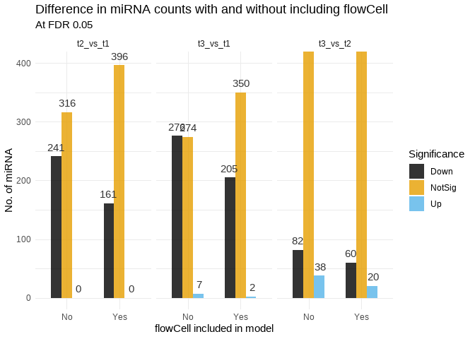<!-- -->


Plotting `pred-kno-miR-10871-3p` as an example:


```r
top_hit <- eNorm %>% 
  rownames_to_column(var = "sample") %>% 
  filter(sample == "pred-kno-miR-10871-3p") %>% 
  as.data.frame()

top_hit <- t(top_hit) %>% 
  as.data.frame()

top_hit <- top_hit %>% 
  rownames_to_column(var = "sample")

colnames (top_hit) [2] <- "count"

top_hit <- top_hit[-1,]

str(top_hit)
```

```
## 'data.frame':	30 obs. of  2 variables:
##  $ sample: chr  "MX1303-C5JC4ACXX-3-TAGGAT" "MX1304-C5JC4ACXX-4-CCGGTG" "MX1305-C5JC4ACXX-5-TGTTGG" "MX1306-C5JC4ACXX-6-GTATAG" ...
##  $ count : chr  "102196" "114598" "113269" "183205" ...
```

```r
top_hit <- top_hit %>% 
  mutate(count = as.character(count)) %>% 
  mutate(count = as.numeric(count))

top_hit <- top_hit %>% 
  mutate(log = log10(count))

pDat <- pDat %>% 
  rownames_to_column(var = "sample")

top_hit <- top_hit %>% 
  inner_join(pDat, by = "sample") %>% 
  mutate(GA = as.numeric(GA)) %>% 
  dplyr::arrange(GA) %>% 
  rowid_to_column(var = "IDs")

pDat <- pDat %>% 
  column_to_rownames(var = "sample")

top_hit <- top_hit [c(1:4,9,11,12,13,15)]

nb_cols <- 30
mycols <- colorRampPalette(brewer.pal(8, "Set3"))(nb_cols)

top_hit %>%
  ggplot(aes (x = factor(IDs), y = log, colour = condition, shape = trimester)) +
  geom_point(size = 2.5) +
  scale_shape_manual(values=c(1, 17, 0)) +
  theme_minimal() +
  #theme(axis.text.x = element_text(angle = 90)) +
  my_theme +
  theme(legend.position = "bottom") +
  labs(title = "RPM Scaled Values of pred-kno-miR-10871-3p", 
        subtitle = "miRNA consistently highly DE between different trimesters and condition", 
        x ="Sample", y = "log10 RPM", caption = "Samples plotted as per increase in GA") +
  scale_color_manual(values = colpal1) +
  #scale_color_hue(guide = F ) +
  coord_cartesian(ylim= c(4,5.5))
```

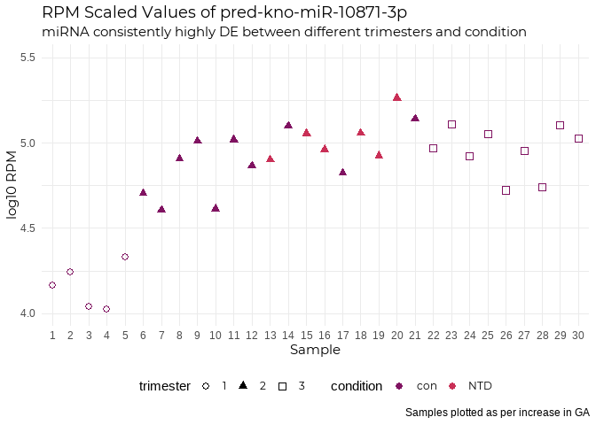<!-- -->

***  

#### 2.4 miRNA Biology  

The miRNAs are [annotated](https://academic.oup.com/nar/article/45/15/8731/3956630#96195884) by miRMaster as:  

+ **Known**: when the prediction is overlapping with a miRBase entry and both miRNAs are overlapping with known miRNAs by at least 75%.  
+ **Shifted known**: when the prediction is only partially overlapping with miRBase and only one miRNA is overlapping by at least 75% with a known miRNA.  
+ **One annotated**: when the prediction is overlapping with a miRBase entry, but only one miRNA is annotated for that entry and this one is overlapping by at least 75%.  
+ **Dissimilar overlapping**: when the prediction is overlapping with a miRBase entry, but the miRNAs are not overlapping with the annotated ones.  
+ **Half novel**: when the prediction is not overlapping with any miRBase entry, but contains at least 75% of one known miRNA.  
+ **Novel**: when the prediction is not overlapping with any miRBase entry and does not contain any known miRNA  


```r
controls_tri2v1_list <- controls_tri2v1_list %>% #joining sequencing info
  rownames_to_column("miRNA") %>% 
  inner_join(eInfo, by = "miRNA")

controls_tri2v1_list %>% #categories of the DEmiRNAs
  dplyr::select(Category) %>% 
  dplyr::count()
```

```
##     n
## 1 161
```

```r
#base::duplicated(controls_tri2_list$miRNA)


controls_tri3v1_list <- controls_tri3v1_list %>%
  rownames_to_column("miRNA") %>% 
  inner_join(eInfo, by = "miRNA")

controls_tri3v1_list %>% 
  dplyr::select(Category) %>% 
  dplyr::count()
```

```
##     n
## 1 207
```

```r
controls_tri3v2_list <- controls_tri3v2_list %>%
  rownames_to_column("miRNA") %>% 
  inner_join(eInfo, by = "miRNA")

controls_tri3v2_list %>% #categories of the DEmiRNAs
  dplyr::select(Category) %>% 
  dplyr::count()
```

```
##    n
## 1 80
```

```r
table(controls_tri2v1_list$miRNA %in% controls_tri3v1_list$miRNA) #common and unique DEmiRNAs in T2 and T3
```

```
## 
## FALSE  TRUE 
##     2   159
```

```r
table(controls_tri3v1_list$miRNA %in% controls_tri3v2_list$miRNA)
```

```
## 
## FALSE  TRUE 
##   184    23
```

```r
table(controls_tri3v2_list$miRNA %in% controls_tri2v1_list$miRNA)
```

```
## 
## FALSE  TRUE 
##    74     6
```

```r
common_tri <- controls_tri2v1_list %>% #common DE miRNAs in both T2 and T3
  semi_join(controls_tri3v1_list, by = "miRNA") %>% 
  semi_join(controls_tri3v2_list, by = "miRNA")

dim(common_tri)
```

```
## [1]  6 29
```

So, there are a 6 miRNAs with are commonly DE between trimester 1, 2 and 3.  


```r
common_tri$hsa_5p <- str_extract_all(common_tri$mirbase_5p, "hsa+[-](\\w+)[-](\\w+)[-](\\w+)")
common_tri$hsa_3p <- str_extract_all(common_tri$mirbase_3p, "hsa+[-](\\w+)[-](\\w+)[-](\\w+)")

common_tri %>% 
  ggplot(aes(x = miRNA, y = AveExpr, fill = Category)) +
  geom_bar(width = 0.6, stat = "identity") +
  my_theme +
  theme(axis.text.x = element_text(angle = 90)) +
  labs(title = "Commonly DEmiRNA between all 3 trimesters", subtitle = "", 
       y = "Average Expression") 
```

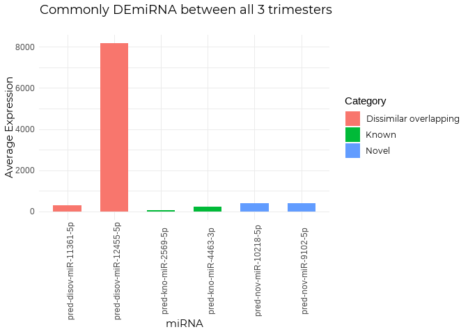<!-- -->

```r
  #facet_grid(~ chromosome)

common <- common_tri[c(1,2,3,6,9,10,13,18,23,30,31)]
str(common)
```

```
## 'data.frame':	6 obs. of  11 variables:
##  $ miRNA                : chr  "pred-disov-miR-12455-5p" "pred-nov-miR-10218-5p" "pred-nov-miR-9102-5p" "pred-disov-miR-11361-5p" ...
##  $ logFC                : num  -14109 -681 -662 -511 -293 ...
##  $ AveExpr              : num  8164 400 392 303 226 ...
##  $ adj.P.Val            : num  0.00612 0.00443 0.00444 0.01361 0.01212 ...
##  $ probability          : num  0.678 0.803 0.536 0.677 0.868 ...
##  $ predicted in #samples: num  706 132 1 706 698 702
##  $ novomirank_score     : num  0.812 0.749 1.033 0.961 0.579 ...
##  $ chromosome           : chr  "chr7" "chr4" "chr2" "chr5" ...
##  $ Category             : chr  "Dissimilar overlapping" "Novel" "Novel" "Dissimilar overlapping" ...
##  $ hsa_5p               :List of 6
##   ..$ : chr "hsa-miR-148a-3p"
##   ..$ : chr 
##   ..$ : chr 
##   ..$ : chr "hsa-miR-378a-3p"
##   ..$ : chr "hsa-miR-21-5p"
##   ..$ : chr "hsa-miR-758-5p"
##  $ hsa_3p               :List of 6
##   ..$ : chr "hsa-miR-148a-5p"
##   ..$ : chr 
##   ..$ : chr 
##   ..$ : chr "hsa-miR-378a-5p"
##   ..$ : chr "hsa-miR-21-3p"
##   ..$ : chr "hsa-miR-758-3p"
```

```r
common$hsa_5p <- as.character(common$hsa_5p)
common$hsa_3p <- as.character(common$hsa_3p)

paged_table(common)
```

<div data-pagedtable="false">
  <script data-pagedtable-source type="application/json">
{"columns":[{"label":["miRNA"],"name":[1],"type":["chr"],"align":["left"]},{"label":["logFC"],"name":[2],"type":["dbl"],"align":["right"]},{"label":["AveExpr"],"name":[3],"type":["dbl"],"align":["right"]},{"label":["adj.P.Val"],"name":[4],"type":["dbl"],"align":["right"]},{"label":["probability"],"name":[5],"type":["dbl"],"align":["right"]},{"label":["predicted in #samples"],"name":[6],"type":["dbl"],"align":["right"]},{"label":["novomirank_score"],"name":[7],"type":["dbl"],"align":["right"]},{"label":["chromosome"],"name":[8],"type":["chr"],"align":["left"]},{"label":["Category"],"name":[9],"type":["chr"],"align":["left"]},{"label":["hsa_5p"],"name":[10],"type":["chr"],"align":["left"]},{"label":["hsa_3p"],"name":[11],"type":["chr"],"align":["left"]}],"data":[{"1":"pred-disov-miR-12455-5p","2":"-14109.16349","3":"8164.16583","4":"0.006120487","5":"0.677815","6":"706","7":"0.811570","8":"chr7","9":"Dissimilar overlapping","10":"hsa-miR-148a-3p","11":"hsa-miR-148a-5p"},{"1":"pred-nov-miR-10218-5p","2":"-681.28917","3":"400.19313","4":"0.004434012","5":"0.803353","6":"132","7":"0.749415","8":"chr4","9":"Novel","10":"character(0)","11":"character(0)"},{"1":"pred-nov-miR-9102-5p","2":"-661.73588","3":"392.35096","4":"0.004439819","5":"0.535751","6":"1","7":"1.032750","8":"chr2","9":"Novel","10":"character(0)","11":"character(0)"},{"1":"pred-disov-miR-11361-5p","2":"-511.37412","3":"303.22860","4":"0.013610956","5":"0.677333","6":"706","7":"0.961329","8":"chr5","9":"Dissimilar overlapping","10":"hsa-miR-378a-3p","11":"hsa-miR-378a-5p"},{"1":"pred-kno-miR-4463-3p","2":"-292.64677","3":"225.67617","4":"0.012119330","5":"0.867826","6":"698","7":"0.578725","8":"chr17","9":"Known","10":"hsa-miR-21-5p","11":"hsa-miR-21-3p"},{"1":"pred-kno-miR-2569-5p","2":"-67.80305","3":"40.98482","4":"0.002133641","5":"0.828914","6":"702","7":"0.931065","8":"chr14","9":"Known","10":"hsa-miR-758-5p","11":"hsa-miR-758-3p"}],"options":{"columns":{"min":{},"max":[10]},"rows":{"min":[10],"max":[10]},"pages":{}}}
  </script>
</div>

Now, I wanted ot find out a little more about the miRNAs and which pathways they might be involved in (pathway enrichment). But, the biggest conundrum here is that:  

1. Not all miRNAs necessarilty map to genes; there are several that are present in intergenic regions. And if they're present in genes, they could also be affecting the gene it's present it, but also it might not. And furthermore, it oculd be modulating the expression of a completely unrelated genomic sequence far from its site of existence.  
2. If the miRNA does map to a gene, it could map to several genes. 1 gene itself can have several predicted fucntions and be involved and enriched in several pathways.  

I used the `miRBaseConverter` package to obtain the latest accession numbers for the common DEmiRNAs 


```r
hsa_common <- common %>% 
  mutate(hsa_5p_acc = miRNA_NameToAccession(hsa_5p,version ="v22"), 
         hsa_3p_acc = miRNA_NameToAccession(common$hsa_3p,version="v22"),
         hsa_5p_precursor = miRNA_MatureToPrecursor(common$hsa_5p,version="v22"),
         hsa_3p_precursor = miRNA_MatureToPrecursor(common$hsa_3p,version="v22"))

#result is a nx2 matrix inside a single column. Will need to unlink the matrix into two separate columns

hsa_common <- do.call(data.frame, hsa_common)

hsa_common <- hsa_common %>% 
  dplyr::select(miRNA, hsa_5p, hsa_3p, everything())

paged_table(hsa_common)
```

<div data-pagedtable="false">
  <script data-pagedtable-source type="application/json">
{"columns":[{"label":["miRNA"],"name":[1],"type":["chr"],"align":["left"]},{"label":["hsa_5p"],"name":[2],"type":["chr"],"align":["left"]},{"label":["hsa_3p"],"name":[3],"type":["chr"],"align":["left"]},{"label":["logFC"],"name":[4],"type":["dbl"],"align":["right"]},{"label":["AveExpr"],"name":[5],"type":["dbl"],"align":["right"]},{"label":["adj.P.Val"],"name":[6],"type":["dbl"],"align":["right"]},{"label":["probability"],"name":[7],"type":["dbl"],"align":["right"]},{"label":["predicted.in..samples"],"name":[8],"type":["dbl"],"align":["right"]},{"label":["novomirank_score"],"name":[9],"type":["dbl"],"align":["right"]},{"label":["chromosome"],"name":[10],"type":["chr"],"align":["left"]},{"label":["Category"],"name":[11],"type":["chr"],"align":["left"]},{"label":["hsa_5p_acc.miRNAName_v22"],"name":[12],"type":["chr"],"align":["left"]},{"label":["hsa_5p_acc.Accession"],"name":[13],"type":["chr"],"align":["left"]},{"label":["hsa_3p_acc.miRNAName_v22"],"name":[14],"type":["chr"],"align":["left"]},{"label":["hsa_3p_acc.Accession"],"name":[15],"type":["chr"],"align":["left"]},{"label":["hsa_5p_precursor.OriginalName"],"name":[16],"type":["chr"],"align":["left"]},{"label":["hsa_5p_precursor.Precursor"],"name":[17],"type":["chr"],"align":["left"]},{"label":["hsa_3p_precursor.OriginalName"],"name":[18],"type":["chr"],"align":["left"]},{"label":["hsa_3p_precursor.Precursor"],"name":[19],"type":["chr"],"align":["left"]}],"data":[{"1":"pred-disov-miR-12455-5p","2":"hsa-miR-148a-3p","3":"hsa-miR-148a-5p","4":"-14109.16349","5":"8164.16583","6":"0.006120487","7":"0.677815","8":"706","9":"0.811570","10":"chr7","11":"Dissimilar overlapping","12":"hsa-miR-148a-3p","13":"MIMAT0000243","14":"hsa-miR-148a-5p","15":"MIMAT0004549","16":"hsa-miR-148a-3p","17":"hsa-mir-148a","18":"hsa-miR-148a-5p","19":"hsa-mir-148a"},{"1":"pred-nov-miR-10218-5p","2":"character(0)","3":"character(0)","4":"-681.28917","5":"400.19313","6":"0.004434012","7":"0.803353","8":"132","9":"0.749415","10":"chr4","11":"Novel","12":"character(0)","13":"NA","14":"character(0)","15":"NA","16":"character(0)","17":"NA","18":"character(0)","19":"NA"},{"1":"pred-nov-miR-9102-5p","2":"character(0)","3":"character(0)","4":"-661.73588","5":"392.35096","6":"0.004439819","7":"0.535751","8":"1","9":"1.032750","10":"chr2","11":"Novel","12":"character(0)","13":"NA","14":"character(0)","15":"NA","16":"character(0)","17":"NA","18":"character(0)","19":"NA"},{"1":"pred-disov-miR-11361-5p","2":"hsa-miR-378a-3p","3":"hsa-miR-378a-5p","4":"-511.37412","5":"303.22860","6":"0.013610956","7":"0.677333","8":"706","9":"0.961329","10":"chr5","11":"Dissimilar overlapping","12":"hsa-miR-378a-3p","13":"MIMAT0000732","14":"hsa-miR-378a-5p","15":"MIMAT0000731","16":"hsa-miR-378a-3p","17":"hsa-mir-378a","18":"hsa-miR-378a-5p","19":"hsa-mir-378a"},{"1":"pred-kno-miR-4463-3p","2":"hsa-miR-21-5p","3":"hsa-miR-21-3p","4":"-292.64677","5":"225.67617","6":"0.012119330","7":"0.867826","8":"698","9":"0.578725","10":"chr17","11":"Known","12":"hsa-miR-21-5p","13":"MIMAT0000076","14":"hsa-miR-21-3p","15":"MIMAT0004494","16":"hsa-miR-21-5p","17":"hsa-mir-21","18":"hsa-miR-21-3p","19":"hsa-mir-21"},{"1":"pred-kno-miR-2569-5p","2":"hsa-miR-758-5p","3":"hsa-miR-758-3p","4":"-67.80305","5":"40.98482","6":"0.002133641","7":"0.828914","8":"702","9":"0.931065","10":"chr14","11":"Known","12":"hsa-miR-758-5p","13":"MIMAT0022929","14":"hsa-miR-758-3p","15":"MIMAT0003879","16":"hsa-miR-758-5p","17":"hsa-mir-758","18":"hsa-miR-758-3p","19":"hsa-mir-758"}],"options":{"columns":{"min":{},"max":[10]},"rows":{"min":[10],"max":[10]},"pages":{}}}
  </script>
</div>

Of these 6, 2 are known and annotated miRNAs, while 2 are Dissimilar Overlapping, and the last 2 are categorised as Novel. And all 6 are present on different chromosomes.  

Plotting the expression of 6 miRNA:


```r
eNorm <- eNorm %>% 
  rownames_to_column(var = "miRNA")

pDat <- pDat %>% 
  rownames_to_column(var = "Sample")

common_tri_info <- hsa_common [-c(4:19)]

common_tri_info <- common_tri_info %>% 
  mutate_all(funs(replace(., .== "character(0)", NA))) #replacing novel miRNA names with NA
```

```
## Warning: `funs()` was deprecated in dplyr 0.8.0.
## Please use a list of either functions or lambdas: 
## 
##   # Simple named list: 
##   list(mean = mean, median = median)
## 
##   # Auto named with `tibble::lst()`: 
##   tibble::lst(mean, median)
## 
##   # Using lambdas
##   list(~ mean(., trim = .2), ~ median(., na.rm = TRUE))
```

```r
str(common_tri_info)
```

```
## 'data.frame':	6 obs. of  3 variables:
##  $ miRNA : chr  "pred-disov-miR-12455-5p" "pred-nov-miR-10218-5p" "pred-nov-miR-9102-5p" "pred-disov-miR-11361-5p" ...
##  $ hsa_5p: chr  "hsa-miR-148a-3p" NA NA "hsa-miR-378a-3p" ...
##  $ hsa_3p: chr  "hsa-miR-148a-5p" NA NA "hsa-miR-378a-5p" ...
```

```r
common_tri_info$miRNA <- as.character(common_tri_info$miRNA)

#Here, we have both 5p and 3p precursors, but we need to keep the only one that is denoted by the specific miRNA. Making a separate column showing which precursor we want  
common_tri_info <- common_tri_info %>% 
  mutate(End = case_when(
    endsWith(miRNA, "5p") ~ "5p",
    endsWith(miRNA, "3p") ~ "3p"
  ))

#Now, to make the variable having the right name of the miRNA
common_tri_info <- common_tri_info %>% 
  mutate(precursor = str_sub(hsa_5p, end = -4)) %>% 
  unite("full_name", precursor:End, sep = "-") 

#Replacing the novel ones with NA again, and then filling those cells in with the miRMaster predicted name for that miRNA
common_tri_info <- common_tri_info %>% 
  mutate_all(funs(replace(., .== "NA-5p", NA))) %>% 
  mutate(full_name = coalesce(full_name, miRNA))

#Adding the expression values of the 6 miRNAs
common_tri_info <- common_tri_info %>% 
  inner_join(eNorm, by = "miRNA") %>% 
  dplyr::select(-c(hsa_3p, hsa_5p, miRNA))

colnames(common_tri_info) [1] <- "miRNA"

common_tri_info <- common_tri_info %>% 
  column_to_rownames(var = "miRNA")

common_tri_edat <- as.data.frame(t(common_tri_info))

common_tri_edat <- common_tri_edat %>% 
  rownames_to_column(var = "Sample")

common_tri_edat <- common_tri_edat %>% 
  inner_join(pDat, by = "Sample")

common_tri_edat <- common_tri_edat [-c(8,9,10,18:36)]

#library (xlsx)
#write.xlsx(common_tri_edat, file = "Z:/Nikita/Projects/snc_placenta/data/processed/BIGX_DEmiRNA.xlsx", col.names = TRUE, row.names = TRUE, append = FALSE)  
```


```r
common_tri_edat <- common_tri_edat %>% 
  mutate(GA = as.numeric(GA)) %>% 
  dplyr::arrange(GA)  %>% 
  rowid_to_column(var = "IDs") %>% 
  pivot_longer(cols = 3:8, names_to = "miRNA", values_to = "Expression")

cbPalette2 <- c("#CC79A7", "#999999", "#E69F00", "#0072B2" , "#009E73", "#D55E00")
#pie(rep(1, 6), col = cbPalette2)

common_tri_edat %>%
  ggplot(aes (x = factor(IDs), y = log10(Expression), colour = miRNA, group = miRNA)) +
  geom_point(size = 1) +
  geom_line() +
  geom_smooth(method = lm, se = FALSE) +
  scale_colour_manual(values = cbPalette2) +
  theme_minimal() +
  my_theme +
  theme(legend.position = "bottom") +
  labs(title = "RPM Scaled Values of the 6 DE miRNA", 
        subtitle = "FDR < 0.05", 
        x ="Sample", y = "log10 RPM", caption = "Samples plotted as per increase in GA")
```

```
## `geom_smooth()` using formula 'y ~ x'
```

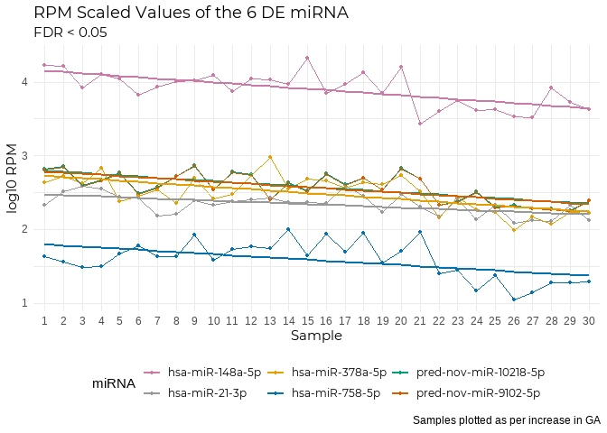<!-- -->

```r
common_tri_edat %>%
  ggplot(aes (x = factor(miRNA), y = log10(Expression), fill = trimester)) +
  geom_boxplot() +
  scale_fill_manual(values = cbPalette2) +
  theme_minimal() +
  my_theme +
  theme(axis.text.x = element_text(angle = 10, hjust = 1)) +
  theme(legend.position = c(1, 1),legend.justification = c("right", "top")) +
  labs(title = "RPM Scaled Values of the 6 DE miRNA", 
       subtitle = "Samples: T1 = 5, T2 = 16, T3 = 9", 
       x ="miRNA", y = "log10 RPM", caption = "FDR < 0.05") 
```

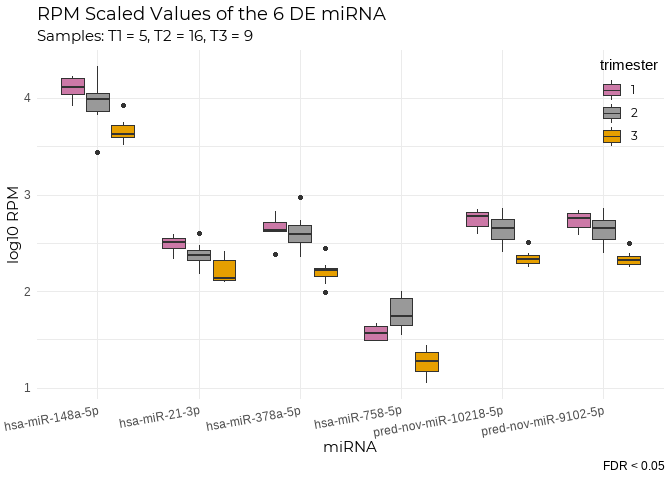<!-- -->

```r
#facet_grid(~miRNA)
```

Let's see what information the online datatbases have for these miRNAs. When input into [miRbase](mirbase.org), for the known miRNAs, we get a bunch of information including its sequence, publications the miRNA has been mentioned in, the external links to other databases. [HGNC](https://www.genenames.org/) is a good place to start as it provides all of the relevant information and links related to the miRNA in question.  

I personally like [Genecards](genecards.org) as it lists out a comprehensive summary of the query. From that website, when input for the miRNAs, the description is as follows: 


1. [hsa-miR-148a](https://www.genecards.org/cgi-bin/carddisp.pl?id_type=hgnc&id=31535): seen to be associated with brain cancer and the Notch signalling pathway. No direct links to its expression in the placenta -  but a quick [PubMed search](https://pubmed.ncbi.nlm.nih.gov/?term=%22miR-148a%22+AND+%22placenta%22) showed that this miRNA has indeed been observed to show some placental expression in animal model studies, and also in Pre-eclampsia samples.  

2. [hsa-miR-378](https://www.genecards.org/cgi-bin/carddisp.pl?id_type=hgnc&id=31871): interestingly there is some experssion observed in skeletal muscle. PubMed lead to only [1 paper](https://pubmed.ncbi.nlm.nih.gov/22454525/) coming up, however the paper is question quotes *miR-378a-5p was detected in human placenta throughout different stages of gestation and in preterm pregnancies, placental miR-378a-5p levels were lower in preeclamptic patients than in healthy controls.*  

3. [hsa-miR-21](https://www.omim.org/entry/611020) - has the most documented evidence so far in terms of expression profiling.  

4. [hsa-miR-758](https://www.genecards.org/cgi-bin/carddisp.pl?id_type=hgnc&id=33133#publications) gives no results on PubMed for expression in the placenta, but has been catalogued in several other cancers/disorders.  


As alluded to above, one miRNA can have several targets. I took the example of one of the known commonly DEmiRNA (*hsa_miR-785-5p*) from the above 6, in order to explain this.    


```r
exp <- get_multimir(mirna="hsa-miR-758-5p", summary=TRUE, legacy.out=TRUE)
```

```
## Searching mirecords ...
## Searching mirtarbase ...
## Searching tarbase ...
```

```r
sum <- exp$summary
val <- exp$validated

exp_genes <- sum %>% 
  dplyr::select(target_symbol) %>% 
  dplyr::count()

nrow(exp_genes) #63
```

```
## [1] 1
```

```r
head(exp_genes)
```

```
##    n
## 1 66
```

This shows that the miRNA *hsa-miR-758-5p* is associated with *63 genes*. Now, selecting the *ABCF2* gene as an example, I'll check the GO terms associated with it.  


```r
test_gene <- sum %>% 
  filter(target_symbol == "ABCF2")

gene = "ABCF2"

listMarts()
```

```
##                biomart                version
## 1 ENSEMBL_MART_ENSEMBL      Ensembl Genes 101
## 2   ENSEMBL_MART_MOUSE      Mouse strains 101
## 3     ENSEMBL_MART_SNP  Ensembl Variation 101
## 4 ENSEMBL_MART_FUNCGEN Ensembl Regulation 101
```

```r
mart = useMart("ensembl", dataset="hsapiens_gene_ensembl")
go <- getBM (attributes = c("ensembl_gene_id", "go_id","name_1006", "namespace_1003"), values = gene, mart= mart)
```

```
## Warning: `select_()` is deprecated as of dplyr 0.7.0.
## Please use `select()` instead.
## This warning is displayed once every 8 hours.
## Call `lifecycle::last_warnings()` to see where this warning was generated.
```

```
## Warning: `filter_()` is deprecated as of dplyr 0.7.0.
## Please use `filter()` instead.
## See vignette('programming') for more help
## This warning is displayed once every 8 hours.
## Call `lifecycle::last_warnings()` to see where this warning was generated.
```

```
## Cache found
```

```r
#m <- listAttributes(mart)

test_gene <- test_gene %>% 
  left_join(go, by = c ("target_ensembl" = "ensembl_gene_id"))

test_gene
```

```
##   mature_mirna_acc mature_mirna_id target_symbol target_entrez  target_ensembl
## 1     MIMAT0022929  hsa-miR-758-5p         ABCF2         10061 ENSG00000033050
## 2     MIMAT0022929  hsa-miR-758-5p         ABCF2         10061 ENSG00000033050
## 3     MIMAT0022929  hsa-miR-758-5p         ABCF2         10061 ENSG00000033050
## 4     MIMAT0022929  hsa-miR-758-5p         ABCF2         10061 ENSG00000033050
## 5     MIMAT0022929  hsa-miR-758-5p         ABCF2         10061 ENSG00000033050
##   mirtarbase      go_id          name_1006     namespace_1003
## 1          1 GO:0005524        ATP binding molecular_function
## 2          1 GO:0016887    ATPase activity molecular_function
## 3          1 GO:0016020           membrane cellular_component
## 4          1 GO:0000166 nucleotide binding molecular_function
## 5          1
```

```r
#test_gene %>% 
 # filter(!namespace_1003 == "") %>% 
  #ggplot(aes(x = name_1006, fill = target_ensembl)) +
#  geom_bar(stat = "count") +
#  my_theme +
#  #theme(legend.position = "none") +
#  labs(title = "GO Terms associated with the gene ABCF1", subtitle = "Colours represent the three GO Classes", 
 #      x = "GO Term", y = "Count") +
#  coord_flip()
```

This shows that just the 1 gene out of the 63 is associated with 4 GO terms. Given the remaining 62 genes associated with just 1 miRNA, the predicted number of all genes interacting with the 5 other miRNAs is quite high.  


