---
title: "Exploring Methylation Data + sncRNA Data" 
author: Nikita Telkar 
date: "December 7, 2020"
output: 
  html_document: 
    keep_md: yes 
    toc: true 
    toc_depth: 4
    theme: cosmo  #cosmo, paper, lumen, sandstone, simplex, yeti; cerulean, journal, flatly, darkly, readable, spacelab, united
    highlight: zenburn #tango, pygments, kate, monochrome, espresso, zenburn, haddock, textmate.
---  

***  

### 0.0 Introduction  

Here, I'll check if there's any correlation between sncRNA data and DNAm data for the 30 chorionic villi samples from [Magda's project](https://pubmed.ncbi.nlm.nih.gov/26889207/).   

Separate sncRNA Analysis is located in [snc_placenta](../Projects/snc_placenta) *Z : \ Nikita \ Projects \ snc_placenta*.    

*** 

### 1.0 Libraries and Data Cleanup  


```r
library(dplyr)
library(plyr)
library(tidyr)
library(tibble)
library(here) 
library(readxl)
library(rmarkdown)
library(knitr)
library(stringr)
library(DT)
library(kableExtra)
library(formatR)
library(forcats)
library(janitor)
library(scales)
library(Rsamtools)
library(ggplot2)
library(ggpubr)
library(RColorBrewer)
library(reshape2)
library(showtext)


font_add_google("Montserrat", "Mont")
showtext_auto()

my_theme <- theme_minimal() +
  theme(plot.title = element_text(family = "Mont", size = 14),
        plot.subtitle = element_text(family = "Mont", size = 12),
        legend.text = element_text(family = "Mont", size = 10),
        axis.title = element_text(family = "Mont", size = 14))

my_theme_2 <-theme (plot.title = element_text(family = "Mont", size = 14),
                    plot.subtitle = element_text(family = "Mont", size = 12),
                    legend.text = element_text(family = "Mont", size = 10),
                    axis.title = element_text(family = "Mont", size = 14),
                    strip.text.x = element_text("Mont", size = 10))
```


```r
mSet <- readRDS(file = here::here("R", "ntd_methyl_eDat.RDS"))

mSet_pDat <- readRDS(file = here::here("R", "ntd_methyl_pDat.RDS"))

#EPIC_pDat <- read.csv(file = 'HumanMethylation450_15017482_v1-2.csv')
EPIC_pDat <- readRDS(file = here::here("R", "EPIC_pDat.RDS"))

snc_eDat <- read_xlsx(here::here("data", "processed", "snc_placenta_rob_eDat.xlsx")) 

snc_pDat <- read_xlsx(here::here("data", "processed", "snc_placenta_rob_pDat.xlsx"))

snc_mDat <- read_xlsx(here::here("data", "external", "predictions.xlsx"))
```

**Data:**

DNAm: 179 samples including villi, brain, spinal cord, muscle, and kidney samples.  
sncRNA: 30 villi Samples of the above 179 (description can be found in the previous analysis under snc_placenta).  


| Object Name | Description | 
|--|---|  
| mSet | DNAm expression dataset for the 179 samples |  
| mSet_pDat | Clinical characteristics / phenotype file for the 179 samples |  
| snc_eDat | sncRNA expression dataset for the 30 samples |  
| snc_pDat | Clinical characteristics / phenotype file for the 30 samples |  
| snc_mDat | Meta data for the sncRNAs |  
| EPIC_pDat | Meta data fof the 450K array |  


```r
#names(mSet)
#Sample names are GEO Accession. snc_pDat has original Rob Lab sample names. Converting them -
mSet <- as.data.frame(mSet)

mSet_pDat <- mSet_pDat %>% 
  mutate_if(is.factor, as.character)

#mSet_pDat <- lapply(mSet_pDat, function(x) { attributes(x) <- NULL; x })

mSet_pDat$ID <- mSet_pDat$title

mSet_pDat$ID <- gsub(pattern = "v", replacement = "cv", x = mSet_pDat$ID)

names(mSet) <- mSet_pDat$ID

#names(mSet)

#Now, let's match by sample name for the sncRNA samples nad the DNAm samples

pDat <- snc_pDat %>% 
  inner_join(mSet_pDat, by = "ID")
nrow(pDat)
```

```
## [1] 14
```

```r
samps <- pDat$ID

#only 14 of 30?

missing_samps <- snc_pDat %>% 
  anti_join(mSet_pDat, by = "ID")

eDat_mSet <- mSet %>% 
  dplyr::select(which(names(mSet) %in% pDat$ID))

names(snc_eDat) [2:31] <- snc_pDat$ID

colnames(snc_eDat) [1] <- "precursor"

eDat_RNA <- snc_eDat %>% 
  column_to_rownames(var = "precursor") %>% 
  dplyr::select(which(names(snc_eDat) %in% pDat$ID))
```


The top 6 hits we got for the Pilot Project were:  

1. pred-disov-miR-12455-5p  
2. pred-nov-miR-10218-5p  
3. pred-nov-miR-9102-5p  
4. pred-disov-miR-11361-5p  
5. pred-kno-miR-4463-3p  
6. pred-kno-miR-2569-5p  


```r
miRNAs <- snc_eDat %>% 
  filter(precursor == "pred-disov-miR-12455-5p" | precursor == "pred-nov-miR-10218-5p" | precursor == "pred-nov-miR-9102-5p" | precursor == "pred-disov-miR-11361-5p" | precursor == "pred-kno-miR-4463-3p" | precursor == "pred-kno-miR-2569-5p")

precursors <- as.data.frame(miRNAs$precursor)

colnames(precursors) [1] <- "precursor_name"

#joining mDat

precursors$precursor_name <- str_sub(precursors$precursor_name, end = -4)

precursors$precursor_name <- gsub('\\s+', '', precursors$precursor_name)

precursors_mDat <- precursors %>% 
  inner_join(snc_mDat, by = "precursor_name")

precursors_mDat <- merge(precursors, snc_mDat, by = "precursor_name")

#not joining?! of course, it's mir in one, and miR in the other

precursors$precursor_name <- gsub("miR", "mir",  precursors$precursor_name)
miRNAs$precursor <- gsub("miR", "mir", miRNAs$precursor)

precursors_mDat <- precursors %>% 
  inner_join(snc_mDat, by = "precursor_name")

precursors_mDat <- precursors_mDat %>% 
  mutate(upstream_10kb = start-10000) %>% 
  mutate(downstream_10kb = end+10000)

#which chromosomes do our miRNAs lie on?

precursors_mDat$chromosome
```

```
## [1] "chr4"  "chr5"  "chr7"  "chr14" "chr17" "chr2"
```

```r
#filter out probes belonging to these 6 chromosomes

chr2_probes <- EPIC_pDat %>% 
  filter(GRCh37_CHR == "2") %>% 
  dplyr::select(1:3)

chr4_probes <- EPIC_pDat %>% 
  filter(GRCh37_CHR == "4") %>% 
  dplyr::select(1:3)

chr5_probes <- EPIC_pDat %>% 
  filter(GRCh37_CHR == "5") %>% 
  dplyr::select(1:3)

chr7_probes <- EPIC_pDat %>% 
  filter(GRCh37_CHR == "7") %>% 
  dplyr::select(1:3)

chr14_probes <- EPIC_pDat %>% 
  filter(GRCh37_CHR == "14") %>% 
  dplyr::select(1:3)

chr17_probes <- EPIC_pDat %>% 
  filter(GRCh37_CHR == "17") %>% 
  dplyr::select(1:3)

miRNAs2 <- precursors_mDat [c(1,11,12,23,24)]
```

***

### 2.0 Matching Probes which are +/- 10KB from the 6 miRNAs  


```r
#pred-nov-mir-10218 in Chr 4

chr4_probes$up <- miRNAs2[1,4]
chr4_probes$down <- miRNAs2[1,5]

chr4_probes <- chr4_probes %>% 
  mutate(miRNA = "pred-nov-mir-10218") %>% 
  mutate(Found = factor(case_when(
    GRCh37_coordinate >= up & GRCh37_coordinate <= down ~ "YES",
    GRCh37_coordinate < up ~ "NO",
    GRCh37_coordinate > down ~ "NO"
  )
  ))

#pred-nov-mir-11361 in Chr 5

chr5_probes$up <- miRNAs2[2,4]
chr5_probes$down <- miRNAs2[2,5]

chr5_probes <- chr5_probes %>% 
   mutate(miRNA = "pred-nov-mir-11361") %>% 
  mutate(Found = factor(case_when(
    GRCh37_coordinate >= up & GRCh37_coordinate <= down ~ "YES",
    GRCh37_coordinate < up ~ "NO",
    GRCh37_coordinate > down ~ "NO"
  )
  ))

#pred-nov-mir-12455 in Chr 7

chr7_probes$up <- miRNAs2[3,4]
chr7_probes$down <- miRNAs2[3,5]

chr7_probes <- chr7_probes %>% 
  mutate(miRNA = "pred-nov-mir-12455") %>% 
  mutate(Found = factor(case_when(
    GRCh37_coordinate >= up & GRCh37_coordinate <= down ~ "YES",
    GRCh37_coordinate < up ~ "NO",
    GRCh37_coordinate > down ~ "NO"
  )
  ))


#pred-nov-mir-2569 in Chr 14

chr14_probes$up <- miRNAs2[4,4]
chr14_probes$down <- miRNAs2[4,5]

chr14_probes <- chr14_probes %>% 
  mutate(miRNA = "pred-nov-mir-2569") %>%
  mutate(Found = factor(case_when(
    GRCh37_coordinate >= up & GRCh37_coordinate <= down ~ "YES",
    GRCh37_coordinate < up ~ "NO",
    GRCh37_coordinate > down ~ "NO"
  )
  ))

#pred-nov-mir-4463 in Chr 17

chr17_probes$up <- miRNAs2[5,4]
chr17_probes$down <- miRNAs2[5,5]

chr17_probes <- chr17_probes %>% 
  mutate(miRNA = "pred-nov-mir-4463") %>%
  mutate(Found = factor(case_when(
    GRCh37_coordinate >= up & GRCh37_coordinate <= down ~ "YES",
    GRCh37_coordinate < up ~ "NO",
    GRCh37_coordinate > down ~ "NO"
  )
  ))


#pred-nov-mir-9102 in Chr 2

chr2_probes$up <- miRNAs2[6,4]
chr2_probes$down <- miRNAs2[6,5]

chr2_probes <- chr2_probes %>% 
  mutate(miRNA = "pred-nov-mir-9102") %>%
  mutate(Found = factor(case_when(
    GRCh37_coordinate >= up & GRCh37_coordinate <= down ~ "YES",
    GRCh37_coordinate < up ~ "NO",
    GRCh37_coordinate > down ~ "NO"
  )
  ))


Probes <- rbind(chr2_probes, chr4_probes, chr5_probes, chr7_probes, chr14_probes, chr17_probes)

Probes <- Probes %>% 
  filter(Found == "YES")

table(Probes$miRNA)
```

```
## 
## pred-nov-mir-11361 pred-nov-mir-12455  pred-nov-mir-2569  pred-nov-mir-4463 
##                 13                  1                 13                  1 
##  pred-nov-mir-9102 
##                 12
```


Okay, so 5 out the 6 miRNAs have probes within +/- 10KB of their position. Now, extracting the probe names of these 40 from the mSet.  


```r
eDat_mSet <- as.data.frame(eDat_mSet) %>% 
  rownames_to_column(var = "Name")

eDat_mSet <- eDat_mSet %>% 
  inner_join(Probes, by = "Name")

eDat_mSet <- eDat_mSet [-c(16:21)]

eDat_RNA <- miRNAs %>% 
  column_to_rownames(var = "precursor") %>% 
  dplyr::select(which((names(miRNAs) %in% pDat$ID)))
```


| Object Name | Description |  
|--|---|  
| eDat_mSet | DNAm expression dataset of probes present +/- 10 Kb of the 6 miRNAs in the 14 samples |    
| eDat_RNA | sncRNA expression of the 6 miRNAs in the 14 samples |  
| pDat | Combined clinical/phenotype data of the 14 samples from the mSet_pDat + snc_RNA_pDat  |   

***  

### 3.0 Assessing Correaltion between miRNA and DNAm expression      

#### 3.1 mir_11361_5p as an example  

I'm going to now join the miRNAs to the DNAm probes by sample ID.  


```r
eDat_RNA <- as.data.frame(t(eDat_RNA)) %>% 
   rownames_to_column(var = "ID")

#RM <-function(x){
#  mutate(Mean = rowMeans(.[,-1])) 
# }

names(eDat_RNA)
```

```
## [1] "ID"                      "pred-nov-mir-10218-5p"  
## [3] "pred-disov-mir-11361-5p" "pred-disov-mir-12455-5p"
## [5] "pred-kno-mir-2569-5p"    "pred-kno-mir-4463-3p"   
## [7] "pred-nov-mir-9102-5p"
```

```r
Probes$miRNA <-as.character(Probes$miRNA)

table(Probes$miRNA)
```

```
## 
## pred-nov-mir-11361 pred-nov-mir-12455  pred-nov-mir-2569  pred-nov-mir-4463 
##                 13                  1                 13                  1 
##  pred-nov-mir-9102 
##                 12
```


```r
mir_11361_5p <-  Probes %>% 
  filter(miRNA == "pred-nov-mir-11361") %>% 
  inner_join(eDat_mSet, by = "Name")  %>% 
  dplyr::select(!(2:7)) %>% 
  column_to_rownames(var = "Name")

dim(mir_11361_5p)
```

```
## [1] 13 14
```

```r
mir_11361_5p <- as.data.frame(t(mir_11361_5p)) 

mir_11361_5p <- mir_11361_5p  %>% 
  rownames_to_column(var = "ID") %>%
  mutate(Mean = rowMeans(.[,-1])) %>% 
  left_join(eDat_RNA, by = "ID")  %>% 
  dplyr::select(1:15, "pred-disov-mir-11361-5p") %>% #select by adding +2 to the number of samples (mean column + miRNA column)
  drop_na() %>% 
  pivot_longer(cols = 2:14, names_to = "Probe_name", values_to = "Probe_value") %>% #exclude c1 (ID), and the last two (mean and miRNA, hence 2:14)
  dplyr::rename(miRNA = 3) 
```

**By mean methylation for each probe**


```r
mir_11361_5p %>% 
  ggplot(aes_string(colnames(mir_11361_5p)[2], colnames(mir_11361_5p)[3])) + 
  geom_smooth(method = "lm", color = "#e67300",  fill = "#ffbf80") +
  geom_point() +
  labs(title = "pred-disov-mir-11361-5p", subtitle = "10 samples, 13 probes", x = "Mean Methylation", y = "miRNA expression", caption = "Chr 5") +
  my_theme_2
```

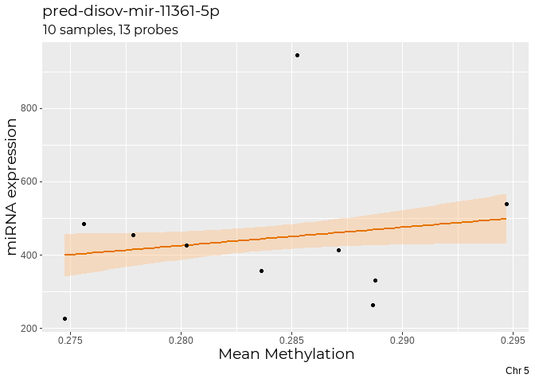<!-- -->

**By methylation for each probe separate**


```r
mir_11361_5p %>% 
  dplyr::arrange(desc(miRNA)) %>% 
  ggplot(aes(x = Probe_value, y = miRNA)) +
  geom_smooth(method = "lm", color = "#e67300",  fill = "#ffbf80") +
  geom_point() +
  coord_cartesian(x = c(0,1)) +
  labs(title = "pred-disov-mir-11361-5p", subtitle = "10 samples, 13 probes", x = "Methylation", y = "miRNA expression", caption = "Chr 5") +
  facet_wrap(~Probe_name, ncol = 3) +
  my_theme
```

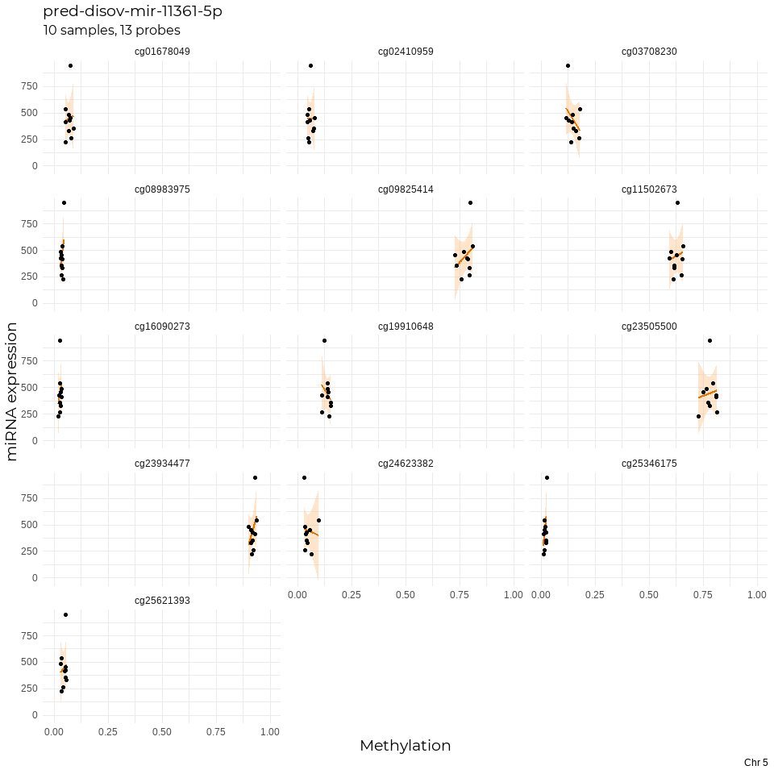<!-- -->

**By methylation for each probe together**


```r
mir_11361_5p %>% 
  dplyr::arrange(desc(Probe_value)) %>% 
  ggplot(aes(x = Probe_value,  y = miRNA)) +
  geom_smooth(method = "lm", color = "#e67300",  fill = "#ffbf80") +
  geom_point(aes(colour = Probe_name)) +
  coord_cartesian(x = c(0,1), y = c(0, 1000)) +
  labs(title = "pred-disov-mir-11361-5p", subtitle = "10 samples, 13 probes", x = "Methylation", y = "miRNA expression", caption = "Chr 5") +
  my_theme
```

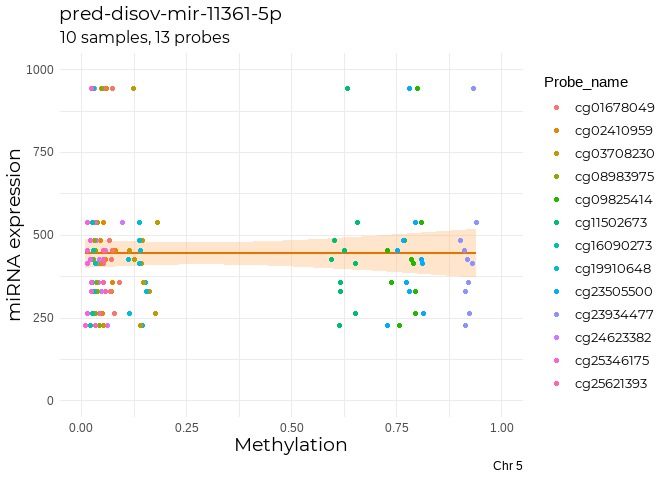<!-- -->


#### 3.2 Statistical Tests & Correaltion   

Let's see if the data on it's own follows a normal distribution.  


```r
shapiro.test(mir_11361_5p$Probe_value)  
```

```
## 
## 	Shapiro-Wilk normality test
## 
## data:  mir_11361_5p$Probe_value
## W = 0.71396, p-value = 1.354e-14
```

```r
shapiro.test(mir_11361_5p$miRNA)
```

```
## 
## 	Shapiro-Wilk normality test
## 
## data:  mir_11361_5p$miRNA
## W = 0.78856, p-value = 2.079e-12
```

It looks like the spread of the data for the DNAm expression and sncRNa expression columns on their own don't follow a normal distribution --> since this is a hypothesis test, a p-value of > 0.05 means that the distribution is nomrmal, and < 0.05 means that the hypothesis that is it a normal distribution is not rejected.    


```r
ggqqplot(mir_11361_5p$Probe_value)  
```

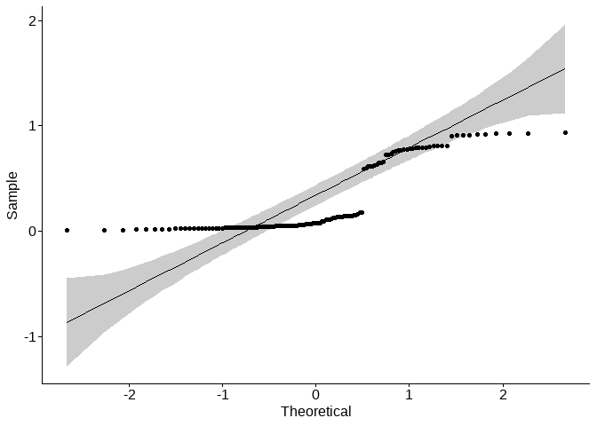<!-- -->

```r
ggqqplot(mir_11361_5p$miRNA)
```

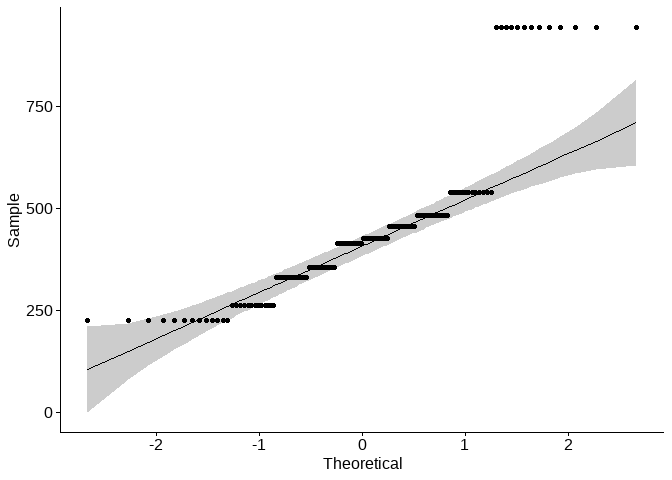<!-- -->

The qqplots show that the data doesn't follow normal distribution.  So, we'll use the **Spearman's rank correlation** non-parametric test. We're going to:  

1. Group the data by probes  
2. Calculate whether there is an association between the probe value and the miRNA value for each of the samples.  

#### 3.3 Spearman's Test  


```r
#function to compute the test using arbitary x and y
corfun <- function(x, y) {
  corr=(cor.test(x, y, method="spearman", exact = FALSE))
}

#function to apply and display spearman's test by grouping the probes together
spear <- function(x){
  ddply(x, .(Probe_name), 
        summarise, 
        "rho" = corfun(miRNA, Probe_value)$estimate, 
        "pval" = corfun(miRNA, Probe_value)$p.value
  )
}

#ddply(mir_11361_5p, .(Probe_name), summarise, corr = (cor.test(miRNA, Probe_value, method = "spearman")), "name" = names(corr))

mir_11361_5p <- mir_11361_5p %>% 
  spear() %>% 
  left_join(mir_11361_5p, by = "Probe_name") 

mir_11361_5p <- mir_11361_5p %>%
  dplyr::select(1,4:7, rho, pval)

head(mir_11361_5p)
```

```
##   Probe_name      ID      Mean   miRNA Probe_value        rho      pval
## 1 cg01678049 FT52_cv 0.2802386 426.683  0.07139544 0.01818182 0.9602404
## 2 cg01678049 FT60_cv 0.2947149 538.873  0.05301600 0.01818182 0.9602404
## 3 cg01678049 FT65_cv 0.2852580 944.562  0.07487582 0.01818182 0.9602404
## 4 cg01678049 FT41_cv 0.2747484 225.934  0.05258073 0.01818182 0.9602404
## 5 cg01678049 FT73_cv 0.2886500 263.153  0.07841936 0.01818182 0.9602404
## 6 cg01678049 FT74_cv 0.2778375 454.954  0.07432810 0.01818182 0.9602404
```

```r
mir_11361_5p %>% 
  dplyr::count(rho, pval)
```

```
##            rho      pval  n
## 1  -0.30909091 0.3848412 10
## 2  -0.24848485 0.4887763 10
## 3  -0.15151515 0.6760652 20
## 4  -0.01818182 0.9602404 20
## 5   0.01818182 0.9602404 10
## 6   0.04242424 0.9073638 10
## 7   0.20000000 0.5795840 10
## 8   0.24848485 0.4887763 10
## 9   0.30909091 0.3848412 20
## 10  0.43030303 0.2144923 10
```

This shows us that for each probe what the Spearman's coefficient (rho) is i.e. the strenght of correaltion between the miRNA expression and DNAm, and the p-value of the correlation. 

**Correlation coefficient is comprised between -1 and 1**:  

-1 indicates a strong negative correlation : this means that every time x increases, y decreases  
0 means that there is no association between the two variables  
1 indicates a strong positive correlation : this means that y increases with x  
  
A more stringent interpretation was found [here](https://www.ncbi.nlm.nih.gov/pmc/articles/PMC3576830/)  

| Size of Correlation | Interpretation |  
|--|----|  
| .90 to 1.00 (−.90 to −1.00) |	Very high positive (negative) correlation |  
| .70 to .90 (−.70 to −.90) |	High positive (negative) correlation |  
| .50 to .70 (−.50 to −.70)	| Moderate positive (negative) correlation |  
| .30 to .50 (−.30 to −.50)	| Low positive (negative) correlation |  
| .00 to .30 (.00 to −.30)	| Negligible correlation |  

Let's look at the distributions of our rho's and p-values:  


```r
g1 <- mir_11361_5p %>% 
  mutate(Significant = case_when(
    rho > 0.5 & pval < 0.05 ~ "Yes",
    rho > 0.5 & pval > 0.05 ~ "No",
    rho < -0.5 & pval < 0.05 ~ "Yes",
    rho < -0.5 & pval > 0.05 ~ "No",
    between(rho, -0.5, 0.5) & pval > 0.05 ~ "No"
  )
  ) %>% 
  ggplot(aes(x = rho, y = -log10(pval), colour = Significant)) +
  geom_point() +
  coord_cartesian(x=c(-1,1)) +
  geom_vline(xintercept = c(-0.5, 0.5), color = "#999999") +
  geom_hline(yintercept = c(-log10(0.05)), color = "#999999") +
  scale_colour_manual(values = c("#333333", "#0099ff"), guide=F) +
  labs(title = "pred-disov-mir-11361-5p Correlation", subtitle = "10 samples, 13 probes", x = "Spearman's Coeeficient (rho)", y = "-log10Pvalue", caption = "Chr 5") +
  my_theme
 
g1
```

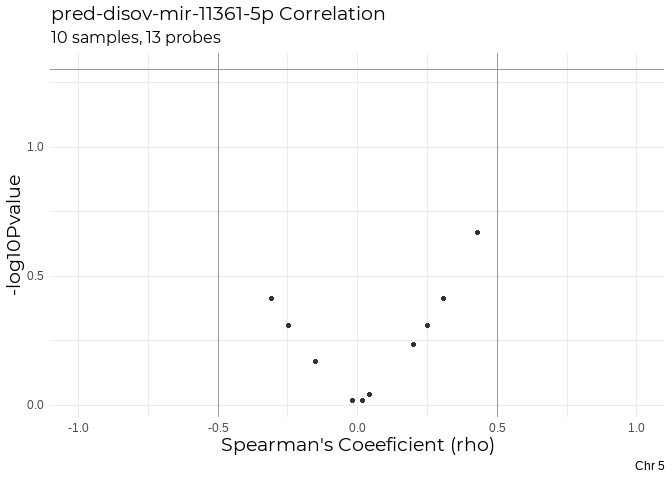<!-- -->

As we can see, none of the probes have a significant pvalue (>0.05), and Spearman's coefficient (rho) all are tending towards zero, indicating no significant correaltion in expression between the miRNA and DNAm.  

#### 3.3 Remaining 4 miRNAs  

Now, applying the same for the remaing 4 miRNAs  


```r
mir_12455_5p <-  Probes %>% 
  filter(miRNA == "pred-nov-mir-12455") %>% 
  inner_join(eDat_mSet, by = "Name")  %>% 
  dplyr::select(!(2:7)) %>% 
  column_to_rownames(var = "Name")

dim(mir_12455_5p)
```

```
## [1]  1 14
```

```r
mir_12455_5p <- as.data.frame(t(mir_12455_5p)) 

mir_12455_5p <- mir_12455_5p  %>% 
  rownames_to_column(var = "ID") %>% 
  left_join(eDat_RNA, by = "ID")  %>% 
  dplyr::select(1,2, "pred-disov-mir-12455-5p") %>% 
  drop_na() %>% 
  #mutate(Probe_name = colnames(mir_12455_5p)[2]) doesn't work for whatever reason
  mutate(Probe_name = "cg07953845") %>% 
  dplyr::rename(Probe_value = 2, miRNA = 3) %>% 
  mutate(Mean = miRNA) %>% 
  dplyr::select(1,5,3,4,2)
  
mir_12455_5p %>% 
  dplyr::arrange(desc(miRNA)) %>% 
  ggplot(aes(x = Probe_value, y = miRNA)) +
  geom_smooth(method = "lm", color = "#e67300",  fill = "#ffbf80") +
  geom_point() +
  coord_cartesian(x = c(0,1)) +
  labs(title = "pred-disov-mir-12455-5p", subtitle = "10 samples, 1 probe", caption = "Chr 7", x = "Methylation", y = "miRNA expression") +
  facet_wrap(~Probe_name, ncol = 3) +
  my_theme
```

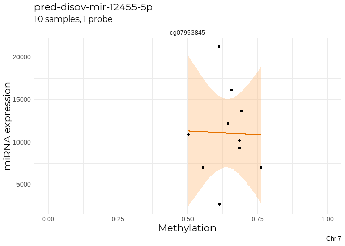<!-- -->

```r
# g_mir_12455_5p <- mir_12455_5p %>% 
#   ggplot(aes(x = colnames(g_mir_12455_5p)[2], y = miRNA)) +
#   geom_smooth(method = "lm", color = "#e67300",  fill = "#ffbf80") +
#   geom_point() +
#   labs(title = "pred-disov-mir-12455-5p", subtitle = "10 samples, 1 probe", caption = "Chr 7") +
#   my_theme
```


```r
mir_2569_5p <-  Probes %>% 
  filter(miRNA == "pred-nov-mir-2569")  %>% 
  inner_join(eDat_mSet, by = "Name")  %>% 
  dplyr::select(!(2:7)) %>% 
  column_to_rownames(var = "Name")

dim(mir_2569_5p)
```

```
## [1] 13 14
```

```r
mir_2569_5p <- as.data.frame(t(mir_2569_5p)) 

mir_2569_5p <- mir_2569_5p  %>% 
  rownames_to_column(var = "ID") %>%
  mutate(Mean = rowMeans(.[,-1])) %>%  
  left_join(eDat_RNA, by = "ID")  %>% 
  dplyr::select(1:15, "pred-kno-mir-2569-5p") %>% 
  drop_na() %>% 
  pivot_longer(cols = 2:14, names_to = "Probe_name", values_to = "Probe_value") %>% 
  dplyr::rename(miRNA = 3)

mir_2569_5p %>% 
  dplyr::arrange(desc(miRNA)) %>% 
  ggplot(aes(x = Probe_value, y = miRNA)) +
  geom_smooth(method = "lm", color = "#e67300",  fill = "#ffbf80") +
  geom_point() +
  coord_cartesian(x = c(0,1)) +
  labs(title = "pred-kno-mir-2569-5p", subtitle = "10 samples, 13 probes", caption = "Chr 14", x = "Methylation", y = "miRNA expression") +
  facet_wrap(~Probe_name, ncol = 3) +
  my_theme
```

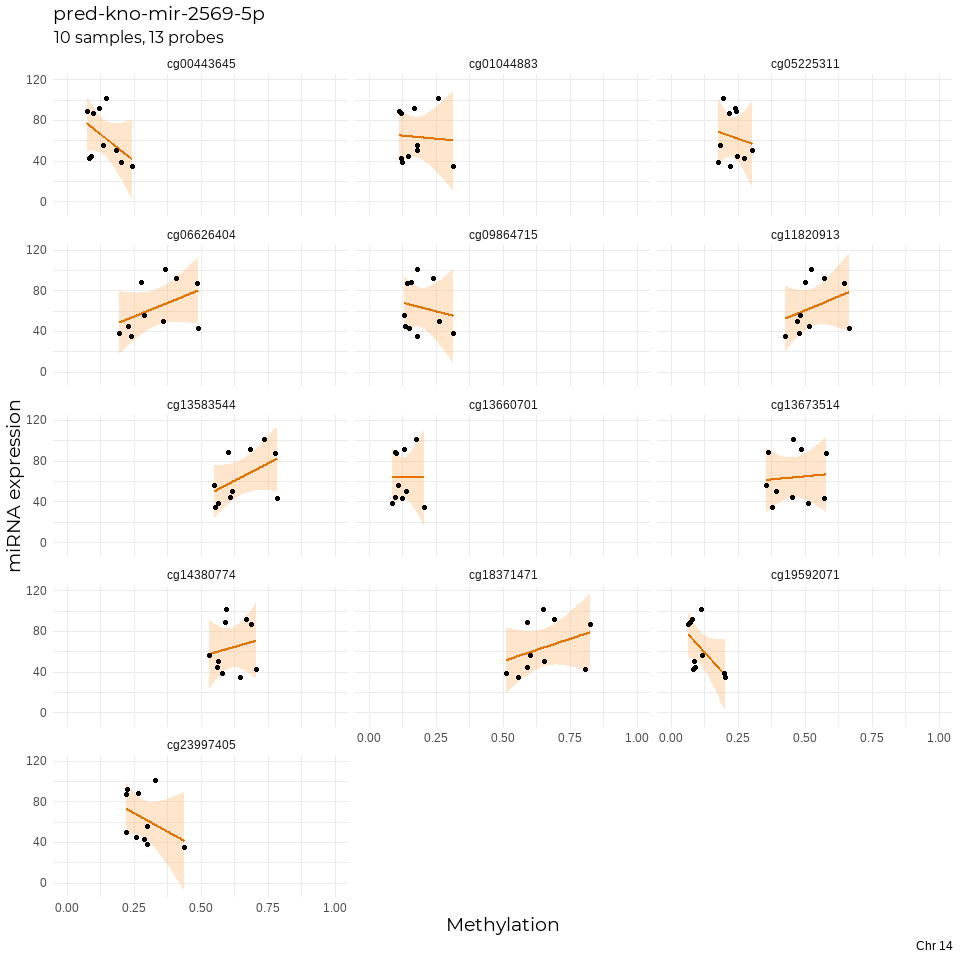<!-- -->

```r
 # mir_2569_5p %>% 
 #  ggplot(aes_string(x = colnames(g_mir_2569_5p)[2], y = miRNA)) +
 #  geom_smooth(method = "lm", color = "#e67300",  fill = "#ffbf80") +
 #  geom_point() +
 #  labs(title = "pred-kno-mir-2569-5p", subtitle = "10 samples, 13 probes", caption = "Chr 14") +
 #  my_theme
```


```r
mir_4463_3p <-  Probes %>% 
  filter(miRNA == "pred-nov-mir-4463")  %>% 
  inner_join(eDat_mSet, by = "Name") %>% 
  dplyr::select(!(2:7)) %>% 
  column_to_rownames(var = "Name")

dim(mir_4463_3p)
```

```
## [1]  1 14
```

```r
mir_4463_3p <- as.data.frame(t(mir_4463_3p)) 

mir_4463_3p <- mir_4463_3p  %>% 
  rownames_to_column(var = "ID") %>%
  left_join(eDat_RNA, by = "ID")  %>% 
  dplyr::select(1,2, "pred-kno-mir-4463-3p") %>% 
  drop_na() %>% 
  mutate(Probe_name = "cg13844248") %>% 
  dplyr::rename(Probe_value = 2, miRNA = 3) %>% 
  mutate(Mean = miRNA) %>% 
  dplyr::select(1,5,3,4,2)

mir_4463_3p %>% 
  dplyr::arrange(desc(miRNA)) %>% 
  ggplot(aes(x = Probe_value, y = miRNA)) +
  geom_smooth(method = "lm", color = "#e67300",  fill = "#ffbf80") +
  geom_point() +
  coord_cartesian(x = c(0,1)) +
  labs(title = "pred-kno-mir-4463-3p", subtitle = "10 samples, 1 probe", caption = "Chr 17", x = "Methylation", y = "miRNA expression") +
  facet_wrap(~Probe_name, ncol = 3) +
  my_theme
```

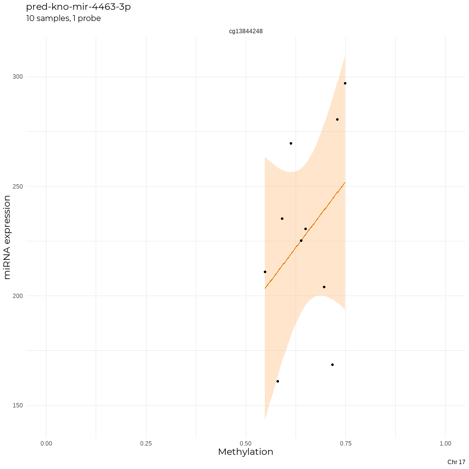<!-- -->

```r
# g_mir_4463_5p <- mir_4463_3p %>% 
#   ggplot(aes(x = cg13844248, y = `pred-kno-mir-4463-3p`)) +
#   geom_smooth(method = "lm", color = "#e67300",  fill = "#ffbf80") +
#   geom_point() +
#   labs(title = "pred-kno-mir-4463-3p", subtitle = "10 samples, 1 probe", caption = "Chr 17") +
#   my_theme
```


```r
mir_9102_5p <-  Probes %>% 
  filter(miRNA == "pred-nov-mir-9102") %>% 
  inner_join(eDat_mSet, by = "Name")  %>% 
  dplyr::select(!(2:7)) %>% 
  column_to_rownames(var = "Name")

dim(mir_9102_5p)
```

```
## [1] 11 14
```

```r
mir_9102_5p <- as.data.frame(t(mir_9102_5p)) 

mir_9102_5p <- mir_9102_5p  %>% 
  rownames_to_column(var = "ID") %>%
  mutate(Mean = rowMeans(.[,-1])) %>%  
  left_join(eDat_RNA, by = "ID")  %>% 
  dplyr::select(1:13, "pred-nov-mir-9102-5p") %>% 
  drop_na() %>% 
  pivot_longer(cols = 2:12, names_to = "Probe_name", values_to = "Probe_value") %>% 
  dplyr::rename(miRNA = 3)

mir_9102_5p %>% 
  dplyr::arrange(desc(miRNA)) %>% 
  ggplot(aes(x = Probe_value, y = miRNA)) +
  geom_smooth(method = "lm", color = "#e67300",  fill = "#ffbf80") +
  geom_point() +
  coord_cartesian(x = c(0,1)) +
  labs(title = "pred-nov-mir-9102-5p", subtitle = "10 samples, 11 probes", caption = "Chr 2", x = "Methylation", y = "miRNA expression") +
  facet_wrap(~Probe_name, ncol = 3) +
  my_theme
```

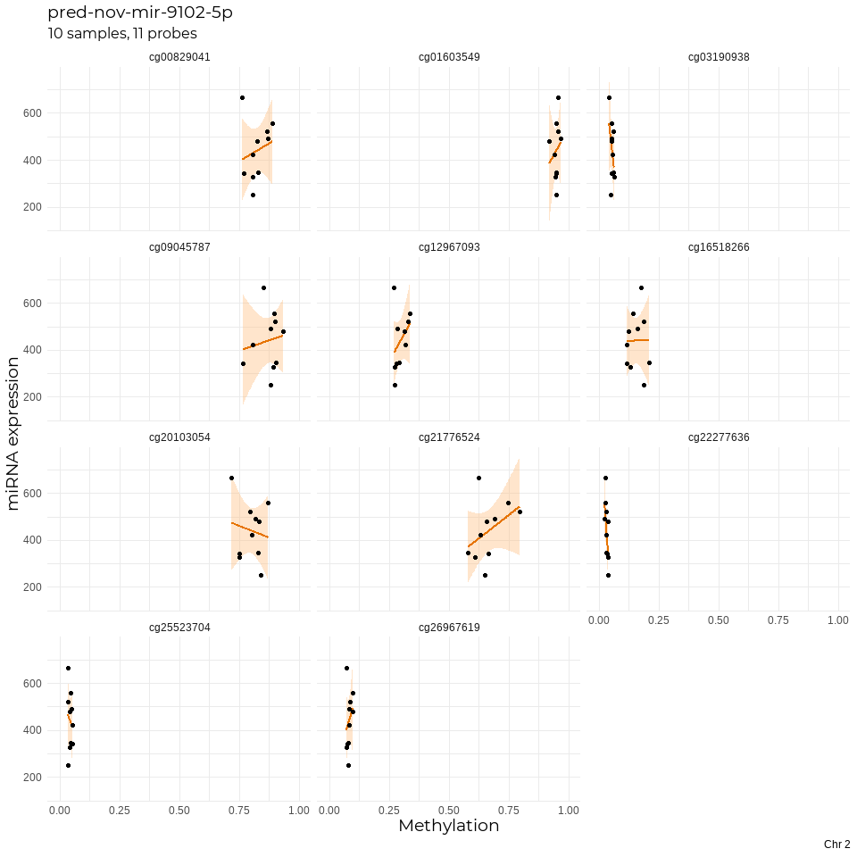<!-- -->

```r
# g_mir_9102_5p <- mir_9102_5p %>% 
#   ggplot(aes(x = Mean, y = `pred-nov-mir-9102-5p`)) +
#   geom_smooth(method = "lm", color = "#e67300",  fill = "#ffbf80") +
#   geom_point() +
#   labs(title = "pred-nov-mir-9102-5p", subtitle = "10 samples, 11 probes", caption = "Chr 2") +
#   my_theme
```


```r
#making a list of all the mir dfs and naming them
mirs <- c("mir_12455_5p", "mir_2569_5p", "mir_4463_3p", "mir_9102_5p")
mirlist <- list(mir_12455_5p, mir_2569_5p, mir_4463_3p, mir_9102_5p)
names(mirlist) <- mirs 
#OR names(mirlist) <- c("mir_12455_5p", "mir_2569_5p", "mir_4463_3p", "mir_9102_5p")

#function to perform Spearman's test over all dataframes in the list
spear_all <- function(x) {
  x <- x %>% 
  spear() %>% 
  left_join(x, by = "Probe_name") %>%
  dplyr::select(1,4:7, rho, pval) %>% 
    mutate(Significant = case_when(
      rho > 0.5 & pval < 0.05 ~ "Yes",
      rho > 0.5 & pval > 0.05 ~ "No",
      rho < -0.5 & pval < 0.05 ~ "Yes",
      rho < -0.5 & pval > 0.05 ~ "No",
      between(rho, -0.5, 0.5) & pval > 0.05 ~ "No"
    )
    )
}

mirlist_stats <- lapply(mirlist, spear_all)
names(mirlist_stats) <- mirs 

# spear_plot <- function(x){
#  x <- x %>% 
#     ggplot(aes(x = rho, y = -log10(pval), colour = Probe_name)) +
#     geom_point() +
#     coord_cartesian(x=c(-1,1)) +
#     geom_vline(xintercept = c(-0.5, 0.5), color = "#333333") +
#     geom_hline(yintercept = c(-log10(0.05)), color = "#333333") +
#     ggtitle(name(x)) +
#     my_theme
# } 

# spear_plot2 <- function(){
#   for (i in 1:length(mirlist_stats)){
#     x <- ggplot(i, aes(x = rho, y = -log10(pval), colour = Probe_name)) +
#       geom_point() +
#       coord_cartesian(x=c(-1,1)) +
#       geom_vline(xintercept = c(-0.5, 0.5), color = "#333333") +
#       geom_hline(yintercept = c(-log10(0.05)), color = "#333333") +
#       ggtitle(names(mirlist_stats[i]))
#     my_theme
#   }
#   return(x)
# }

mirlist_plots <- list() #creating an empty list to store all the plots.

#for loop to make plots for each miRNA. Cannot figure out how to wr loop in a function
for (i in seq_along(mirlist_stats)){
  x <- ggplot(mirlist_stats[[i]], aes(x = rho, y = -log10(pval), colour = Significant)) +
    geom_point() +
    coord_cartesian(x=c(-1,1), y=c(0,1.5)) +
    geom_vline(xintercept = c(-0.5, 0.5), color = "#999999") +
    geom_hline(yintercept = c(-log10(0.05)), color = "#999999") +
    scale_colour_manual(values = c("#333333", "#0099ff"), guide = F) +
    labs(x = "Spearman's Coeeficient (rho)", y = "-log10Pvalue") +
    ggtitle(names(mirlist_stats[i])) +
    my_theme
  mirlist_plots[[i]] <- x
}

mirlist_plots
```

```
## [[1]]
```

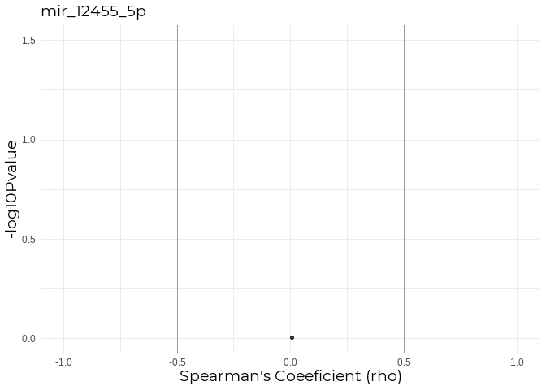<!-- -->

```
## 
## [[2]]
```

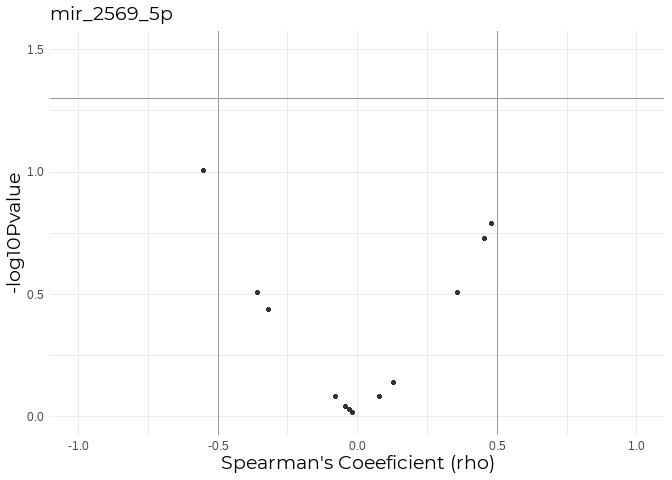<!-- -->

```
## 
## [[3]]
```

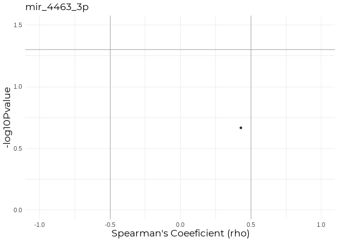<!-- -->

```
## 
## [[4]]
```

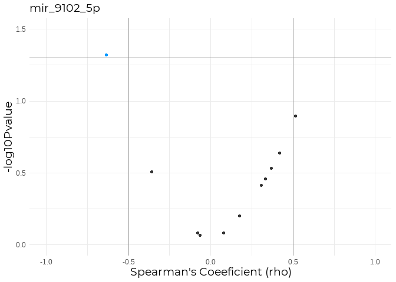<!-- -->

Looks like there is a probe showing moderate correlation for mir_9102_5p. Let's check out it's individual realtionship:  


```r
mirlist_stats$mir_9102_5p %>% 
  filter(Probe_name == "cg22277636") %>% 
  ggplot(aes(x = Probe_value, y = miRNA)) +
  geom_point() +
  geom_smooth(method = "lm", color = "#e67300",  fill = "#ffbf80") +
  labs(title = "mir_9102_5p vs cg22277636", subtitle = "11 probes") +
  my_theme
```

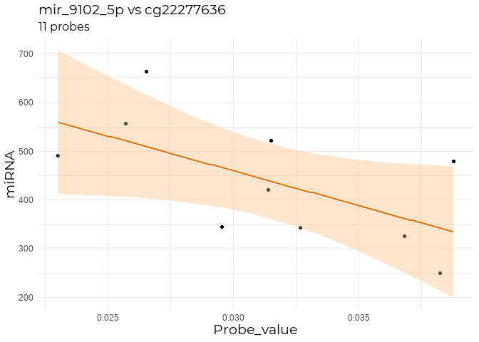<!-- -->

#### 3.4 Pearson's Test  

However, given that our samples actually distribute drom what we can assume is a normally-distributed population, what if we apply the parametric **Pearson's Correlation Test**?  

Following the same exact from before:  


```r
#function to compute the test using arbitary x and y
corfun2 <- function(x, y) {
  corr=(cor.test(x, y, method="pearson", exact = FALSE))
}

#function to apply and display pearson's test by grouping the probes together
pearson <- function(x){
  ddply(x, .(Probe_name), 
        summarise, 
        "rho" = corfun2(miRNA, Probe_value)$estimate, 
        "pval" = corfun2(miRNA, Probe_value)$p.value
  )
}

#ddply(mir_11361_5p, .(Probe_name), summarise, corr = (cor.test(miRNA, Probe_value, method = "spearman")), "name" = names(corr))

mir_11361_5p_pearson <-  Probes %>% 
  filter(miRNA == "pred-nov-mir-11361") %>% 
  inner_join(eDat_mSet, by = "Name")  %>% 
  dplyr::select(!(2:7)) %>% 
  column_to_rownames(var = "Name")

dim(mir_11361_5p_pearson)
```

```
## [1] 13 14
```

```r
mir_11361_5p_pearson <- as.data.frame(t(mir_11361_5p_pearson)) 

mir_11361_5p_pearson <- mir_11361_5p_pearson  %>% 
  rownames_to_column(var = "ID") %>%
  mutate(Mean = rowMeans(.[,-1])) %>% 
  left_join(eDat_RNA, by = "ID")  %>% 
  dplyr::select(1:15, "pred-disov-mir-11361-5p") %>% #select by adding +2 to the number of samples (mean column + miRNA column)
  drop_na() %>% 
  pivot_longer(cols = 2:14, names_to = "Probe_name", values_to = "Probe_value") %>% #exclude c1 (ID), and the last two (mean and miRNA, hence 2:14)
  dplyr::rename(miRNA = 3) 

mir_11361_5p_pearson <- mir_11361_5p_pearson %>% 
  pearson() %>% 
  left_join(mir_11361_5p_pearson, by = "Probe_name") 

mir_11361_5p_pearson <- mir_11361_5p_pearson %>%
  dplyr::select(1,4:7, rho, pval)

head(mir_11361_5p_pearson)
```

```
##   Probe_name      ID      Mean   miRNA Probe_value        rho      pval
## 1 cg01678049 FT52_cv 0.2802386 426.683  0.07139544 0.08176651 0.8223268
## 2 cg01678049 FT60_cv 0.2947149 538.873  0.05301600 0.08176651 0.8223268
## 3 cg01678049 FT65_cv 0.2852580 944.562  0.07487582 0.08176651 0.8223268
## 4 cg01678049 FT41_cv 0.2747484 225.934  0.05258073 0.08176651 0.8223268
## 5 cg01678049 FT73_cv 0.2886500 263.153  0.07841936 0.08176651 0.8223268
## 6 cg01678049 FT74_cv 0.2778375 454.954  0.07432810 0.08176651 0.8223268
```

```r
mir_11361_5p_pearson %>% 
  dplyr::count(rho, pval)
```

```
##             rho      pval  n
## 1  -0.358796273 0.3086076 10
## 2  -0.253775158 0.4792581 10
## 3  -0.088945655 0.8069634 10
## 4  -0.003355872 0.9926591 10
## 5   0.081766509 0.8223268 10
## 6   0.107016254 0.7685646 10
## 7   0.121626730 0.7378425 10
## 8   0.129288655 0.7218613 10
## 9   0.285149668 0.4245272 10
## 10  0.314695135 0.3758229 10
## 11  0.390501669 0.2645537 10
## 12  0.413884845 0.2344277 10
## 13  0.488569807 0.1519034 10
```

```r
g2 <- mir_11361_5p_pearson %>% 
  mutate(Significant = case_when(
    rho > 0.5 & pval < 0.05 ~ "Yes",
    rho > 0.5 & pval > 0.05 ~ "No",
    rho < -0.5 & pval < 0.05 ~ "Yes",
    rho < -0.5 & pval > 0.05 ~ "No",
    between(rho, -0.5, 0.5) & pval > 0.05 ~ "No"
  )
  ) %>% 
  ggplot(aes(x = rho, y = -log10(pval), colour = Significant)) +
  geom_point() +
  coord_cartesian(x=c(-1,1)) +
  geom_vline(xintercept = c(-0.5, 0.5), color = "#999999") +
  geom_hline(yintercept = c(-log10(0.05)), color = "#999999") +
  scale_colour_manual(values = c("#333333", "#0099ff"), guide=F) +
  labs(title = "pred-disov-mir-11361-5p_Pearson Correlation", subtitle = "10 samples, 13 probes", x = "Pearson's Coeeficient (rho)", y = "-log10Pvalue", caption = "Chr 5") +
  my_theme

ggarrange(g1,g2)
```

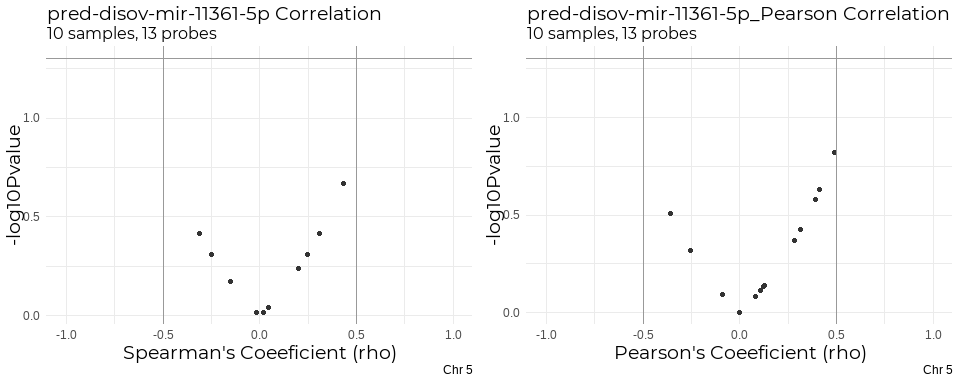<!-- -->


